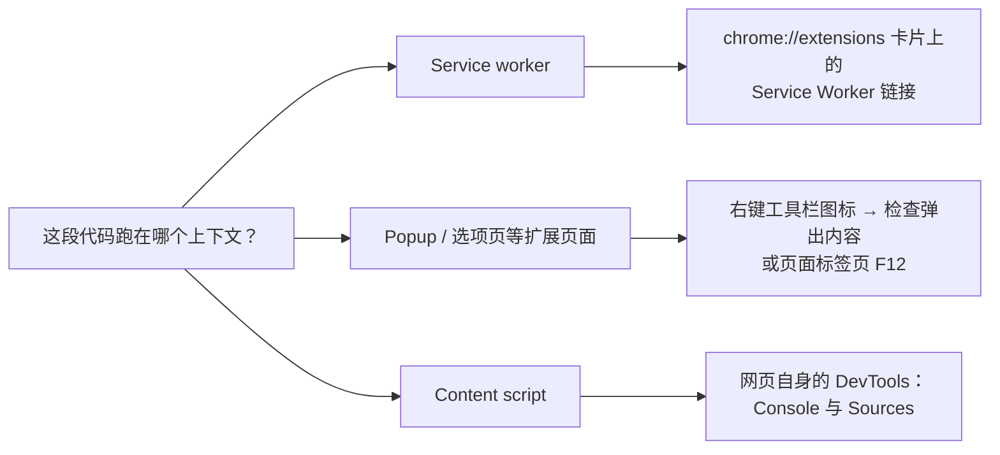

import { Meta } from '@storybook/addon-docs/blocks';

<Meta id="debugging" title="起步/调试扩展" name="Docs" />

# 调试扩展

扩展没有覆盖一切的总控制台：service worker、popup、content script 运行在彼此独立的上下文里，各自有自己的 DevTools，日志和报错也落在不同位置。调试扩展的第一步不是打开 DevTools，而是判断「这段代码跑在哪个上下文」，再去打开对应的那个。[扩展架构](?path=/docs/extension-architecture--docs)一课讲过各上下文分别是什么，本课只回答两件事：去哪儿看、报错怎么读。



「判断上下文 → 打开入口」的完整对照，也是本课的回查表：

| 代码运行在 | 打开哪个 DevTools | 日志与报错落在哪 |
| --- | --- | --- |
| Service worker | chrome://extensions 卡片上的 Service Worker 链接 | 该 DevTools 的 Console；未捕获错误同时记入错误页 |
| Popup | 右键工具栏图标 → 检查弹出内容（Inspect popup） | 打开的专属 DevTools Console；运行时错误同时记入错误页 |
| 选项页等扩展页面 | 页面所在标签页内按 F12 | 页面 Console；运行时错误同时记入错误页 |
| Content script | 目标网页内按 F12 | 网页的 Console 与 Sources 的 Content scripts 分区；不进错误页 |
| chrome.storage | 上述任一扩展上下文的 DevTools → Application → Storage → Extension Storage | 面板表格，或在 Console 直接查询 |

## chrome://extensions 总控台

chrome://extensions 是扩展的调试中转站：重新加载扩展、发现报错、进入 service worker 都从这里开始。打开右上角开发者模式（Developer mode）后，页面提供：

- **加载已解压的扩展程序**（Load unpacked）：加载本地目录；路径或 manifest 写错时加载失败并直接给出红字提示。
- **更新**（Update）：一次重新加载全部已解压的扩展，改完多个扩展后用它省去逐个点击。
- 每张扩展卡片：**重新加载**（Reload）按钮、**Service Worker** 链接、出现报错后的**错误**（Errors）按钮、**详情**（Details）页。

**重新加载是调试循环的起点。** 改完代码必须重新加载扩展才会生效。重新加载会停止并重新注册 service worker、关闭打开中的 popup；但已注入到网页里的 content script 不会自动更新——刷新网页才会注入新代码。

### 错误页

卡片上的**错误**（Errors）按钮在出现报错后变红，点击进入错误页：逐条列出错误与警告，每条附来源文件、行号与调用堆栈；右上角 Clear all 清空列表。

错误页只记录**扩展自身上下文**里发生的运行时错误，以及 `console.error`、`console.warn` 的输出；content script 发生在网页里，它的报错不会出现在这里。另外两点边界：

- manifest 彻底写错（如 JSON 损坏、缺少 `version`）时扩展加载失败，红字直接弹在 chrome://extensions 页面上；而权限名拼错这类问题扩展仍能加载，靠错误按钮提示，例如 `Permission 'activetab' is unknown or URL pattern is malformed.`。
- 重新加载扩展不会清除错误页条目，确认修复后手动 Clear all，避免旧报错干扰判断。

想验证一遍：在 service worker 代码里故意抛一个异常，重新加载扩展，卡片即出现红色错误按钮，错误页里能看到完整的 `Uncaught TypeError` 与堆栈。

## 调试 service worker

打开方式：点击 chrome://extensions 卡片上的 **Service Worker** 链接。service worker 处于休眠状态时链接仍可点击，点击会唤醒它并打开专属 DevTools；唤醒意味着顶层代码重新执行一遍，日志会再次出现。

这个 DevTools 就是 service worker 的完整调试环境：

- **Console**：查看日志，也能直接执行代码验证 API 行为，例如 `chrome.runtime.getManifest()`。
- **Sources**：给事件处理函数打断点，事件触发时暂停。
- **Network**：查看 service worker 发出的 fetch 请求。

两个影响判断的边界：

- **检视期间 service worker 保持活跃**，不会按正常节奏休眠；想观察真实的休眠与唤醒行为，先关掉这个 DevTools。service worker 闲置约 30 秒后休眠，收到事件或 API 调用会重置计时，完整规则见 [Service Worker](?path=/docs/service-worker--docs) 一课。
- 重新加载扩展后，已打开的 service worker DevTools 窗口随之失效，重新点一次链接即可。若 service worker 注册失败（例如 manifest 里路径写错），DevTools 打不开——先去错误页修 manifest。

## 调试 popup 与扩展页面

popup 的入口藏在工具栏图标上：**右键图标 → 检查弹出内容（Inspect popup）**，打开的 DevTools 会保持 popup 展开，可以慢慢查看 Console、Elements 和 Network。

popup 关闭后 DevTools 仍在时，两种常用补救：

- 在已打开的 DevTools 的 **Network** 面板点刷新按钮，它会重新加载 popup 而不关闭 DevTools——popup 的启动请求往往快到来不及手动打开 DevTools，官方教程推荐的正是这个做法。
- 把 popup 页面当普通页面调试：在标签页直接打开 `chrome-extension://<扩展 ID>/popup.html`，按 F12。

选项页、替换页等扩展页面本就是 `chrome-extension://` 页面：右键工具栏图标 → 选项，或从详情页进入扩展程序选项，在标签页中打开后按 F12 即可；它们抛出的运行时错误同样会记入错误页。

## 调试 content script

content script 寄生在网页里：它的日志和报错出现在**网页自己的 DevTools** 中，不会触发 chrome://extensions 的错误按钮。在目标网页按 F12：

- **Console**：能看到 content script 的日志和未捕获错误，来源链接指向扩展的文件，可与页面自己的日志区分开。
- **Console 顶部的 JS 上下文下拉**（默认显示 top）：切换到扩展的上下文后执行的表达式，会跑在 content script 的隔离环境里。
- **Sources 面板文件树的 Content scripts 分区**：列出已注入的文件，可以直接查看和打断点。

改了 content script 代码后，需要重新加载扩展**并**刷新网页才能看到新行为。

## 查看 chrome.storage

两条入口，看到的是同一份数据：

- **面板**：在任一扩展上下文的 DevTools 中打开 **Application → Storage → Extension Storage**（Chrome 132 起提供；扩展需声明 `storage` 权限才会出现）。表格支持按键值筛选、双击编辑、增删条目，改完可点顶部的 Refresh 刷新读数。`chrome.storage.session` 即使对 content script 不可访问，在 DevTools 里也始终可见。
- **控制台**：在 service worker 或 popup 的 DevTools Console 中直接查询：

```js
// 在 service worker 或 popup 的 DevTools Console 中执行
await chrome.storage.local.get(null); // 列出 local 分区全部键值
await chrome.storage.sync.get(null);  // 列出 sync 分区全部键值
```

service worker 休眠时无法在它的 Console 里查询，此时用卡片链接唤醒它，或改用 popup 的 DevTools。chrome.storage 各分区的读写与监听用法见[存储](?path=/docs/storage--docs)一课。

## 最佳实践

- **改代码后的标准三步：重新加载扩展 → 刷新已打开的网页 → 重开对应 DevTools。** 三步分别解决三类「改了没生效」：service worker 未重启、旧 content script 仍在跑、旧 DevTools 已失联。
- **按错误类型选落点。** 加载失败（manifest 语法、文件路径）看 chrome://extensions 的红字与错误页；扩展自身上下文的运行时错误看对应 Console 加错误页；content script 只看网页 Console。先确认上下文再找 DevTools，不要在网页 Console 里找 service worker 的日志。

## 常见问题

- 在扩展里写的 `console.log` 找不到输出
  日志落在了代码所在上下文自己的 DevTools 里。对照本课开头的参考表确认上下文后换对应的 Console；最常见的错位是把 service worker 的日志拿到网页 Console 里找。
- popup 一点别处就关闭，来不及调试
  用右键 → 检查弹出内容打开 DevTools，popup 在其展开期间保持打开；若已错过时机，在 DevTools 的 Network 面板点刷新重新加载 popup，或在标签页打开 `chrome-extension://<扩展 ID>/popup.html` 调试。
- 改了 content script，页面行为没变；或刷新页面后报 `Extension context invalidated.`
  重新加载扩展后，已打开网页里跑的还是旧 content script，与扩展的连接已断开。重新加载扩展并刷新网页即可；这是重载的正常副作用，不是代码 bug。
- 控制台出现 `Unchecked runtime.lastError: Could not establish connection. Receiving end does not exist.`
  发送消息时接收端没有监听者：content script 未注入（页面不匹配 `matches`）、发送时机太早，或 `tabId` 指错了目标。先确认接收端已注册监听再发送。消息收发的排查见[消息通信](?path=/docs/messaging--docs)一课。
- 控制台出现 `Unchecked runtime.lastError: The message port closed before a response was received.`
  `onMessage` 回调声明了异步响应（返回 `true`）却始终没有调用 `sendResponse`。补上响应路径，或在不打算回应时不要返回 `true`。
- service worker 里的断点和日志「从不触发」
  service worker 可能已休眠——点卡片上的 Service Worker 链接唤醒后再触发事件；若仍不触发，检查事件监听器是否注册在 service worker 顶层，休眠后只有顶层注册的监听器能唤醒它，详见 [Service Worker](?path=/docs/service-worker--docs) 一课。
- 加载页面时报 `Refused to execute inline script` 或 `... violates the following Content Security Policy directive: script-src 'self'`
  Manifest V3 禁止扩展页面使用内联脚本与远程代码。把 HTML 里的 `<script>` 内容移入外部 js 文件，去掉远程 CDN 引用，再重新加载扩展。

## 总结回顾

摘要：

扩展的代码分布在多个独立上下文中，调试入口按上下文划分：chrome://extensions 承担重新加载与错误总览，卡片上的 Service Worker 链接打开后台的专属 DevTools，popup 靠右键图标的检查弹出内容，选项页等扩展页面按普通标签页 F12，content script 的日志和断点都在网页自己的 DevTools 里，chrome.storage 通过 Application 面板的 Extension Storage 或 Console 查询。错误页只记录扩展自身上下文的运行时错误与 console.error / console.warning，重新加载不清除条目。改代码后的标准动作是重新加载扩展、刷新网页、重开 DevTools。

一句话：

> 先判断代码跑在哪个上下文，再打开对应的 DevTools——报错落在哪里由上下文决定，而不是由哪里方便决定。

知识要点：

- chrome://extensions 卡片上有哪些调试入口，各自通向什么？
- 为什么 service worker 的日志要去卡片链接打开的 DevTools 里找，网页 Console 里看不到？
- content script 的报错为什么不触发错误按钮？应该去哪儿看？
- popup 关闭后，怎样在不丢失 DevTools 的情况下重新加载它？
- 在哪里查看和编辑 chrome.storage 的值？需要什么前提？
- 两类 `Unchecked runtime.lastError` 报错分别在提示什么？

## 参考资料

- [Debug extensions（官方调试教程）](https://developer.chrome.com/docs/extensions/get-started/tutorial/debug)：各上下文调试入口、错误页记录范围、检视保活、Network 面板刷新 popup。
- [View and edit extension storage（DevTools 官方文档）](https://developer.chrome.com/docs/devtools/storage/extensionstorage)：Extension Storage 面板的可用版本、支持的操作与边界。
- [Extension service worker lifecycle（官方概念文档）](https://developer.chrome.com/docs/extensions/develop/concepts/service-workers/lifecycle)：30 秒闲置休眠与计时重置规则。
