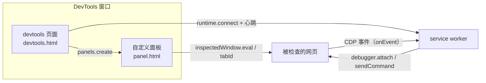

import { Canvas, Controls, Meta } from '@storybook/addon-docs/blocks';
import * as DevtoolsExtension from './devtools-extension.stories';

<Meta of={DevtoolsExtension} name="Docs" />

# DevTools 扩展

DevTools 扩展是把界面加进 Chrome DevTools 的扩展类型：manifest 里的 `devtools_page` 指定一个 DevTools 页面，它在 DevTools 窗口打开时创建，用来创建自定义面板、读取和操作被检查的窗口。另一条线是 `chrome.debugger`：它把 Chrome DevTools Protocol（CDP）——也就是 DevTools 自己控制页面的那套协议——开放给扩展，让扩展做协议级的调试与自动化。本课回答三个问题：界面怎么进 DevTools、怎么和被检查的页面以及 service worker 打交道、怎么用调试协议做扩展 API 做不到的事。读完你应该能预测：创建一个 panel.html 后它什么时候存在、什么时候销毁，`eval` 的表达式在哪里求值，一次 `attach` 之后用户会看到什么。



本课两个半场的入口与默认值如下，后续小节展开：

| 入口 | 作用 | 默认值与关键约束 |
| --- | --- | --- |
| manifest `devtools_page` | 指定 DevTools 页面 | 包内本地 HTML；随 DevTools 窗口创建与销毁 |
| `chrome.devtools.panels.create(title, iconPath, pagePath)` | 在 DevTools 工具栏创建顶级面板 | 仅 DevTools 窗口内的页面可调用；面板页就是扩展页面 |
| `ExtensionPanel.onShown(window)` | 用户切到面板 | 面板页每次显示重建；回调参数是面板 window |
| `chrome.devtools.inspectedWindow.eval(expr, options?)` | 在被检查页面执行表达式 | 默认主框架；返回值必须可 JSON 化 |
| `inspectedWindow.tabId` | 被检查标签页 id | 传给 service worker 做 `tabs` / `debugger` 调用 |
| `chrome.debugger.attach(target, requiredVersion)` | 附加 CDP 会话 | 参考示例取 `'0.1'`；主版本一致、次版本不低于才成功 |
| `chrome.debugger.sendCommand(target, method, params?)` | 发送 CDP 命令 | `method` 须在开放领域内；返回响应体 |
| `chrome.debugger.onEvent(source, method, params)` | 协议事件流 | 按 `source.tabId` 路由；须在 service worker 顶层注册 |
| `"debugger"` 权限 | 使用 `chrome.debugger` | 安装警告：读取与更改所有网站上的数据 |

## 快速上手

用本课目录下的 `extension/` 走最小闭环（六个文件加一个 19×19 图标，可直接加载）。做四件事：manifest 声明 `devtools_page` 与 `"debugger"` 权限、DevTools 页面创建面板并与 service worker 相连、面板页读页面标题并触发调试、service worker 负责 CDP 会话。

**第一步：manifest.json 声明入口。**

```json
{
  "manifest_version": 3,
  "name": "devtools-cdp-demo",
  "version": "1.0",
  "permissions": ["debugger"],
  "background": { "service_worker": "sw.js" },
  "action": {},
  "devtools_page": "devtools.html"
}
```

`devtools_page` 指向的页面内容不展示，它只是脚本宿主；`"debugger"` 权限独立声明，缺了它 `chrome.debugger` 不可用（权限取舍见 [Manifest 与权限](?path=/docs/manifest-permissions--docs)）。

**第二步：devtools.html 引一个 devtools.js，创建面板并连上 service worker。**

```js
// devtools 页面随 DevTools 窗口创建与销毁，可以承担长期任务
chrome.devtools.panels.create('CDP 面板', 'icon.png', 'panel.html', (panel) => {
  // 面板页每次显示都会重建，onShown 回调参数就是面板页面的 window
  panel.onShown.addListener((panelWindow) => {
    console.log('面板显示，window 来自参数', panelWindow === window);
  });
});

// 端口不会自动保活 service worker，按官方示例周期发心跳维持连接
const connection = chrome.runtime.connect({ name: 'devtools-page' });
setInterval(() => connection.postMessage({ type: 'heartbeat' }), 30000);
```

**第三步：panel.html / panel.js 与被检查的页面交互。**

```js
// 面板页是普通扩展页面，可以直接调 chrome.* API
document.querySelector('#title').addEventListener('click', () => {
  // 在被检查页面的主框架求值，返回值必须是可 JSON 化的对象，否则结果为异常
  chrome.devtools.inspectedWindow.eval(
    'document.title',
    (result, isException) => {
      log(
        isException
          ? `eval 异常：${JSON.stringify(result)}`
          : `页面标题：${JSON.stringify(result)}`,
      );
    },
  );
});

// 调试动作交给 service worker：把被检查标签页的 tabId 发过去
document.querySelector('#attach').addEventListener('click', () => {
  chrome.runtime.sendMessage({
    type: 'debugger-attach',
    tabId: chrome.devtools.inspectedWindow.tabId,
  });
});
```

**第四步：sw.js 里跑 CDP 会话。**

```js
// onEvent / onDetach 必须注册在 service worker 顶层，否则会话期间接不住
chrome.debugger.onEvent.addListener((source, method, params) => {
  console.log(`[${source.tabId}] ${method}`, params);
});

chrome.debugger.onDetach.addListener((source, reason) => {
  console.log(`[${source.tabId}] 调试会话结束，reason = ${reason}`);
});

// 面板发来的消息在这里执行；requiredVersion 取参考示例的 "0.1"
async function attach(tabId) {
  await chrome.debugger.attach({ tabId }, '0.1');
  await chrome.debugger.sendCommand({ tabId }, 'Network.enable', {});
}
```

**加载与观察：** 到 `chrome://extensions` 点「加载已解压的扩展程序」选本课的 `extension/`，打开任一网页按 F12：

| 操作 | 可观察结果 |
| --- | --- |
| 打开任意网页的 DevTools | 工具栏出现「CDP 面板」标签——`devtools_page` 只在窗口打开时运行，不打开就没有 |
| 切到「CDP 面板」，点「读取页面标题（eval）」 | 面板显示当前页面标题；这是从 DevTools 页面向被检查页面求值 |
| 点「attach 调试器」 | 目标标签页的 DevTools 窗口顶部出现调试横幅；从 chrome://extensions 卡片打开 service worker 的 DevTools Console，可看到 `attach` 与 `Network.enable` 的响应，随后 `Network.*` 事件持续打进来 |
| 点「detach 调试器」 | 横幅消失，SW Console 打出分离收尾日志 |
| attach 成功后，再在目标标签页打开 DevTools | 横幅消失，SW Console 打出 `reason = canceled_by_user`——浏览器终止了扩展的会话 |
| 先在目标标签页打开 DevTools，再点「attach」 | 失败：每个标签页同时只能有一个调试器 |
| 在 `chrome://extensions` 页面点「attach」 | 失败：只能附加 HTTP/HTTPS 页面 |

## DevTools 扩展结构

### devtools_page：DevTools 的入口

`devtools_page` 是 manifest 里的一个字符串字段，指向包内 HTML。它的页面在 **DevTools 窗口打开时创建、窗口关闭时销毁**，并且不随被检查页面的导航而重建——一个标签页对应自己的 DevTools 窗口，窗口里的 DevTools 页面是长期存活的扩展页面。这决定了它与 popup 的本质分工：popup 点开即存在、关闭即销毁，适合一次性动作；DevTools 页面可以在用户盯着调试器的整个过程中持续收集数据、维护连接。

几条边界：

- 页面内容不展示（DevTools 窗口里看不到它的 DOM），它只是脚本宿主；界面一律通过面板与侧栏呈现。
- 只有加载在 DevTools 窗口内的页面（devtools 页面、面板页、侧栏页）能访问 `chrome.devtools.*`；content script 和普通扩展页面不行。
- Manifest V2 同样支持 `devtools_page`，本课机制一致；差异集中在后台模型（persistent background page → service worker）与旧消息 API（`chrome.extension.*` → `chrome.runtime.*`），`chrome.devtools.*` 与 `chrome.debugger.*` 的行为不变。另注意 Chrome 152+ 起，声明 `devtools_page` 的扩展也启用了 `browser.*` 命名空间（此前因 polyfill 兼容被整体关闭）。

### 面板：panels.create 与面板页面

```js
chrome.devtools.panels.create(
  'CDP 面板',        // title：工具栏标签文字
  'icon.png',        // iconPath：包内相对路径
  'panel.html',      // pagePath：面板页面，包内相对路径
  (panel) => {
    // 第四个回调参数就是 ExtensionPanel；Chrome 152+ 起也可直接拿 Promise 返回值
  },
);
```

`ExtensionPanel` 的成员（`create` 自 Chrome 152+ 起也可用 Promise 返回值，此前用第四个回调参数，两者行为一致）：

| 成员 | 说明 |
| --- | --- |
| `onShown(window)` | 用户切到面板；回调参数是**面板页面的 window** |
| `onHidden()` | 用户切走面板 |
| `onSearch(action, queryString?)` | 面板内的搜索动作：开始、结果导航、取消 |
| `createStatusBarButton(iconPath, tooltipText, disabled)` | 在面板底部加按钮，返回 `Button`（`onClicked`） |
| `show()` | 代码激活本面板对应的标签页（Chrome 140+） |

关键判断是**面板页面的生命周期**：它只在面板显示期间存在，用户切走就销毁，切回来重新创建——这正是 `onShown` 要把 `window` 交给你、状态不能只放在面板页面内存里的原因。下面的演算把三种上下文（devtools 页面、面板页面、service worker）和端口放在一起切换：

<Canvas of={DevtoolsExtension.PanelLifecycle} />
<Controls of={DevtoolsExtension.PanelLifecycle} />

| 读者操作 | 可观察证据 |
| --- | --- |
| 把「DevTools 窗口」从「打开」切到「关闭」 | devtools 页面、面板页面同时销毁，端口断开，SW `onDisconnect` 触发、恢复休眠 |
| 打开窗口，「当前激活面板」在「Elements」「Console」「扩展面板」间切换 | 切到扩展面板：`panel.html` 创建并触发 `onShown`；切走：`panel.html` 销毁并触发 `onHidden` |
| 关闭「端口心跳」 | 端口断开、SW 休眠、`openCount` 归零——端口不会自动保活 service worker |
| 打开 Show code | 看到该 Canvas 实际执行的 `panel-lifecycle.ts` |

真实核对：加载 `extension/`，打开网页 DevTools 的同时从 chrome://extensions 卡片打开 service worker 的 DevTools Console：开关网页的 DevTools 窗口，SW Console 交替出现「DevTools 页面已连接 / 断开连接」；来回切换 DevTools 面板标签，切回「CDP 面板」时输出区的创建时间每次刷新——面板页面确实是随显示重建的。

侧栏（sidebar pane）是另一种注入点：`chrome.devtools.panels.elements.createSidebarPane(title, cb)` 与 `.sources` 在 Elements / Sources 面板下加侧栏，侧栏内容可用 `setPage(path)` 挂 HTML 页、`setObject(json)` 显示 JSON、`setExpression(expr)` 显示在页面上下文求值的表达式。另外 `chrome.devtools.panels.themeName`（Chrome 59+）给出当前主题名（`'default'` 或 `'dark'`），面板可以据此调色；想读 Network 面板的数据用独立的 `chrome.devtools.network`（`getHAR()` 以 HAR 格式返回请求）。

边缘成员用到再查：`panels.setOpenResourceHandler(cb)` 安装「用户点击 DevTools 里的资源链接时谁来打开」的处理器（同一时刻只有一个生效），`panels.openResource(url)` 让扩展直接打开某个资源；独立的 `chrome.devtools.recorder` 扩展 Recorder 面板，`chrome.devtools.performance` 只读 Performance 面板的录制状态。

### inspectedWindow：与被检查的页面交互

`chrome.devtools.inspectedWindow.eval` 在**被检查页面的主框架**里求值，与 DevTools console 同一执行上下文，因此 console 的 Console Utilities 同样可用：

```js
// $0 是 Elements 面板里选中的元素；inspect() 会把参数送进 Elements 面板
chrome.devtools.inspectedWindow.eval("inspect($$('head script')[0])");
```

`eval(expression, options?)` 的选项与错误形态：

| 选项 | 默认 | 说明 |
| --- | --- | --- |
| `frameURL` | 主框架 | 指定后改到 URL 匹配的 iframe 里执行 |
| `useContentScriptContext` | `false` | 用本扩展 content script 的上下文执行；未注入时以 `E_NOTFOUND` 异常结束 |
| `scriptExecutionContext` | — | Chrome 107+；按扩展源选择 content script 上下文，优先级高于上一项 |

返回值必须是可 JSON 化的对象，否则以异常结束：`eval` 自 Chrome 151+ 起返回 Promise（此时 reject），此前用 `(result, isException)` 回调；`isException` 同时覆盖 DevTools 侧错误（`isError` 为 true 且带 `code`）与页面侧 JavaScript 异常两种情况。下面的演算把表达式、执行框架和上下文三个变量交给同一个被检查页面：

<Canvas of={DevtoolsExtension.InspectedWindowEval} />
<Controls of={DevtoolsExtension.InspectedWindowEval} />

| 读者操作 | 可观察证据 |
| --- | --- |
| 「执行框架」切到「iframe（frameURL 匹配）」 | `document.images.length` 从 3 变 1、`location.href` 变成 iframe 的地址——表达式确实在 iframe 内求值 |
| 「表达式」选 `document.body` | 结果区变红：表达式必须返回可 JSON 化对象，DOM 节点不行 |
| 「表达式」选 `$0.tagName`，关闭「已选中元素」 | 抛出 `ReferenceError: $0 is not defined` |
| 打开「useContentScriptContext」，再关闭「content script 已注入」 | 结果区给出 `E_NOTFOUND`——切上下文前必须先注入 content script |
| 打开 Show code | 看到该 Canvas 实际执行的 `inspected-window-eval.ts` |

`inspectedWindow` 上另有三组成员：`tabId`（被检查标签页 id，与 `chrome.tabs.*`、`chrome.debugger` 打交道的桥）；`reload(reloadOptions)`（`ignoreCache` 绕过缓存、`injectedScript` 在页面自身脚本前注入每帧——注意用户手动 Ctrl+R 再次加载时不会注入、`userAgent` 覆写 UA）；`getResources()` 与 `onResourceAdded`（页面的资源清单与新增资源事件，`Resource` 对象上还能用 `getContent()` / `setContent(content, commit)` 查看乃至改写页面资源）。

### 与 service worker 通信

DevTools 页面是长期存活的扩展页面，service worker 是事件驱动、会休眠的（规则见 [Service Worker](?path=/docs/service-worker--docs)），两者的分工与通信方式：

- **长连接（port）：** DevTools 页面 `chrome.runtime.connect({ name: 'devtools-page' })`，SW 侧 `chrome.runtime.onConnect` 计数——每个标签页的 DevTools 窗口都会连一次，计数归零即全部关闭。端口不会自动保活 SW，官方做法是周期性 `postMessage` 心跳维持（见 `extension/devtools.js`）。
- **一次性消息：** `chrome.runtime.sendMessage`；把 `inspectedWindow.tabId` 随消息一起发，SW 就能调用 `chrome.tabs.*`、`chrome.debugger` 这类以标签页为目标的能力。
- **注入 content script：** 在 DevTools 页面里 `chrome.scripting.executeScript({ target: { tabId: chrome.devtools.inspectedWindow.tabId }, files: [...] })`，与消息通信的其他形态（长连接、端口断连处理）见[消息通信](?path=/docs/messaging--docs)一课。
- **一个反直觉点：** 页面里通过 `eval` 或注入 `<script>` 直接执行的代码**不能**用 `runtime.sendMessage` 与 DevTools 页面通信，官方推荐以 content script 为中介、双方用 `window.postMessage`。

## chrome.debugger：协议级调试

`chrome.debugger` 是 CDP 的备用传输通道：attach 到一个目标后，用协议命令（`sendCommand`）和协议事件（`onEvent`）与页面交互。能用它做什么超出本课范围——DevTools 自己的面板、Puppeteer、Lighthouse 都建在 CDP 上，本课只落到「能做什么、边界在哪」，具体命令查[协议文档](https://chromedevtools.github.io/devtools-protocol/)。

### attach 与 detach

```js
// 需要 manifest 的 "debugger" 权限
await chrome.debugger.attach({ tabId }, '0.1');      // 附加成功
const response = await chrome.debugger.sendCommand({ tabId }, 'Page.navigate', { url: 'https://example.com' });
await chrome.debugger.detach({ tabId });               // 分离
```

- `attach(target, requiredVersion)`：`Debuggee` 用 `tabId` 定位标签页；`requiredVersion` 要求被调试方协议**主版本一致、次版本不低于**（参考示例取 `'0.1'`）。attach 到其他扩展的后台页只在 `--silent-debugger-extension-api` 开关下可行。
- 附加成功的可见后果：目标标签页的 DevTools 窗口出现调试横幅（「正在调试此浏览器」，提供取消入口），这是 `chrome.debugger` 与页面交互时用户唯一能直接看到的信号。
- `detach(target)` 结束会话；此外标签页关闭、用户在目标标签页打开 DevTools 都会让**浏览器**终止会话（见下文 `onDetach`）。
- 硬边界：只能附加 HTTP/HTTPS 页面；每个标签页同时只能有一个调试器；企业策略可以按全有或全无的方式在 attach 时拒绝（`runtime_blocked_hosts` → `Host access is restricted by policy.`，截图 / DLP 限制 → `Screenshot capture is restricted by policy.`）。
- 权限的代价：`"debugger"` 的安装警告是「读取与更改所有网站上的数据」，比大多数具名权限都重，建议放 `optional_permissions` 按需申请（见[Manifest 与权限](?path=/docs/manifest-permissions--docs)）。

### sendCommand 与 CDP 领域

`sendCommand(target, method, commandParams?)` 返回 `Promise<object | undefined>`，值是协议响应体；发送失败（如命令不在开放领域、目标不可调试）时 Promise reject。并非所有协议领域都开放给扩展，当前开放的领域为：

Accessibility、Audits、CacheStorage、Console、CSS、Database、Debugger、DOM、DOMDebugger、DOMSnapshot、Emulation、Fetch、IO、Input、Inspector、Log、Network、Overlay、Page、Performance、Profiler、Runtime、Storage、Target、Tracing、WebAudio、WebAuthn。

配合起来的典型写法——打开 Network 域后事件才会派发，随后在 `onEvent` 里逐个收：

```js
await chrome.debugger.sendCommand({ tabId }, 'Network.enable', {});
// 之后 onEvent 会收到 Network.requestWillBeSent / Network.responseReceived / ...
```

Chrome 125+ 起支持 flat sessions：不用再次 `attach`，在 `sendCommand` 的参数里加 `sessionId` 即可直接寻路子会话（先用 `Target.setAutoAttach` 带 `flatten: true` 让子框架自动附加）。

### onEvent 与 onDetach

`chrome.debugger.onEvent.addListener((source, method, params) => { ... })`：`source` 标识来源会话（`tabId`、可选 `sessionId`），`method` 如 `'Network.responseReceived'`。监听会话的扩展进程会因此被唤醒，所以监听器必须注册在 service worker **顶层**（规则见 [Service Worker](?path=/docs/service-worker--docs)）。`onDetach.addListener((source, reason) => { ... })` 在浏览器终止会话时触发：标签页关闭是 `'target_closed'`，除此之外（用户在目标标签页打开 DevTools、横幅上点取消）是 `'canceled_by_user'`。

下面的演算把一次会话从附加推到分离，并覆盖三类边界：

<Canvas of={DevtoolsExtension.DebuggerSession} />
<Controls of={DevtoolsExtension.DebuggerSession} />

| 读者操作 | 可观察证据 |
| --- | --- |
| 「会话阶段」从「未附加」推到「已附加（横幅出现）」 | 浏览器示意出现调试横幅，时间线前两步完成，状态区显示 `requiredVersion "0.1"` |
| 再推到「已发送 Network.enable」 | 时间线显示命令已发、`Network.requestWillBeSent` / `Network.responseReceived` 事件到达，状态区「最后事件」更新 |
| 「目标标签页」切到 `chrome://extensions` | 时间线第一步变红「失败：只能附加 HTTP/HTTPS 页面」，横幅不出现、后续步骤保持未触发 |
| 阶段推到「已分离」，「结束方式」选「用户在目标标签页打开 DevTools」 | `onDetach reason` 为 `canceled_by_user`；选「目标标签页关闭」则为 `target_closed` |
| 打开 Show code | 看到该 Canvas 实际执行的 `debugger-session.ts` |

真实核对：运行 `extension/`，在 example.com 上点「attach」，然后在该标签页上打开 DevTools——横幅消失、SW Console 打出 `reason = "canceled_by_user"`：不是扩展代码出错，是浏览器终止了会话。

## 最佳实践

- **调试动作放 service worker，面板只发意图。** `attach` / `sendCommand` / `onEvent` / `onDetach` 都挂在 SW 顶层：面板页面会随隐藏销毁，而事件监听器异步注册接不住唤醒后的事件（见 [Service Worker](?path=/docs/service-worker--docs)）。
- **面板状态外置。** 面板页切走即销毁，跨次显示的状态放 `chrome.storage` 或 SW 内存，`onShown` 时重新同步（见[存储](?path=/docs/storage--docs)）。
- **端口配心跳，断开可预期。** DevTools 页面连 SW 后周期 `postMessage`；心跳停了端口就会随 SW 休眠断开，界面（如 SW 里的 openCount 统计）要按断开重连设计，而不是假设长连接永生。
- **CDP 当不承诺兼容的能力用。** 协议明确不为第三方使用担保兼容性：锁定用到的命令、响应解析做容错、给 attach / sendCommand 的失败留降级路径，别把协议字段当稳定 API 依赖。
- **`"debugger"` 权限按需申请。** 放进 `optional_permissions`，在用户点「开始调试这类按钮」时用 `chrome.permissions.request` 拿，并在界面说明它读取与更改所有网站数据的原因（规则见 [Manifest 与权限](?path=/docs/manifest-permissions--docs)）。
- **会话用完就收。** 完成调试、目标页面不可用、面板关闭或扩展卸载时 `detach`，避免横幅常驻占着那个标签页唯一的调试器名额。

## 常见问题

- DevTools 工具栏里看不到自己的面板
  确认 manifest 的 `devtools_page` 路径指向真实 HTML，然后到 `chrome://extensions` 点「重新加载」，并**关掉再重新打开** DevTools 窗口。判断依据：DevTools 页面只在窗口打开时创建，扩展重载不会自动注入到已打开的 DevTools 窗口里。
- attach 失败，提示已有调试器附加 / 会话莫名中断
  目标标签页的 DevTools 被打开了——每个标签页同时只能有一个调试器，用户打开 DevTools 会让浏览器终止扩展的会话（`onDetach` 的 `reason` 为 `canceled_by_user`）。要么引导用户关掉该 DevTools，要么把 `onDetach` 当作正常路径做状态清理。
- `inspectedWindow.eval` 的 Promise reject，或拿到 `isException`
  表达式返回值不是可 JSON 化的对象（DOM 节点、函数、`undefined` 都不行）；改成返回字面量或先序列化。用 `useContentScriptContext` 时检查 content script 是否已注入，否则是 `E_NOTFOUND`。
- 面板里的输入、勾选状态切走再回来就丢了
  设计如此：面板页在隐藏时销毁、显示时重建，页面内存状态不保留。把状态放 `chrome.storage` 或 SW，在 `onShown` 里恢复（见[存储](?path=/docs/storage--docs)）。
- SW 里收不到 `Network.*` 事件，或事件只来一半
  两件事：没有先 `sendCommand('Network.enable')`（域默认关闭），或监听器没注册在 service worker 顶层。判断依据：休眠后只有顶层注册的监听器能随事件唤醒 SW（见 [Service Worker](?path=/docs/service-worker--docs)）。
- SW Console 里的日志找不到
  `chrome.debugger` 与 `onEvent` 的调用都发生在 service worker，要去 chrome://extensions 卡片上的 Service Worker 链接打开的 DevTools 里看，不在页面 DevTools（入口见[调试扩展](?path=/docs/debugging--docs)）。
- 安装时出现「读取与更改所有网站上的数据」警告，用户不敢装
  `"debugger"` 权限的安装警告文案。改用 `optional_permissions` 在用户实际发起调试时申请，并在界面解释用途（见 [Manifest 与权限](?path=/docs/manifest-permissions--docs)）。

## 总结回顾

摘要：

DevTools 扩展由 `devtools_page` 声明的 DevTools 页面驱动，它在 DevTools 窗口打开时创建、随窗口销毁，不随被检查页面导航而重建；`chrome.devtools.panels.create` 往 DevTools 工具栏添加顶级面板，面板页面是只在显示期间存在的扩展页面（切走即销毁，`onShown` 回调负责交出新 window）。与被检查页面的交互走 `inspectedWindow.eval`——默认主框架、可用 `frameURL` 切 iframe、`useContentScriptContext` 切 content script 上下文（未注入报 `E_NOTFOUND`）、返回值必须可 JSON 化；`inspectedWindow.tabId` 是它与 `chrome.tabs.*`、`chrome.debugger` 之间的桥。DevTools 页面通过端口与心跳和 service worker 协作，SW 承担所有以标签页为目标的动作。`chrome.debugger` 是 CDP 的传输通道：`attach`（主版本一致的协议版本、每标签页一个调试器、只附加 HTTP/HTTPS）→ `sendCommand` 发送领域内命令 → `onEvent` 收协议事件、`onDetach` 处理 `target_closed` / `canceled_by_user` 两类终止；协议不为第三方担保兼容性，权限警告也重，适合按需申请、按任务使用。

一句话：

> DevTools 扩展的两个生命线——面板页面只在用户看着它时存在，调试会话只在该标签页还没有别的调试器时存在——其余机制（eval、端口、CDP 命令）都绕着这两条排布。

知识要点：

- `devtools_page` 页面什么时候创建、什么时候销毁？它和 popup 的生命周期差别意味着什么？
- `panels.create` 的三个参数分别是什么？面板页面什么时候存在、什么时候销毁？
- `eval` 的执行框架和上下文由哪些选项决定？返回值必须满足什么条件？`E_NOTFOUND` 在什么情况下出现？
- DevTools 页面和 service worker 用什么方式保持联系？为什么需要心跳？`tabId` 起什么作用？
- `attach` 的 `requiredVersion` 是什么规则？一个标签页能同时被几个调试器附加？
- `onDetach` 在什么情况下触发，`reason` 有哪两个取值？
- `sendCommand` 失败（领域未开放、目标不可调试）时以什么形式表现？
- `"debugger"` 权限的安装警告是什么？为什么建议放 `optional_permissions`？

## 参考资料

- [Extend DevTools（官方教程）](https://developer.chrome.com/docs/extensions/how-to/devtools/extend-devtools)：`devtools_page`、面板与侧栏、`inspectedWindow.eval` 与 content script 上下文、端口心跳检测 DevTools 开关。
- [chrome.devtools.panels API 参考](https://developer.chrome.com/docs/extensions/reference/api/devtools/panels)：`create` 签名、`ExtensionPanel` 成员、`themeName`、Elements / Sources 侧栏。
- [chrome.devtools.inspectedWindow API 参考](https://developer.chrome.com/docs/extensions/reference/api/devtools/inspectedWindow)：`eval` 选项与错误形态、`tabId`、`reload` 的 `reloadOptions`、`getResources`。
- [chrome.debugger API 参考](https://developer.chrome.com/docs/extensions/reference/api/debugger)：`attach` / `detach` / `sendCommand` / `getTargets`、`onEvent` / `onDetach`、开放领域清单、flat sessions、企业策略限制。
- [chrome.devtools.network API 参考](https://developer.chrome.com/docs/extensions/reference/api/devtools/network)：以 HAR 格式读取 Network 面板数据。
- [权限列表与安装警告文案](https://developer.chrome.com/docs/extensions/reference/permissions-list)：`"debugger"` 权限及其警告文案。
- [Chrome DevTools Protocol（协议文档）](https://chromedevtools.github.io/devtools-protocol/)：CDP 的领域划分、命令与事件，以及「非稳定公开 API」的适用范围说明。
- [官方示例：chrome.debugger](https://github.com/GoogleChrome/chrome-extensions-samples/tree/main/api-samples/debugger) 与 [官方示例：devtools panels](https://github.com/GoogleChrome/chrome-extensions-samples/tree/main/api-samples/devtools)：本课 `extension/` 示例与 CDP 写法的参照。
