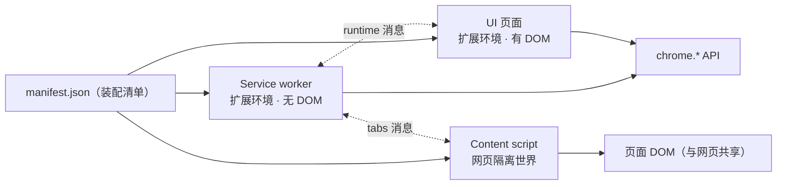

import { Canvas, Controls, Meta } from '@storybook/addon-docs/blocks';
import * as ExtensionArchitecture from './extension-architecture.stories';

<Meta of={ExtensionArchitecture} name="Docs" />

# 扩展架构

[第一个扩展](?path=/docs/first-extension--docs)里那个只有 manifest.json 和一个 popup 的扩展，是刻意裁剪的最小形态。完整的扩展更像一组分工不同的程序：有的在后台监听事件，有的在网页里改写内容，有的负责展示界面——它们各自运行在不同的环境里，互相看不见对方的内存，靠约定好的通道协作。manifest.json 则是装配清单：声明了什么部分，扩展才有什么部分。

本课建立这张架构总图。读完之后，对着任何扩展目录都能回答四个问题：由哪些部分组成、各部分跑在什么环境、能访问哪些能力、部分之间怎么协作。



manifest.json 里与架构直接相关的声明，以及它们各自装配出什么：

| manifest 声明 | 装配出的部分 | 运行环境 | 存在方式 |
| --- | --- | --- | --- |
| `background.service_worker` | 后台逻辑 | 扩展上下文，无 DOM | 按需启动，约 30 秒空闲终止 |
| `action.default_popup` | 工具栏弹窗 | 扩展上下文（自有页面） | 点图标打开，点外部即关闭 |
| `options_page` / `options_ui` | 选项页 | 扩展上下文（自有页面） | 用户打开期间存在 |
| `chrome_url_overrides` / `side_panel` / `devtools_page` | 其他 UI 页面 | 扩展上下文（自有页面） | 随各自的打开方式出现 |
| `content_scripts` | 注入网页的脚本 | 网页内的隔离世界 | 随匹配页面加载注入 |
| `permissions` / `host_permissions` | 权限 | 决定各上下文的 API 面 | 安装时生效 |
| `web_accessible_resources` | 可暴露给网页的资源 | 网页可直接请求的扩展文件 | 随扩展存在 |
| `manifest_version` / `name` / `version` | 扩展身份（必填） | —— | 静态声明 |

## manifest.json

manifest.json 是 Chrome 装配扩展的唯一依据：加载扩展时先读它，扩展有哪些组成部分、入口文件在哪、需要什么权限，全部来自这份文件。**没声明的部分就不存在**——不写 `background` 就没有后台逻辑，不写 `action.default_popup`，点工具栏图标就不会有弹窗。

必填字段只有三个：`manifest_version`（当前只支持 `3`，即 Manifest V3）、`name`、`version`。其余字段按需声明。一份覆盖本课各部分的 manifest：

```json
{
  "manifest_version": 3,
  "name": "demo-extension",
  "version": "1.0",
  "background": {
    "service_worker": "sw.js"
  },
  "action": {
    "default_popup": "popup.html"
  },
  "options_page": "options.html",
  "content_scripts": [
    {
      "matches": ["https://example.com/*"],
      "js": ["content.js"],
      "run_at": "document_idle"
    }
  ],
  "permissions": ["storage"],
  "host_permissions": ["https://example.com/*"]
}
```

- `background`、`action`、`content_scripts` 三个键各装配一类运行上下文，下面「运行环境」一节逐一展开。
- `content_scripts` 的 `run_at` 缺省就是 `document_idle`，即等页面加载完成后注入。
- `permissions` 与 `host_permissions` 决定各上下文能调用哪些 API、能碰哪些站点；字段的完整清单与权限模型由 [Manifest 与权限](?path=/docs/manifest-permissions--docs)一课承载。

## 运行环境

扩展的每个组成部分都是一个独立的**运行上下文**。判断任何一段扩展代码，先问三个问题：它跑在哪个上下文里、生命周期有多长、能看到什么（DOM 和 `chrome.*` API）。三类上下文的对照：

| 上下文 | 运行位置 | DOM | chrome.* API | 生命周期 |
| --- | --- | --- | --- | --- |
| Service worker | 扩展后台，无界面 | 无 | 按权限几乎全部 | 按需启动，空闲终止 |
| UI 页面 | 扩展自有的 HTML 页面 | 有 | 按权限几乎全部 | 打开创建，关闭销毁 |
| Content script | 网页内的隔离世界 | 有（与网页共享） | 受限子集 | 随页面注入，随页面销毁 |

下面的装配演算演示这份对应关系：勾选或取消 manifest 声明，观察装配出的上下文组合与可用通道的变化。

<Canvas of={ExtensionArchitecture.Interactive} />
<Controls of={ExtensionArchitecture.Interactive} />

| 读者操作 | 可观察证据 |
| --- | --- |
| 取消勾选某个 manifest 字段 | 右侧对应上下文框变为虚线「未声明」，manifest 文本同步删去该字段 |
| 保留 service worker 与 popup | 两个上下文之间出现 runtime 消息通道 |
| 保留任一扩展上下文与 content script | 出现 tabs 消息通道，content script 与页面 DOM 相连；左下读数汇总当前上下文与通道 |

### Service worker

Service worker 是扩展的中央事件处理器，负责所有无界面的后台工作：监听标签页变化、拦截请求、定时任务、接收消息。Manifest V3 用它取代了 MV2 的常驻后台页——它没有界面、没有 DOM，浏览器在事件到来时才启动它，处理完、空闲约 30 秒后终止，下次事件再唤醒。

```js
// sw.js —— 事件监听器要写在脚本顶层：service worker 被唤醒后，Chrome 才能立刻把事件派发给它
chrome.runtime.onInstalled.addListener(() => {
  // 安装或更新扩展时执行一次
});

chrome.tabs.onUpdated.addListener((tabId, changeInfo, tab) => {
  // 标签页发生导航等变化时触发
});
```

对应的 manifest 声明是 `"background": { "service_worker": "sw.js" }`。

在 `chrome://extensions` 的扩展卡片上可以直观看到这种生命周期：service worker 平时可能显示「已停止」（已休眠），触发一次它监听的事件（比如打开一个新标签页）后，它被唤醒进入运行状态。各上下文完整的调试入口由[调试扩展](?path=/docs/debugging--docs)承载。

边界：

- 全局变量在 service worker 停止后就丢失，不要用它保存跨事件的状态；持久状态交给 `chrome.storage`（见[存储](?path=/docs/storage--docs)）。
- 没有 DOM；确实需要操作页面之外的 DOM 时，用 offscreen document 方案承载。
- 启停计时、如何延长存活等生命周期细节由 [Service Worker](?path=/docs/service-worker--docs)一课承载。

### UI 页面

UI 页面是扩展自带的 HTML 页面，运行在扩展上下文里：有完整 DOM，也能按权限调用几乎全部 `chrome.*` API。它们不会自动运行，而是被用户操作打开。常见成员：

| 成员 | manifest 声明 | 打开方式 |
| --- | --- | --- |
| Popup（弹窗） | `action.default_popup` | 点击工具栏图标；点击弹窗以外的位置立即关闭 |
| 选项页 | `options_page` / `options_ui` | 扩展管理页（可嵌入）或扩展图标右键菜单 |
| 页面替换 | `chrome_url_overrides` | 替换新标签页、历史、书签页 |
| 侧边栏 | `side_panel` | 浏览器侧边的常驻面板 |
| DevTools 面板 | `devtools_page` | DevTools 里的扩展标签页 |

弹窗和选项页的做法见[Action 与弹窗](?path=/docs/action-popup--docs)与[替换页面与选项页](?path=/docs/override-options--docs)。一个最小的 popup：

```html
<!-- popup.html —— 弹窗就是普通网页；脚本必须放在单独文件里，不能内联 -->
<button id="count">统计一次</button>
<script src="popup.js"></script>
```

```js
// popup.js —— 扩展上下文：既有 DOM，也能按权限调用 chrome.* API
document.querySelector('#count').addEventListener('click', async () => {
  const { clicks = 0 } = await chrome.storage.local.get('clicks');
  await chrome.storage.local.set({ clicks: clicks + 1 });
});
```

popup 被点开才创建、点击外部立即关闭销毁，内存里的变量随之清零；要在多次打开之间保留的数据放 `chrome.storage`，或交给 service worker。

### Content script

Content script 注入到网页里、跟着页面加载运行，是扩展读写页面 DOM 的部分：读取页面内容、修改元素、监听页面上的操作。

它运行在网页的**隔离世界**里：与页面共享同一棵 DOM 树，但 JS 状态互相隔离——页面脚本看不到 content script 的变量和函数，反过来也一样，不同扩展的 content script 之间也彼此隔离。共享的 DOM 是它与网页之间的唯一直接通道。

```json
"content_scripts": [
  { "matches": ["https://example.com/*"], "js": ["content.js"] }
]
```

```js
// content.js —— 与页面共享 DOM，但看不到页面自己的 JS 变量
const badge = document.createElement('div');
badge.textContent = '由扩展注入';
document.body.append(badge);
```

content script 能直接调用的 `chrome.*` API 只有一小份官方清单：`i18n`、`storage`，以及 `runtime` 的消息成员（`connect`、`getManifest`、`getURL`、`id`、`onConnect`、`onMessage`、`sendMessage`）。清单之外的 API（`tabs`、`alarms`、`action` 等）都拿不到，需要时通过消息转交给扩展上下文完成。

静态声明之外，还有 `chrome.scripting` 动态注册与 `executeScript` 编程注入两条路；匹配规则、注入时机等细节由 [Content Scripts](?path=/docs/content-scripts--docs)一课承载。

## 上下文之间怎么协作

三个上下文之间没有共享内存：service worker 的变量 popup 读不到，content script 的函数 service worker 调不了。常规协作通道有三条：

| 通道 | API 与方向 | 典型用途 |
| --- | --- | --- |
| 消息 | `runtime.sendMessage`（content script → 扩展上下文）、`tabs.sendMessage`（扩展上下文 → 指定标签页里的 content script）、`runtime.connect` 长连接 | 借用另一侧的能力或数据 |
| `chrome.storage` | 所有上下文读写同一份数据，`onChanged` 互相通知 | 共享设置与状态 |
| 页面 DOM | content script 与网页共享 DOM（如 `window.postMessage`） | 与网页本身交换信息 |

最常见的是消息协作，方向决定用哪个 API：

```js
// content.js —— 把页面里的情况上报给扩展上下文
chrome.runtime.sendMessage({ type: 'page-ready', url: location.href });
```

```js
// sw.js —— 在扩展上下文里接收
chrome.runtime.onMessage.addListener((message) => {
  if (message.type === 'page-ready') {
    // 记录、转发，或执行只有扩展上下文能做的事
  }
});
```

本课只建立通道的全貌：应答、长连接端口、跨扩展消息等完整用法由 [消息通信](?path=/docs/messaging--docs)承载，存储分区的选择由[存储](?path=/docs/storage--docs)承载。

## 最佳实践

把一段逻辑放进正确的上下文，是扩展设计里最常用的判断：

| 需求 | 放进哪个上下文 |
| --- | --- |
| 读写页面 DOM | Content script |
| 监听浏览器事件、无界面的后台工作 | Service worker |
| 展示界面、接收点击输入 | UI 页面 |
| 需要跨开关、跨重启保留的数据 | `chrome.storage`，而不是任何上下文的内存 |

三条可执行的做法：

- popup 保持薄：只做展示与输入，重活通过消息交给 service worker，避免用户一关弹窗就打断工作。
- service worker 不存全局状态：每个事件处理函数都按「冷启动」来写，需要的状态先从 `chrome.storage` 读。
- content script 只做页面相关的事：用到受限清单之外的扩展能力时转发消息，不把逻辑复制到两个上下文里各写一份。

## 常见问题

- popup 里的变量、service worker 里的全局变量，过一会儿就读不到了
  把状态写进 `chrome.storage`，或需要时经消息交给 service worker 再落盘，不要依赖上下文内存。
  原因：popup 关闭即销毁，service worker 空闲约 30 秒终止，全局变量随之丢失。

- content script 里 `chrome.tabs` 是 undefined
  content script 只能使用受限的 API 子集；把需要的操作通过 `runtime.sendMessage` 转交给扩展上下文执行。
  判断依据：子集只包含 `i18n`、`storage` 和 `runtime` 的消息成员，其余 API 一律不能直接调用。

- service worker 里访问 `document` 报 `document is not defined`
  service worker 没有 DOM；把需要 DOM 的工作改用 offscreen document 承载（见 [Service Worker](?path=/docs/service-worker--docs)）。

- 重载扩展后，页面里 content script 的行为还是旧的
  content script 只在页面加载时注入，已经打开的页面不会自动换上新代码；重载扩展后再刷新匹配的页面即可。
  对比：popup、service worker 的改动在重载扩展后就以新代码运行。

## 总结回顾

摘要：

一个扩展由 manifest.json 装配而成：`background` 声明事件驱动的 service worker，`action`、`options_page` 等声明一组由用户打开的 UI 页面，`content_scripts` 把脚本注入网页的隔离世界。三类上下文分别运行在扩展后台、扩展自有页面和网页内部，生命周期从「按需启停」到「随开关销毁」再到「随页面注入」；能访问的 `chrome.*` API 从几乎全部到受限子集不等。上下文之间互不共享内存，靠消息、`chrome.storage` 和共享 DOM 三条通道协作。

一句话：

> 一个扩展是 manifest.json 装配出的一组运行上下文：各自有生命周期和 API 面，互不共享内存，靠消息与共享存储协作。

知识要点：

- manifest.json 里哪些声明会装配出运行上下文？不写 `background` 意味着什么？
- Service worker、UI 页面、content script 分别运行在什么环境，生命周期差别在哪里？
- content script 能直接调用哪些 `chrome.*` API，其余能力怎么获得？
- 上下文之间有哪些协作通道，各自适合传什么？
- 一段新逻辑应该放进哪个上下文？

## 参考资料

- [扩展 service worker](https://developer.chrome.com/docs/extensions/develop/concepts/service-workers)
- [Service worker 生命周期](https://developer.chrome.com/docs/extensions/develop/concepts/service-workers/lifecycle)
- [Service worker 事件](https://developer.chrome.com/docs/extensions/develop/concepts/service-workers/events)
- [Content scripts](https://developer.chrome.com/docs/extensions/develop/concepts/content-scripts)
- [扩展通信](https://developer.chrome.com/docs/extensions/develop/concepts/messaging)
- [manifest 字段参考](https://developer.chrome.com/docs/extensions/reference/manifest)
- [扩展 UI 概览](https://developer.chrome.com/docs/extensions/develop/ui)
- [为扩展添加弹窗](https://developer.chrome.com/docs/extensions/develop/ui/add-popup)
