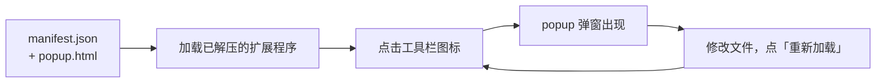

import { Meta } from '@storybook/addon-docs/blocks';

<Meta id="first-extension" title="起步/第一个扩展" name="Docs" />

# 第一个扩展

一个 Chrome 扩展，本质上就是一份 `manifest.json` 清单，加上清单声明引用的资源文件。本课用最小 manifest 加一个 popup 弹窗页面，走通「编写 → 加载 → 运行 → 修改」的完整开发闭环。之后每一课的范例都复用这个循环：写文件，进 `chrome://extensions` 重载，回浏览器看结果——全程不需要构建工具。

开发闭环只有四步，每一步的结果都直接显示在 Chrome 界面上：



最小 manifest 只要求三个必需字段，本课再补一个 `action` 字段让工具栏图标可点：

| 字段 | 必需性 | 作用 |
| --- | --- | --- |
| `manifest_version` | 必需 | 清单格式版本，目前支持的值只有 `3` |
| `name` | 必需，最长 75 字符 | 扩展名，显示在扩展卡片等处 |
| `version` | 必需 | 版本号，点分数字如 `1.0` |
| `description` | 可选，最长 132 字符 | 扩展卡片上的描述文字 |
| `action.default_popup` | 可选 | 工具栏图标被点击时打开的 HTML 页面 |

## 快速上手

新建一个目录，写入下面两个文件，就是一个可加载的扩展；本课目录下的 `extension/` 子目录就是这套文件的现成副本，可直接选用。

**第一步：写 `manifest.json`。** Chrome 加载扩展目录时，第一个读的就是它：

```json
{
  "manifest_version": 3,
  "name": "第一个扩展",
  "description": "课程 1.1 的最小扩展",
  "version": "1.0",
  "action": {
    "default_popup": "popup.html"
  }
}
```

**第二步：写 `popup.html`。** 一个普通 HTML 页面，与清单放在同一目录：

```html
<!DOCTYPE html>
<html lang="zh-CN">
  <head>
    <meta charset="UTF-8" />
    <style>
      body { width: 240px; margin: 0; padding: 16px; font: 14px/1.6 system-ui, sans-serif; }
      h1 { margin: 0 0 8px; font-size: 16px; }
      p { margin: 0; color: #555; }
    </style>
  </head>
  <body>
    <h1>Hello, Extensions</h1>
    <p>弹窗出现，说明闭环已经走通。</p>
  </body>
</html>
```

**第三步：加载进 Chrome。**

1. 地址栏打开 `chrome://extensions`。
2. 打开右上角「开发者模式」开关。
3. 点「加载已解压的扩展程序」，选中包含 manifest.json 的那个目录。
4. 点地址栏右侧的拼图图标，给自己的扩展点「图钉」固定，然后点扩展图标。

**可观察结果：** 点击工具栏图标弹出弹窗，显示 "Hello, Extensions"。

## manifest.json

manifest.json 是扩展的唯一入口。Chrome 用它判断一个目录「是不是扩展、叫什么、有哪些能力」；文件名固定，必须直接位于扩展根目录。其余文件（HTML、脚本、图片）都通过清单里的路径引用进来，清单没有引用的文件不会随扩展生效。

**三个必需字段：**

- `manifest_version`：清单格式版本，目前支持的值只有 `3`。Manifest V2 已停止支持，写成 `2` 会在加载时直接报错。
- `name`：扩展名，最长 75 字符，显示在扩展卡片等位置。
- `version`：点分数字，如 `1.0`、`2.3.1`；上架后每次更新必须递增（见《打包与上架》，`?path=/docs/publishing--docs`）。

**两个常用可选字段：**

- `description`：最长 132 字符，显示在扩展卡片上。本地开发可以省略，上架 Chrome Web Store 时必需。
- `action`：声明工具栏按钮。没有 `action` 的扩展同样能加载成功，但没有可点的工具栏图标：它只会出现在拼图菜单里，点击也没有任何反应；`action.default_popup` 指向的页面让它有东西可弹。

一个语法边界要提前记住：manifest.json 是严格 JSON——不允许注释、不允许最后一项后面带逗号、键必须用双引号。写错时加载或重载会直接报错，判断方法见常见问题。

清单的字段远不止这些：权限声明、图标、后台脚本等由完整字段体系承载，见《Manifest 与权限》（`?path=/docs/manifest-permissions--docs`）。

## popup 页面

`action.default_popup` 的值是相对扩展根目录的 HTML 文件路径。点击工具栏图标时，Chrome 以弹窗形式打开它。这个弹窗就是一个普通网页：

- 能写任意 HTML 与 CSS，弹窗自动适应内容调整大小；
- 尺寸限制在 25×25 到 800×600 像素之间；
- 每次点击图标都重新打开，关闭即销毁，不是常驻界面——常驻界面由侧边栏等机制承担（见《侧边栏》，`?path=/docs/side-panel--docs`）。

本课只把 popup 当作「能弹出来」的最小运行载体；工具栏图标、badge 与 popup 的完整控制在《Action 与弹窗》（`?path=/docs/action-popup--docs`）展开。

## 修改与重新加载

修改代码后的生效规则按文件类型分两类，这是扩展开发和普通网页开发最大的差别：

| 改动的文件 | 怎么生效 |
| --- | --- |
| manifest.json | 必须到 `chrome://extensions` 点扩展卡片上的「重新加载」（圆形箭头图标） |
| popup 等 HTML 页面 | 重新打开即生效，不用重载 |

失败不会静默。`chrome://extensions` 会在两个地方给出报错：点「加载已解压的扩展程序」选目录时直接弹出错误对话框；已在列表里的扩展重载失败时，卡片上出现「错误」按钮，点开能看到具体原因和出错位置。修好后点「重新加载」，错误随之清除。

本课闭环的可观察证据：

| 操作 | 可观察证据 |
| --- | --- |
| 加载课程目录 `extension/` 或自己写的目录 | `chrome://extensions` 出现扩展卡片，无「错误」按钮 |
| 点击固定的工具栏图标 | popup 弹出，显示 "Hello, Extensions" |
| 修改 popup.html 文字后重新点图标 | 弹窗显示新文字，无需重载 |
| 修改 manifest.json 的 `name` 后点「重新加载」 | 卡片名称更新 |
| 删掉 manifest.json 里一个逗号再点「重新加载」 | 卡片出现「错误」按钮，报告 JSON 语法错误 |

## 常见问题

- 加载成功，但在拼图菜单里点击自己的扩展没有任何反应
  最常见原因是 manifest 里没有 `action` 字段：没有它就没有可弹的页面。加上 `action` 与 `default_popup`，点「重新加载」后再试。
- 工具栏上找不到自己的扩展
  新加载的扩展默认收在地址栏右侧的拼图菜单里。点拼图图标，在列表中给它点「图钉」，图标才常驻工具栏。
- 报错 `Manifest is not valid JSON`
  manifest.json 不允许注释、末尾多余逗号，键必须用双引号；报错信息带有行列号，按位置检查对应行。
- 报错 `Manifest file is missing or unreadable`
  选错了目录：「加载已解压的扩展程序」选中的目录必须直接包含 manifest.json，选成它的上一级目录就会找不到清单。学本课时容易选中 `first-extension/`，而清单实际在 `first-extension/extension/` 里。

## 总结回顾

摘要：

一个 Chrome 扩展就是一份 manifest.json 加上它声明引用的文件。manifest.json 必须位于扩展根目录，必需字段为 `manifest_version`（只能 `3`）、`name` 与 `version`，`action.default_popup` 让点击工具栏图标时弹出普通 HTML 页面。开发闭环是：写文件 → `chrome://extensions` 开「开发者模式」→ 加载已解压的扩展程序 → 点击图标运行；manifest 改动要点卡片上的「重新加载」，popup 页面重新打开即生效，加载或重载失败时错误直接显示在对话框或卡片的「错误」按钮上。

一句话：

> 扩展就是一份 manifest.json 加上它引用的文件，改完代码到 `chrome://extensions` 点「重新加载」就能看到变化。

知识要点：

- 一个目录要满足什么条件才能被加载为扩展？
- 必需的三个 manifest 字段是什么，各自的约束是什么？
- 怎样让点击工具栏图标弹出页面？没有 `action` 字段时会怎样？
- popup 的尺寸限制和打开/关闭行为是什么？
- 哪些改动必须点「重新加载」，哪些重新打开即可生效？
- 加载或重载失败时，从哪里看到报错？

## 参考资料

- [Hello, world 扩展教程](https://developer.chrome.com/docs/extensions/get-started/tutorial/hello-world)
- [Manifest 字段参考](https://developer.chrome.com/docs/extensions/reference/manifest)
- [chrome.action API 参考](https://developer.chrome.com/docs/extensions/reference/api/action)
