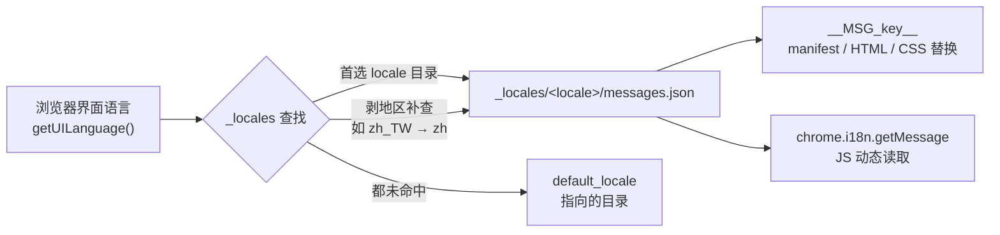

import { Canvas, Controls, Meta } from '@storybook/addon-docs/blocks';
import * as I18nStories from './i18n.stories';

<Meta of={I18nStories} name="Docs" />

# 国际化

扩展装进别人的浏览器，界面语言就不再由你决定。Chrome 的国际化方案是「一份文案仓库 + 两条取用路径」：所有用户可见字符串从代码里搬进 `_locales/<locale>/messages.json`，manifest 用 `default_locale` 声明兜底语言，Chrome 按「浏览器界面语言 → 剥地区补查 → `default_locale`」选出实际加载的那份文件；文案送到界面则有两条路——manifest、HTML、CSS 这些静态位置写 `__MSG_key__` 记号，由平台在加载时自动替换，JavaScript 里调 `chrome.i18n.getMessage(key, substitutions)` 动态读取。

两条路径分工很直接：**写在哪就怎么取**。token（`__MSG_key__`）是「占位声明」，只存在于平台会替换的文件（manifest、扩展页面 HTML、CSS）；一旦进入 `.js` 文件，平台不认 token，必须用 `getMessage` 取回同一份文案。把这两条路和语言解析顺序记住，本课的所有操作都可预测：切换浏览器界面语言，观察到的是另一份 `messages.json` 的内容，而不是同一份文件的另一套渲染。



开始前值得记住的默认值与硬规则：

| 事项 | 值 / 行为 | 说明 |
| --- | --- | --- |
| `_locales` 存在时 | manifest 必填 `default_locale` | 未本地化的扩展不得写 `default_locale`（字段规则见 [Manifest 与权限](?path=/docs/manifest-permissions--docs)） |
| `default_locale` 取值 | locale code，如 `"en"`、`"zh_CN"` | 对应 `_locales/<locale>` 目录名 |
| locale 查找顺序 | 首选 locale → 剥地区补查 → `default_locale` | 首选 locale 与剥地区名都未命中时落到默认语言；默认语言目录必须存在 |
| 部分翻译 | 允许 | 每种语言不必全量，但默认语言的 `messages.json` 必须覆盖全部消息 |
| `getMessage` 缺消息 | 返回 `''` | 调用格式错误（`messageName` 非字符串、`substitutions` 数组超过 9 个）才返回 `undefined` |
| `substitutions` | 单值或数组，最多 9 个 | 数组第 N 项绑定占位符 `content` 里的 `"$N"` |
| `escapeLt` | `options.escapeLt`（Chrome 79+） | 只转义消息文本本身的 `<`，不作用于占位符 |
| 消息名 / 占位符名 | 大小写不敏感；字符限 `A-Z a-z 0-9 _ @` | 不得以 `@@` 开头，那是预定义消息的保留前缀 |
| 决定选哪份文案的语言 | 浏览器界面语言 | `getAcceptLanguages()` 的偏好列表不参与 `_locales` 解析 |

## 快速上手

给第一个扩展加两套文案，是最短的可验证闭环。共四个文件。

**第一步：写两份 `messages.json`。** 目录名即 locale code，`default_locale` 指向其中一份：

```json
// _locales/en/messages.json
{
  "extName": { "message": "Course Cheatsheet", "description": "扩展名称，显示在扩展卡片" },
  "greeting": { "message": "Welcome back" },
  "invite": {
    "message": "$user$ ($role$) invited you to organize bookmarks",
    "placeholders": {
      "user": { "content": "$1", "example": "Cira" },
      "role": { "content": "$2", "example": "admin" }
    }
  }
}
```

```json
// _locales/zh_CN/messages.json
{
  "extName": { "message": "课程速查", "description": "扩展名称，显示在扩展卡片" },
  "greeting": { "message": "欢迎回来" },
  "invite": {
    "message": "$user$（$role$）邀请你一起整理收藏",
    "placeholders": {
      "user": { "content": "$1", "example": "Cira" },
      "role": { "content": "$2", "example": "管理员" }
    }
  }
}
```

**第二步：manifest 声明默认语言并本地化字符串字段。**

```json
{
  "manifest_version": 3,
  "name": "__MSG_extName__",
  "description": "__MSG_greeting__",
  "default_locale": "zh_CN",
  "version": "1.0",
  "action": {
    "default_popup": "popup.html",
    "default_title": "__MSG_extName__"
  }
}
```

**第三步：popup 里混合使用两条路径。**

```html
<!-- popup.html：文本节点里的 __MSG_key__ 会被自动替换 -->
<h1 id="title">__MSG_extName__</h1>
<p id="status">__MSG_greeting__</p>
<p id="invite"></p>
<script src="popup.js"></script>
```

```js
// popup.js：JS 文件里的 __MSG_ 不会被替换，必须用 getMessage 取回
invite.textContent = chrome.i18n.getMessage('invite', ['Cira', '管理员']);
console.log(chrome.i18n.getUILanguage()); // 当前界面语言，如 "zh-CN"
```

**第四步：换浏览器界面语言，重看界面。** 每次用独立 profile 启动，避免和日常配置互相影响：

```bash
open -a "Google Chrome" --args --lang=en-GB --user-data-dir=/tmp/chrome-en
open -a "Google Chrome" --args --lang=zh-CN --user-data-dir=/tmp/chrome-zh
open -a "Google Chrome" --args --lang=fr --user-data-dir=/tmp/chrome-fr
```

**可观察结果：**

| 操作 | 可观察证据 |
| --- | --- |
| `--lang=en-GB` 启动后打开扩展 | 界面变英文：`_locales/en_GB` 不存在时剥地区补查，命中 `_locales/en` |
| `--lang=zh-CN` 启动 | 界面中文，直接命中 `_locales/zh_CN` |
| `--lang=fr` 启动 | 没有法语目录，两轮查找都未命中，按 `default_locale` 兜底显示中文 |
| 任意语言下看 `chrome://extensions` 卡片 | 扩展名随语言切换（manifest 的 `name` 被 `__MSG_extName__` 替换） |
| popup 的「邀请」行 | 中英文语序不同，但 `$user$` / `$role$` 都替换为 `getMessage` 传入的两个值 |

## _locales 与语言匹配

### 目录与 locale 命名

每种语言一个目录，目录名就是 locale code：`_locales/en/messages.json`、`_locales/zh_CN/messages.json`。目录名用小写语言代码，地区码用下划线（`zh_CN`、`pt_BR`），与浏览器返回的连字符形式（`zh-CN`）在查找时等价。`messages.json` 是严格 JSON：不允许注释和尾随逗号，写错时扩展加载直接报错。

### 语言解析顺序

Chrome 选哪份 `messages.json`，只跟浏览器界面语言（`getUILanguage()` 的值）有关，分三步走：

1. 按首选语言完整匹配：界面语言 `zh-CN` 先找 `_locales/zh_CN`；
2. 剥掉地区码补查：界面语言 `zh-TW` 时，若没有 `_locales/zh_TW`，再找 `_locales/zh`；
3. 回落默认语言：两轮都没命中，加载 `default_locale` 指向的目录。

三条推论值得单独记住：装了 `_locales` 就必须有 `_locales/<default_locale>`；`_locales` 里多放几个用不上的 locale 目录不会出事——用不上的语言 Chrome 直接忽略；但每种语言都不必翻译全部消息，缺口按首选语言退回去找，最终落到默认语言那条，所以**默认语言的 `messages.json` 必须每条消息都有值**。

下面的模拟把浏览器语言、已安装 locale 和 `default_locale` 都做成可调输入，解析过程逐步可见：

<Canvas of={I18nStories.LocaleResolution} />
<Controls of={I18nStories.LocaleResolution} />

| 读者操作 | 可观察证据 |
| --- | --- |
| 把「浏览器界面语言」设为 `zh-TW` | 轨迹依次「未命中 `zh_TW` → 未命中 `zh` → 命中 `default_locale` 的 `zh_CN`」，选中 locale 为 `zh_CN` |
| 把已安装 locale 勾上 `zh` | 第二步补查命中，选中 locale 变为 `zh`，兜底来源读数显示「剥地区命中」 |
| 把界面语言设为 `pt-BR`、安装列表含 `pt_BR` | 第一步直接命中 `pt_BR`，界面文案是葡萄牙语 |
| 只改「accept languages 列表」、界面语言不动 | 解析轨迹完全不变——偏好列表不参与 `_locales` 选择，这是 `getUILanguage` 与 `getAcceptLanguages` 的区别 |
| 安装列表去掉 `default_locale` 指向的 locale | 面板提示 manifest 加载会失败：`_locales/` 下没有 `default_locale` 声明的目录 |

## messages.json 格式

每条消息是顶层的一个键，值是一个对象，只有 `"message"` 必需：

```json
{
  "search_string": {
    "message": "搜索字符串：$keyword$",
    "description": "popup 搜索框旁的标签，$keyword$ 是用户输入",
    "placeholders": {
      "keyword": {
        "content": "$1",
        "example": "chrome extension"
      }
    }
  }
}
```

- `"message"`：该语言下的文案正文，可含 `$name$` 占位符和 `$$` 字面量。
- `"description"`：给译者看的上下文，不进入界面。翻译场景里它和下面的 `"example"` 一起决定译文质量。
- `"placeholders"`：可选，把正文里的 `$name$` 绑定到替换内容。

**命名规则：** 消息名和占位符名都大小写不敏感（`getMessage('extname')` 同样命中 `extName`），字符只允许 `A-Z`、`a-z`、`0-9`、`_`、`@`。以 `@@` 开头的名字是预定义消息的保留区，不要用来放自己的消息。

### placeholders 与 substitutions

占位符把「文案结构」和「运行时值」分开：译者和开发者都能看到变量从哪来。规则有两条主路：

- **content 引用调用参数：** `"content": "$1"` 表示这个占位符的值来自 `getMessage(key, substitutions)` 的第一个 substitution，$2$、$3$ 依次往后；数组没给够的位置按空串处理。
- **content 写死文本：** `"content": "Example.com"` 表示不管调用方传什么，这里永远替换为固定字符串。

正文里两种写法：`$name$`（推荐，可读且大小写不敏感）或直接 `$1$`（能用但官方不推荐——译者看不到变量含义）；要输出字面 `$` 就写 `$$`。

下面的模拟把同一份 `messages.json` 交给不同的 `substitutions` 调用，替换过程逐条可见：

<Canvas of={I18nStories.MessageSubstitution} />
<Controls of={I18nStories.MessageSubstitution} />

| 读者操作 | 可观察证据 |
| --- | --- |
| 「消息名」切到 `invite`，`substitutions` 选数组 `["Cira", "Kathy"]` | 返回「Cira（Kathy）邀请你一起整理收藏」：`$user$` 吃 `$1`，`$role$` 吃 `$2`；读数里 `$1`/`$2` 绑定值与传参一一对应 |
| `substitutions` 切到单值 `"Cira"` | `$user$` 替换为 `Cira`，`$role$` 的位置是空串——数组没给够的位按空串，不是保留原文 |
| 「消息名」切到 `error` 后保持数组两个值 | 返回只含第一个值：`error` 的占位符只引用 `$1`，第二个参数被忽略 |
| 「消息名」切到 `site` | 无论传什么 substitutions，返回都是「收藏站点：Example.com」——content 写死文本时不吃调用参数 |
| 打开「escapeLt」并切到 `rich` | 返回值里 `<b>` 变成 `&lt;b&gt;`，面板按文本原样显示这串字符——escapeLt 只动消息文本本身 |
| 把「当前已加载的 messages.json」切到 `en` | 同一批 key 的 message 全文换成英文——选哪份 messages.json 由浏览器界面语言决定 |

## 取用文案的两条路径

### `__MSG_key__` 静态替换

在 manifest、扩展页面 HTML 和 CSS 里，用 `__MSG_messageName__` 记号引用消息，平台在加载时替换为当前语言的值。manifest 的字符串字段支持这种写法（`name`、`description`、`action.default_title` 等），URL、路径、布尔与枚举字段不能写 token。这条路径回答的是「安装即固定的文案」：

```json
{ "name": "__MSG_extName__", "action": { "default_title": "__MSG_actionTitle__" } }
```

```html
<!-- popup.html：文本节点里的 token 被自动替换 -->
<h1>__MSG_extName__</h1>
```

```css
/* CSS 里同样替换 */
body { direction: __MSG_@@bidi_dir__; }
```

### chrome.i18n.getMessage 动态读取

token 的边界是文件类型：**JS 文件里写 `__MSG_xxx__` 不会得到替换**，要用 `chrome.i18n.getMessage` 显式取：

```js
// popup.js / options.js / content script / service worker 通用
const title = chrome.i18n.getMessage('extName');

// substitutions 传数组按位置绑定占位符，传单值等价于只给第一位
notice.textContent = chrome.i18n.getMessage('error', errorDetails);
invite.textContent = chrome.i18n.getMessage('invite', ['Cira', '管理员']);

// 译文里的 < 需要按文本插入时，用 escapeLt
hostile.textContent = chrome.i18n.getMessage('rich', undefined, { escapeLt: true });
```

`getMessage(messageName, substitutions?, options?)` 的返回规则：消息存在返回当前语言的文案；消息不存在返回 `''`；调用格式错误返回 `undefined`——`messageName` 不是字符串，或 `substitutions` 数组超过 9 个元素。这两种返回值不同，是排查时最快的分诊点。

### 各上下文的用法差异

| 上下文 | `__MSG_key__` | `chrome.i18n.getMessage` | 注意点 |
| --- | --- | --- | --- |
| manifest.json | 字符串字段支持 | 不可用 | `default_locale` 本身不走本地化 |
| popup / options 等扩展页面 HTML | 文本节点自动替换 | 可用 | HTML 属性里写 token 不替换；动态插入的文本用 getMessage |
| 扩展页面 CSS | 支持 | — | 同 CSS 文件里的 token 也会被替换 |
| 扩展页面 / 后台 JS 文件 | 不替换 | 可用 | 只能用 getMessage 取文案 |
| content script | JS 里不替换 | 可用 | 注入页面的 DOM 文本用 getMessage 取回后赋值 |
| service worker | 不替换 | 可用 | 文案来自 JS 常量的通知标题等同理 |

静态替换与动态读取的真实差别，看同一批消息在四种位置的表现：

<Canvas of={I18nStories.StaticSubstitution} />
<Controls of={I18nStories.StaticSubstitution} />

| 读者操作 | 可观察证据 |
| --- | --- |
| 「消息名」切到 `greeting`，「当前已加载的 messages.json」保持中文 | manifest 的 `description`、HTML 卡片正文、JS 的 `getMessage` 结果同为「欢迎回来」，CSS 的 `direction` 还原为预定义消息 `@@bidi_dir` 的 `ltr` |
| 「消息名」切到 `typo`（未定义的消息） | manifest、HTML、CSS 三处 token 原样保留未被替换；JS 一栏 `getMessage('typo')` 返回 `''`——两条路径对缺失消息的处理不同 |
| 把「当前已加载的 messages.json」切到 `en` | 四处结果同时换成英文；JS 一栏的代码调用不变，只有返回的字符串变了 |
| 打开 Show code | 看到该 Canvas 实际执行的 `static-substitution.ts` |

## 预定义消息

平台自带六个以 `@@` 开头的预定义消息，任何语言的 `messages.json` 里都能直接引用，不受翻译进度影响，其中 `@@extension_id` 在扩展没有做本地化时同样可用：

| 预定义消息 | 取值 | 用途 |
| --- | --- | --- |
| `@@bidi_dir` | 当前 locale 的文本方向：`"ltr"` 或 `"rtl"` | CSS 里设 `direction`，判断排版方向 |
| `@@bidi_reversed_dir` | 与 `@@bidi_dir` 相反：`ltr` 时是 `rtl`，否则是 `ltr` | 需要反向容器时用 |
| `@@bidi_start_edge` | `ltr` 时为 `left`，否则是 `right` | CSS 的起始边内边距、浮动方向 |
| `@@bidi_end_edge` | `ltr` 时为 `right`，否则是 `left` | CSS 的结束边内边距 |
| `@@ui_locale` | 当前 locale，如 `zh_CN` | 拼 locale 相关的资源 URL |
| `@@extension_id` | 扩展 ID | 拼扩展内资源的绝对 URL；未本地化的扩展也能用 |

两个边界：`@@extension_id` **不能写在 manifest 里**——扩展 ID 要到安装或上架时才确定，manifest 阶段拿不到；这些消息在 HTML、CSS、JS 里都通过 `__MSG_@@xxx__` 或 `getMessage('@@xxx')` 使用。RTL 语言（阿拉伯语、希伯来语）的排版靠它们翻转，CSS 里写死 `left`/`right` 是常见翻车点：

```css
/* RTL 下自动翻转：内边距贴起始边，方向随语言 */
body { direction: __MSG_@@bidi_dir__; }
.callout { padding-__MSG_@@bidi_start_edge__: 1.5em; }
.icon { background: url('chrome-extension://__MSG_@@extension_id__/icon.svg'); }
```

```js
// JS 里读预定义消息同样走 getMessage
const iconUrl = `chrome-extension://${chrome.i18n.getMessage('@@extension_id')}/icon.svg`;
```

## 取语言：getUILanguage 与 getAcceptLanguages

只看一节的记忆点：**界面语言只有一个，偏好语言是一串。**

```js
chrome.i18n.getUILanguage();     // "zh-CN"：浏览器界面语言，决定 _locales 选哪份
chrome.i18n.getAcceptLanguages(); // Promise<string[]>：浏览器的首选语言列表，按偏好排序
```

- `getUILanguage()` 是字符串，反映的就是上面解析 `_locales` 用的那个语言。想确认「现在到底加载了哪份文案」，读它的返回值最直接。
- `getAcceptLanguages()` 返回 Promise，内容是用户设置的首选语言列表；它和界面语言是两回事——把它的顺序改来改去，`_locales` 的选择不会变（上面第一个 Canvas 里可以直接验证）。
- `chrome.i18n.detectLanguage(text)` 是另一个用途：用 CLD 检测一段文本的语言，按需取用，本课主线不涉及。

## 本地化测试

**换界面语言重看界面**是主要方法。macOS 在「系统设置 → 语言与地区」增删语言并重启 Chrome，其余平台同理改浏览器/系统语言后重启。命令行方式适合快速对比：用 `--lang` 指定语言、`--user-data-dir` 指定一个独立 profile 目录启动，不同的语言各启一个窗口互不干扰，快速上手里已给出可直接照做的命令。macOS 上界面语言还可能受系统语言影响，以扩展运行时 `getUILanguage()` 的读数为准。

**改动生效规则**沿用扩展的通用模型：`messages.json` 属于扩展文件，改完到 `chrome://extensions` 点「重新加载」；manifest 的 `name`、`description` 等本地化字段改动同样要点「重新加载」后才在卡片上更新（规则见[第一个扩展](?path=/docs/first-extension--docs)）。

测试清单按优先级：先确认 `getUILanguage()` 是预期值，再看界面；每种语言至少过一次「默认语言有值、翻译语言可缺省」的路径；最后用 `--lang=<无翻译语言>` 走一次 `default_locale` 兜底。

## 与 Chrome Web Store 多语言文案的关系

商店页的多语言文案和扩展运行时的 `_locales` 是两套独立系统：CWS 商品信息（名称、详细说明等）在开发者后台按语言分别填写，属于上架元数据；`_locales` 是随扩展打包、运行时读取的字符串文件。两者互不派生——上传 `_locales` 不会让商店页自动获得翻译，商店页填的文案也不会出现在扩展界面里。商店信息的填写与发布流程见[打包与上架](?path=/docs/publishing--docs)，本课的 `_locales` 只负责装进浏览器之后的界面。

## 最佳实践

- **界面文案只进 `messages.json`。** HTML、JS 里不写死用户可见字符串；以后加语言只加一个文件，不改代码。
- **key 语义化，描述写给译者。** `extName` 优于 `popupTitle1`；`description` 和占位符的 `example` 别省略，译文质量由它们决定。
- **占位符不拼字符串。** 用 `placeholders.content: "$N"` 绑定参数，翻译语序变化时不会被拼接写死；message 里避免直接写 `$1$`，读者和译者都看不出变量含义。
- **默认语言必须全量。** 每次新增消息，先补默认语言的 `messages.json`；翻译语言可以后补，缺消息会按解析链回落。
- **插入用户可控文本用 `textContent`。** 译文或参数需要进 HTML 字符串时，`getMessage` 配 `escapeLt` 只保护消息本身，占位符内容仍要自己防注入。
- **RTL 用预定义消息。** `direction`、起始边、结束边一律 `@@bidi_*`，别在 CSS 里写死 `left` / `right`。
- **测试信 `getUILanguage()`，不信猜。** 语言没切过去时先读这个值，再考虑文案文件；调试期用 `--lang` 加独立 profile，避免污染日常 profile。

## 常见问题

- `chrome.i18n.getMessage('foo')` 返回空串
  消息没找到。依次核对三点：消息名拼写（大小写不敏感，但字符限 `A-Z a-z 0-9 _ @`）、`.json` 里是否真有这个键、当前实际加载的是哪份 locale（读 `getUILanguage()`，语言没命中会回落到默认语言）。若返回的是 `undefined` 而非 `''`，是调用格式错误——`messageName` 不是字符串，或 `substitutions` 数组超过 9 个元素。

- popup 里原样显示 `__MSG_xxx__` 字样
  token 没有被替换。先看位置：JS 文件和 HTML 属性里的 token 不替换（HTML 只替换文本节点），JS 要改用 `getMessage`；再看定义：该语言或默认语言的 `messages.json` 里没有这条消息。两种原因都会让 token 原样留在界面上。修正后 manifest 相关的改动记得点「重新加载」。

- 改了浏览器语言，界面文案却没变
  文案选择只看界面语言。先读 `chrome.i18n.getUILanguage()` 确认实际值——`zh-TW` 这类地区变体在没有对应目录时会剥地区甚至落到默认语言；`getAcceptLanguages()` 里的偏好列表不参与选择，改它没有用。另外系统/浏览器语言改完要重启浏览器，扩展文件（含 `messages.json`）改动要点「重新加载」。

- manifest 加载失败，提示 `default_locale` 与 `_locales` 不匹配
  `default_locale` 写了，但 `_locales` 目录缺失、为空、或里面没有 `default_locale` 指定的那个 locale 目录。反过来，未做本地化的扩展不要在 manifest 写 `default_locale`——规则见[Manifest 与权限](?path=/docs/manifest-permissions--docs)。

- RTL 语言的界面方向没翻转，CSS 里写死了左边距
  CSS 改用预定义消息：`direction: __MSG_@@bidi_dir__`、内边距用 `__MSG_@@bidi_start_edge__` / `__MSG_@@bidi_end_edge__`。顺带记住 `__MSG_@@extension_id__` 可以拼扩展内资源 URL，但它不能出现在 manifest 里。

## 总结回顾

摘要：

国际化的组织方式是「一份仓库、两条路径、三级解析」。仓库是 `_locales/<locale>/messages.json`：每条消息至少带 `"message"`，可选 `"description"` 与 `placeholders`；占位符用 `$name$` 引用，通过 `content: "$N"` 绑定 `getMessage` 的第 N 个 substitution，也可以写死文本，数组缺位按空串处理，`$$` 输出字面 `$`，`escapeLt` 只转义消息本身的 `<`。三级解析按浏览器界面语言进行：首选 locale 目录、剥地区补查、`default_locale` 兜底，默认语言那份必须覆盖全部消息。两条取用路径按位置分工：manifest、HTML 文本节点、CSS 写 `__MSG_key__` 由平台替换；JS 一律 `chrome.i18n.getMessage`——缺消息返回 `''`，调用格式错误才返回 `undefined`。平台预定义 `@@bidi_dir`、`@@bidi_reversed_dir`、`@@bidi_start_edge`、`@@bidi_end_edge`、`@@ui_locale`、`@@extension_id`（仅 `@@extension_id` 不能进 manifest），覆盖 RTL 排版与资源 URL。`getUILanguage()` 是界面语言且决定选哪份文案，`getAcceptLanguages()` 只是偏好列表、不参与解析。商店页多语言文案属于发布流程，与运行时 `_locales` 相互独立。

一句话：

> 界面文案进 `_locales`，静态位置写 `__MSG_key__`、JS 里 `getMessage`，选哪份文案只看 `getUILanguage()` 并按 default_locale 兜底。

知识要点：

- 扩展目录里 `_locales` 的各级结构是什么？`default_locale` 指向什么、何时必填、何时不能写？
- Chrome 挑选 `messages.json` 的三步顺序是什么？未命中时文案从哪来？
- 一条消息由哪些字段构成？`placeholders` 的 `content` 写 `"$1"` 和写死文本分别是什么行为？
- `substitutions` 传单值和传数组有什么区别？数组缺位、消息缺失、调用格式错误分别返回什么？
- `__MSG_key__` 和 `getMessage` 各自适用于哪些位置？为什么 JS 文件里写 token 不行？
- 预定义消息有哪些、各自动什么用？哪个不能出现在 manifest 里？
- `getUILanguage()` 与 `getAcceptLanguages()` 的区别是什么？语言切换后先确认哪个值？
- 本地化测试有哪些方法？`_locales` 与 Chrome Web Store 多语言文案是什么关系？

## 参考资料

- [chrome.i18n API 参考](https://developer.chrome.com/docs/extensions/reference/api/i18n)：`getMessage` / `getUILanguage` / `getAcceptLanguages` / `detectLanguage` 的签名与返回值、escapeLt 与 substitution 数量限制、预定义消息列表与 CSS 用法。
- [Internationalization（i18n 参考页）](https://developer.chrome.com/docs/extensions/reference/i18n)：`_locales` 结构、语言查找三步顺序、缺消息行为、`__MSG_` 语法与改浏览器语言测试的方法。
- [messages.json 与 Locale-Specific Messages 格式](https://developer.chrome.com/docs/extensions/how-to/ui/localization-message-formats)：消息字段结构、命名规则（大小写不敏感、允许字符、`@@` 保留）、placeholders 的 content / example 与 `$$` 转义。
- [Manifest 字段参考](https://developer.chrome.com/docs/extensions/reference/manifest)：`default_locale` 定义、取值格式与「有 _locales 必填、未本地化不得使用」的约束。
- [Chrome Web Store 开发者文档](https://developer.chrome.com/docs/webstore)：商店商品信息多语言填写的入口，用于厘清商店文案与运行时 `_locales` 的边界。
