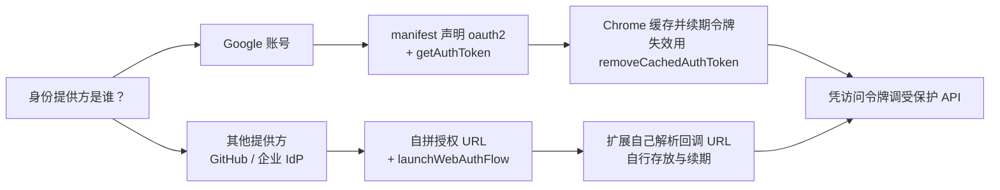

import { Canvas, Controls, Meta } from '@storybook/addon-docs/blocks';
import * as IdentityStories from './identity.stories';

<Meta of={IdentityStories} name="Docs" />

# 用户身份

扩展要调用受保护的 API（Google Drive、GitHub、自建后端），第一个动作不是发请求，而是先拿到「用户同意」的凭据。`chrome.identity` 把这件事分成两条路：提供方是 Google 时用 `getAuthToken`——只在 manifest 里声明 `client_id` 和 scopes，授权界面、令牌缓存与续期都由 Chrome 代劳；提供方是别家时用 `launchWebAuthFlow`——自己拼授权 URL，Chrome 只负责开一个窗口，同意之后把重定向 URL 交回扩展。选哪条路只由提供方是谁决定，不由代码喜好决定。

读完本课，你应当能回答四个问题：两条路分别怎么声明和调用、`interactive` 在两个 API 里为什么含义不同、令牌失效了怎么恢复、浏览器 profile 的账号信息和授权状态是什么关系。



两条路的分工，也是本课的回查表：

| | `getAuthToken` | `launchWebAuthFlow` |
| --- | --- | --- |
| 适用提供方 | Google 账号 | 任意非 Google 提供方 |
| 凭据来源 | manifest 的 `oauth2.client_id` 与 `oauth2.scopes` | 调用方传入的授权 URL |
| Chrome 负责 | 授权界面、令牌缓存、续期、失效回收 | 开一个窗口；重定向到 `chromiumapp.org` 时关窗并交回完整 URL |
| 扩展负责 | 直接用令牌；401 时移除缓存再取 | 解析回调 URL 里的凭据，自行存放、续期与失效处理 |
| 关键参数 | `interactive`、`scopes`、`account` | `url`、`interactive`、`abortOnLoadForNonInteractive`、`timeoutMsForNonInteractive` |
| 返回 | `{ token, grantedScopes }` | 最终的 redirect URL |

两条路共同的前置只有一个：manifest 的 `permissions` 里写 `"identity"`；要读浏览器账号的邮箱还要 `"identity.email"`。官方参考页正在把示例改用标准化的 `browser.*` 命名（页面标题已写作 browser.identity），本手册沿用 `chrome.*`，当前版本二者等价。

## 快速上手

在 [第一个扩展](?path=/docs/first-extension--docs) 的最小目录上，用 `getAuthToken` 走通「声明 → 取令牌 → 调 API → 401 重取」的闭环。

**第一步：写 `manifest.json`。** `oauth2` 与 `permissions` 是本节新增的两处：

```json
{
  "manifest_version": 3,
  "name": "调用 Drive 的最小示例",
  "version": "1.0",
  "permissions": ["identity"],
  "oauth2": {
    "client_id": "YOUR_CLIENT_ID.apps.googleusercontent.com",
    "scopes": ["https://www.googleapis.com/auth/drive.readonly"]
  },
  "background": { "service_worker": "sw.js" }
}
```

**第二步：写 `sw.js`。**

```js
// sw.js —— 静默预热取令牌，用完后 401 就移除缓存再取一次
async function callDriveApi() {
  const { token } = await chrome.identity.getAuthToken({
    interactive: false,
  });

  const res = await fetch('https://www.googleapis.com/drive/v3/files', {
    headers: { Authorization: `Bearer ${token}` },
  });

  // 令牌被吊销或密码变更后，Chrome 的缓存还持有它：清掉再取新的
  if (res.status === 401 && token) {
    await chrome.identity.removeCachedAuthToken({ token });
    return callDriveApi();
  }

  return res.json();
}

// 从 popup 登录按钮、commands 快捷键等用户操作里发起第一次授权
// 没有 default_popup 时，点击工具栏图标就会进到这里（先在拼图菜单里图钉固定）
chrome.action.onClicked.addListener(async () => {
  const { token } = await chrome.identity.getAuthToken({ interactive: true });
  console.log('已取得令牌：', token);
});
```

**可观察结果：**

1. 加载扩展后点工具栏图标，弹出 Google 授权界面；选择一个账号并同意 scope，console 打出令牌。
2. 在 DevTools Console 里再次执行 `chrome.identity.getAuthToken({ interactive: false })`，直接返回同一枚令牌，不再弹窗。
3. 在 `chrome://identity-internals` 的 Token cache 一节能看到当前缓存。
4. 把 manifest 里 `scopes` 换成一个新范围，重载扩展再调 `getAuthToken({ interactive: true })`，Chrome 会为新增的范围再弹一次同意界面。

GCP 上的 OAuth 客户端 ID 如何创建（类型选 Chrome Extension、登记扩展 ID）本课不展开，按 [Google 官方 OAuth 说明](https://developers.google.com/identity/protocols/oauth2)操作；登记用的扩展 ID 要固定，见「固定的扩展 ID」。

## 授权前的声明

两条路在调用前要有不同的声明，`getAuthToken` 还必须有一个稳定的扩展 ID。

### oauth2 与 client_id

manifest 的 `oauth2` 是可选对象，只有两个必需子属性：`client_id`（字符串，形如 `...apps.googleusercontent.com`）和 `scopes`（字符串数组）。`getAuthToken` 只认这两个值——令牌范围等于 manifest 的 scopes，除非调用时用 `scopes` 覆盖：

```json
"oauth2": {
  "client_id": "665859454684.apps.googleusercontent.com",
  "scopes": ["https://www.googleapis.com/auth/drive"]
}
```

`launchWebAuthFlow` 不需要 `oauth2`：它不经由 Chrome 代发令牌，只借用窗口与重定向判定，`client_id` 由你拼进授权 URL。反过来说，没有 `oauth2` 的扩展调 `getAuthToken` 会直接失败。

scopes 按「这次真的要用到的」申请：每加一个范围，都要同步改 GCP 的 OAuth 同意屏幕与 manifest，并可能触发用户重新同意。Google 官方的建议是按需增量申请，不要一次要全。

### 固定的扩展 ID

扩展 ID 是公钥的哈希：本地加载的未打包扩展，ID 会随加载位置变化；而 GCP 的 OAuth 客户端登记的就是某一个固定 ID。不一致时 `getAuthToken` 会因 client_id 对不上而失败——这类失败常发生在「换台机器或换个目录重新加载」之后。

开发期间把公钥写进 manifest，Chrome 就按它计算 ID，不再随目录变：

```json
"key": "MIIBIjANBgkqhkiG9w0BAQEFAAOCAQ8AMIIBCgKCAQEA..."
```

`key` 是公开信息，可以提交进仓库。上架时 Web Store 仍按包内 `key` 计算 ID，只要值不变，开发与发布就是同一个 ID。

### identity 与 identity.email

两个权限都在 [Manifest 与权限](?path=/docs/manifest-permissions--docs) 的权限体系内，本课只用到这两项：

```json
"permissions": ["identity", "identity.email"]
```

- `identity`：拿到 `chrome.identity` 的访问权，`getAuthToken` 与 `launchWebAuthFlow` 都以它为前提。
- `identity.email`：`getProfileUserInfo` 需要它才能返回非空的 `email` 与 `id`，缺了就只有空字符串，见「账号信息」。

## getAuthToken

Google 账号专用。Chrome 在内存里持有访问令牌及其缓存：你只告诉它这次允不允许问用户，其余的界面、缓存、续期都由它处理。MV3 下返回 Promise，解构出 `token` 即可；`grantedScopes` 自 Chrome 87 起填充。

### interactive 与缓存

`interactive` 管的是「允不允许弹窗问用户」，不是「要不要重新授权」。这一点是本课最容易被误解的地方：

- `false`（或省略）：只读缓存。缓存里有用就直接返回；需要用户确认时立刻失败——Promise reject，报错 `OAuth2 not granted or revoked.`。
- `true`：允许弹窗。弹不弹取决于缓存——缓存命中时照样不弹，直接返回手里那枚令牌。

下面的演算把「interactive × 前置缓存状态」的组合全部摆出来。左边是调用代码，中间是令牌在扩展、Chrome 缓存、授权 UI 与受保护 API 之间的流动，右边是当前结论：

<Canvas of={IdentityStories.AuthTokenFlow} />
<Controls of={IdentityStories.AuthTokenFlow} />

| 读者操作 | 可观察证据 |
| --- | --- |
| 「前置缓存状态」为「缓存为空」，interactive 关掉 | 左边 getAuthToken 报 `OAuth2 not granted or revoked.`，fetch 一段整块标红（走不到），受保护 API「未发起」 |
| 同样状态下把 interactive 打开 | 中栏出现授权 UI，同意后拿到新令牌，API 200 |
| 「前置缓存状态」切到「缓存有效」 | interactive 取任何值都不弹窗，令牌原样返回 |
| 切到「缓存已过期」 | Chrome 自动续期，调用方无感，API 200 |
| 切到「服务端已吊销」 | 仍返回旧令牌且不弹窗，API 401；右栏给出 `removeCachedAuthToken` 之后的下一步 |

三条边界：

- `interactive: true` 不保证弹窗，缓存命中时它和 `false` 行为一致。
- `interactive: false` 的含义是「任何时刻调用都不会打扰用户」——适合启动预热与定时任务，失败就当未登录。
- 弹窗型授权要贴着用户操作触发。官方明确建议不要一启动就发起交互式授权；在扩展里就是从 popup 的登录按钮、`commands` 快捷键这类用户操作发起，而不是写在 service worker 顶层的安装回调里。

### scopes、账号与授权界面

单次调用还有三个可选参数，都只服务 Google 这条路径：

- `scopes`：传了就**替换** manifest 的 scopes 列表，不是追加。不同功能要不同范围时，按功能分别请求。
- `account`：账号 ID（`getAccounts()` 返回的 `AccountInfo.id`）。不传时默认用 profile 的同步账号，或第一个 Google 网页账号。
- `enableGranularPermissions`（Chrome 87+）：提前切换到细粒度授权界面，每个 scope 由用户分别同意或拒绝。

实际授予的范围不总等于请求的范围——细粒度界面下用户可以只批一部分。用返回的 `grantedScopes`核对之后再决定功能是否可用：

```js
const { token, grantedScopes } = await chrome.identity.getAuthToken({
  interactive: true,
  scopes: [
    'https://www.googleapis.com/auth/drive.readonly',
    'https://www.googleapis.com/auth/userinfo.email',
  ],
});

if (!grantedScopes?.includes('https://www.googleapis.com/auth/userinfo.email')) {
  // 用户没批这一项：降级功能，不要直接发请求
}
```

### 失效与移除

缓存里的令牌有两种「坏法」，处理方式完全不同：

- **过期：** Chrome 自动续期，调用方无感，不需要写任何代码。
- **被吊销或服务端失效：** 表现为受保护 API 返回 401（用户改密码、手动撤销授权、管理员收回）。此时缓存仍持有那枚死令牌，`getAuthToken` 会继续原样返回它。

标准处理是「401 → 移除缓存 → 重取」：

```js
await chrome.identity.removeCachedAuthToken({ token });
// 之后 getAuthToken 会重新取得一枚新令牌
```

两个清除动作的作用范围差别很大：

| 方法 | 清掉什么 |
| --- | --- |
| `removeCachedAuthToken({ token })` | 只从令牌缓存里删掉这一枚；用户已给出的授权记录不动 |
| `clearAllCachedAuthTokens()` | 清除全部令牌、账号偏好，并取消用户在所有授权流程里的授权 |

`clearAllCachedAuthTokens()` 等价于「从 identity 的角度退出登录」，实现登出时用它。它不会动你自己存的东西——写进 `chrome.storage` 的账号视图和缓存数据要自己删。观察当前缓存状态用 `chrome://identity-internals`。

## launchWebAuthFlow

非 Google 提供方的路径。Chrome 打开一个窗口走完提供方流程，当提供方把浏览器重定向到 `https://<扩展 ID>.chromiumapp.org/*` 时窗口关闭，并把完整 URL 交回扩展；之后的一切——解析凭据、存放、续期——都是扩展自己的事。

`chrome.identity.getRedirectURL(path?)` 生成这个地址，可选地把 path 拼在后面：

```js
chrome.identity.getRedirectURL('provider_cb');
// https://<扩展 ID>.chromiumapp.org/provider_cb
```

这个地址模式常被当成「MV3 改过」的知识点：按现行文档核对，MV2 与 MV3 的重定向模式一致，都是 `https://<扩展 ID>.chromiumapp.org/*`，文档里的 `<app-id>` 对扩展而言就是扩展 ID（这一族 API 早年与 Chrome Apps 共用同一份文档）。两代 manifest 在 identity 上的差别在调用形态：MV3 下这些方法返回 Promise，MV2 只能传回调，而 MV2 已停止支持。

### 授权 URL 的组成

授权 URL 由扩展自己拼，四个参数一个都不能少：`client_id`、`redirect_uri`、`response_type`、`scope`。下面这个演算把 URL 逐段拆开，并演示 redirect_uri 的形态如何决定成败：

<Canvas of={IdentityStories.WebAuthFlow} />
<Controls of={IdentityStories.WebAuthFlow} />

| 读者操作 | 可观察证据 |
| --- | --- |
| 「redirect_uri 形态」切到 localhost 或扩展页面 | 状态条变红「未命中：窗口不关」，读数为报错 `Did not redirect to the right URL.`，凭据拿不到 |
| 切回 `getRedirectURL()` 生成的地址 | 状态条变绿「命中：关窗并回调」，右栏给出完整回调 URL |
| 「response_type」切到 `code` | 凭据位置从 fragment 的 `#access_token=` 变成 query 的 `?code=`，下一步要求拿它换令牌 |
| 关掉「interactive」 | 中栏窗口变灰成「后台窗口（用户看不到）」，提示首次导航必须直接走完整个流程 |

最小可用代码：

```js
const redirectUri = chrome.identity.getRedirectURL('provider_cb');
const authUrl =
  'https://auth.provider.example/authorize' +
  `?client_id=${CLIENT_ID}` +
  `&redirect_uri=${encodeURIComponent(redirectUri)}` +
  '&response_type=token' +
  `&scope=${encodeURIComponent('read:user')}`;

const redirected = await chrome.identity.launchWebAuthFlow({
  url: authUrl,
  interactive: true,
});

// 凭据在 fragment 里：浏览器不会把它发给服务端，只存在于这段 URL
const fragment = new URL(redirected).hash.slice(1);
const token = new URLSearchParams(fragment).get('access_token');
```

两条硬约束：授权 URL 只允许 `http://` 与 `https://`，其他 scheme 直接报错；同一个 `redirect_uri` 必须同时写进提供方的应用设置，两边不一致时提供方会拒绝跳转。

### interactive 与超时

`launchWebAuthFlow` 的 `interactive` 与 `getAuthToken` 的同名参数含义不同，管的是窗口要不要给人看：

- `true`：窗口在流程页面加载完成后显示给用户。
- `false`（或省略）：窗口在后台打开、不显示。用户无法操作，因此第一次导航就必须把整个流程走完——需要用户输入或多次跳转时，直接报错 `User interaction required. Try setting 'abortOnLoadForNonInteractive' and 'timeoutMsForNonInteractive'...`。

非交互模式的两个调节参数都自 Chrome 113 起可用：

- `abortOnLoadForNonInteractive`（默认 `true`）：页面一加载就结束流程。要靠 JS 重定向才能回到 redirect_uri 时改成 `false`。
- `timeoutMsForNonInteractive`：非交互模式的总时限，只在 `interactive: false` 时生效。

另外，同一时刻只允许一个授权流程，并发的第二次会报 `Only one web auth flow is allowed at a time.`。静默续期和交互登录不要同时发起。

## 账号信息

`getProfileUserInfo` 读的是浏览器 profile 当前登录的账号，与「用户是否授权了你的扩展」是两件事。它需要 `identity.email` 权限，返回 `{ email, id }`——`id` 是混淆过的 gaia id，可以当作稳定的账号标识：

```js
const { email, id } = await chrome.identity.getProfileUserInfo();

chrome.identity.onSignInChanged.addListener((account, signedIn) => {
  if (!signedIn) {
    // 用户退出或切换浏览器账号：清理本地会话与缓存的账号视图
  }
});
```

两点判断：没有 `identity.email` 时 `email` 与 `id` 都是空字符串，先查权限再判空；`onSignInChanged` 监听的是浏览器 profile 的登录状态变化，不是授权的存废——登出浏览器账号后 `getAuthToken` 的缓存可能还有效，账号信息与会话状态要分别维护。按账号维度做多账号选择需要 `getAccounts()`，它在 Chrome 上仍是 dev channel 能力，正式版拿不到列表。

## 最佳实践

- **选路只看提供方。** Google 用 `getAuthToken`，别用 `launchWebAuthFlow` 去接 Google——那等于放弃 Chrome 的缓存、续期与失效回收，全部自己实现。
- **interactive 贴着用户操作传。** 弹窗型授权从登录按钮、快捷键这类用户操作发起；service worker 的启动代码、`alarms` 定时任务里用 `interactive: false` 预热，失败按未登录处理。
- **把「重新授权」当正常程序路径写。** 401 → `removeCachedAuthToken` → 重取；登出用 `clearAllCachedAuthTokens()`，同时清掉自己存进 `chrome.storage` 的账号视图。
- **令牌不进 `storage.sync`。** `sync` 会把数据分发到用户的所有设备，而令牌是账号级凭据；放 `storage.session`（内存态、不落盘）或不落盘的运行时状态，存放与刷新策略见[安全与隐私](?path=/docs/security-privacy--docs)。
- **`launchWebAuthFlow` 的凭据自己管到底。** fragment 里的令牌不会被浏览器发给服务端，但过期、刷新、登出都要扩展自己实现；`response_type=code` 需要拿 client secret 换令牌，而扩展代码对用户可见，secret 藏不住，静默续期优先用 refresh token 或 PKCE 方案。
- **拿到令牌后核对 `grantedScopes`。** 细粒度授权下用户可能只批了一部分，按实际授予的范围决定功能开关，比按请求的范围猜更可靠。

## 常见问题

- `getAuthToken` 在启动代码里被调用，Promise reject，报 `OAuth2 not granted or revoked.`
  用户还没授权，而你传了 `interactive: false`。给「登录」按钮换成 `interactive: true` 走一次授权；启动预热调用保持 `interactive: false`，并把失败当作「未登录」处理。
- `launchWebAuthFlow` 打开授权页后什么都不发生，窗口一直挂着，最后也不回回调
  `redirect_uri` 不在 `https://<扩展 ID>.chromiumapp.org/*` 内。改用 `chrome.identity.getRedirectURL()` 生成的地址，并把同一个值登记到提供方的应用设置。
- 换个目录重新加载扩展后，授权开始失败，提示 client_id 或 redirect 对不上
  未打包扩展的 ID 变了，GCP 里登记的还是旧 ID。在 manifest.json 里写 `key` 固定扩展 ID（见「固定的扩展 ID」）。
- `getProfileUserInfo` 返回的 `email` 和 `id` 是空字符串
  manifest 没声明 `identity.email`。在 `permissions` 里补上它再重载扩展。
- 受保护 API 返回 401，但 `getAuthToken` 还能「正常」返回一枚令牌
  令牌被吊销后 Chrome 的缓存仍持有它。401 时先 `removeCachedAuthToken({ token })` 再重取，见「失效与移除」。
- 做了「退出登录」，再调 `getAuthToken({ interactive: false })` 还是拿到令牌
  只清了自己存的状态，没清 identity 的缓存。登出要调 `clearAllCachedAuthTokens()`，再删 `chrome.storage` 里的账号视图。

## 总结回顾

摘要：

`chrome.identity` 为扩展提供两条 OAuth 路径，选择只由提供方决定。Google 账号走 `getAuthToken`：manifest 的 `oauth2` 声明 `client_id` 与 scopes，`identity` 权限提供入口，调用返回 `{ token, grantedScopes }`；`interactive: false` 只读缓存、需要用户确认即报 `OAuth2 not granted or revoked.`，`interactive: true` 才可能弹窗，而缓存命中时两者行为一致；`scopes` 覆盖 manifest 列表，`account` 与 `enableGranularPermissions` 只服务少数场景；过期由 Chrome 自动续期，被吊销表现为 401，用 `removeCachedAuthToken` 清掉一枚缓存，或 `clearAllCachedAuthTokens` 重置全部授权。非 Google 提供方走 `launchWebAuthFlow`：自己拼 `client_id`、`redirect_uri`、`response_type`、`scope`，只有重定向到 `chrome.identity.getRedirectURL()` 生成的 `chromiumapp.org` 地址时窗口才关闭并把完整 URL 交回扩展，凭据按 `response_type` 落在 fragment 或 query；这里的 `interactive` 管的是窗口是否可见，非交互模式靠 `abortOnLoadForNonInteractive` 与 `timeoutMsForNonInteractive` 调节，且同时只允许一个流程。账号信息是独立的第三件事：`getProfileUserInfo` 需要 `identity.email` 并返回浏览器 profile 的登录账号，`onSignInChanged` 监听其登录状态变化，二者都不代表授权的存废。

一句话：

> 路由由提供方决定：Google 账号在 manifest 里声明 client_id 与 scopes 用 `getAuthToken`，把缓存和续期交给 Chrome；其他提供方用 `launchWebAuthFlow` 自拼授权 URL，Chrome 只负责开窗和把重定向 URL 交回来——`interactive` 在两条路里含义不同，但都只在真正需要时才打扰用户。

知识要点：

- 什么情况用 `getAuthToken`，什么情况用 `launchWebAuthFlow`？判据是什么？
- manifest 里 `oauth2` 的两个必需子属性是什么？哪条路径不需要它？
- `getAuthToken` 的 `interactive` 分别传 `true` / `false` 时，什么情况会弹窗、什么情况会失败？
- `getAuthToken` 返回什么结构？`grantedScopes` 从哪个 Chrome 版本起可用、用来核对什么？
- 令牌「过期」和「被吊销」的处理方式有什么不同？`removeCachedAuthToken` 与 `clearAllCachedAuthTokens` 的作用范围差在哪？
- `launchWebAuthFlow` 的 redirect_uri 必须是什么形态？为什么其他形态拿不到凭据？
- `response_type=token` 与 `=code` 时凭据分别落在 URL 的什么位置？`code` 方案在扩展里有什么风险？
- 要拿到浏览器账号的邮箱，manifest 还要声明什么权限？

## 参考资料

- [chrome.identity API 参考](https://developer.chrome.com/docs/extensions/reference/api/identity)：方法签名、参数与事件，`GetAuthTokenResult`、`TokenDetails`、`WebAuthFlowDetails` 等类型定义。
- [Identity：OAuth2 manifest、授权 URL 与 redirect URI（官方指南）](https://developer.chrome.com/docs/apps/app_identity)：manifest `oauth2` 字段示例、提供方注册要求、`getAuthToken` 与 `launchWebAuthFlow` 的分工与令牌缓存说明。
- [manifest `oauth2` 字段](https://developer.chrome.com/docs/extensions/reference/manifest/oauth2)：`client_id` 与 `scopes` 两个必需子属性及 `key` 字段的配合。
- [manifest `key` 字段](https://developer.chrome.com/docs/extensions/reference/manifest/key)：开发期固定扩展 ID 的官方说明。
- [Using OAuth 2.0 to Access Google APIs](https://developers.google.com/identity/protocols/oauth2)：Google 侧 OAuth 客户端类型（Chrome Extension）、范围增量授权与同意屏幕。
- [权限清单](https://developer.chrome.com/docs/extensions/reference/permissions-list)：`identity` 与 `identity.email` 权限的用途。
- [browser 命名空间过渡说明](https://developer.chrome.com/docs/extensions/develop/concepts/browser-namespace)：`chrome.*` 与 `browser.*` 的等价关系与过渡安排。
