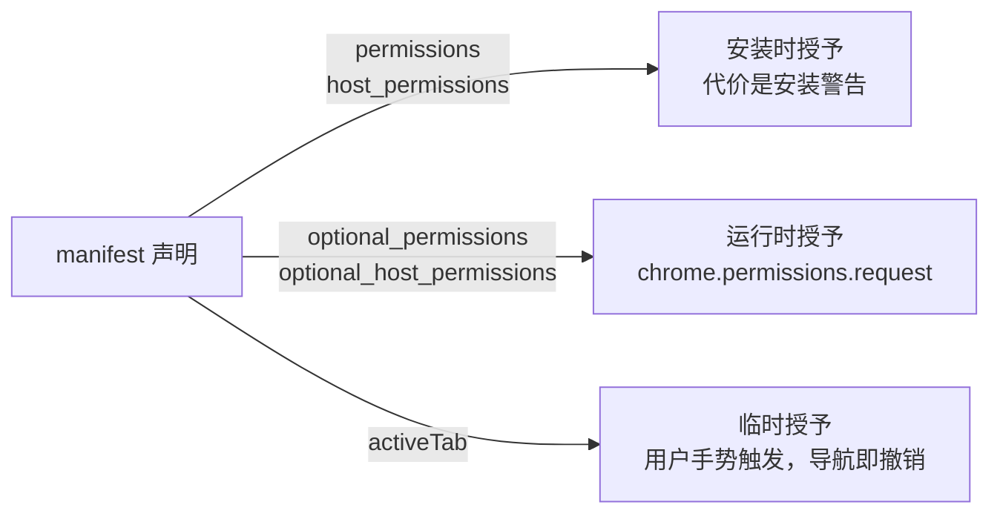

import { Canvas, Controls, Meta } from '@storybook/addon-docs/blocks';
import * as ManifestPermissions from './manifest-permissions.stories';

<Meta of={ManifestPermissions} name="Docs" />

# Manifest 与权限

manifest.json 的字段分三类：**身份字段**（`manifest_version`、`name`、`version`——扩展叫什么）在[第一个扩展](?path=/docs/first-extension--docs)讲过；**装配字段**（`background`、`action`、`content_scripts`——扩展由哪些部分组成）在[扩展架构](?path=/docs/extension-architecture--docs)讲过；剩下最重的一类是**授权字段**：`permissions`、`host_permissions`、`optional_permissions`、`optional_host_permissions`。装配决定扩展有哪些部分，授权决定这些部分能调用哪些 API、能碰哪些站点——Chrome 按声明放行，没声明的 API 直接是 `undefined`。

本课给出 manifest 关键字段的总地图，并把主轴放在权限体系上：权限分「具名权限」和「主机权限」两条能力轴，每条轴又分「安装时申请」和「运行时申请」两种时机；安装时申请的代价是权限警告，`activeTab` 则提供第三条路——用一次用户手势换取当前标签页的临时访问。其余字段（`icons`、`web_accessible_resources`、`default_locale`、`minimum_chrome_version` 等）按回查需要展开。



manifest 关键字段地图，回查时按行定位：

| 字段 | 作用 | 落点 |
| --- | --- | --- |
| `manifest_version` / `name` / `version` | 身份（必需） | [第一个扩展](?path=/docs/first-extension--docs) |
| `description` / `short_name` / `version_name` | 展示文案 | 本节末尾的补充字段表 |
| `icons` | 扩展图标 | 本课「icons」 |
| `background` / `action` / `content_scripts` | 装配三类上下文 | [扩展架构](?path=/docs/extension-architecture--docs) |
| `options_page` / `chrome_url_overrides` / `side_panel` / `commands` / `devtools_page` / `omnibox` | UI 与功能入口 | 本课「UI 入口字段」及对应课程 |
| `permissions` / `host_permissions` | 安装时授权 | 本课「permissions 与 host_permissions」 |
| `optional_permissions` / `optional_host_permissions` | 运行时授权 | 本课「运行时申请权限」 |
| `web_accessible_resources` | 暴露资源给网页 | 本课「web_accessible_resources」 |
| `default_locale` / `minimum_chrome_version` | 本地化与兼容约束 | 本课「default_locale 与 minimum_chrome_version」 |
| `content_security_policy` / `incognito` / `externally_connectable` 等 | 安全与边界 | 本节末尾补充表 + [安全与隐私](?path=/docs/security-privacy--docs) |

完整字段清单以 [Manifest 字段参考](https://developer.chrome.com/docs/extensions/reference/manifest)为准，本课覆盖其中影响日常判断的关键成员。

## 快速上手

权限最直接的证据链是「没声明就报错，声明了就通」：`chrome.storage` 需要 `"storage"` 权限，不声明时 `chrome.storage` 整个是 `undefined`。沿用[第一个扩展](?path=/docs/first-extension--docs)的扩展目录，三步验证。

**第一步：在 manifest.json 声明权限。** 加一行 `permissions`：

```json
{
  "manifest_version": 3,
  "name": "第一个扩展",
  "version": "1.0",
  "action": { "default_popup": "popup.html" },
  "permissions": ["storage"]
}
```

**第二步：在 popup 里使用它。** `popup.html` 的 `<body>` 加一个按钮和脚本引用：

```html
<button id="save">保存一次点击</button>
<script src="popup.js"></script>
```

`popup.js` 与清单同目录：

```js
// chrome.storage 需要 permissions 里声明 "storage"，否则 chrome.storage 是 undefined
const button = document.querySelector('#save');
button.addEventListener('click', async () => {
  const { count = 0 } = await chrome.storage.local.get('count');
  await chrome.storage.local.set({ count: count + 1 });
  button.textContent = `已保存 ${count + 1} 次`;
});
```

**第三步：重载并观察。** 到 `chrome://extensions` 点「重新加载」，点开 popup 点击按钮。

可观察结果：

| 操作 | 可观察证据 |
| --- | --- |
| 先删掉 `permissions` 行再重载、点按钮 | popup 控制台报 `Cannot read properties of undefined (reading 'local')`（查看方法见[调试扩展](?path=/docs/debugging--docs)） |
| 声明 `"storage"` 并重载后点按钮 | 按钮文字变为「已保存 1 次」，连续点击递增 |
| 打开 `chrome://extensions` → 扩展详情 → 「权限和隐私」 | 列出该扩展被授予的权限说明 |

## permissions 与 host_permissions

权限声明分两条能力轴：**具名权限**是固定字符串，逐个开启某项 API 能力；**主机权限**是 URL 匹配模式，授予对一组站点的访问。每条轴都有安装时（`permissions` / `host_permissions`）和运行时（`optional_permissions` / `optional_host_permissions`）两种声明位置，安装时权限在用户安装那一刻一次性授予，运行时权限只声明「以后可以申请」。

```json
{
  "permissions": ["storage", "tabs"],
  "host_permissions": ["https://example.com/*"],
  "optional_permissions": ["notifications"],
  "optional_host_permissions": ["*://*.github.com/*"]
}
```

### 具名权限 permissions

`permissions` 的每个值来自官方固定清单，作用通常是开启某个 `chrome.*` API 的调用资格：

```json
"permissions": ["storage", "tabs", "scripting"]
```

写哪条权限不看记忆看文档：每个 API 的 Reference 页列明它需要的权限，例如 `chrome.storage` 需要 `"storage"`、`chrome.contextMenus` 需要 `"contextMenus"`、`chrome.scripting` 需要 `"scripting"`。拼错字符串时加载扩展直接报 `Permission '...' is unknown or URL pattern is malformed`。

三个容易误判的边界：

- 不是每个 API 都要权限。`chrome.runtime`、`chrome.devtools` 开箱即用；`chrome.tabs` 的查询与管理操作不需要任何权限，只有读取 `url`、`title`、`favIconUrl` 等敏感属性才需要 `"tabs"` 或覆盖该站点的主机权限。
- 有些权限不开 API 而是改行为：`"activeTab"`（见下文）授出临时访问，`"unlimitedStorage"` 放宽存储配额。
- content script 能直接调用的 API 子集与这里声明的权限无关，它只认官方受限清单，缺的能力靠消息转发到扩展上下文完成（结论见[扩展架构](?path=/docs/extension-architecture--docs)）。

### 主机权限与 match pattern

`host_permissions` 的值是 **match pattern**，语法为 `scheme://host/path`：

```json
"host_permissions": ["https://example.com/*", "*://*.github.com/*"]
```

| 模式 | 匹配 | 不匹配 |
| --- | --- | --- |
| `https://example.com/*` | `https://example.com/` 及其任意路径 | http 站点、其他域名 |
| `*://*.github.com/*` | http 与 https 下任意 `github.com` 子域 | 其他域名 |
| `https://*/foo*` | 任意 https 站点下以 `/foo` 开头的路径 | 其他路径 |
| `http://127.0.0.1/*` | 本机回环地址的任意端口 | 其他主机 |
| `<all_urls>` | 全部 http / https / file 页面 | `chrome://` 等受限页面 |

书写规则：

- scheme 只能是 `http`、`https`、`*`（代表 http 与 https）、`file`；`file:///` 要三个斜杠，且需要用户在扩展详情页手动开启「允许访问文件网址」。
- host 通配符只能在开头：`*.example.com` 合法，`www.*.com` 非法；不支持按顶级域通配（`google.*`）。
- path 必填但对主机权限无效（惯例写 `/*`）；端口默认匹配所有端口，除非显式指定。
- `<all_urls>` 触发最重的警告，Chrome Web Store 审核也会更慢，能用窄模式就不用它。

声明主机权限后，扩展上下文获得这些能力：从 service worker、popup 等 `fetch()` 跨域资源；读取 `tabs.Tab` 的敏感属性；配合 `"scripting"` 编程式注入脚本；`chrome.webRequest` 监听与控制、`chrome.cookies` 读写、`declarativeNetRequest` 改写请求头。不需要主机权限的：`chrome.tabs` 的基础操作、`chrome.debugger`，以及 manifest 静态声明的 `content_scripts`——但后者自己的 `matches` 会触发警告。

## 权限警告

安装时权限的代价是**权限警告**：用户在安装对话框里看到「这个扩展可以读取您的浏览记录」之类的提示，然后决定是否信任。警告由 Chrome 根据声明自动生成——来源只有三处：`permissions`、`host_permissions`，以及 `content_scripts.matches`；文案不能定制，声明了什么就警告什么。

用户会在三处看到权限：安装时的确认对话框（拖 `.crx` 进 `chrome://extensions` 或从商店安装）、扩展详情页的「权限和隐私」区块、商店列表页。本地开发加载解压目录不弹安装对话框，详情页是观察权限的入口；想预览安装对话框本身，可以打包成 `.crx` 拖进来（官方给出的预览方式）。

警告密度直接决定安装转化，所以值得记住警告的分布：

- 无警告的常用权限：`storage`、`activeTab`、`alarms`、`contextMenus`。
- 有警告的常见权限：`tabs` → "Read your browsing history"；`notifications` → "Display notifications"；主机权限按范围出警告，宽模式警告重于单站点。
- **吸收规则**：同时请求 `<all_urls>` 时，`tabs` 的警告会被吸收掉——宽主机权限的警告已经覆盖了它。

下面的预演演示同一组能力声明在不同位置时，用户分别在什么时刻看到什么：

<Canvas of={ManifestPermissions.Interactive} />
<Controls of={ManifestPermissions.Interactive} />

| 读者操作 | 可观察证据 |
| --- | --- |
| 勾选 tabs | 安装对话框出现 "Read your browsing history" |
| 主机权限切到 all（`<all_urls>`） | 警告变为 "Read and change all your data on all websites"，且 tabs 的警告被吸收消失 |
| 勾选 storage | 不增加任何警告——不是每个权限都有警告 |
| 打开「声明为 optional」 | 安装对话框清空，勾选的能力移入右侧运行时申请面板 |
| 打开 Show code | 看到 `computeDeclarations`：警告文案与吸收规则的唯一来源 |

警告文案参考官方权限列表与 Chrome 实际显示的英文原文，实际界面会按浏览器语言本地化。另有一条发布期规则：**更新扩展时新增会触发警告的权限，扩展会被禁用**，直到用户接受新权限——发布路径上的取舍见「最佳实践」。

## activeTab

`activeTab` 是第三条路：不预先申请任何主机权限，当用户主动调用扩展时，授予**当前标签页**的临时主机访问。它不产生安装警告，访问随场景结束而撤销——适合「用户点了按钮才需要对当前页面做事」的场景，也是很多 `<all_urls>` 使用的替代方案。

```json
"permissions": ["activeTab", "scripting"]
```

```js
// sw.js —— 点击工具栏图标时，activeTab 授予该标签页的临时主机访问
chrome.action.onClicked.addListener(async (tab) => {
  // chrome:// 等受限页面不会授予 activeTab，读不到 tab.url
  if (!tab.url || !tab.id) {
    return;
  }
  await chrome.scripting.executeScript({
    target: { tabId: tab.id },
    files: ['content.js'],
  });
});
```

授予只发生在用户手势的瞬间，触发点共四个：

| 用户操作 | 触发点 |
| --- | --- |
| 点击工具栏图标 | `chrome.action` |
| 点击扩展的右键菜单项 | `chrome.contextMenus` |
| 按下扩展快捷键 | `chrome.commands` |
| 接受地址栏建议 | `chrome.omnibox` |

授予期间等价于拿到了该标签页的临时主机权限：`chrome.scripting.executeScript()` / `insertCSS()`（需另声明 `"scripting"`）、读取 `tabs.Tab` 的敏感属性、用 `chrome.webRequest` 拦截该标签页主帧的请求。撤销时机：标签页导航离开已授予的源（`example.com` 内跳转仍有效，跳到别的域名即失效），或用户离开、关闭该标签页。`chrome://` 等受限页面永远不会授予。

边界：activeTab 只覆盖「当下这一下」的场景，用户没有触发手势的标签页依旧拿不到访问；常驻访问还是要回到主机权限或运行时申请。

## 运行时申请权限

`optional_permissions` 与 `optional_host_permissions` 声明「以后可以申请」的能力，配 `chrome.permissions` API 在真正需要的时刻向用户申请。同一段能力，挪进 optional 字段就不再触发安装警告——代价是申请动作必须发生在用户手势里，且要自己维护授权状态。

完整闭环四步：

```json
{
  "optional_permissions": ["tabs"],
  "optional_host_permissions": ["*://*/*"]
}
```

```js
// options.js —— 第一步检查，第二步在用户手势中申请
const button = document.querySelector('#enable-history');

button.addEventListener('click', async () => {
  // contains：检查当前是否已持有；request 只能申请 optional 字段里声明过的能力
  if (await chrome.permissions.contains({ permissions: ['tabs'] })) {
    return;
  }
  // request 必须在点击、按键等用户手势中调用，否则报错；
  // origins 可以只申请 optional_host_permissions 的子集（路径部分被忽略）
  const granted = await chrome.permissions.request({
    permissions: ['tabs'],
    origins: ['https://www.google.com/'],
  });
  button.textContent = granted ? '已开启历史功能' : '未授权，功能不可用';
});
```

```js
// 后续维护：授权状态变化会推送事件，据此开关功能
chrome.permissions.onAdded.addListener(() => enableHistoryFeature());
chrome.permissions.onRemoved.addListener(() => disableHistoryFeature());
```

四步对应关系：**声明**（manifest 的 `optional_*`）→ **检查**（`contains` / `getAll`）→ **申请**（`request`，用户手势内，返回 `boolean`）→ **维护**（`onAdded` / `onRemoved` 监听，`remove` 主动收回——`request` 来的权限可以 `remove`，安装时的必需权限不能）。

边界：

- 只能申请 `optional_permissions` / `optional_host_permissions` 里声明过的内容；要申请运行时才知道的站点，在 `optional_host_permissions` 里放一个宽模式（如 `*://*/*`），`request` 时再给具体源。
- 少数权限不能声明为 optional：`debugger`、`declarativeNetRequest`、`devtools`、`geolocation`、`proxy`、`tts`、`ttsEngine` 等，只能安装时申请。
- 授权不是一劳永逸：用户随时可以在拼图菜单或扩展详情页把站点访问收窄为「点击时」，效果等同于收回主机权限——读敏感属性拿到 `undefined`、跨域 `fetch` 失败。`remove` 之后再 `request` 通常不需要用户再次确认。
- 移除权限后代码要能退回无权限状态：功能开关由 `onAdded` / `onRemoved` 驱动，不要假设申请过就永远持有。

## 其他关键字段

这些字段不装配上下文、不授权限，共同点是「不声明就使用默认行为，声明后 Chrome 按固定规则校验，写错在加载时报错」。

### icons

```json
"icons": {
  "16": "icons/icon16.png",
  "32": "icons/icon32.png",
  "48": "icons/icon48.png",
  "128": "icons/icon128.png"
}
```

128 用于安装流程与 Chrome Web Store（应当总是提供），48 用于 `chrome://extensions` 管理页，16 用作扩展页面的 favicon；省略时显示默认拼图图标。可以额外提供其他尺寸，Chrome 自动取最合适的；推荐 PNG（透明度支持最好），SVG 和 WebP 不支持。

### web_accessible_resources

扩展的文件默认被完全锁死，只有扩展自身的页面能访问；网页要加载扩展里的图片、字体等资源，必须在 manifest 里显式开放：

```json
"web_accessible_resources": [
  {
    "resources": ["images/*"],
    "matches": ["https://example.com/*"]
  }
]
```

MV3 格式是对象数组（MV2 的字符串数组已失效），每个对象必须包含 `resources`（相对扩展根目录的路径，支持通配符）和 `matches` 与 `extension_ids` 至少其一（谁可以访问）。`matches` 只用 origin 部分做匹配，路径写成 `/*` 以外的形式会报 invalid match pattern。开放后网页可通过 `chrome.runtime.getURL('images/x.png')` 生成的 `chrome-extension://` 地址加载资源；`use_dynamic_url: true` 可让地址每次会话变化，降低被指纹识别的风险。content script 使用扩展自己的资源不需要这个字段。

### default_locale 与 minimum_chrome_version

两个约束字段，声明前先想清楚是否真的需要：

- `default_locale`：与 `_locales` 目录绑定——存在 `_locales` 时它必填，扩展未本地化时不得使用；指向默认语言文件夹（如 `"zh_CN"`）。多语言文案的组织见[国际化](?path=/docs/i18n--docs)。
- `minimum_chrome_version`：能安装本扩展的最低 Chrome 版本，值必须是真实版本串的子串（`"107"`、`"107.0.5304.87"` 均合法，`"107.x"` 不行）。低于该版本的用户看到「不兼容」，且不会收到自动更新。典型用途：依赖某版本才有的 API（如 Chrome 133+ 的 `permissions.addHostAccessRequest`）时抬高门槛。

### UI 入口字段

这些字段声明扩展的各种入口，各自对应一条独立的开发链路，本课只给入口定位：

| 字段 | 打开的入口 | 详讲课程 |
| --- | --- | --- |
| `action` | 工具栏图标、badge、popup | [Action 与弹窗](?path=/docs/action-popup--docs) |
| `side_panel` | 浏览器侧边栏 | [侧边栏](?path=/docs/side-panel--docs) |
| `commands` | 键盘快捷键（manifest 静态定义，可在 `chrome://extensions/shortcuts` 修改） | [右键菜单与快捷键](?path=/docs/context-menus-commands--docs) |
| `contextMenus` | 不是 manifest 字段：`permissions` 里声明 `"contextMenus"`，菜单项在 service worker 里用 `chrome.contextMenus.create()` 注册 | [右键菜单与快捷键](?path=/docs/context-menus-commands--docs) |
| `chrome_url_overrides` | 替换新标签页、历史、书签页 | [替换页面与选项页](?path=/docs/override-options--docs) |
| `options_page` / `options_ui` | 扩展选项页 | [替换页面与选项页](?path=/docs/override-options--docs) |
| `omnibox` | 地址栏关键词建议 | [地址栏建议](?path=/docs/omnibox--docs) |
| `devtools_page` | DevTools 扩展面板 | [DevTools 扩展](?path=/docs/devtools-extension--docs) |

其余低频字段一句话定位：`short_name`（≤12 字符的短名，缺省截断 `name`）、`version_name`（展示用版本描述，如 `"1.0 beta"`，缺省显示 `version`）、`homepage_url`（缺省为商店页）、`incognito`（无痕窗口行为：`spanning` / `split` / `not_allowed`）、`externally_connectable`（允许指定网页或其他扩展发消息，见[消息通信](?path=/docs/messaging--docs)）、`oauth2`（OAuth 客户端配置，见[用户身份](?path=/docs/identity--docs)）、`content_security_policy`（见[安全与隐私](?path=/docs/security-privacy--docs)）、`update_url`（自托管更新，见[打包与上架](?path=/docs/publishing--docs)）、`key`（开发期固定扩展 ID）。另有 `file_handlers` 等 ChromeOS 专属键，桌面 Chrome 不涉及。

## 最佳实践

权限清单是扩展与用户之间的信任合同，取舍集中在三点：警告要少、权限要活、升级要稳。

- **先查文档再写权限。** 每个 API 的 Reference 页列明所需权限；能用无警告权限（`storage`、`activeTab`、`alarms`、`contextMenus`）完成的就不引入 `tabs` 这类有警告的权限，不为「以后可能用」预留声明。
- **activeTab 优先于宽主机权限。** 需要对「用户正在看的页面」做事时，用 `activeTab` + 用户手势，而不是 `<all_urls>`；确实需要常驻访问时，主机权限能窄则窄（单站点模式优先于通配）。
- **大能力用 optional 渐进申请。** 高敏感能力放进 `optional_permissions` / `optional_host_permissions`，在功能开关处用 `request` 申请，并在界面上说明为什么需要；申请被拒绝时功能降级而不是报错。
- **权限升级走平滑路径。** 已发布扩展新增会触发警告的权限，用户必须重新接受，期间扩展被禁用；给已有扩展加功能优先用 optional 权限，必需权限清单尽量保持稳定。
- **不绕过警告。** 警告文案由 Chrome 生成、不可定制；用变通声明（如用更宽的主机权限绕开 `tabs` 警告的吸收规则反向操作）只会换来审核风险和用户不信任。

## 常见问题

- 调用某个 `chrome.*` API 时报 `Cannot read properties of undefined`
  到该 API 的 Reference 页查「Manifest」小节所需的权限，补进 `permissions` 并重载扩展。`chrome.storage` 未声明时 `chrome.storage` 整体是 `undefined`，是最常见的例子。
- 更新扩展后卡片变灰、提示需要新权限
  本次更新新增了会触发警告的权限，扩展被禁用直到用户接受。开发时到 `chrome://extensions` 重新启用即可；发布时应评估改用 optional 权限。
- `chrome.permissions.request()` 报 "This function must be called during a user gesture"
  把 `request` 挪进用户手势处理里（按钮 click、键盘命令回调等）；在 service worker 的任意时机或异步链路深处直接调用都不算手势。
- 声明了 `host_permissions`，还是读不到 `tab.url`、跨域 `fetch` 失败
  用户把该扩展的站点访问收窄成了「点击时」（拼图菜单或详情页可查）；在这种状态下用 `activeTab` 的手势触发，或引导用户改回「在所有网站上」。访问 `file://` 还需要在详情页手动开启「允许访问文件网址」。
- 网页加载扩展资源 403 / 资源不可访问
  检查 `web_accessible_resources` 是否为 MV3 对象格式（`resources` + `matches`），且 `matches` 覆盖发起请求的页面；MV2 的字符串数组写法在 MV3 无效。

## 总结回顾

摘要：

manifest.json 的字段分身份、装配、授权三类，本课的主轴是授权字段：具名权限 `permissions` 开启 API 能力、主机权限 `host_permissions` 授予站点访问，两者都有安装时与 optional 运行时两种声明位置。安装时权限的代价是 Chrome 自动生成的权限警告（来源是 `permissions`、`host_permissions`、`content_scripts.matches`），`activeTab` 用四个用户手势触发点换取当前标签页的临时访问且不触发警告；`optional_*` 字段配合 `chrome.permissions` 的 `request`（必须在用户手势中）、`contains`、`remove` 与 `onAdded` / `onRemoved` 实现渐进授权，且用户随时可以收窄站点访问。其余关键成员——`icons`、`web_accessible_resources`、`default_locale`、`minimum_chrome_version` 与各 UI 入口字段——按「不声明即默认、声明即校验」的规则工作。

一句话：

> 装配字段决定扩展有哪些部分，权限字段决定这些部分能碰什么——能用手势换的访问不要预先申请，能运行时申请的不要塞进安装警告。

知识要点：

- 四个权限字段（`permissions`、`host_permissions`、`optional_permissions`、`optional_host_permissions`）各授予什么、在什么时机生效？
- 权限警告由哪三处声明产生，在哪些界面展示，哪些常用权限没有警告？
- `activeTab` 由哪些用户操作触发，授予什么、何时撤销，`chrome://` 页面为什么读不到？
- `chrome.permissions` 运行时申请的完整闭环是哪四步，`request` 有什么调用前提？
- 哪些权限不能声明为 optional？用户收窄站点访问后扩展行为如何变化？
- `web_accessible_resources` 的默认行为是什么，MV3 格式必须包含哪些成员？
- `minimum_chrome_version` 的取值约束是什么，为什么更新时新增警告权限会导致扩展被禁用？

## 参考资料

- [Manifest 字段参考](https://developer.chrome.com/docs/extensions/reference/manifest)
- [声明权限](https://developer.chrome.com/docs/extensions/develop/concepts/declare-permissions)
- [权限警告](https://developer.chrome.com/docs/extensions/develop/concepts/permission-warnings)
- [权限列表与警告文案](https://developer.chrome.com/docs/extensions/reference/permissions-list)
- [activeTab](https://developer.chrome.com/docs/extensions/develop/concepts/activeTab)
- [chrome.permissions API](https://developer.chrome.com/docs/extensions/reference/api/permissions)
- [Match patterns](https://developer.chrome.com/docs/extensions/develop/concepts/match-patterns)
- [web_accessible_resources](https://developer.chrome.com/docs/extensions/reference/manifest/web-accessible-resources)
- [Manifest icons](https://developer.chrome.com/docs/extensions/reference/manifest/icons)
