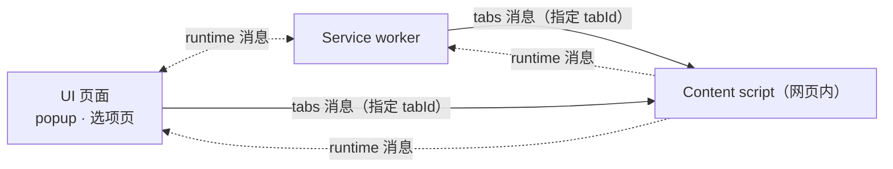

import { Canvas, Controls, Meta } from '@storybook/addon-docs/blocks';
import * as MessagingStories from './messaging.stories';

<Meta of={MessagingStories} name="Docs" />

# 消息通信

[扩展架构](?path=/docs/extension-architecture--docs)建立了上下文模型：popup、service worker、content script 各自运行、互不共享内存，靠通道协作。本课把「消息」这条通道展开成两套 API：**一次性请求-响应**（`sendMessage` / `onMessage`）与**长连接 Port**（`connect` / `onConnect`）。读完本课，你应当能回答三个问题：往哪个方向发该用哪个 API、响应怎么拿回来才不会丢、通道什么时候建立、什么时候关闭。

消息按发送方向选择 API；content script 一侧固定用 `runtime.onMessage` / `runtime.onConnect` 接收，不区分消息来自哪个方向：



按发送方调用的 API 回查（外部来源与 native 入口在「外部消息」一节展开）：

| 发送方调用的 API | 消息去向 | 接收端监听 | 通道形态 |
| --- | --- | --- | --- |
| `chrome.runtime.sendMessage(message)` | 本扩展除发送方外的全部上下文 | `runtime.onMessage` | 一次性，等一次响应 |
| `chrome.runtime.sendMessage(message)`（content script 中） | 本扩展的全部扩展上下文 | `runtime.onMessage` | 一次性 |
| `chrome.tabs.sendMessage(tabId, message)` | 指定标签页里的 content script | `runtime.onMessage` | 一次性 |
| `chrome.runtime.connect(connectInfo)` | 本扩展的其他上下文 | `runtime.onConnect` | 长连接 Port，多轮 |
| `chrome.tabs.connect(tabId, connectInfo)` | 指定标签页里的 content script | `runtime.onConnect` | 长连接 Port |
| `chrome.runtime.sendMessage(extensionId, message)` | 其他扩展或声明了 `externally_connectable` 的网页 | `runtime.onMessageExternal` | 一次性 |
| `chrome.runtime.connectNative(application)` / `sendNativeMessage(application, message)` | 本机应用 | 本机程序 | Native Messaging（见 [Native Messaging](?path=/docs/native-messaging--docs)） |

## 快速上手

在 1.2 的最小扩展上补一个 service worker，走通「popup 发问、service worker 应答」的最小闭环。

1. 若 manifest.json 还没有后台声明，加入：

```json
"background": { "service_worker": "sw.js" }
```

2. 新建 `sw.js`，同步应答：

```js
// sw.js —— 接收一次性消息并同步应答
chrome.runtime.onMessage.addListener((message, sender, sendResponse) => {
  if (message.type === 'get-time') {
    sendResponse({ time: new Date().toLocaleTimeString() });
  }
});
```

3. popup 侧换成发送方（`popup.html` 提供按钮与输出行）：

```html
<!-- popup.html -->
<button id="ask">问一下时间</button>
<p id="output"></p>
<script src="popup.js"></script>
```

```js
// popup.js —— 发出请求，await 拿响应
document.querySelector('#ask').addEventListener('click', async () => {
  const response = await chrome.runtime.sendMessage({ type: 'get-time' });
  document.querySelector('#output').textContent = `service worker：${response.time}`;
});
```

重载扩展，点开 popup 再点按钮：输出行显示 service worker 应答的时间，每点一次刷新一次。popup 每次打开都是新上下文，service worker 可能正在休眠——`sendMessage` 本身就是唤醒它的事件。本例监听器同步调用了 `sendResponse`，不需要 `return true`；要等异步结果再应答就必须保活通道，见「应答与通道存活」。

## 一次性请求-响应

一次调用传递一个可 JSON 序列化的值，发送方等待**一个**响应，通道随后关闭。`chrome.runtime.sendMessage(message)` 把消息广播给本扩展除发送方以外的全部上下文（service worker、popup、选项页等都会收到）；发送方用 `await`（或 callback）拿到响应。三种可能的结果：

| 发送方 `await` 的结果 | 通道发生了什么 |
| --- | --- |
| 拿到响应值 | 有监听器调用了 `sendResponse` |
| reject：`Could not establish connection. Receiving end does not exist.` | 对端没有任何监听器 |
| reject：`The message port closed before a response was received.` | 有监听器，但通道关闭前没人应答 |

这两个错误串值得背下来：排查消息问题时，先看 reject 的是哪一个。

### 发送方向

方向决定用哪个 API，接收端统一是 `runtime.onMessage`：

```js
// content.js —— content script → 扩展上下文：所有 onMessage 监听器都会收到
chrome.runtime.sendMessage({ type: 'pick-text', text: document.title });
```

```js
// popup.js —— 扩展上下文 → 指定标签页里的 content script：必须经 tabs API 定向
const [tab] = await chrome.tabs.query({ active: true, currentWindow: true });
const reply = await chrome.tabs.sendMessage(tab.id, { type: 'get-summary' });
```

- `runtime.sendMessage` 够不到 content script；扩展上下文要主动联系某个标签页里的 content script，必须用 `tabs.sendMessage` / `tabs.connect` 并给出 `tabId`。查当前标签页的常用写法就是上面的 `chrome.tabs.query({ active: true, currentWindow: true })`。
- `tabs.sendMessage` 发到没有 content script 的标签页（不匹配 `matches`，或页面尚未注入）会得到 `Receiving end does not exist`；注入时机由 [Content Scripts](?path=/docs/content-scripts--docs)承载。
- 扩展上下文之间互发（popup ↔ service worker ↔ 选项页）直接用 `runtime.sendMessage`，不需要 tabs API；除发送方以外的所有扩展上下文都收到消息，靠 `type` 区分用途。

### 应答与通道存活

`onMessage` 监听器收到三个参数：`message`（消息值）、`sender`（来源）、`sendResponse`（应答函数）。同步应答直接调用即可；**异步应答必须 `return true`**，否则监听器一返回，`sendResponse` 立即失效：

```js
// sw.js —— 需要异步取数再应答时，先 return true 保活通道
chrome.runtime.onMessage.addListener((message, sender, sendResponse) => {
  if (message.type === 'greet') {
    setTimeout(() => {
      sendResponse({ text: `来自标签页 ${sender.tab?.id ?? '扩展内部'}` });
    }, 500);
    return true; // 通道保持存活，直到 sendResponse 被调用
  }
  // 不打算应答的分支不要 return true，否则发送方会一直等
});
```

下面按时序模拟三种应答方式下通道的存活区间与发送方结果；错误文案与 Chrome 真实 reject 一致。

<Canvas of={MessagingStories.OneTime} />
<Controls of={MessagingStories.OneTime} />

| 读者操作 | 可观察证据 |
| --- | --- |
| 切到「异步未 return true」 | 通道在监听器返回后关闭，稍后的 `sendResponse` 响应丢失，发送方 reject |
| 切回「异步 + return true」 | 蓝色通道存活区间延伸到响应送达，发送方 `resolve` |
| 调大「sendResponse 耗时」 | return true 下等待随之变长；未 return true 下无论等多久响应都丢失 |

边界：

- 监听器**返回 Promise 不会**自动应答（这点与发送方的 Promise 相反）；Chrome 146/148 起才逐步支持监听器返回 Promise 作为响应，`return true` 则始终有效，是兼容性最好的写法。
- 第一个调用 `sendResponse` 的监听器赢得响应，其余监听器的应答被丢弃。
- 通道没有超时：`return true` 之后如果从不调用 `sendResponse`，发送方会一直挂起，直到对端上下文销毁才 reject。

### 消息内容与来源

- 消息按 JSON 语义序列化：函数、DOM 节点、原型链都会丢，`undefined` 变成 `null`；响应不可序列化时报 `Could not serialize message.`。单条消息上限 64 MiB。
- 广播语义决定了路由约定：每条消息所有监听器都能收到，用 `type` 字段分发，每个上下文保持一个消息入口：

```js
// 每条消息会广播给所有监听器，用 type 分发
chrome.runtime.onMessage.addListener((message, sender, sendResponse) => {
  switch (message.type) {
    case 'pick-text': /* ... */ break;
    case 'page-ready': /* ... */ break;
  }
});
```

- `sender` 说明消息从哪来：`sender.tab`（来自哪个标签页）、`sender.id`（来源扩展）、`sender.origin` / `sender.url`。执行敏感操作前先校验来源，外部消息尤其如此（见「外部消息」）。

## 长连接 Port

一问一答之外的场景——多轮对话、持续推送进度或状态——用 `chrome.runtime.connect` 建立长连接：一次握手得到 `runtime.Port` 对象，之后两端随时 `port.postMessage`，用 `port.name` 声明用途，用完 `port.disconnect()` 显式断开。扩展上下文向指定标签页的 content script 建立端口用 `chrome.tabs.connect(tabId, connectInfo)`。

```js
// popup.js —— 建立端口，多轮收发
const port = chrome.runtime.connect({ name: 'progress' });
port.postMessage({ type: 'start', count: 100 });
port.onMessage.addListener((message) => {
  if (message.type === 'progress') render(message.value);
});
```

```js
// sw.js —— onConnect 收到端口，按 port.name 分发
chrome.runtime.onConnect.addListener((port) => {
  if (port.name !== 'progress') return;
  port.onMessage.addListener((message) => {
    if (message.type === 'start') runTask(port); // 进度通过 port.postMessage 推送
  });
  port.onDisconnect.addListener(() => cleanup());
});
```

下面的时序对比一次性消息：同样传多轮数据，Port 只开一条通道，且断开是一个显式事件。

<Canvas of={MessagingStories.Port} />
<Controls of={MessagingStories.Port} />

| 读者操作 | 可观察证据 |
| --- | --- |
| 增大「往返轮数」 | 同一条端口上 `postMessage` 成对增加，通道不重开 |
| 保持「port.disconnect()」开启 | 时序末尾出现 disconnect → 对端 onDisconnect，通道存活条到断开为止 |
| 关闭「port.disconnect()」 | 通道保持开启，两端可继续收发 |

边界：

- `port.onDisconnect` 在对端不再有可用端口时触发：对端调用了 `disconnect()`、对端标签页卸载或导航、对端上下文销毁，或对端根本没有 `onConnect` 监听器（此时发起方也会收到自己端口的 `onDisconnect`）。一个端口挂多个接收端时，`onDisconnect` 可能触发多次。
- 与 service worker 生命周期的关系：打开端口本身不保活（Chrome 114 起）；端口上有消息往来才会重置空闲计时。service worker 仍可能在无消息的间隙被终止，长任务要按「端口随时可能断开」设计，断开后能从存储恢复进度。生命周期细节见 [Service Worker](?path=/docs/service-worker--docs)。

## 外部消息

网页和其他扩展也能给本扩展发消息，入口由 manifest 的 `externally_connectable` 键声明：

```json
"externally_connectable": {
  "matches": ["https://*.example.com/*"],
  "ids": ["*"]
}
```

- `matches` 声明哪些网页可以连接，`ids` 声明哪些扩展可以连接（`"*"` 表示全部）。
- 对端调用 `chrome.runtime.sendMessage(扩展ID, message)` 或 `chrome.runtime.connect(扩展ID)`；本扩展用 `runtime.onMessageExternal` / `runtime.onConnectExternal` 接收。
- 默认行为（未声明该键）：所有其他扩展都能连接，网页都不能。一旦声明了 `matches` 却没写 `ids: ["*"]`，其他扩展反而会被挡在外面。
- `onMessageExternal` 的消息可能来自任意外部站点，先校验 `sender.origin` / `sender.id` 再执行操作。注意方向是单向的：扩展不能反过来向网页发消息。

与**本机应用**的通信是另一条通道：`chrome.runtime.connectNative(application)` 建立长连接、`sendNativeMessage(application, message)` 一次请求，需要 `nativeMessaging` 权限并在本机注册 native messaging host。完整机制由 [Native Messaging](?path=/docs/native-messaging--docs)承载。

## 最佳实践

- 通道选型：一问一答用 `sendMessage`；三轮以上交互或持续推送用 Port；要跨开关、跨重启保留的状态不进消息，写 `chrome.storage`（见[存储](?path=/docs/storage--docs)）。
- 每个上下文只注册一个 `onMessage` / `onConnect` 入口，按 `type` / `port.name` 分发；多个监听器并存时只有第一个应答生效，很难排查。
- 消息只传轻量数据：大数据先写入 `chrome.storage` 或生成长期 URL，消息里传键名，避免每轮重传大对象。
- `return true` 纪律：只在确定要异步应答的分支返回；其余分支让监听器自然返回，不给发送方留无限等待。
- 长任务放 service worker，popup 用 Port 收进度：弹窗关闭只是断开端口，任务由 service worker 继续，重开弹窗重新 `connect` 即可接上。

## 常见问题

- 发送方报 `The message port closed before a response was received.`
  监听器里有异步 `sendResponse` 却没有 `return true`（或所有监听器都没应答就返回了）。给需要异步应答的分支加 `return true`。
- 发送方报 `Could not establish connection. Receiving end does not exist.`
  对端没有监听器。三种常见来源：`tabs.sendMessage` 发到了没注入 content script 的标签页；接收端根本没注册监听器（如 service worker 漏写 `onMessage`）；重载扩展后旧页面里残留的 content script 已与新 service worker 断开关联——刷新页面重新注入。
- `await chrome.runtime.sendMessage(...)` 一直不返回
  监听器 `return true` 之后没有走到 `sendResponse`。通道没有超时，发送方会挂到对端上下文销毁为止；确保 `return true` 的每条路径都会应答。
- popup 里发出的请求，弹窗一关响应就丢了
  popup 上下文销毁，等待中的 Promise 与 Port 一并消失。长任务交给 service worker 执行，popup 只负责发起与展示（见最佳实践）。

## 总结回顾

摘要：

消息通信按方向选 API：content script 与扩展上下文互发时，上行用 `chrome.runtime.sendMessage`，下行（指定标签页）用 `chrome.tabs.sendMessage`，扩展上下文之间用 `runtime.sendMessage`；接收端统一是 `runtime.onMessage`。一次性通道一问一答即关，监听器要异步应答必须 `return true` 保活 `sendResponse`，否则通道随监听器返回关闭、响应丢失，发送方得到 `The message port closed before a response was received`；对端没有监听器则是 `Receiving end does not exist`。多轮对话与持续推送用 `runtime.connect` 建立长连接 Port：`port.name` 标记用途，两端随时 `postMessage`，断开以 `onDisconnect` 显式呈现。网页与其他扩展的连接要走 `externally_connectable` 声明与 `onMessageExternal`；本机应用走 native messaging。

一句话：

> 方向决定 API，一次问答用 sendMessage 一答即关，多轮推送用 Port；监听器要异步应答必须 return true，否则 sendResponse 随通道一起失效。

知识要点：

- content script 与扩展上下文互发消息，各自该用哪个 API、在哪个事件上接收？
- 发送方 `await` 的 Promise 在哪三种情况下分别返回响应、`Receiving end does not exist`、`message port closed`？
- `return true` 改变了通道的什么？不返回时异步 `sendResponse` 会怎样？
- Port 相比一次性消息多了哪些事件，`onDisconnect` 在什么时候触发？
- 网页或别的扩展要给本扩展发消息，本扩展需要什么声明、用什么事件接收？

## 参考资料

- [扩展通信（消息）](https://developer.chrome.com/docs/extensions/develop/concepts/messaging)
- [chrome.runtime API 参考](https://developer.chrome.com/docs/extensions/reference/api/runtime)
- [chrome.tabs API 参考](https://developer.chrome.com/docs/extensions/reference/api/tabs)
- [manifest 的 externally_connectable 键](https://developer.chrome.com/docs/extensions/reference/manifest/externally-connectable)
- [Service worker 生命周期](https://developer.chrome.com/docs/extensions/develop/concepts/service-workers/lifecycle)
- [Native messaging](https://developer.chrome.com/docs/extensions/develop/concepts/native-messaging)
