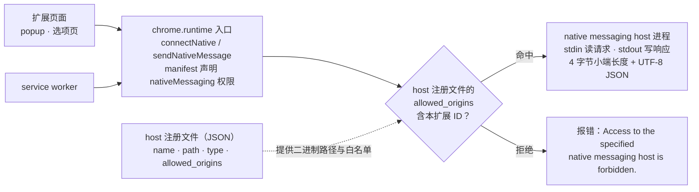

import { Canvas, Controls, Meta } from '@storybook/addon-docs/blocks';
import * as NativeMessagingStories from './native-messaging.stories';

<Meta of={NativeMessagingStories} name="Docs" />

# Native Messaging

扩展默认被关在浏览器沙箱里，碰不到浏览器之外的本机资源。Native messaging 是官方开的一条受控口子：扩展通过 `chrome.runtime` 的两个 API 与本机的一个 **native messaging host** 进程用 stdin/stdout 对话，每条消息是「4 字节小端长度头 + UTF-8 JSON」。它把文件系统、本地数据库、硬件和已有桌面应用接进扩展，但这条链路有四件事必须同时到位——manifest 声明 `nativeMessaging` 权限、host 注册文件（含绑定扩展 ID 的 `allowed_origins`）、host 按协议读写 stdin/stdout、以及理解两个 API 各自的进程模型。缺任何一件，调用点都会失败，但失败方式是一句明确的错误串，能直接反推出断在哪一环。读完本课，你应当能回答：host 怎么注册、消息长什么样、两个 API 的进程模型差什么、每句错误串对应哪个环节失灵。



按回查方式记住本课四个入口，默认值与上限先落到下表：

| 入口 | 值与约束 |
| --- | --- |
| manifest 权限 | `"permissions": ["nativeMessaging"]`，`connectNative` / `sendNativeMessage` / `onConnectNative` 都需它 |
| 一次性调用 | `chrome.runtime.sendNativeMessage(host, message)` 返回 Promise（Chrome 99 起），每调用新起一个 host 进程 |
| 长连接 | `chrome.runtime.connectNative(host)` 返回 `runtime.Port`，host 进程活到端口销毁 |
| 扩展 ID 来源 | `chrome://extensions` 页面或 `chrome.runtime.id`；`allowed_origins` 按 `chrome-extension://<扩展ID>/` 声明 |
| host 注册（macOS 用户级） | `~/Library/Application Support/Google/Chrome/NativeMessagingHosts/<name>.json` |
| 帧格式 | 4 字节小端长度头 + UTF-8 JSON，双向同格式 |
| 消息上限 | Chrome→host 64 MiB；host→Chrome 1 MiB（保护 Chrome 免于失控本机应用） |

## 快速上手

用 Node 写一个回显 host，注册后让 popup 通过 `sendNativeMessage` 拿到回显，走通「注册 → 调用 → 观察」的最小闭环。以下假设 manifest.json 已按[第一个扩展](?path=/docs/first-extension--docs)加载了 popup。

1. 声明权限：

```json
"permissions": ["nativeMessaging"]
```

2. 写 host 脚本 `echo-host.mjs`（独立安装的本机程序，与扩展包分开分发）：

```js
#!/usr/bin/env node
// echo-host.mjs —— 读一帧回一帧的最小 native messaging host
import { stdin, stdout, stderr } from 'node:process';

let buffer = Buffer.alloc(0);

stdin.on('data', (chunk) => {
  buffer = Buffer.concat([buffer, chunk]);
  // 一帧 = 4 字节小端长度头 + 等长的 UTF-8 JSON 负载
  while (buffer.length >= 4) {
    const length = buffer.readUInt32LE(0);
    if (buffer.length < 4 + length) return; // 整帧未到齐，等下一个 chunk
    const frame = buffer.subarray(4, 4 + length);
    buffer = buffer.subarray(4 + length);
    const message = JSON.parse(frame.toString('utf8'));
    stderr.write(`host got: ${frame.toString('utf8')}\n`); // 调试只写 stderr
    const payload = Buffer.from(JSON.stringify({ echo: message.text }), 'utf8');
    const header = Buffer.alloc(4);
    header.writeUInt32LE(payload.length, 0);
    stdout.write(Buffer.concat([header, payload]));
  }
});

stdin.on('end', () => process.exit(0)); // 端口销毁 → Chrome 关闭 stdin → 退出
```

赋可执行权限：`chmod +x echo-host.mjs`。

3. 写注册文件 `com.example.echo.json`，`allowed_origins` 填本扩展 ID（chrome://extensions 页面可见）：

```json
{
  "name": "com.example.echo",
  "description": "Echo demo host",
  "path": "/Users/<你的名字>/path/to/echo-host.mjs",
  "type": "stdio",
  "allowed_origins": ["chrome-extension://<扩展ID>/"]
}
```

4. 复制到用户级注册目录：

```bash
mkdir -p ~/Library/Application\ Support/Google/Chrome/NativeMessagingHosts
cp com.example.echo.json ~/Library/Application\ Support/Google/Chrome/NativeMessagingHosts/
```

5. popup 发起调用（`popup.html` 提供按钮与输出行）：

```html
<!-- popup.html -->
<button id="echo">呼叫 host</button>
<p id="output"></p>
<script src="popup.js"></script>
```

```js
// popup.js —— 一次性调用，await 拿 host 响应
document.querySelector('#echo').addEventListener('click', async () => {
  const response = await chrome.runtime.sendNativeMessage('com.example.echo', { text: 'hello' });
  document.querySelector('#output').textContent = `host 回显：${response.echo}`;
});
```

重载扩展（若注册文件是刚放进去的，重启一次 Chrome 再试），点开 popup 点按钮：输出行显示 `host 回显：hello`；同时 host 的 stderr 出现 `host got: {"text":"hello"}`。把调用里的 host 名故意改错再点，Promise reject `Specified native messaging host not found.`——这条错误串只可能是注册环节的问题，协议层根本还没开始。

## 注册 native messaging host

Chrome 不「发现」本机程序，只按注册文件找：每个 host 对应一个 JSON 文件，声明名字、二进制位置、通信类型和允许连接的扩展白名单。扩展调用时传的名字，就是这份 JSON 的 `name` 字段。

### host manifest 字段

| 字段 | 含义 | 约束 |
| --- | --- | --- |
| `name` | 客户端引用 host 用的名字 | 仅小写字母、数字、下划线和点；不能以点开头或结尾，不能出现连续两个点 |
| `description` | 一句话描述 | 仅说明用途 |
| `path` | host 可执行文件路径 | macOS/Linux 必须绝对路径；Windows 可相对注册文件所在目录；host 进程的工作目录被设为该路径所在目录 |
| `type` | 通信接口 | 唯一取值 `"stdio"` |
| `allowed_origins` | 允许连接的扩展 | 每项形如 `chrome-extension://<扩展ID>/`；不允许通配符 |

`allowed_origins` 是这条链路的安全锚点：白名单之外的扩展调用同一个名字，只会拿到 `Access to the specified native messaging host is forbidden.`。host 启动时，调用方 origin 作为**第一个参数**传给 host 进程（argv[0] 是 host 自身路径），多个扩展共用一个 host 时，host 靠这个参数区分来源、自行复核。Windows 上还会追加 `--parent-window=<句柄>` 参数，让 host 能建正确归属的窗口；调用方是 service worker 时该值为 0。

### 注册文件位置

注册文件的落点按平台区分，文件名必须等于 `<name>.json`：

| 平台 | 系统级 | 用户级 |
| --- | --- | --- |
| macOS | `/Library/Google/Chrome/NativeMessagingHosts/<name>.json` | `~/Library/Application Support/Google/Chrome/NativeMessagingHosts/<name>.json` |
| Linux | `/etc/opt/chrome/native-messaging-hosts/<name>.json` | `~/.config/google-chrome/NativeMessagingHosts/<name>.json` |
| Windows | 注册表键 `HKLM\SOFTWARE\Google\Chrome\NativeMessagingHosts\<name>` 或 `HKCU\...`，默认值指向注册文件全路径 | 同左（用户级键） |

Windows 上用管理员命令行写入：

```
REG ADD "HKCU\Software\Google\Chrome\NativeMessagingHosts\com.my_company.my_application" /ve /t REG_SZ /d "C:\path\to\nmh-manifest.json" /f
```

查找顺序：Windows 先查 32 位注册表视图再查 64 位。Chrome for Testing 与 Chromium 的目录不同（Chrome 146 起 Chrome for Testing 改用独立目录），本课以 Google Chrome 稳定版为准。注册文件的解析失败只记 warning，需要 `--log-level=1` 才输出，见「进程生命周期与调试」。

## 消息协议

扩展与 host 是同一条管道（stdin/stdout）的两端，双方用同一份帧格式，没有信封、没有分隔符、没有结束标记——长度头就是全部结构信息。

### 帧格式

一条消息在管道里的字节序列是：

```text
[ 4 字节长度头（小端） ][ N 字节 UTF-8 JSON 负载 ]
```

- 长度头是消息负载的**字节数**，不是字符数；按平台原生字节序编码，现实平台（x86/ARM 的 macOS/Linux/Windows）均为小端。
- 负载是 JSON 对象序列化后 UTF-8 编码的字节。多字节字符一个字符占多个字节，长度头必须按编码后的字节数算。
- 双向同格式：扩展发给 host 的帧和 host 发回的帧结构完全一致。

下面拖动填充量滑块直接看字节变化：同样字符数下勾选中文填充，帧头会成倍变大。

<Canvas of={NativeMessagingStories.MessageFrame} />
<Controls of={NativeMessagingStories.MessageFrame} />

| 读者操作 | 可观察证据 |
| --- | --- |
| 拖动「text 填充字符数」 | 帧头 hex 随消息字节数增长；帧头 4 字节即 `消息字节数` 的小端编码 |
| 勾选「中文填充」 | 同样字符数下字节数约为 ASCII 的 3 倍，单字符明细里 `中` 占 3 字节 |
| 填充到超过 1 MiB | 负载条变红并标出超出 host→Chrome 上限；该方向的帧超过 1 MiB 即判协议违规 |

边界：

- 上限不对称：host→Chrome 1 MiB（Chrome 的自保上限），Chrome→host 64 MiB。需要回传大文件时换通道，见最佳实践。
- 管道里只允许有完整帧。host 写进 stdout 的任何其他字节都会算进下一帧的长度，直接表现为协议错误。

### host 读写循环

host 的整个生命周期就是一个「读帧 → 处理 → 写帧」循环：先读齐 4 字节解出长度，再读齐 N 字节解出负载，`JSON.parse` 后处理，处理结果 `JSON.stringify` 后按同样 framing 写回 stdout。Node 的 `readUInt32LE` / `writeUInt32LE` 正好对应小端头，快速上手的 `echo-host.mjs` 就是完整实现。

三个容易写错的点：

- **读不满就返回等下一个 chunk。** stdin 的 `data` 事件给到的 chunk 不保证帧完整，也不保证一帧一个 chunk；必须攒够 `4 + length` 字节才解析，剩余字节留给下一轮。
- **退出条件是 stdin EOF。** Chrome 销毁端口时会关闭 host 的 stdin，`end` 事件就是 host 的收工信号，此时 `process.exit(0)`。sendNativeMessage 的 host 更简单：写完响应帧就可以退。
- **解析失败要有兜底。** 负载不是合法 JSON 时，host 自己决定丢弃还是写错误帧；循环不能崩，崩了扩展侧只会看到 `Native host has exited.`。

## 扩展侧入口

两个入口与[消息通信](?path=/docs/messaging--docs)的 `sendMessage` / `connect` 一一对应：`sendNativeMessage` 对应一次性消息，`connectNative` 对应长连接 Port。Port 的事件语义（`onMessage`、`onDisconnect`、`lastError`）两课相同，本课只讲跨进程后多出来的部分：**host 是独立进程，进程的生死由 API 选择和端口生命周期决定**。

边界：这两个 API 只在扩展页面和 service worker 里可用，content script 里调用它们不存在——转发链路见「安全考量」。

### sendNativeMessage

一问一答，进程随调用起、随响应终：

```js
// sw.js 或 popup.js —— 一次性请求，Promise 拿响应（Chrome 99 起）
const response = await chrome.runtime.sendNativeMessage('com.example.echo', { text: 'hello' });
```

- 每次调用 Chrome 都新起一个 host 进程；host 写回的**第一条**消息被当作响应，之后 host 再写什么都被忽略。
- 失败通过 Promise reject 暴露：`chrome.runtime.lastError.message` 即 reject 原因。早期 callback 写法仍可用，但必须在 callback 里先查 `chrome.runtime.lastError`。

<Canvas of={NativeMessagingStories.SendOnce} />
<Controls of={NativeMessagingStories.SendOnce} />

| 读者操作 | 可观察证据 |
| --- | --- |
| 默认场景 | Chrome 启动 host 进程、stdin 帧送达、host 写响应帧，Promise resolve |
| 勾选「host 提前退出」 | host 在写响应前退出，stdout 管道断裂，Promise reject `Native host has exited.` |

### connectNative

一次握手之后 host 进程持续存活，多轮收发都走同一条管道：

```js
// popup.js —— 长连接：host 进程活到 port.disconnect() 或上下文销毁
const port = chrome.runtime.connectNative('com.example.echo');
port.postMessage({ text: '第 1 条' });
port.onMessage.addListener((message) => handle(message));
port.onDisconnect.addListener(() => {
  if (chrome.runtime.lastError) {
    console.error('host 异常断开:', chrome.runtime.lastError.message);
  }
});
```

- Chrome 启动 host 进程后，只要端口未销毁，进程一直运行；host 可以在内存里保持会话状态，这是它相对 sendNativeMessage 的本质优势。
- `port.disconnect()` 或端口所在上下文销毁（popup 关闭、service worker 终止）都会断开，host 随后读到 stdin EOF 退出。host 侧提前退出时，扩展侧 `onDisconnect` 触发，`lastError.message` 为 `Native host has exited.`。

<Canvas of={NativeMessagingStories.PortChat} />
<Controls of={NativeMessagingStories.PortChat} />

| 读者操作 | 可观察证据 |
| --- | --- |
| 增大「往返轮数」 | host 进程存活区间内 postMessage/onMessage 成对增加，进程不重启 |
| 保持「port.disconnect()」开启 | 时序末尾断开 → host 退出，进程存活条到此结束 |
| 关闭「port.disconnect()」 | 进程保持运行，端口仍可继续收发 |
| 勾选「host 提前退出」 | 某一轮后进程猝死，`port.onDisconnect` 触发且 `lastError` 为 `Native host has exited.` |

两个入口的进程模型对照，是选型的全部依据：

| | `sendNativeMessage` | `connectNative` |
| --- | --- | --- |
| host 进程 | 每次调用新起一个 | 一次连接一个，活到端口销毁 |
| host 响应 | 只认第一条消息 | 任意轮次 `onMessage` |
| host 状态 | 应设计为无状态 | 可保持会话状态 |
| 适用场景 | 低频、一问一答 | 多轮交互、持续推送 |

另有两个只服务特殊场景的运行时成员，回查时知道存在即可：`runtime.onConnectNative` 事件由 **host 侧主动**发起连接时触发（Chrome 76 起，仅 ChromeOS）；`sender.nativeApplication` 字段在 onConnectNative 事件里给出发起连接的 host 名（Chrome 74 起）。

## 进程生命周期与调试

进程生命线：`connectNative` 或 `sendNativeMessage` 调用时 Chrome 按注册文件启动 host 进程，工作目录为 host 二进制所在目录；端口销毁或一次性响应到手后，Chrome 关闭 host 的 stdin，host 读到 EOF 退出。host 是独立进程，**它的 stderr 不会污染协议流**——stdout 一个字节都只属于帧，调试输出一律写 stderr。

出问题时按顺序看两层日志。host 自己的 stderr 先看；Chrome 侧的启动与通信诊断需要显式开日志（前台起 Chrome，抓关键行）：

```bash
# macOS：以日志级别 1 前台启动，过滤 native messaging 相关行
/Applications/Google\ Chrome.app/Contents/MacOS/Google\ Chrome \
  --enable-logging=stderr --log-level=1 2>&1 | grep -E "native_messag|launch_context"
```

- `launch_context`：注册文件查找与解析失败，只以 warning 级别记录，默认的 ERROR 级别看不到，必须 `--log-level=1`。
- `native_messag`：帧大小与管道通信错误，对应协议层故障。

## 安全考量

- **`allowed_origins` 是 host 侧唯一的访问控制，必须逐个列扩展 ID 且没有通配。** 任何扩展知道 host 名字都能尝试连接，白名单命中才放行。反过来，能在注册位置写文件的程序就能把 `path` 指向自己——注册目录（尤其是用户级 profile 目录）的写入权限是信任边界，安装器负责收紧。
- **不要把未校验的来源数据转给 host。** host 是任意外形的本机程序：网页传来的文件路径可能变成任意读写，网页传来的命令可能变成任意执行。官方对转发链路给出明确警告：content script 与不可信网页共享渲染进程，service worker 转发给 host 前必须校验 `sender.origin`（或 `sender.url`）并对消息体消毒。host 侧再用 argv 里的 origin 复核调用方。
- **content script 不暴露 native API 是设计而非遗漏。** 需要从网页侧发起时，链路是 content script → `runtime.sendMessage` → service worker 校验后 → native API，校验点全在 service worker。
- **最小权限。** 只在确需本机能力时声明 `nativeMessaging`；安装时的权限警告是用户知情的一环，滥用会直接影响扩展可信度（更多实践见[安全与隐私](?path=/docs/security-privacy--docs)）。

## 最佳实践

- **按交互形态选入口：** 低频一问一答用 `sendNativeMessage`，host 无状态、每次调用独立；多轮或持续推送用 `connectNative`，host 保持会话。别用 sendNativeMessage 模拟多轮——它每次调用都重启进程，host 内存状态必然丢。
- **长连接建在 service worker，不建在 popup。** 端口随上下文销毁，popup 一关 host 进程就退；popup 只负责发起和展示，用扩展内 Port 与 service worker 通信（Port 语义见[消息通信](?path=/docs/messaging--docs)，service worker 生命周期见[Service Worker](?path=/docs/service-worker--docs)）。
- **回传大文件换通道。** host→Chrome 上限 1 MiB；大数据先由 host 写本机文件，消息里只传路径，扩展侧校验后再读。把未校验的路径直接交给 host 则回到安全问题，两端都要白名单化。
- **host 分发跟安装器走。** host 二进制、注册文件由本机安装器管理，与扩展版本解耦；更新 host 的 `path` 就是更新注册 JSON。注册文件改动后若错误串未变，重启 Chrome 让注册信息重新加载。
- **stdout 纪律写进 host 开发约定。** 一条 `console.log` 就能让整条协议错位；调试一律 stderr，部署时把 host 的 stderr 收集到日志。

## 常见问题

- 调用即 reject `Specified native messaging host not found.`
  注册环节四查：名字在扩展和注册文件里拼写一致；注册文件位置正确且文件名恰为 `<name>.json`；JSON 合法；`path` 存在。macOS/Linux 的 path 必须是绝对路径，Windows 查注册表键的默认值是否指向注册文件全路径。都无误就重启 Chrome。
- 调用即 reject `Failed to start native messaging host.`
  注册与白名单都对，但 host 进程没起来：检查文件可执行权限（`chmod +x`）、shebang 指向的解释器是否可用、Windows 上的可执行文件是否能直接运行。这是执行环节失败，与注册错误串不同。
- 调用即 reject `Access to the specified native messaging host is forbidden.`
  注册文件的 `allowed_origins` 没有含本扩展 ID。核对格式 `chrome-extension://<扩展ID>/`（尾斜杠要在），ID 与 chrome://extensions 页面一致；注意开发期换目录重新加载会得到新 ID。改完注册文件重启 Chrome。
- 连接一阵后 `port.onDisconnect` 触发，`lastError` 是 `Native host has exited.`
  host 在 Chrome 读完消息前退出：host 代码抛异常、同步 `process.exit`、或 stdout 被提前关闭。先读 host 自己的 stderr，再按 `native_messag` 过滤 Chrome 日志。
- reject `Error when communicating with the native messaging host.`
  host 的协议实现有错，四个常见成因：stdout 混入了非帧输出（调试走 stderr）；长度头字节序不对（小端）；单帧超过 host→Chrome 的 1 MiB；长度头与负载实际字节数不符——按 UTF-8 编码后的字节数算，不是字符数。
- content script 里调 `chrome.runtime.connectNative` 提示不存在
  这些 API 只在扩展页面和 service worker 可用。content script 先用 `chrome.runtime.sendMessage` 把请求转发给 service worker，由 service worker 校验来源后调用。
- popup 里连上 host，弹窗一关 host 进程就没了
  端口随 popup 上下文销毁，Chrome 随即关闭 host 的 stdin。长连接放 service worker 建立，popup 关闭只是断开它自己的那条扩展内端口。
- 改了注册文件或更新了 host，行为却没变化
  Chrome 会缓存注册文件的解析结果。新增或修改注册 JSON、改了 `allowed_origins`、换了 host 二进制位置之后，如果错误串纹丝不动，完全退出 Chrome 再启动，然后重新验证。

## 总结回顾

摘要：

Native messaging 让扩展跨出浏览器沙箱与本机进程对话，但代价是四个必须同时到位的条件：manifest 的 `nativeMessaging` 权限、声明了 `path` 与 `allowed_origins` 的 host 注册文件（按平台放到系统级或用户级目录，Windows 写注册表）、按「4 字节小端长度头 + UTF-8 JSON」读写 stdin/stdout 的 host 程序，以及匹配进程模型的 API 选择。消息在管道里没有信封，长度头按编码后的字节数计算；host→Chrome 上限 1 MiB，Chrome→host 64 MiB。`sendNativeMessage` 一问一答、每调用新起一个无状态进程；`connectNative` 长连接、host 进程活到端口销毁并保持会话状态。所有故障最终收敛到几句错误串：`Specified native messaging host not found.` 查注册，`Access to the specified native messaging host is forbidden.` 查 `allowed_origins`，`Native host has exited.` 查 host 自身，`Error when communicating with the native messaging host.` 查协议实现。安全上，`allowed_origins` 是 host 侧唯一访问控制，来源不可信的载荷必须先校验再转发。

一句话：

> 通道由四件事共同构成——权限、注册文件、协议、进程模型——断在哪一环，错误串就告诉你在哪一环。

知识要点：

- 扩展调用 native API 前，manifest、注册文件、`allowed_origins`、host 各自要满足什么条件？
- 一条消息在管道里的字节序列是什么？长度头按什么数算，上限各是多少？
- `sendNativeMessage` 与 `connectNative` 的 host 进程分别在什么时候起、什么时候退？
- `Native host has exited.` 和 `Error when communicating with the native messaging host.` 各自怎么排查？
- 从网页侧到达 host 的链路该怎么走，service worker 为什么必须校验来源？

## 参考资料

- [Native messaging](https://developer.chrome.com/docs/extensions/develop/concepts/native-messaging)
- [chrome.runtime API 参考](https://developer.chrome.com/docs/extensions/reference/api/runtime)
- [Message passing](https://developer.chrome.com/docs/extensions/develop/concepts/messaging)
- [Declare permissions](https://developer.chrome.com/docs/extensions/develop/concepts/declare-permissions)
- [The extension service worker lifecycle](https://developer.chrome.com/docs/extensions/develop/concepts/service-workers/lifecycle)
