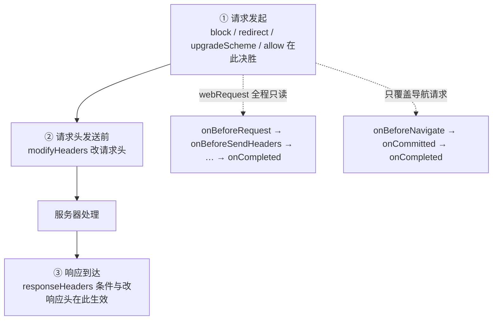
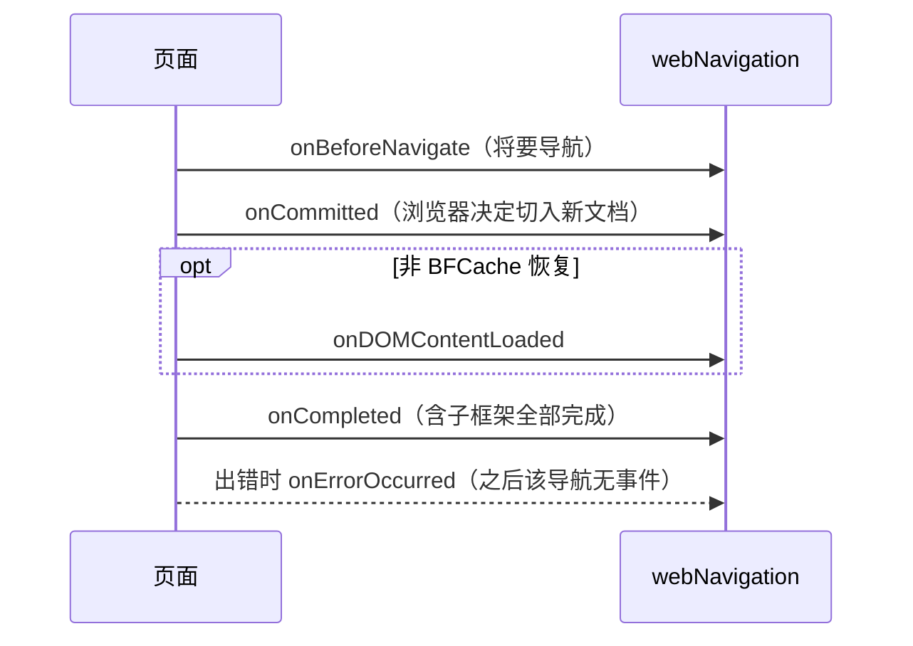

import { Canvas, Controls, Meta } from '@storybook/addon-docs/blocks';
import * as NetworkRequests from './network-requests.stories';

<Meta of={NetworkRequests} name="Docs" />

# 网络请求控制

扩展要管住浏览器发出的请求，MV3 的思路和 MV2 完全不同：不再在代码里拦下请求、判断、再决定放行，而是**提前声明规则——什么条件的请求做什么动作——由浏览器在网络栈里直接评估执行**。这就是 declarativeNetRequest。规则生效时 service worker 甚至不需要被唤醒，扩展进程也看不到请求内容，这是 MV3 用隐私和性能换来的形态。本课以它为主角，另外两类只读观察手段作补充：webRequest 在请求全程提供事件观察，webNavigation 单独描述页面导航的生命周期。



三个工具的分工是本课的回查表：

| 工具 | 能力 | MV3 可用性 | 能否看到请求内容 | 典型用途 |
| --- | --- | --- | --- | --- |
| declarativeNetRequest | 拦截、改写、放行请求，改请求/响应头 | 主力，权限加规则文件即生效 | 否 | 内容拦截、URL 改写、请求头处理 |
| webRequest | 观察请求事件 | 主体只读；blocking 仅限策略安装的扩展 | 是（有对应 host 权限时） | 请求统计、日志、排障 |
| webNavigation | 观察导航生命周期 | 完整可用 | 只看到事件里的字段 | 导航归属、帧与文档跟踪 |

## 快速上手

最小闭环是一条静态规则。manifest 声明规则文件与 declarativeNetRequest 权限，规则文件放一条 block 规则：

manifest.json：

```json
{
  "manifest_version": 3,
  "name": "Block example",
  "version": "1.0",
  "permissions": ["declarativeNetRequest"],
  "declarative_net_request": {
    "rule_resources": [
      { "id": "ruleset_1", "enabled": true, "path": "rules_1.json" }
    ]
  }
}
```

rules_1.json：

```json
[
  {
    "id": 1,
    "priority": 1,
    "action": { "type": "block" },
    "condition": {
      "urlFilter": "||example.com",
      "resourceTypes": ["main_frame"]
    }
  }
]
```

在 chrome://extensions 加载已解压的扩展程序，再访问 `https://example.com`：主文档请求被阻止，页面加载失败；DevTools 的 Network 面板里该请求标记为 blocked。行为不符预期时，先用 `testMatchOutcome` 核对规则匹配（见「规则的来源与更新」）。

注意 block 不要求 `host_permissions`——匹配范围完全由规则文件的 condition 决定；redirect 和 modifyHeaders 在 host 权限与请求头上有额外要求，本课后面分别说明。match pattern 与权限声明本身由[Manifest 与权限](?path=/docs/manifest-permissions--docs)一课承载，这里只用结论。

## declarativeNetRequest

declarativeNetRequest 的模型一句话：**规则 = 条件 + 动作**。扩展把规则交给浏览器，浏览器在请求生命周期的三个时机点评估它们，命中的规则直接改变请求走向。规则本身不分来源长得都一样，先看结构，再看动作，最后看匹配顺序。

### 规则结构

一条规则四个字段：

```json
{
  "id": 1,
  "priority": 1,
  "action": { "type": "block" },
  "condition": { "urlFilter": "ads", "resourceTypes": ["script"] }
}
```

| 字段 | 必填 | 默认值 | 作用 |
| --- | --- | --- | --- |
| `id` | 是 | — | 规则编号，从 1 开始，同一规则集内唯一 |
| `priority` | 否 | `1` | 优先级，显式指定时必须 ≥ 1；多条规则竞争时先比它 |
| `condition` | 否 | — | 匹配条件，省略时匹配全部请求 |
| `action` | 是 | — | 命中后执行的动作 |

condition 的常用字段：

| 字段 | 作用 |
| --- | --- |
| `urlFilter` | URL 子串匹配，支持 `*`、`|`、`||`、`^` 四个特殊写法；与 `regexFilter` 二选一 |
| `regexFilter` | RE2 正则，仅 ASCII，匹配 punycode / 百分号编码后的 URL；需自行用 `^`、`$` 锚定 |
| `resourceTypes` | 限定资源类型（`main_frame`、`script`、`xmlhttprequest`、`image` 等），列表不能为空 |
| `initiatorDomains` / `excludedInitiatorDomains` | 限定（排除）发起请求的文档所在域 |
| `requestDomains` / `excludedRequestDomains` | 限定（排除）请求目标 URL 的域 |
| `domainType` | `firstParty` / `thirdParty`，按首方 / 第三方限定 |
| `requestMethods` | 限定 HTTP 方法（Chrome 91+，列表不能为空） |
| `tabIds` | 限定标签页（Chrome 92+，仅会话规则支持；`-1` 匹配不隶属任何标签页的请求） |
| `responseHeaders` | 按响应头匹配（Chrome 128+，在响应到达后评估） |

`urlFilter` 与 `regexFilter` 的语义直接决定命中范围，值得单独记住：

- `urlFilter` 是**子串匹配**：`ads` 会命中 `https://cdn.example.com/ads/banner.js`，也会命中 `https://example.com/xadsx`。特殊写法：`|` 锚定 URL 开头或结尾，`||` 锚定域名开头，`^` 匹配分隔符（非字母、数字及 `_ - . %`，含 URL 结尾），`*` 匹配任意长度。
- `regexFilter` 用 RE2 语法，**不做整串锚定**——`^https:\/\/www\.google\.com\/` 这类显式锚定要自己写；编译后超过 2KB 的规则会被忽略并给出警告。正则规则总数受 `MAX_NUMBER_OF_REGEX_RULES` 限制。

### 动作类型

`action.type` 六种取值：

| `type` | 效果 |
| --- | --- |
| `block` | 阻止请求 |
| `redirect` | 改写请求目标 |
| `upgradeScheme` | 把 `http://` 或 `ftp://` 升级为 `https://` |
| `modifyHeaders` | 修改请求头或响应头 |
| `allow` | 放行请求；命中后本扩展不再干预该请求 |
| `allowAllRequests` | 放行整个帧层级内的全部请求；condition 必须指定 `resourceTypes` 且只能取 `main_frame` / `sub_frame` |

redirect 有三种形态，按需选择：

```json
{ "type": "redirect", "redirect": { "url": "https://example.com/blank.gif" } }
{ "type": "redirect", "redirect": { "extensionPath": "/blocked.png" } }
{ "type": "redirect", "redirect": { "transform": { "queryTransform": { "addOrReplaceParams": [{ "key": "src", "value": "blocked" }] } } } }
```

- `url`：改到任意 URL——需要扩展持有目标 URL 的 host 权限（见「规则的来源与更新」）。
- `extensionPath`：改到扩展内的资源，路径以 `/` 开头；目标资源必须登记在 `web_accessible_resources`。
- `transform`：保留原 URL 只改局部（`scheme`、`host`、`path`、`query`、`fragment` 及 `queryTransform`）；配 `regexFilter` 时可用 `regexSubstitution`，`\1`–`\9` 引用捕获组、`\0` 引用整个匹配。

modifyHeaders 用 `requestHeaders` / `responseHeaders` 两个数组逐个头描述，操作三选一：

| `operation` | 效果 |
| --- | --- |
| `append` | 追加一个同名头；请求头的 append 只支持固定白名单（见下） |
| `set` | 覆盖为新值，移除所有同名头 |
| `remove` | 移除该头的全部条目 |

append 的请求头白名单是大小写敏感的固定列表：`accept`、`accept-encoding`、`accept-language`、`access-control-request-headers`、`cache-control`、`connection`、`content-language`、`cookie`、`forwarded`、`if-match`、`if-none-match`、`keep-alive`、`range`、`te`、`trailer`、`transfer-encoding`、`upgrade`、`user-agent`、`via`、`want-digest`、`x-forwarded-for`。不在表里的请求头（如自定义头）不能 append，只能 set 或 remove。

同扩展的多条 modifyHeaders 规则按优先级先后应用，后者能做什么取决于前者做了什么：append 之后低优先级规则只能 append；set 之后只有同扩展的低优先级规则可以 append；remove 之后低优先级规则不能再改动该头。下面这个演算把两条规则（priority 2 与 1）施加到同一个请求头上：切换操作组合，看最终请求头和哪一步被拒绝。

<Canvas of={NetworkRequests.HeaderModify} />
<Controls of={NetworkRequests.HeaderModify} />

| 读者操作 | 可观察证据 |
| --- | --- |
| 规则 A 选 `append`、规则 B 选 `set` | B 被拒绝——append 之后低优先级规则只能 append |
| 规则 A 选 `remove`、规则 B 选 `append` | B 被拒绝——remove 之后低优先级规则不能再改动该头 |
| 请求头选 `x-custom-token`、规则 A 选 `append` | A 被拒绝——append 只支持固定请求头白名单 |
| 请求头选 `cookie`、规则 A 选 `set`、规则 B 选 `append` | 两条都生效，最终值为 `session=xyz; uid=42` |
| 打开 Show code | 看到该 Canvas 实际执行的 `header-modify.ts` |

### 规则匹配与优先级

规则的评估不是「全量扫一遍」，而是分三个时机点：

1. **请求发起前**：`block` / `redirect` / `upgradeScheme` / `allow` / `allowAllRequests` 在此决胜；带 `responseHeaders` 条件的规则不参与。
2. **请求头发送前**：`modifyHeaders` 的请求头改动在此生效；只有优先级高于任何命中 allow 规则的 modifyHeaders 规则才会被应用。
3. **响应到达后**：先评估带 `responseHeaders` 条件的 block / redirect（此时请求已发出，block 表现为页面收到 blocked 响应并提前终止，redirect 会向新 URL 再发一次请求），再应用响应头改动；此阶段对请求头的改动无效。

同一场竞争里规则怎么排：

- **只算一个扩展**：命中的非 modifyHeaders 规则先按 `priority` 降序排，同优先级按 `allow` > `block` > `upgradeScheme` > `redirect` 决胜；排在最前的就是唯一生效规则，其余连同 modifyHeaders 规则一起退场。
- **多个扩展竞争**：Chrome 按 `block` > `redirect` / `upgradeScheme` > `allow` / `allowAllRequests` 跨扩展统一排序，同类型取**最近安装**的扩展——别的扩展的 block 会压过你的 allow。
- **同优先级同动作**：执行顺序没有标准。浏览器厂商明确不保证，可能随运行、浏览器版本、规则集类型变化；顺序重要时必须显式写 `priority`。

下面这个演算把四条规则交给浏览器评估：切换请求目标和场景预设（规则的启用与优先级组合），看命中、排序与最终结果。

<Canvas of={NetworkRequests.RuleMatch} />
<Controls of={NetworkRequests.RuleMatch} />

| 读者操作 | 可观察证据 |
| --- | --- |
| 请求选 `https://cdn.example.com/ads/banner.js`，场景保持「block 优先（默认）」 | R1 `block`(10) 与 R3 `allow`(1) 都命中，R1 生效，请求被阻止 |
| 同一请求，场景切到「allow 更高优先级」 | R3 `allow`(10) 胜出，结论变为放行 |
| 同一请求，场景切到「同优先级 allow 对 block」 | 两者同为 5，allow 按同优先级次序胜出，仍放行 |
| 请求选 `https://analytics.other.net/collect`，场景保持「block 优先（默认）」 | 只有 R2 命中，请求被改写为 `https://example.com/blank.gif` |
| 请求选 `http://blog.example.com/post/1` | R4 `upgradeScheme` 命中，http 升级为 https |
| 打开 Show code | 看到该 Canvas 实际执行的 `rule-match.ts` |

## 规则的来源与更新

规则按来源分三种，差别在**持久性与更新方式**：

| 来源 | 声明方式 | 持久性 | 更新方法 |
| --- | --- | --- | --- |
| 静态规则 | manifest 的 `declarative_net_request.rule_resources` 指向 JSON 文件 | 随扩展安装 / 升级 | 改规则文件以后随新版本发布；单条启停用 `updateStaticRules`，整集开关用 `updateEnabledRulesets` |
| 动态规则 | 无文件，运行时唯一一套 | 跨浏览器会话与扩展升级保留 | `updateDynamicRules` / `getDynamicRules` |
| 会话规则 | 无文件，运行时唯一一套 | 浏览器关闭、扩展升级即清空 | `updateSessionRules` / `getSessionRules` |

静态规则的 manifest 条目形如 `{ "id": "ruleset_1", "enabled": true, "path": "rules_1.json" }`：最多声明 100 个规则文件、同时最多启用 50 个；已启用的规则集合计至少保证 30000 条，超出部分占用全局配额，运行时用 `getAvailableStaticRuleCount()` 查余量。两个容易忽略的点：静态规则文件的语法错误**只对解压加载的扩展报出**，打包后无效规则被静默忽略；用 `updateStaticRules` 停用的静态规则总数上限 5000 条。

动态与会话更新都是原子操作——要么全部生效，要么报错且不变：

```ts
const stale = await chrome.declarativeNetRequest.getDynamicRules();
await chrome.declarativeNetRequest.updateDynamicRules({
  removeRuleIds: stale.map((rule) => rule.id),
  addRules: [
    {
      id: 1,
      priority: 2,
      action: { type: 'block' },
      condition: { urlFilter: 'analytics', resourceTypes: ['xmlhttprequest'] },
    },
  ],
});
```

配额（开发时按最紧的算）：

| 配额 | 值 | 说明 |
| --- | --- | --- |
| `MAX_NUMBER_OF_STATIC_RULESETS` | 100 | manifest 可声明的规则文件数 |
| `MAX_NUMBER_OF_ENABLED_STATIC_RULESETS` | 50 | 同时启用的规则集上限 |
| `GUARANTEED_MINIMUM_STATIC_RULES` | 30000 | 静态规则保底条数，超出走全局配额 |
| `MAX_NUMBER_OF_SESSION_RULES` | 5000 | 会话规则上限 |
| `MAX_NUMBER_OF_UNSAFE_DYNAMIC_RULES` | 5000 | 动态规则下限；`redirect` / `modifyHeaders` 属 unsafe |
| `MAX_NUMBER_OF_DYNAMIC_RULES` | 30000 | `block` / `allow` / `allowAllRequests` / `upgradeScheme` 等 safe 规则的动态配额（Chrome 121+） |
| `MAX_NUMBER_OF_REGEX_RULES` | 1000 | 静态、动态、会话各自的正则规则上限 |

开发与排障有三个帮手：

- `testMatchOutcome(request)`（Chrome 103+，仅解压扩展可用）：拿构造的请求问「哪条规则会命中」，返回命中规则列表。
- `getMatchedRules()` 与 `onRuleMatchedDebug` 事件：看真实请求命中了哪些规则；需要 `declarativeNetRequestFeedback` 权限，且 `getMatchedRules` 每 10 分钟最多 20 次（与用户手势关联的调用不计入）。
- 规则文件语法错误：解压加载时在 chrome://extensions 的扩展详情页直接可见。

`host_permissions` 与匹配范围的关系，按权限和动作拆开记：

- `declarativeNetRequest` 与 `declarativeNetRequestWithHostAccess` 能力等价，差别在授权时机：前者安装即授、**有安装警告**；后者安装时无警告，但对某个站点执行任何规则动作前必须先持有该站点的 host 权限。已因其他功能持有 host 权限的扩展选后者，能少一次警告。
- `block` 不要求 host 权限——匹配范围完全由规则文件的 condition 决定。
- `redirect` 要求对**目标 URL** 持有 host 权限；官方迁移示例的完整组合是 `declarativeNetRequestWithHostAccess` + `host_permissions`。redirect 到扩展内资源时，目标资源还必须登记在 `web_accessible_resources`，否则报错。

## webRequest

webRequest 在 MV3 的定位是**观察**：事件照旧触发、details 照旧可读，但拦改这条路对普通扩展已经关闭——`webRequestBlocking` 权限「仅限通过策略安装的扩展」，其余扩展「webRequest API 本身不变，正常可用」。普通 MV3 扩展剩下的 blocking 口子是 `onAuthRequired` 配 `webRequestAuthProvider` 权限做 HTTP 身份验证。

事件与可读信息：

| 事件 | 时机 | 普通扩展可改？ |
| --- | --- | --- |
| `onBeforeRequest` | 请求发起前 | 只读 |
| `onBeforeSendHeaders` | 请求头发送前，`details.requestHeaders` 可读 | 只读 |
| `onSendHeaders` | 各扩展改完之后，呈现最终请求头 | 只读（信息性） |
| `onHeadersReceived` | 收到响应头，`details.responseHeaders` 可读 | 只读 |
| `onAuthRequired` | 请求需要身份验证 | 可凭 `webRequestAuthProvider` 提供凭据 |
| `onBeforeRedirect` / `onResponseStarted` | 重定向执行前 / 响应首个字节 | 只读（信息性） |
| `onCompleted` / `onErrorOccurred` | 终态通知 | 只读 |

三个常用细节：请求体要显式取——监听时把 `'requestBody'` 放进 extraInfoSpec，`details.requestBody` 才会带上 `formData`（表单类 POST）或 `raw`（其他方法的原始字节）；可见范围与 host 权限绑定，子资源请求还需要对**发起方**也有权限，只对目标 URL 有权限看不到；想让 Chrome 重新评估已注册的过滤器时调用 `handlerBehaviorChanged()`，它限流 20 次 / 10 分钟。

## webNavigation

webNavigation 独立于网络栈，只回答「导航进行到哪一步了」。一次成功导航的事件序列固定为 `onBeforeNavigate → onCommitted → [onDOMContentLoaded] → onCompleted`；中途出错则 `onErrorOccurred`，且该导航不再有后续事件。父框架的 `onCommitted` 先于所有子框架的 `onBeforeNavigate`，其 `onCompleted` 晚于所有子框架的 `onCompleted`。



事件 details 的常用字段：`tabId`、`frameId`（主帧恒为 0，子帧为正数）、`parentFrameId`（主帧为 -1）、`url`、`transitionType`、`transitionQualifiers`、`timeStamp`；Chrome 106+ 还有 `documentId`（每个文档唯一，跨导航会变）、`parentDocumentId`、`frameType`（`outermost_frame` / `fenced_frame` / `sub_frame`）与 `documentLifecycle`（`prerender` / `active` / `cached`）。

`transitionType` 描述导航怎么来的（`link`、`typed`、`auto_bookmark`、`form_submit`、`reload`、`keyword`、`keyword_generated` 等），`transitionQualifiers` 追加修饰：`client_redirect`（JS 或 meta refresh 造成）、`server_redirect`（服务端重定向）、`forward_back`（前进 / 后退）、`from_address_bar`（地址栏输入）。

概念算例——地址栏输入 `https://example.com`，页面里有一个 iframe，加载后执行一次 `history.pushState`：

1. `onBeforeNavigate`：`tabId` 为目标标签页，`frameId` 0，`transitionType` 为 `typed`，`transitionQualifiers` 含 `from_address_bar`。
2. `onCommitted`：同 `tabId`，`documentId` 变为新 UUID，`frameType` 为 `outermost_frame`——此时才真正「切入新文档」。
3. 子框架 `onBeforeNavigate`：`frameId` 为正数、`parentFrameId` 0；其 `onCommitted` 不晚于主帧的 `onDOMContentLoaded`。
4. 主帧 `onDOMContentLoaded` → 子框架 `onCompleted` → 主帧 `onCompleted`。
5. 之后的 `pushState` 触发 `onHistoryStateUpdated`；只改 fragment 触发 `onReferenceFragmentUpdated`。两者都可能晚于 `onCompleted`。

三个容易踩的点：`timeStamp` 只保证扩展进程内自洽，跨进程时钟偏差让它不能直接和 `Date.now()` 比较；webNavigation 与 webRequest 的事件之间**没有规定顺序**；预渲染等未切入的标签页，其 `tabId` 在 tabs API 里不可见，切入时才通过 `onTabReplaced` 可达。

## 最佳实践

- **常驻的拦截、改写规则放进静态规则文件**：随扩展发布，不依赖 service worker 启动，也不占动态配额；静态规则集变更还有机会走 expedited review。
- **用户可调的部分用动态规则**：设置项变化时整体替换（先 `get` 再按 id `remove` + `addRules`）；「本次浏览器运行有效」的临时开关（调试、一次性放行）用会话规则承载，浏览器重启即失效。
- **顺序重要就显式写 `priority`**：同优先级同动作的执行顺序没有标准保证，靠「恰好谁排前面」的规则在升级 Chrome 后可能行为变化。
- **已持有 host 权限的扩展选 `declarativeNetRequestWithHostAccess`**：能力等价、少一次安装警告；代价是规则对某个站点生效前必须先获得该站点的 host 权限，界面上要能看出这个前提。
- **开发期用 `testMatchOutcome` 验证匹配**，上线前移除 `declarativeNetRequestFeedback` 权限；`getMatchedRules` 有配额，不要拿它做运行时逻辑。
- **不要在 MV3 里指望 webRequest 拦截**：除非扩展由企业策略安装。普通扩展的请求改造全部走 declarativeNetRequest，webRequest 只用在统计、日志这类观察场景。
- **规则文件按用途拆多个规则集**：按功能分组（拦截、改写、企业策略）分别放 `rule_resources`，用 `updateEnabledRulesets` 整体开关，比单文件里堆规则更容易维护。

## 常见问题

- 规则完全没生效
  先看权限再匹配：只写了 `declarative_net_request` 规则文件、却没在 `permissions` 里声明 `declarativeNetRequest` 或 `declarativeNetRequestWithHostAccess`，规则不会执行。其次解压加载核对规则文件语法错误（打包后无效规则会被静默忽略），再用 `testMatchOutcome` 确认 condition 真的命中目标请求。会话规则还要确认浏览器没有重启、扩展没有升级。

- 明明写了 allow，请求还是被 block 了
  同优先级下 allow 胜过 block，但 block 的 `priority` 更高时 allow 无效；跨扩展竞争时 `block` > `allow`，别的扩展的 block 会压过你的 allow。把 allow 的 `priority` 提到最高，并确认没有其他扩展同时在拦。

- redirect 规则不生效
  redirect 对目标 URL 要求 host 权限，且权限要配 `declarativeNetRequestWithHostAccess`；redirect 到扩展内资源时，目标没有登记 `web_accessible_resources` 会直接报错。三样逐项核对。

- modifyHeaders 改了请求头但线上看不到
  三种常见原因：append 了不在白名单里的请求头；规则带 `responseHeaders` 条件时阶段错配——请求头改动只发生在发送前，响应到达后再改没有意义；同扩展另一条更高优先级的 `set` / `remove` 规则已经锁死该头，低优先级规则被拒绝。

- 动态规则加不了多少就报配额
  `redirect` 与 `modifyHeaders` 属 unsafe 动态规则，上限 5000；只有 `block` / `allow` / `allowAllRequests` / `upgradeScheme` 享受 30000 的 safe 配额。合并可以合并的规则，或把常驻规则迁到静态规则文件。

- webRequest 收不到某些请求
  webRequest 只暴露扩展凭 host 权限看得见的请求，子资源还需要对发起方有权限；被 declarativeNetRequest 拦掉的请求不会再到 webRequest。想看真实命中用 `declarativeNetRequestFeedback`，不要用 webRequest 反推。

## 总结回顾

摘要：

网络请求控制的主线是 declarativeNetRequest：规则写成条件加动作，由浏览器在请求发起前、请求头发送前、响应到达后三个时机点自动评估，扩展不介入也看不到内容。规则胜负规则是——单扩展内按 `priority` 降序、同优先级按 `allow` > `block` > `upgradeScheme` > `redirect`，跨扩展则 `block` 优先、同类型最近安装者胜出。规则分静态、动态、会话三种来源，各有持久性、更新方式与配额：`block` 不需要 host 权限，`redirect` 要求对目标 URL 持有 host 权限。webRequest 在 MV3 退为只读观察（blocking 只留给策略安装的扩展），webNavigation 提供 `onBeforeNavigate → onCommitted → onCompleted` 的导航事件序列，回答「导航进行到哪一步」而不是「请求长什么样」。

一句话：

> 在 MV3 里拦改请求靠声明规则而不是拦截代码——浏览器按规则直接执行，扩展要做的只是把条件、动作、优先级和配额写对。

知识要点：

- 一条规则由哪四个字段构成，`urlFilter` 和 `regexFilter` 分别怎么匹配？
- 六种动作类型各自的效果是什么，redirect 的三种形态怎么选？
- 一条请求被多条规则命中时，按什么顺序决胜，谁赢？
- 静态、动态、会话三种规则在持久性和更新方式上有什么区别，各自的配额是多少？
- `declarativeNetRequest` 与 `declarativeNetRequestWithHostAccess` 怎么选，`block` 与 `redirect` 对 host 权限分别有什么要求？
- MV3 里 webRequest 还能做什么、不能做什么？
- 一次完整导航按什么顺序触发哪些 webNavigation 事件？

## 参考资料

- [declarativeNetRequest API 参考](https://developer.chrome.com/docs/extensions/reference/api/declarativeNetRequest)
- [Replace blocking web request listeners（webRequest 到 declarativeNetRequest 迁移指南）](https://developer.chrome.com/docs/extensions/develop/migrate/blocking-web-requests)
- [webRequest API 参考](https://developer.chrome.com/docs/extensions/reference/api/webRequest)
- [webNavigation API 参考](https://developer.chrome.com/docs/extensions/reference/api/webNavigation)
