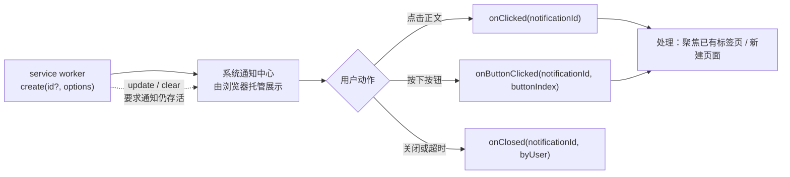

import { Canvas, Controls, Meta } from '@storybook/addon-docs/blocks';
import * as NotificationsStories from './notifications.stories';

<Meta of={NotificationsStories} name="Docs" />

# 通知

定时任务到点、同步完成、下载结束——这些发生在后台的事不该要求用户守在界面前，但也不能石沉大海。[chrome.notifications](https://developer.chrome.com/docs/extensions/reference/api/notifications) 就是扩展通往系统通知中心的通道：`create` 把一条模板化的通知交给浏览器托管，显示、停留、关闭都由系统负责，扩展代码只管三件事——发什么（`create` 的参数）、之后怎么改（`update` / `clear`）、用户点了之后做什么（三个 `on*` 事件）。它和 popup 的根本差别是生命周期：popup 是你的页面，通知是系统的界面。

因此用通知前先问一个问题：**这条通知以后还要不要被找到、被点中？** 要，就把 `notificationId` 当成唯一线索管好——service worker 随时会睡，内存里的引用留不住（规则见 [Service Worker](?path=/docs/service-worker--docs)）。「发出 → 用户动作 → 事件 → 处理」一条线概括了 `create` 之后的全部路径：



写代码前值得记住的默认值与边界：

| 事项 | 值 | 说明 |
| --- | --- | --- |
| 权限 | manifest `permissions` 声明 `"notifications"` | 缺了它 `chrome.notifications` 是 `undefined`，调用即 `TypeError`（见[Manifest 与权限](?path=/docs/manifest-permissions--docs)） |
| create 必填字段 | `type`、`iconUrl`、`title`、`message` | 四类模板共用；`imageUrl` / `items` / `progress` 按模板追加 |
| notificationId | 自己传字符串，或省略 | 省略或传空串时浏览器生成 id，由 `create()` 返回；同名 id 先清后建；上限 500 字符 |
| 按钮 | 最多 2 个 | `buttons: [{ title }]`；按下时 `onButtonClicked` 收到 `buttonIndex` |
| 列表条目 | `type: 'list'` 的 `items` | `NotificationItem` 的 `title` / `message`；macOS 只显示第一条 |
| 进度 | `type: 'progress'` 的 `progress` | 取值 0–100 |
| 优先级 | `priority`，-2 到 2，默认 0 | 没有通知中心的系统上，最低两档（-2/-1）直接报错 |
| 停留时间 | 默认展示数秒后自动关闭 | `requireInteraction: true`（Chrome 50+）才常驻到用户处理 |
| 返回 | Chrome 116+ 起是 Promise | 更早版本是回调风格 |
| 事件 | `onClicked`、`onButtonClicked`、`onClosed` | 都是 service worker 的唤醒源，监听器顶层注册 |

## 发出通知

先在 manifest 声明权限，调用本身很短：

```json
{
  "permissions": ["notifications"]
}
```

```js
// sw.js —— 例如在 chrome.alarms.onAlarm 的处理函数里
chrome.notifications.create('sync-done', {
  type: 'basic',
  iconUrl: 'icons/icon-32.png',
  title: '同步完成',
  message: '12 条记录已写入。',
});
```

三点值得先知道：

- `iconUrl` 是 URL 字符串：扩展内相对路径、`data:` URL、`blob:` URL 都可以；`title`、`message`、`type` 与它同为 `create` 的必填字段，缺一个都发不出来。
- 调用位置不限：service worker、popup 等任意扩展上下文都能调用。后台场景（[定时任务](?path=/docs/alarms--docs)到点、消息到达）是本课主线；`create` 作为扩展 API 调用会重置 SW 的空闲计时。
- 通知创建后由系统展示，SW 随后休眠不影响它继续显示；用户点击产生的 `onClicked` 等事件反过来会把 SW 唤醒再派发。

### notificationId 的规则

`create(notificationId?, options)` 的第一个参数可省略，三种情况决定通知的身份：

- **省略或传空串：** 浏览器生成一个 id，由 `create()` 的 Promise 返回——`const id = await chrome.notifications.create({ … })`。每次调用都是新通知，互不替换。
- **自己传 id：** 之后 `update` / `clear` 都用这个字符串找到它；上限 500 字符。
- **同名相撞：** 与已存在的 id 相同时，`create` 先清除旧通知再执行创建——不报错，静默替换。想让两条通知并存，就给不同的 id。

真实核对：在 SW 的 DevTools Console（入口见[调试扩展](?path=/docs/debugging--docs)）执行 `await chrome.notifications.create('demo', { type: 'basic', iconUrl: 'icon.png', title: 't', message: 'm' })`，连做两次并观察：第二次没有新增通知，系统里仍只有一条 `demo`；换成不带 id 的调用，`chrome.notifications.getAll()` 里的条目数每次加一。

### 模板与字段形状

`type` 决定卡片形状，四类模板对应不同的特有字段：

| type | 特有字段 | 卡片内容 |
| --- | --- | --- |
| `'basic'` | — | icon、title、message，最多两个按钮 |
| `'image'` | `imageUrl` | 在 basic 之上附一张大图 |
| `'list'` | `items` | 条目列表，每项含 `title` / `message` |
| `'progress'` | `progress` | 进度条，取值 0–100 |

下面的模拟把同一份参数交给四种模板和两种平台，卡片即系统通知中心里的样子：

<Canvas of={NotificationsStories.Template} />
<Controls of={NotificationsStories.Template} />

| 读者操作 | 可观察证据 |
| --- | --- |
| 把「type」切到 `list` | 卡片出现 `items` 列表，读数「模板特有字段」变为「2 条 items」 |
| 切到 `image` 后再把「平台」切到 macOS | 大图位置换成提示行「macOS 不显示 image」，读数平台变为 macOS |
| 关掉「buttons」 | 按钮区整行消失，读数「按钮」为「无」 |
| 打开「requireInteraction」 | 卡片底部标注变为「常驻到用户处理或关闭」 |
| 打开 Show code | 看到该 Canvas 实际执行的 `notification-template.ts` |

平台差异是文档明确的行为，不是 bug：`imageUrl` 与 `NotificationButton.iconUrl` 自 Chrome 59 起弃用且 macOS 不显示；`type: 'list'` 的 `items` 在 macOS 只显示第一条。为 macOS 用户设计时，别把关键信息只放在图片或第二条以后的条目里。

### 外观与行为参数

除模板字段外，`NotificationOptions` 里还有一批公共字段：

| 字段 | 含义 | 默认 / 范围 |
| --- | --- | --- |
| `buttons` | `NotificationButton[]`，只含 `title`（`iconUrl` 已弃用） | 最多 2 个 |
| `contextMessage` | 低权重的次要内容，灰色小字 | 可选 |
| `eventTime` | 通知上展示的时刻，epoch 毫秒 | 可选 |
| `priority` | 优先级，-2 最低、2 最高 | 默认 0；无通知中心的系统上 -2/-1 直接报错 |
| `requireInteraction` | 常驻到用户激活或关闭，不自动消失 | 默认 `false`（Chrome 50+） |
| `silent` | 显示时不发声、不振动 | 默认 `false`（Chrome 70+） |

另有三个字段已弃用、只会在老代码里遇到：`imageUrl` 与 `appIconMaskUrl`（Chrome 59 起弃用，macOS 不显示）、`isClickable`（Chrome 67 起弃用——现在的通知默认可点，不需要显式声明）。

## 更新与清除

通知发出后仍可修改，前提是它还存在：

| 方法 | 返回 | 行为 |
| --- | --- | --- |
| `update(id, options)` | `Promise<boolean>` | 更新一条现存通知；`options` 与 `create` 同型，只写要改的字段，其余保持原值；`true` 表示命中 |
| `clear(id)` | `Promise<boolean>` | 清除一条；`true` 表示确有通知被清除，同时派发 `onClosed`（系统关闭） |
| `getAll()` | `Promise<object>` | 当前存活通知 id 的集合 |
| `getPermissionLevel()` | `Promise<PermissionLevel>` | `"granted"`（安装时默认）或 `"denied"`（用户选择不看） |

经典用法是进度类通知：创建时 `type: 'progress'`，之后反复 `update(id, { progress: n })` 只推进度，不重传标题消息；完成时 `clear` 后换一条 basic 完成态。

注意生命周期：SW 终止不会清掉已展示的通知，但你内存里的 id 会跟着全局变量一起丢。两种管法——固定 id 且可反查（见「最佳实践」），或者把自动生成的 id 连同关联数据写进 `chrome.storage`（用法见[存储](?path=/docs/storage--docs)），唤醒后读出来再 `update`。

下面的模拟把调用与事件放在同一条时间线上，update 的命中与落空都能直接看到：

<Canvas of={NotificationsStories.Lifecycle} />
<Controls of={NotificationsStories.Lifecycle} />

| 读者操作 | 可观察证据 |
| --- | --- |
| 在「自动生成」模式连点两次「发送通知」 | 存活区出现 `generated-1`、`generated-2` 两张卡片，日志两次 `create()` 各返回一个 id——自动 id 每次都是新通知 |
| 切到「指定 "sync"」再发送 | 返回固定 id `"sync"`；再点「用新文案再发一次」时旧通知先被清除再创建，存活区只剩一张新卡片 |
| 点「更新通知」 | 按「更新字段」只改消息或只改进度；日志 `update("sync", { … }) → true` |
| 先点「清除通知」再点「更新通知」 | 存活区清空，随后 `update → false`——目标不存在就是落空 |
| 点卡片正文 / 按钮 / × | 日志依次出现 `onClicked`、`onButtonClicked(…, buttonIndex)`、`onClosed(…, byUser=true)` |
| 打开 Show code | 看到该 Canvas 实际执行的 `notification-lifecycle.ts` |

真实核对：在 SW DevTools Console 里 `const id = await chrome.notifications.create('demo', { type: 'progress', iconUrl: 'icon.png', title: '导出', message: '0%', progress: 0 })`，然后 `chrome.notifications.update(id, { progress: 60 })` 看进度条前进、`chrome.notifications.clear(id)` 看通知消失，`chrome.notifications.getAll()` 随时都能核对名单。

## 处理点击

三个事件覆盖全部交互，签名与参数顺序按当前文档：

| 事件 | 回调参数 | 触发时机 |
| --- | --- | --- |
| `onClicked` | `(notificationId)` | 点击正文的非按钮区域 |
| `onButtonClicked` | `(notificationId, buttonIndex)` | 按下按钮；索引从 0 开始 |
| `onClosed` | `(notificationId, byUser)` | 通知关闭；`byUser` 区分用户关闭与系统关闭（超时、`clear`、被同名 `create` 替换） |

事件清单里还有两个常规开发用不到的成员：`onPermissionLevelChanged`（Chrome 47 起只有 ChromeOS 的界面会派发）与 `onShowSettings`（Chrome 65 起弃用）。

它们和 `alarms.onAlarm` 一样是 service worker 的唤醒源：SW 休眠时点击通知，先唤醒、再派发。所以监听器必须写在 SW 顶层（同步注册），规则与依据见 [Service Worker](?path=/docs/service-worker--docs)。

点击后的常见响应是「把用户带回相关内容」——优先聚焦已经打开的标签页，不在就新建：

```js
// sw.js —— 顶层注册；id → 意图的映射示例（这里从 storage 反查）
chrome.notifications.onClicked.addListener(async (notificationId) => {
  const target = await lookupTarget(notificationId); // 如 { url }
  if (!target) return;
  const [tab] = await chrome.tabs.query({ url: target.url, currentWindow: true });
  if (tab) {
    await chrome.tabs.update(tab.id, { active: true });
    await chrome.windows.update(tab.windowId, { focused: true });
  } else {
    await chrome.tabs.create({ url: target.url });
  }
});

chrome.notifications.onButtonClicked.addListener((notificationId, buttonIndex) => {
  if (buttonIndex === 0) snooze(notificationId);   // 「稍后处理」
  else reopen(notificationId);                     // 「立即查看」
});
```

`byUser` 把「用户亲手关掉」和「系统关掉」区分开：用户主动关掉的提醒通常不该再重发，被动关掉的可以补一次。三个事件都只带 `notificationId`（`onButtonClicked` 再加 `buttonIndex`）——这就是为什么 id 要能反查，否则回调里拿不到要点什么的信息。

下面的模拟覆盖派发与两种响应策略，切参数再点通知即可对比：

<Canvas of={NotificationsStories.Click} />
<Controls of={NotificationsStories.Click} />

| 读者操作 | 可观察证据 |
| --- | --- |
| 点通知正文 | 日志 `onClicked(notificationId="docs-backlog")`；「扩展开发文档」标签页变为激活，随后追加 `tabs.update(7, { active: true })` 与 `windows.update(1, { focused: true })` 两条调用 |
| 点「立即查看」 | 先派发 `onButtonClicked(…, buttonIndex=1)`，再执行与点击正文相同的响应 |
| 点「稍后处理」 | 只派发 `onButtonClicked(…, buttonIndex=0)`，不做任何标签页或窗口操作 |
| 把「目标标签页已打开」关掉再点正文 | 标签页条中文档页消失；聚焦策略退回 `tabs.create`，新建的标签页成为激活页 |
| 切换「响应方式」为新建 | 即使目标已打开也走 `tabs.create` 路径 |
| 打开 Show code | 看到该 Canvas 实际执行的 `notification-click.ts` |

## 通知与网页通知的边界

扩展页面里还能用 Web 平台的 `Notification` 构造函数，两者不是一回事：

| 维度 | `chrome.notifications` | Web `Notification` |
| --- | --- | --- |
| 归属 | 扩展 API | 网页标准 API |
| 权限 | manifest 声明 `"notifications"` | 网页级授权（`Notification.requestPermission()`） |
| 可用上下文 | 任意扩展上下文，包括 service worker | 需要有 DOM 的页面 |
| 能力 | 模板、按钮、列表、进度、优先级 | 标题、正文、图标 |

判断很直接：后台与事件驱动的提醒一律 `chrome.notifications`；在扩展页面里偶尔弹一条同款提示可以用 `Notification`，但两套机制并存时别互相等对方的事件。

## 最佳实践

- **id 自己指定、可解析。** 把意图编进 id（如 `'sync-done-2026-10-04'`、`'comment-842'`），点击回调里就能反查要点什么；只拿自动生成的 id 时，回调中无处可查，只能再存一份映射到 storage。
- **常驻只留给需要处理的。** 待确认、进行中的通知用 `requireInteraction`；普通提醒用默认的自动关闭，常驻泛滥只会被用户整体关掉通知权限。
- **按钮只放真实动作，最多两个。** 更多操作交给 popup 或[侧边栏](?path=/docs/side-panel--docs)，点击通知把用户带到界面里再操作。
- **静音与降噪。** 批量低价值通知配 `silent`；确实要抢眼才抬 `priority`，并记住没有通知中心的系统上 -2/-1 会直接报错。
- **进度通知节流更新。** 按百分比或固定间隔 `update({ progress })`，别每个字节都调；完成时 `clear` 旧通知，换一条 basic 完成态。
- **按冷启动写处理函数。** 三个事件的监听器顶层注册；处理里需要上下文就从 `chrome.storage` 读，不要把状态押在 SW 内存里（见[存储](?path=/docs/storage--docs)与 [Service Worker](?path=/docs/service-worker--docs)）。

## 常见问题

- `chrome.notifications` 是 `undefined`，一调用就 `TypeError`
  manifest 的 `permissions` 里缺 `"notifications"`。补上后到 `chrome://extensions` 点重新加载（调试入口见[调试扩展](?path=/docs/debugging--docs)）；在 SW Console 里确认 `typeof chrome.notifications` 为 `'object'` 再继续。

- `update` / `clear` 一直返回 `false`，通知「改不掉也删不掉」
  返回 `false` 表示目标通知已经不在：被用户关闭、超时自动关闭、被同名 `create` 替换、或之前已被 `clear`。`update` 的前提是通知仍存活。另外别把 id 只存在 SW 内存里——终止后引用丢了，唤醒时先 `getAll()` 核对名单，再决定重建还是重发。

- 点了通知，`sw.js` 里的回调没有执行
  先看监听器是不是写在 service worker 顶层：异步注册（比如回调里再注册）的监听器接不住唤醒事件，休眠后只有顶层注册的能派发。再打开 SW 的 DevTools Console 看处理函数是否抛错。若 macOS 上系统通知本身被用户在系统设置里关闭，同样看不到通知，先用 `getPermissionLevel()` 核对扩展侧的授权状态。

- macOS 上看不到大图、列表通知只有第一条、按钮图标也不见
  都是文档明确的平台行为：`imageUrl` 与 `NotificationButton.iconUrl` 自 Chrome 59 起弃用且 macOS 不显示，`items` 在 macOS 只显示第一条。关键信息别只放在这些位置。

- `onClicked` 里 `chrome.tabs.query({ url })` 匹配不到目标标签页
  按 URL 匹配需要 `"tabs"` 权限或对应站点的 host 权限（见[Manifest 与权限](?path=/docs/manifest-permissions--docs)）。更稳的做法是发送通知时把 `tabId` 连通知内容一起存进 storage，点击后直接用 `chrome.tabs.update(tabId, { active: true })`，查询与匹配的细节见[标签页与窗口](?path=/docs/tabs-windows--docs)。

## 总结回顾

摘要：

`chrome.notifications` 负责把模板化的通知交给系统展示：`create` 的必填字段是 `type`、`iconUrl`、`title`、`message`，`type` 决定 basic / image / list / progress 四种形状，`buttons` 最多两个，macOS 上图片、按钮图标与第二条以后的列表项都不显示。通知创建后扩展不再持有它，唯一线索是 `notificationId`——省略时由 `create()` 生成并返回，自己指定则可反查，同名相撞是先清后建。`update` 只改 options 中给出的字段、返回是否命中，`clear` 返回是否确有清除，`getAll` / `getPermissionLevel` 负责核对名单与授权；它们都要求通知仍存活，而 SW 随时会终止，所以 id 要么固定可解析、要么随关联数据存进 storage。用户交互走 `onClicked` / `onButtonClicked` / `onClosed` 三个事件，与 `alarms.onAlarm` 一样能唤醒 SW，监听器必须顶层注册，典型处理是聚焦已有标签页、不在则新建。

一句话：

> 通知是浏览器托管、事件驱动的系统界面：扩展发出后唯一持有的线索是 notificationId，Update、清除与点击响应全部围绕它展开，且都要按 service worker 随时终止的模型来写。

知识要点：

- 用 `chrome.notifications` 前要在 manifest 里声明什么？缺了会发生什么？
- `create` 的必填字段是哪四个？四种 `type` 各自追加什么字段、受哪些平台差异影响？
- notificationId 省略、自己指定、同名相撞分别会发生什么？上限是多少？
- `update` 与 `clear` 的返回值和前提条件是什么？`getAll` 与 `getPermissionLevel` 各回答什么问题？
- `onClicked`、`onButtonClicked`、`onClosed` 的参数分别是什么？`byUser` 怎么用？
- 为什么三个事件的监听器必须写在 service worker 顶层？点击处理的典型代码路径是什么？
- `chrome.notifications` 与 Web `Notification` 在权限、上下文和能力上的边界是什么？

## 参考资料

- [chrome.notifications API 参考](https://developer.chrome.com/docs/extensions/reference/api/notifications)：方法与返回值、NotificationOptions 全部字段与默认值、模板与平台差异、事件参数、Chrome 版本标记。
- [Events in service workers](https://developer.chrome.com/docs/extensions/develop/concepts/service-workers/events)：事件处理器须注册在全局作用域的规则，notifications 列为常见事件。
- [Extension service worker lifecycle](https://developer.chrome.com/docs/extensions/develop/concepts/service-workers/lifecycle)：空闲 30 秒终止、事件与 API 调用重置计时、事件唤醒已停止的 worker。
- [chrome.tabs API 参考](https://developer.chrome.com/docs/extensions/reference/api/tabs)：`tabs.query` / `tabs.update` / `tabs.create` 签名与按 url 匹配的权限要求。
- [chrome.windows API 参考](https://developer.chrome.com/docs/extensions/reference/api/windows)：`windows.update` 的 `focused` 语义与 `WINDOW_ID_CURRENT`。
- [richNotification 官方示例](https://github.com/GoogleChrome/chrome-extensions-samples/tree/main/api-samples/richNotification)：四种模板可加载示例，`create(options)` 不带 id 的调用方式。
- [MDN — Web/API/Notification](https://developer.mozilla.org/en-US/docs/Web/API/Notification)：网页通知的权限模型，用于本课的边界对比。
