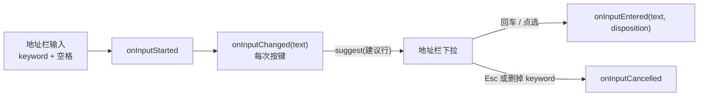
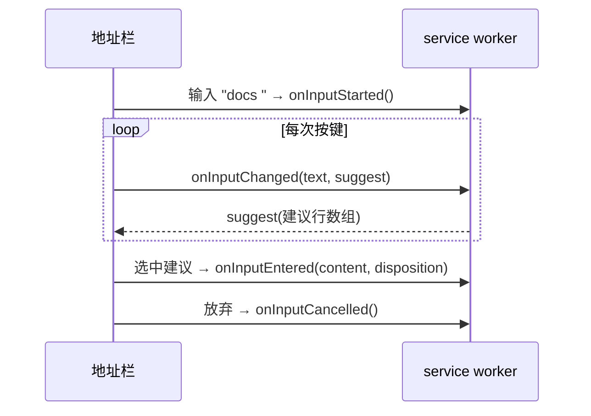

import { Canvas, Controls, Meta } from '@storybook/addon-docs/blocks';
import * as Omnibox from './omnibox.stories';

<Meta of={Omnibox} name="Docs" />

# 地址栏建议

扩展的能力入口不止工具栏图标与右键菜单。`chrome.omnibox` 把扩展挂到地址栏上：用户在地址栏输入扩展声明的 keyword 再加一个空格，地址栏就进入「关键词会话」，此后每一次按键都以事件形式送进扩展的 service worker；扩展用 `suggest` 回调回填下拉建议，用户选中或回车时再收到 `onInputEntered` 通知并跳转到目标。读完本课，你应当能预测第一个操作的结果：在地址栏输入 `docs` 加空格，地址栏下方立即出现默认建议行，地址栏左侧出现扩展图标的灰度版本；继续输入 `mess`，下拉按输入过滤，命中片段加粗显示。



omnibox 成员一览（Manifest V3 中全部事件都在 service worker 上下文执行）：

| 成员 | 作用 | 关键输入 / 参数 | 备注 |
| --- | --- | --- | --- |
| manifest `omnibox.keyword` | 声明触发关键词 | 非空字符串 | 16px 图标被 Chrome 灰度化后显示在地址栏 |
| `onInputStarted` | 关键词会话开始 | 无参数 | 每次会话恰好一次，先于任何 `onInputChanged` |
| `onInputChanged` | 查询文本变化 | `text`、`suggest` | `text` 不含 keyword；回调里同步调用 `suggest` 回填建议 |
| `onInputEntered` | 接受输入或选中建议 | `text`、`disposition` | `text` 为选中建议的 `content` 或原样输入 |
| `onInputCancelled` | 放弃会话 | 无参数 | 用户结束会话且没有接受输入 |
| `onDeleteSuggestion` | 删除可删除建议 | `text` | Chrome 63+；只对 `deletable: true` 的建议出现 × |
| `setDefaultSuggestion` | 设置默认建议行 | `{ description }` | Chrome 100+ 起返回 Promise |
| `SuggestResult` | 一条建议 | `content`、`description`、`deletable?` | `content` 不回显；`deletable` Chrome 63+ |
| `OnInputEnteredDisposition` | 打开方式 | `currentTab` / `newForegroundTab` / `newBackgroundTab` | Chrome 44+ |

Chrome 148 起也可用标准命名空间 `browser.omnibox`，成员与事件完全一致；本课示例沿用 `chrome.omnibox`。

## 快速上手

在[第一个扩展](?path=/docs/first-extension--docs)的目录上补三层声明，就能得到「地址栏检索文档」的最小闭环。本课目录下的 `extension/` 是这套文件的现成副本，可直接加载。

**第一步：manifest 声明 service worker、keyword 与 16px 图标。**

```json
{
  "manifest_version": 3,
  "name": "omnibox-demo",
  "version": "1.0",
  "omnibox": {
    "keyword": "docs"
  },
  "background": {
    "service_worker": "sw.js"
  },
  "icons": {
    "16": "icons/icon-16.png"
  }
}
```

**第二步：在 service worker 顶层注册监听器，过滤演示词典并回填建议。**

```js
// sw.js —— onInputChanged 的 text 是 keyword + 空格之后的输入，不含 keyword
const DOCS = [
  { content: 'messaging', title: '消息通信', url: 'https://developer.chrome.com/docs/extensions/develop/concepts/messaging' },
  { content: 'storage', title: '存储', url: 'https://developer.chrome.com/docs/extensions/reference/api/storage' },
];

function escapeXml(text) {
  return text.replace(/[&<>"']/g, (ch) => ({ '&': '&amp;', '<': '&lt;', '>': '&gt;', '"': '&quot;', "'": '&apos;' }[ch]));
}

chrome.omnibox.onInputStarted.addListener(() => {
  // 默认建议行只有 description，没有 content
  chrome.omnibox.setDefaultSuggestion({
    description: '<match>docs</match> 文档命令 <dim>回车发送原样输入</dim>',
  });
});

chrome.omnibox.onInputChanged.addListener((text, suggest) => {
  const results = DOCS.filter((entry) => entry.content.includes(text))
    .slice(0, 5)
    .map((entry) => {
      // 命中用户输入的片段包进 <match>，其余转义后按字面文本拼装
      const index = entry.content.indexOf(text);
      const head =
        index >= 0
          ? `${escapeXml(entry.content.slice(0, index))}<match>${escapeXml(text)}</match>${escapeXml(entry.content.slice(index + text.length))}`
          : escapeXml(entry.content);
      return {
        content: entry.content,
        description: `${head} ${escapeXml(entry.title)} <dim>文档</dim>`,
      };
    });
  suggest(results);
});
```

**第三步：选中建议时按 `disposition` 跳转。**

```js
chrome.omnibox.onInputEntered.addListener((text, disposition) => {
  const entry = DOCS.find((item) => item.content === text);
  if (!entry) {
    // 未选建议直接回车：text 是原样输入，本例只记录
    console.log(`原样输入：${text}`);
    return;
  }
  if (disposition === 'currentTab') {
    chrome.tabs.update({ url: entry.url }); // 不带 tabId 即当前标签页
  } else {
    chrome.tabs.create({ url: entry.url, active: disposition === 'newForegroundTab' });
  }
});
```

**加载与观察：** 到 `chrome://extensions` 点「加载已解压的扩展程序」选本课的 `extension/`，然后在地址栏操作（日志记录在 service worker 的 DevTools Console，入口见[调试扩展](?path=/docs/debugging--docs)）：

| 操作 | 可观察结果 |
| --- | --- |
| 输入 `docs` | 无反应：没有空格就没有进入关键词会话 |
| 继续输入空格 | 地址栏左侧出现灰度图标，下拉第一行出现默认建议 |
| 继续输入 `mess` | 每次按键触发 `onInputChanged`；下拉只剩 `messaging` 一条，`mess` 加粗 |
| 点选该条 | `onInputEntered` 收到 `text="messaging"`，当前标签页跳转到文档页 |
| 按 Esc 或退格删掉空格 | 下拉收起，`onInputCancelled` 触发 |

## 关键词会话

omnibox 的交互是一段有明确起点和终点的会话。地址栏里的输入被切成两段：keyword 本身，以及 keyword 加空格之后的查询文本。会话内 Chrome 只把查询文本送给扩展；会话外扩展收不到任何事件。会话的起点是 `onInputStarted`（保证恰好触发一次），终点是 `onInputEntered`（接受）或 `onInputCancelled`（放弃）。「keyword + 空格」是进入会话的唯一开关，这就是快速上手里输入 `docs` 无反应、补上空格才出现建议的原因。

### keyword 与 manifest 声明

按[当前 API 参考](https://developer.chrome.com/docs/extensions/reference/api/omnibox)与官方示例，所需声明只有 manifest 的 `omnibox` 键，不需要在 `permissions` 里额外声明：

```json
"omnibox": { "keyword": "docs" }
```

- `keyword` 是非空字符串，触发方式是用户在地址栏原样输入它再打一个空格。keyword 里不要放空格——用户必须先打完整个 keyword，空格才代表「进入会话」。
- 一个扩展只能注册一个 keyword：该键的值是单个字符串。需要多个入口时权衡合并，或改用[右键菜单与快捷键](?path=/docs/context-menus-commands--docs)。
- 同时提供 16×16 图标（顶层 `icons` 的 `16` 项）：Chrome 会自动生成灰度版本，在会话期间显示在地址栏里，提示用户当前输入正被你的扩展接管。
- 这是 manifest 键而非权限，安装时没有额外警告；权限与警告的完整机制见[Manifest 与权限](?path=/docs/manifest-permissions--docs)。

### 事件序列

一次完整会话的事件顺序如下，全部由用户在地址栏的操作触发，代码侧全部是 service worker 顶层监听器：



- `onInputStarted`：会话开始，无参数。每个会话恰好一次，且早于该会话的任何 `onInputChanged`——在它里面调用 `setDefaultSuggestion` 是最常见的用法。
- `onInputChanged(text, suggest)`：查询文本每变一次就触发一次。`text` 只是 keyword 加空格之后的输入，不含 keyword 与那个空格；回调内同步调用 `suggest(results)` 把建议送回地址栏，传空数组表示没有建议。这是唯一能把建议显示出来的出口。
- `onInputEntered(text, disposition)`：用户回车或点选建议时触发，是本课「跳转」一节的入口。
- `onInputCancelled()`：用户结束会话且没有接受输入时触发，无参数。实践中按 Esc、把 keyword 连空格一起删掉都会走到这里。
- 建议行带 `deletable: true` 时，用户点行尾 × 会触发 `onDeleteSuggestion(text)`（Chrome 63+），`text` 是被删建议的 `content`。

下面的模拟地址栏按这套事件序列运行：真实输入、真实按键，下拉与右侧事件日志同时间线追加。

<Canvas of={Omnibox.InputSession} />
<Controls of={Omnibox.InputSession} />

| 读者操作 | 可观察证据 |
| --- | --- |
| 输入 `docs` | 没有任何事件：下拉不出现 |
| 接着按空格 | 日志出现 `onInputStarted()`；地址栏下方出现默认建议行 |
| 继续输入 `mess` | 日志逐字符追加 `onInputChanged(text="mess")`；下拉过滤到一条，`mess` 加粗 |
| 按 Esc | 日志出现 `onInputCancelled()`，下拉收起 |
| 点选下拉中的一行 | 日志出现 `onInputEntered(text="messaging", disposition=...)`，结果显示对应的 `tabs` 调用 |
| 点建议行尾的 × | 该行消失，日志出现 `onDeleteSuggestion(text="...")` |
| 切换「disposition」后点选建议 | 结果在 `tabs.update` 与 `tabs.create`（前台 / 后台）之间切换 |

边界：

- `onInputStarted` 的「恰好一次」以会话为单位：用户删掉 keyword 再从新输入，会开启新会话并再次触发。
- 模拟器里的 disposition 由选择器切换；真实 Chrome 里它由激活手势决定，扩展只需要按收到的值行动（见「选中与跳转」）。
- 真实地址栏下拉只渲染 `description`；本模拟器在下拉之外的事件日志里展示 `content`，是为了让「选中时回传什么」可观察。

## 建议内容

一条建议由两层组成：**description 决定下拉里显示什么，content 决定用户选中时扩展收到什么**。`content` 只被放进地址栏并回传给扩展，永远不出现在下拉里。下拉的第一行是默认建议（`setDefaultSuggestion` 设置的 `description`），其余行来自 `suggest` 数组，按数组顺序排列。

### SuggestResult 与 suggest 回调

```js
chrome.omnibox.onInputChanged.addListener((text, suggest) => {
  suggest([
    {
      content: 'messaging',                                   // 选中时回传扩展
      description: '<match>mess</match>aging · 消息通信',      // 只在这里显示
      deletable: true,                                         // Chrome 63+，行尾出现 ×
    },
  ]);
});
```

- `content` 是「被放进地址栏、用户选中时发送给扩展的文本」；让用户看清、看懂的信息放在 `description` 里。
- `suggest` 在每次 `onInputChanged` 里同步调用即可，Chrome 用它替换整份下拉；条数按匹配度取前几条，不必把全部结果都塞进地址栏。
- `onDeleteSuggestion` 拿到的是被删建议的 `content`；需要跨会话记住删除结果时，落 `chrome.storage`（见[存储](?path=/docs/storage--docs)）。

### 默认建议 setDefaultSuggestion

下拉第一行是默认建议——官方定义里它是「紧挨地址栏下方的第一条建议」。它的参数 `DefaultSuggestResult` 是没有 `content` 的半个 `SuggestResult`：默认行只承担展示，提示用户回车会发生什么，用户接受它时走的是原样输入路径：

```js
chrome.omnibox.onInputStarted.addListener(() => {
  chrome.omnibox.setDefaultSuggestion({
    description: '<match>docs</match> 文档命令 <dim>回车发送原样输入</dim>',
  });
});
```

- 每个会话调用一次即可，`onInputStarted` 是最自然的时机；Chrome 100 起该方法返回 Promise。
- 下拉里默认行与 `suggest` 行的位置关系，在下面的范例里与 `content`、`description` 的分工一并演示。

### description 的标记与转义

`description` 支持三种 XML 风格标记，可以嵌套：`<match>` 加粗与用户输入匹配的片段，`<url>` 标记字面 URL（下拉中以链接样式显示），`<dim>` 放不重要的辅助文字。拼装用户输入前必须先转义五个预定义实体（`&` `<` `>` `"` `'`），否则标记结构可能被输入内容破坏：

```js
// 转义后再拼装，用户输入永远只是字面文本
const ENTITIES = { '&': '&amp;', '<': '&lt;', '>': '&gt;', '"': '&quot;', "'": '&apos;' };
function escapeXml(text) {
  return text.replace(/[&<>"']/g, (ch) => ENTITIES[ch]);
}

description: `${escapeXml(title)} <dim>${escapeXml(dim)}</dim>`
```

下面的下拉并排放出默认建议行与一条示例建议，并给出进入 Chrome 前的原始字符串。切换「示例 description」，观察渲染结果与原始字符串如何对应。

<Canvas of={Omnibox.SuggestionMarkup} />
<Controls of={Omnibox.SuggestionMarkup} />

| 读者操作 | 可观察证据 |
| --- | --- |
| 切到「match 命中标记」 | 命中片段加粗；原始字符串里 `<match>` 的位置与加粗位置一致 |
| 切到「url 与 dim」 | URL 显示为链接色，辅助文字灰化 |
| 切到「标记嵌套」 | `<match>` 嵌在 `<dim>` 内，两层样式叠加 |
| 切到「未转义的用户输入」 | 用户输入里的 `</match>` 截断标记，下拉显示错乱，原文以红色警示 |
| 切到「转义后拼接」 | 同一段输入经 `escapeXml` 后按字面文本显示，标记结构完好 |

边界：

- 三个标记之外的标签一律按字面文本处理，不要指望用其他 XML 标签控制样式。
- 原始字符串框里的内容是 `suggest([...]) 实际传出的文本；渲染示意与 Chrome 真实样式略有差异，语义（加粗 / 链接色 / 灰化）一致。

## 选中与跳转

### disposition 与打开方式

用户接受输入时，`onInputEntered` 的 `disposition` 告诉扩展打开方式，这也是官方文档所讲的「推荐的展示上下文」：

| disposition | 语义 | 示例动作 |
| --- | --- | --- |
| `currentTab` | 当前标签页 | `chrome.tabs.update({ url })` 复用当前标签 |
| `newForegroundTab` | 新标签页并聚焦 | `chrome.tabs.create({ url, active: true })` |
| `newBackgroundTab` | 新标签页不聚焦 | `chrome.tabs.create({ url, active: false })` |

打开方式由用户的激活手势决定，扩展只按 `disposition` 承接：`currentTab` 就用 `tabs.update` 复用当前标签，不要另开新标签挤掉用户正在看的页面。查询串拼进 URL 前先 `encodeURIComponent(text)`——地址栏里常见的 `/ ? : @ & = + $ #` 都会改变 URL 语义（官方 how-to 示例同样如此处理搜索关键词）。`tabs.update` / `tabs.create` 的完整签名与标签页操作见[标签页与窗口](?path=/docs/tabs-windows--docs)。

### onInputEntered 的 text：content 还是原样输入

`text` 的含义取决于用户怎么结束会话：

- 选中某条建议：`text` 是该建议的 `content`，与 `description` 显示的文字没有任何绑定关系。
- 没有选建议直接回车：`text` 是用户的原样输入（同样不含 keyword）。

所以 `onInputEntered` 必须同时兜住两种情况，典型写法就是示例里的「字典里找不到 → 走兜底分支」。把 `content` 设计成可枚举的命令词（如 `messaging`、`storage`），再用一张表映射到动作，比让用户输入自由文本更好排查。

## 在 service worker 中运行

MV3 没有常驻后台页，omnibox 事件全部在 service worker 上下文执行，并有两条会直接改变「代码写对却没反应」的约束：

- **监听器必须注册在顶层。** 事件处理器要写在脚本全局作用域，不能包进函数或条件分支；休眠后只有顶层注册的监听器能随事件唤醒 worker，`onInputChanged` 才会被派发。
- **worker 可能已被终止。** 闲置约 30 秒 Chrome 会终止 service worker，收到扩展事件或调用扩展 API 会重置计时并唤醒休眠的 worker。会话状态不要存进模块级全局变量（worker 终止即丢失）；omnibox 会话天然无状态，跨会话要保留的数据写 `chrome.storage`。

由此还有一条实践含义：`onInputChanged` 里等远程接口再 `suggest` 的方案不可靠——等待期间 worker 可能被终止，建议永远送不到地址栏。需要远程索引时，在安装或定时任务里提前拉取并落进存储（`runtime.onInstalled`、[定时任务](?path=/docs/alarms--docs)），`onInputChanged` 里只做同步过滤。生命周期与唤醒的完整规则见 [Service Worker](?path=/docs/service-worker--docs)。

## 最佳实践

- **keyword 短且独特。** 用户要先打完整个 keyword 再打空格才进入会话，keyword 越长越劝退；同时避开常用词，减少误触发。一个扩展只能有一个 keyword，多入口需求先权衡合并。
- **description 一律转义后拼装。** 任何来自用户输入、远程数据、文件名的片段，先 `escapeXml` 再嵌进 `description`。
- **尊重 disposition。** `currentTab` 用 `tabs.update` 复用当前标签，`newBackgroundTab` 才 `active: false`；把打开方式的选择权留给用户的激活手势。
- **建议计算同步化。** 本地过滤即刻返回；远程数据提前缓存进 `chrome.storage`，别在 `onInputChanged` 里等网络。
- **建议行数克制。** 地址栏下拉高度有限，按匹配度取前几条；精确匹配不足时靠 `<dim>` 提示用户还能怎么输入。

## 常见问题

- 输入 keyword 加空格，地址栏毫无变化
  按顺序查三处：manifest 有没有 `"omnibox": { "keyword" }`；监听器是否注册在 service worker 顶层（包进函数或 `chrome.runtime.onInstalled` 回调里都不会生效）；输入的 keyword 是否与声明逐字一致。
  判断依据：keyword 是字面匹配，且会话只在「keyword + 空格」之后开启。
- `onInputChanged` 时好时坏，重启浏览器又好
  service worker 被 30 秒空闲规则终止，而监听器不在顶层、唤醒后没有重新注册。把监听器移到脚本顶层，重载扩展再试；调试时保持 service worker DevTools 打开会让 worker 保活，从而掩盖真实休眠行为（详见[调试扩展](?path=/docs/debugging--docs)）。
- `onInputEntered` 收到的 `text` 不是点选建议的 `content`
  用户没有选建议、直接回车结束会话，`text` 就是原样输入（不含 keyword）。在回调里对找不到映射的输入走兜底分支。
- `description` 里的 `<match>` 被当成纯文本，或用户一输入下拉就花
  拼装时没有转义五个预定义实体。对用户输入、远程数据一律先 `escapeXml` 再嵌入标记。
- 点建议行尾的 × 没有触发 `onDeleteSuggestion`
  只有 `deletable: true` 的建议才会显示 ×。给需要可删除的建议补上该字段，并按需把删除结果写进 `chrome.storage`。

## 总结回顾

摘要：

omnibox 把扩展能力挂到地址栏：manifest 的 `omnibox.keyword` 声明触发关键词，用户输入 keyword 加空格开启一次关键词会话，此后每次按键以 `onInputChanged(text, suggest)` 送进 service worker，`text` 不含 keyword；扩展同步调用 `suggest` 回填下拉，第一行默认建议由 `setDefaultSuggestion` 设置。一条建议分两层：`description` 负责展示（支持 `<match>`、`<url>`、`<dim>` 三种标记，拼装前必须转义五个预定义实体），`content` 只在选中时回传。会话以 `onInputEntered(text, disposition)` 接受、`onInputCancelled()` 放弃；`disposition` 三值分别对应 `tabs.update` 与 `tabs.create` 的前台 / 后台打开。MV3 下事件在 service worker 执行，监听器必须注册在顶层才能被唤醒，远程建议数据要提前落存储。

一句话：

> 关键词会话里扩展收到的每一个 `text` 都不含 keyword；建议只由同步调用的 `suggest` 回填，而 content 永远不进下拉——展示交给 description，回传交给 content。

知识要点：

- 进入关键词会话的开关是什么？`onInputChanged` 的 `text` 与地址栏里显示的内容差什么？
- 一次会话的事件序列是怎样的，起点与终点分别由什么决定？
- `SuggestResult` 的 `content`、`description`、`deletable` 各自控制什么？
- `description` 支持哪些标记？拼装用户输入前必须做什么？
- `onInputEntered` 的 `disposition` 三个值分别应该用什么打开方式承接？
- 为什么 omnibox 监听器必须注册在 service worker 顶层？等远程数据再建议有什么风险？

## 参考资料

- [chrome.omnibox API 参考](https://developer.chrome.com/docs/extensions/reference/api/omnibox)：manifest 要求、成员签名、事件定义与 SuggestResult / DefaultSuggestResult 字段语义。
- [Trigger actions from the omnibox（官方 how-to）](https://developer.chrome.com/docs/extensions/develop/ui/omnibox-triggers)：关键词会话的灰度图标示意、onInputEntered 打开新标签页的示例与 URL 编码处理。
- [Events in service workers](https://developer.chrome.com/docs/extensions/develop/concepts/service-workers/events)：事件处理器注册在全局作用域的规则。
- [Extension service worker lifecycle](https://developer.chrome.com/docs/extensions/develop/concepts/service-workers/lifecycle)：30 秒空闲终止、事件唤醒与全局变量丢失。
- [omnibox API 示例（chrome-extensions-samples）](https://github.com/GoogleChrome/chrome-extensions-samples/tree/main/api-samples/omnibox)：官方 simple-example 与 new-tab-search 的完整可加载示例。
- [chrome.tabs API 参考](https://developer.chrome.com/docs/extensions/reference/api/tabs)：`tabs.update` / `tabs.create` 签名与 tabId 可选语义。
