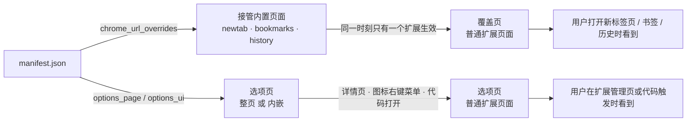

import { Canvas, Controls, Meta } from '@storybook/addon-docs/blocks';
import * as OverrideOptions from './override-options.stories';

<Meta of={OverrideOptions} name="Docs" />

# 替换页面与选项页

替换页面与选项页做的是同一件事：**manifest 声明「浏览器某个已有的界面换成我的 HTML 文件」，页面本身都是普通扩展页面**。两块的区别只在挂载点：`chrome_url_overrides` 接管 Chrome 的内置页面——新标签页（`chrome://newtab`）、书签管理器（`chrome://bookmarks`）、历史页（`chrome://history`）；选项页提供扩展自己的设置界面，可以整页打开，也可以内嵌在 `chrome://extensions` 的扩展详情页里。读完本课，你能回答六个问题：能覆盖哪些页面、一个扩展能覆盖几个、多个扩展抢同一页归谁、选项页怎么声明、在哪里打开、怎么用代码打开并和扩展其余部分通信。

两条主线共享同一套页面机制，落点与约束各不相同：



关键成员回查（默认值与约束的完整判断在对应小节）：

| 成员 | 作用 | 关键输入 | 默认值与备注 |
| --- | --- | --- | --- |
| manifest `chrome_url_overrides` | 接管 Chrome 内置页面 | `newtab` / `bookmarks` / `history`，各指向一个包内 HTML | 每个扩展只能覆盖一个页面；不需要任何权限 |
| manifest `options_page` | 整页选项页 | HTML 路径 | 总在新标签页整页打开 |
| manifest `options_ui.page` | 选项页页面 | HTML 路径（必填） | 相对扩展根目录 |
| manifest `options_ui.open_in_tab` | 内嵌还是整页 | 布尔 | 默认 `false`：内嵌于 `chrome://extensions` 详情页 |
| `chrome.runtime.openOptionsPage()` | 代码打开选项页 | 无参数 | MV3 返回 Promise（Chrome 99+）；打开位置由上面的声明决定 |

## 快速上手

用本课目录下的 `extension/` 走最小闭环（八个文件，可直接加载）：manifest 同时声明 newtab 覆盖与内嵌选项页，选项页把设置写进 `chrome.storage.sync`，覆盖页跟随同一份设置，popup 里的按钮用代码打开选项页。

**第一步：manifest.json 声明两个入口。**

```json
{
  "manifest_version": 3,
  "name": "override-options-demo",
  "version": "1.0",
  "action": {
    "default_title": "替换页面与选项页示例",
    "default_popup": "popup.html"
  },
  "chrome_url_overrides": {
    "newtab": "newtab.html"
  },
  "options_ui": {
    "page": "options.html",
    "open_in_tab": false
  },
  "permissions": ["storage"],
  "background": {
    "service_worker": "sw.js"
  }
}
```

`chrome_url_overrides` 一个键都不需要权限；`"storage"` 权限是给选项页和覆盖页共享设置用的（分区选择见[存储](?path=/docs/storage--docs)）。加载方式见[第一个扩展](?path=/docs/first-extension--docs)：到 `chrome://extensions` 点「加载已解压的扩展程序」选本课的 `extension/`。

**第二步：options.js 把设置写进 storage.sync，并发一条消息。**

```js
// 打开选项页时读回已保存的值，把表单初始化成当前设置
chrome.storage.sync.get(DEFAULT_SETTINGS).then((settings) => {
  titleInput.value = settings.title;
  themeSelect.value = settings.theme;
});

form.addEventListener('submit', async (event) => {
  event.preventDefault();
  const settings = { title: titleInput.value, theme: themeSelect.value };

  await chrome.storage.sync.set(settings);

  // 保存这类不需要响应的通知可以直接 sendMessage；
  // 内嵌选项页发送消息时 sender.tab 不会携带（内嵌代码不托管在标签页里）。
  const response = await chrome.runtime.sendMessage({
    type: 'options-saved',
    settings,
  });
  statusEl.textContent = response?.received ? '已保存，并已通知 service worker' : '已保存';
});
```

**第三步：newtab.js 读同一份设置并监听变更。**

```js
// 覆盖页是普通扩展页面：直接读写 chrome.storage.sync，和选项页共享设置
chrome.storage.sync.get(DEFAULT_SETTINGS).then(apply);

// 选项页保存后这里不需要刷新：onChanged 把变更广播到所有上下文
chrome.storage.onChanged.addListener((changes, areaName) => {
  if (areaName !== 'sync') return;
  if (!changes.title && !changes.theme) return;
  chrome.storage.sync.get(DEFAULT_SETTINGS).then(apply);
});
```

**第四步：popup.js 用代码打开选项页，sw.js 收下消息。**

```js
// popup.js —— openOptionsPage 从任意扩展上下文打开选项页；
// 到哪里由 manifest 声明决定；没声明选项页时 Promise 会 reject。
document.querySelector('#open-options').addEventListener('click', () => {
  chrome.runtime.openOptionsPage().catch((error) => {
    console.error('openOptionsPage 失败：manifest 未声明选项页？', error);
  });
});
```

```js
// sw.js —— 选项页与扩展其余部分的通信就是普通扩展消息
chrome.runtime.onMessage.addListener((message, sender, sendResponse) => {
  if (message?.type === 'options-saved') {
    console.log('选项页保存了设置：', message.settings);
    sendResponse({ received: true });
  }
});
```

**加载与观察：** 到 `chrome://extensions` 点「加载已解压的扩展程序」选本课的 `extension/`：

| 操作 | 可观察结果 |
| --- | --- |
| 按 Cmd/Ctrl + T 开新标签页 | 显示「我的新标签页」卡片，不是 Chrome 默认新标签页；标题栏显示 HTML 里写的 `<title>` |
| 点工具栏图标，再点弹窗里的「打开选项页」 | 定位到 `chrome://extensions` 详情页，选项页内嵌其中（`open_in_tab: false` 的效果） |
| 在选项页改标题并保存 | 新开一个标签页，标题立即变化；service worker 控制台（详情页的「检查视图」）输出保存日志，其中 `sender.tab` 为 `undefined`（观察入口见[调试扩展](?path=/docs/debugging--docs)） |
| 把 manifest 的 `open_in_tab` 改成 `true` 并重载 | 同样的两个入口都改为在新标签页整页打开 `options.html` |
| 右键工具栏图标，选「选项」 | 与「打开选项页」按钮去向相同——打开入口不改变去向 |

## 替换页面

`chrome_url_overrides` 接管的不是普通网页，而是 Chrome 的内置 URL。声明时不需要任何权限，覆盖页就是你包里的一个 HTML，和 popup、选项页同属扩展上下文——能调用 `chrome.*` API、能引用本地 CSS/JS，也受同一套 CSP 约束（见[扩展架构](?path=/docs/extension-architecture--docs)、[安全与隐私](?path=/docs/security-privacy--docs)）。

### newtab、bookmarks 与 history

`chrome_url_overrides` 是一个对象，支持三个键，值都是包内 HTML 的相对路径：

| 键 | 接管的页面 | 内置 URL |
| --- | --- | --- |
| `newtab` | 新标签页 | `chrome://newtab` |
| `bookmarks` | 书签管理器 | `chrome://bookmarks` |
| `history` | 历史记录页 | `chrome://history` |

```json
{
  "chrome_url_overrides": {
    "newtab": "newtab.html"
  }
}
```

- 官方文档写明：「扩展可以包含对上述任意页面的覆盖，但每个扩展只能覆盖一个页面」——三个键同时写不被允许，一个扩展只能接管一个内置页面。
- `bookmarks` 与 `history` 接管后，用户访问对应内置 URL 时看到的完全是你的页面：原生的书签管理、历史搜索由你的 HTML 提供，别接管一个自己并不打算完整替代的页面。
- 不需要权限；也不需要 background，manifest 有这一个键就生效。
- 覆盖页就是普通扩展页面：可以用 React 等框架写（框架只影响这个页面本身的写法，不影响覆盖机制），但脚本必须放在独立文件里，内联 `<script>` 不执行。

### 覆盖页归属：一个页面一个扩展

同一个内置页面，同一时刻只有一个扩展的覆盖真正生效。用户先装了覆盖 `newtab` 的扩展 A，又安装扩展 B 也要覆盖 `newtab` 时，Chrome 会弹出选择对话框，让用户决定保留哪个扩展的页面；没被选中的扩展虽然装着，它的覆盖不生效。安装顺序不自动决定归属——用户的选择才算数。

用户之后想改变归属，办法是停用或卸载其中一个扩展（`chrome://extensions` 里操作）。扩展自己无法查询某个内置页面的覆盖权归谁——没有公开 API 做这件事，别在代码里假设「我的覆盖一定生效」。

把下面这个演算调到不同输入，观察两个扩展竞争同一内置页面时的归属：

<Canvas of={OverrideOptions.OverrideOwnership} />
<Controls of={OverrideOptions.OverrideOwnership} />

| 读者操作 | 可观察证据 |
| --- | --- |
| 关闭「扩展 B 已安装」 | 安装选择对话框消失，新标签页显示扩展 A 的覆盖页，扩展 B 一栏显示「未安装」 |
| 两个扩展都开着，切换「安装 B 时用户的选择」 | 新标签页在 A 的覆盖页与 B 的覆盖页之间切换；另一个扩展的覆盖显示「未生效」 |
| 两个扩展都关闭 | 新标签页回到 Chrome 默认页 |
| 只开启「扩展 B 已安装」 | 没有对话框，新标签页直接显示 B 的覆盖页——只有一个扩展时无需选择 |

### 覆盖页是普通扩展页面

覆盖页与扩展其他页面共享同一套上下文能力，这些机制直接复用：

- 消息通信用 `runtime.sendMessage` / `connect`（用法见[消息通信](?path=/docs/messaging--docs)），设置读写走 `chrome.storage`（见[存储](?path=/docs/storage--docs)）——本课 `extension/` 的覆盖页就在读写 `storage.sync`。
- 扩展 CSP 同样适用：脚本放独立文件，禁止内联脚本与远程代码。
- 每个新标签页都会重新加载覆盖页，所以官方对新标签页覆盖页有一组明确要求，直接当成硬性清单执行：

| 要求 | 原因 |
| --- | --- |
| 页面要小、要快 | 用户预期内置浏览器页面瞬间打开 |
| 避免同步的数据库访问 | 会阻塞首屏，网络请求优先 `fetch()` 而不是 `XMLHttpRequest` |
| 写 `<title>` | 没有标题时标签页标题退化为 `chrome-extension://…` URL |
| 新标签页的键盘焦点先给地址栏 | 别把用户最可能先敲键盘的位置用页面元素抢走 |
| 别做成会被误认为 Chrome 默认新标签页的样子 | 官方明确提示避免用户混淆 |

## 选项页

选项页是扩展自己的设置界面，类型由声明方式决定：`options_page` 得到整页选项页，`options_ui` 得到可内嵌的选项页。用户有三个入口都能打开它：`chrome://extensions` 详情页的选项入口、右键工具栏图标菜单里的「选项」、以及扩展代码调用 `chrome.runtime.openOptionsPage()`。选项页本身也是普通扩展页面，写法上没有特殊性。

### options_page 与 options_ui：整页与内嵌

```json
{
  "options_page": "options.html"
}
```

```json
{
  "options_ui": {
    "page": "options.html",
    "open_in_tab": false
  }
}
```

两种声明对应官方文档中的两种类型，一份 manifest 只写其中一个键：

| 声明 | 打开位置 | 适合场景 |
| --- | --- | --- |
| `options_page` | 新标签页，整页 | 设置项多、需要完整宽度的界面 |
| `options_ui` + `open_in_tab: false`（默认） | `chrome://extensions` 扩展详情页内嵌 | 设置项少，希望用户不离开管理页 |
| `options_ui` + `open_in_tab: true` | 新标签页，整页 | 想要内嵌声明的形式，但给整页体验 |

- `options_page` 是较早的整页选项页声明；`options_ui` 用一个字段同时覆盖内嵌与整页两种形态。现行文档按「声明方式决定类型」描述这两个字段：写一个即可，别在同一份 manifest 里同时写两个键。
- `options_ui.page` 是必填的 HTML 路径，相对扩展根目录；`open_in_tab` 缺省即内嵌（`false`）。
- 无论整页还是内嵌，打开入口都不改变去向——三个入口通向同一份声明决定的位置。下面这个演算把「声明方式 × 打开入口」放在一起核对：

<Canvas of={OverrideOptions.OptionsMode} />
<Controls of={OverrideOptions.OptionsMode} />

| 读者操作 | 可观察证据 |
| --- | --- |
| 在三种「manifest 声明方式」间切换 | 中间示意的地址栏与页面在「`chrome-extension://…/options.html` 整页」与「`chrome://extensions` 内嵌」之间切换；右栏「chrome.tabs」「消息 sender.tab」随之变为可用 / 不可用、正常携带 / 不携带 |
| 切换三种「打开入口」 | 左栏触发代码与示意顶部的触发说明跟着变化，但打开位置与右栏判断不变——去向由声明决定，与入口无关 |
| 保持内嵌声明不动 | 右栏显示 `chrome.tabs` 不可用、`sender.tab` 不携带，对应「内嵌代码不托管在标签页」 |

### open_in_tab：内嵌模式的边界

内嵌选项页显示在 `chrome://extensions` 详情页的一个盒子里，与放在标签页里的整页选项页有几条行为差异，官方文档明确列出：

- **`chrome.tabs` 不可用。** 内嵌选项代码不托管在标签页里，Tabs API 无法使用；要操作标签页，用 `runtime.sendMessage()` 或 `runtime.connect()` 转交给其他上下文。
- **消息不带 `sender.tab`。** 内嵌选项页发送消息时，`sender.tab` 不会被设置，`sender.url` 是选项页地址；接收方（如 service worker）不要依赖 `sender.tab` 做判断。
- **尺寸按内容自适应，但会量不准。** 内嵌盒通常按内容确定自己的大小；随窗口尺寸改变形状的页面会让内嵌盒找不到合适大小，官方建议给选项页提供固定的最小宽高。
- **容器宽度由管理页布局决定。** 别把内嵌选项页按整页宽度设计，设置项多的界面更适合 `open_in_tab: true` 或 `options_page`。

### openOptionsPage：代码打开选项页

```js
// 任意扩展上下文（popup、选项页自身、service worker）都可以调用
chrome.runtime.openOptionsPage().catch((error) => {
  console.error('打开选项页失败', error);
});
```

- `chrome.runtime.openOptionsPage()` 无参数，MV3 下返回 `Promise<void>`（Promise 支持 Chrome 99+）。
- 打开到哪里由 manifest 声明决定：整页声明开新标签页，内嵌声明聚焦 `chrome://extensions` 详情页（选项页内嵌其中）；已打开的选项页会被聚焦而不是重开。
- 它不会导致调用它的页面重载（popup 里调用安全）。
- manifest 没有声明任何选项页、或 Chrome 无法创建选项页时，调用以错误结束：MV3 下 Promise reject，回调写法里 `runtime.lastError` 可读。

### 选项页的设置与通信

设置读写走 `chrome.storage`，这是选项页与扩展其余部分之间最常用的通道，官方选项页示例即如此：

```js
// 选项页保存：storage.sync 的写入由 Chrome 自动同步到用户各设备
await chrome.storage.sync.set({ title: '我的新标签页', theme: 'blue' });

// 覆盖页 / popup 跟随：一次写入通过 onChanged 通知所有上下文
chrome.storage.onChanged.addListener((changes, areaName) => {
  if (areaName !== 'sync') return;
  // 按需重读 storage.sync 并刷新界面
});
```

- 设置是跨上下文共享的状态，唯一事实来源应当是 `chrome.storage`，而不是选项页的 DOM 或内存——用户随时会关掉选项页，「页面还活着所以状态还在」不成立。
- 需要扩展其余部分知道「保存」这类动作时，用普通扩展消息 `runtime.sendMessage()` / `connect()`（用法见[消息通信](?path=/docs/messaging--docs)）；内嵌选项页发出的消息不带 `sender.tab`（见上一节）。
- `storage.sync` 自动跨设备同步有配额限制、也可能写失败，分区取舍与失败处理见[存储](?path=/docs/storage--docs)；只需要本机持久的设置用 `local` 即可，不必都挤进 `sync`。

## 最佳实践

- **覆盖页按「每次开新标签页都重新加载」来写。** 官方对新标签页覆盖页的要求（快、小、避免同步数据库、网络请求优先 `fetch()`）全部源于这一点；接管 `newtab` 前先问自己是否需要每次都出现的常驻界面，轻量需求用 sidePanel 或 popup 更稳妥（见[侧边栏](?path=/docs/side-panel--docs)、[Action 与弹窗](?path=/docs/action-popup--docs)）。
- **选项页设置写 `chrome.storage` 并让其他上下文监听 `onChanged`。** 别把设置只留在选项页里；「保存了但 popup 没变」几乎都是这个原因。
- **一个 `options_ui` 字段切换两种体验。** 先用 `open_in_tab: false` 起步，设置项变多再改 `true`；不必为「将来可能要整页」预先换成 `options_page`。
- **内嵌选项页给固定最小宽高，且不用 `chrome.tabs`。** 固定尺寸兜住自适应量不准的情况，标签页操作转交 service worker。
- **覆盖页一定写 `<title>`，且别模仿 Chrome 默认新标签页的外观。** 前者避免标题栏裸奔 URL，后者是官方点名的用户混淆来源。

## 常见问题

- 声明了 `chrome_url_overrides.newtab`，打开新标签页仍是 Chrome 默认页
  到 `chrome://extensions` 看看有没有另一个也覆盖新标签页的扩展，停用或卸载它再试。
  判断依据：同一个内置页面同一时刻只有一个扩展的覆盖生效，归属由用户在选择对话框里的决定说了算；安装第二个同类扩展时 Chrome 会弹出选择对话框，用户可能当时保留了另一个。
- 调用 `chrome.runtime.openOptionsPage()` 没反应，控制台报错没有选项页
  检查 manifest 里有没有 `options_page` 或 `options_ui.page`，路径是否指向存在的 HTML；补齐后重载扩展。
  判断依据：没有声明选项页（或路径写错）时该调用以错误结束，MV3 下表现为 Promise reject，回调写法里 `runtime.lastError` 有说明。
- 内嵌选项页在 `chrome://extensions` 里高度不对，内容被裁或大片空白
  给选项页设置固定的最小宽高（CSS `min-width` / `min-height`），并避免随窗口尺寸大幅改变形状的布局。
  判断依据：内嵌盒按内容自动确定大小，随窗口变形的页面会让它找不到合适大小，这是官方列出的已知差异。
- 内嵌选项页里 `chrome.tabs.*` 调用失败
  改用 `runtime.sendMessage()` 或 `runtime.connect()`，让 service worker 或其他上下文代做标签页操作。
  判断依据：内嵌选项代码不托管在标签页里，文档明示 Tabs API 不可用；同理，内嵌选项页发出的消息 `sender.tab` 不会被设置。
- 选项页保存了设置，popup 或新标签页却没跟着变
  确认设置写进了 `chrome.storage`，并在其他上下文监听了 `onChanged`；不要把设置只保存在选项页的 DOM 或内存里。
  判断依据：选项页不是常驻界面，用户关掉即销毁；只有 storage 里的写入会广播到所有上下文。
- 新标签页标题栏显示一长串 `chrome-extension://…` 地址
  在覆盖页 HTML 的 `<head>` 里补上 `<title>`。
  判断依据：官方说明没有标题时页面标题退化为页面 URL。

## 总结回顾

摘要：

`chrome_url_overrides` 与选项页共享同一模型：manifest 声明「浏览器已有的界面换成我的 HTML」，页面本身都是普通扩展页面。覆盖侧支持 `newtab`、`bookmarks`、`history` 三个键，一个扩展只能覆盖一个页面、不需要权限；同一内置页面同一时刻只有一个扩展的覆盖生效，竞争时由用户在安装选择对话框里决定归属，停用或卸载其一即可改变，扩展无法查询归属。覆盖页可按新标签页的体验要求来写：快、小、避免同步数据库、写 `<title>`。选项页由声明方式决定形态：`options_page` 与 `options_ui` + `open_in_tab: true` 开整页，`options_ui`（`open_in_tab` 默认 `false`）内嵌在 `chrome://extensions` 详情页；三个打开入口（详情页、图标右键菜单、`openOptionsPage()`）都不改变去向，只由声明决定。内嵌模式有明确边界：`chrome.tabs` 不可用、消息不携带 `sender.tab`、尺寸按内容自适应但会量不准。选项页的设置读写走 `chrome.storage`（`sync` 自动跨设备同步），与扩展其余部分用普通扩展消息通信。

一句话：

> 覆盖与选项都是「manifest 声明 + 普通扩展页面」：覆盖页一个扩展一页、归属由用户定；选项页的打开位置由 `options_page` / `options_ui.open_in_tab` 声明决定，设置与通信交给 `chrome.storage` 和普通消息。

知识要点：

- `chrome_url_overrides` 支持哪三个键？每个扩展能覆盖几个页面？
- 两个扩展都要覆盖新标签页时，页面归属由谁决定？用户之后怎么改变归属？
- 覆盖页是什么性质的页面？新标签页覆盖页的五条体验要求分别是什么？
- `options_page` 与 `options_ui` 分别在哪个位置打开选项页？`open_in_tab` 的默认值是什么？
- 三个打开入口会影响选项页的打开位置吗？由什么决定？
- 内嵌选项页相比整页有哪些边界：`chrome.tabs`、消息 `sender.tab`、尺寸各是什么行为？
- 选项页的设置为什么应该写进 `chrome.storage`，而不是留在页面里？

## 参考资料

- [Override Chrome pages（chrome_url_overrides 指南）](https://developer.chrome.com/docs/extensions/develop/ui/override-chrome-pages)
- [Options page（options_page 与 options_ui 指南）](https://developer.chrome.com/docs/extensions/develop/ui/options-page)
- [chrome.runtime API 参考（openOptionsPage）](https://developer.chrome.com/docs/extensions/reference/api/runtime)
- [manifest 字段参考](https://developer.chrome.com/docs/extensions/reference/manifest)
- [MDN manifest.json/options_ui（核对 open_in_tab 默认值）](https://developer.mozilla.org/en-US/docs/Mozilla/Add-ons/WebExtensions/manifest.json/options_ui)
