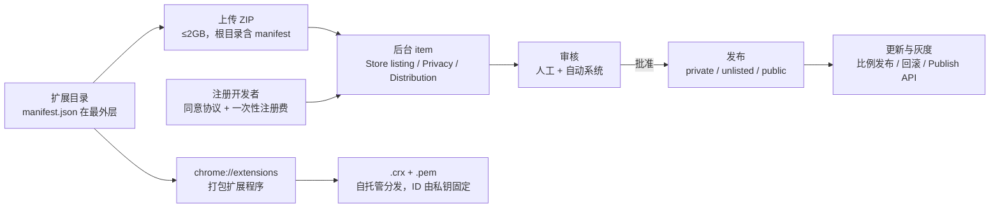

import { Canvas, Controls, Meta } from '@storybook/addon-docs/blocks';
import * as PublishingStories from './publishing.stories';

<Meta of={PublishingStories} name="Docs" />

# 打包与上架

扩展写完只是本地文件，商店链路把它变成别人能安装、能自动更新的 item。这条链路由四段接成：**打包**决定上传什么文件；**开发者后台**决定商店页怎么呈现、隐私怎么披露；**审核**决定它能不能上线；**发布与更新**决定它到达谁、出问题怎么退。四段各有一个容易想错的地方：上传用 ZIP 不是本地打包的 .crx，manifest 必须在 ZIP 根目录；版本号每次上传必须严格大于线上版本，比较是逐位从左往右、缺位当 0；审核会被宽泛权限和难审代码拖慢，被拒邮件会点名违反的政策；上线后可以只放给受信任测试人员，用户量过万后还能按比例灰度、必要时分钟级回滚。

本地调试与商店分发是两条不同的路：chrome://extensions 的「打包扩展程序」产出 .crx 加 .pem，服务自托管分发，扩展 ID 由私钥决定；商店上传 ZIP 后由商店签名托管，ID 随 item 固定。两条路互不通用。本课按「打包 → 后台与商店页 → 审核 → 发布与更新」的顺序走商店这条，顺带讲清自托管那条的边界。隐私字段、Limited Use、远程代码等政策条款在[安全与隐私](?path=/docs/security-privacy--docs)一课，本课只做链接、不重复；政策内容以官方当前表述为准，可能随时更新。



关键默认值与回查入口：

| 事项 | 值 / 规则 | 说明 |
| --- | --- | --- |
| 上传文件格式 | ZIP，manifest.json 在根目录 | 上传 .crx 直接失败；ZIP 里多套一层目录同样提交不了 |
| ZIP 大小上限 | 2GB | 超过即被拒 |
| 版本号格式 | 1-4 段点分整数，每段 0-65535 | 非零段不得有前导零，各段不得全为 0 |
| 版本比较 | 从左往右逐位比，缺位当 0 | 每次上传必须严格大于线上版本，相同会被拒 |
| 商店简介 | 132 字符以内，纯文本 | 出现在扩展管理界面与商店页；关键词堆砌会被拒 |
| 扩展图标 | 128x128 PNG，随 ZIP 提交 | 画面建议 96x96，每边留 16px 透明 |
| 截图 | 至少 1 张、最多 5 张 | 1280x800 或 640x400，直角满幅无内边距；可按 locale 分别上传 |
| 宣传图 | 小图 440x280（必需） | marquee 1400x560（可选），首页轮播推荐时才需要 |
| 审核时长 | 多数小于 24 小时，逾九成 3 天内 | 官方引用的 2021 年初数据；超过 3 周未完成联系开发者支持 |
| 延迟发布窗口 | 审核通过后 30 天内 | 逾期未发布，提交退回草稿 |
| 灰度门槛 | 7 日活跃用户超过 10,000 | Distribution 页才出现「按百分比发布」；调高比例不触发复审 |
| 新开发者 | 默认最多 2 个已发布扩展 | 可申请提高额度；主题不受限 |
| 回滚 | 只回到紧邻的上一个已发布版本 | 新版本号承载，约 1 分钟上线且跳过审核 |
| 取消审核 | 每个 publisher 每天最多 6 次 | 仅 Pending review 状态可见入口 |

## 快速上手

第一次上架的最短闭环：注册 → 打 ZIP → 新建 item → 填商店页 → 提交审核。全程只碰浏览器，构建工具不参与。开始前有一个前提：手上要有一个能通过「加载已解压的扩展程序」正常跑起来的扩展目录（怎么做到见[第一个扩展](?path=/docs/first-extension--docs)）。

**第一步：注册开发者账号。** 打开 Developer Dashboard，按注册页提示同意开发者协议与政策、支付一次性注册费（金额以付款页当前显示为准）。注册即创建一个 publisher，之后从同一账号进入后台即可，注册页不再出现。

**第二步：在扩展根目录打 ZIP。**

```bash
cd path/to/your-extension        # manifest.json 所在的那一层
zip -r ../course-cheatsheet-0.0.0.1.zip . -x '.git/*' '*.DS_Store'
```

**第三步：新建 item 并上传。** 后台点 Add new item、选择上一步的 ZIP。上传成功即生成一个草稿 item，出现 Package 版本号与 Store listing / Privacy / Distribution 三个页签。

**第四步：填商店页并提交。** 至少填 Store listing（名称、132 字符以内的简介、至少 1 张截图）；Privacy 页签五组字段的要求见[安全与隐私](?path=/docs/security-privacy--docs)。提交时取消勾选即时发布可延迟上线——审核通过后有 30 天时间手动发布，逾期提交退回草稿。

**可观察结果：**

| 操作 | 可观察证据 |
| --- | --- |
| `unzip -l` 列出刚打的包 | 顶层直接是 manifest.json 与各页面文件，没有嵌套目录 |
| Add new item 上传 ZIP | 生成草稿 item，Package 显示 ZIP 内的版本号 |
| 提交审核 | 状态变 Pending review，此时 ⋮ 菜单里才出现 Cancel review |
| 审核通过 | 状态变 Approved；未勾选自动发布时点 Publish，商店页随即对目标用户可见 |
| 提交后发现 manifest 有 typo | manifest 不可原地改：升版本号、重新打 ZIP、作为新版本上传 |

## 打包扩展

### 版本号规则

manifest 的 `version` 是「点分数字」，规则比「看着像」严格：**1 到 4 段，每段是 0-65535 的整数；非零段不能有前导零（`01.2` 非法）；各段不能全为 0**。商店侧比较是逐位从左往右、**缺位当 0**：第一个分出大小的位置定胜负，右边不再参与。由此有两条推论：段数多不等于更新——`1.1.9.9999` 比 `1.2.0` 旧，因为第 2 位 1 对 2 已分胜负；每次上传必须**严格大于**线上版本，相同会被拒——回滚也只能用新的更高版本号承载旧代码。官方建议首发版本起低，例如 `0.0.0.1`，给后续发布留足递增空间；展示用的 `version_name`（如 `"1.0 beta"`）不参与比较。

下面的实例把两串版本号交给校验与逐位比较，覆盖上传前要判断的全部情况：

<Canvas of={PublishingStories.VersionCheck} />
<Controls of={PublishingStories.VersionCheck} />

| 读者操作 | 可观察证据 |
| --- | --- |
| 默认组合：线上 `1.2.0`，候选 `1.1.9.9999` | 结论「可以提交」：第 2 位 2 对 1 分出胜负，候选右侧的 `9999` 不参与——段数多不等于更新 |
| 候选改为 `1.2` | 结论「会被拒绝」：逐位相等、缺位按 0，相同不是更新 |
| 候选改为 `1.1` | 结论「会被拒绝」：轨迹逐位标出候选更小 |
| 候选改为 `01.2.0` | 判「不合法」并指出第 1 段含前导零，不进入比较 |
| 候选改为 `1.2.65536` | 判「不合法」：超出每段 65535 的上限 |
| 候选改为 `1.0.0.0.1` | 判「不合法」：5 段，超出 1-4 段 |
| 候选改为 `0.0.0` | 判「不合法」：各段不能全为 0 |
| 打开 Show code | 看到该 Canvas 实际执行的 `version-check.ts` |

### 本地打包与扩展 ID

chrome://extensions 打开开发者模式后的「打包扩展程序」走的是自托管路：填扩展根目录与私钥文件两个字段，**私钥文件可留空——留空则首次打包生成一把新的，与 .crx 一起输出**。扩展 ID 由这把私钥派生：ID 是公钥的哈希，之后每次打包提供同一把 .pem 文件，生成的 .crx 才是同一个扩展。.pem 丢了，再打包就是一个新 ID；对自托管用户来说等于换了一个扩展，只能重新分发安装。

两个相关字段（字段总表见[Manifest 与权限](?path=/docs/manifest-permissions--docs)）：manifest 的 `key` 把公钥（去掉换行的一行字符串）写进 manifest，让「加载已解压的扩展程序」也固定 ID，开发期用途是让本地 ID 与后台 item 一致——服务端按扩展源限制请求、网页或其他扩展按 ID 找到你、站点访问 `web_accessible_resources`，都依赖 ID 稳定。manifest 的 `update_url` 只在商店之外分发时写：它指向自建的更新清单，清单给出新版本 .crx 的地址与版本号，Chrome 定期比对后下载、验签、安装——**更新用的 .crx 必须用同一把 .pem 签名**，这就是 .pem 必须长期保管的直接原因。

走商店分发时这两样都不需要：上传的 ZIP 由商店签名托管，item 的扩展 ID 在创建时确定，后续每个版本沿用同一 ID；本地 .crx/.pem 与商店 ID 互不相干，商店更新也不读 `update_url`。

### 上传用 ZIP 与源代码要求

商店只收 ZIP：**manifest.json 放在 ZIP 根目录**，不要多套一层目录；上限 2GB；直接上传 .crx 会提交失败。manifest 里不能留注释——JSON 之外的语法是「Cannot parse the manifest」最常见的原因。商店简介的 132 字符上限与素材规格见下一节。

代码可读性在打包环节就开始筛选：**混淆（obfuscation）被明令禁止**——不得把功能藏起来，对外部资源做 Base64 之类编码同样算违规；**压缩（minification）允许**（去空白、去换行、变量短名化），但会让审核更难、更慢。MV3 的基本要求是「提交的代码自包含」：逻辑必须能从安装包里读出来，外部资源不得承载逻辑。包很难审时，审核方会要求提交可读源码；构建产物与源码差异大的更要预留准备——历史上 FAQ 记录过行数超过 4,000 或使用 WXT、Plasmo 等框架构建的扩展会被要求附源码（FAQ 页面已并入文档站，具体阈值以当前官方要求为准）。上架前在**编译产物**里搜 `http://` 与 `https://` 查远程代码，是成本最低的一步；完整规则与远程代码违规的处理见[安全与隐私](?path=/docs/security-privacy--docs)。

## 开发者后台与商店页

### 注册与账号

注册 = 同意开发者协议与政策 + 一次性注册费（金额以付款页为准），在 Developer Dashboard 首次进入时完成。账号侧三个事实：

- 注册即创建一个 publisher；需要时可以再建一个，这是**一次性**额度，删除 publisher 不恢复；已删除开发者账号的注册邮箱不可复用。注册后到后台 Account 页补开发者资料、完成邮箱验证并确认 publisher 名称——它显示在每个扩展标题下，后续审核通知都发到开发者邮箱。
- 早年 individual / group publisher 的区分已取消：一个 publisher 下按角色邀请成员共建。四级角色由低到高：Viewer（看 item、分析与草稿）、Item Manager（创建 / 更新 item 与包、改可见性）、Editor（再含 publisher 设置与受信任测试人员管理）、Admin（成员角色、删除 publisher）。多人维护按最小权限授角色；账号本身的安全（两步验证等）见[安全与隐私](?path=/docs/security-privacy--docs)。
- **新开发者默认最多发布 2 个扩展**，超出需在后台申请；主题不受此限。

### 商店页素材

Store listing 页签的文字与图片有硬规格（细节以官方 image guidelines 为准）：

| 素材 | 规格 |
| --- | --- |
| 扩展图标 | 128x128 PNG，随 ZIP 一起提交；画面 96x96、每边 16px 透明，深浅背景都要清晰；无 alpha 时 Chrome 会加圆角框 |
| 截图 | 至少 1 张、最多 5 张；1280x800 或 640x400，直角、满幅、无内边距；当前统一缩到 640x400 展示，细节多用 640x400 直出 |
| 小宣传图 | 440x280，**必需**；缺了在商店里的展示位置明显变弱 |
| marquee 宣传图 | 1400x560，可选；进首页轮播推荐时才需要 |
| 名称 / 简介 | 名称准确反映核心功能；简介 132 字符以内纯文本，不堆关键词 |

两条本地化事实：截图可按语言分别上传，商店页文案（名称、详细说明）在后台按语言填写——它与扩展运行时的 `_locales` 是两套系统、互不派生，边界见[国际化](?path=/docs/i18n--docs)。**Privacy 页签不是可选项**：单一用途、权限清单与逐项理由、远程代码声明、数据收集类型与 Limited Use 确认、隐私政策 URL 五组内容的填写要求与政策红线见[安全与隐私](?path=/docs/security-privacy--docs)，本课只提示它属于提交前的必填项。

## 审核与发布

### 审核流程与时长

提交后进入审核。官方口径：多数审核在 24 小时内完成、逾九成 3 天内完成；超过 3 周仍 pending 就联系开发者支持。所有提交走同一套审核系统，与开发者资历、用户量无关；审核由人工与自动系统共同完成（后台出现的自动审核、合规标识属实现细节，社区里常以 Walter、SVE 等名称相称，读法以官方当前表述为准，本课不展开）。会被拖慢的情形：宽泛的 host 权限、敏感执行权限、体积大或难审的代码、新开发者账号、新扩展、大版本变更，以及曾被拒过的 item。

三种结果。**通过**——到了你手里，点 Publish，或勾选了自动发布时直接上线。**拒绝**——邮件点名违反的政策条款与申诉入口；已上线 item 的列表页、截图、隐私字段与线上版本不受影响，用户无感。**定期复审**——已发布 item 也会被复查：轻微违规通常给 7-30 天发新版修复，期间列表照常可用；严重违规直接下架；恶意软件直接移除且不再通知，用户无法再启用。申诉时一次执法行为提交一张工单，预计三天内回复。

### 常见被拒原因

被拒集中在几类，修复动作都是具体的：

| 类别 | 常见原因 | 修复动作 |
| --- | --- | --- |
| 功能不工作 | 包里缺 manifest 引用的文件（图片最常见）、路径或大小写不匹配、审核期服务端挂了 | 对**提交的包本身**端到端测试——未打包与打包后的行为可能不同 |
| 权限过宽 | 申请了未使用的权限、范围宽于单用途所需 | 删多余权限，主机权限按站点收窄（策略见[安全与隐私](?path=/docs/security-privacy--docs)） |
| 元数据问题 | 图标、截图、简介缺失；标题党、堆关键词 | 按上一节规格补齐，文案如实 |
| 用户数据政策 | 隐私政策缺失或打不开、披露不显著、明文传用户数据、收集浏览活动 | 补隐私政策 URL 与披露字段，传输改 HTTPS |
| 单一用途 | 一个 item 塞进多件不相关的事 | 拆分 item 或砍功能 |
| 混淆代码 | 提交物里有难审的混淆代码 | 换 minification，附可读源码 |
| 最低功能 | 功能过于单薄，或只是包了个网页 | 补足可见功能 |

### 发布渠道与灰度

Distribution 页签管三件事：可见性、内购披露、地区。可见性三档：**private**（只有指定受信任测试人员可装）、**unlisted**（有链接就能装，商店搜不到）、**public**（全量上架）。测试转正式的做法是把 private 改成 public 或 unlisted 再发布；反过来要先取消发布、再切 private。要「测试版与正式版并行」，可靠做法是另建一个 item 长期 private。

用户量大的 item 有第二条渐进通道：**7 日活跃用户超过 10,000** 后，Distribution 页出现「按百分比发布」，提交新草稿后可选，把更新先放给一小部分用户。已发布的比例可以随时往上调——**调高不触发新的审核**，直到 100%；回滚会丢弃进行中的比例发布，退回到已全量发布的版本。灰度期间盯崩溃与差评，出问题先停比例、再回滚。

### 版本更新与回滚

更新就是重新走一遍提交：Package 页上传含全部文件的新 ZIP（版本号严格递增）、三个页签按需修改、Submit for review、通过后发到与线上同一渠道。Pending review 状态下可以在 ⋮ 菜单 Cancel review，提交退回草稿；每个 publisher 每天最多 6 次。

**回滚是事故场景的快速止损**：Roll back to previous version 把已上线版本的前一个版本找回来，用一个新的更高版本号承载它的代码，约 1 分钟内上线并**跳过审核**。两条限制值得记住：只能回到**紧邻的上一个已发布版本**——连续回滚只在这个版本之间来回翻；回滚会丢弃进行中的灰度发布和排队的提交。回滚同样可能带来不兼容，发布前要确认新旧版本的存储结构兼容。

### 程序化发布：Publish API

不想每次手点后台，可以走 Chrome Web Store Publish API，把上传、提交、发布、调比例接进 CI。路径：在 Google Cloud 项目启用 API、配 OAuth 同意屏幕、建 OAuth 客户端拿 client ID 与 secret，授权范围是 `https://www.googleapis.com/auth/chromewebstore`；官方推荐先用 OAuth 2.0 Playground 换 access token 与 refresh token，之后用 refresh token 换新 access token，请求带 `Authorization: Bearer`。核心方法（2025 年 10 月起为 V2，V1 已归档）：

```bash
# 上传新包：publisher ID 与 item ID 可在后台 URL 里找到
curl -X POST \
  -H "Authorization: Bearer $ACCESS_TOKEN" \
  -H "Content-Type: application/zip" \
  --data-binary @course-cheatsheet-1.0.0.zip \
  "https://chromewebstore.googleapis.com/upload/v2/publishers/$PUBLISHER_ID/items/$ITEM_ID:upload"

# 提交并发布：审核通过后自动上线
curl -X POST \
  -H "Authorization: Bearer $ACCESS_TOKEN" \
  "https://chromewebstore.googleapis.com/v2/publishers/$PUBLISHER_ID/items/$ITEM_ID:publish"
```

上传后用 `fetchStatus` 查提交状态，pending 中可 `cancelSubmission`，已发布 item 可用 `setPublishedDeployPercentage` 调灰度比例——人工在后台能做的关键动作，API 都有对应方法。官方文档只提供 HTTP/curl 示例，没有一方维护的 CLI；社区 CLI（如 chrome-webstore-upload-cli）封装的是同一套 API，属第三方工具，采用前自行评估。API 细节以官方参考为准，方法可能随版本调整。

## 最佳实践

- **首发版本起低，版本号只增不减。** 首个版本用 `0.0.0.1` 这类起点；回滚也要新版本号。发布脚本里可以对两串版本号做本课实例的同一套校验与比较，不合格先拦住。
- **上传前对提交的包本身自测。** 未解压目录能跑不等于 ZIP 能跑：`unzip -l` 核对 manifest 在根目录，逐个路径核对大小写，在干净 profile 里从商店页装一遍测试版。被拒原因里「包里缺文件、大小写不匹配」都出自这条。
- **manifest 改动 = 升版本。** 上传后 manifest 不可原地修改，typo 也要新 ZIP 新版本；提交前按 132 字符自查简介、按素材表自查图标与截图，少一次来回就是省一轮审核。
- **大改动先在 private 渠道跑受信任测试人员。** 改权限、改存储结构、动 service worker 事件的版本尤其值得；验证后再放 public。用户量过万后用比例发布代替「全 or 无」。
- **.pem 与开发者账号按资产保管。** 自托管分发靠 .pem 固定 ID 与签名；商店侧更新经 Google 账号推送，账号沦陷等于向全部用户投毒（两步验证等见[安全与隐私](?path=/docs/security-privacy--docs)）。
- **政策类内容发布前核对当前表述。** 审核标准、隐私字段、Limited Use 都会调整；上架前把本课引用的政策页与[安全与隐私](?path=/docs/security-privacy--docs)的红线按当前官方页面再过一遍。

## 常见问题

- 上传 ZIP 时提示 Cannot parse the manifest
  manifest 里有 JSON 之外的语法，最常见是构建时注入的注释或尾随逗号；删掉后重新打包，顺带确认 manifest.json 在 ZIP 根目录、文件名是小写。
- 提交新版本被提示版本号不合法或必须大于当前版本
  版本号规则两条：格式上 1-4 段、每段 0-65535、非零段无前导零、不得全零；比较上从左往右逐位、缺位按 0，必须严格大于线上版本。用本课实例核对两串值——`1.1.9.9999` 不比 `1.2` 新。
- 上传 .crx 被拒绝
  商店只收 ZIP；.crx 是本地「打包扩展程序」的产物，用于自托管。把源目录重新打成 ZIP 再传。
- 丢了 .pem，重新打包后老用户收不到更新
  .pem 丢失意味着再打包得到新的扩展 ID，自托管链路只能按新扩展重新分发；商店分发的 item ID 由商店固定，不受影响。保管办法：.pem 与源码分开备份，写进发布脚本。
- 审核一直 Pending，或不知道为何被拒
  超过 3 周未完成先找开发者支持。被拒邮件会点名违反的政策，按条目修——通常是功能、权限、元数据、用户数据、单一用途、混淆代码几类之一；不服气用 item 详情页的 Appeal 或支持表单申诉，一次执法一张工单。
- 灰度到一半发现严重 bug
  先停比例上涨，用 Roll back to previous version 回退（分钟级、跳过审核，但只回到紧邻版本并会丢弃灰度）；修复后按正常提交流程发新版本。
- 想让扩展跟着自己的服务器更新
  那是自托管路：manifest 写 `update_url` 指向自建更新清单，清单给出新 .crx 地址与版本号，包用同一把 .pem 签名。商店 item 不写这个字段。

## 总结回顾

摘要：

发布链路围绕四个判断展开：上传什么、凭什么被接受、凭什么放行、上线后怎么控节奏。上传用 ZIP 而非 .crx，manifest 必须在根目录、大小不超过 2GB；本地「打包扩展程序」的 .crx 与 .pem 属于自托管路，ID 由私钥派生，.pem 丢了就换了扩展。版本号 1-4 段、每段 0-65535、非零段无前导零、不全零，比较从左往右、缺位当 0、必须严格大于线上版本——回滚也只能用新版本号承载旧代码。注册开发者（协议 + 一次性注册费，金额以付款页为准）后建 item，商店页素材有硬规格：图标 128x128、截图 1-5 张 1280x800 或 640x400、小宣传图 440x280 必需、简介 132 字符以内；隐私五组字段与政策红线在[安全与隐私](?path=/docs/security-privacy--docs)一课。审核多数 24 小时内、逾九成 3 天内完成，被拒集中在功能、权限、元数据、用户数据、单一用途、混淆代码几类，修复第一步是测提交的包本身。上线用 private / unlisted / public 三档可见性，7 日活跃过万后可按百分比灰度且调高不再触发审核；更新走同渠道，回滚分钟级跳过审核但只回到紧邻版本。要自动化就走 Publish API：OAuth 2.0 加 chromewebstore scope，upload / publish / fetchStatus / cancelSubmission / setPublishedDeployPercentage 对应后台的关键动作。

一句话：

> 上传 ZIP、版本号只增不减、素材与隐私先合规再提交，发布后用可见性与灰度控制风险，出事故分钟级回滚。

知识要点：

- 商店上传用什么格式？manifest 放在 ZIP 的什么位置、大小上限是多少？
- manifest 的 `version` 格式规则是什么？比较怎么进行、为什么段数多不等于更新？
- chrome://extensions 的「打包扩展程序」产出什么？扩展 ID 由什么决定、.pem 为什么必须长期保管？
- 商店分发与自托管分发在 ID、签名、更新机制上各是什么关系？
- 上传对代码可读性有什么要求？混淆与压缩的区别是什么、什么情况下会被要求附源码？
- 商店页的图标、截图、宣传图、简介各是什么规格？截图和商店页文案支持本地化吗？
- 审核一般多久、超时找谁？被拒的常见类别有哪些、修复的第一步是什么？
- 三档可见性怎么用？百分比灰度的门槛是什么、调高比例会触发复审吗？
- 版本更新的标准流程是什么？回滚能回到哪、有什么代价？
- Publish API 怎么鉴权、有哪些关键方法？有官方 CLI 吗？

## 参考资料

- [Prepare your extension（准备上传文件）](https://developer.chrome.com/docs/webstore/prepare)：ZIP 结构、manifest 根目录要求、manifest 不可上传后修改、首发版本建议、description 字符上限、注释导致解析失败。
- [Publish in the Chrome Web Store（首次发布）](https://developer.chrome.com/docs/webstore/publish)：Add new item 上传流程、2GB 上限、listing / privacy / distribution 页签、延迟发布与 30 天窗口、新开发者 2 个扩展限制。
- [Register your developer account（注册）](https://developer.chrome.com/docs/webstore/register)：同意协议与政策、一次性注册费、邮箱不可复用的规则。
- [Finish your developer account（账号配置）](https://developer.chrome.com/docs/webstore/set-up-account)：publisher 名称、邮箱验证、受信任测试人员字段。
- [Share ownership（团队与角色）](https://developer.chrome.com/docs/webstore/share-ownership)：individual / group publisher 区分已取消、成员四级角色、第二个 publisher 的一次性额度。
- [Image guidelines（图片规范）](https://developer.chrome.com/docs/webstore/images)：图标 128x128、截图尺寸与张数、小宣传图 440x280、marquee 1400x560、本地化截图规则。
- [Create a great listing page（商店页文案）](https://developer.chrome.com/docs/webstore/best_listing)：名称与简介要求、132 字符上限、截图内容规则、宣传图建议。
- [CWS review process（审核流程）](https://developer.chrome.com/docs/webstore/review-process)：审核时长口径、放慢因素、通过 / 拒绝 / 定期复审与执法分级、申诉方式。
- [Troubleshoot CWS issues（违规排查）](https://developer.chrome.com/docs/webstore/troubleshooting)：各被拒类别的通知 ID 与修复建议、混淆与压缩的界限、测提交包本身的原则。
- [Update an existing item（版本更新）](https://developer.chrome.com/docs/webstore/update)：更新提交流程、private 与 unlisted 渠道切换、百分比灰度门槛与调高不触发复审。
- [Roll back to a previous version（回滚）](https://developer.chrome.com/docs/webstore/rollback)：只回退紧邻版本、新版本号承载、约 1 分钟上线跳过审核、丢弃灰度与排队提交。
- [Cancel an ongoing review（取消审核）](https://developer.chrome.com/docs/webstore/cancel-review)：Pending review 才可见、每个 publisher 每天最多 6 次。
- [Fill out the privacy fields（隐私字段）](https://developer.chrome.com/docs/webstore/cws-dashboard-privacy)：后台隐私页签的填写入口，详细披露要求在安全与隐私一课。
- [Publish programmatically（API 发布）](https://developer.chrome.com/docs/webstore/using_webstore_api)：OAuth 2.0 鉴权、scope、Playground 起步、API 能力概览。
- [Chrome Web Store API reference（API 参考）](https://developer.chrome.com/docs/webstore/api_index)：V2 方法清单与 V1 归档说明。
- [manifest `version` 字段参考](https://developer.chrome.com/docs/extensions/reference/manifest/version)：1-4 段、每段 0-65535、前导零、全零与逐位比较规则。
- [manifest `key` 字段参考](https://developer.chrome.com/docs/extensions/reference/manifest/key)：公钥固定开发期 ID、字符串格式与使用场景。
- [manifest `update_url` 字段参考](https://developer.chrome.com/docs/extensions/reference/manifest)：自托管更新入口的定义与适用条件。
- [Chrome Web Store FAQ（历史存档）](https://web.archive.org/web/2021/https://developer.chrome.com/webstore/faq)：混淆违规判定与上传格式的历史 FAQ 记录；页面已并入文档站，具体规则以当前官方文档为准。
