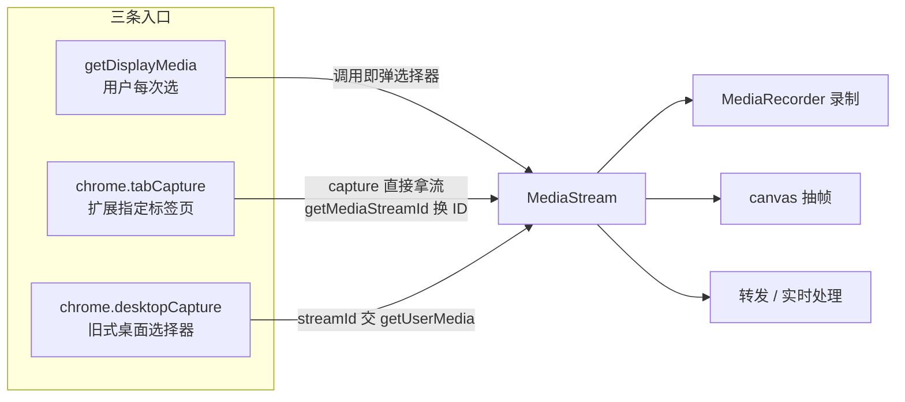

import { Canvas, Controls, Meta } from '@storybook/addon-docs/blocks';
import * as ScreenCapture from './screen-capture.stories';

<Meta of={ScreenCapture} name="Docs" />

# 屏幕捕获

屏幕捕获要做的事只有一件：把浏览器里正在发生的画面和声音变成可录制、可处理的 `MediaStream`。三个入口服务同一件事——`getDisplayMedia()` 让用户在选择器里挑屏幕、窗口或标签页；`chrome.tabCapture` 让扩展直接抓当前（或指定）标签页；`chrome.desktopCapture` 是旧式的桌面选择器。选哪条链路只看两条轴：**来源由谁定**（用户每次挑，还是扩展按 `tabId` 指定）和**代码跑在哪**（可见文档，还是 service worker——后者没有可见文档能力，必须经 offscreen 文档转发）。流一旦到手，下游处理与捕获方式解耦：`MediaRecorder` 录成 webm、canvas 逐帧抽图、或转发给别的上下文。

Chrome 148 起 Chrome 支持标准化的 `browser.*` 命名空间，官方文档正迁往该写法；本课示例沿用覆盖面最广的 `chrome.*`。



三条链路的差异集中在一张表里，也是本课的回查入口：

| 链路 | 来源由谁定 | 调用位置 | 权限 | 拿到的东西 | 关键边界 |
| --- | --- | --- | --- | --- | --- |
| `getDisplayMedia()` | 用户，每次调用都选（屏幕 / 窗口 / 标签页） | 可见文档 + 用户手势；service worker 里要经 offscreen 文档 | 无扩展权限 | `MediaStream` | 选择器无法预选；内容脚本里导航后自动结束 |
| `tabCapture.capture()` | 当前激活标签页 | 扩展页面（前台） | `"tabCapture"` | `MediaStream` | 类似 `activeTab`：用户唤起扩展后只能抓当前标签页 |
| `tabCapture.getMediaStreamId()` | 当前或指定标签页 | 扩展页面或 service worker（Chrome 116+） | `"tabCapture"`；`targetTabId` 另需 `activeTab` | 一次性 streamId | ID 只能用一次，几秒不用即失效 |
| `desktopCapture.chooseDesktopMedia()` | 用户，在选择器里选 | 扩展页面 | `"desktopCapture"` | streamId | 消费页面需安全源；现行 how-to 已不再推荐 |

## 选择捕获链路

判断模型是两条轴。**来源轴**：选择式让用户每次挑，画面范围跟着用户的选择走，适合"录什么用户自己最清楚"；主题式由扩展按标签页指定，不给用户添选择器，但要有 `"tabCapture"` 权限，且默认只抓当前激活标签页。**上下文轴**：`getDisplayMedia()` 是 Web 平台 API，只在可见文档里可用且依赖用户手势；service worker 里没有这类可见文档能力，必须把调用转交给 offscreen 文档执行（offscreen 模型见 [Service Worker](?path=/docs/service-worker--docs)）。

| 来源 | 上下文 | 做法 |
| --- | --- | --- |
| 用户每次选 | 扩展页面 | 直接调 `getDisplayMedia()` |
| 用户每次选 | service worker | SW 发消息 → offscreen 文档里调 `getDisplayMedia()`，`reasons` 用 `['DISPLAY_MEDIA']` |
| 扩展指定标签页 | 扩展页面 | `tabCapture.capture()` 拿流，或 `getMediaStreamId()` + 本页 `getUserMedia()` |
| 扩展指定标签页 | service worker | SW 取 `getMediaStreamId()` → offscreen 文档里 `getUserMedia()` 消费，`reasons` 用 `['USER_MEDIA']` |

还有一个独立条件：**导航之后是否还要继续录**。选择式录制绑定在当前渲染帧上，内容脚本里的录屏在用户导航到新页面时自动结束；要跨导航持续，换成 tabCapture 的 offscreen 模式——流跟着标签页走，导航不影响。

下面的范例把两条轴做成控件，观察推荐链路、选择器是否出现、需要的权限与 offscreen 文档。

<Canvas of={ScreenCapture.Path} />
<Controls of={ScreenCapture.Path} />

| 读者操作 | 可观察证据 |
| --- | --- |
| 来源选「用户每次选」、上下文「扩展页面」、关掉跨导航 | 链路是「扩展页面 → `getDisplayMedia()`」，读数显示每次调用弹选择器、无需扩展权限、不需要 offscreen 文档 |
| 同样条件下只打开「跨导航仍需继续录」 | 链路插入 offscreen 文档，`reasons` 为 `['DISPLAY_MEDIA']`：选择式录制在导航时会中断 |
| 上下文切到「service worker」 | 链路改由 SW 消息驱动、offscreen 文档执行：SW 里没有可见文档能力 |
| 来源选「扩展指定标签页」 | 链路改走 `tabCapture`：读数显示需要 `"tabCapture"` 权限、`targetTabId` 需 `activeTab`、不弹选择器；SW 上下文的 offscreen `reasons` 变为 `['USER_MEDIA']` |
| 打开 Show code | 看到该 Canvas 实际执行的 `capture-path.ts` |

## 捕获当前标签页（tabCapture）

`chrome.tabCapture` 是主题式捕获：不弹选择器，扩展按标签页直接要流，manifest 声明 `"tabCapture"` 权限。它与[标签页与窗口](?path=/docs/tabs-windows--docs)一课的 `tabs.captureVisibleTab` 是两回事：后者返回一张 PNG 截图，这里要的是活的流。tabCapture 不在内容脚本可用的 API 之列，从扩展页面或 service worker 路线发起。

### capture 前台拿流

`capture()` 在前台上下文调用（popup、选项页、侧边栏等扩展页面），捕获**当前激活标签页**的可视区域；调用要跟在用户手势之后，行为与 `activeTab` 一致——用户唤起扩展后，能抓的就是当前这个标签页。抓取随用户继续浏览而持续，直到标签页关闭或扩展停掉流上的轨道。

```js
// popup 里录一段音频：tabCapture 抓的是当前标签页
chrome.tabCapture.capture({ audio: true }, (stream) => {
  const recorder = new MediaRecorder(stream);
  recorder.start();
  // popup 关闭时记得 recorder.stop()，否则录制随窗口消失而中断
});
```

`CaptureOptions` 的四个字段：

| 字段 | 含义 | 说明 |
| --- | --- | --- |
| `video` | 是否要视频轨 | 缺省 `true` |
| `audio` | 是否要音频轨 | 缺省 `false` |
| `videoConstraints` | 视频轨约束 | `mandatory` / `optional` 两段；常用键 `minWidth` / `maxWidth` / `minHeight` / `maxHeight` / `minFrameRate` / `maxFrameRate`，限制拿到的分辨率与帧率 |
| `audioConstraints` | 音频轨约束 | `mandatory` 常用键 `echoCancellation` |

- 在 popup 里抓**视频**要小心：捕获会把焦点引向被捕获内容，popup 随之关闭。官方 how-to 的结论是 popup 只适合纯音频短录；要视频就把调用放在长驻的扩展页面或 offscreen 文档里。

谁正在被捕获、状态如何，用 `getCapturedTabs()` 查：它返回 `CaptureInfo[]`，只包含状态不是 `stopped` 与 `error` 的标签页——按官方说明，这正是为了避免对同一个标签页重复发起捕获。

```js
const [info] = await chrome.tabCapture.getCapturedTabs();
// info: { tabId, status: 'pending' | 'active' | 'stopped' | 'error', fullscreen }

chrome.tabCapture.onStatusChanged.addListener((info) => {
  // 捕获状态变化：pending → active → stopped，或 error
});
```

- `status` 四态：`pending`（已请求未就绪）、`active`（正在捕获）、`stopped`（已停止）、`error`。
- `fullscreen` 表示被捕获标签页里有元素进入全屏，用来在 UI 上提示"当前是全屏内容"。
- `getCapturedTabs()` 的 Promise 形式从 Chrome 116 起可用；标签页关闭、用户停共享等收尾工作可以挂在 `onStatusChanged` 上。

### getMediaStreamId 交给 getUserMedia

另一种拿法不直接给流，而是给一个 streamId：`getMediaStreamId()` 返回的 ID 配合 Web 平台的 `getUserMedia()` 把流取回来。这是 tabCapture 与 getUserMedia 的接头，也是后台录制的关键一步——ID 可以在 service worker 里取得，再到 offscreen 文档里换成流。

```js
// service worker 里拿当前标签页的 streamId
const streamId = await chrome.tabCapture.getMediaStreamId({ targetTabId: tab.id });

// 在 offscreen 文档（或扩展页面）里把 ID 换成真流
const stream = await navigator.mediaDevices.getUserMedia({
  video: { mandatory: { chromeMediaSource: 'tab', chromeMediaSourceId: streamId } },
  audio: { mandatory: { chromeMediaSource: 'tab', chromeMediaSourceId: streamId } },
});
```

`GetMediaStreamOptions` 的两个字段：

| 字段 | 缺省 | 含义 |
| --- | --- | --- |
| `targetTabId` | 当前激活标签页 | 要捕获的标签页；只能选持有 `activeTab` 授权的标签页 |
| `consumerTabId` | 无 | 之后由哪个标签页调 `getUserMedia()` 消费这个 ID |

- ID 是**一次性**的：只能用一次，几秒内不用就失效。每次要流都重新调 `getMediaStreamId()`，不要缓存复用。
- 不传 `consumerTabId`：只有调用方扩展能用（Chrome 116 起限调用方渲染进程里的同安全源帧）；service worker 取得的 ID 可以在 offscreen 文档里消费。
- 传了 `consumerTabId`：该标签页里同安全源（如 HTTPS）的帧都可以用这个 ID 调 `getUserMedia()`——这是把 tabCapture 的流递给网页消费的旧模式。

后台录制的完整链路（官方 how-to 推荐模式，Chrome 116+）：SW 先用 `runtime.getContexts({ contextTypes: ['OFFSCREEN_DOCUMENT'] })` 查现成的 offscreen 文档，没有就 `offscreen.createDocument()` 建一个（每个扩展同一时刻只能有一个），再 `getMediaStreamId({ targetTabId })`，把 ID 发消息给 offscreen 文档；文档里 `getUserMedia()` 拿到流后接 `MediaRecorder`。想让录到的声音不从扬声器消失，用 `AudioContext` 把捕获流接回 `destination`，否则捕获上下文（如 popup）关闭后声音就断了。

## 捕获屏幕或窗口（getDisplayMedia）

`getDisplayMedia()` 是 Web 平台 API，不声明任何扩展权限就能用，代价是**每次调用都弹选择器**：用户在里头挑屏幕、某个窗口或某个标签页，选完浏览器才允许产生流。这份授权无法持久化复用，所以它不可能在后台悄悄开始。

```js
async function startDisplayCapture() {
  const stream = await navigator.mediaDevices.getDisplayMedia({
    video: { displaySurface: 'browser' }, // 期望类型：monitor / window / browser
    audio: { suppressLocalAudioPlayback: true },
  });
  return stream;
}
```

- 约束在用户选完来源之后才生效，且不能用来缩小选择面：`displaySurface`、`systemAudio`、`surfaceSwitching` 这类键只是给浏览器和用户的提示；`min` / `exact` 值不被允许。
- `video: false` 直接抛 `TypeError`；只要音频也要显式写 `audio: true`。
- 常用提示键：`systemAudio: 'include' | 'exclude'`（要不要系统音频）、`surfaceSwitching`（允许用户中途切换共享来源）、`selfBrowserSurface: 'exclude'`（把当前标签页从选择器里排掉）、`preferCurrentTab`、`monitorTypeSurfaces`。
- 扩展页面（`chrome-extension://`）是安全上下文，可以直接调用；**service worker 不行**，按上节模式经 offscreen 文档执行，`reasons` 用 `['DISPLAY_MEDIA']`。
- 从内容脚本调用时，录屏绑定在当前渲染帧上：用户导航到新页面后自动结束。
- 失败要按类型分：`NotAllowedError` 是用户取消或拒绝；`InvalidStateError` 是调用时没有用户手势、或页面不处于激活聚焦状态；`TypeError` 通常是约束不合法。三者都要 `.catch` 并给出可重试的入口。

与 tabCapture 的取舍回到两条轴：想让用户自己掌控范围、愿意每次弹选择器，用 `getDisplayMedia()`；想点一下扩展就开始录当前标签页、不给用户添负担，用 tabCapture。

## 桌面选择器（desktopCapture）

`chrome.desktopCapture.chooseDesktopMedia()` 是同一思路的旧式扩展 API：声明 `"desktopCapture"` 权限，弹一个选择器让用户挑屏幕、窗口或标签页，回调里给一个 streamId，再由 `getUserMedia()` 换成流。官方参考没有标注弃用，但现行 how-to 已不再涉及它，新功能优先 `getDisplayMedia()`。

```js
const requestId = chrome.desktopCapture.chooseDesktopMedia(
  ['screen', 'window', 'tab', 'audio'], // 选择器页签，顺序即展示顺序
  undefined,                            // targetTab：不传则只有调用扩展能用
  (streamId, options) => {
    if (!streamId) return;              // 用户取消时为空串
    if (options.canRequestAudioTrack) {
      // 用户勾选了「共享音频」，才允许再要音频轨
    }
    navigator.mediaDevices.getUserMedia({
      video: {
        mandatory: { chromeMediaSource: 'desktop', chromeMediaSourceId: streamId },
      },
    });
  },
);
```

- `sources` 四个值：`screen`、`window`、`tab`、`audio`；带上 `audio` 决定用户能否勾选共享音频。
- 传 `targetTab` 后，streamId 可交给该标签页里同安全源的帧消费；不传只有调用扩展能用。
- streamId 与 tabCapture 的 ID 一样是一次性、数秒不用即失效；不需要时可以先 `cancelChooseDesktopMedia(requestId)` 收起选择器。
- 注意 `chromeMediaSource` 的取值：桌面源是 `desktop`，标签页源是 `tab`，别混。

## 录制与处理

三条链路拿到的都是普通 `MediaStream`，从这里开始与捕获方式解耦：录制成文件、逐帧抽图、或实时转发。

### MediaRecorder 录制

`MediaRecorder` 把流编码成 webm；Chrome 对 VP8 / VP9 视频加 Opus 音频的组合支持最稳。

```js
const mimeType = MediaRecorder.isTypeSupported('video/webm;codecs=vp9,opus')
  ? 'video/webm;codecs=vp9,opus'
  : 'video/webm';

const recorder = new MediaRecorder(stream, {
  mimeType,
  videoBitsPerSecond: 2_500_000, // 实际生效值以 recorder.videoBitsPerSecond 为准
  audioBitsPerSecond: 128_000,
});

const chunks = [];
recorder.ondataavailable = (event) => chunks.push(event.data);
recorder.start(1000); // 每 1000ms 一个分块，边录边写

recorder.onstop = () => {
  const blob = new Blob(chunks, { type: mimeType });
  const url = URL.createObjectURL(blob);
  // 下载、上传或回放
};
```

- 容器格式因浏览器而异，构造前先 `MediaRecorder.isTypeSupported()` 探测；把不支持的串直接传给构造函数会抛 `NotSupportedError`。
- `start(timeslice)` 决定分块节奏：给了 timeslice，每录制这么多毫秒触发一次 `dataavailable`；不给则只在 `stop()` 时给一整块。长录要给 timeslice，内存才可控。
- 用户在浏览器原生 UI 上点「停止共享」时，流上的轨道结束：不需要你手动收尾，`dataavailable`（最后一块）和 `stop` 照样会来。保存逻辑要同时覆盖"用户停共享"和"你主动 `stop()`"两条路径。
- 收尾后 `stream.getTracks().forEach((track) => track.stop())`：显式停掉轨道，系统里的共享指示才会消失、资源才释放。

### canvas 抽帧与成本

要的不是文件而是画面（缩略图、逐帧分析、转给 canvas 特效），做法是拿一个隐藏的 `<video>` 播流，在 `requestAnimationFrame` 里 `drawImage` 到 canvas：

```js
const video = document.createElement('video');
video.srcObject = stream;
video.muted = true;
await video.play();

const canvas = document.getElementById('frame');
const context = canvas.getContext('2d');
let lastDraw = 0;

function tick(time) {
  requestAnimationFrame(tick);
  if (time - lastDraw < 1000 / targetFps) return; // 按目标帧率抽，不必每帧都抽
  lastDraw = time;
  context.drawImage(video, 0, 0, canvas.width, canvas.height);
  canvas.toBlob((blob) => upload(blob)); // 或 toDataURL / createImageBitmap
}
requestAnimationFrame(tick);
```

- 抽帧成本 = 源帧率 × `drawImage` 单帧成本。源是 60fps 的屏幕共享时，每帧都抽会吃掉全部主线程预算：按业务需要的帧率抽，或把绘制挪进 `OffscreenCanvas` + worker。
- `MediaRecorder` 的 `videoBitsPerSecond` 与抽帧频率是两个独立旋钮：文件体积由码率 × 时长决定，与抽多少帧无关。
- 抽帧得到的 `ImageBitmap` 可以直接 `drawImage` 到别的 canvas，或用 `OffscreenCanvas.transferToImageBitmap()` 交给 worker，避免主线程阻塞。

下面的范例模拟一条捕获流：调节源帧率、码率、音轨和抽帧节奏，观察估算体积、抽帧张数与主线程负担；关掉「共享中」可以看到流结束时的收尾行为。

<Canvas of={ScreenCapture.Recording} />
<Controls of={ScreenCapture.Recording} />

| 读者操作 | 可观察证据 |
| --- | --- |
| 默认参数（30fps、2.5 Mbps、带音轨、每帧抽）跑到 10 秒 | 估算体积约 3.2 MB（(2500+128) kbps × 10s ÷ 8）；缩略图条累积到约 300 张 |
| 码率切到 8 Mbps | 「每秒体积」读数立即升到约 1000 KB/s，体积累积斜率陡增；抽帧张数不变 |
| 抽帧切到「每 500ms 一次」 | 10 秒只有约 20 张缩略图，主线程负担从「高」降到「低」 |
| 关掉音轨 | 体积估算减去 128 kbps 的部分；录制分块条同步变窄 |
| 关掉「共享中」 | 画面冻结并出现停止指示，最后一个分块落库，`MediaRecorder` 状态回到 `inactive`；重新打开即开始一段新录制 |
| 打开 Show code | 看到该 Canvas 实际执行的 `recording.ts` |

## 最佳实践

- 能不录就不录、能少录就少录：默认只抓目标标签页而不是整屏；录完立刻 `stream.getTracks().forEach((track) => track.stop())`，让共享指示消失、资源释放。
- 用户手势内发起：`tabCapture.capture()` 和 `getDisplayMedia()` 都依赖手势。把「开始录制」放进 [Action 与弹窗](?path=/docs/action-popup--docs) 的点击或快捷键回调里，别在 `onInstalled` 或定时任务里自动开录。
- 后台持续录制走 SW → offscreen 模式，并管理 offscreen 文档的生命周期：同一时刻只能有一个，录制结束后 `close()` 释放；消息与事件的纪律沿用[消息通信](?path=/docs/messaging--docs)与 [Service Worker](?path=/docs/service-worker--docs) 两课的模型。
- `MediaRecorder` 三段式固定：先 `isTypeSupported()` 探容器，构造时给定码率，`start(timeslice)` 边录边写；收尾同时处理主动 `stop()` 和用户「停止共享」两条路径。
- 抽帧按需降频，大画面优先 `OffscreenCanvas`；要压体积先调 `videoBitsPerSecond`，再考虑降 `videoConstraints`。
- 隐私红线：录屏内容常含密码、私信、桌面通知。录制范围最小化、状态常驻可见、默认不落盘或到点即删；这类取舍与 CSP、最小权限的整体实践在[安全与隐私](?path=/docs/security-privacy--docs)一课。

## 常见问题

- 点击之后 `tabCapture.capture()` 拿不到流，或调用像没生效
  `capture()` 是前台能力：必须在用户手势之后的扩展页面里调用，抓的是当前激活标签页，manifest 要有 `"tabCapture"`。把调用挪进 popup 或快捷键回调，并确认发起时目标标签页仍是激活项。

- 用户点了浏览器自带的「停止共享」，之后逻辑像卡住了
  这是正常收尾而非异常：流上轨道结束时，`MediaRecorder` 会自动补发最后的 `dataavailable` 再触发 `stop`。把保存逻辑同时挂在 `recorder.onstop` 上（而不是只等你自己的停止按钮），并监听 `track.onended` 更新界面。

- `getMediaStreamId()` 拿到的 ID 第二次用就报错
  ID 是一次性的，且几秒不用即失效。每次要流都重新调用 `getMediaStreamId()`；跨 service worker 与 offscreen 文档传递时要即时消费，不要缓存复用。

- `getUserMedia()` 消费 tabCapture 的 ID 报安全错误
  不传 `consumerTabId` 时，ID 只能被调用方扩展使用（Chrome 116 起限同安全源帧）；传了 `consumerTabId` 时，消费者必须是该标签页里同安全源的帧。检查原点是否匹配，以及 `chromeMediaSource` 是否用对（标签页源 `tab`、桌面源 `desktop`）。

- 内容脚本里 `getDisplayMedia()` 录屏，用户一导航录制就断了
  预期如此：选择式录制绑定在当前渲染帧上，导航即换帧。要跨导航持续，改用 service worker + offscreen 文档的 tabCapture 模式，流跟着标签页走。

- popup 里录视频，窗口闪一下就没了
  捕获会把焦点引向被捕获内容，popup 因此关闭。popup 只做纯音频短录；需要视频就把调用放在长驻扩展页面或 offscreen 文档里。

- `new MediaRecorder(...)` 抛 `NotSupportedError`
  构造前没有探测容器格式：`MediaRecorder.isTypeSupported()` 对不支持的串返回 `false`，直接传给构造函数就会抛错。按探测结果构造 `video/webm;codecs=vp9,opus` / `vp8,opus` / `video/webm` 的回退链。

## 总结回顾

摘要：

屏幕捕获的本体是三入口一下游：`getDisplayMedia()`、`chrome.tabCapture`、`chrome.desktopCapture` 负责拿流，`MediaRecorder` 与 canvas 负责处理。选链路看两条轴——来源由用户每次选定还是扩展按标签页指定，代码跑在可见文档还是 service worker；后者没有可见文档能力，必须经 offscreen 文档转发，且 `getDisplayMedia` 用 `DISPLAY_MEDIA` 理由、tabCapture 的 ID 消费用 `USER_MEDIA` 理由。tabCapture 侧记住：`capture()` 是前台能力，用户手势、当前激活标签页，popup 只适合音频；`getMediaStreamId()` 给一次性 streamId 供 `getUserMedia()` 消费；`getCapturedTabs()` 与 `onStatusChanged` 用 `pending` / `active` / `stopped` / `error` 查状态、防重复捕获。下游记住：`MediaRecorder` 先探容器再构造、`start(timeslice)` 分块落盘、用户「停止共享」会自动补最后一块并 `stop`；抽帧成本是源帧率与单帧绘制成本的乘积，与文件体积（码率 × 时长）是两个独立旋钮。

一句话：

> 决定链路的是「谁定来源、跑在哪」；决定成本的是码率与抽帧频率；而收尾永远有两条路径——你主动停，或用户停共享。

知识要点：

- 三条捕获链路各自的来源决定者、调用位置、权限与产物是什么？
- 两条轴（来源、上下文）组合出的四种情形分别怎么实现，offscreen 理由怎么选？
- `tabCapture.capture()` 的前台限制有哪些，为什么 popup 里不适合抓视频？
- `getMediaStreamId()` 的 `targetTabId` 与 `consumerTabId` 各控制什么，ID 有什么时效约束？
- service worker 里的后台 tabCapture 录制要经过哪些步骤？
- `getDisplayMedia()` 的约束为什么不能用来缩小选择面，常见失败错误有哪些？
- `MediaRecorder` 的容器探测、分块录制与「用户停止共享」的收尾分别怎么写？
- 抽帧的成本由什么决定，降低主线程负担有哪些做法？

## 参考资料

- [Audio recording and screen capture（官方 how-to）](https://developer.chrome.com/docs/extensions/how-to/web-platform/screen-capture)
- [chrome.tabCapture API 参考](https://developer.chrome.com/docs/extensions/reference/api/tabCapture)
- [chrome.desktopCapture API 参考](https://developer.chrome.com/docs/extensions/reference/api/desktopCapture)
- [chrome.offscreen API 参考](https://developer.chrome.com/docs/extensions/reference/api/offscreen)
- [MediaDevices.getDisplayMedia()（MDN）](https://developer.mozilla.org/en-US/docs/Web/API/MediaDevices/getDisplayMedia)
- [MediaRecorder（MDN）](https://developer.mozilla.org/en-US/docs/Web/API/MediaRecorder)
