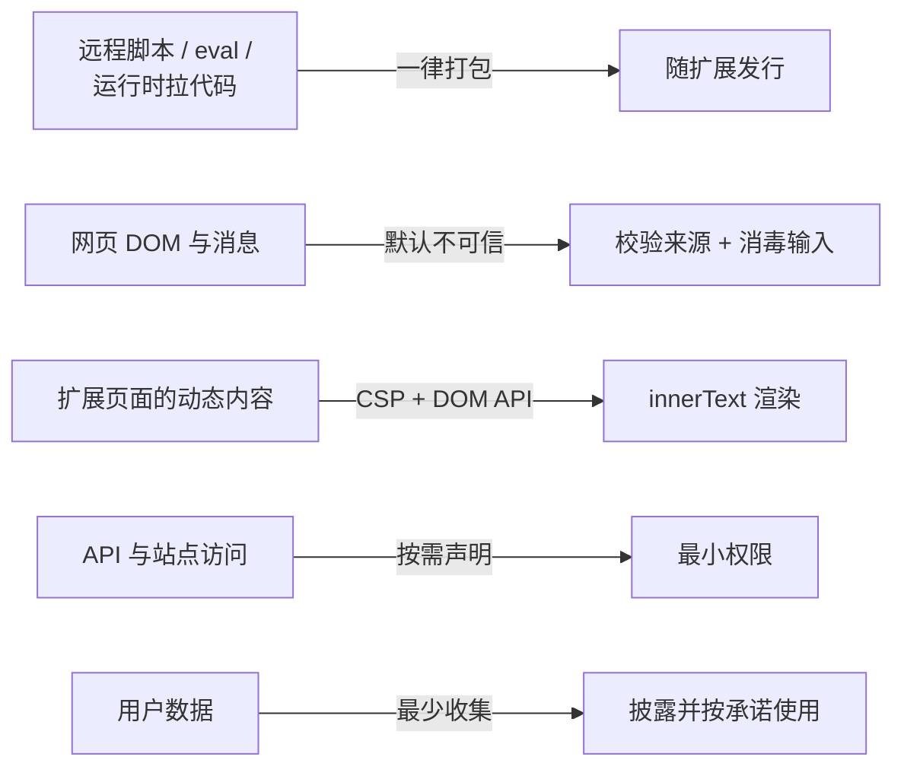

import { Canvas, Controls, Meta } from '@storybook/addon-docs/blocks';
import * as SecurityPrivacyStories from './security-privacy.stories';

<Meta of={SecurityPrivacyStories} name="Docs" />

# 安全与隐私

扩展跑在浏览器里，持有的却是用户级特权：读写站点数据、拿 OAuth 令牌、替用户发跨站请求。攻破一个扩展，等于攻破每一个装了它的人——所以官方的两页实践指南给出的是同一条立场：**默认拒绝**。代码全部随包发行，资源只暴露必需的，进来的消息与页面数据当作不可信，权限只按当前功能申请，拿到的用户数据按承诺使用。本课按「代码进包 → 页面渲染 → 消息进城 → 权限与数据 → 披露与发布」的顺序，把这条立场落成可核对的配置和判断。



各道防线的默认值与回查要点：

| 配置 / 做法 | 默认值或要求 | 违反或放松的后果 |
| --- | --- | --- |
| `content_security_policy.extension_pages` | 不写时默认 `script-src 'self'; object-src 'self'` | 不得写入 `'unsafe-eval'` 或远程源，否则安装即报 `Insecure CSP value` |
| `content_security_policy.sandbox` | 沙箱页 CSP 默认含 `'unsafe-inline' 'unsafe-eval'` | 沙箱页没有扩展 API，也访问不了非沙箱页 |
| 远程代码 | 逻辑必须随包发行 | Web Store 审核拒绝（Blue Argon / 远程代码违规） |
| `web_accessible_resources` | 默认不向网页暴露任何文件 | 每多暴露一个文件，就多一个可被网页探测的指纹入口 |
| `externally_connectable` | 不声明时其他扩展都能连、网页都不能 | 声明不全会把本想放行的对端挡在外面 |
| `activeTab` | 用户手势时临时授权当前标签页，无安装警告 | 常驻主机权限的首选替代 |
| 隐私政策 URL 与数据用途披露 | 处理任何用户数据即必须提供 | 缺失即违反 Web Store 隐私政策要求 |

权限申请机制在[Manifest 与权限](?path=/docs/manifest-permissions--docs)一课，消息通道本身在[消息通信](?path=/docs/messaging--docs)一课；本课只回答「凭什么放行、凭什么收集」。Web Store 政策类内容以官方当前表述为准，可能随时更新。

## 远程代码

MV3 之前，扩展可以往页面里插一个指向 CDN 的 `<script src>`，或者把代码当字符串求值——逻辑随时能在服务器上更换，用户装的东西和开发者跑的东西不是同一份。MV3 掐断了这条路：**扩展执行的逻辑必须随包发行**。理由很直接：用户看到的、安装的、运行的应该是同一份可审核的代码。

### 禁什么

三类写法在 MV3 的扩展上下文里都行不通：

- **字符串求值**：`eval()`、`new Function()`。扩展页面默认 CSP 是 `script-src 'self'`，不含 `'unsafe-eval'`，调用即抛 `EvalError`。
- **远程脚本与远程代码**：HTML 里引用 CDN 上的 js、`scripting.executeScript({ files: [...] })` 指向远程 URL。MV3 的 `executeScript` 只接受包内路径的 `files` 或随包序列化的 `func` + `args`，没有字符串代码入口。
- **运行时拉代码的库**：依赖在运行时动态加载远端模块同样算违规。官方点名过 Firebase Auth——一方库也没有例外。

文档列明的例外只有几个通道级能力：`scripting.insertCSS` 注入的远程样式（样式不是逻辑）、devtools 面板的 `inspectWindow.eval`、以及 debugger API 的 `sendCommand`。数据不在禁令内：远程 JSON、远程配置都不算代码。

### 替代做法

需要动态能力时有四条路，按侵入性从小到大：

| 需求 | 做法 |
| --- | --- |
| 只是开关特性 | 拉远程 JSON 配置，本地判断后启用已打包的代码 |
| 逻辑要保密或常更新 | 调用远端服务，代码留在服务端，扩展只发请求 |
| 第三方库 | 把库打包进扩展（vendor 源码或构建产物） |
| 必须执行不受信或依赖 eval 的代码 | manifest 的 `sandbox` 键 + 沙箱页，见「扩展 CSP」 |

往页面注入逻辑时，MV2 的字符串代码参数换成函数加参数：

```js
// MV3：func 随包序列化注入，args 只传数据
await chrome.scripting.executeScript({
  target: { tabId },
  func: (keyword) => {
    document.querySelectorAll('h3').forEach((el) => {
      el.innerText += `（匹配 ${keyword}）`;
    });
  },
  args: [keyword], // keyword 可以来自页面内容
});
```

`func` 在注入时序列化，因此引用不到外层作用域的变量——数据一律走 `args`。这条纪律同时是安全边界：页面内容只能当数据处理，不会变成被执行的代码。

**可观察证据：** 被 Web Store 判定使用远程代码时，审核会以 Blue Argon 错误拒绝。自查的办法是在**编译产物**里搜 `http://` 与 `https://`：审核看的是构建后的代码，源码干净不代表产物干净；库里自带远程代码的（Firebase Auth 当年就出过）要么换库、要么联系库作者、要么开 tree-shaking——Rollup 与 Vite 默认开启，webpack 需要配置。

## 扩展 CSP

CSP 管两类页面能加载哪些资源：扩展自己的页面（popup、选项页、覆盖页）与 service worker，以及 manifest 里声明的沙箱页。manifest 中它是一个对象，两个键分别管这两类。

### 默认值与不可放宽

```json
{
  "content_security_policy": {
    "extension_pages": "script-src 'self'; object-src 'self';"
  }
}
```

- **不写这个字段时默认值就是上面这串**：只允许加载包内脚本与对象，WebAssembly 禁用，内联脚本与字符串求值都不可用。多数扩展不需要显式声明。
- `extension_pages` **不允许放宽**：能写的最宽松形式是 `script-src 'self' 'wasm-unsafe-eval'; object-src 'self'`（需要 WebAssembly 时）。往里写 `'unsafe-eval'` 或远程源，安装时就会报错：

```text
'content_security_policy.extension_pages': Insecure CSP value "'unsafe-eval'" in directive 'script-src'.
```

- 覆盖范围包括扩展自己打开的 iframe；content script 不归它管——隔离世界里的 content script 有一份等效 CSP（同样禁 `eval` 与外部脚本），注入 MAIN 世界时改用所在页面的 CSP，见[Content Scripts](?path=/docs/content-scripts--docs)。
- 官方「Stay secure」指南给只加载自身资源的扩展的起手式是 `default-src 'self'`：它与默认值等效，价值在于把意图显式写进 manifest。

### 沙箱页

第二个键 `sandbox` 描述 `sandbox.pages` 列出的页面。沙箱页跑在一个独立源里：没有扩展 API，也接触不到非沙箱页（只能用 `postMessage` 通信），因此它不受扩展 CSP 约束，可以用内联脚本和 `eval()`：

```json
{
  "content_security_policy": {
    "sandbox": "sandbox allow-scripts; script-src 'self'"
  },
  "sandbox": {
    "pages": ["page1.html"]
  }
}
```

自定义沙箱 CSP 必须包含 `sandbox` 指令，且不能带 `allow-same-origin`——否则沙箱页就能以扩展的身份访问扩展 API，隔离形同虚设。它是「必须执行一段不受信或依赖 eval 的第三方代码」时的唯一合法位置，代价是那个页面拿不到任何 `chrome.*` 能力。

## 动态内容与 XSS

popup 显示从网页拿来的标题、选项页回显用户填写的文本——凡是把**外部数据拼进 HTML** 的地方，就是 XSS 入口。官方指南点名 `innerHTML` 与 `document.write()`：它们把「插入文本」变成「插入标记」，攻击者控制的字符串会被解析成可执行的东西。

防御不是过滤字符串，而是换 API：手动建节点，动态文本用 `innerText` / `textContent`：

```js
// pageTitle 来自网页，视同不可信
function renderTitle(host, pageTitle) {
  const title = document.createElement('h1');
  title.innerText = pageTitle; // 永远是文本，不会被解析成标记
  host.appendChild(title);
}
```

需要渲染富文本（邮件预览、带格式的笔记）时，先用消毒库（如 DOMPurify）处理再进 `innerHTML`，库同样要打包进扩展。别指望扩展 CSP 兜底：它只决定脚本来源，不消毒你的输入。

下面的实例演示同一段页面数据走两条渲染路径的真实结果。切换「渲染方式」与「数据载荷」，观察容器文本与载荷是否执行：

<Canvas of={SecurityPrivacyStories.XssRender} />
<Controls of={SecurityPrivacyStories.XssRender} />

| 读者操作 | 可观察证据 |
| --- | --- |
| 载荷为「事件属性载荷」、渲染方式为 `innerHTML` | 图片加载失败触发 `onerror`，读数为「已执行」——注入的标记变成了真实脚本 |
| 同一载荷切到 `createElement + innerText` | 载荷原样显示为文本，读数为「未执行」 |
| 载荷为「script 标签载荷」、渲染方式为 `innerHTML` | 不执行，但容器为空：`innerHTML` 插入的 script 本就不运行，真正的风险始终是事件属性类载荷 |
| 载荷为「纯文本」 | 两条路径结果一致——安全输入不依赖渲染方式 |

三点边界：`innerText` 与 `textContent` 都不解析标记，前者按换行呈现，后者保留源码中的空白；`document.write` 属官方点名的高危 API，扩展页面同样不要用；content script 写页面 DOM 时同理——它插进页面的一切都运行在页面的信任语境里（见[Content Scripts](?path=/docs/content-scripts--docs)）。

## 消息来源校验

消息是扩展与不可信世界的接口：content script 寄生在网页里，外部站点和其他扩展也能发消息进来。默认立场是**每条消息都要能回答「凭什么放行」**。

### 外部消息：白名单

网页和其他扩展的消息走 `runtime.onMessageExternal`，能不能到达由 manifest 的 `externally_connectable` 决定（通道的注册方式与广播语义见[消息通信](?path=/docs/messaging--docs)）：不声明时所有其他扩展都能连、网页都不能；一旦声明就按 `ids`（哪些扩展）与 `matches`（哪些网页）收窄。注意这条默认值的另一面：只写了 `matches` 而没写 `ids`，其他扩展反而被挡在外面。官方指南还有一条注册纪律：只在确实期望与外部通信时才注册 `onMessageExternal`，不需要的扩展不要留这个入口。

到达不是放行。外部消息一律先校验 `sender`：

```js
const kTrustedExtensionId = 'iamafriendlyextensionhereisdatas';

chrome.runtime.onMessageExternal.addListener((request, sender, sendResponse) => {
  if (sender.id !== kTrustedExtensionId) {
    return; // 白名单之外一律不处理
  }
  // 校验通过再执行
});
```

`sender` 里可用的字段：`id`（来源扩展）、`origin` 与 `url`（来源网页）、`tab`（来源标签页）、`frameId`。扩展来源对 `id` 常量核对，网页来源对 `origin` 核对——不要把 `sender.url` 整体拿来做字符串比较，路径部分会变。

### 内部消息：别信 content script

`runtime.onMessage` 收的是扩展内部消息，`sender.id` 一定是本扩展——但这不等于可信。content script 与页面共享渲染进程，官方指南要求按最坏情况假设：

- 来自 content script 的消息**可能由页面诱导或伪造**（页面改掉它依赖的 DOM、利用命名项等 Web 标准怪癖），先校验再执行，敏感操作按 action 白名单放行：

```js
const kAllowedActions = new Set(['pick-text', 'save-selection']);

chrome.runtime.onMessage.addListener((request, sender, sendResponse) => {
  if (!kAllowedActions.has(request?.action)) {
    console.warn('拒绝未登记的动作：', request?.action, sender.url);
    return;
  }
  // ……
});
```

- **发给 content script 的数据一律当作会泄漏给页面**：秘密、其他源的浏览数据、历史记录都不要过这条通道。
- **不要让 content script 触发特权动作**：它传来的 URL 不能直接进 `fetch()`，它传来的目标不能直接进 `chrome.tabs.create()`——要带白名单或用固定选项。
- **敏感操作放 service worker**：特权逻辑集中在后台，content script 只当 IO 管道（各上下文的边界见[扩展架构](?path=/docs/extension-architecture--docs)）。

下面的实例把「消息来源 × manifest 声明」摆成一张判断表。切换两个参数，观察消息到达哪个监听器、按什么校验、结论是什么：

<Canvas of={SecurityPrivacyStories.SenderValidation} />
<Controls of={SecurityPrivacyStories.SenderValidation} />

| 读者操作 | 可观察证据 |
| --- | --- |
| 来源为「白名单外的其他扩展」、声明为「未声明」 | 消息到达 `onMessageExternal`（默认所有扩展可连），`sender.id` 白名单拒绝 |
| 同一来源切到「ids + matches 白名单」 | 消息根本不到达——白名单把陌生扩展挡在通道外 |
| 来源为「matches 命中的外部网页」、声明为「未声明」 | 不到达：默认网页不能连接扩展 |
| 来源为「content script 转帖页面可控内容」 | 到达 `onMessage`，`sender.id` 校验无差别通过，靠 action 白名单拒绝——sender 校验分辨不出被诱导的 content script |

## 权限与暴露面最小化

权限是攻击面的度量单位。官方指南的判断很直白：授予的每一项 API 与站点访问，都是扩展一旦被攻破后攻击者能用的能力。权限不是「功能清单」，是「当前功能必需清单」。

### 最小权限

- **只声明当前依赖的**，不为「将来可能做」预留；manifest 保持精简，多余的键同样扩大暴露面。
- **主机权限按站点收窄**，能不用 `<all_urls>` 就不用。官方示例给出了写法与效果：

```json
{
  "host_permissions": ["https://developer.chrome.com/*", "https://*.google.com/*"]
}
```

  这样即使扩展被攻破，攻击者也够不到不匹配这些模式的站点——爆炸半径由 manifest 决定，不由代码决定。
- **能用 `activeTab` 就不用常驻主机权限**：用户手势触发的临时授权，导航或关闭即失效，且不产生安装警告。渐进授权用 `optional_permissions` / `optional_host_permissions` 在运行时申请，机制见[Manifest 与权限](?path=/docs/manifest-permissions--docs)。
- **传输只用 HTTPS**：HTTP 连接一律按会被窃听和篡改处理。

### 资源与连接暴露

`web_accessible_resources` 会把扩展文件暴露给网页上的所有脚本，包括第三方脚本；官方指南把它列为可指纹化入口——网页探测到这些文件，就知道用户装了这个扩展。做法是最小化：只放确需共享的图片、字体，`matches` 按站点收窄，能用 `use_dynamic_url: true` 时打开，让地址随会话变化（字段格式见[Manifest 与权限](?path=/docs/manifest-permissions--docs)）。

`externally_connectable` 同理：只登记真正需要对端的 `ids` 与 `matches`，不图省事写 `ids: ["*"]`。

## 敏感数据与令牌

扩展的存储没有加密：`chrome.storage` 的任何分区、页面里的 localStorage，落在磁盘上都是明文，能读到 profile 目录的进程都能看到。令牌、刷新凭据、API secret 都属于「客户端藏不住的东西」。

- **令牌优先不落盘**：放 `chrome.storage.session`（内存态，随会话释放）或运行时变量；必须持久化时用 `storage.local`，不要进 `storage.sync`——同步会把令牌分发到用户的所有设备。各分区行为见[存储](?path=/docs/storage--docs)。
- **OAuth 令牌的取得与失效处理**由[用户身份](?path=/docs/identity--docs)一课承载，这里只强调安全侧：`client_secret` 藏不住，`response_type=code` 的静默续期优先 refresh token 或 PKCE。
- **secret 不进 content script、不进 `web_accessible_resources`**：前者与页面共享进程，后者对全网可见。客户端配置里的 API key 一律按「已公开」对待，敏感调用走自己的服务端代理。
- **数据落在有注册域名的服务上**，别把用户数据发往临时或来路不明的主机。

## 隐私实践

隐私是安全姿态的另一面：拿得越少，漏得越少。官方「Protect user privacy」指南与 Web Store 政策把这条落成几件必须做的事。

### 数据最小化与 incognito 承诺

- **只收集实现功能必需的数据**，不做「将来可能用」式收集；权限申请要让用户看出与功能的关系。
- **尊重无痕承诺**：默认扩展不在无痕窗口运行；用户允许后，扩展也不该把无痕窗口的浏览历史持久化。判断用 `tabs.Tab` / `windows.Window` 的 `incognito` 属性：

```js
function saveTabData(tab) {
  if (tab.incognito) {
    return; // 无痕窗口不留痕；设置类偏好仍可保存
  }
  chrome.storage.local.set({ data: tab.url });
}
```

- **敏感数据不放客户端**，理由见上一节：扩展存储不加密。

### 上架披露：隐私政策与数据用途

只要扩展处理任何用户数据，开发者后台的隐私字段就是必填项，包含五组内容：单一用途说明、权限清单与逐项理由、远程代码声明、数据收集类型与 Limited Use 合规确认、隐私政策 URL。审核者按这些字段核对权限与数据使用是否对得上用途，缺项或对不上直接影响审核。远程代码要如实申报：用了远程代码却不申报会被拒，MV3 下加载执行远程文件本就不被允许。

隐私政策本身的要求：准确且随版本更新，与产品内披露一起完整说明收集、使用、共享方式与共享对象，地址登记在开发者后台的指定字段。政策原文见末尾参考链接中的 Web Store 政策页——**政策内容以官方当前表述为准，可能随时更新**。

### Limited Use 与遥测

Web Store 的 Limited Use 政策是用户数据的最低标准，要点：

- 数据只能用于**披露过的单一用途**及其运维目的（维护、安全、性能度量）。
- **浏览活动的收集和使用被禁止**，除非是 Chrome Web Store 商品页和产品界面里显著描述过的用户可见功能所必需——这条直接约束遥测与上报的野心。
- 向第三方传输只在少数情形下允许（实现单一用途、法律要求、反滥用、并购且取得用户明确同意）；**禁止**出售用户数据、用于个性化广告、提供给数据经纪人或征信。
- 人工阅读用户数据同样受限（用户明确同意、聚合匿名化、安全调查、法律要求几种例外）。
- 使用 Google API 获得的数据，还要按政策要求在扩展所属网站上作出遵守 User Data 政策的声明。

遥测的工程做法跟着政策走：只报功能使用所需的聚合事件，不报浏览内容。接 Google Analytics 时注意 MV3 禁远程代码，官方教程改用 Measurement Protocol 直接发 HTTP 请求，托管脚本不能打进包里。

## 发布环节

安全与隐私在发布环节集中兑现，也集中暴雷：

- **保护开发者账号**：扩展通过 Google 账号推送更新，账号沦陷等于攻击者直接向全部用户投毒。开启两步验证，优先用安全密钥；团队按最小权限分配成员角色。
- **远程代码如实申报**：确需使用的场景（沙箱页等）要在隐私字段声明并说明理由。
- **权限与用途一致**：权限清单与理由、数据收集类型要和单一用途对得上，超出即可能被拒或下架。
- **红线与政策条目按当前表述核对**：恶意行为（恶意软件、欺骗性安装、冒名）、隐私违规、滥用权限都在 Program Policies 的拒绝与下架范围内；政策页与安全指南都会调整，发布前按当前表述过一遍，不要凭记忆引用旧结论。

打包、上传与审核流程本身见[打包与上架](?path=/docs/publishing--docs)。

## 最佳实践

- **把「默认拒绝」落成四个动作**：能不申请的权限不申请、能不暴露的资源不暴露、能不信的消息不信、能不收集的数据不收集。每一项加进来前先问「少了它功能是否成立」。
- **特权逻辑集中在 service worker**。content script 只做 DOM 读写与消息转发：它可能被页面污染、可能泄漏数据，凭据、历史、跨源数据都不该经过它。
- **`web_accessible_resources` 与 `externally_connectable` 按白名单维护**：两者都是「对世界开门」，新增条目写清理由，定期清理失效条目。
- **令牌与 secret 按「已在公网」标准对待**：不落盘优先，`storage.sync` 永不考虑；客户端 key 只是便利，真正的秘密放服务端，调用走代理。
- **上架前做一遍静态自查**：源码与编译产物搜 `http://` / `https://` 确认无远程代码；manifest 核对 CSP、`web_accessible_resources`、`externally_connectable` 与权限清单；再按隐私字段五组内容核对用途、权限理由与数据披露互相一致。

## 常见问题

- 安装扩展时报 `'content_security_policy.extension_pages': Insecure CSP value "'unsafe-eval'" in directive 'script-src'.`
  manifest 的 CSP 写入了 `extension_pages` 不允许的值。删掉整个 `content_security_policy` 字段回到默认值即可——默认策略已经禁内联与求值；只有确认需要 WebAssembly 时，再按最小值写 `script-src 'self' 'wasm-unsafe-eval'`。
- 官方「Stay secure」指南的 CSP 示例写的是 `sandboxed_pages`，照抄却不生效
  以现行 manifest 参考为准：MV3 的键名是 `extension_pages` 与 `sandbox`，沙箱页清单另写在 `sandbox.pages`。旧页面示例沿用了过期命名。
- 审核被拒，提示 Blue Argon 或使用了远程代码（RHC）
  在**编译产物**里搜 `http://` / `https://`：常见来源是 HTML 里的远程 script、`executeScript` 的远程 files，以及库在运行时拉的代码（Firebase Auth 案例）。远程 JSON 这类数据不算违规；库的问题换库、联系作者或用 tree-shaking。
- 外部网页给扩展发消息，监听器毫无反应
  默认网页不能连接扩展，`externally_connectable.matches` 没登记该 origin，消息不会到达。补上匹配模式，再在 `onMessageExternal` 里校验 `sender.origin` / `sender.id`。
- popup 用 `innerHTML` 拼网页数据，界面异常甚至被注入脚本
  外部数据不要拼 HTML：`document.createElement` 建节点，`innerText` / `textContent` 插文本；确需富文本时用打包进来的消毒库预先处理。
- 敏感配置想放 `chrome.storage`，安全吗
  扩展存储不加密，落盘即明文。令牌放 `chrome.storage.session` 或运行时变量；必须持久化时用 `storage.local` 并意识到明文风险；账号级凭据不要进 `storage.sync`——同步会把它分发到用户的所有设备。

## 总结回顾

摘要：

MV3 把扩展的执行逻辑全部锁进安装包：`eval`、远程脚本、运行时拉的库代码一律禁止，残留的动态需求用远程配置、远端服务、打包或沙箱页消化；被判远程代码违规时审核以 Blue Argon 拒绝，自查要看编译产物。扩展页面 CSP 默认只放行包内脚本且不得放宽，写错在安装时报错；沙箱页是唯一能跑 `eval` 的位置，代价是没有扩展 API。动态内容的风险集中在把外部数据当 HTML 处理，防御是建节点加 `innerText`，富文本才用消毒库。消息侧默认不信：外部消息靠 `externally_connectable` 白名单决定能否到达，再按 `sender.id` / `sender.origin` 校验；内部消息也不能全信 content script——它与页面共享渲染进程，敏感动作按 action 白名单放行，特权逻辑集中在 service worker。权限与暴露面按最小化维护：主机权限按站点收窄，`activeTab` 与 optional 权限替代常驻授权，`web_accessible_resources` 与 `externally_connectable` 按白名单维护。令牌与敏感数据不进明文存储、不进 `sync`、不过 content script。隐私侧与安全同源：数据最小化、尊重无痕承诺、隐私政策与隐私字段完整披露、Limited Use 限定数据只用于披露的单一用途并禁止转卖与广告用途。发布前保护开发者账号，并按当前政策表述自查。

一句话：

> 安全与隐私是同一条默认拒绝：代码随包发行、资源最小暴露、消息与数据默认不可信、权限只按当前功能申请、拿到的数据只按承诺使用。

知识要点：

- MV3 禁止哪些求值与远程代码做法？残留的动态需求有哪些合法出口？
- 扩展页面 CSP 的默认值是什么？哪些值不允许出现在 `extension_pages` 里？
- 沙箱页靠哪两个 manifest 键声明？它换来了什么、失去了什么？
- 为什么 `innerHTML` 拼外部数据是 XSS 入口？正确的替代是什么？
- 外部消息与内部消息分别凭什么放行？`sender` 的哪些字段能用来校验？
- 为什么不能全信来自 content script 的消息？哪些数据不能发给它？
- 主机权限、`web_accessible_resources`、`externally_connectable` 各自怎么最小化？
- 令牌和敏感数据应该放哪？为什么 `storage.sync` 不合适？
- 上架前隐私字段要披露哪五组内容？Limited Use 对数据用途划了哪些红线？

## 参考资料

- [Stay secure（官方安全实践指南）](https://developer.chrome.com/docs/extensions/develop/security-privacy/stay-secure)
- [Protect user privacy（官方隐私实践指南）](https://developer.chrome.com/docs/extensions/develop/security-privacy/user-privacy)
- [Improve extension security（MV3 迁移：安全改动）](https://developer.chrome.com/docs/extensions/develop/migrate/improve-security)
- [Deal with remote hosted code violations（远程代码违规处理）](https://developer.chrome.com/docs/extensions/develop/migrate/remote-hosted-code)
- [Use eval() in sandboxed iframes（沙箱页指南）](https://developer.chrome.com/docs/extensions/how-to/security/sandboxing-eval)
- [manifest `content_security_policy` 字段参考](https://developer.chrome.com/docs/extensions/reference/manifest/content-security-policy)
- [manifest `sandbox` 字段参考](https://developer.chrome.com/docs/extensions/reference/manifest/sandbox)
- [manifest `externally_connectable` 字段参考](https://developer.chrome.com/docs/extensions/reference/manifest/externally-connectable)
- [manifest `web_accessible_resources` 字段参考](https://developer.chrome.com/docs/extensions/reference/manifest/web-accessible-resources)
- [scripting.executeScript API 参考](https://developer.chrome.com/docs/extensions/reference/api/scripting)
- [Content scripts 概念文档（隔离世界 CSP 与 MAIN 世界）](https://developer.chrome.com/docs/extensions/develop/concepts/content-scripts)
- [Chrome Web Store Program Policies（总入口）](https://developer.chrome.com/docs/webstore/program-policies)
- [Privacy Policies（Web Store 政策：隐私政策要求）](https://developer.chrome.com/docs/webstore/program-policies/privacy)
- [Limited Use（Web Store 政策：用户数据最低要求）](https://developer.chrome.com/docs/webstore/program-policies/limited-use)
- [Fill out the privacy fields（开发者后台隐私字段填写）](https://developer.chrome.com/docs/webstore/cws-dashboard-privacy)
- [Use Google Analytics in extensions（Measurement Protocol 教程）](https://developer.chrome.com/docs/extensions/how-to/integrate/google-analytics-4)
