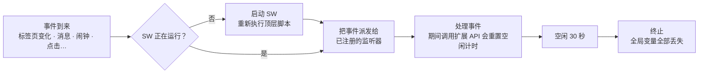
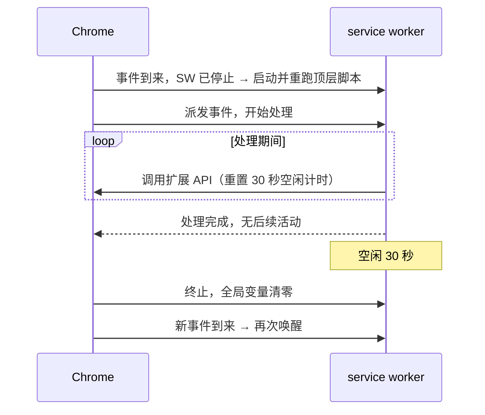

import { Meta } from '@storybook/addon-docs/blocks';

<Meta id="service-worker" title="核心机制/Service Worker" name="Docs" />

# Service Worker

[扩展架构](?path=/docs/extension-architecture--docs)一课给过定位：service worker 是 MV3 扩展的中央事件处理器——事件驱动、按需启停、没有 DOM。本课深入这个模型的三条推论：**监听器必须顶层同步注册**，否则唤醒后错过事件；**全局状态每次唤醒都归零**，状态必须放在 SW 之外；**需要真 DOM 的活要外包给 offscreen document**。读完本课，每次写后台代码前你会先问三个问题：这个监听器在顶层吗？这个状态放在哪？这个操作真的不需要 DOM 吗？

本课讲的是真实浏览器行为，无法在 Storybook 里复现；关键结论都配了可以在 `chrome://extensions` 里亲手核对的观察步骤，代码可直接复制进 `sw.js` 验证。

service worker 的全部行为都由下面这条循环解释——事件的到来方式决定它何时醒来，处理节奏决定它活多久：



写代码前值得记住的数字与字段：

| 事项 | 值 | 说明 |
| --- | --- | --- |
| 注册字段 | `"background": { "service_worker": "sw.js" }` | 单个 JS 文件；使用 ES module 再加 `"type": "module"` |
| 空闲终止 | 30 秒 | 收到事件、调用扩展 API 都会重置计时 |
| 单任务上限 | 5 分钟 | 单个事件处理或 API 调用超过即被终止，个别需要用户交互的 API 例外 |
| fetch 响应上限 | 30 秒 | 请求迟迟拿不到响应会被终止 |
| offscreen document | 同时 1 个 | 需声明 `offscreen` 权限，Chrome 109+ |
| `setTimeout` / `setInterval` | 终止即取消 | 跨终止的定时调度交给 chrome.alarms（[定时任务](?path=/docs/alarms--docs)） |
| 全局变量 | 终止即丢失 | 持久状态放 chrome.storage（[存储](?path=/docs/storage--docs)） |

## 注册后台

manifest 声明即注册：加载扩展时 Chrome 读取 `background` 字段，把 `service_worker` 指向的文件登记为后台脚本。没写这个字段，扩展就没有后台——manifest 里只有一个 `background` 键，扩展的全部后台逻辑都写在这一个文件里，需要拆分时用模块导入。

```json
{
  "background": {
    "service_worker": "sw.js",
    "type": "module"
  }
}
```

- `service_worker` 的值是相对扩展根目录的单个 JS 文件路径，不是 MV2 的数组。
- `"type": "module"` 只在使用 `import` 语句时需要；用 `importScripts()` 加载脚本则不用声明。动态 `import()` 不支持。
- 网页里注册 service worker 用的 `navigator.serviceWorker.register()` 在扩展里不适用，注册只经 manifest。
- service worker 必须是扩展包内的文件，不能指向远程代码（MV3 禁止远程托管代码）。

注册成功的直观标志：`chrome://extensions` 卡片上出现 **Service Worker** 链接和状态标注（Inactive / Active）。调试入口、断点与「检视期间不休眠」的边界见[调试扩展](?path=/docs/debugging--docs)。

## 事件驱动

service worker 里没有「启动后从上到下跑完」的主流程。顶层代码的首要职责是登记监听器；之后它就等着 Chrome 派发事件。事件来自两类来源：

- **扩展 API 事件**：`tabs.onUpdated`、`runtime.onMessage`、`alarms.onAlarm`、`action.onClicked` 等，覆盖标签页、消息、闹钟、点击、权限变化等浏览器活动。
- **标准 service worker 事件**：如 `fetch`（拦截扩展自身上下文发出的请求，例如 popup 里 fetch 的资源，URL 需在 `host_permissions` 内）、`message`。注意标准 `message` 事件与 `runtime.onMessage` 是互不相通的两套系统：`postMessage` 和 `sendMessage` 各走各的，没有特殊理由一律用扩展消息（[消息通信](?path=/docs/messaging--docs)）。

事件到来时，如果 SW 已停止，Chrome 会先启动它、从头执行顶层脚本，再把事件派发给监听器；正在运行则直接派发。这条唤醒路径解释了下一节最重要的一条规则。

### 顶层同步注册

监听器必须在脚本顶层同步注册——不能放在 `await` 之后、`setTimeout`、Promise 回调或其他异步路径里。

```js
// 反例：监听器在异步回调里注册。SW 被事件唤醒时，Chrome 立即派发事件，
// 此时回调还没执行、监听器尚未登记，这次事件就丢了。
chrome.storage.local.get('settings').then(() => {
  chrome.tabs.onUpdated.addListener((tabId, info) => {
    // 永远等不到第一个事件
  });
});
```

```js
// 正例：监听器在顶层同步注册；异步逻辑放进监听器内部去做。
chrome.tabs.onUpdated.addListener((tabId, info) => {
  chrome.storage.local.get('settings').then(({ settings }) => {
    // 用 settings 处理这次事件
  });
});
```

原因在于唤醒路径：Chrome 在脚本求值结束后立刻派发已排队的事件，只有求值期间已同步注册的监听器接得住。异步注册的监听器可能要等几秒、也可能永远等不到下一次派发——SW 不会为它留在场内。

亲手验证一遍：把某个监听器的注册包进 `setTimeout(() => { ... }, 3000)`，重新加载扩展，关掉它的 DevTools，等半分钟让 SW 休眠，然后开一个新标签页。这次事件的日志不会出现——唤醒后事件立即派发完毕，3 秒后监听器才注册上，错过的事件不会补发；SW 空闲 30 秒终止时那个 `setTimeout` 一并取消，下次唤醒重复同样的错过。把注册移回顶层，同样的操作立刻能看到日志。

### onInstalled 与 onStartup

两个在固定时机派发的特殊事件，同样遵守顶层注册；它们不是常驻信号，处理完照样空闲终止。

| 事件 | 派发时机 | 典型用途 |
| --- | --- | --- |
| `chrome.runtime.onInstalled` | 扩展首次安装、扩展更新、Chrome 更新时 | 一次性初始化：写入默认设置、注册 contextMenus |
| `chrome.runtime.onStartup` | 浏览器配置文件启动时 | 「每次开浏览器要做一遍」的事，如恢复轮询 |

```js
// sw.js —— 用 details.reason 区分安装来源，避免每次更新都重置用户设置
chrome.runtime.onInstalled.addListener((details) => {
  if (details.reason === 'install') {
    chrome.storage.local.set({ theme: 'system' });
  }
});
```

注意浏览器启动本身不会提前启动所有扩展的 SW——它只是派发 `onStartup` 这一事件；其余事件不来，SW 依旧沉睡。

## 生命周期

SW 的启动时机就是事件的到来时机：任何注册过监听器的事件（扩展事件、消息、闹钟）、扩展的安装与更新。没有「让它一直开着」的开关——存续完全由 Chrome 管理。

终止由三个数字决定：

- **空闲 30 秒**：没有待处理的事件、没有进行中的扩展 API 调用，计时到期即终止。收到事件、调用扩展 API 都会重置计时。
- **单任务 5 分钟**：单个事件处理或 API 调用持续超过 5 分钟，即使期间有局部活动也会被终止。例外是少数需要用户交互的 API（`desktopCapture.chooseDesktopMedia`、`identity.launchWebAuthFlow`、`permissions.request`、`management.uninstall`，Chrome 116 起不受此限）。
- **fetch 响应 30 秒**：一个 `fetch` 请求的响应超过 30 秒未到达，SW 会被终止。

「处理时间可能超过 30 秒」的任务，靠下面这些手段维持活跃（均为现行稳定版行为，括号内是各手段生效的 Chrome 版本）：

| 续命手段 | 版本 | 说明 |
| --- | --- | --- |
| 调用扩展 API | 110+ | 任意扩展 API 调用都重置空闲计时；长任务里定期调用一个轻量 API（如 `runtime.getPlatformInfo`）是官方迁移指南给出的模式 |
| 长连接端口发消息 | 114+ | `runtime.connect` 建立的端口上发送消息会保持活跃；仅打开端口不重置计时 |
| 原生消息主机 | 105+ | `runtime.connectNative()` 的活跃连接（见 [Native Messaging](?path=/docs/native-messaging--docs)） |
| WebSocket 收发消息 | 116+ | 活跃的 WebSocket 通信重置空闲计时 |
| offscreen document 来信 | 109+ | 来自 offscreen 文档的消息重置计时 |
| chrome.debugger 会话 | 118+ | 活跃的调试会话保持活跃（见 [DevTools 扩展](?path=/docs/devtools-extension--docs)） |

一次「踩着计时点续命」的长任务，时间线是这样的：



在 `chrome://extensions` 卡片上能直接观察这套节奏：触发一个它监听的事件（比如开新标签页），状态标注从 Inactive 变为 Active，静置半分钟后再看已回到 Inactive。注意在它的 DevTools 打开期间 SW 不会按正常节奏休眠，观察真实启停要先关掉它（见[调试扩展](?path=/docs/debugging--docs)）。

### 全局状态丢失

每次唤醒都是全新的全局作用域：顶层代码重新执行，上一次运行留下的所有全局变量不复存在。「SW 里存个变量记状态」在 MV3 里随时会失效。

```js
// 反例：全局计数器。SW 每终止一次就清零，两个事件之间可能丢掉一大段数据。
let seen = 0;
chrome.tabs.onCreated.addListener(() => {
  seen += 1; // 休眠一次就归零
});
```

```js
// 正例：状态放 storage，每个事件处理函数都按冷启动来写。
chrome.tabs.onCreated.addListener(async () => {
  const { seen = 0 } = await chrome.storage.local.get('seen');
  await chrome.storage.local.set({ seen: seen + 1 });
});
```

状态该放哪，按「需要活多久」选：

| 状态需要活多久 | 放哪 |
| --- | --- |
| 浏览器运行期间（重启可丢） | `chrome.storage.session`：内存级，SW 重启不清零 |
| 永久保留 | `chrome.storage.local` / `sync` |
| 大体积、结构化数据 | IndexedDB |
| 只在两个上下文之间传一次 | 随消息或事件载荷直接携带 |

`chrome.storage` 各分区的读写与监听由[存储](?path=/docs/storage--docs)承载，本课只立规矩：**跨事件的状态不进全局变量**。

## 无 DOM 环境

service worker 不是页面：没有渲染环境，页面对象与依赖页面的 Web API 一律不存在。

| SW 里不存在 | 替代 |
| --- | --- |
| `window` / `document` | 全局对象用 `self`；操作浏览器窗口用 `chrome.windows`（名字像，是完全不同的东西）；需要真 DOM 用 offscreen document |
| `localStorage` / `sessionStorage` | `chrome.storage` |
| `XMLHttpRequest` | `fetch()` |
| `alert` / `prompt` / `confirm` | 页面 UI 专属；后台提示用 `chrome.notifications`（[通知](?path=/docs/notifications--docs)） |

最常见的误踩是名字巧合：`chrome.windows` 是管理浏览器窗口的扩展 API，与 SW 里不存在的 `window` 对象无关；而 `window is not defined` 是 SW 环境的正常报错，不是 bug。

## offscreen document

SW 需要真 DOM 时——用 `DOMParser` 解析 HTML、播放音频、读写剪贴板、canvas 绘制导出——可以创建一个隐藏的 HTML 文档去干这些活：它有完整 DOM，运行在扩展上下文里，生命周期独立于 SW（SW 终止后它仍在）。它与外界的唯一扩展 API 是 `runtime` 消息，所以协作方式是固定的：SW 发活过去，offscreen 干完用消息把结果带回来。

使用约束：

- manifest 的 `permissions` 里加 `"offscreen"`（Chrome 109+）。
- 每个扩展同一时间只能打开**一个** offscreen document——创建前先查再建。
- `reasons` 声明用途（常用：`AUDIO_PLAYBACK` 播放音频、`DOM_PARSER` 解析 HTML、`DOM_SCRAPING` 提取页面内容、`CLIPBOARD` 剪贴板、`BLOBS` 处理 Blob、`USER_MEDIA` / `DISPLAY_MEDIA` 采集摄像头或屏幕），完整清单见参考页；`justification` 是给人看的说明字符串。
- 寿命由自己管理，用完调 `closeDocument()` 关闭；例外是 `AUDIO_PLAYBACK` 原因创建的文档，无音频播放 30 秒后自动关闭。

```js
// sw.js —— 创建入口：先查后建。并发的两个事件可能同时走到这里，
// 用一个进行中的 Promise 当锁，避免重复创建触发单例报错。
let creating;

async function ensureOffscreenDocument() {
  const contexts = await chrome.runtime.getContexts({
    contextTypes: ['OFFSCREEN_DOCUMENT'], // Chrome 116+；Chrome 150+ 也可用 chrome.offscreen.hasDocument()
  });
  if (contexts.length > 0) return; // 已存在，直接复用

  if (creating) {
    await creating;
  } else {
    creating = chrome.offscreen.createDocument({
      url: 'offscreen.html',
      reasons: ['DOM_PARSER'],
      justification: '解析后台抓取到的 HTML',
    });
    await creating;
    creating = null;
  }
}
```

```js
// sw.js —— 把 HTML 交给 offscreen 解析，用消息拿回结果
const { title } = await chrome.runtime.sendMessage({
  type: 'parse-title',
  html,
});
```

```html
<!-- offscreen.html —— 隐藏文档：有完整 DOM，只有 runtime 这一个扩展 API -->
<!DOCTYPE html>
<script src="offscreen.js"></script>
```

```js
// offscreen.js —— 在真 DOM 环境里干完活，把结果发回去
chrome.runtime.onMessage.addListener((message, _sender, sendResponse) => {
  if (message.type !== 'parse-title') return;
  const doc = new DOMParser().parseFromString(message.html, 'text/html');
  sendResponse({ title: doc.title });
});
```

```js
// sw.js —— 活干完就关，不留常驻成本
await chrome.offscreen.closeDocument();
```

验证这套流程需要真实扩展环境：把上面四段放进「加载已解压的扩展程序」的目录（`chrome.runtime.getContexts` 属于 `runtime` API，无需额外权限，但 `offscreen` 权限必须声明），在 SW 的 DevTools Console 里调用 `ensureOffscreenDocument()` 再发消息，能拿到解析结果；漏掉 `offscreen` 权限或重复创建时，报错会直接出现在错误页（错误页入口见[调试扩展](?path=/docs/debugging--docs)）。

## 与 MV2 后台页的差异

MV2 的后台是一个隐藏页面（background page），常驻或半常驻；MV3 用 service worker 取代了它。从 MV2 教程或旧代码迁移时，下面这些假设要逐条翻转：

| MV2 后台页 | MV3 service worker |
| --- | --- |
| `"background": { "scripts": [...], "persistent": true / false }` | `"background": { "service_worker": "sw.js" }`，`persistent` 字段废除 |
| 是隐藏页面：有 DOM、`window`、localStorage | 全部不存在，见「无 DOM 环境」 |
| `persistent: true` 常驻内存，`persistent: false` 空闲卸载 | 一律按需启停、事件唤醒 |
| 全局变量在常驻页里可跨事件保留 | 全局变量随时丢失，状态进 storage |
| `XMLHttpRequest` 可用 | 只有 `fetch` |
| `setTimeout` / `setInterval` 可长期依赖 | 终止即取消，调度用 chrome.alarms |

旧文档里的 "background script" / "background page" 指的就是它；MV3 语境下这两个词基本都指 service worker，读资料时按本表核对能力假设即可。

## 最佳实践

- **每个事件处理函数按冷启动写。** 需要的状态先从 `chrome.storage` 读，不假设上次运行留下任何东西——这是 SW 代码与普通脚本最大的写法差别，比任何单点技巧都重要。
- **续命是例外，不是常态。** 能推迟的工作交给 chrome.alarms 定时唤醒（[定时任务](?path=/docs/alarms--docs)）；确需当场完成的长任务才用「定期轻量 API 调用」或活跃连接维持。不写无限期保活——官方明确该做法仅限企业/教育受管设备场景，普通扩展会被处置。
- **offscreen 用完即关。** 长驻的 offscreen document 就是变相的常驻后台；只有音频播放这类连续任务让它自管寿命。
- **用事件过滤器缩小监听范围。** 能用 `webNavigation.onCompleted` 加 `urlMatches` 过滤的，别监听全量的 `tabs.onUpdated` 再自己判断，减少无谓的唤醒与处理。

## 常见问题

- 事件「偶尔」收不到，尤其是扩展刚被唤醒后的第一个事件
  把监听器的注册移到脚本顶层，保证同步执行，不要放在 `await`、`setTimeout` 或 Promise 回调里。
  判断依据：唤醒后 Chrome 立即派发事件，只有求值期间注册好的监听器接得住。

- 全局变量记的状态过一会儿就丢，或读到被清零的旧值
  状态移入 `chrome.storage`（运行期内存态用 `storage.session`），把每个处理函数当第一次运行来写。
  判断依据：SW 空闲 30 秒终止，下次唤醒是全新的全局作用域，顶层代码重新执行。

- 报 `window is not defined` 或 `document is not defined`
  SW 环境没有页面对象：全局对象用 `self`，浏览器窗口用 `chrome.windows`，真需要 DOM 的活交给 offscreen document。

- `setInterval` 跑几次就停了
  SW 终止时定时器一并取消。跨终止的调度改用 `chrome.alarms`（[定时任务](?path=/docs/alarms--docs)）；需要连续处理的活放进 offscreen document 或长连接会话里。

- 创建 offscreen document 报 `Only a single offscreen document may be created`
  创建前先用 `chrome.runtime.getContexts({ contextTypes: ['OFFSCREEN_DOCUMENT'] })` 检查，已存在就复用；并发的创建路径加 Promise 锁，见本文「offscreen document」一节的创建入口。

## 总结回顾

摘要：

service worker 通过 manifest 的 `background.service_worker` 注册为单个后台文件，是 MV3 扩展的中央事件处理器。它没有主流程，顶层代码的首要职责是同步登记监听器；事件到来时 Chrome 启动（或复用）它、重跑顶层、派发事件。终止由三个数字决定：空闲 30 秒、单任务 5 分钟、fetch 响应 30 秒，期间调用扩展 API、端口消息、WebSocket 等可以重置计时。每次终止都清空全局作用域，因此监听器必须顶层同步注册、跨事件状态必须放 `chrome.storage` 或随事件载荷携带。SW 环境没有 DOM、`window` 和 Web Storage，需要真 DOM 的工作外包给至多一个的 offscreen document，经 `runtime` 消息协作、用完即关。与 MV2 常驻后台页相比，「按需启停」取代了「persistent 开关」，全局变量、定时器和 XHR 的旧假设全部失效。

一句话：

> service worker 是被事件随时唤醒、随时终止的后台——监听器顶层同步注册，状态放到 SW 之外，需要 DOM 外包给 offscreen document。

知识要点：

- manifest 里怎样注册后台？`"type": "module"` 什么时候需要？
- 为什么监听器必须顶层同步注册？异步注册会丢掉什么？
- SW 在什么条件下被终止？哪些行为可以重置空闲计时？
- 全局变量为什么不可靠？状态按「需要活多久」分别放在哪？
- SW 里哪些 Web API 不存在？各用什么替代？
- offscreen document 解决什么问题？有哪些使用约束？
- MV2 后台页的哪些假设在 MV3 里失效？

## 参考资料

- [About extension service workers](https://developer.chrome.com/docs/extensions/develop/concepts/service-workers)：service worker 的定位、与网页 service worker 的区别。
- [Extension service worker basics](https://developer.chrome.com/docs/extensions/develop/concepts/service-workers/basics)：manifest 注册、`type: "module"`、脚本导入方式。
- [Extension service worker lifecycle](https://developer.chrome.com/docs/extensions/develop/concepts/service-workers/lifecycle)：30 秒 / 5 分钟 / fetch 30 秒三个终止条件与各版本续命变化。
- [Events in service workers](https://developer.chrome.com/docs/extensions/develop/concepts/service-workers/events)：顶层同步注册规则、事件来源、`fetch` 与 `message` 事件。
- [chrome.offscreen API](https://developer.chrome.com/docs/extensions/reference/api/offscreen)：offscreen 权限、createDocument 参数、reasons 枚举、单例限制与文档寿命。
- [Migrate to service workers](https://developer.chrome.com/docs/extensions/develop/migrate/to-service-workers)：MV2 后台页迁移对照、保活模式与政策边界。
