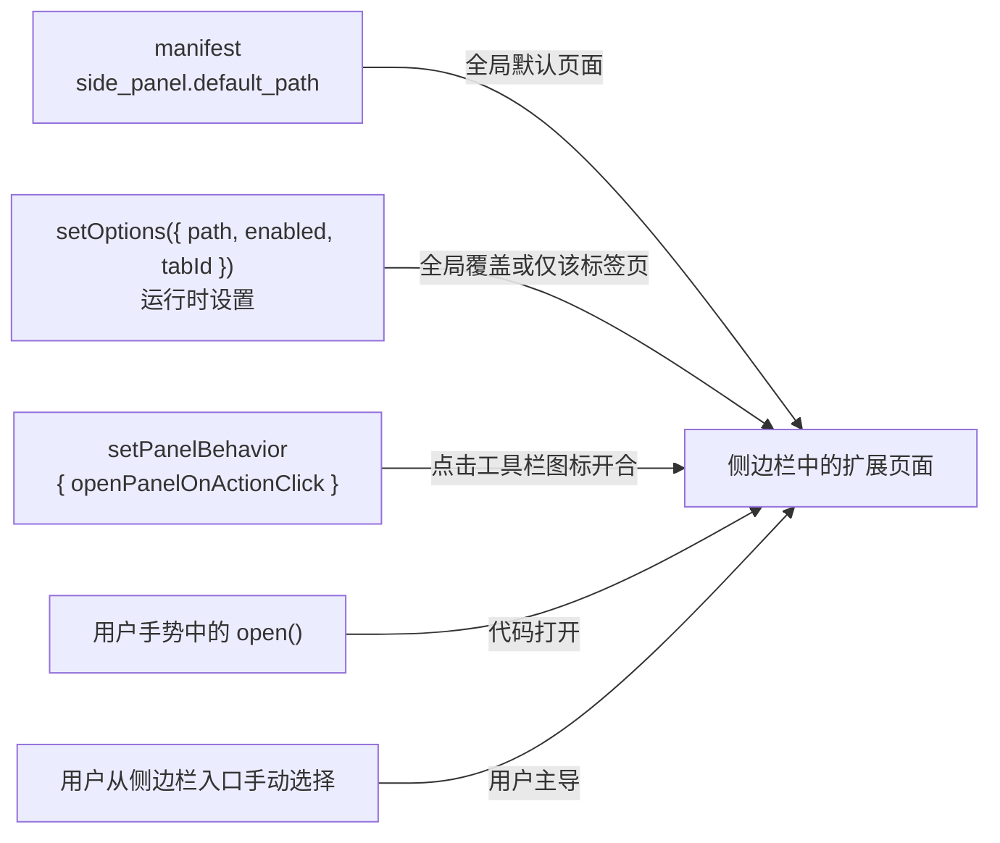

import { Canvas, Controls, Meta } from '@storybook/addon-docs/blocks';
import * as SidePanel from './side-panel.stories';

<Meta of={SidePanel} name="Docs" />

# 侧边栏

侧边栏是浏览器窗口侧边的一块常驻扩展界面：用户打开一次就一直显示，直到用户关闭它，或切到没有启用面板的标签页。它由 `chrome.sidePanel` API（Chrome 114+，Manifest V3）驱动。扩展能决定的是三件事：面板页面是什么、哪些标签页可用、点击工具栏图标是否开合；真正打开与关闭的控制权在用户手里。读完本课，你能回答四个问题：面板页面从哪里声明、打开行为由谁控制、怎么只在某些站点显示面板、该选侧边栏还是 popup。

面板内容来自 manifest 默认值或运行时 `setOptions`，打开则有四条路径——其中三条是扩展能施加影响的方式：



`chrome.sidePanel` 成员一览（除事件与查询外，方法都返回 Promise）：

| 成员 | 作用 | 关键输入 | 默认值与备注 |
| --- | --- | --- | --- |
| manifest `side_panel` | 声明全局默认面板 | `default_path` | Chrome 114+；只此一个字段 |
| `"sidePanel"` 权限 | 使用 `chrome.sidePanel` | 加进 `permissions` | 缺权限时所有 `set*` 调用失败 |
| `setOptions` | 设置面板页面与启用状态 | `path`、`enabled`、`tabId` | `enabled` 默认 `true`；不带 `tabId` 设全局默认 |
| `getOptions` | 查询当前面板设置 | 可选 `tabId` | 不带 `tabId` 返回全局设置 |
| `setPanelBehavior` | 点击图标是否开合面板 | `openPanelOnActionClick` | 默认 `false`；upsert 写入 |
| `getPanelBehavior` | 查询图标点击行为 | —— | |
| `open` | 代码打开面板 | `tabId` 或 `windowId` | Chrome 116+；只能在用户手势中调用 |
| `close` | 关闭面板 | `tabId` 或 `windowId` | Chrome 141+；已关闭则为 no-op |
| `getLayout` | 查询面板在窗口哪一侧 | —— | Chrome 140+；`side` 为 `left` 或 `right` |
| `onOpened` / `onClosed` | 面板开合事件 | `path`、`windowId`、可选 `tabId` | Chrome 141+ / 142+；注册在 service worker |

## 快速上手

用本课目录下的 `extension/` 走最小闭环（三个文件，可直接加载）。做三件事：manifest 声明全局默认面板、安装时打开图标开合、把面板写成一个普通页面。

**第一步：manifest.json 声明 `side_panel`，并申请 `sidePanel` 权限。**

```json
{
  "manifest_version": 3,
  "name": "side-panel-demo",
  "version": "1.0",
  "permissions": [
    "sidePanel"
  ],
  "side_panel": {
    "default_path": "panel.html"
  },
  "background": {
    "service_worker": "sw.js"
  }
}
```

`default_path` 是包内相对路径，指向面板 HTML。权限是分开的：`side_panel` 声明面板页面，`"sidePanel"` 权限授权你在运行时修改它；只写前者不写后者，`chrome.sidePanel` 的所有方法都会失败（见《常见问题》）。

**第二步：新建 `sw.js`，安装时打开图标开合。**

```js
// 本示例演示：manifest 默认值 + setPanelBehavior 控制点击工具栏图标的行为。
// upsert 语义：只写给出的字段，重复执行同样安全，因此放 onInstalled 即可。
chrome.runtime.onInstalled.addListener(() => {
  chrome.sidePanel
    .setPanelBehavior({ openPanelOnActionClick: true })
    .catch((error) => console.error('setPanelBehavior 失败', error));
});
```

**第三步：写 `panel.html` 与 `panel.js`，面板就是普通扩展页面。**

```html
<!DOCTYPE html>
<html lang="zh-CN">
  <head>
    <meta charset="UTF-8" />
    <style>
      body { margin: 0; padding: 16px; font: 14px/1.6 system-ui, sans-serif; }
      h1 { margin: 0 0 8px; font-size: 15px; }
      p { margin: 0 0 12px; color: #555; word-break: break-all; }
      button { padding: 6px 12px; font: inherit; cursor: pointer; }
    </style>
  </head>
  <body>
    <h1>侧边栏面板</h1>
    <p id="state">正在读取当前面板设置……</p>
    <button id="close">关闭面板</button>
    <script src="panel.js"></script>
  </body>
</html>
```

```js
// 面板页面可以直接调用 chrome.sidePanel 的查询与控制方法。
const state = document.querySelector('#state');

chrome.sidePanel
  .getOptions()
  .then((options) => {
    state.textContent = `当前面板：${options.path}（enabled: ${options.enabled ?? true}）`;
  })
  .catch((error) => {
    state.textContent = `读取失败：${error.message}`;
  });

// close() 需要 Chrome 141+，且至少要带 tabId 或 windowId 之一；
// 站点级（tab 级）面板要传对应的 tabId。
document.querySelector('#close').addEventListener('click', async () => {
  const win = await chrome.windows.getCurrent();
  await chrome.sidePanel.close({ windowId: win.id });
});
```

**加载与观察：** 到 `chrome://extensions` 点「加载已解压的扩展程序」选本课的 `extension/`（或重载已加载的副本）：

| 操作 | 可观察结果 |
| --- | --- |
| 加载扩展 | 工具栏出现图标（未配 `default_icon`，显示扩展名首字母） |
| 点浏览器右上角侧边栏按钮，在下拉里选本扩展 | 窗口右侧出现 `panel.html`，地址是 `chrome-extension://<id>/panel.html`；页面显示当前路径与 enabled |
| 点击工具栏图标 | 侧边栏开合切换 |
| 注释掉 sw.js 的 `setPanelBehavior` 行并重载 | 再点图标不再控制侧边栏，点击回落为 action 默认行为 |
| 点面板里的「关闭面板」 | 面板立即关闭（需 Chrome 141+） |

## 面板页面：从哪来，是什么

侧边栏内容是一个扩展页面（extension page），来源只有两处：manifest 的 `side_panel.default_path` 声明全局默认，运行时 `chrome.sidePanel.setOptions` 的 `path` 设置覆盖。不带 `tabId` 的 `setOptions` 改写的是全局默认——对没有自定义设置的标签页生效；某个标签页做过 `tabId` 级设置的，继续用它自己的值。

### side_panel.default_path：全局默认面板

```json
{
  "side_panel": {
    "default_path": "panel.html"
  }
}
```

- 字段是包内 HTML 的相对路径；Chrome 114+ 起可用，文档标注 Manifest V3。
- 写清 `default_path` 是让扩展出现在每个标签页侧边栏入口的最小条件；manifest 不写、又从未调用 `setOptions` 的扩展，侧边栏下拉里看不到它。
- 只想在部分站点出现的扩展可以不写 `default_path`，改用 `setOptions({ tabId, ... })` 按标签页开启（见《站点级面板》）。

### 侧边栏页面就是普通扩展页面

- 地址形如 `chrome-extension://<id>/panel.html`，与 popup、options 页面同属扩展上下文：可以引用本地 CSS/JS、调用 `chrome.*` API（发消息、读存储等，用法见[消息通信](?path=/docs/messaging--docs)与[存储](?path=/docs/storage--docs)）。
- 同样受扩展 CSP 约束：脚本必须放独立文件，`<script>` 内联不执行；框架只影响怎么写这个页面，不影响侧边栏机制。
- 实例化的粒度是「全局」与「每个标签页」：全局面板一份，带 `tabId` 的面板一份；同一路径的 tab 级面板与全局面板也是两个独立实例。多个标签页同时显示面板时各有各的实例，别假设面板内状态全局唯一。
- 全局面板一旦打开就持续显示，不像 popup 那样点外部即关，因此可以承担有状态的长任务；站点级面板另有一套启用与关闭行为（见《站点级面板》）。需要与 popup、service worker 共享的状态仍应放 `chrome.storage`。

## 打开行为：图标点击与代码打开

打开方式共四条：用户从侧边栏入口手动选择（完全由用户主导，扩展无法阻止）、点击工具栏图标、代码调用 `open()`，以及最根本的——这个标签页有没有可用面板（由 `setOptions` 的 `enabled` 决定）。扩展能主动影响的是后三条。

### setPanelBehavior：点击图标开合

```js
chrome.sidePanel.setPanelBehavior({ openPanelOnActionClick: true });
```

- `openPanelOnActionClick` 默认 `false`：不设置时点击图标就是 action 的默认行为（有 popup 开 popup，没有则派发 `onClicked`，见[Action 与弹窗](?path=/docs/action-popup--docs)）。
- 设为 `true` 后，点击工具栏图标在侧边栏里显示或隐藏本扩展的面板（toggle）。
- upsert 语义：只写给出的字段，重复执行安全；放在 `onInstalled` 里写一次，对所有标签页生效。图标被固定后同样遵循这一行为开关。
- 设成 `false` 不会移除面板本身，只是把图标点击还给 action 的默认行为。

### open：只能在用户手势里

```js
// sw.js —— contextMenus.onClicked 的回调就是用户手势
chrome.contextMenus.onClicked.addListener(async (info, tab) => {
  // windowId 打开该窗口的全局面板；至少带 tabId 或 windowId 之一
  await chrome.sidePanel.open({ windowId: tab.windowId });
});
```

- Chrome 116+ 提供；文档规定 `open()`「只能在响应用户操作时调用」。合法的手势来源包括：action 点击、键盘快捷键（`commands`）、右键菜单（`contextMenus`）、以及扩展页面或 content script 上由用户触发的交互。
- `OpenOptions` 至少要带 `windowId` 或 `tabId` 之一，否则调用失败。`windowId` 打开该窗口的全局面板；`tabId` 只在对应标签页已设 tab 级面板时有效。
- 放在定时器、消息回调、service worker 启动逻辑里调用都会被拒绝——这些不是用户手势。错误在 `.catch()` 或 `lastError` 里能看到。

把下面这个演算调到不同输入，观察图标点击与 `open()` 两条路径的结果如何合成：

<Canvas of={SidePanel.OpenBehavior} />
<Controls of={SidePanel.OpenBehavior} />

| 读者操作 | 可观察证据 |
| --- | --- |
| 打开「openPanelOnActionClick」 | 点击工具栏图标的结果在「切换侧边栏显示」与「action 默认行为」之间切换 |
| 把「open() 调用位置」改成 setInterval 定时回调 | `open()` 一步显示「失败：只能在用户操作中调用」，面板不因它打开 |
| 把「open() 目标参数」改成「都不传」 | `open()` 一步显示「失败：需要 windowId 或 tabId」 |
| 同时关闭两项生效条件 | 两次操作都不打开面板，浏览器示意里的侧边栏保持关闭 |

### close、onOpened 与 onClosed、getLayout

较新版本补齐了关闭、事件与位置查询，按版本取用：

- `close(options)`（Chrome 141+）：关闭面板，已关闭时是 no-op；至少要带 `tabId` 或 `windowId`。只开着全局面板却只传 `tabId`，Promise 会 reject（Chrome 145 起如此，此前回退为关闭全局面板）。
- `onOpened`（Chrome 141+）与 `onClosed`（Chrome 142+）：注册在 service worker，回调参数带 `path`、`windowId`，tab 级面板另带 `tabId`。适合在面板打开时同步数据、关闭时清理。
- `getLayout()`（Chrome 140+）：返回 `{ side }`，取值为 `left` 或 `right`，反映用户把面板拖到了窗口哪一侧；查询即可，位置由用户决定。

## 站点级面板

`setOptions` 带 `tabId` 时，设置只对该标签页生效——这就是「只在某些站点出现侧边栏」的机制。典型写法是 service worker 监听标签页更新，按 URL 决定启用。

### setOptions：enabled、path 与 tabId

```js
// sw.js —— tab.url 需要 "tabs" 权限或匹配的 host 权限
const TARGET = 'https://www.google.com';

chrome.tabs.onUpdated.addListener(async (tabId, changeInfo, tab) => {
  if (tab.url?.startsWith(TARGET)) {
    await chrome.sidePanel.setOptions({
      tabId,
      path: 'panel.html',
      enabled: true,
    });
  } else {
    await chrome.sidePanel.setOptions({ tabId, enabled: false });
  }
});
```

三个字段决定一次设置的落点：

| 字段 | 含义 | 要点 |
| --- | --- | --- |
| `path` | 面板 HTML（包内本地资源） | 缺省沿用已生效的路径 |
| `enabled` | 该标签页是否可用面板 | 可选，默认 `true` |
| `tabId` | 设置的作用范围 | 带 = 仅该标签页；不带 = 没有自定义设置的标签页的默认值 |

换面板页面是同一机制的常见用法：在 `tabs.onActivated` 里用 `getOptions({ tabId })` 读当前 `path`，再决定要不要换成主页面。

### 站点级面板的行为边界

- 临时切到未启用面板的标签页：面板隐藏，切回来恢复。
- 在已启用站点内导航到未启用的站点：面板关闭，且扩展从侧边栏下拉里消失。
- tab 级状态按 `tabId` 维护：新标签页、页面导航都会让监听器重新跑到，正是它保证每个新 `tabId`、每次 URL 变化后面板状态正确的原因。
- 读 `tab.url` 本身需要 `"tabs"` 权限或匹配的 host 权限（权限取舍见[Manifest 与权限](?path=/docs/manifest-permissions--docs)、[标签页与窗口](?path=/docs/tabs-windows--docs)）；没有权限时 `tab.url` 为 `undefined`，上面的判断会静默落入 `else` 分支，面板一个也不启用。

下面这个演算演示同一条监听器在两个站点、两种权限状态下的执行结果：

<Canvas of={SidePanel.SitePanel} />
<Controls of={SidePanel.SitePanel} />

| 读者操作 | 可观察证据 |
| --- | --- |
| 把「标签页 URL」从 google.com 换成 example.com | `setOptions` 调用从 `enabled: true` 变为 `enabled: false`，侧边栏中的面板随之隐藏 |
| 关闭「已声明 tabs/host 权限」 | 调用栏显示 `tab.url` 为 `undefined`、落入 else 分支——面板看似「没配好」，实际是权限缺失 |
| 两项都保持启用 | 中间浏览器示意显示面板展开，右栏三条行为边界（切走隐藏、导航离开即关闭、按 tabId 维护） |

## 与 popup 的取舍

侧边栏和 popup 都挂 toolbar 图标，差别在界面生命周期与交互定位：

| 维度 | popup | 侧边栏 |
| --- | --- | --- |
| 生命周期 | 点开才存在，关闭即销毁 | 打开后持续，直到用户关闭或切走 |
| 入口 | 点击工具栏图标 | 侧边栏入口、图标（需 `openPanelOnActionClick`）、手势中的 `open()` |
| 交互定位 | 一次点击完成的轻量动作或少量配置 | 需要停留、滚动、反复对照的界面 |
| 与网页的关系 | 点外部即关，不常驻 | 常驻占宽，可对照页面持续显示 |
| 状态 | 关闭即丢，靠 storage / service worker 延续 | 页面活着，可放页面内存；跨上下文共享仍建议 storage |

选择规则很直接：一个入口做一件事的扩展用 popup（见[Action 与弹窗](?path=/docs/action-popup--docs)）；需要常驻详单、材料列表、对照当前页面的信息面板时用侧边栏。两者可以在同一扩展里共存——popup 管快捷操作，侧边栏管需要停留的界面。

## 最佳实践

- **按界面停留时长选形态。** 一次性操作用 popup；需要用户长时间停留的界面用侧边栏。不要因为「想要大一点的弹窗」而选侧边栏——它常驻、占宽，用户对它的预期是陪伴工具。
- **图标点击行为写一次就够。** `setPanelBehavior` 在 `onInstalled` 里调用即可，upsert 语义重复执行安全；它不需要 service worker 一直活着。
- **站点级面板靠事件维护，别在启动时一次性设置。** 在 `tabs.onUpdated` 里按当前 URL 设置 `tabId` 级选项；扩展重载或新标签页出现时事件会重新覆盖到新 `tabId`。
- **`open()` 只放进真实的手势回调。** action 点击、`commands`、`contextMenus`、扩展页面内的用户交互都可以；定时任务、消息回调、`onInstalled` 都不行。
- **跨上下文状态放 `chrome.storage`。** 侧边栏页面虽然常驻，但 popup 与 service worker 要读同一份数据时仍应走存储（见[存储](?path=/docs/storage--docs)）；需要「面板一打开就刷新」时用 `onOpened` 触发同步。

## 常见问题

- manifest 写好了 `side_panel.default_path`，重载扩展后侧边栏入口里却看不到本扩展
  检查键名是 `side_panel`（带下划线）、`default_path` 指向的 HTML 确实在扩展包里，然后到 `chrome://extensions` 点「重新加载」。
  判断依据：侧边栏下拉只列出当前标签页有可用面板的扩展；路径写错等于没有全局默认。
- 调用 `chrome.sidePanel.setPanelBehavior` 或 `setOptions` 失败
  在 manifest 的 `permissions` 里补上 `"sidePanel"`，重载扩展。
  判断依据：`chrome.sidePanel` 的所有方法都要求该权限，缺少时调用以错误结束，Promise reject 或 `lastError` 里有说明。
- `chrome.sidePanel.open()` 调用失败，提示只能在用户操作时调用
  把调用移进真正的用户手势回调——action 点击、`commands` 快捷键、`contextMenus` 菜单点击，或扩展页面 / content script 上由用户触发的处理函数。
  判断依据：文档规定 `open()` may only be called in response to a user action；`setInterval`、消息回调、service worker 启动逻辑都不是用户手势。
- 站点级面板在某个站点明明设置过，页面一跳转就消失
  确认监听器挂在 `tabs.onUpdated`（或 `onActivated`）上，并对每个新 `tabId` 重新 `setOptions`；同时确认有 `"tabs"` 或匹配的 host 权限，否则 `tab.url` 读不到。
  判断依据：面板启用状态按标签页维护，导航到未启用站点会关闭面板并把扩展移出侧边栏下拉；没有权限时 URL 判断静默失败。
- 面板页面里内联 `<script>` 的内容不执行
  把脚本改写为独立 `.js` 文件并用 `<script src>` 引入。
  判断依据：面板与 popup、options 一样是扩展上下文，受扩展 CSP 约束，禁止内联脚本；控制台的 CSP 报错会指出这一行。

## 总结回顾

摘要：

侧边栏是浏览器窗口侧边的常驻扩展页面。manifest 的 `side_panel.default_path` 声明全局默认面板，`chrome.sidePanel` 在运行时修改：`setOptions` 用 `path` 与 `enabled` 设页面和启用状态，带 `tabId` 时只对单个标签页生效，构成站点级面板，其状态按 `tabId` 维护，新标签页与新 URL 都靠监听标签页事件重新判定；`setPanelBehavior({ openPanelOnActionClick: true })` 让点击工具栏图标开合面板；`open()` 能在用户手势里代码打开，但至少要带 `windowId` 或 `tabId`。面板页面本身是普通扩展页面，受 CSP 约束。与 popup 的分界在界面生命周期：一次性操作用 popup，需要停留的界面用侧边栏，两者可共存。

一句话：

> 侧边栏的控制权在用户手里：扩展决定的是面板页面、可用标签页与图标点击行为，真正的打开与关闭由用户和用户手势完成。

知识要点：

- 侧边栏的页面从哪两处来？不带 `tabId` 的 `setOptions` 改变什么？
- `openPanelOnActionClick` 默认是什么？设为 `true` 后点击图标会发生什么？
- `open()` 的两个硬性要求是什么？哪些调用位置会失败？
- `setOptions({ tabId })` 怎样实现站点级面板？切走、导航离开、重载后面板各是什么行为？
- 判断该用侧边栏还是 popup 的依据是什么？
- 为什么站点级面板必须监听标签页事件，而不能在 service worker 启动时一次性设置？

## 参考资料

- [chrome.sidePanel API 参考](https://developer.chrome.com/docs/extensions/reference/api/sidePanel)
- [扩展 UI 组件（侧板一节）](https://developer.chrome.com/docs/extensions/develop/ui)
- [manifest 字段参考](https://developer.chrome.com/docs/extensions/reference/manifest)
