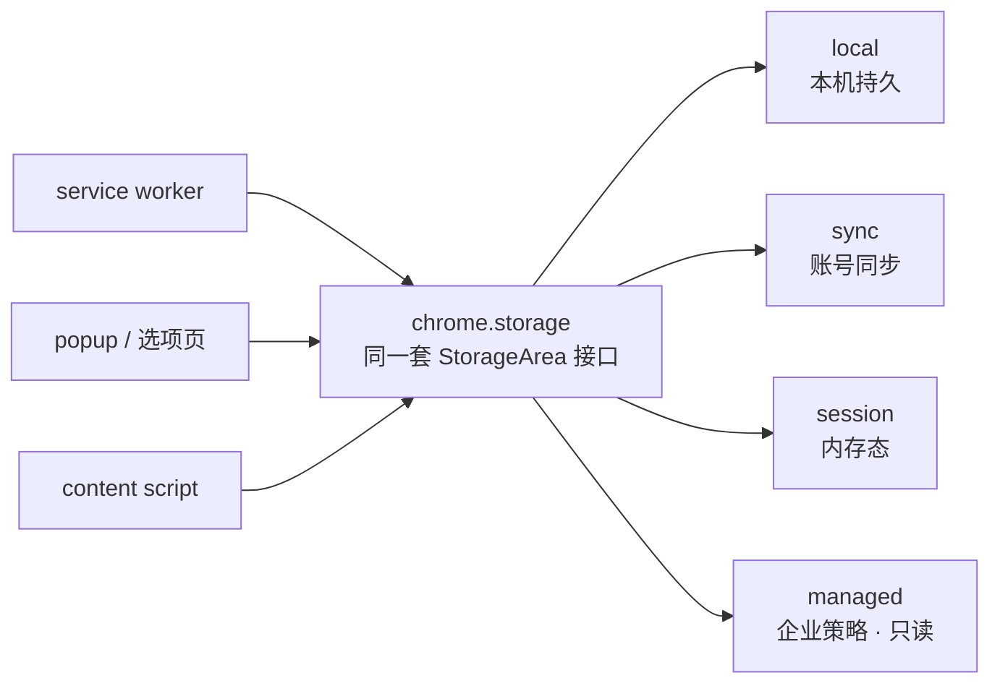

import { Canvas, Controls, Meta } from '@storybook/addon-docs/blocks';
import * as StorageStories from './storage.stories';

<Meta of={StorageStories} name="Docs" />

# 存储

[Service Worker](?path=/docs/service-worker--docs)一课立了规矩：全局状态随 SW 终止随时清零，跨事件的状态必须放在 SW 之外——这个「之外」的主要落点就是 `chrome.storage`。它是扩展各上下文共享的异步键值存储：service worker、popup、选项页、content script 读写同一份数据，一次写入通过 `onChanged` 通知所有上下文。读完本课，你应当能回答四个问题：状态放哪个分区（`local` / `sync` / `session`）、怎么读写、一处改动其他上下文怎么知道、`sync` 为什么会写失败。



四个分区共享同一套 StorageArea 接口，差别只在寿命、配额和对 content script 的默认可见性。使用前置条件只有一个：manifest 声明 `"storage"` 权限。

| 分区 | 存活范围 | 配额 | content script 默认 | 典型用途 |
| --- | --- | --- | --- | --- |
| `storage.local` | 本机持久，卸载扩展才清 | 10 MB（`unlimitedStorage` 可解除） | 可读写 | 本机状态、缓存 |
| `storage.sync` | 落盘持久，并随 Chrome 账号同步 | 总 100 KB · 8 KB/项 · 512 项 · 120 次写/分 · 1800 次写/时 | 可读写 | 跨设备用户设置 |
| `storage.session` | 内存态：SW 重启不清零，扩展重载或浏览器重启时清空 | 10 MB | 默认不可见（`setAccessLevel` 开放） | 运行期状态、令牌 |
| `storage.managed` | 随企业策略下发 | — | 可读 | 企业预置配置 |

第四个分区 `storage.managed` 由企业管理员通过策略配置，扩展只能读、写入直接报错，正常开发不碰，本章其余内容围绕前三个。另外，官方参考页正逐步把示例改用标准化的 `browser.*` 命名；本手册代码沿用 `chrome.*`，当前版本中二者等价。

## 快速上手

在 1.1 的最小扩展上走通「写入 → 面板核对 → 变更监听」的最小闭环。

1. `manifest.json` 的 `permissions` 里加 `"storage"`。
2. `sw.js` 顶层写默认值并监听变更：

```js
// sw.js —— 安装时写默认值；此后任何上下文的改动都会在这里收到通知
chrome.runtime.onInstalled.addListener(() => {
  chrome.storage.local.set({ theme: 'system', count: 0 });
});

chrome.storage.onChanged.addListener((changes, areaName) => {
  console.log(`[${areaName}]`, changes);
});
```

3. 重载扩展，打开 service worker 的 DevTools 控制台：`onInstalled` 的 `set` 写了两个键，但日志只有一条——`[local] {theme: {…}, count: {…}}`。一次 `set` 就是一次 `onChanged`，两个键合并在同一个 `changes` 里。
4. 就在已打开的 SW DevTools 里切到 **Application → Storage → Extension storage → Local**：能看到刚写入的两个键，也可以直接在面板里编辑。改一个值，SW 控制台立刻打出新的 `onChanged` 日志——面板编辑就是一次 storage 写入，注册过的监听器照常收到。

这套操作里有两个常驻工具：DevTools 面板负责看数据，`onChanged` 负责听变化，后面的主题小节都建立在它们之上。

## 分区与配额

三个分区是同一个接口的三种寿命：读写代码完全一致，选择时只问三个问题——数据要活多久、要不要跨设备、有多大。开场参考表给出结论，下面的存活地图把「寿命」展开成可直接对照的证据：

<Canvas of={StorageStories.Survival} />
<Controls of={StorageStories.Survival} />

| 读者操作 | 可观察证据 |
| --- | --- |
| 「写入位置」切到「全局变量」，「观察时刻」切到「SW 空闲终止」 | 读数变「丢失」——2.2 的反例在地图上就是这枚红格 |
| 「观察时刻」继续切到「事件唤醒」 | 全局变量显示「读到 0（初始值）」：顶层脚本重跑，变量回到初始值，不是保留 42 |
| 「写入位置」切到「storage.session」 | SW 终止、唤醒后仍读到 42，重启浏览器才丢失 |
| 「写入位置」切到「storage.local」或「storage.sync」 | 四个时刻都读到 42——二者寿命相同，差别在同步与配额 |

边界：`session` 的清空时机是扩展被禁用、重载、更新或浏览器重启——它比全局变量长寿，但绝不落盘；`local` 与 `sync` 都落盘，寿命一致。

### local

本机持久存储，也是默认选择：只有卸载扩展才会清除，用户清浏览数据、清缓存都不影响。默认配额 10 MB（Chrome 114 起，113 及以前是 5 MB），配额按「每个值的 JSON 序列化长度 + 键名长度」计量；声明 `unlimitedStorage` 权限可解除该配额（它只影响 `local`，对 `sync`、`session` 无效）。

读的时候可以带上默认值对象：键不存在时用给定值补齐，省去判空：

```js
// 读：传入对象时，不存在的键用给定默认值补齐
const { theme, count = 0 } = await chrome.storage.local.get({
  theme: 'system',
});

// 用量：查一个或多个键的字节数，不传参数返回整个分区的用量
const bytes = await chrome.storage.local.getBytesInUse('theme');
```

边界：大体积二进制或需要索引查询的数据放 IndexedDB（见文末「与 localStorage、IndexedDB 的边界」），`local` 适合中小型键值。

### sync

数据随 Chrome 账号同步：用户登录 Chrome 且开启同步时，写入会同步到其登录的每台浏览器；未开启同步时行为退化为 `storage.local`（官方原文 behaves like storage.local）。离线时先存本地，恢复联网后继续同步。适合「用户设置跟着人走」的场景。

`sync` 的限制不在寿命而在体积与写节奏，五个配额常量都要记：

| 常量 | 值 | 含义 |
| --- | --- | --- |
| `QUOTA_BYTES_PER_ITEM` | 8192 | 单项上限：值的 JSON 序列化长度 + 键名长度 |
| `QUOTA_BYTES` | 102400 | 总量上限（约 100 KB） |
| `MAX_ITEMS` | 512 | 最多条目数 |
| `MAX_WRITE_OPERATIONS_PER_MINUTE` | 120 | 每分钟写操作数 |
| `MAX_WRITE_OPERATIONS_PER_HOUR` | 1800 | 每小时写操作数 |

写操作按 `set` / `remove` / `clear` 调用次数计算，与改了几个键无关；超过任何一项，写入立即失败（Promise reject，回调形态则进 `runtime.lastError`）。高频变化要先聚合再落库：

```js
// sw.js —— 高频变化先攒着：最多每 2 秒一次 set，一次带上全部变化的键
let pending = {};
let timer;

function queueSyncWrite(key, value) {
  pending[key] = value;
  clearTimeout(timer);
  timer = setTimeout(() => {
    chrome.storage.sync.set(pending); // 一次调用计入一次写操作
    pending = {};
  }, 2000);
}
```

边界：数据会分发到多台设备，敏感信息（令牌、凭据）不要进 `sync`，官方建议敏感数据用 `storage.session`。

### session

内存态存储：不落盘，`service worker` 终止不清零——这正是 2.2 里「浏览器运行期间的状态」的正式落点。清空时机是扩展被禁用、重载、更新或浏览器重启。配额 10 MB（Chrome 112 起，111 及以前 1 MB），按估算的动态内存占用计量。该分区 Chrome 102+ 可用、仅限 MV3。官方推荐两类用途：service worker 的运行期状态，以及敏感数据——内存态、不落盘、不随账号分发，暴露面最小。

`session` 是唯一默认对 content script 关闭的分区：默认访问级别为 `TRUSTED_CONTEXTS`（扩展自己的上下文），content script 访问会报 `Access to storage is not allowed from this context`。需要共享时，在 SW 顶层调用一次 `setAccessLevel`：

```js
// sw.js —— 顶层调用一次：把 session 开放给 content script（Chrome 102+）
chrome.storage.session.setAccessLevel({
  accessLevel: 'TRUSTED_AND_UNTRUSTED_CONTEXTS',
});
```

`local`、`sync`、`managed` 默认就是 `TRUSTED_AND_UNTRUSTED_CONTEXTS`（content script 可访问）；这套访问级别对所有分区可用，需要收紧时也可以反向设置。

## 读写

三个分区都是 `StorageArea` 实例，方法完全一致，全部返回 Promise（回调形态仍然可用，MV3 统一用 `await`）：

| 方法 | 说明 |
| --- | --- |
| `get(keys?)` | 读一个键、键数组或默认值对象；传 `null` 返回全部内容 |
| `set(items)` | 写入若干键值对；合并语义：只更新给定键，其余不动 |
| `remove(keys)` | 删除一个或多个键 |
| `clear()` | 清空整个分区 |
| `getBytesInUse(keys?)` | 已用字节数；不传参数返回总量 |
| `getKeys()` | 返回全部键名（Chrome 130+） |

最容易踩的差异是 `set` 的合并语义——它更新给定键、保留其余键，不会整体替换：

```js
// 前置状态：storage.local 里已有 { theme: 'dark', count: 3 }

// set 只改给定键，theme 不受影响
await chrome.storage.local.set({ count: 4 }); // 结果 { theme: 'dark', count: 4 }

// 想「整体替换」就先读再写；只想删键用 remove
await chrome.storage.local.remove('count');
```

序列化边界：值必须是 JSON 可序列化的。`Map`、`Set`、类实例这类对象序列化后变成空对象 `{}`，`Array`、`Date`、`RegExp` 会变成字符串形式——要持久化的结构先显式转成普通对象或字符串，别指望读回时还原类型。

## 监听变更

`onChanged` 有两个挂点：`chrome.storage.onChanged` 收所有分区的变更，回调带 `areaName`；每个分区自己的 `onChanged`（如 `chrome.storage.local.onChanged`）只收本区。`changes` 的规则：

- 每个被改的键一个条目 `{ oldValue, newValue }`；
- 新建的键没有 `oldValue`；`remove` 删掉的键条目里只剩 `oldValue`；
- 一次 `set` 多个键合并为**一次** `onChanged`，`changes` 里多个条目；`clear()` 同样触发。

```js
// 任意上下文（service worker / popup / 选项页 / content script）
chrome.storage.onChanged.addListener((changes, areaName) => {
  if (areaName !== 'local') return;
  if (changes.theme) {
    applyTheme(changes.theme.newValue); // oldValue 是改动前的值
  }
});
```

传播是跨上下文的：所有注册了监听器的上下文都收到，**包括写入方自己**。这是 storage 与消息的本质区别——不需要任何通信协议，就完成「一处写、处处知道」。官方的典型用法是选项页写 `storage.sync`，service worker 在 `onChanged` 里跟随应用。它也是普通的扩展事件：在 SW 顶层注册后，其他上下文的写入会把它从休眠中唤醒，与 `onMessage` 同类。

下面的时序演示一次写入到达三个上下文的过程，注意读数里「写入方也收到」一项：

<Canvas of={StorageStories.OnChanged} />
<Controls of={StorageStories.OnChanged} />

| 读者操作 | 可观察证据 |
| --- | --- |
| 「写入方」在 popup 与 service worker 之间切换 | 写入动作从对应上下文发出，三个上下文每次都各收到一次 `onChanged` |
| 「写入操作」切到「set 两个键」 | `changes` 一次带两个条目——批量写合并为一次事件 |
| 「写入操作」切到 `remove('count')` | 条目里只剩 `oldValue`，没有 `newValue` |

边界：`onChanged` 只报「变化」，不推全量——上下文初始化时的完整状态仍要显式 `get`，不能假设监听器会替你补一次。

## 与 localStorage、IndexedDB 的边界

扩展上下文里常见的另两条存储路径，与 `chrome.storage` 的分工：

| | localStorage | chrome.storage |
| --- | --- | --- |
| 所在上下文 | 只有页面上下文有；service worker 里不存在 | 全部扩展上下文，含 SW 与 content script |
| content script 视角 | 与宿主页面共享同一份数据 | 扩展隔离数据；`session` 需 `setAccessLevel` 开放 |
| 同步性 | 同步 API | 异步 Promise |
| 值类型 | 只有字符串 | JSON 可序列化值 |
| 清浏览数据 | 一并清除 | 保留（`local` 卸载扩展才清） |
| 跨上下文通知 | 无扩展内全局通知 | `onChanged` 广播到全部上下文 |

两条结论：

- **新代码一律用 `chrome.storage`。** `localStorage` 在 SW 里直接不存在（报 `localStorage is not defined`）；在 popup 里存的值 SW 也拿不到。要把 `localStorage` 的存量数据搬进 `chrome.storage`，官方给的路径是 offscreen document——有 Web Storage 的隐藏文档代为搬运（见 [Service Worker](?path=/docs/service-worker--docs) 的 offscreen 一节）。
- **IndexedDB 负责大数据。** 大体积、结构化、需要索引查询的数据（抓取结果、缓存、离线数据集）放 IndexedDB，service worker 与扩展页面都可用；`chrome.storage` 的配额体系不适合承担这个角色，本课不展开。

## 最佳实践

- **按寿命选分区，写入前先问「这份数据允许活多久」。** 跨设备用户设置 → `sync`；本机状态与缓存 → `local`；运行期状态与敏感数据 → `session`；大体积结构化数据 → IndexedDB。写进 `session` 的数据扩展一重载就没，别把用户设置误放进去。
- **`sync` 只放小而少的键值，写入合并防抖。** 单项 8 KB、总量 100 KB、每分钟 120 次写的纪律，靠「攒批 + 一次 `set`」维持；`set` 之后处理 reject，配额失败是 `sync` 的正常程序路径。
- **SW 的事件处理函数按冷启动写。** 要么在函数内 `await get` 取所需状态，要么用官方的 preload 模式——SW 唤醒后先把常用值读进局部缓存再处理事件；不假设上次运行留下任何东西。
- **`onChanged` 跟随变化，显式 `get` 负责初始化。** 打开任何界面先 `get` 一次再挂监听器，两件事各司其职。
- **别把 storage 当进程内变量用。** 每次读写都是异步 I/O，循环里逐键 `await get` 会放大成串行延迟；一次 `get` 传键数组或默认值对象，一次 `set` 带走全部变化的键。

## 常见问题

- content script 调用 `chrome.storage.session` 报 `Access to storage is not allowed from this context`
  在 SW（或任一扩展页面）顶层调用 `chrome.storage.session.setAccessLevel({ accessLevel: 'TRUSTED_AND_UNTRUSTED_CONTEXTS' })`。
  判断依据：`session` 是唯一默认对 content script 关闭的分区，`TRUSTED_CONTEXTS` 只覆盖扩展自己的上下文。
- `storage.sync` 的 `set` 偶尔失败（Promise reject / `runtime.lastError` 报配额）
  对照五个配额排查：单项 8 KB（含键名长度）、总量 100 KB、512 项、120 次写/分、1800 次写/时，`set` / `remove` / `clear` 都计次。
  处理：等写配额窗口恢复后重试，高频写合并成一次 `set`。
- 另一个上下文里改了数据，popup 的界面没更新
  界面只在打开时读了一次。在 popup 里注册 `onChanged` 跟随变更，或重开界面时重新 `get`；`onChanged` 只通知变化，不补全量。
- SW 里读 `localStorage` 报 `localStorage is not defined`，popup 存进去的数据 SW 也拿不到
  SW 没有 Web Storage。新代码统一用 `chrome.storage`；存量数据用 offscreen document 搬运（见「与 localStorage、IndexedDB 的边界」）。
- 重载或更新扩展后 `storage.session` 的数据没了
  正常行为：`session` 在扩展禁用、重载、更新和浏览器重启时清空。要跨重载保留的，写 `storage.local`。

## 总结回顾

摘要：

`chrome.storage` 是扩展各上下文共享的异步键值存储，manifest 声明 `"storage"` 权限即可使用。四个分区共用一套 StorageArea 接口，差别在寿命、配额与 content script 默认可见性：`local` 本机持久 10 MB，卸载扩展才清；`sync` 落盘并随账号同步，受 8 KB/项、100 KB 总量、512 项、每分钟 120 次、每小时 1800 次写五重配额约束，超限写入立即失败；`session` 是内存态，SW 重启不清零、扩展重载与浏览器重启清空，默认对 content script 关闭、需 `setAccessLevel` 开放；`managed` 只读，由企业策略下发。读写统一用 Promise：`get` 支持默认值对象，`set` 是合并语义，值必须 JSON 可序列化。`onChanged` 把一次变更广播给所有上下文（含写入方），批量 `set` 合并为一次事件、条目里带 `oldValue` 与 `newValue`；它只报变化不推全量，初始化仍靠显式 `get`。与 localStorage 相比，它覆盖 SW 在内的全部上下文、数据更持久；IndexedDB 承担大体积结构化数据。

一句话：

> 状态按「要活多久」选分区，读写用同一套 Promise 接口，跨上下文的同步靠 onChanged——一处写，处处知道。

知识要点：

- `local` / `sync` / `session` 各自活过什么、配额多少、content script 默认能否访问？
- `get` 的默认值对象怎么用？`set` 是合并还是替换？值的序列化有什么限制？
- `changes` 里什么时候没有 `oldValue`、什么时候没有 `newValue`？批量 `set` 产生几次 `onChanged`？
- `sync` 的五个配额常量分别是什么？哪些调用计入写操作？
- `session` 默认对 content script 关闭，用什么调用开放？
- 与 localStorage 相比，`chrome.storage` 在上下文覆盖和持久性上有什么不同？IndexedDB 的适用场景是什么？

## 参考资料

- [chrome.storage API 参考](https://developer.chrome.com/docs/extensions/reference/api/storage)：分区语义、配额常量、访问级别与 `onChanged` 事件。
- [StorageArea 接口](https://developer.chrome.com/docs/extensions/reference/api/storage/StorageArea)：`get` / `set` / `remove` / `clear` 等方法的签名与合并语义。
- [Events in service workers](https://developer.chrome.com/docs/extensions/develop/concepts/service-workers/events)：`onChanged` 属于 SW 可处理事件、顶层注册规则。
- [View and edit extension storage](https://developer.chrome.com/docs/devtools/storage/extensionstorage)：DevTools 的 Extension storage 面板用法。
