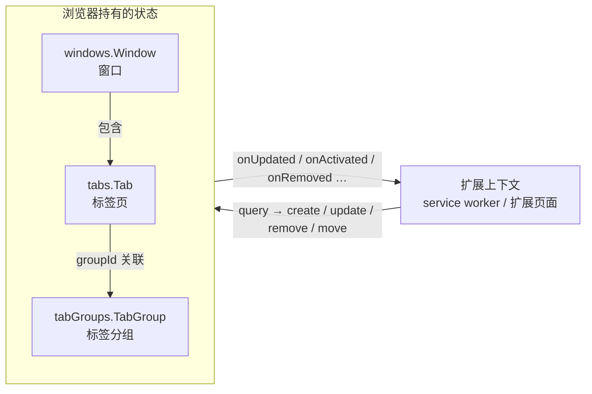

import { Canvas, Controls, Meta } from '@storybook/addon-docs/blocks';
import * as TabsWindows from './tabs-windows.stories';

<Meta of={TabsWindows} name="Docs" />

# 标签页与窗口

扩展要查询、监听或操作浏览器里的标签页，入口是同一个家族：`chrome.tabs` 管标签页，`chrome.windows` 管窗口，`chrome.tabGroups` 管标签分组。三者共享同一套工作模型——**浏览器持有状态，扩展按引用操作**：先用 `query` 拿到带 `id` 的对象快照，再用 `id` 执行 `create` / `update` / `remove` / `move`；用户自己造成的改变你看不到，只能靠事件知道。还有一条独立的轴：权限只决定四个敏感字段（`url`、`pendingUrl`、`title`、`favIconUrl`）可不可见，不影响你能执行哪些操作。



三个 API 的定位与权限边界，也是本课的回查表：

| API | 主要动作 | 权限 | 关键标识 |
| --- | --- | --- | --- |
| `chrome.tabs` | `query` / `create` / `update` / `remove` / `move` / `duplicate` | 操作本身不需要权限；读四个敏感字段需要 `"tabs"`、匹配的主机权限或 `activeTab` 临时授权 | `tabId` |
| `chrome.windows` | `getAll` / `getLastFocused` / `get` / `create` / `update` / `remove` | 同上（影响返回 `Tab` 上的敏感字段） | `windowId`（`WINDOW_ID_CURRENT` = -2） |
| `chrome.tabGroups` | `query` / `update` / `move`；成员增减走 `tabs.group` / `tabs.ungroup` | `"tabGroups"` | `groupId`（`TAB_GROUP_ID_NONE` = -1） |

`tabs.sendMessage`（扩展上下文向指定标签页定向发消息）的完整机制在[消息通信](?path=/docs/messaging--docs)一课，本课只在事件监听处用到它；观察导航请求是另一条链路，归[网络请求控制](?path=/docs/network-requests--docs)。MV3 下本课事件的常规归宿是 service worker，这是[Service Worker](?path=/docs/service-worker--docs)一课已建立的模型。

## 查询标签页

所有操作的起点是 `chrome.tabs.query(queryInfo)`：返回满足**全部**指定条件的标签页数组，不传条件时返回所有标签页。查询结果只是一份快照，真正执行操作时拿 `tab.id` 当句柄。

```js
// service worker 里取「当前聚焦的标签页」的惯用写法
const [tab] = await chrome.tabs.query({ active: true, lastFocusedWindow: true });
```

### query 过滤

常用的过滤条件与注意事项：

| 过滤字段 | 含义 | 备注 |
| --- | --- | --- |
| `active` | 该窗口中处于激活状态的标签页 | 每个窗口最多命中一个 |
| `lastFocusedWindow` | 限定最近聚焦过的窗口 | service worker 里最常用 |
| `currentWindow` | 限定调用方所在的窗口 | 只在 popup 等扩展页面上下文里有定义 |
| `windowId` | 限定指定窗口 | `WINDOW_ID_CURRENT`（-2）指调用方所在窗口 |
| `index` | 限定标签页在窗口内的位置 | 单个整数 |
| `url` | 按 match pattern 匹配 URL | 无 `"tabs"` 或主机权限时整个过滤被忽略；片段标识符不参与匹配 |
| `status` | `loading` / `complete` / `unloaded` | 过滤页面加载状态 |
| `groupId` | 限定指定分组 | `TAB_GROUP_ID_NONE`（-1）查未分组的标签页 |
| `windowType` | 限定窗口类型 | `normal` / `popup` / `devtools` 等 |

- 多个条件是**与**关系：`{ active: true, lastFocusedWindow: true }` 命中且仅命中「最近聚焦窗口里的激活标签页」，即一个标签页。
- `url` 接受字符串或 match pattern 数组。官方文档明确指出这个过滤的匹配支持并不完整，且在没有 `"tabs"` 或主机权限时**整个条件被忽略**（不是返回空结果）——下面的范例把这个差别做成了可观察证据。
- `currentWindow` 与 `lastFocusedWindow` 的区别值得记牢：前者只在扩展页面上下文（popup、选项页等）里有意义，service worker 里没有「当前窗口」可言，要用后者。

下面的范例模拟两个窗口共 7 个标签页，切换过滤条件与权限开关，观察命中结果与字段可见性。

<Canvas of={TabsWindows.Query} />
<Controls of={TabsWindows.Query} />

| 读者操作 | 可观察证据 |
| --- | --- |
| 只打开 `active` | 两个窗口各命中一个（各自的激活项），共 2 个 |
| 同时打开 `active` 与 `lastFocusedWindow` | 只剩 1 个：窗口 2 的激活项——这就是「当前聚焦的标签页」 |
| 选择 url 过滤并保持 `"tabs"` 权限打开 | 只剩 `developer.chrome.com` 上的标签页，敏感字段显示真实值 |
| 关掉 `"tabs"` 权限再选同一个 url 过滤 | 命中数回到全量：过滤被整体忽略；url / title / favIconUrl 位置显示未授权 |
| 打开 Show code | 看到该 Canvas 实际执行的 `query.ts` |

### Tab 字段与权限可见性

`tabs.query` 与 `windows` 返回的 `Tab` 是同一个形状。除四个敏感字段外，其余字段无权限即可读：

| 类别 | 字段 |
| --- | --- |
| 常字段（无权限可读） | `id`、`windowId`、`index`、`active`、`highlighted`、`pinned`、`openerTabId`、`status`、`groupId`、`audible`、`mutedInfo`、`incognito`、`discarded`、`autoDiscardable`、`frozen`、`lastAccessed`、`width` / `height` |
| 敏感字段（需授权） | `url`、`pendingUrl`、`title`、`favIconUrl` |

- `"tabs"` 权限的官方定义就是「读取这四个字段」，安装时会带「读取你的浏览历史」类警告；用不到就不要申请。
- `activeTab` 是轻量替代：用户通过 action、右键菜单、快捷键或 omnibox 唤起扩展后，当前标签页临时获得等价能力——可读这四个字段，也可配合 `scripting` 执行脚本；用户切走标签页或导航到别的主机即失效。完整边界在[Manifest 与权限](?path=/docs/manifest-permissions--docs)一课。
- 匹配的 `host_permissions`（对具体站点声明主机权限）等价于对这些站点的标签页解除限制。未授权时读到的四个字段是空字符串，而不是报错——「查询成功了但 url 是空」是没授权的第一信号。

## 操作标签页

三个 API 都以 `id` 为句柄，操作本身都不需要权限：`tabs.create`、`tabs.update` 等在文档中被明确列为免权限操作，受限的只是读回结果里的敏感字段。

### 打开与聚焦

```js
// 新建并激活（active 默认就是 true）
const tab = await chrome.tabs.create({ url: 'https://example.com/app' });
```

「页面只开一个」的单实例模式：先查再决定聚焦还是新建。

```js
const [existing] = await chrome.tabs.query({ url: 'https://example.com/app/*' });
if (existing) {
  await chrome.tabs.update(existing.id, { active: true });
} else {
  await chrome.tabs.create({ url: 'https://example.com/app' });
}
```

- `create` 的常用字段：`url`（缺省即新标签页）、`active`（默认 `true`）、`index`、`pinned`、`openerTabId`、`windowId`（在指定窗口里建）。
- `update` 可改：`url`（导航，**不接受 `javascript:` URL**，执行脚本改用 `chrome.scripting`）、`active`、`highlighted`、`pinned`、`muted`、`autoDiscardable`、`openerTabId`。
- `openerTabId` 标记新标签页由谁打开，用于事后判断来源；它不负责焦点，焦点仍归 `active`。
- 固定有副作用：`update({ pinned: true })` 会把标签页移到窗口最左，排在普通标签页之前。

### 移动、复制与关闭

```js
await chrome.tabs.move(tabId, { index: -1 });                 // -1 表示移到末尾
await chrome.tabs.move([id1, id2], { index: 0, windowId: 2 }); // 批量移动，可跨窗口
const copy = await chrome.tabs.duplicate(tabId);               // 副本紧挨源右侧
await chrome.tabs.remove(tabId);                               // 关一个
await chrome.tabs.remove([id1, id2]);                          // 关一批
```

- `move` 的 `index` 是目标窗口内的位置，`-1` 为末尾；只能对 `normal` 窗口操作。
- `duplicate` 的副本插在源标签页右侧，`url` 与源相同，且成为激活项。
- `remove` 掉窗口里最后一个标签页时，**整个窗口随之关闭**：会依次收到该标签页的 `onRemoved`（`isWindowClosing: true`）和一条 `windows.onRemoved`，见下面「监听」一节。
- 其余常用成员：`reload(tabId, { bypassCache })`、`discard(tabId)`（卸载以释放内存）、`highlight`、`goBack` / `goForward`、`detectLanguage`、`captureVisibleTab`（截图，需要 `activeTab` 或主机权限）。

下面的范例把上面的操作接到同一个 5 标签页窗口上：上排是操作前、下排是操作后，绿色为新建项、蓝色描边为被操作项。

<Canvas of={TabsWindows.Operations} />
<Controls of={TabsWindows.Operations} />

| 读者操作 | 可观察证据 |
| --- | --- |
| 操作选 `create` | 末尾追加绿色 T206（新标签页），并成为激活项，原有激活项取消 |
| 操作选 `duplicate`、目标 T202 | 多出绿色 T1202，紧挨 T202 右侧且为激活项，其余标签页 index 后移 |
| 操作选 `move-end`、目标 T201 | T201 从 idx0 移到末尾，中段 index 依次前移 |
| 操作选 `pin`、目标 T204 | T204 移到最左并带固定标记 |
| 操作选 `remove`、目标 T202 | 少一格，后续 index 前移，激活项由相邻的 T203 接替 |
| 操作选 `focus`、目标已是激活项 | 读数提示「已是激活项」，窗口不变 |
| 打开 Show code | 看到该 Canvas 实际执行的 `operations.ts` |

## 监听标签页与窗口变化

扩展自己发起的操作会同步拿到结果，真正不可替代的是事件：**用户**切换标签页、关闭窗口、拖拽分组，只有事件会通知你。MV3 下这些事件的常规归宿是 service worker：监听器必须注册在脚本顶层，让注册随 worker 启动同步完成——放进回调里再注册的监听器可能在 worker 重启后缺席（见 [Service Worker](?path=/docs/service-worker--docs)），事件到达则直接唤醒 worker。

### onUpdated 与页面加载完成

```js
chrome.tabs.onUpdated.addListener((tabId, changeInfo, tab) => {
  if (changeInfo.status === 'complete') {
    // 页面加载完成：此刻再向该标签页里的 content script 发消息
    chrome.tabs.sendMessage(tabId, { type: 'page-ready' }).catch(() => {});
  }
});
```

- `changeInfo` 只包含**发生变化的字段**（`status`、`title`、`url`、`favIconUrl`、`pinned`、`mutedInfo`、`audible`、`discarded`、`groupId`、`frozen` 等），不是整个 `Tab`；第三个参数 `tab` 才是完整对象。
- `status` 三值：`loading`（开始加载）、`complete`（加载完成）、`unloaded`（被卸载，如 `discard` 之后）。一次普通导航会触发多条 `onUpdated`：`loading` → `favIconUrl` / `title` → `complete`，重定向则更多。
- 「等 `complete` 再发消息」是最常用的一条纪律：`onUpdated` 在 `loading` 阶段到达时，content script 往往还没注入，此时 `tabs.sendMessage` 会 reject `Receiving end does not exist`。注入时机本身由[Content Scripts](?path=/docs/content-scripts--docs)承载。
- SPA 内部用 `history.pushState` 切换路由**不会**触发 `tabs.onUpdated`：tabs API 只认文档级导航。要感知路由变化，在 content script 里监听。

### 切换、关闭与移动

```js
chrome.tabs.onActivated.addListener(({ tabId, windowId }) => {
  /* 用户或 tabs.update({ active: true }) 切换了激活项 */
});

chrome.tabs.onRemoved.addListener((tabId, { windowId, isWindowClosing }) => {
  if (isWindowClosing) {
    // 整个窗口在关，之后还有一条 windows.onRemoved
  }
});

chrome.tabs.onMoved.addListener((tabId, { fromIndex, toIndex, windowId }) => {
  /* 同一窗口内拖动或 move 改变了位置 */
});
```

- `onRemoved` 的 `removeInfo` 里 `isWindowClosing` 为 `true` 表示关闭由「关窗」引起，而不是关单个标签页；两种场景的清理逻辑要分开。
- `onMoved` 只覆盖**同一窗口内**的位置变化，跨窗口不归它管（见下）。
- 配套的还有 `onCreated`、`onAttached` / `onDetached`、`onReplaced`、`onHighlighted`、`onZoomChange`。

### 跨窗口拖拽与窗口事件

拖拽是边界最密的一类操作，事件分流规则：

| 操作 | 触发的事件 |
| --- | --- |
| 同窗口内拖动 / `move` | `tabs.onMoved` |
| 拖到另一个窗口 | `tabs.onDetached`（旧位置）+ `tabs.onAttached`（新位置），**没有** `onMoved` |
| 分组跨窗口移动 | `tabGroups.onRemoved` + `tabGroups.onCreated`（`onMoved` 只覆盖同窗口） |
| 关闭窗口 | 每个标签页 `tabs.onRemoved`（`isWindowClosing: true`）+ `windows.onRemoved` |

窗口自己的四个事件：`windows.onCreated`、`windows.onRemoved`、`windows.onFocusChanged`、`windows.onBoundsChanged`（bounds 变化**完成后**触发一次，不是拖动过程中连续触发）。

- `onFocusChanged` 有个反直觉点：在 Chrome 窗口之间切换时，会先收到一次 `WINDOW_ID_NONE`（-1，表示没有窗口获得焦点），再收到新窗口 id；失焦到其他应用时只收到 -1。
- `windows` 三个事件都支持 `filters.windowTypes`，默认只对 `['normal', 'popup']` 生效——`devtools` 等类型要显式声明。

下面的范例把本节所有事件汇到同一张日志里：切换动作会重置到初始状态，「重复次数」在现有状态上追加执行。

<Canvas of={TabsWindows.Events} />
<Controls of={TabsWindows.Events} />

| 读者操作 | 可观察证据 |
| --- | --- |
| 动作选「在窗口 1 内切换标签页」 | 日志出现 `tabs.onActivated({ tabId: 302, windowId: 1 })`，窗口 1 的激活高亮移动 |
| 动作选「关闭窗口 1 的 T302（非激活）」 | `tabs.onRemoved` 带 `isWindowClosing: false`，分组 7 变空后跟随 `tabGroups.onRemoved` |
| 动作选「关闭窗口 2 唯一的 T304」 | `tabs.onRemoved` 带 `isWindowClosing: true`，随后固定一条 `windows.onRemoved(2)`，窗口 2 从快照中消失 |
| 动作选「T301 导航到新页面」 | 连续三条 `onUpdated`：`loading` → `title` → `complete`，与「等 complete 再发消息」的纪律对应 |
| 动作选「把 T302 拖到窗口 2」 | `onDetached` + `onAttached` 成对出现，没有 `onMoved`；分组不可跨窗口，跟随变空移除 |
| 动作选「把焦点切到窗口 2」 | 先 `onFocusChanged(-1)`，再 `onFocusChanged(2)` |
| 打开 Show code | 看到该 Canvas 实际执行的 `events.ts` |

## 标签分组

标签分组是窗口内的一组标签页：`Tab.groupId` 是指针，分组本身由 `chrome.tabGroups` 描述。成员增减用 `tabs.group` / `tabs.ungroup`，外观与折叠用 `tabGroups.update`；`"tabGroups"` 权限是后者的门槛，前者在 tabs 参考中没有权限要求。

### 创建与成员

```js
const groupId = await chrome.tabs.group({ tabIds: [t1, t2] }); // 新建分组
await chrome.tabs.group({ tabIds: [t3], groupId });            // 加入已有分组
await chrome.tabs.ungroup([t1]);                               // 移出分组
const groups = await chrome.tabGroups.query({ windowId: 1 });  // 查窗口里的分组
```

- 新建分组默认灰色、无标题；Chrome 会把成员排成相邻的标签页，原本不相邻的会被移到一起。
- 分组不能跨窗口存在：拖到别的窗口等于离开分组（上面的范例可观察）。
- `tabGroups.move(groupId, { index, windowId })` 整体移动分组，`index: -1` 为末尾，仅 `normal` 窗口；跨窗口移动不触发 `onMoved`，而是 `onRemoved` + `onCreated`。
- 查未分组的标签页：`tabs.query({ groupId: chrome.tabs.TAB_GROUP_ID_NONE })`。

### 外观与折叠

```js
await chrome.tabGroups.update(groupId, {
  title: 'API 文档',
  color: 'blue',
  collapsed: false,
});
```

- `color` 共 9 种：`grey` / `blue` / `red` / `yellow` / `green` / `pink` / `purple` / `cyan` / `orange`。
- `collapsed: true` 后标签页在窗口条上收起成一个格子，但 `tabs.query` 仍能查到它们——折叠只是显示状态。
- `tabGroups.query` 支持 `collapsed` / `color` / `title` / `windowId` 过滤；事件有 `onCreated`、`onUpdated`（颜色、标题、折叠变化）、`onMoved`、`onRemoved`（分组关闭或变空时）。

下面的范例把分组操作与 query 结果并排呈现。

<Canvas of={TabsWindows.Groups} />
<Controls of={TabsWindows.Groups} />

| 读者操作 | 可观察证据 |
| --- | --- |
| 默认动作「set-appearance」、颜色 blue、标题「API 文档」 | 分组 7 外框变为蓝色，标题改为「API 文档」，query 行同步 |
| 颜色切到 `red`、标题清空 | 外框变红、标题显示「（无标题）」，证明颜色与标题是两个独立字段 |
| 动作切到「toggle-collapsed」 | 分组 7 在展开与折叠间切换，窗口条上成员合并为 +N 格子；query 仍返回全部成员 |
| 动作切到「group-new」 | T404 与 T406 建成新分组 9（默认灰色、无标题），且被排成相邻 |
| 动作切到「ungroup」 | 分组 7 解散，T402 / T403 的 groupId 回到 -1，下排 query 少一行 |
| 打开 Show code | 看到该 Canvas 实际执行的 `groups.ts` |

## 窗口

`chrome.windows` 的操作面比 tabs 小得多，难点在 `windowTypes` 过滤与 `state` / bounds 的组合规则。

### 查询窗口

```js
const all = await chrome.windows.getAll({ windowTypes: ['normal'] }); // 默认 ['normal', 'popup']
const last = await chrome.windows.getLastFocused();                   // 最近聚焦的窗口
const current = await chrome.windows.getCurrent();                    // 调用方所在窗口（扩展页面）
const win = await chrome.windows.get(windowId, { populate: true });   // populate 带上 tabs 数组
```

- `Window` 字段：`id`、`focused`、`top` / `left` / `width` / `height`、`state`、`type`、`incognito`、`alwaysOnTop`、`tabs`（仅 `populate: true`）、`sessionId`。
- `WINDOW_ID_CURRENT` = -2、`WINDOW_ID_NONE` = -1，在 `tabs.query({ windowId })` 等处通用。
- `getAll` / `getLastFocused` 的默认过滤不含 `devtools` 窗口；`panel` 类型已废弃。

### 创建与更新窗口

```js
const win = await chrome.windows.create({
  url: ['https://example.com'],
  type: 'popup',          // normal / popup；panel 已废弃，devtools 窗口不能由扩展创建
  focused: true,
  width: 480,
  height: 640,
  state: 'normal',        // normal / minimized / maximized / fullscreen
  incognito: false,
  tabId,                  // 把已有标签页移入新窗口
  setSelfAsOpener: true,  // 标记调用方为 opener
});

await chrome.windows.update(win.id, { state: 'maximized' });
await chrome.windows.update(win.id, { drawAttention: true }); // 只吸引注意，不抢焦点
await chrome.windows.remove(win.id);
```

- `create` 的 `url` 可传字符串或数组，需要带 scheme；`tabId` 可把已有标签页搬进新窗口。
- `update` 可改 `state`、`focused`、bounds（`left` / `top` / `width` / `height`）和 `drawAttention`；`minimized` / `maximized` / `fullscreen` 三态**不能与 bounds 同时传**，`panel` 窗口的 bounds 一律被忽略。
- `state` 没有专门的变化事件，需要感知时在 `onBoundsChanged` 或合适时机用 `get` / `getAll` 复查。

## 最佳实践

- 先 query 后操作，本地不长期缓存 `tabId`：id 只在浏览器会话内有效，重启后不可靠；缓存的是 URL、站点这类查询条件，用到时现查。
- 「当前标签页」分上下文写：popup 等扩展页面用 `{ active: true, currentWindow: true }`，service worker 用 `{ active: true, lastFocusedWindow: true }`。
- 发消息前看 `status`：`onUpdated` 里等 `changeInfo.status === 'complete'` 再 `tabs.sendMessage`，并 `.catch` 兜底（页面刷新、标签页关闭都会让它 reject）。
- 关窗与关标签分开处理：按 `removeInfo.isWindowClosing` 和 `windows.onRemoved` 分流，别把「关一个」的清理逻辑套到「关一窗」上。
- MV3 事件纪律：监听器注册在 service worker 顶层同步执行；监听回调里只做短同步工作，长任务先落到 `chrome.storage` 或交给带保活的机制，worker 随时可能被回收（见[Service Worker](?path=/docs/service-worker--docs)）。
- 权限最小化：多数场景 `activeTab` + 非敏感字段就够；批量读取任意站点的 URL / 标题时再申请 `"tabs"`，并接受安装警告。

## 常见问题

- 查询成功但 `tab.url`、`tab.title` 是空字符串，按 `url` 过滤也查不到东西
  没有 `"tabs"` 权限、匹配的主机权限或 `activeTab` 临时授权：四个敏感字段返回空字符串，`url` / `title` 过滤被整体忽略。给 manifest 加 `"tabs"`，或改走用户手势后的 `activeTab`（见[Manifest 与权限](?path=/docs/manifest-permissions--docs)）。

- service worker 里 `tabs.query({ active: true, currentWindow: true })` 拿不到标签页
  `currentWindow` 只在扩展页面上下文里有定义。service worker 里改用 `lastFocusedWindow`，指代「最近聚焦的窗口」而不是「调用方所在窗口」。

- SPA 页面切换路由后 `onUpdated` 不触发
  `history.pushState` 不产生文档级导航，tabs API 感知不到。要跟踪路由变化，在 content script 里监听并转发（见[Content Scripts](?path=/docs/content-scripts--docs)）。

- 标签页拖到另一个窗口，`onMoved` 没触发
  预期如此：跨窗口是 `onDetached` + `onAttached` 一对事件；`onMoved` 只覆盖同窗口内移动。分组的跨窗口移动同理是 `tabGroups.onRemoved` + `onCreated`。

- 关一次窗口收到一堆 `onRemoved`
  正常行为：窗口内每个标签页都会 `onRemoved` 且 `isWindowClosing` 为 `true`，随后才是 `windows.onRemoved`。按 `windowId` 合并处理，别当成多次误关。

- `tabs.update({ url: 'javascript:…' })` 无效
  `url` 不接受 `javascript:` URL。要在页面里执行代码用 `chrome.scripting.executeScript`（见[Content Scripts](?path=/docs/content-scripts--docs)）。

- `tabGroups.update` 报「没有权限」
  `"tabGroups"` 权限没声明。它只影响 `tabGroups` 的 `query` / `update` / `move` / `get`；`tabs.group` / `tabs.ungroup` 改成员不受此限。

## 总结回顾

摘要：

三个 API 同一套模型：浏览器持有标签页、窗口、分组状态，扩展按引用操作——`query` 拿带 `id` 的快照，`create` / `update` / `remove` / `move` 改状态，用户造成的改变只有事件知道。查询侧的重点是过滤与权限：条件是「与」关系，`active` + `lastFocusedWindow` 命中「当前聚焦的标签页」，而 `url` / `title` 过滤和 `url` / `pendingUrl` / `title` / `favIconUrl` 四个敏感字段都需要 `"tabs"`、主机权限或 `activeTab` 临时授权，未授权时过滤被整体忽略、字段为空字符串。操作侧以 `tabId` 为句柄，固定会把标签页移到最左，复制项紧挨源右侧，`index: -1` 是末尾，关掉窗口最后一个标签页会连带关闭窗口。事件侧最常用的纪律是等 `changeInfo.status === 'complete'` 再向标签页发消息；跨窗口拖拽是 `onDetached` + `onAttached` 而非 `onMoved`，关窗时每个标签页 `isWindowClosing: true` 后还有一条 `windows.onRemoved`，Chrome 窗口间切焦点会先收到 `WINDOW_ID_NONE`。分组不能跨窗口，成员增减走 `tabs.group` / `tabs.ungroup`，颜色（9 种）、标题与折叠走 `tabGroups.update` 且需要 `"tabGroups"` 权限；窗口层面记住 `windowTypes` 默认过滤 `['normal', 'popup']`，以及 `state` 与 bounds 不能同时传。

一句话：

> 扩展按 id 引用浏览器状态：query 定位、事件同步、操作免权限；权限只决定四个敏感字段可不可见，而用户造成的改变只有事件会告诉你。

知识要点：

- `tabs.query` 的常用过滤条件有哪些，多个条件之间是什么关系？
- `active` + `lastFocusedWindow` 与 `currentWindow` 各自的适用上下文是什么？
- 哪四个 `Tab` 字段需要授权，各自的授权途径是什么，未授权时表现为什么？
- `create` / `update` / `move` / `duplicate` / `remove` 各自的行为细节（缺省值、副作用、边界）？
- `onUpdated` 的 `changeInfo` 与 `status` 是什么关系，「等 complete 再发消息」在防什么？
- 关闭标签页、关闭窗口、跨窗口拖拽分别触发哪些事件，如何区分？
- 标签分组的成员增减、外观修改、跨窗口移动各自用哪个 API、需要什么权限？
- `windows` 的 `windowTypes` 过滤默认值是什么，`state` 与 bounds 的组合限制是什么？

## 参考资料

- [chrome.tabs API 参考](https://developer.chrome.com/docs/extensions/reference/api/tabs)
- [chrome.windows API 参考](https://developer.chrome.com/docs/extensions/reference/api/windows)
- [chrome.tabGroups API 参考](https://developer.chrome.com/docs/extensions/reference/api/tabGroups)
- [activeTab 权限](https://developer.chrome.com/docs/extensions/develop/concepts/activeTab)
- [权限清单（tabs 权限说明）](https://developer.chrome.com/docs/extensions/reference/permissions-list)
- [Service worker 中的事件注册](https://developer.chrome.com/docs/extensions/develop/concepts/service-workers/events)
