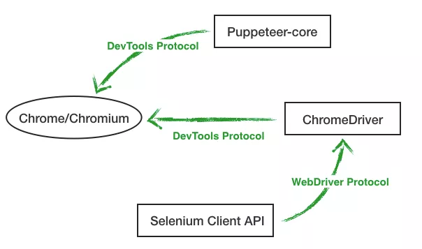
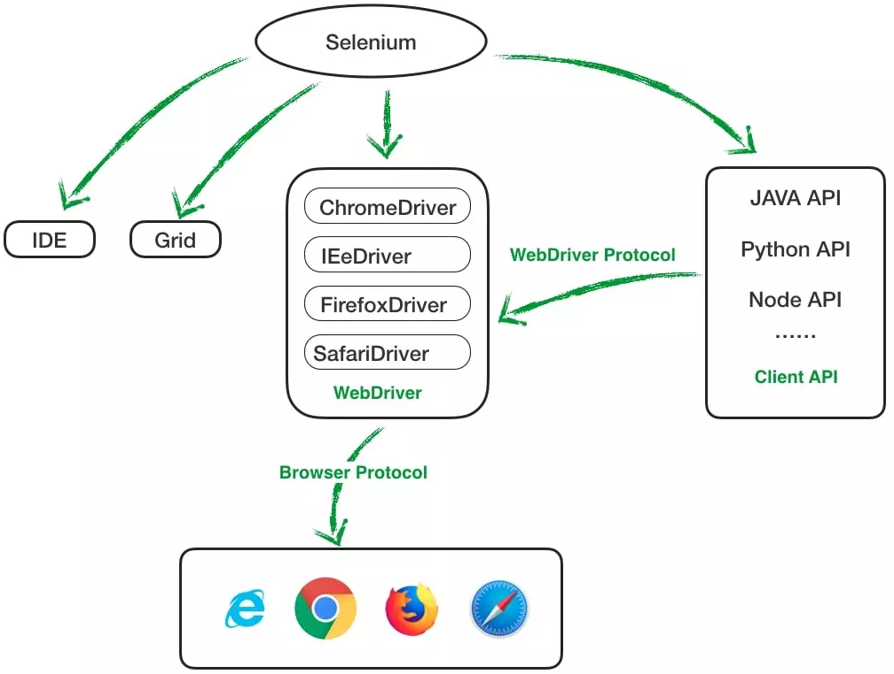

# WebDriver

WebDriver 是浏览器自动化工具，主要的用途：

1. 自动化测试
2. 网页截图
3. 爬虫

- [WebDriver MDN](https://developer.mozilla.org/en-US/docs/Web/WebDriver)
- [webdriver Specification](https://www.w3.org/TR/webdriver/)

## 发展历史

- 2004 年，ThoughtWorks 的 Jason Huggins 开发了 Selenium，并开源了。

    早期用过的名字：Driven Selenium，Selenium B

    后来同一家公司的 Paul Hammant 加入，重构了项目，项目命名为：Selenium RC，RC 是 Remote Control 的意思。

- 2005 年，Selenium 成立了委员会，负责协调开源项目的运作。
- 2007 年，Selenium 项目创始人 Jason Huggins 转投谷歌，开始利用谷歌的力量继续开发 Selenium，同时 ThoughtWorks 开发了另一个项目 WebDriver。

    根据文档来看，Selenium 1.0 是在浏览器启动时注入 JS，从而提供一系列交互接口，然后使用者通过在页面上执行 JS 的方式实现自动化。

    WebDrvier 调用浏览器驱动，直接参与页面互动。

- 2009 年，Google 测试自动化大会之后，两个项目决定合并，叫做 Selenium WebDriver，又叫 Selenium 2.0。
- 2011 年 1 月 23 号，Ariya Hidayat 发布了 PhantomJS，这是真正意义上第一个无头浏览器。

    PhantomJS 基于 webkit 内核打造，并且提供一系列的 Javascript API 供开发者操控浏览器行为，项目发布后，一石激起千层浪，到目前为止，已经被上千家组织或公司使用，并在原有的基础上衍生出了 CasperJS 和 Yslow 两个项目

    这样的场景直到 2017 年被打破，Chrome 59 宣布支持在 headless 环境下运行 Chrome，同时因为长期缺乏代码提交，2018 年 5 月 4 号，Ariya 宣布了暂停项目的开发维护，版本号最终停在 2.1.1。

- 2012 年，WebDriver 开发者向 W3C 提交了工作草案，旨在使 WebDriver 使用的浏览器驱动接口成为技术标准。
    
    标准化的是 WebDriver 之前采用的 JsonWireProtocol 通讯协议 https://github.com/SeleniumHQ/selenium/wiki/JsonWireProtocol

    由于各浏览器的驱动程序实现都不一样，在标准化之前，Selenium 对各种驱动进行封装，提供统一 API

- 2017 年，Chrome 开始支持 headless 环境，紧接着，用于控制 Chrome 的 Node 库开源项目 Chromeless 出现，不过随着 Chrome 团队发布了官方库 Puppeteer，Chromeless 作者宣布项目停止开发，并建议用户迁移 Puppeteer。
- 2018 年，WebDriver API 成为正式的 W3C 技术标准：https://www.w3.org/TR/webdriver1/
- 2019 年，Selenium 4 发布。

参考文献

- [聊一聊众 Webdrivers](https://www.markjour.com/article/20190620-webdriver.html)
- [PhantomJS](https://en.wikipedia.org/wiki/PhantomJS#History)
- [“木偶”浏览器](https://www.infoq.cn/article/rsudxSMfT4witSrD9VL7)

### Webdriver VS Headless

WebDriver 是 Selenium 根据不同的浏览器（Chrome、Safari、IE、Firefox）的接口定制的规范统称，面对不同浏览器，使用的 Driver 不同，官网目前提供了 IE Driver、Safari Driver、Chrome Driver、Firefox Driver，可以通过下图加深理解，以 Chrome 为例，Puppeteer-core 和 ChromeDriver 都是通过 devtools-protocol 控制浏览器，区别是 Puppeteer-core 是开发者直接可用的 Node 库，ChromeDriver 则需要用户通过 Selenium Client API 进行调用。

总结：Selenium / WebDriver 专注于跨浏览器自动化; 它的价值主张是一个适用于所有主流浏览器的标准API。Puppeteer 专注于 Chromium; 它的价值主张是更丰富的功能和更高的可靠性。



- [Headless browser](https://en.wikipedia.org/wiki/Headless_browser)
- [Puppeteer: 更友好的 Headless Chrome Node API](https://zhuanlan.zhihu.com/p/30213568)
- [web 自动化测试-puppeteer 入门与实践](https://testerhome.com/topics/15662)
- [Selenium vs Puppeteer: testing the testing tools](https://blog.scottlogic.com/2020/01/13/selenium-vs-puppeteer.html)

## 使用教程

浏览器厂商原始版本

- [ChromeDriver](https://chromedriver.chromium.org/home)
- [geckodriver](https://github.com/mozilla/geckodriver/)

Node.js 封装版本

- [node-chromedriver](https://github.com/giggio/node-chromedriver)
- [vladikoff/node-geckodriver](https://github.com/vladikoff/node-geckodriver) | [sitespeedio/geckodriver](https://github.com/sitespeedio/geckodriver)


## 衍生框架

- https://github.com/webdriverio/webdriverio
- [Selenium](https://www.selenium.dev)
- [PhantomJS](https://phantomjs.org/)
- [Puppeteer](https://github.com/puppeteer/puppeteer) / [Puppeteer for Firefox](https://github.com/puppeteer/puppeteer/tree/1ce4fe7169ef0b0b1f6d771a99d783dbbb62941f/experimental/puppeteer-firefox)
- [Playwright](https://github.com/microsoft/playwright)

### Selenium



- Selenium IDE：firefox/Chrome 浏览器的插件，提供简单的脚本录制、编辑与回放功能。
- Selenium Client API：Selenese 是 Selenium 的指令集，除了使用 Selenese，Selenium 还开放了编程语言调用接口，通过调用 Selenium Client API 中的方法与 WebDriver 进行通信，目前支持 JAVA、C#、Javascript、Python。
- Selenium Grid：用于对测试脚本进行分布式处理，目前已经集成到 Selenium Server 中。
- WebDriver & Selenium-RC：WebDriver 则是通过浏览器原生接口协议驱动浏览器，并且开放了不同语言对应的 API

    Selenium-RC 通过 Javascript 驱动网页，这使得整个过程与网页的内容高度耦合，得益于此，Selenium 也是第一批支持 Ajax 和一些高动态网页的自动化测试工具之一，同时，一个绕不过的问题，自动化代码运行在 Javascript 沙箱内，这就要求 Selenium-RC 服务必须跟对应网页保持同源。


## 常见问题

- [npm 安装 chromedriver 失败的解决办法](https://segmentfault.com/a/1190000008310875)

    - https://npm.taobao.org/
    - https://gist.github.com/52cik/c1de8926e20971f415dd
    - ["ChromeDriver installation failed undefined" during npm install.](https://github.com/vuejs/vue-router/issues/261)

- Chrome 模拟移动设备且定制 userAgent


    ```js
    const chrome = require('selenium-webdriver/chrome');
    const chromeOptions = new chrome.Options();
    chromeOptions.setMobileEmulation({
      "deviceMetrics": {
        "width": 375,
        "height": 750,
        "pixelRatio": 2,
        "touch": true
      },
      "userAgent": "Mozilla/5.0 (Linux; Android 5.0; SM-G900P Build/LRX21T) AppleWebKit/537.36 (KHTML, like Gecko) Chrome/80.0.3987.162 Mobile Safari/537.36"
    });
    ```

    ps：虽然 [`chrome.Options().setMobileEmulation(config)`](https://github.com/SeleniumHQ/selenium/tree/1f67907a949e73556af681ee86bd3b57c40080ea/javascript/node/selenium-webdriver/chromium.js#L532) 的接口文档里没有写明可以配置 deviceMetrics 和 userAgent，但是通过 ChromeDriver 的官方文档 [Specifying Individual Device Attributes](https://chromedriver.chromium.org/mobile-emulation) 可以得知是支持这些配置参数的。
