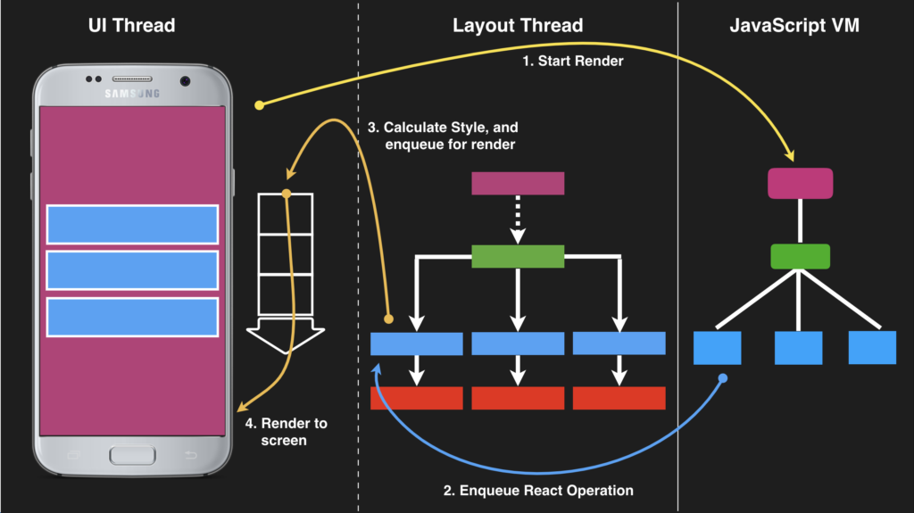
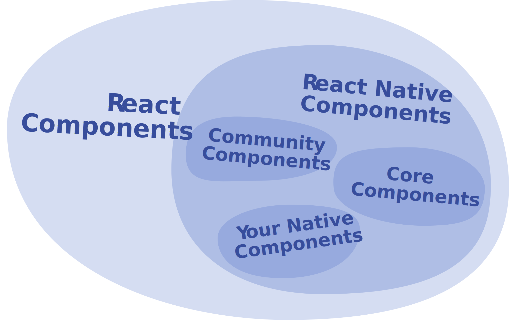
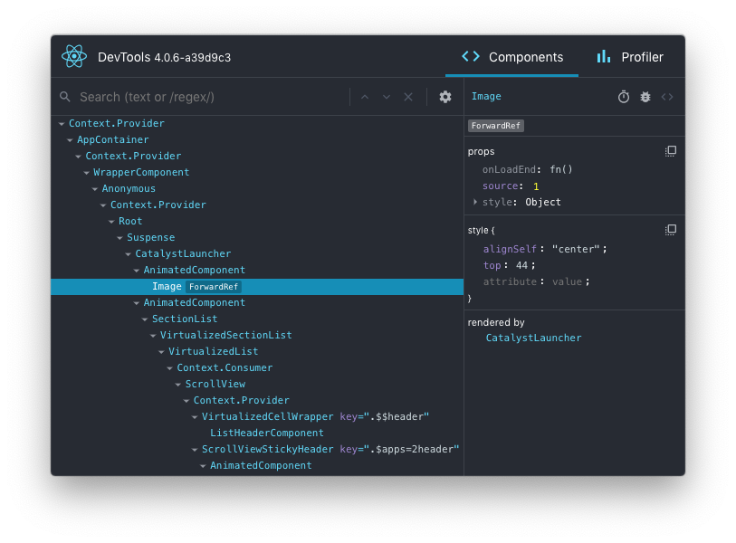

# React Native

前言：本文不是 React Native 入门上手指导文档，主要为大家讲解 React Native 这门技术的实现原理，与其他技术方案进行对比，并概要介绍整体开发框架、存在的问题和未来的发展情况。最终希望能够帮助大家认识 React Native 这门技术，对技术选型做一点参考。

**Learn once, write anywhere**

React Native 是一个使用 React 和应用平台的原生功能来构建 Android 和 iOS 应用的开源框架。通过 React Native，您可以使用 JavaScript 来访问移动平台的 API，以及使用 React 组件来描述 UI 的外观和行为。

## 实现原理


ps：React 在 0.14 版本（2015年）进行了拆分，分割为两个包：react 和 react-dom，旨在分离 React 和它的渲染引擎。分离后的 react 包含各种创建组件的方法（UI 的配置和数据流的控制），react-dom 包含各种渲染方法，react-dom/server 提供服务端组件渲染。这样做使得开发者可以自定义 DOM 渲染引擎，且允许跨渲染引擎共享组件。而 React Native 就是运行在移动端平台上以原生组件来渲染 UI 的一套开源框架。如果是在 Web 平台上，React 最终将把标记代码解析成浏览器的 DOM；而在 React Native 中，标记代码会被解析成特定平台的组件，例如 `<View>` 将会表现为 iOS 平台上的 UIView。

_扩展_：除了 React Native 和 React Dom 外，React 社区衍生出现了不少有意思的 React 渲染库，他们基于 React 组件化的开发思想，去简化原有的实现。 —— **Learn once, write anywhere**

- react-art：用于绘制矢量图形，可以使用同样的声明式 API，渲染输出 Canvas，SVG 和 VML。
- react-canvas：以 Canvas 来绘制前端界面

    这是 Flipboard 公司维护的一个开源库，如果有早期使用过 Flipboard 的 App 会知道，它的主页以杂志的形式展现，交互效果很酷。在他们部署 web 版本的时候遇到了 Web 性能差，体验不佳的问题。结果他们公布了一个引起业界轰动的解决方案：不使用 DOM，而是将整个网站使用 canvas 输出（react-canvas）。详情参考阮一峰编写的博文 [也许，DOM 不是答案](https://www.ruanyifeng.com/blog/2015/02/future-of-dom.html)。

    

- react-three-fiber：利用 React 组件开发思维，简化 three.js 的使用，而且服用了 React 的整个生态系统。
- [react-native-windows](https://github.com/microsoft/react-native-windows), [react-native-macos](https://github.com/ptmt/react-native-macos), [react-vr](https://github.com/facebook/react-vr), [react-native-desktop-qt](https://github.com/status-im/react-native-desktop-qt)...

说回 react-native 框架，它在运行时通过对应平台的 Bridge 实现了与原生框架的通信，将 React 组件树映射为虚拟 DOM，状态变更时进行 diff 算法，计算出变动后的 JSON 映射文件，最终由 Native 层将此 JSON 文件映射渲染到原生 App 的页面元素上，最终实现了在项目中只需要控制 state 以及 props 的变更来引起 iOS 与 Android 平台的 UI 变更。编写的 React Native 代码最终会打包生成一个 xxx.bundle.js 文件供 App 加载，此文件可以在 App 设备本地，也可以存放于服务器上供 App 下载更新 。


在浏览器中，JavaScript 线程和渲染线程时互斥的（不能同时执行），而在 React Native 中，JS 运行在原生提供的 JavascriptCore 引擎上，渲染是在原生的 UI 线程上完成的，两者之间是异步的（非阻塞），这种分离确保了 UI 线程平滑，不会因为 JS 代码中发生的任何昂贵计算而减慢。例如：当 Javascript 线程卡住的时候，你会发现仍然可以欢快的上下滚动 ScollView，这是因为 ScrollView 运行在主线程（UI 线程）之上），滚动的事件以通知的形式通过 Bridge 发送给 Javascript 线程，所以不受 JavaScript 线程影响。浏览器不一样，因为 JS 线程和渲染线程互斥，如果 JS 线程卡住，就会导致页面冻结，无法响应用户的交互（现在的浏览器已经对某些事件做了特殊处理，例如 passive event，如果 js 监听了页面滚动事件，页面滚动时每次都要等监听事件处理完才能执行默认行为，从而导致页面卡顿，而设置了 passive 后，可以让浏览器忽略这些监听事件，直接执行默认行为）。

ps：浏览器也可以借助 worker 实现异步渲染，参考开源项目 [react-worker-dom](https://github.com/web-perf/react-worker-dom)，此外现在国内流行的小程序也是类似的，业务逻辑和 UI 状态管理放在唯一的 JS 线程运行，每个页面的渲染交给独立的 webview 渲染。


_思考_：多线程会存在什么样的问题？

在大多数情况下，在单独的线程上运行复杂的计算可以帮助保持主UI线程的自由和响应。但是，有些情况下，这种多线程可能会妨碍顺畅的用户体验。这里有几个例子。

1. 就像渲染命令被发送到UI线程一样，来自用户交互的所有事件都将在UI线程上接收，并且需要被发送回JS VM进行处理。通信是异步的，因此处理JS代码中的事件也是如此。因此，我们无法同步取消事件或阻止默认操作。
2. 像 RecyclerView 或 UICollectionView 这样的 UI 控件虚拟化长列表以提高性能。当需要基于滚动位置呈现“第n个元素”时，API 需要同步返回值来呈现特定元素。在更抽象的术语中，将 React Native 与期望同步呈现的 UI 布局系统集成在一起现在更加困难。虽然 React Native 可能无法阻止滚动长列表，但如果这些列表非常长，它仍然会显示没有内容，并且滚动速度非常快。



参考文献

- [React Native 底层原理](https://zhuanlan.zhihu.com/p/41920417)
- [React Native 工作原理](https://www.ituring.com.cn/book/tupubarticle/25792)
- [深入理解React Native页面构建渲染原理](https://cloud.tencent.com/developer/article/1037539)
- [【译】React Native - 同步和异步渲染性能](https://juejin.im/post/6844903762935414797)
- [浏览器UI线程和JS线程是同一个线程吗？](https://www.zhihu.com/question/264253488)
- [移动Web滚动性能优化: Passive event listeners](https://zhuanlan.zhihu.com/p/24555031)

## 技术栈对比

| 技术栈/特性 | 跨平台 | 动态加载 | 高性能 | API | 生态 |
| --- | --- | --- | --- | --- | --- |
| H5 | +++ | +++ | - | - | ++ |
| Hybrid | ++ | ++ | - | + | + |
| RN | + | ++ | + | ++ | + | + |
| Flutter | + | - | ++ | ++ | + |
| 原生 | - | - | +++ | +++ | ++ |

ps：++（非常好）、++（很好）、+（好）、-（差）、--（很差）、--（非常差）

inVerita 及其移动开发团队输出了一份 Flutter 、React Native 和 Native 的性能对比报告，报告中涵盖了常见应用场景的性能测试，如：列表视图、重动画，具体参考文档 [Flutter vs React Native vs Native：深度性能比较](https://www.infoq.cn/article/uYiItcu0eATDul25ecXG)。

参考文献

- [H5、React Native、Native应用对比分析](https://vczero.github.io/react_native/H5-React-Native-Native.html)
- [原生 iOS(Swift) 和 React-Native 性能对比](https://zhuanlan.zhihu.com/p/26786404)
- [Flutter vs React Native vs Native：深度性能比较](https://www.infoq.cn/article/uYiItcu0eATDul25ecXG)
- [React Native的性能对比测试](https://testudy.cc/tech/2018/05/04/react-native-performance.html)

## 开发框架

下面主要介绍 React Native 在开发上和 web 端不同的地方。

### 运行环境

在使用 React Native 时，你的 JavaScript 代码将会运行在两个不同的环境上：

1. 大多数情况下，React Native 使用的是 JavaScriptCore，也就是 Safari 所使用的 JavaScript 引擎。但是在 iOS 上 JavaScriptCore 并没有使用即时编译技术（JIT），因为在 iOS 中应用无权拥有可写可执行的内存页（因此无法动态生成代码）。
2. 在使用 Chrome 调试时，所有的 JavaScript 代码都运行在 Chrome 中，并且通过 WebSocket 与原生代码通信。此时的运行环境是 V8 引擎。

React Native 脚手架内置了 Babel 转换器，因此开发者可以借助转换器直接使用新的 JavaScript 语法标准，不需要考虑 ES 语法兼容问题。除了支持最新的 ES 标准外，还对浏览器端和 Nodejs 端的一些标准功能做了兼容支持。

- console.{log, warn, error, info, trace, table, group, groupEnd}
- CommonJS require
- XMLHttpRequest, fetch
- {set, clear}{Timeout, Interval, Immediate}, {request, cancel}AnimationFrame

此外，React Native 使用 `__DEV__` 用于判断当前是否开发环境的全局变量。

### React 基础

React Native 的基础是 React，和浏览端一样都是使用 react 包进行组件化的开发，只是渲染库不一样，浏览器使用 react-dom，React Native 使用 react-native。

```js
import React from 'react';
import { AppRegistry, Text } from 'react-native';

function Cat() {
  return (
    <Text>Hello React Native!</Text>
  );
}
AppRegistry.registerComponent('Appname', () => App);
```

### 核心组件

在 web 端，核心组件是 `div`、`span`、`input` 这些基本兼容 HTML 规范的 dom 元素，react-dom 会通过虚拟 dom 和 diff 算法去实现 dom 的创建和更新。而在 React Native 端，是使用原生组件去渲染 UI 界面。在 Android 和 iOS 开发中，一个视图是 UI 的基本组成部分：屏幕上的一个小矩形元素、可用于显示文本、图像或响应用户输入。甚至应用程序最小的视觉元素（例如一行文本或一个按钮）也都是各种视图。在 Android 开发中是使用 Kotlin 或 Java 来编写视图；在 iOS 开发中是使用 Swift 或 Objective-C 来编写视图。在 React Native 中，则使用 React 组件通过 JavaScript 来调用这些视图。。在运行时，React Native 为这些组件创建相应的 Android 和 iOS 视图。由于 React Native 组件就是对原生视图的封装，因此使用 React Native 编写的应用外观、感觉和性能与其他任何原生应用一样。我们将这些平台支持的组件称为**原生组件**。


React Native 包括一组基本的，随时可用的原生组件，可以使用它们来构建您的应用程序，这些是 React Native 的核心组件。

| React Native UI Component | Android View   | iOS View         | Web Analog               | Description                                                                                           |
| ------------------------- | -------------- | ---------------- | ------------------------ | ----------------------------------------------------------------------------------------------------- |
| `<View>`                  | `<ViewGroup>`  | `<UIView>`       | A non-scrollling `<div>` | A container that supports layout with flexbox, style, some touch handling, and accessibility controls |
| `<Text>`                  | `<TextView>`   | `<UITextView>`   | `<span>`                    | Displays, styles, and nests strings of text and even handles touch events                             |
| `<Image>`                 | `<ImageView>`  | `<UIImageView>`  | ``                  | Displays different types of images                                                                    |
| `<ScrollView>`            | `<ScrollView>` | `<UIScrollView>` | `<div>`                  | A generic scrolling container that can contain multiple components and views                          |
| `<TextInput>`             | `<EditText>`   | `<UITextField>`  | `<input type="text">`    | Allows the user to enter text                                                                         | 

ps：有一个经常踩坑的地方是，React Native 所有文本必须放在 Text 组件里，从 web 端转到 react native 开发时经常会遇到相关的问题，例如：`<View>{data?.title && <Text>{data.title}</Text>}</View>`），如果 data.title 的是个空字符串，那么这时候 React Native 渲染就会出错。

React Native 允许为 Android 和 iOS 构建自己的 Native Components（原生组件），以满足您开发应用程序的独特需求，React Native 社区也贡献了繁荣生态系统，



### 样式布局

在 React Native 中，并不需要学习什么特殊的语法来定义样式。我们仍然是使用 JavaScript 来写样式。所有的核心组件都接受名为style的属性。这些样式名基本上是遵循了 web 上的 CSS 的命名，只是按照 JS 的语法要求使用了驼峰命名法，例如将 background-color 改为backgroundColor。

```js
import React from 'react';
import { StyleSheet, Text, View } from 'react-native';

const LotsOfStyles = () => {
    return (
      <View style={styles.container}>
        <Text style={styles.red}>just red</Text>
        <Text style={styles.bigBlue}>just bigBlue</Text>
        <Text style={[styles.bigBlue, styles.red]}>bigBlue, then red</Text>
        <Text style={[styles.red, styles.bigBlue]}>red, then bigBlue</Text>
      </View>
    );
};

const styles = StyleSheet.create({
  container: {
    marginTop: 50,
  },
  bigBlue: {
    color: 'blue',
    fontWeight: 'bold',
    fontSize: 30,
  },
  red: {
    color: 'red',
  },
});

export default LotsOfStyles;
```

React Native 使用 flexbox 来布局，用法和 CSS 的 flexbox 基本一致 —— 底层通过开源的布局系统 [Yoga](https://yogalayout.com/) 实现。

总的来说 React Native 的 style 和 css 的样式属性很接近，React Native 样式基本算是 CSS 的子集，节省了不少学习成本，但是 React Native 存在一些限制。

1. CSS 属性存在继承特性，而 React Native 除了文本的样式外，其他属性都不能继承，而且文本样式只能设置在 Text 组件里，这个导致不能向 web 端那样可以直接在根组件上设置默认文本样式，但可以通过定制 Text 组件实现。
2. CSS 支持动画属性，而 React Native 的动画需要借助动画 api 实现。
3. React Native 没有选择器的概念，都是通过 style 属性去设置每一个组件的样式，在一些场景中实现依赖没有 CSS 那么方便，例如：CSS 可以通过伪类选择器判断一个元素是否是最后一个节点，从而决定是否需要设置分割线，而 React Native 需要自行通过 JS 代码去判断是否设置样式属性。
4. React Native 没有媒体查询，需要自行通过 JS 判断实现。
5. React Native 没有固定定位，只有相对和绝对定位，要实现内部组件固定在页面上，需要调整实现的组件结构。
6. React Native 没有 background-image，需要使用核心组件 BackgroundImage。
7. React Native 不支持线性渐变，但可以通过社区提供的原生组件实现。
8. React Native 的单位只有逻辑像素和百分比支持，没有 rem、vh、vw 这些单位，屏幕适配需要自行通过 JS 计算出特定屏幕的元素大小（社区有提供相应的 API），但是 React Native 支持物理 1 像素显示，所以没有 web 端 1 像素问题。
9. ...

### 开发调试

- 动态刷新：支持，在修改代码后自动重新加载，类似 web 端刷新网页
- 热更新：支持，但不是很稳定，一般用的比较少
- 应用内调试：类似 web 端 eruda 这样的工具，React Native 支持显示警告和错误日志，性能监测以及元素审查

    console.warn 会触发黄色的警告日志，显示在屏幕底部，console.error 会触发红色背景的全屏错误提示。

- 审查调试：应用内的调试体验不是很好，和 web 端一样，React Native 同样支持使用 chrome 进行代码断点调试，默认是不支持元素审查的，但可以使用 [react-devtools](https://github.com/facebook/react/tree/master/packages/react-devtools) 来调试 React 组件层次结构。

    

### 单元测试

和 web 端一样，可以使用 jest 实现自动化测试。

### 打包部署

和 web 端一样，React Native 脚手架内置了打包工具，就像 webpack 那样，可以把所有 JS 模块打包成一个 bundle.js，并集成到原生应用中，并且支持动态更新用户设备上的 bundle.js。

## 存在问题

- 成熟度：虽然有原生加持，但是 React Native 只提供了基础的组件，类似视频、canvas 等这样的组件是官方没有实现的，需要使用社区的方案或者自己实现。虽然 React Native 经过多年的发展，社区已经维护了大量的原生组件，但是质量层次不齐，很容易踩坑。
- 跨平台：对比 web 多年的发展，React Native 只支持安卓和 iOS 平台，且需要 app 做集成支持，而 web 端 webview 容器基本随处可见，真正的是 “write onece，run anywhere”。

    react-native 也有兼容 web 端的开源库 —— react-native-web，基于 web 端基本复刻了 [react-native](https://github.com/necolas/react-native-web) 同样 api 的组件（还有部分组件没有实现）。而且国内目前流行小程序方案，在跨端开发上（类似 taro 这样的跨端框架），由于 react-native 对 css 兼容的局限性，在兼容 react-native 时存在较多的问题。

- 开发成本：虽然官方和社区已经基本上提供了常见应用场景需要使用的组件，但是由于不够成熟，经常会遇到原生组件的 bug，这时候需要原生开发的相关知识，只靠前端工程师是不行的。
- 性能问题

    在上文又提到，由于 JS 线程和渲染线程是异步的，底层通过 bridge 通信，如果遇到重交互的场景，例如：拖拽，可能会出现响应延迟的问题，还有就是类似虚拟无限滚动列表，滚动过快会出现白屏问题。

    此外，由于 React Native 将所有模块都打包到一个 bundle.js 里，在比较复杂的应用中，会导致 React Native 加载过慢，影响用户体验（官方支持 RAM bundle 的打包方式)。

## 展望未来

> Facebook 在 2018 年 6 月官方宣布了大规模重构 React Native 的计划及重构路线图。目的是为了让 React Native 更加轻量化、更适应混合开发，接近甚至达到原生的体验。（也有可能是 React Native 团队感受到了 Google Flutter 的追赶压力，必须从架构上做出重大革新，未来才有可能和 Flutter 进行全面的竞争）。

1. 新的 JavaScript 引擎 —— Hermes

    Hermes 提升了 React Native 应用的启动时间，减少了内存使用率，缩小了应用大小。目前 Hermes 已经在 0.60 上支持，目前只适用于安卓平台。

    ps：Hermes 主要实现了字节码预编译技术，通过提前编译从而加快 js 的解析和执行。其实在随着 web 端业务越来越重，交互越来越复杂，JS 在 web 端的体积也越来越大，JS 解析执行对首屏时间的影响也越来越大。

2. 改变线程模式：UI 更新不再同时需要在三个不同的线程上触发执行，而是可以在任意线程上同步调用 JavaScript 进行优先更新，同时将低优先级工作推出主线程，以便保持对 UI 的响应。
3. 引入异步渲染能力，允许多个渲染并简化异步数据处理。
4. 简化 JSBridge，让它更快、更轻量。

    ps：利用了 JSI 等技术。

5. 裁剪 React Native，删除所有觉得使用率低或者无价值的组件或者 API。将现有维护的模块移到外部的 repo，交给社区单独维护。

    社区化运营后 Facebook 官方可以从以前的组件和框架一起开发，简化到只需关注整体框架能力和性能了，让开发者贡献维护现在组件，可以大大提高了框架的迭代周期。对开发者而言带来的影响：
    
    1. 所有组件不能像之前一样一次就同步下来了，需要根据拆分的 repo 由开发者自己按需安装 repo，碎片化比较严重。
    2. 因为社区运营后开发者贡献会越来越快，版本迭代也会加速，所以版本的控制和代码的安全性也是一个重要的问题。
    3. 很多社区化的组件是对原生 Native module 是有依赖的，所以增加了前端开发人员的集成开发难度。

    ps：目前 0.59+ 版本开始已经慢慢开始一出一部分组件，例如：webview、ViewPager、AsyncStorage 等。

参考文献

- [庖丁解牛！深入剖析 React Native 下一代架构重构](https://www.infoq.cn/article/EJYNuQ2s1XZ88lLa*2XT)

## 总结回顾

本文到此就已经结束了，到此为止，你应该会知道这些知识：

1. React Native 的工作原理和性能情况；
2. React Native 开发框架对比 web 端开发的区别（运行环境，核心组件，样式布局，开发调试等）；
3. React Native 存在的局限性以及未来的发展；

React Native 知道这些后，进行技术选型时如果要考虑 RN，需要先思考下面这几个问题：

1. 是否有原生开发人员支持？
2. 是否需要支持小程序？
3. 交互是否复杂，对性能要求非常的高？

