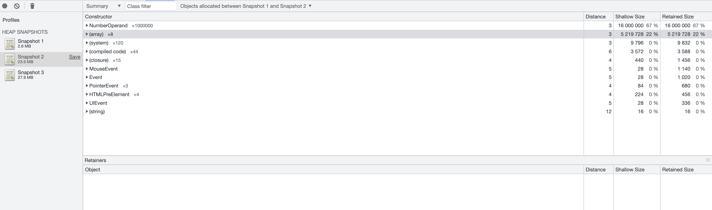
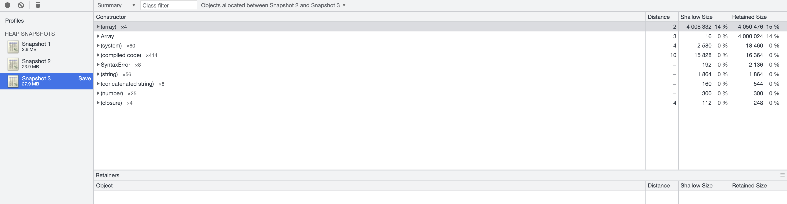
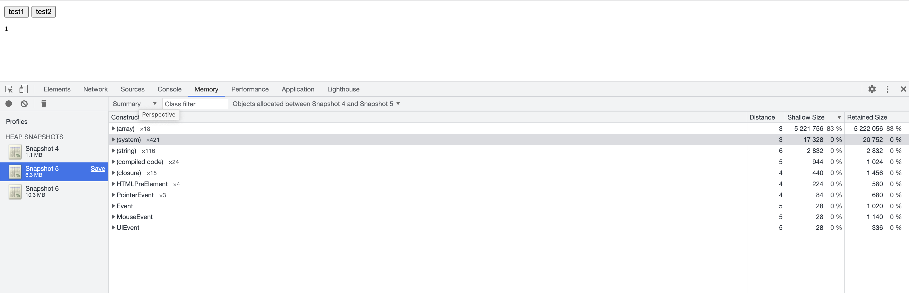
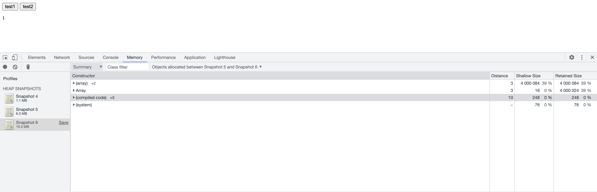

# 内存测试

# object

## 数组分配

```js
list = []
for (let index = 0; index < 1e6; index++) {
  list.push(new NumberOperand(index));
}
```



总结：每个 NumberOperand 对象实例占用 16 Byte 内存，100 万个占用 16_000_000 个字节。此外，数组本身需要占用内存，100 万长度的数组占用 5 百万个字节（平均每个数组项占用 5 个字节）。

## 数组拷贝


```js
his = [];
his.push(list.slice(0)); // list 是上文 100 万长度的 NumberOperand 数组
```



总结：数组拷贝时没有重新生成 NumberOperand 实例，只是拷贝后的新数组需要占用内存，新的数组长度也是 100 万，大约占用 50 万个字节（平均每个数组项占用 5 个字节）。

# number

## 数组分配

```js
list = []
for (let index = 0; index < 1e6; index++) {
  list.push(index);
}
```



## 数组拷贝


```js
his = [];
his.push(list.slice(0)); // list 是上文 100 万长度的 NumberOperand 数组
```


