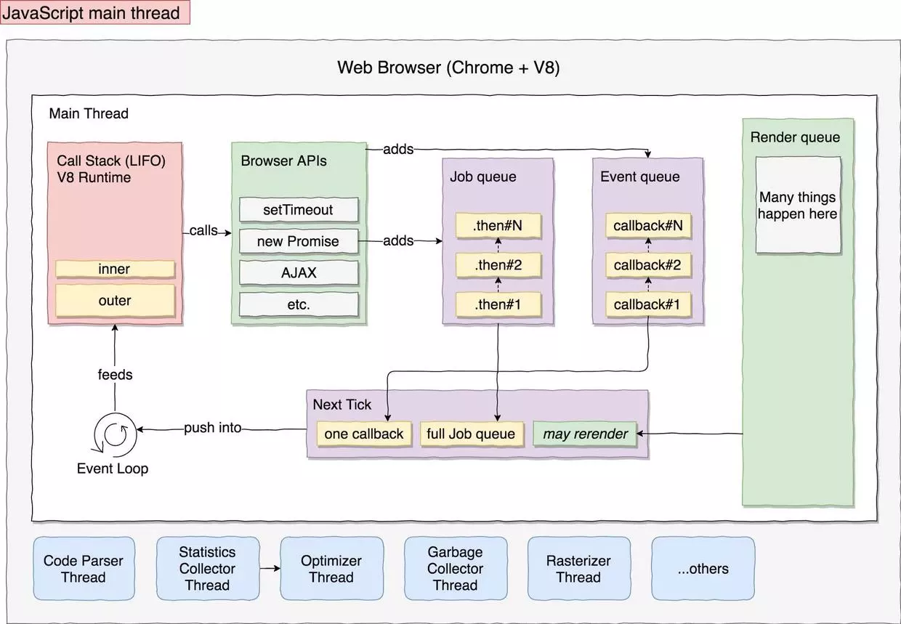

性能优化
========

- 首屏性能
- 动画性能

## 浏览器原理

### JavaScript 主线程工作原理

> 浏览器解析渲染 DOM Tree 和 CSS Tree，解析执行 JavaScript，几乎所有的操作都是在主线程中执行。因为 JavaScript 可以操作 DOM，影响渲染，所以 JavaScript 引擎线程和 UI 线程是互斥的。换句话说，JavaScript 代码执行时会阻塞页面的渲染。
>
> 
>
> 图中的几个关键角色：
>
> Call Stack：调用栈，即 JavaScript 代码执行的地方，Chrome 和 NodeJS 中对应 V8 引擎。当它执行完当前所有任务时，栈为空，等待接收 Event Loop 中 next Tick 的任务。
>
> Browser APIs：这是连接 JavaScript 代码和浏览器内部的桥梁，使得 JavaScript 代码可以通过 Browser APIs 操作 DOM，调用 setTimeout，AJAX 等。
>
> Event queue: 每次通过 AJAX 或者 setTimeout 添加一个异步回调时，回调函数一般会加入到 Event queue 当中。
>Job queue: 这是预留给 promise 且优先级较高的通道，代表着“稍后执行这段代码，但是在 next Event Loop tick 之前执行”。它属于 ES 规范，注意区别对待，这里暂不展开。
>
> Next Tick: 表示调用栈 call stack 在下一 tick 将要执行的任务。它由一个 Event queue 中的回调，全部的 job queue，部分或者全部 render queue 组成。注意 current tick 只会在 Job queue 为空时才会进入 next tick。这就涉及到 task 优先级了，可能大家对于 microtask 和 macrotask 更加熟悉，这里不再展开。
>
> Event Loop: 它会“监视”（轮询）call stack 是否为空，call stack 为空时将会由 Event Loop 推送 next tick 中的任务到 call stack 中。
>
> 在浏览器主线程中，JavaScript 代码在调用栈 call stack 执行时，可能会调用浏览器的 API，对 DOM 进行操作。也可能执行一些异步任务：这些异步任务如果是以回调的方式处理，那么往往会被添加到 Event queue 当中；如果是以 promise 处理，就会先放到 Job queue 当中。这些异步任务和渲染任务将会在下一个时序当中由调用栈处理执行。
>
> 理解了这些，大家就会明白：如果调用栈 call stack 运行一个很耗时的脚本，比如解析一个图片，call stack 就会像北京上下班高峰期的环路入口一样，被这个复杂任务堵塞。主线程其他任务都要排队，进而阻塞 UI 响应。这时候用户点击、输入、页面动画等都没有了响应。
>
> 我们一般有两种方案突破上文提到的瓶颈：
>
> 1. 将耗时高、成本高、易阻塞的长任务切片，分成子任务，并异步执行
>
> 2. 另外一个创新性的做法：使用 HTML5 Web worker

## 检测项目

- https://jsperf.com/
- https://github.com/web-perf

## 检测工具

- https://github.com/mrdoob/stats.js

## 参考文献

- [HTML5 Techniques for Optimizing Mobile Performance](https://www.html5rocks.com/en/mobile/optimization-and-performance/)
- [网页性能管理详解](http://www.ruanyifeng.com/blog/2015/09/web-page-performance-in-depth.html)
