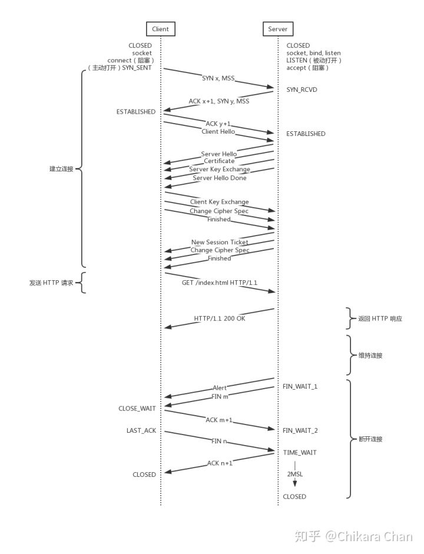

# 浏览器工作原理

- 功能
- 架构
- 网络
- 渲染

    1. HTML 解析
    2. DOM 树构建 + CSS 解析
    3. 渲染树构建
    4. 布局
    5. 绘制
    6. 重排与重绘

- CSS：可视化模型
- JavaScript：单线程 + 事件驱动

参考文献

- [browser how to work](https://www.google.com/search?newwindow=1&safe=active&ei=ALL8XJGYHtXa9APEm7OQCQ&q=browser+hwot+ot+work&oq=browser+hwot+ot+work) / [浏览器工作原理](https://www.google.com/search?q=%E6%B5%8F%E8%A7%88%E5%99%A8%E5%B7%A5%E4%BD%9C%E5%8E%9F%E7%90%86)
- [Round-up of Web Browser Internals Resources](https://developers.google.com/web/updates/2012/04/Round-up-of-Web-Browser-Internals-Resources)
- [浏览器的工作原理：新式网络浏览器幕后揭秘](https://www.html5rocks.com/zh/tutorials/internals/howbrowserswork/) / [How Browsers Work: Behind the scenes of modern web browsers](https://www.html5rocks.com/zh/tutorials/internals/howbrowserswork/#Dynamic_changes)

    - 浏览器架构

        - [A Reference Architecture for Web Browsers (pdf)](http://grosskurth.ca/papers/browser-refarch.pdf)
        - [How Browsers Work - Part 1 - Architecture](http://www.vineetgupta.com/2010/11/how-browsers-work-part-1-architecture/)

    - 解析

        - [The Bold and the Beautiful: two new drafts for HTML 5.](http://broadcast.oreilly.com/2009/05/the-bold-and-the-beautiful-two.html)

    - Firefox

        - [Faster HTML and CSS: Layout Engine Internals for Web Developers.](http://dbaron.org/talks/2008-11-12-faster-html-and-css/slide-6.xhtml) / [Faster HTML and CSS: Layout Engine Internals for Web Developers（Google 技术访谈视频）](https://www.youtube.com/watch?v=a2_6bGNZ7bA)
        - [Mozilla's Layout Engine](http://www.mozilla.org/newlayout/doc/layout-2006-07-12/slide-6.xhtml)
        - [Mozilla Style System Documentation](http://www.mozilla.org/newlayout/doc/style-system.html)
        - [Notes on HTML Reflow](http://www.mozilla.org/newlayout/doc/reflow.html)
        - [Gecko Overview](http://www.mozilla.org/newlayout/doc/gecko-overview.htm)
        - [The life of an HTML HTTP request](https://www.html5rocks.com/zh/tutorials/internals/howbrowserswork/#Dynamic_changes)

    - WebKit

        - [Implementing CSS（第一部分）](http://weblogs.mozillazine.org/hyatt/archives/cat_safari.html)
        - [An Overview of WebCore](http://weblogs.mozillazine.org/hyatt/WebCore/chapter2.html)
        - [WebCore Rendering](http://webkit.org/blog/114/)
        - [The FOUC Problem](http://webkit.org/blog/66/the-fouc-problem/)

    - HTML

        - [HTML 4.01 规范](http://www.w3.org/TR/html4/)
        - [W3C HTML5 规范](http://dev.w3.org/html5/spec/Overview.html)
        - [Parsing HTML documents](https://html.spec.whatwg.org/multipage/parsing.html)

    - CSS

        - [层叠样式表第 2 级第 1 次修改 (CSS 2.1) 规范](http://www.w3.org/TR/CSS2/)
        - [The CSS 2.1 processing model](https://www.w3.org/TR/CSS21/intro.html#processing-model)
        - [CSS 2 Box model](https://www.w3.org/TR/CSS2/box.html)
        - [Elaborate description of Stacking Contexts](https://www.w3.org/TR/CSS2/zindex.html)
        - [Grammar of CSS 2.1](https://www.w3.org/TR/CSS2/grammar.html)
- [Notes on “How Browsers Work” ](https://codeburst.io/how-browsers-work-6350a4234634)
- [聊聊 JavaScript 与浏览器的那些事 - 引擎与线程](https://hijiangtao.github.io/2018/01/08/JavaScript-and-Browser-Engines-with-Threads/)
- [JavaScript是如何工作的：渲染引擎和优化其性能的技巧](https://blog.fundebug.com/2019/01/14/browser-rendering-and-optimizaiton/)
- [浏览器的渲染原理简介](https://coolshell.cn/articles/9666.html)
- [Multi-process Architecture](https://www.chromium.org/developers/design-documents/multi-process-architecture)
- [Mobile Browser Internal (Blink Rendering Engine)](https://www.slideshare.net/HyungwookLee/mobilebrowserinternal-20140122)
- [从浏览器多进程到JS单线程，JS运行机制最全面的一次梳理](https://juejin.im/post/5a6547d0f265da3e283a1df7)
- [从 8 道面试题看浏览器渲染过程与性能优化](https://juejin.im/post/5e143104e51d45414a4715f7)
- [无线性能优化：Composite](https://fed.taobao.org/blog/taofed/do71ct/performance-composite/?spm=taofed.blogs.blog-list.10.67bd5ac8fHy0LS)
-  https://csstriggers.com/
- [GPU Accelerated Compositing in Chrome](http://www.chromium.org/developers/design-documents/gpu-accelerated-compositing-in-chrome)
- [史上最全！图解浏览器的工作原理](https://www.infoq.cn/article/CS9-WZQlNR5h05HHDo1b)

### 功能特性

> 浏览器的主要功能就是向服务器发出请求，在浏览器窗口中展示您选择的网络资源。这里所说的资源一般是指 HTML 文档，也可以是 PDF、图片或其他的类型。资源的位置由用户使用 URI（统一资源标示符）指定。
>
> 浏览器解释并显示 HTML 文件的方式是在 HTML 和 CSS 规范中指定的。这些规范由网络标准化组织 W3C（万维网联盟）进行维护。 

- 用来输入 URI 的地址栏
- 前进和后退按钮
- 书签设置选项
- 用于刷新和停止加载当前文档的刷新和停止按钮
- 用于返回主页的主页按钮

### 技术架构


- 用户界面 - 包括地址栏、前进/后退按钮、书签菜单等。除了浏览器主窗口显示的您请求的页面外，其他显示的各个部分都属于用户界面。
- 浏览器引擎 - 在用户界面和渲染引擎之间传送指令。
- 渲染引擎 - 负责显示请求的内容。如果请求的内容是 HTML，它就负责解析 HTML 和 CSS 内容，并将解析后的内容显示在屏幕上。
- 网络 - 用于网络调用，比如 HTTP 请求。其接口与平台无关，并为所有平台提供底层实现。
- 用户界面后端 - 用于绘制基本的窗口小部件，比如组合框和窗口。其公开了与平台无关的通用接口，而在底层使用操作系统的用户界面方法。
- JavaScript 解释器 - 用于解析和执行 JavaScript 代码。
- 数据存储 = 这是持久层。浏览器需要在硬盘上保存各种数据，例如 Cookie。新的 HTML 规范 (HTML5) 定义了“网络数据库”，这是一个完整（但是轻便）的浏览器内数据库。

## 网络知识

### 浏览器输入 URL 后发生了什么？


1. You enter a URL into a web browser
2. The browser looks up the IP address for the domain name via DNS
3. The browser sends a HTTP request to the server
4. The server sends back a HTTP response
5. The browser begins rendering the HTML
6. The browser sends requests for additional objects embedded in HTML (images, css, JavaScript) and repeats steps 3-5.
7. Once the page is loaded, the browser sends further async requests as needed.

参考文献

- [what happen when Type url on browser](https://www.google.com/search?q=what+happen+when+Type+url+on+browser&oq=what+happen+when+Type+url+on+browser) / [浏览器输入URL后发生了什么](https://www.google.com/search?q=%E6%B5%8F%E8%A7%88%E5%99%A8%E8%BE%93%E5%85%A5URL%E5%90%8E%E5%8F%91%E7%94%9F%E4%BA%86%E4%BB%80%E4%B9%88s)
- [What Happens When You Type in a URL](https://wsvincent.com/what-happens-when-url/)
- [What happens when you type an URL in the browser and press enter?](https://medium.com/@graceodonnell/what-happens-when-you-type-an-url-in-the-browser-and-press-enter-be22335fc3a0)
- [what-happens-when](https://github.com/alex/what-happens-when)
- [what happens when you type in a URL in browser [closed]](https://stackoverflow.com/questions/2092527/what-happens-when-you-type-in-a-url-in-browser)
- [细说浏览器输入URL后发生了什么](https://segmentfault.com/a/1190000012092552)
- [浏览器输入 URL 后发生了什么？](https://zhuanlan.zhihu.com/p/43369093)

### DNS 查询


1. 浏览器检查域名是否在缓存当中（要查看 Chrome 当中的缓存， 打开 chrome://net-internals/#dns)。
2. 如果缓存中没有，就去调用 gethostbyname 库函数（操作系统不同函数也不同）进行查询。
3. gethostbyname 函数在试图进行DNS解析之前首先检查域名是否在本地 Hosts 里，Hosts 的位置（不同的操作系统有所不同）。
4. 如果 gethostbyname 没有这个域名的缓存记录，也没有在 hosts 里找到，它将会向 DNS 服务器发送一条 DNS 查询请求（使用 53 端口向 DNS 服务器发送 UDP 请求包，如果响应包太大，会使用 TCP 协议）。DNS 服务器是由网络通信栈提供的，通常是本地路由器或者 ISP 的缓存 DNS 服务器。
5. 如果本地/ISP DNS 服务器没有找到结果，它会发送一个递归查询请求，一层一层向高层 DNS 服务器做查询，直到查询到起始授权机构，如果找到会把结果返回。

参考文献

- [DNS 原理入门](http://www.ruanyifeng.com/blog/2016/06/dns.html)
- [DNS 查询](https://github.com/skyline75489/what-happens-when-zh_CN#dns-%E6%9F%A5%E8%AF%A2)
- [ARP 过程](https://github.com/skyline75489/what-happens-when-zh_CN#arp-%E8%BF%87%E7%A8%8B)
- [DNS解析的过程是什么，求详细的？]
- [How to clear/flush the DNS cache in Google Chrome?](https://superuser.com/questions/203674/how-to-clear-flush-the-dns-cache-in-google-chrome)

### TCP 连接和关闭



- [使用套接字](https://github.com/skyline75489/what-happens-when-zh_CN#%E4%BD%BF%E7%94%A8%E5%A5%97%E6%8E%A5%E5%AD%97)
- [TLS 握手](https://github.com/skyline75489/what-happens-when-zh_CN#tls)
- [TCP的keepalive和HTTP的keepalive之间的关系？](https://www.zhihu.com/question/24437644)
- [聊聊 TCP 中的 KeepAlive 机制](https://zhuanlan.zhihu.com/p/28894266)

### HTTP 请求和响应

- [HTTP 协议](https://github.com/skyline75489/what-happens-when-zh_CN#http-%E5%8D%8F%E8%AE%AE)
- [HTTP 服务器请求处理](https://github.com/skyline75489/what-happens-when-zh_CN#http-%E6%9C%8D%E5%8A%A1%E5%99%A8%E8%AF%B7%E6%B1%82%E5%A4%84%E7%90%86)
- [HTTP Keep-Alive是什么？如何工作？](http://www.nowamagic.net/academy/detail/23350305)
- HTTP2

    - [HTTP 协议入门](http://www.ruanyifeng.com/blog/2016/08/http.html)
    - [HTTP/2 服务器推送（Server Push）教程](http://www.ruanyifeng.com/blog/2018/03/http2_server_push.html)

### HTTP 缓存

- [HTTP caching](https://developer.mozilla.org/en-US/docs/Web/HTTP/Caching)

    - [Last-Modified](https://developer.mozilla.org/en-US/docs/Web/HTTP/Headers/Last-Modified)

- [Hypertext Transfer Protocol (HTTP/1.1): Caching](https://tools.ietf.org/html/rfc7234#section-4.2.1)
- [HTTP协议：缓存](https://kb.cnblogs.com/page/166267/)
- [浏览器缓存机制剖析](http://louiszhai.github.io/2017/04/07/http-cache/)
- [Increasing Application Performance with HTTP Cache Headers](https://devcenter.heroku.com/articles/increasing-application-performance-with-http-cache-headers)
- [Best practices for cache control settings for your website](https://medium.com/pixelpoint/best-practices-for-cache-control-settings-for-your-website-ff262b38c5a2)
- [A Web Developer’s Guide to Browser Caching](https://medium.com/@codebyamir/a-web-developers-guide-to-browser-caching-cc41f3b73e7c)
- [HTTP 缓存](https://developers.google.com/web/fundamentals/performance/optimizing-content-efficiency/http-caching)
- [How does the browser cache work?](https://pressidium.com/blog/2017/browser-cache-work/)
- [Caching Tutorial ](https://www.mnot.net/cache_docs/)

启发式缓存（Heuristic Expiration）

- [Heuristic Expiration](https://www.w3.org/Protocols/rfc2616/rfc2616-sec13.html#sec13.2.2)
- [Calculating Heuristic Freshness](https://tools.ietf.org/html/rfc7234#section-4.2.2)
- [What heuristics do browsers use to cache resources not explicitly set to be cachable?](https://stackoverflow.com/questions/14345898/what-heuristics-do-browsers-use-to-cache-resources-not-explicitly-set-to-be-cach)
- [Heuristic Expiration](https://books.google.co.id/books?id=qEoOl9bcV_cC&pg=PT202&lpg=PT202&dq=Heuristic+Expiration&source=bl&ots=zyrSUuKvae&sig=ACfU3U04gIJr69aS16EqD5ZfCCcZ3QgktA&hl=en&sa=X&ved=2ahUKEwj38pqWsv7iAhUHHDQIHf7ACgAQ6AEwDnoECAkQAQ#v=onepage&q=Heuristic%20Expiration&f=false)
- [How 'Last-Modified' and 'If-Modified-Since' headers work?](https://www.logicbig.com/quick-info/web/last-modified-and-if-modified-since.html)
- [Problems with Last-Modified caching](https://stackoverflow.com/questions/19766256/problems-with-last-modified-caching)

Memory Cache VS Disk Cache

- [Chrome memory cache vs disk cache](https://stackoverflow.com/questions/44596937/chrome-memory-cache-vs-disk-cache/48557278)

### 网络变迁

| Generation | Icon | Technology | Maximum Download Speed | Typical Download Speed |
| --- | --- | --- | --- | --- | --- |
| 2G | G | GPRS | 0.1Mbit/s | <0.1Mbit/s |
| | E | EDGE | 0.3Mbit/s | 0.1Mbit/s |
| 3G | 3G | 3G (Basic) | 0.3Mbit/s | 0.1Mbit/s |
| | H | HSPA | 7.2Mbit/s | 1.5Mbit/s |
| | H+ | HSPA+ | 21Mbit/s | 4Mbit/s |
| | H+ | DC-HSPA+ | 42Mbit/s | 8Mbit/s |
| 4G | 4G | LTE Category 4 | 150Mbit/s | 12-15Mbit/s |
| 4G+ |	4G+ | LTE-Advanced Cat6 | 300Mbit/s | 24-30Mbit/s |
| | 4G+ | LTE-Advanced Cat9 | 450Mbit/s | 60Mbit/s |
| | 4G+ | LTE-Advanced Cat12 | 600Mbit/s | TBC |
| | 4G+ | LTE-Advanced Cat16 | 979Mbit/s | TBC |
| 5G | 5G | 5G | 1,000-10,000Mbit/s(1-10Gbit/s) | TBC


| Generation | Typical Latency |
| --- | --- |
| 2G | 500ms (0.5 seconds) |
| 3G | 100ms (0.1 seconds) |
| 4G | 50ms (0.05 seconds) |
| 5G | 1ms (0.001 seconds)* |


- [Download Speeds: What Do 2G, 3G, 4G & 5G Actually Mean?](https://kenstechtips.com/index.php/download-speeds-2g-3g-and-4g-actual-meaning)
- 测试网站

    - [Google’s Speed Test](https://www.google.co.uk/search?q=speed+test)
    - [Netflix’s Fast.com](https://fast.com/)
    - [Ookla’s SpeedTest.net](http://www.speedtest.net/)

## 渲染引擎

> 渲染引擎，又称渲染引擎，也被称为浏览器内核，在线程方面又称为 UI 线程。


- [browser render engine](https://www.google.com/search?q=browser+render+engine)
- [浏览器渲染引擎](https://zhuanlan.zhihu.com/p/35295235)
- [渲染树构建、布局及绘制](https://developers.google.com/web/fundamentals/performance/critical-rendering-path/render-tree-construction)
- [What's the difference between a browser engine and rendering engine?](https://stackoverflow.com/questions/46169376/whats-the-difference-between-a-browser-engine-and-rendering-engine)
- [【FE】浏览器渲染引擎「内核」](https://github.com/zwwill/blog/issues/2)


### 有哪些渲染引擎？

> 各大浏览器厂商依照 W3C 标准自行研发的，常见的浏览器内核可以分这四种：Trident、Gecko、Blink、Webkit。

内核 | 浏览器 | 出生年份 | JS 引擎 | 开源
-------| -----| ---------| -------------| --------|----
Trident | IE4 - IE11| 1997 | JScript，9+chakra |
Gecko | Firefox | 2004 | SpiderMonkey | MPL | 
WebKit | Safari,Chromium,Chrome(-2013) ,Android浏览器,ChromeOS,WebOS 等 | 2005| WebCore + JavascriptCore | BSD
Blink | Chrome, Opera | 2013 | V8 | GPL
Edge | Edge | 2015 | EdgeHTML + Chakra | MIT(chakra)

疑问：浏览器内核，浏览器引擎，渲染引擎，JavaScript 引擎之间的区别和关系？

> 浏览器内核又可以分为渲染引擎和 JavaScript 引擎，最开始渲染引擎和 JS 引擎并没有区分的很明确，后来 JS 引擎越来越独立，内核就倾向于只指渲染引擎。

- [浏览器内核、JavaScript引擎和排版引擎](https://hehuiyun.github.io/2017/11/16/%E6%B5%8F%E8%A7%88%E5%99%A8%E5%86%85%E6%A0%B8%E3%80%81JavaScript%E5%BC%95%E6%93%8E%E5%92%8C%E6%8E%92%E7%89%88%E5%BC%95%E6%93%8E/)

### 渲染引擎的工作原理


Webkit VS Gecko


虽然 WebKit 和 Gecko 使用的术语略有不同，但整体流程是基本相同的。

Gecko 将视觉格式化元素组成的树称为“框架树”。每个元素都是一个框架。WebKit 使用的术语是“渲染树”，它由“渲染对象”组成。对于元素的放置，WebKit 使用的术语是“布局”，而 Gecko 称之为“重排”。对于连接 DOM 节点和可视化信息从而创建渲染树的过程，WebKit 使用的术语是“附加”。有一个细微的非语义差别，就是 Gecko 在 HTML 与 DOM 树之间还有一个称为“内容槽”的层，用于生成 DOM 元素。

#### 1. 解析

渲染引擎将开始解析 HTML 文档，并将各标记逐个转化成“内容树”上的 DOM 节点。同时也会解析外部 CSS 文件以及样式元素中的样式数据。

##### 解析是什么？

解析文档是指将文档转化成为有意义的结构，也就是可让代码理解和使用的结构。解析得到的结果通常是代表了文档结构的节点树，它称作解析树或者语法树。解析的过程可以分成两个子过程：词法分析和语法分析。解析器通常将解析工作分给以下两个组件来处理：词法分析器（有时也称为标记生成器），负责将输入内容分解成一个个有效标记；而解析器负责根据语言的语法规则分析文档的结构，从而构建解析树。

    - 词法分析是将输入内容分割成大量标记的过程。标记是语言中的词汇，即构成内容的单位。在人类语言中，它相当于语言字典中的单词。
    - 语法分析是应用语言的语法规则的过程。

翻译：很多时候，解析树还不是最终产品。解析通常是在翻译过程中使用的，而翻译是指将输入文档转换成另一种格式。编译就是这样一个例子。编译器可将源代码编译成机器代码，具体过程是首先将源代码解析成解析树，然后将解析树翻译成机器代码文档。

自动生成解析器：有一些工具可以帮助您生成解析器，它们称为解析器生成器。您只要向其提供您所用语言的语法（词汇和语法规则），它就会生成相应的解析器。创建解析器需要对解析有深刻理解，而人工创建并优化解析器并不是一件容易的事情，所以解析器生成器是非常实用的。WebKit 使用了两种非常有名的解析器生成器：用于创建词法分析器的 [Flex](http://en.wikipedia.org/wiki/Flex_lexical_analyser) 以及用于创建解析器的 Bison（您也可能遇到 Lex 和 Yacc 这样的别名）。Flex 的输入是包含标记的正则表达式定义的文件。Bison 的输入是采用 [BNF](http://www.gnu.org/software/bison/) 格式的语言语法规则。


##### HTML 解析

1. HTML 解析器的任务是将 HTML 标记解析成解析树，HTML 的词汇和语法在 W3C 组织创建的规范中进行了定义。
2. 所有的常规解析器都不适用于 HTML（我并不是开玩笑，它们可以用于解析 CSS 和 JavaScript）。HTML 并不能很容易地用解析器所需的与上下文无关的语法来定义。

    - 语言的宽容本质。
    - 浏览器历来对一些常见的无效 HTML 用法采取包容态度。
    - 解析过程需要不断地反复。源内容在解析过程中通常不会改变，但是在 HTML 中，脚本标记如果包含 document.write，就会添加额外的标记，这样解析过程实际上就更改了输入内容。

3. 由于不能使用常规的解析技术，浏览器就创建了自定义的解析器来解析 HTML。[HTML5 规范详细地描述了解析算法](https://html.spec.whatwg.org/multipage/parsing.html)，此算法由两个阶段组成：标记化和树构建。


```html
<html>
  <body>
    <p>
      Hello World
    </p>
    <div> </div>
  </body>
</html>
```


ps：DOM 也是由 W3C 组织指定的。请参见 www.w3.org/DOM/DOMTR。

##### CSS 解析

和 HTML 不同，CSS 是上下文无关的语法，可以使用简介中描述的各种解析器进行解析。事实上，CSS 规范定义了 [CSS 的词法和语法](http://www.w3.org/TR/CSS2/grammar.html)。

WebKit 使用 Flex 和 Bison 解析器生成器，通过 CSS 语法文件自动创建解析器。


解析器都会将 CSS 文件解析成 StyleSheet 对象，且每个对象都包含 CSS 规则。CSS 规则对象则包含选择器和声明对象，以及其他与 CSS 语法对应的对象。

```js
document.styleSheets
```


理论上来说，应用样式表不会更改 DOM 树，因此似乎没有必要等待样式表并停止文档解析。但这涉及到一个问题，就是脚本在文档解析阶段会请求样式信息。如果当时还没有加载和解析样式，脚本就会获得错误的回复，这样显然会产生很多问题。这看上去是一个非典型案例，但事实上非常普遍。Firefox 在样式表加载和解析的过程中，会禁止所有脚本。

- [css-block-render.html](./examples/css-block-render.html)
- [css-block-script.html](./examples/css-block-script.html)

##### JavaScript 解析

脚本

HTML 文档在解析器遇到 `<script>` 标记时立即解析并执行脚本，且文档的解析将停止，直到脚本执行完毕。如果脚本是外部的，那么解析过程会停止，直到从网络同步抓取资源完成后再继续。此模型已经使用了多年，也在 HTML4 和 HTML5 规范中进行了指定。

预解析

。在执行脚本时，其他线程会解析文档的其余部分，找出并加载需要通过网络加载的其他资源。通过这种方式，资源可以在并行连接上加载，从而提高总体速度。请注意，预解析器不会修改 DOM 树，而是将这项工作交由主解析器处理；预解析器只会解析外部资源（例如外部脚本、样式表和图片）的引用。

异步

此外，也可以将脚本标注为“defer”，这样它就不会停止文档解析，而是等到解析结束才执行。HTML5 增加了一个选项，可将脚本标记为异步，以便由其他线程解析和执行。


参考文献

- [Deep dive into the murky waters of script loading](https://www.html5rocks.com/zh/tutorials/speed/script-loading/)

#### 2. 构建渲染树

渲染树是由可视化元素按照其显示顺序而组成的树，也是文档的可视化表示。它的作用是让您按照正确的顺序绘制内容。

WebKit 将呈现树中的元素称为渲染器或渲染对象。渲染器知道如何布局并将自身及其子元素绘制出来。 WebKits RenderObject 类是所有呈现器的基类，其定义如下：

```c++
class RenderObject{
  virtual void layout();
  virtual void paint(PaintInfo);
  virtual void rect repaintRect();
  Node* node;  //the DOM node
  RenderStyle* style;  // the computed style
  RenderLayer* containgLayer; //the containing z-index layer
}
```

每一个渲染器都代表了一个矩形的区域，通常对应于相关节点的 CSS 框，这一点在 CSS2 规范中有所描述。它包含诸如宽度、高度和位置等几何信息。 它包含诸如宽度、高度和位置等几何信息。框的类型会受到与节点相关的“display”样式属性的影响。

##### 呈现树和 DOM 树的关系

呈现器是和 DOM 元素相对应的，但并非一一对应。非可视化的 DOM 元素不会插入呈现树中，例如“head”元素。如果元素的 display 属性值为“none”，那么也不会显示在呈现树中（但是 visibility 属性值为“hidden”的元素仍会显示）。

有一些 DOM 元素对应多个可视化对象。它们往往是具有复杂结构的元素，无法用单一的矩形来描述。例如，“select”元素有 3 个呈现器：一个用于显示区域，一个用于下拉列表框，还有一个用于按钮。如果由于宽度不够，文本无法在一行中显示而分为多行，那么新的行也会作为新的呈现器而添加。 

有一些呈现对象对应于 DOM 节点，但在树中所在的位置与 DOM 节点不同。浮动定位和绝对定位的元素就是这样，它们处于正常的流程之外，放置在树中的其他地方，并映射到真正的框架，而放在原位的是占位框架。


#### 3. 布局

呈现器在创建完成并添加到呈现树时，并不包含位置和大小信息。计算这些值的过程称为布局或重排。布局为每个节点分配一个应出现在屏幕上的确切坐标。

布局是一个递归的过程。它从根呈现器（对应于 HTML 文档的 `<html>` 元素）开始，然后递归遍历部分或所有的框架层次结构，为每一个需要计算的呈现器计算几何信息。

根呈现器的位置左边是 0,0，其尺寸为视口（也就是浏览器窗口的可见区域）。

所有的呈现器都有一个“layout”或者“reflow”方法，每一个呈现器都会调用其需要进行布局的子代的 layout 方法。


#### 4. 绘制

渲染引擎会遍历渲染树，由用户界面后端层将每个节点绘制出来。

#### 5. 动态变化(重排和重绘)

在发生变化时，浏览器会尽可能做出最小的响应。因此，元素的颜色改变后，只会对该元素进行重绘。元素的位置改变后，只会对该元素及其子元素（可能还有同级元素）进行布局和重绘。添加 DOM 节点后，会对该节点进行布局和重绘。一些重大变化（例如增大“html”元素的字体）会导致缓存无效，使得整个呈现树都会进行重新布局和绘制。

#### 6. 总结

1. 
2. 渲染引擎会力求尽快将内容显示在屏幕上。它不必等到整个 HTML 文档解析完毕之后，就会开始构建渲染树和设置布局。在不断接收和处理来自网络的其余内容的同时，渲染引擎会将部分内容解析并显示出来。。


测试示例

- [render-progressive.html](./examples/render-progressive.html)：测试渲染引擎的渐进式渲染和 JS 阻塞

#### Firefox Quantum

- [servo](https://github.com/servo/servo)
- [webrender](https://github.com/servo/webrender)
- [WebRender：让网页渲染如丝顺滑](https://www.zcfy.cc/article/the-whole-web-at-maximum-fps-how-webrender-gets-rid-of-jank-x2605-mozilla-hacks-8211-the-web-developer-blog-4386.html?t=new) / [The whole web at maximum FPS: How WebRender gets rid of jank](https://hacks.mozilla.org/2017/10/the-whole-web-at-maximum-fps-how-webrender-gets-rid-of-jank/)
- [Inside a super fast CSS engine: Quantum CSS (aka Stylo)](https://hacks.mozilla.org/2017/08/inside-a-super-fast-css-engine-quantum-css-aka-stylo/)
- [进入 Quantum 时代——Firefox 如何恢复快速，又将如何变得更快？](https://www.infoq.cn/article/how-firefox-got-fast-again-and-where-its-going-to-get-faster)
- [Life is short , You never need Flutter](https://zhuanlan.zhihu.com/p/73792459)
- [Firefox with WebRender vs Chrome scrolling](https://www.reddit.com/r/firefox/comments/afpxf4/firefox_with_webrender_vs_chrome_scrolling/)
- [How much faster is WebRender?](https://www.reddit.com/r/firefox/comments/amnp7j/how_much_faster_is_webrender/)
- [WebRender Status (nvidia)](https://metrics.mozilla.com/webrender/dashboard_nvidia.html)
- [Firefox Quantum is super fast, while still conserving memory](https://blog.mozilla.org/firefox/quantum-performance-test/)

## JavaScript 引擎

- [how javascript work](https://www.google.com/search?q=how+javascript+work&oq=how+javascript+work) / [javascript 是怎么工作的](https://www.google.com/search?q=javascript+%E6%98%AF%E6%80%8E%E4%B9%88%E5%B7%A5%E4%BD%9C%E7%9A%84) / [JavaScript 工作原理](https://www.google.com/search?q=JavaScript+%E5%B7%A5%E4%BD%9C%E5%8E%9F%E7%90%86)
- [原来JavaScript是这样运行的](https://juejin.im/post/5c6a732151882528735f2d33?)

### JavaScript 特性

- 单线程
- 非阻塞 I/O
- 事件驱动

参考文献

- JavaScript

    - [我对 javascript 事件驱动机制的理解](https://juejin.im/post/59e21e8551882578db27c364)
    - [How JavaScript works in browser and node?](https://itnext.io/how-javascript-works-in-browser-and-node-ab7d0d09ac2f)
    - [What exactly is an Event-loop?](https://blog.rapid7.com/2016/07/27/what-exactly-is-an-event-loop/)
    - [Concurrency model and Event Loop](https://developer.mozilla.org/en-US/docs/Web/JavaScript/EventLoop)
    - [The JavaScript Event Loop: Explained](https://blog.carbonfive.com/2013/10/27/the-javascript-event-loop-explained/)
    - [第一期：JavaScript单线程与异步](https://cloud.tencent.com/developer/article/1393277)

- Node.js

    - [Node.js十问十答](https://www.jianshu.com/p/936d00cb23d8)
    - [Node.js的核心概念——单线程，非阻塞，事件驱动](https://github.com/jawil/Node.js/issues/2)
    - [Nodejs探秘：深入理解单线程实现高并发原理](https://imweb.io/topic/5b6cf97093759a0e51c917c8)
    - [Node.js 探秘：初识单线程的 Node.js](http://taobaofed.org/blog/2015/10/29/deep-into-node-1/)
    - [nodejs真的是单线程吗？](https://segmentfault.com/a/1190000014926921)
    - [Node.js 事件循环机制](https://www.cnblogs.com/onepixel/p/7143769.html)
    - [Node.js event loop architecture](https://medium.com/preezma/node-js-event-loop-architecture-go-deeper-node-core-c96b4cec7aa4)
    - [浅谈 Node.js 单线程模型](http://web.jobbole.com/91687/)
    - [javascript单线程异步与执行机制](https://www.xc123.net/art/detail/39)
    - [Node.js的事件驱动模型](http://www.edwardesire.com/2015/05/09/nodejs-event-model/)

- [Concurrency VS Event Loop](https://www.google.com/search?newwindow=1&safe=active&ei=ohX9XKmaJZLh-gS4s4TYAg&q=concurrency+vs+event+loop&oq=concurrency+vs+event+loop) / [事件驱动 vs 多线程](https://www.google.com/search?q=%E4%BA%8B%E4%BB%B6%E9%A9%B1%E5%8A%A8+vs+%E5%A4%9A%E7%BA%BF%E7%A8%8B)

    - [阻塞对比非阻塞一览](https://nodejs.org/zh-cn/docs/guides/blocking-vs-non-blocking/)
    - [并发编程模型：事件驱动 vs 线程](https://zhuanlan.zhihu.com/p/32961438)
    - [为什么使用多线程在大多数情况下是个坏注意？](http://alexiachen.github.io/blog/2018/03/20/why-threads-bad-idea/)
    - [事件驱动引擎会取代多线程编程吗](https://cloud.tencent.com/developer/article/1354148)
    - [What are the differences between event-driven and thread-based server system?](https://stackoverflow.com/questions/25280207/what-are-the-differences-between-event-driven-and-thread-based-server-system)
    - [What Makes Node.js Faster Than Java?](https://strongloop.com/strongblog/node-js-is-faster-than-java/)
    - [How Node.Js Single Thread mechanism Work ? Understanding Event Loop in NodeJs](https://codeburst.io/how-node-js-single-thread-mechanism-work-understanding-event-loop-in-nodejs-230f7440b0ea)
    - [Node.js 软肋之 CPU 密集型任务](https://www.sohamkamani.com/blog/2016/03/14/wrapping-your-head-around-async-programming/)
    - [Concurrency vs Event Loop vs Event Loop + Concurrency](https://medium.com/@tigranbs/concurrency-vs-event-loop-vs-event-loop-concurrency-eb542ad4067b)

- C10K 问题

    - [C10K问题](https://juejin.im/post/5aeb2da8f265da0b807095bf)
    - [聊聊C10K问题及解决方案](https://cloud.tencent.com/developer/article/1031629)
    - [程序员怎么会不知道 C10K 问题呢？](https://medium.com/@chijianqiang/%E7%A8%8B%E5%BA%8F%E5%91%98%E6%80%8E%E4%B9%88%E4%BC%9A%E4%B8%8D%E7%9F%A5%E9%81%93-c10k-%E9%97%AE%E9%A2%98%E5%91%A2-d024cb7880f3)
    - [Node.js异步处理CPU密集型任务](https://gist.github.com/JacksonTian/11168086)

### 为什么要单线程？

> JavaScript的单线程，与它的用途有关。作为浏览器脚本语言，JavaScript的主要用途是与用户互动，以及操作DOM。这决定了它只能是单线程，否则会带来很复杂的同步问题。比如，假定JavaScript同时有两个线程，一个线程在某个DOM节点上添加内容，另一个线程删除了这个节点，这时浏览器应该以哪个线程为准？ —— [JavaScript 运行机制详解：再谈Event Loop](http://www.ruanyifeng.com/blog/2014/10/event-loop.html)


参考文献

- [Why doesn't JavaScript support multithreading?](https://stackoverflow.com/questions/39879/why-doesnt-javascript-support-multithreading)
- [Multithreading Javascript](https://medium.com/techtrument/multithreading-javascript-46156179cf9a)
- [Multi-threading in JavaScript](https://www.sitepoint.com/multi-threading-javascript/)
- [Why Web Workers Make JavaScript More Than a Single Thread](https://codeburst.io/why-web-workers-make-javascript-more-than-a-single-thread-3d489ffad502)
- [Concurrency model and Event Loop](https://developer.mozilla.org/en-US/docs/Web/JavaScript/EventLoop)
- [Parallel programming in JavaScript using Web Workers](https://itnext.io/achieving-parallelism-in-javascript-using-web-workers-8f921f2d26db)

#### 可以使用多线程操作 UI 吗？

如果 UI 组件（无论是浏览器的 DOM 操作还是移动端的 View 操作）是非线程安全的（[什么是线程安全？](https://blog.csdn.net/suifeng3051/article/details/52164267)），假定有两个线程，一个线程在界面修改内容，同时另一个线程删除这个内容，那么以哪个线程结果为准呢？如果实现类似 Java 线程安全的容器，让 UI 组件变得也是线程安全的，那么内部必须存在线程锁机制，但是怎么界定那些 UI 属性能够同时生效呢？而且这样会耗费大量资源并拖慢运行速度。

在 [Thread-Safe Class Design](https://link.juejin.im/?target=https%3A%2F%2Fwww.objc.io%2Fissues%2F2-concurrency%2Fthread-safe-class-design%2F) 一文提到：

> It’s a conscious design decision from Apple’s side to not have UIKit be thread-safe. Making it thread-safe wouldn’t buy you much in terms of performance; it would in fact make many things slower. And the fact that UIKit is tied to the main thread makes it very easy to write concurrent programs and use UIKit. All you have to do is make sure that calls into UIKit are always made on the main thread. —— 大意为把 UIKit 设计成线程安全并不会带来太多的便利，也不会提升太多的性能表现，甚至会因为加锁解锁而耗费大量的时间。事实上并发编程也没有因为 UIKit 是线程不安全而变得困难，我们所需要做的只是要确保 UI 操作在主线程进行就可以了。

#### 其他客户端也是这样的吗？

- Android

    

    1. Android 应用启动时，系统会为应用创建一个名为“主线程”的执行线程，它是应用与 Android UI 工具包组件进行交互的线程，因此，主线程有时也称为 UI 线程。
    2. 系统不会为每个组件实例创建单独的线程，运行于同一进程的所有组件均在 UI 线程中实例化，并且对每个组件的系统调用均由该线程进行分派。
    3. 除了 UI 主线程外，Android 支持工作线程，用来处理一些复杂的交互计算。但是 Android UI 组件是非线程安全的（什么样才是线程安全呢？类似 Java 线程安全的数据结构 `ConcurrentHashMap`，参考 [如何证明一个数据结构是线程安全的？](https://www.zhihu.com/question/26595480)），不能通过非 UI 线程操作 UI。

        - 不要阻塞 UI 线程 —— 使用工作线程来处理复杂的计算
        - 不要在 UI 线程之外操作 Android UI 组件

    参考

    - [进程和线程](https://developer.android.com/guide/components/processes-and-threads.html#ThreadSafe)
    - [Why non UI thread can modify UI?](https://stackoverflow.com/questions/48727254/why-non-ui-thread-can-modify-ui)

- iOS

    - [iOS拾遗——为什么必须在主线程操作UI](https://juejin.im/post/5c406d97e51d4552475fe178)

#### JavaScript 有工作线程吗？

> 为了利用多核CPU的计算能力，HTML5提出Web Worker标准，允许JavaScript脚本创建多个线程，但是子线程完全受主线程控制，且不得操作DOM。所以，这个新标准并没有改变JavaScript单线程的本质。

现代浏览器都开始支持 [Web Worker](https://developer.mozilla.org/en-US/docs/Web/API/Web_Workers_API/Using_web_workers)，它是独立于 JavaScript 主线程外的后台线程，可以执行任务而不干扰用户界面（也做不到）。

实际应用

- [redux-worker](https://github.com/chikeichan/redux-worker) 是一个 redux 中间件，将 reducer 迁移到 web worker 上运行

    使用 redux + web worker 来解决 [八皇后问题](https://baike.baidu.com/item/%E5%85%AB%E7%9A%87%E5%90%8E%E9%97%AE%E9%A2%98/11053477?fr=aladdin)

- [antimatter15/jsgif](https://github.com/antimatter15/jsgif) 使用 web Worker 来生成 GIF 图，避免主线程卡主
- [如何使用worker预加载图片](https://juejin.im/post/5a0875fcf265da431f4a8ddc)
- [What are the use-cases for Web Workers? [closed]](https://stackoverflow.com/questions/2773682/what-are-the-use-cases-for-web-workers)
- [深入 HTML5 Web Worker 应用实践：多线程编程](https://www.ibm.com/developerworks/cn/web/1112_sunch_webworker/index.html)

### 单线程怎么解决 I/O 阻塞问题？

单线程就意味着，所有任务需要排队，前一个任务结束，才会执行后一个任务。如果前一个任务耗时很长，后一个任务就不得不一直等着。

而 I/O 操作一般都是比较耗时的（比如 Ajax 操作从网络读取数据），假设 I/O 操作会阻塞 JavaScript 线程（很多前端开发人员理所当然的认为 I/O 就是非阻塞的，然而很多编程语言并不是这样，例如 Java 语言的 I/O 操作就是阻塞线程的），这样便导致 Web 页面卡主。

为了避免 I/O 阻塞主线程，JavaScript 语言的设计者将 I/O 操作都交给非主线程处理，调用 I/O 操作的时候只要给个回调函数，其他工作线程处理完 I/O 操作后在将处理结果传给回调函数，而主线程不需要等待 I/O 操作就可以继续处理下个一个任务。

ps：

JavaScript 所有 I/O 都是非阻塞的吗？

答案：否。[XMLHttp​Request​](https://developer.mozilla.org/en-US/docs/Web/API/XMLHttpRequest/open#Parameters) 也支持同步调用，window.alert 也是同步的。—— 参考示例 [javascript-io-block.html](./.assets/javascript-io-block.html)

[](https://codesandbox.io/s/javascript-io-block-pccsj?fontsize=14)

### JavaScript 主线程工作原理


ps: 从左到右，从上倒下分析各个部分。

- Call Stack：调用栈（后进先出），即 JavaScript 代码执行的地方，Chrome 和 NodeJS 中对应 V8 引擎。当它执行完当前所有任务时，栈为空，等待接收 Event Loop 中 next Tick 的任务。

    - [[译] 理解 JavaScript 中的执行上下文和执行栈](https://juejin.im/post/5ba32171f265da0ab719a6d7)
    - [Stack的三种含义](http://www.ruanyifeng.com/blog/2013/11/stack.html)
    - [什么是堆？什么是栈？他们之间有什么区别和联系？](https://www.zhihu.com/question/19729973)
    - [Stack vs Heap. What’s the difference and why should I care?](https://medium.com/@nickteixeira/stack-vs-heap-whats-the-difference-and-why-should-i-care-5abc78da1a88)
    - [What and where are the stack and heap?](https://stackoverflow.com/questions/79923/what-and-where-are-the-stack-and-heap)
    - [Microtask and Macrotask: A Hands-on Approach](https://blog.bitsrc.io/microtask-and-macrotask-a-hands-on-approach-5d77050e2168)
    - [Microtasks & Macrotasks — More On The Event Loop](https://abc.danch.me/microtasks-macrotasks-more-on-the-event-loop-881557d7af6f)
    - [Tasks, microtasks, queues and schedules](https://jakearchibald.com/2015/tasks-microtasks-queues-and-schedules/)

- Browser APIs：这是连接 JavaScript 代码和浏览器内部的桥梁，使得 JavaScript 代码可以通过 Browser APIs 操作 DOM，调用 setTimeout，AJAX 等。
- Job queue: 这是预留给 promise 且优先级较高的通道，代表着“稍后执行这段代码，但是在 next Event Loop tick 之前执行”（它属于 ES 规范）。

    - [macrotask与microtask](http://www.ayqy.net/blog/javascript-macrotask-vs-microtask/)
    - [45.理解事件循环二(macrotask和microtask)](https://github.com/ccforward/cc/issues/48)
    - [Microtasks and event loop](https://javascript.info/microtask-queue)
    - [理解 JavaScript 中的 macrotask 和 microtask](https://juejin.im/entry/58d4df3b5c497d0057eb99ff)
    - [HTML系列：macrotask和microtask](https://zhuanlan.zhihu.com/p/24460769)
    - [Javascript中的Microtask和Macrotask——从一道很少有人能答对的题目说起](https://www.cnblogs.com/xuning/p/8117581.html)
    - [Javascript 基础夯实——理解 Event Loop、Micro Task & Macro Task](https://zhuanlan.zhihu.com/p/28051505)
    - [Difference between microtask and macrotask within an event loop context](https://stackoverflow.com/questions/25915634/difference-between-microtask-and-macrotask-within-an-event-loop-context)

    [micro-and-macro-task1.html](./examples/micro-and-macro-task1.html)

    [micro-and-macro-task2.html](./examples/micro-and-macro-task2.html)

- Event queue: 每次通过 AJAX 或者 setTimeout 添加一个异步回调时，（事件触发时）回调函数一般会加入到 Event queue 当中。

    测试示例：

    - [render-queue.html](./examples/render-queue.html)
    - [render-queue-flush.html](./examples/render-queue-flush.html)

- Render Queue：浏览器渲染引擎有批量刷新机制，JavaScript 操作 DOM 不一定会立刻触发重排和重绘，在每一次 Event Loop 中操作 DOM 都会往 Render Queue 里加入渲染更新操作，然后等到当前 Event Loop 执行完 Job Queue 里的所有任务后就开始重排和重绘。
- Event Loop: 它会“监视”（轮询）call stack 是否为空，call stack 为空时将会由 Event Loop 推送 next tick 中的任务到 call stack 中。

    - [浏览器与Node的事件循环(Event Loop)有何区别?](https://juejin.im/post/5c337ae06fb9a049bc4cd218)

- Next Tick: 表示调用栈 call stack 在下一 tick 将要执行的任务。它由一个 Event queue 中的回调，全部的 job queue，部分或者全部 render queue 组成。注意 current tick 只会在 Job queue 为空时才会进入 next tick。这就涉及到 task 优先级了，可能大家对于 microtask 和 macrotask 更加熟悉，这里不再展开。

有哪些线程

- UI 线程
- JavaScript 线程
- 浏览器事件触发线程
- 定时触发器线程
- 异步 HTTP 请求线程
- Code Parser Thead：代码编译线程
- Statistic Collector Thead：统计收集线程
- Optimistic Thread：优化线程
- Garbage Collector Thread：垃圾回收线程
- Rasterizer Thread：光栅线程

总结：

在浏览器主线程中，JavaScript 代码在调用栈 call stack 执行时，可能会调用浏览器的 API，对 DOM 进行操作。也可能执行一些异步任务：这些异步任务如果是以回调的方式处理，那么往往会被添加到 Event queue 当中；如果是以 promise 处理，就会先放到 Job queue 当中。这些异步任务和渲染任务将会在下一个时序当中由调用栈处理执行。具体参考测试示例 [browser-event-log](./examples/browser-event-log.html) 的浏览器事件日志。

思考：

如果调用栈 call stack 运行一个很耗时的脚本，比如解析一个图片，那么 call stack 会被这个复杂任务堵塞。主线程其他任务都要排队，进而阻塞 UI 响应。这时候用户点击、输入、页面动画等都没有了响应。我们一般有两种方案突破上文提到的瓶颈：

1. 将耗时高、成本高、易阻塞的长任务切片，分成子任务，并异步执行

    - [time-slicing](https://github.com/berwin/time-slicing)
    - [Scheduling Tasks in JavaScript Using setTimeout & setInterval](https://alligator.io/js/settimeout-setinterval/)
    - [Scheduling in React](https://philippspiess.com/scheduling-in-react/)
    - https://github.com/bunkat/schedule
    - [JavaScript Sleep: Scheduling Tasks Asynchronously](https://blog.udemy.com/sleep-javascript/)

2. 另外一个创新性的做法：使用 HTML5 Web worker

参考文献

- [JavaScript 运行机制详解：再谈Event Loop](http://www.ruanyifeng.com/blog/2014/10/event-loop.html) / [什么是 Event Loop？](http://www.ruanyifeng.com/blog/2013/10/event_loop.html)
- [Which code will run on the browser's main thread?](https://stackoverflow.com/questions/25755089/which-code-will-run-on-the-browsers-main-thread)
- [How is Javascript single threaded](https://stackoverflow.com/questions/21718774/how-is-javascript-single-threaded)
- [How JavaScript works: an overview of the engine, the runtime, and the call stack](https://blog.sessionstack.com/how-does-javascript-actually-work-part-1-b0bacc073cf)
- [Basics of understanding Chrome’s V8 Engine](https://medium.com/@duartekevin91/basics-of-understanding-chromes-v8-engine-c5c8ec61fa6b)
- [How is javascript asynchronous AND single threaded? ](https://www.sohamkamani.com/blog/2016/03/14/wrapping-your-head-around-async-programming/)
- [Is JavaScript guaranteed to be single-threaded?](https://stackoverflow.com/questions/2734025/is-javascript-guaranteed-to-be-single-threaded)
- [怎么看待朴灵评注阮一峰老师的最新文章这件事？](https://www.zhihu.com/question/26038323)

    [【朴灵评注】JavaScript 运行机制详解：再谈Event Loop](https://blog.csdn.net/lin_credible/article/details/40143961)

- [JavaScript main thread. Dissected. 🔬](https://medium.com/@francesco_rizzi/javascript-main-thread-dissected-43c85fce7e23)
- [javascript 引擎](https://www.google.com/search?q=javascript+%E5%BC%95%E6%93%8E&oq=javascript+%E5%BC%95%E6%93%8E)
- [主流浏览器内核及JS引擎](https://juejin.im/post/5ada727c518825670b33a584)
- [javascript引擎工作原理的初步了解](https://segmentfault.com/a/1190000014242281)
- [浅读V8——强大的JavaScript引擎](https://www.jianshu.com/p/332c15fd7c7d)
- [浏览器内核和javascript引擎](https://www.jianshu.com/p/e22cbcc357c2)
- [JavaScript引擎](https://zh.wikipedia.org/wiki/JavaScript%E5%BC%95%E6%93%8E)
- [一篇给小白看的 JavaScript 引擎指南](http://web.jobbole.com/84351/)
- [JavaScript引擎 V8 的前世今生](https://juejin.im/entry/5ba36c146fb9a05d1b2e507a)
- [JavaScript引擎、虚拟机、运行时环境是一回事儿吗？](https://www.zhihu.com/question/39499036)
- [Java​Script timers](https://developer.mozilla.org/en-US/docs/Archive/Add-ons/Code_snippets/Timers)

    - [window​.set​Timeout](https://developer.mozilla.org/ro/docs/Web/API/window.setTimeout)
    - [window​.set​Interval](https://developer.mozilla.org/en-US/docs/Web/API/WindowOrWorkerGlobalScope/setInterval)
    - [window.set​Immediate()](https://developer.mozilla.org/en-US/docs/Web/API/Window/setImmediate)
    - [window​.request​Idle​Callback()](https://developer.mozilla.org/en-US/docs/Web/API/Window/requestIdleCallback)
    - [window.requestAnimationFrame()](https://developer.mozilla.org/en-US/docs/Web/API/Window/requestAnimationFrame)

## 思考

### 为什么 Web 应用没有原生应用流畅？

- [原生渲染为何比webview渲染快？](https://www.zhihu.com/question/264592475/answer/283852178)
- [Android 进程和线程](https://developer.android.com/guide/components/processes-and-threads?hl=zh-cn)

    - [Android 绘制优化----系统显示原理](https://zhuanlan.zhihu.com/p/27344882)

- [why web app slower than native app](https://www.google.com/search?q=why+web+app+slower+than+native+app&oq=why+web+app+slower+than+native+app)

    - [Why HTML/Web UI response slower than Native UI?](https://stackoverflow.com/questions/10731934/why-html-web-ui-response-slower-than-native-ui)
    - [Web Application Performance: 7 Common Problems and How to Solve Them](https://stackify.com/web-application-problems/)
    - [11 Reasons Why Your Web App is Slow](https://www.netguru.com/blog/11-reasons-why-your-web-app-is-slow)
    - [What’s the Difference between Native vs. Web vs. Hybrid Apps?](https://getgist.com/difference-between-native-vs-web-vs-hybrid-apps/)
    - [Web app vs. Native app](https://www.app-press.com/blog/web-app-vs-native-app)
    - [Native Apps vs. Web Apps: What Is the Better Choice?](https://www.lifewire.com/native-apps-vs-web-apps-2373133)

- [微信小程序和网页版程序的区别在哪里？](https://www.zhihu.com/question/54148303)
- [What are the main differences between ReactJS and React-Native?](What are the main differences between ReactJS and React-Native?)
- [浏览器的渲染：过程与原理](https://www.cnblogs.com/dtdxrk/p/8299249.html)
- [也许，DOM 不是答案](http://www.ruanyifeng.com/blog/2015/02/future-of-dom.html)
- [Native apps vs Web apps: A designer’s perspective](https://medium.muz.li/native-apps-vs-web-apps-a-designers-perspective-f44429d53e06)
- [Should you build a native app or a web app?](https://medium.com/enabled-innovation/why-native-apps-are-better-than-web-apps-604867b20c50)

### 微信小程序的工作原理

TODO

### [WebAssembly](https://webassembly.org/)

- [javascript performance vs other languages](https://www.google.com/search?newwindow=1&safe=active&biw=1366&bih=664&ei=AAb-XNj8MYnrvgS0hZ34BA&q=javascript+performance+vs+other+languages)
- [Node js versus C++ g++ fastest programs](https://benchmarksgame-team.pages.debian.net/benchmarksgame/fastest/node-gpp.html)
- [Node js versus Java fastest programs](https://benchmarksgame-team.pages.debian.net/benchmarksgame/fastest/javascript.html)
- [Node js versus Python 3 fastest programs](https://benchmarksgame-team.pages.debian.net/benchmarksgame/fastest/node-python3.html)
- [Node js versus Ruby fastest programs](https://benchmarksgame-team.pages.debian.net/benchmarksgame/fastest/node-yarv.html)
- [从Chrome源码看浏览器如何加载资源](https://zhuanlan.zhihu.com/p/30558018)
