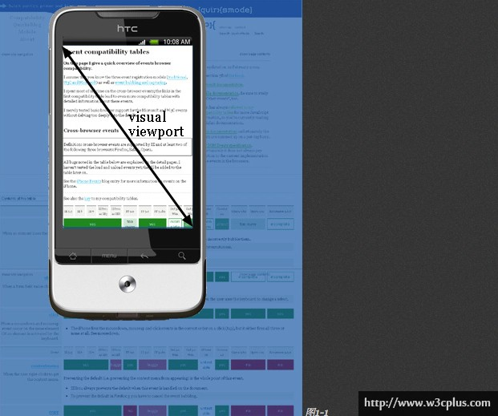
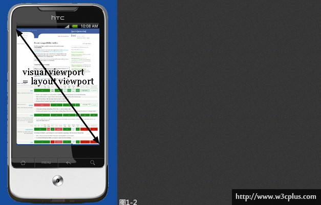

# 屏幕适配

## 浏览器缩放

- 原始：元素 1px 等于物理像素 1px
- 放大：元素 px 大小不变，窗口 px 等比变小，每个 px 显示的物理像素等比变大，由于元素的物理像素等比放大了，所以对于用户来说显示也等比放大了

    - 分辨率：1920*1080
    - 放大前
        
        - 元素大小：100*100
        - 窗口大小：1920*1080
    
    - 放大后：200%

        - 元素大小：100*100
        - 窗口大小：960*540

- 缩小：元素 px 大小不变，窗口 px 等比变大，每个 px 显示的物理像素等比变小，由于元素的物理像素等比缩小了，所以对于用户来说显示也等比缩小了

    - 分辨率：1920*1080
    - 缩小前

        - 元素大小：100*100
        - 窗口大小：1920*1080
    
    - 缩小后

        - 元素大小：100*100
        - 窗口大小：3840*2160

总结：浏览器缩放的时每个 CSS px 对应的物理像素的大小，默认时 1 px 对应 1 物理像素，缩放后窗口的 px 宽高也因此变化。

## Viewport

meta viewport 只适用于移动端浏览器。 

- [viewports 剖析](https://www.w3cplus.com/css/viewports.html)
- [Difference between visual viewport and layout viewport?](https://stackoverflow.com/questions/6333927/difference-between-visual-viewport-and-layout-viewport)

### Viewport 的由来

问题：移动设备的屏幕宽度比桌面浏览器小，经常最大就 400px 左右宽，而且通常会更小。如果我们只是拷贝桌面的样式到移动设备，我们的 CSS 会丑得崩溃。假设移动设备的宽度 400px，PC 端设置了 width: 10% 的侧边栏。如果在移动设备上同理处理，会显示出 40px 宽，实在太窄了，你的可变布局看起来被可怕的压扁了。

解决：移动设备浏览器供应商期望他们的客户端提供最好的可能性体验，即现在意味着“尽可能的像桌面浏览器”。因此 viewport 太窄，不能很好为你的基本 CSS 布局服务了,最显然的解决方式是让 viewport 更宽，所以引入了两种 viewport：

- visual viewport：虚拟 viewport
- layout viewport：布局 viewport

> 想象下 layout viewport是一张大的不能改变大小和角度的图片。现在你有个更小的框来观看这张大图片，这个框被不透明的材料包围，因而你只能看到大图片的一部分。你通过这个框子看到的大图片的部分被称为虚拟 viewport(visual viewport)。你能拿着这个框站得离大图片远点（用户的缩小页面功能），以一次性看到这个大图片。或者你能站得近点（用户的放大页面功能）以看到一部分。你能改变这个框子的方向，但这张大图片的大小和形状都不会改变。

visual viewport 是当前显示在屏幕上的部分页面。用户会滚动页面来改变可见部分，或者缩放浏览器来改变 visual viewport 的尺寸。

总结：移动设备浏览器为了解决 PC 端页面在移动端显示异常问题，引入了 layout viewport，用户透过 visual viewport 去观看 layout viewport，可以滚动或者缩放 visual viewport 来改变可见部分。CSS 布局通常是按照 layout viewport 来定义，而比 visual viewport 宽很多。每个浏览器的 layout viewport 大小都不同，iPhone 上的 Safari 使用 980px、Opera 850px，安卓的 Webkit 核心 800px。一些浏览器有一些特别的特性：

- 塞班 webkit 试着保存 layout viewport 和 visual viewport 同样宽度。因此，定义百分比宽度的元素会变得巨难看（PC 端页面在移动端浏览器上访问）。
- 三星的 WebKit(bada)上) 会设置 layout viewport 和最宽的元素一样宽。
- 黑莓上 layout viewport 和 visual viewport 在 100% 缩放时一样宽。

### 设置 Layout Viewport

许多移动设备浏览器在初始默认打开以最小缩放模式打开网站，虽然解决了 PC 端网页在移动端浏览器上显示异常问题，但是用户需要移动或者缩放才能看清网页内容，用户体验很差。苹果公司提出了一个扩展的 html 标签：`<meta name="viewport" content="width=device-width">`，意义是设置 layout viewport 的宽度，设置 device-width 表示 layout viewport 的宽度设置为与设备 visual layout 等宽。

### 测试实例

- [default.html](./examples/default.html)：默认情况，layout viewport 宽度为 980px
- [device.html](./examples/device.html)：色湖之 layout viewport 宽度等同于 visual layout

    visual layout 的大小等于设备的物理分辨率除以设备像素比，例如：例如：iPhone 6 的分辨率为 750x1334，设备像素比为 2（及一个 css 像素等于两个物理像素），其 visual layout 为 375x667，

- [50%.html](./examples/50%.html)：缩放 50%，layout viewport 宽度为 visual layout 宽度的两倍

    这里的缩放参照的是 visual layout，类似 PC 端缩放是对每个 px 对应的物理像素进行了缩放，缩放 50% 后 1px 等同于 1 个物理像素，此时 layout viewport 宽度就变成了 750px。

- [200%.html](./examples/200%.html)：缩放 200%（类似缩小原理），layout viewport 宽度为 visual layout 宽度的一半，如：iPhone 750 分辨率的设备，visual layout 为 375，缩放后为 187px
- [500.html](./examples/500.html)：设置 layout viewport 宽度为 500px
- [1000.html](./examples/1000.html)：设置 layout viewport 宽度为 1000px

## 最佳实践

- [Vant 屏幕适配](https://youzan.github.io/vant/v3/#/zh-CN/advanced-usage#liu-lan-qi-gua-pei)
- [evrone/postcss-px-to-viewport](https://github.com/evrone/postcss-px-to-viewport)
- [cuth/postcss-pxtorem](https://github.com/cuth/postcss-pxtorem)
- [amfe/lib-flexible](https://github.com/amfe/lib-flexible)

## 参考文献

- [使用Flexible实现手淘H5页面的终端适配 ](https://github.com/amfe/article/issues/17)
- [再聊移动端页面的适配](https://juejin.im/entry/6844903569884184589)
- [amfe/lib-flexible](https://github.com/amfe/lib-flexible/tree/master)
