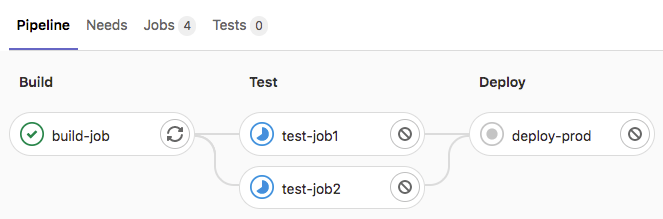
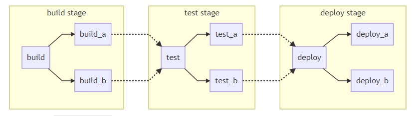
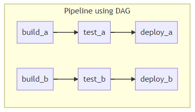
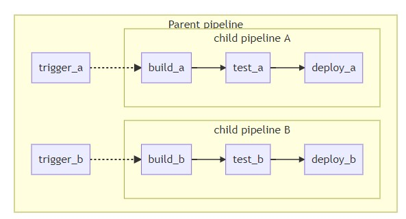

# [Gitlab CI](https://docs.gitlab.com/ee/ci/README.html)

Gitlab CI/CD 是 Gitlab 自带一套工具，用于实现软件开发的持续性。

- Continuous Integration (CI)：持续集成
- Continuous Delivery (CD)：持续交互
- Continuous Deployment (CD)：持续部署

## 工作原理

在向 Gitlab 代码仓库 push 代码时，Gitlab CI/CD 会运行一段脚本，用于构建、测试、校验和发布等。CI/CD 脚本配置在一个叫 `.gitlab-ci.yml` 的文件中（通常放在项目根目录下），这个文件创建了一个 `pipeline`。`pipeline` 由一系列的 `stage` 组成，且按照声明的先后顺序一个个执行。而每个 `stage` 可以绑定多个 `job`，同一 `stage` 的 `job` 会并发执行。

- `pipeline`：pipeline 中文名为“管道”，用于组织编排 CI/CD 脚本的运行顺序。一个完整的 `pipeline` 如下图所示，代码经过 `pipeline` 各个 `stage` 的 `job` 处理，最终部署到线上。
- `stage`：定义 `job` 什么时候执行，例如下图中的 `pipeline` 定义了三个 `stage` —— `build` => `test` => `deploy`，这三个 `stage` 会按照顺序一次执行，如果某个 `stage` 执行失败，后续 `stage` 不再运行。
- `job`：定义了 CI/CD 的执行脚本，如下图中的 `test` 绑定了两个 `job` —— `test-job1` 和 `test-job1`，同一个 `stage` 的 `job` 是并发执行的。



如下所示是上图的 `pipeline` 对应的配置文件。

```yml
# 定义 stage 执行顺序
stages:
  - build
  - test
  - deploy

# 定义 build 阶段的 job（通过 stage 绑定到指定的阶段）
build-job:
  stage: build
  script:
    - echo "Hello, $GITLAB_USER_LOGIN!"

# 定义 test 阶段的 job1
test-job1:
  stage: test
  script:
    - echo "This job tests something"

# 定义 test 阶段的 job2
test-job2:
  stage: test
  script:
    - echo "This job tests something, but takes more time than test-job1."
    - echo "After the echo commands complete, it runs the sleep command for 20 seconds"
    - echo "which simulates a test that runs 20 seconds longer than test-job1"
    - sleep 20

# 定义 deploy 阶段的 job
deploy-prod:
  stage: deploy
  script:
    - echo "This job deploys something from the $CI_COMMIT_BRANCH branch."
```

## 配置说明

参考官方文档 [https://docs.gitlab.com/ee/ci/yaml/README.html](https://docs.gitlab.com/ee/ci/yaml/README.html)。

### 任务设置

一个 `job` 由一系列的关键字用于定义 `job` 行为。

- `script`：`job` 的 shell 执行脚本
- `after_script`：`script` 后置执行脚本
- `before_script`：`script` 前置执行脚本
- `cache`：缓存文件
- `environment`：环境变量
- `except`：什么情况下不执行该 `job`
- `only`：什么情况下要执行 `job`
- [...](https://docs.gitlab.com/ee/ci/yaml/README.html#job-keywords)

### 全局配置

- `default`：一些 `job` 配置可以全局设置默认值，例如：`before_script`，`after_script` 和 `cache` 等
- `stages`：定义 `stage` 的执行顺序，每个 `job` 可以通过 `stage` 来声明所属哪个 `stage`

## 实际应用

### Pipeline 编排策略

#### Basic Pipelines



```yml
stages:
  - build
  - test
  - deploy

image: alpine

build_a:
  stage: build
  script:
    - echo "This job builds something."

build_b:
  stage: build
  script:
    - echo "This job builds something else."

test_a:
  stage: test
  script:
    - echo "This job tests something. It will only run when all jobs in the"
    - echo "build stage are complete."

test_b:
  stage: test
  script:
    - echo "This job tests something else. It will only run when all jobs in the"
    - echo "build stage are complete too. It will start at about the same time as test_a."

deploy_a:
  stage: deploy
  script:
    - echo "This job deploys something. It will only run when all jobs in the"
    - echo "test stage complete."

deploy_b:
  stage: deploy
  script:
    - echo "This job deploys something else. It will only run when all jobs in the"
    - echo "test stage complete. It will start at about the same time as deploy_a."
```

#### DAG(Directed Acyclic Graph) Pipelines



```
stages:
  - build
  - test
  - deploy

image: alpine

build_a:
  stage: build
  script:
    - echo "This job builds something quickly."

build_b:
  stage: build
  script:
    - echo "This job builds something else slowly."

test_a:
  stage: test
  needs: [build_a]
  script:
    - echo "This test job will start as soon as build_a finishes."
    - echo "It will not wait for build_b, or other jobs in the build stage, to finish."

test_b:
  stage: test
  needs: [build_b]
  script:
    - echo "This test job will start as soon as build_b finishes."
    - echo "It will not wait for other jobs in the build stage to finish."

deploy_a:
  stage: deploy
  needs: [test_a]
  script:
    - echo "Since build_a and test_a run quickly, this deploy job can run much earlier."
    - echo "It does not need to wait for build_b or test_b."

deploy_b:
  stage: deploy
  needs: [test_b]
  script:
    - echo "Since build_b and test_b run slowly, this deploy job will run much later."
```

#### Child / Parent Pipelines



```yml
stages:
  - triggers

trigger_a:
  stage: triggers
  trigger:
    include: a/.gitlab-ci.yml
  rules:
    - changes:
        - a/*

trigger_b:
  stage: triggers
  trigger:
    include: b/.gitlab-ci.yml
  rules:
    - changes:
        - b/*
```

`a/.gitlab-ci.yml`

```yml
stages:
  - build
  - test
  - deploy

image: alpine

build_a:
  stage: build
  script:
    - echo "This job builds something."

test_a:
  stage: test
  needs: [build_a]
  script:
    - echo "This job tests something."

deploy_a:
  stage: deploy
  needs: [test_a]
  script:
    - echo "This job deploys something."
```

`b/.gitlab-ci.yml`

```yml
stages:
  - build
  - test
  - deploy

image: alpine

build_b:
  stage: build
  script:
    - echo "This job builds something else."

test_b:
  stage: test
  needs: [build_b]
  script:
    - echo "This job tests something else."

deploy_b:
  stage: deploy
  needs: [test_b]
  script:
    - echo "This job deploys something else."
```

### 缓存管理

Gitlab CI/CD 会在每个 `job` 开始的时候清除上一次运行产生的额外文件，然后切到触发本次 Pipeline 的 commit 上。但像模块依赖这种的文件，每次运行都要重复下载，会导致 Pipeline 运行时间变长。所以为了缓存类似依赖模块这样的文件，Gitlab 提供了缓存功能，从而加速 `job` 运行效率。被设置为缓存的文件，会在不同的 pipelines 和 jobs 之间共享。除了缓存外，gitlab 还提供了另外一项类似缓存的功能 —— `artifacts`，用于保存构建或测试结果，以便于在不同的 stage 之间传递。不同于缓存，`artifacts` 会上传到 Gitlab 服务器，可以通过网站访问，而且它存在过期时间，默认为 30 天。

缓存示例：下面建立了一个 key 为 `${CI_COMMIT_REF_SLUG}` 的缓存，保存了 npm 下载的缓存文件。`${CI_COMMIT_REF_SLUG}` 引用了当前分支名的环境变量，表示这个缓存在该分支下的不同 pipeline 和 job 下是共享的。

```yml
# Cache modules in between jobs
cache:
  key: ${CI_COMMIT_REF_SLUG}
  paths:
    - .npm/

before_script:
  - npm ci --cache .npm --prefer-offline

test_async:
  script:
    - node ./specs/start.js ./specs/async.spec.js
```

artifacts 示例：如下所示在构建阶段的静态资源放在 build 目录下，

```yml
stages:
  - build
  - deploy
build_job:
  stage: build
  script:
    - npm i
    - npm run build
  artifacts:
    paths:
      - build/ # 必须设置该目录，否则 deploy_job 读取不到该文件

deploy_job:
  stage: deploy
  script:
    - rsync -av build/ ... # 将构建结果同步至部署服务器上
```

## Gitlab Runner

...

## 开发工具

- [CI Lint Tool](https://docs.gitlab.com/ee/ci/lint.html)
- [Visualize your CI/CD configuration](https://docs.gitlab.com/ee/ci/yaml/visualization.html)

## 开发示例

- [GitLab CI/CD Examples](https://docs.gitlab.com/ee/ci/examples/README.html)
