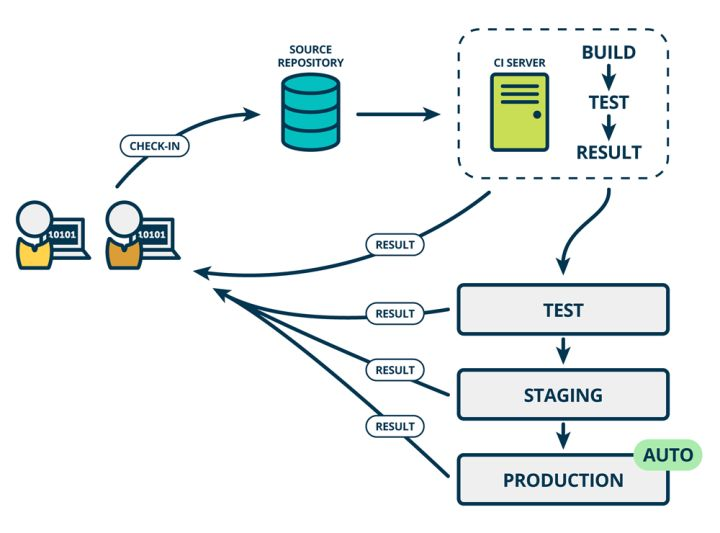

# CI/CD

> CI/CD 是一种通过在应用开发阶段引入自动化来频繁向客户交付应用的方法。CI/CD 的核心概念是持续集成、持续交付和持续部署。作为一个面向开发和运营团队的解决方案，CI/CD 主要针对在集成新代码时所引发的问题。

## DevOps

这里介绍另外一个与 CI/CD 相关的概念 —— DevOps，在维基百科上的定义是“一组过程、方法与系统的统称，用于促进开发、技术运营和质量保障（QA）部门之间的沟通、协作与整合”。


DevOps 从计划、编码、构建，到测试、发布、部署，以及运营、监控，形成一个环路，可以分为以下几个流程：


- 持续集成，需求的不断变动触发持续的编码、构建流程。
- 持续交付，完成测试的业务应用以合适的方式交付到适当的节点。
- 部署发布，将交付的业务应用按照规则部署到生产环境，完成测试后发布。
- 持续监控，时时监控业务应用以及系统平台的运行情况，形成监控报告。
- 持续反馈，是基于监控和业务应用的使用情况，持续的数据分析，持续地提出完善意见。
- 持续改进，基于反馈的意见，启动新的改进计划流程。

所以，CI/CD 可以认为是 DevOps的一部分，但不等于 DevOps。

参考文献

[DevOps 不等于 CI，更不等于 CI /CD](https://cloud.tencent.com/developer/article/1085445)

## 基本概念

- CI（Continuous integration）：持续集成指的是频繁地（一e天多次）将代码集成到主干。

    帮助开发人员更加频繁地（有时甚至每天）将代码更改合并到共享分支或“主干”中。一旦开发人员对应用所做的更改被合并，系统就会通过自动构建应用并运行不同级别的自动化测试（通常是单元测试和集成测试）来验证这些更改，确保这些更改没有对应用造成破坏。如果企业安排在一天内将所有分支源代码合并在一起（称为“合并日”），最终可能造成工作繁琐、耗时，而且需要手动完成。这是因为当一位独立工作的开发人员对应用进行更改时，有可能会与其他开发人员同时进行的更改发生冲突。

    

    案例：开源项目的贡献者完成特性开发或问题修复，并发起 pull request 后，CI 会合并代码进行自动化测试，测试未通过时不允许合并到主分支，否则自动合并入主分支。

- Continuous delivery：持续交付指的是，频繁地将软件的新版本，交付给质量团队或者用户，以供评审。

    持续交付持续交付的目标是拥有一个可随时部署到生产环境的代码库，可自动将已验证（持续集成）的代码发布到存储库,

    

    案例：可以认为是将开发代码自动打包部署到测试或预发环境里，以供质量团队评审。

- Continuous deployment：持续部署是持续交付的下一步，指的是代码通过评审以后，自动部署到生产环境。

    

    案例：[Ansible](http://www.ansible.com/)，[Chef](https://www.chef.io/products/chef-infra)，[Puppet](https://puppetlabs.com/) 和 [SaltStack](https://www.saltstack.com/)。

ps：我们没必要纠结于这些语义，只需记得 CI/CD 其实就是一个流程，用于实现应用开发中的高度持续自动化和持续监控。

- [如何理解持续集成、持续交付、持续部署？](https://www.zhihu.com/question/23444990)
- [CI/CD是什么？如何理解持续集成、持续交付和持续部署](https://www.redhat.com/zh/topics/devops/what-is-ci-cd#)
- [持续集成是什么？](https://www.ruanyifeng.com/blog/2015/09/continuous-integration.html)
- [DevOps到底是什么意思？](https://zhuanlan.zhihu.com/p/91371659)
- [DevOps 不等于 CI，更不等于 CI /CD](https://cloud.tencent.com/developer/article/1085445)
- [The Product Managers’ Guide to Continuous Delivery and DevOps](https://www.mindtheproduct.com/what-the-hell-are-ci-cd-and-devops-a-cheatsheet-for-the-rest-of-us/)
- [谈谈持续集成、持续交付和持续部署三者究竟是什么，有何联系和区别呢！](https://xie.infoq.cn/article/c685cc342fe24e9bc2c047e0a)

## 开发工具

| 项目名称 | 开发语言 | 配置语言 | 公有云服务 | 私有部署 |
|:----|:----|:----|:----|:----|
| [Travis CI](https://travis-ci.com/) | Ruby | YAML | 有 | 不支持 |
| Circle CI | Clojure | YAML | 有 | 不支持 |
| Gitlab CI | Ruby | YAML | 有 | 支持 |
| [Jenkins](https://www.jenkins.io/) | Java | Groovy | 无 | 支持 |

ps：Travis CI、CircleCI 在 Github 开源项目中使用较多，但不支持私有化部署，不适合公司实践。

其他工具

- [Codeship](https://codeship.com/)
- [Strider](http://stridercd.com/)
- Github Actions

参考文献

- [CI/CD 工具选型：Jenkins 还是 GitLab CI/CD？](https://www.infoq.cn/article/9hscujuukmbbwjpr0p0g)

## 回顾总结

- 是什么
- 与 DevOps 的关系
- 基本概念
- 开发工具

- ...

## 案例分析

### 花椒前端基于 GitLab CI/CD 的自动化构建、发布实践

旧的流程

1. 开发完成后，在本地进行 build，build 后提交打包后的 HTML 文件
2. 打开发布系统，发布 HTML 文件

存在问题

- 发布代码的操作流程长，耗时，每次发布大约需要 5 分钟。
- 每个人本地环境不一致，线上代码不同的人发布有不一致的风险。

改造方案：通过 Gitlab CI 来实现自动化的打包部署。

```yml
image: registry.huajiao.com/gitlab-ci/node-yarn:v1.4

variables:
  # $CI_PROJECT_PATH  ： 项目id,用于项目唯一区分本项目与其它项目
  # $CI_PROJECT_DIR   ： 本地项目路径
  # $PROCESS_PATH     ： 临时文件目录(包括日志和一些临时文件)
  NODE_MODULES_PATH: /runner-cache/frontend/$CI_PROJECT_PATH/$CI_BUILD_REF_NAME/node_modules

stages:
  - pre_build
  - build
  - deploy

下载依赖:
  before_script:
    # 无 node_modules 文件时，新建 node_modules 文件
    - /bin/bash ./ci/mkdir.sh $NODE_MODULES_PATH
    # 软链 node_modules 到宿主机
    - ln -s $NODE_MODULES_PATH .
    - cd webpack@next
  stage: pre_build
  script:
    - echo "yarn install"
    - yarn install  --network-timeout 60000
  only:
    changes:
      - webpack@next/package.json
    refs:
      - test
      - test-99
      - test-128
      - master
      - ci
      - feature/ci-test

构建:
  stage: build
  variables:
    CI_COMMIT_BEFORE_SHA_PATH: /mnt/gv0/gitlab-runner-cache/$CI_PROJECT_PATH
    CI_COMMIT_BEFORE_SHA_FILE_NAME: $CI_BUILD_REF_NAME.sh
    CI_COMMIT_BEFORE_SHA_FILE: /mnt/gv0/gitlab-runner-cache/$CI_PROJECT_PATH/$CI_BUILD_REF_NAME.sh
  before_script:
    # 建存此次 CI CI_COMMIT_SHA 的文件
    - /bin/bash ./ci/mkfile.sh $CI_COMMIT_BEFORE_SHA_PATH $CI_COMMIT_BEFORE_SHA_FILE_NAME
    # 软链 node_modules 到宿主机
    - ln -s $NODE_MODULES_PATH .
    - rm -rf php/share/*
    - cd webpack@next
  script:
    # 缓存上次ci
    - source $CI_COMMIT_BEFORE_SHA_FILE
    - echo "CI_COMMIT_BEFORE_SHA=$CI_COMMIT_SHA" > $CI_COMMIT_BEFORE_SHA_FILE
    - python3 ../ci/build.py   # 编译
    - /bin/bash ../ci/commit.sh   # 提交编译结果
  only:
    changes:
      - www_src/**/*
    refs:
      - test
      - test-99
      - test-128
      - master
      - ci

测试发布:
  stage: deploy
  variables:
    PROCESS_PATH: /mnt/gv0/gitlab-runner-cache/deploy/process/$CI_JOB_ID  # 目录不要换，用于日志服务器获取日志展示
  script:
    - mkdir $PROCESS_PATH # 建立发布临时路径，存放发布配置中间文件和结果日志用
    - dplt $CI_PROJECT_DIR/.deploy_test.yml $CI_PROJECT_PATH $CI_PROJECT_DIR/php/ $PROCESS_PATH
    # dplt 发布yml配置
    - echo "发布完成，错误日志查看http://new.admin.wolffy.qihoo.net/log?path="$PROCESS_PATH
    - echo `ls $PROCESS_PATH/*.log`
  only:
    changes:
      - php/**/*
    refs:
      - test
```

1. 下载依赖阶段 pre_build

    下载依赖的方案是：当 package.json 文件发生变化时，触发 pre_build stage，执行 yarn install。下载的 node_modules 放在宿主机下，执行时通过软链获取依赖。

2. 构建阶段 build

    diff 文件变化（有些提交可能没有改动到代码） =》 前端 build =》 commit build 后结果

3. 发布阶段 deploy

    用内部的 rsync 工具 dplt 将打包后的 HTML 文件部署。

团队收益

- 缩短项目的发布时间，平均 5 分钟减少到 1.5 分钟
- 解决了本地构建可能导致线上代码打包后不一致的问题

参考文献

- [花椒前端基于 GitLab CI/CD 的自动化构建、发布实践](https://zhuanlan.zhihu.com/p/69513606)

### 网易 CI/CD 实践

- [网易CI/CD实践（上）：CI系统的技术选型与部署流程](https://zhuanlan.zhihu.com/p/264642406)
- [网易CI/CD实践（中）：CD系统的部署架构与发布流程](https://www.infoq.cn/article/jrX4ZOTY47yY1pHG7DDm)
- [网易CI/CD实践（下）：测试自动化及API版本管理](https://www.infoq.cn/article/oibssbx8tib9eut73f7v)

## 分析总结

1. 建立代码管理和协作流程；
2. 选择 CI/CD 工具：Gitlab CI VS Jenkins；
3. 实现部署脚本公共库和命令行工具；
4. 编写集成说明文档；
5. 旧项目改造优化；

## 参考文献

- [持续集成(CI) - 知乎话题](https://www.zhihu.com/topic/19603714/hot)
- [给 DevOps 初学者的入门指南](https://zhuanlan.zhihu.com/p/22638204)
- [GitHub welcomes all CI tools](https://github.blog/2017-11-07-github-welcomes-all-ci-tools/)
- [持续集成服务 Travis CI 教程](http://www.ruanyifeng.com/blog/2017/12/travis_ci_tutorial.html)
- https://jenkins-ci.org/
- https://travis-ci.org/

