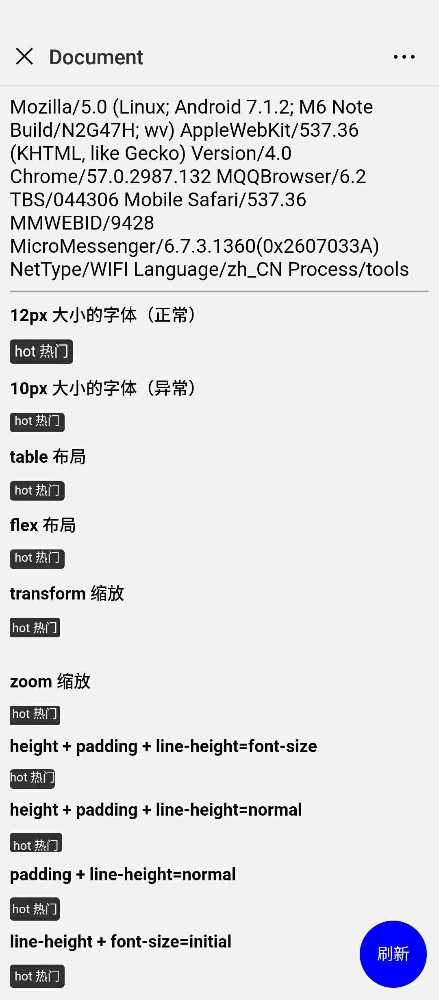

安卓文本无法垂直居中的问题
========

## 问题

安卓 webview 的字体大小在小于 12 像素的时候无法使用行高来垂直居中

ps：目前在微信等应用都存在该问题，而在最新的移动端 Chrome 浏览器上无该问题（截止本文编写时间，微信客户端的 chrome 版本为 57，chrome 版本为 70）。

## 尝试方案

1. table 布局：文本偏上

    ```html
    <div class="solution" style="display: table; height: 16px;">
      <span style=" display: table-cell; font-size: 10px; vertical-align: middle;">hot 热门</span>
    </div>
    ```

2. flex 布局：文本偏上

    ```html
    <div class="solution" style="display: inline-flex; align-items: center; height: 16px; line-height: 1; font-size: 10px;">
      <span>hot 热门</span>
    </div>
    ```

3. transform 缩放：文本居中了，但是 transform 不能还原元素在 dom 上的占用区域大小

    ```html
    <div class="solution" style="height: 32px; line-height: 32px; font-size: 20px; transform: scale(0.5, 0.5); transform-origin: left top;">
      <span>hot 热门</span>
    </div>
    ```

4. zoom 缩放：文本偏上

    ```html
    <div class="solution" style="height: 32px; line-height: 32px; font-size: 20px; zoom: 0.5;">
      <span>hot 热门</span>
    </div>
    ```

5. 固定高度+内边距+行高设定为字体大小：文本偏上

    ```html
    <div class="solution" style="box-sizing: border-box; height: 16px; padding: 3px 0; line-height: 10px; font-size: 10px;">
      <span>hot 热门</span>
    </div>
    ```

6. 固定高度+内边距+行高设为 `normal`：文本偏上

    ```html
    <div class="solution" style="box-sizing: border-box; height: 16px; padding: 3px; line-height: normal; font-size: 10px;">
      <span>hot 热门</span>
    </div>
    ```

7. 内边距+行高设为 `normal`：文本居中，但在部分客户端上不居中

    ```html
    <div class="solution" style="box-sizing: border-box; padding: 2px; line-height: normal; font-size: 10px;">
      <span>hot 热门</span>
    </div>
    ```

8. 行高+字体大小设为 `initial`：文本居中，在最新的 Chrome 浏览器上不居中

    ```html
    <div class="solution" style="line-height: 16px; font-size: initial;">
      <span style="font-size: 10px;">hot 热门</span>
    </div>
    ```

[](https://codesandbox.io/s/lxjm749rmq?autoresize=1&hidenavigation=1)


<iframe src="https://codesandbox.io/embed/lxjm749rmq?autoresize=1&hidenavigation=1" style="width:100%; height:500px; border:0; border-radius: 4px; overflow:hidden;" sandbox="allow-modals allow-forms allow-popups allow-scripts allow-same-origin"></iframe>



## 解决方案

在不同的安卓客户端上测试上述方法发现以下三个方法或许可以帮助解决居中问题，我们可以根据实际客户端的支持情况来选择其中一种方式来解决无法居中问题。

1. transform 缩放
2. 内边距+行高设为 `normal`
2. 行高+字体大小设为 `initial`

## 参考文献

- [Android 浏览器文本垂直居中问题](http://imweb.io/topic/5848d0fc9be501ba17b10a94)
- [解决 Android 浏览器下 line-height 垂直居中偏离问题](https://github.com/o2team/H5Skills/issues/4)
- [移动端android上line-height不居中的问题](https://blog.csdn.net/qq_36336781/article/details/79207615)
- [完美解决移动Web小于12px文字居中的问题](https://www.cnblogs.com/zjzhome/p/4913741.html)
