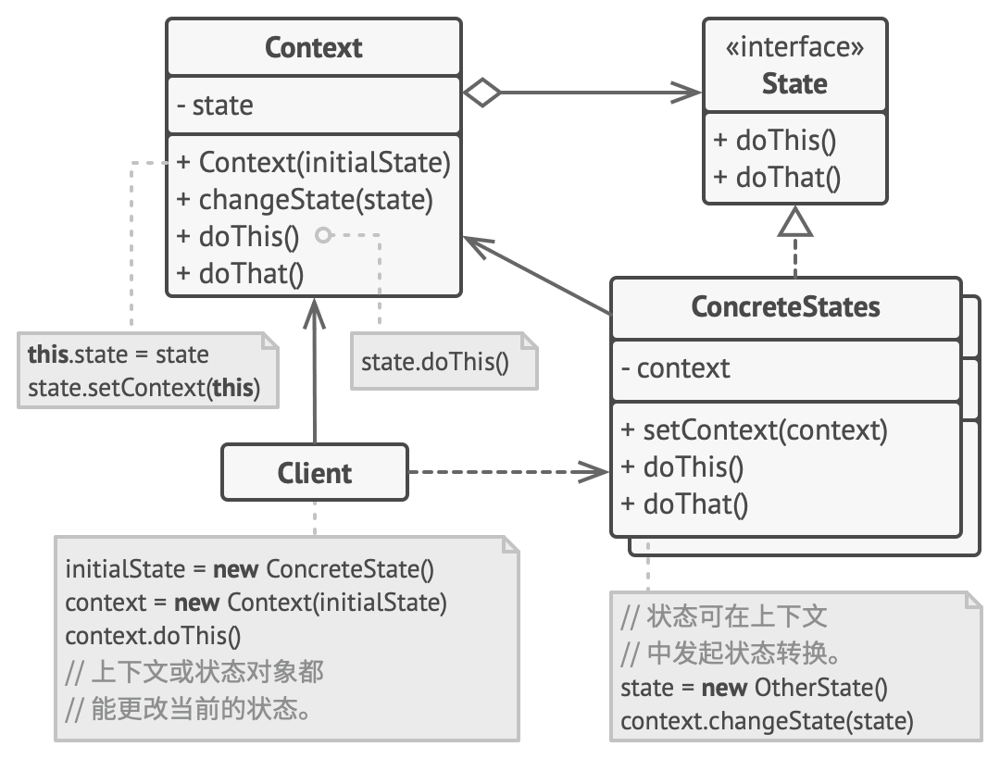

# 状态模式

状态模式，亦称：State。

状态模式是一种行为设计模式， 让你能在一个对象的内部状态变化时改变其行为， 使其看上去就像改变了自身所属的类一样。



适用场景

- 如果对象需要根据自身当前状态进行不同行为， 同时状态的数量非常多且与状态相关的代码会频繁变更的话， 可使用状态模式。
- 如果某个类需要根据成员变量的当前值改变自身行为， 从而需要使用大量的条件语句时， 可使用该模式。
- 当相似状态和基于条件的状态机转换中存在许多重复代码时， 可使用状态模式。

优缺点

- 优点

    -  单一职责原则。 将与特定状态相关的代码放在单独的类中。
    - 开闭原则。 无需修改已有状态类和上下文就能引入新状态。
    - 通过消除臃肿的状态机条件语句简化上下文代码。

- 缺点：如果状态机只有很少的几个状态， 或者很少发生改变， 那么应用该模式可能会显得小题大作。

## 实现

```ts
/**
 * The Context defines the interface of interest to clients. It also maintains a
 * reference to an instance of a State subclass, which represents the current
 * state of the Context.
 */
class Context {
  /**
   * @type {State} A reference to the current state of the Context.
   */
  private state: State;

  constructor(state: State) {
    this.transitionTo(state);
  }

  /**
   * The Context allows changing the State object at runtime.
   */
  public transitionTo(state: State): void {
    console.log(`Context: Transition to ${(<any>state).constructor.name}.`);
    this.state = state;
    this.state.setContext(this);
  }

  /**
   * The Context delegates part of its behavior to the current State object.
   */
  public request1(): void {
    this.state.handle1();
  }

  public request2(): void {
    this.state.handle2();
  }
}

/**
 * The base State class declares methods that all Concrete State should
 * implement and also provides a backreference to the Context object, associated
 * with the State. This backreference can be used by States to transition the
 * Context to another State.
 */
abstract class State {
  protected context: Context;

  public setContext(context: Context) {
    this.context = context;
  }

  public abstract handle1(): void;

  public abstract handle2(): void;
}

/**
 * Concrete States implement various behaviors, associated with a state of the
 * Context.
 */
class ConcreteStateA extends State {
  public handle1(): void {
    console.log('ConcreteStateA handles request1.');
    console.log('ConcreteStateA wants to change the state of the context.');
    this.context.transitionTo(new ConcreteStateB());
  }

  public handle2(): void {
    console.log('ConcreteStateA handles request2.');
  }
}

class ConcreteStateB extends State {
  public handle1(): void {
    console.log('ConcreteStateB handles request1.');
  }

  public handle2(): void {
    console.log('ConcreteStateB handles request2.');
    console.log('ConcreteStateB wants to change the state of the context.');
    this.context.transitionTo(new ConcreteStateA());
  }
}

/**
 * The client code.
 */
const context = new Context(new ConcreteStateA());
context.request1();
context.request2();
```

## 应用

- 状态机
- 词法分析

## 参考

- [JavaScript与有限状态机](http://www.ruanyifeng.com/blog/2013/09/finite-state_machine_for_javascript.html)
