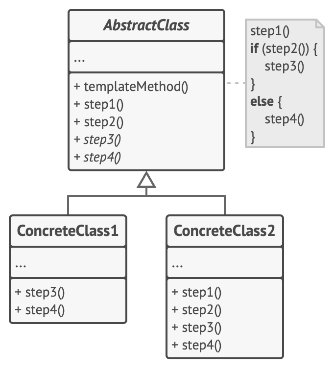

# 模板方法模式

模板方法模式，亦称： Template Method。

模板方法模式是一种行为设计模式， 它在超类中定义了一个算法的框架， 允许子类在不修改结构的情况下重写算法的特定步骤。



应用场景

- 当你只希望客户端扩展某个特定算法步骤， 而不是整个算法或其结构时， 可使用模板方法模式。
- 当多个类的算法除一些细微不同之外几乎完全一样时， 你可使用该模式。 但其后果就是， 只要算法发生变化， 你就可能需要修改所有的类。

优缺点

- 优点

    - 你可仅允许客户端重写一个大型算法中的特定部分， 使得算法其他部分修改对其所造成的影响减小。
    - 你可将重复代码提取到一个超类中。

- 缺点：

    - 部分客户端可能会受到算法框架的限制。
    - 通过子类抑制默认步骤实现可能会导致违反_里氏替换原则_。
    - 模板方法中的步骤越多， 其维护工作就可能会越困难。

## 实现

```ts
/**
 * The Abstract Class defines a template method that contains a skeleton of some
 * algorithm, composed of calls to (usually) abstract primitive operations.
 *
 * Concrete subclasses should implement these operations, but leave the template
 * method itself intact.
 */
abstract class AbstractClass {
  /**
   * The template method defines the skeleton of an algorithm.
   */
  public templateMethod(): void {
    this.baseOperation1();
    this.requiredOperations1();
    this.baseOperation2();
    this.hook1();
    this.requiredOperation2();
    this.baseOperation3();
    this.hook2();
  }

  /**
   * These operations already have implementations.
   */
  protected baseOperation1(): void {
    console.log('AbstractClass says: I am doing the bulk of the work');
  }

  protected baseOperation2(): void {
    console.log('AbstractClass says: But I let subclasses override some operations');
  }

  protected baseOperation3(): void {
    console.log('AbstractClass says: But I am doing the bulk of the work anyway');
  }

  /**
   * These operations have to be implemented in subclasses.
   */
  protected abstract requiredOperations1(): void;

  protected abstract requiredOperation2(): void;

  /**
   * These are "hooks." Subclasses may override them, but it's not mandatory
   * since the hooks already have default (but empty) implementation. Hooks
   * provide additional extension points in some crucial places of the
   * algorithm.
   */
  protected hook1(): void {}

  protected hook2(): void {}
}

/**
 * Concrete classes have to implement all abstract operations of the base class.
 * They can also override some operations with a default implementation.
 */
class ConcreteClass1 extends AbstractClass {
  protected requiredOperations1(): void {
    console.log('ConcreteClass1 says: Implemented Operation1');
  }

  protected requiredOperation2(): void {
    console.log('ConcreteClass1 says: Implemented Operation2');
  }
}

/**
 * Usually, concrete classes override only a fraction of base class' operations.
 */
class ConcreteClass2 extends AbstractClass {
  protected requiredOperations1(): void {
    console.log('ConcreteClass2 says: Implemented Operation1');
  }

  protected requiredOperation2(): void {
    console.log('ConcreteClass2 says: Implemented Operation2');
  }

  protected hook1(): void {
    console.log('ConcreteClass2 says: Overridden Hook1');
  }
}

/**
 * The client code calls the template method to execute the algorithm. Client
 * code does not have to know the concrete class of an object it works with, as
 * long as it works with objects through the interface of their base class.
 */
function clientCode(abstractClass: AbstractClass) {
  // ...
  abstractClass.templateMethod();
  // ...
}

console.log('Same client code can work with different subclasses:');
clientCode(new ConcreteClass1());
console.log('');

console.log('Same client code can work with different subclasses:');
clientCode(new ConcreteClass2());
```

## 案例

- redux
- react class component
- vue option api
