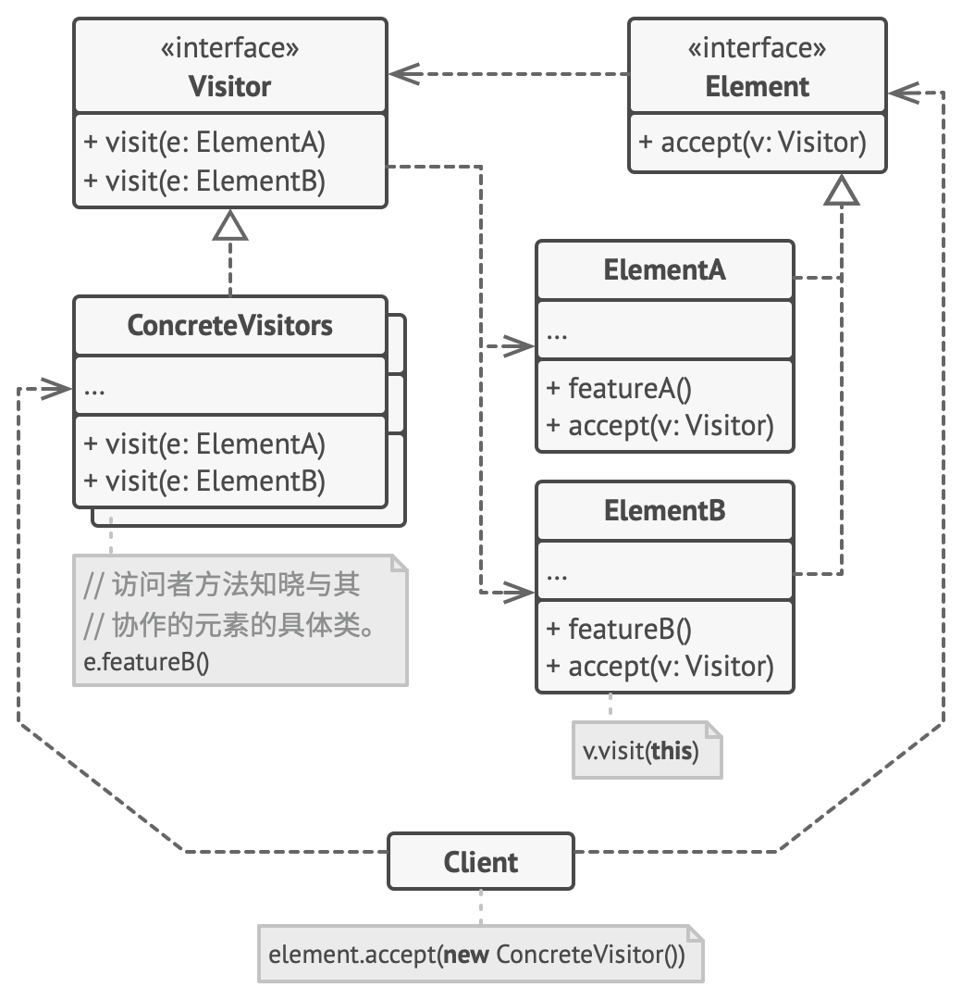

# 访问者模式

访问者模式是一种行为设计模式， 它能将算法与其所作用的对象隔离开来。



应用场景

- 如果你需要对一个复杂对象结构 （例如对象树） 中的所有元素执行某些操作， 可使用访问者模式。
- 可使用访问者模式来清理辅助行为的业务逻辑。
- 当某个行为仅在类层次结构中的一些类中有意义， 而在其他类中没有意义时， 可使用该模式。

优缺点

- 优点

    - 开闭原则。 你可以引入在不同类对象上执行的新行为， 且无需对这些类做出修改。
    - 单一职责原则。 可将同一行为的不同版本移到同一个类中。
    - 访问者对象可以在与各种对象交互时收集一些有用的信息。 当你想要遍历一些复杂的对象结构 （例如对象树）， 并在结构中的每个对象上应用访问者时， 这些信息可能会有所帮助。

- 缺点

    - 每次在元素层次结构中添加或移除一个类时， 你都要更新所有的访问者。
    - 在访问者同某个元素进行交互时， 它们可能没有访问元素私有成员变量和方法的必要权限。

## 实现

```ts
/**
 * The Component interface declares an `accept` method that should take the base
 * visitor interface as an argument.
 */
interface Component {
  accept(visitor: Visitor): void;
}

/**
 * Each Concrete Component must implement the `accept` method in such a way that
 * it calls the visitor's method corresponding to the component's class.
 */
class ConcreteComponentA implements Component {
  /**
   * Note that we're calling `visitConcreteComponentA`, which matches the
   * current class name. This way we let the visitor know the class of the
   * component it works with.
   */
  public accept(visitor: Visitor): void {
    visitor.visitConcreteComponentA(this);
  }

  /**
   * Concrete Components may have special methods that don't exist in their
   * base class or interface. The Visitor is still able to use these methods
   * since it's aware of the component's concrete class.
   */
  public exclusiveMethodOfConcreteComponentA(): string {
    return 'A';
  }
}

class ConcreteComponentB implements Component {
  /**
   * Same here: visitConcreteComponentB => ConcreteComponentB
   */
  public accept(visitor: Visitor): void {
    visitor.visitConcreteComponentB(this);
  }

  public specialMethodOfConcreteComponentB(): string {
    return 'B';
  }
}

/**
 * The Visitor Interface declares a set of visiting methods that correspond to
 * component classes. The signature of a visiting method allows the visitor to
 * identify the exact class of the component that it's dealing with.
 */
interface Visitor {
  visitConcreteComponentA(element: ConcreteComponentA): void;

  visitConcreteComponentB(element: ConcreteComponentB): void;
}

/**
 * Concrete Visitors implement several versions of the same algorithm, which can
 * work with all concrete component classes.
 *
 * You can experience the biggest benefit of the Visitor pattern when using it
 * with a complex object structure, such as a Composite tree. In this case, it
 * might be helpful to store some intermediate state of the algorithm while
 * executing visitor's methods over various objects of the structure.
 */
class ConcreteVisitor1 implements Visitor {
  public visitConcreteComponentA(element: ConcreteComponentA): void {
    console.log(`${element.exclusiveMethodOfConcreteComponentA()} + ConcreteVisitor1`);
  }

  public visitConcreteComponentB(element: ConcreteComponentB): void {
    console.log(`${element.specialMethodOfConcreteComponentB()} + ConcreteVisitor1`);
  }
}

class ConcreteVisitor2 implements Visitor {
  public visitConcreteComponentA(element: ConcreteComponentA): void {
    console.log(`${element.exclusiveMethodOfConcreteComponentA()} + ConcreteVisitor2`);
  }

  public visitConcreteComponentB(element: ConcreteComponentB): void {
    console.log(`${element.specialMethodOfConcreteComponentB()} + ConcreteVisitor2`);
  }
}

/**
 * The client code can run visitor operations over any set of elements without
 * figuring out their concrete classes. The accept operation directs a call to
 * the appropriate operation in the visitor object.
 */
function clientCode(components: Component[], visitor: Visitor) {
  // ...
  for (const component of components) {
    component.accept(visitor);
  }
  // ...
}

const components = [
  new ConcreteComponentA(),
  new ConcreteComponentB(),
];

console.log('The client code works with all visitors via the base Visitor interface:');
const visitor1 = new ConcreteVisitor1();
clientCode(components, visitor1);
console.log('');

console.log('It allows the same client code to work with different types of visitors:');
const visitor2 = new ConcreteVisitor2();
clientCode(components, visitor2);
```

## 案例

- webpack 插件
- babel 插件
