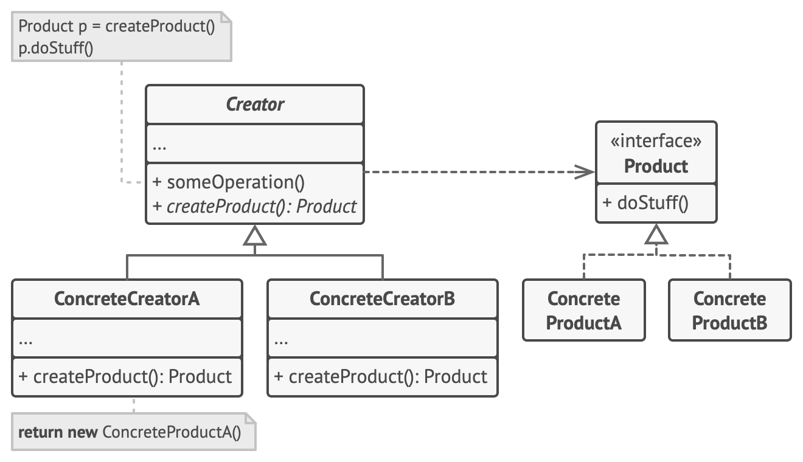

# 工厂方法

工厂方法模式建议使用特殊的工厂方法代替对于对象构造函数的直接调用（即使用 new运算符）。

ps：对象仍将通过 new 运算符创建，只是该运算符改在工厂方法中调用罢了。



应用场景

- 当你在编写代码的过程中，如果无法预知对象确切类别及其依赖关系时，可使用工厂方法。
- 如果你希望用户能扩展你软件库或框架的内部组件，可使用工厂方法。
- 如果你希望复用现有对象来节省系统资源，而不是每次都重新创建对象，可使用工厂方法。

优缺点

- 优点：

    - 可以避免创建者和具体产品之间的紧密耦合。
    - 单一职责原则：可以将产品创建代码放在程序的单一位置，从而使得代码更容易维护。
    - 开闭原则：无需更改现有客户端代码，你就可以在程序中引入新的产品类型。

- 缺点：应用工厂方法模式需要引入许多新的子类，代码可能会因此变得更复杂。最好的情况是将该模式引入创建者类的现有层次结构中。

## 实现

```ts
/**
 * The Creator class declares the factory method that is supposed to return an
 * object of a Product class. The Creator's subclasses usually provide the
 * implementation of this method.
 */
abstract class Creator {
    /**
     * Note that the Creator may also provide some default implementation of the
     * factory method.
     */
    public abstract factoryMethod(): Product;

    /**
     * Also note that, despite its name, the Creator's primary responsibility is
     * not creating products. Usually, it contains some core business logic that
     * relies on Product objects, returned by the factory method. Subclasses can
     * indirectly change that business logic by overriding the factory method
     * and returning a different type of product from it.
     */
    public someOperation(): string {
        // Call the factory method to create a Product object.
        const product = this.factoryMethod();
        // Now, use the product.
        return `Creator: The same creator's code has just worked with ${product.operation()}`;
    }
}

/**
 * Concrete Creators override the factory method in order to change the
 * resulting product's type.
 */
class ConcreteCreator1 extends Creator {
    /**
     * Note that the signature of the method still uses the abstract product
     * type, even though the concrete product is actually returned from the
     * method. This way the Creator can stay independent of concrete product
     * classes.
     */
    public factoryMethod(): Product {
        return new ConcreteProduct1();
    }
}

class ConcreteCreator2 extends Creator {
    public factoryMethod(): Product {
        return new ConcreteProduct2();
    }
}

/**
 * The Product interface declares the operations that all concrete products must
 * implement.
 */
interface Product {
    operation(): string;
}

/**
 * Concrete Products provide various implementations of the Product interface.
 */
class ConcreteProduct1 implements Product {
    public operation(): string {
        return '{Result of the ConcreteProduct1}';
    }
}

class ConcreteProduct2 implements Product {
    public operation(): string {
        return '{Result of the ConcreteProduct2}';
    }
}

/**
 * The client code works with an instance of a concrete creator, albeit through
 * its base interface. As long as the client keeps working with the creator via
 * the base interface, you can pass it any creator's subclass.
 */
function clientCode(creator: Creator) {
    // ...
    console.log('Client: I\'m not aware of the creator\'s class, but it still works.');
    console.log(creator.someOperation());
    // ...
}

/**
 * The Application picks a creator's type depending on the configuration or
 * environment.
 */
console.log('App: Launched with the ConcreteCreator1.');
clientCode(new ConcreteCreator1());
console.log('');

console.log('App: Launched with the ConcreteCreator2.');
clientCode(new ConcreteCreator2());
```

## 应用

- [react#createElement](https://github.com/facebook/react/blob/cae635054e/packages/react/src/ReactElement.js#L349)：createElement 是 react 创建虚拟 DOM 节点的方法，通过该方法，使用者只需要关心表现层的配置，而不需要关注虚拟 DOM 节点内部的复杂关联关系。
- [react-native-intersection#createObserver](https://github.com/thebuilder/react-intersection-observer/blob/d61319a060/src/observe.ts#L56)：react-native-intersection 通过工程方法来创建 IntersectionObserver 实例，实现资源复用。
