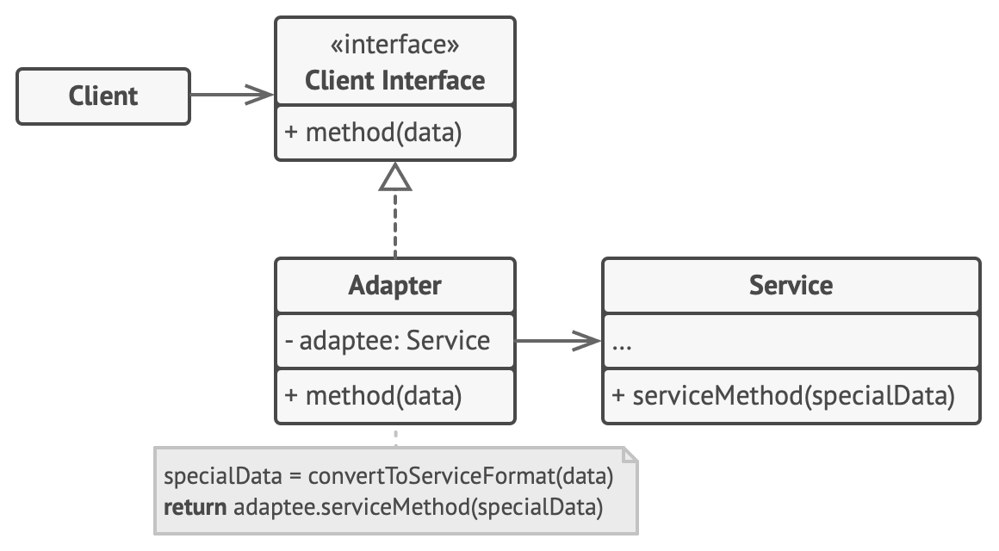
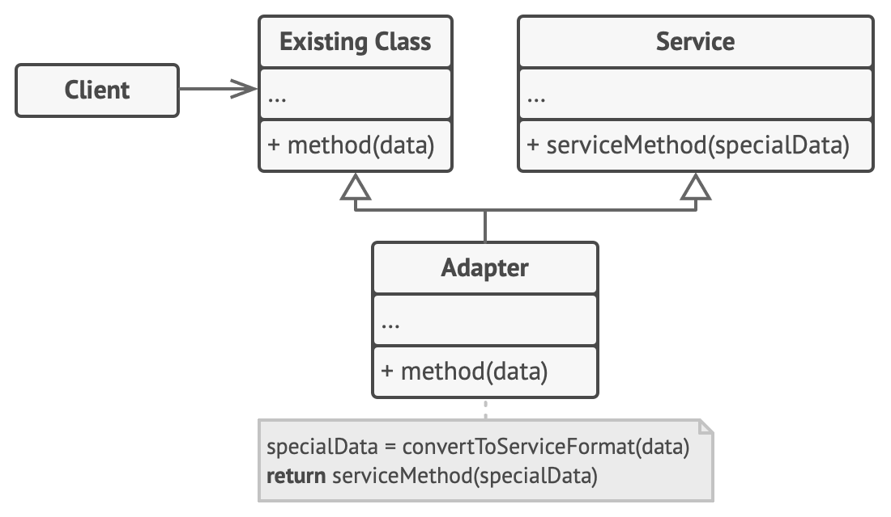

# 适配器模式

适配器模式是一种结构型设计模式， 它能使接口不兼容的对象能够相互合作。

- 对象适配器：使用了构成原则，适配器实现了其中一个对象的接口， 并对另一个对象进行封装。 所有流行的编程语言都可以实现适配器。

    

- 类适配器：使用了继承机制，适配器同时继承两个对象的接口。 请注意， 这种方式仅能在支持多重继承的编程语言中实现， 例如 C++。

    

应用场景

- 当你希望使用某个类， 但是其接口与其他代码不兼容时， 可以使用适配器类。
- 如果您需要复用这样一些类， 他们处于同一个继承体系， 并且他们又有了额外的一些共同的方法， 但是这些共同的方法不是所有在这一继承体系中的子类所具有的共性。

优缺点

- 优点

    - 单一职责原则：你可以将接口或数据转换代码从程序主要业务逻辑中分离。
    - 开闭原则：只要客户端代码通过客户端接口与适配器进行交互， 你就能在不修改现有客户端代码的情况下在程序中添加新类型的适配器。

- 缺点：代码整体复杂度增加， 因为你需要新增一系列接口和类。 有时直接更改服务类使其与其他代码兼容会更简单。

## 实现

```ts
/**
 * The Target defines the domain-specific interface used by the client code.
 */
class Target {
  public request(): string {
    return 'Target: The default target\'s behavior.';
  }
}

/**
 * The Adaptee contains some useful behavior, but its interface is incompatible
 * with the existing client code. The Adaptee needs some adaptation before the
 * client code can use it.
 */
class Adaptee {
  public specificRequest(): string {
    return '.eetpadA eht fo roivaheb laicepS';
  }
}

/**
 * The Adapter makes the Adaptee's interface compatible with the Target's
 * interface.
 */
class Adapter extends Target {
  private adaptee: Adaptee;

  constructor(adaptee: Adaptee) {
    super();
    this.adaptee = adaptee;
  }

  public request(): string {
    const result = this.adaptee.specificRequest().split('').reverse().join('');
    return `Adapter: (TRANSLATED) ${result}`;
  }
}

/**
 * The client code supports all classes that follow the Target interface.
 */
function clientCode(target: Target) {
  console.log(target.request());
}

console.log('Client: I can work just fine with the Target objects:');
const target = new Target();
clientCode(target);

console.log('');

const adaptee = new Adaptee();
console.log('Client: The Adaptee class has a weird interface. See, I don\'t understand it:');
console.log(`Adaptee: ${adaptee.specificRequest()}`);

console.log('');

console.log('Client: But I can work with it via the Adapter:');
const adapter = new Adapter(adaptee);
clientCode(adapter);
```

## 应用

- [axios#adapter](https://github.com/axios/axios/blob/master/lib/adapters/README.md)：axios 支持在不同平台上发送 HTTP 请求，这是通过那个一个适配器实现的，不同平台提供了不同的适配器。
- JS-SDK 协议兼容：不同平台按约定实现了功能接近的 API。
