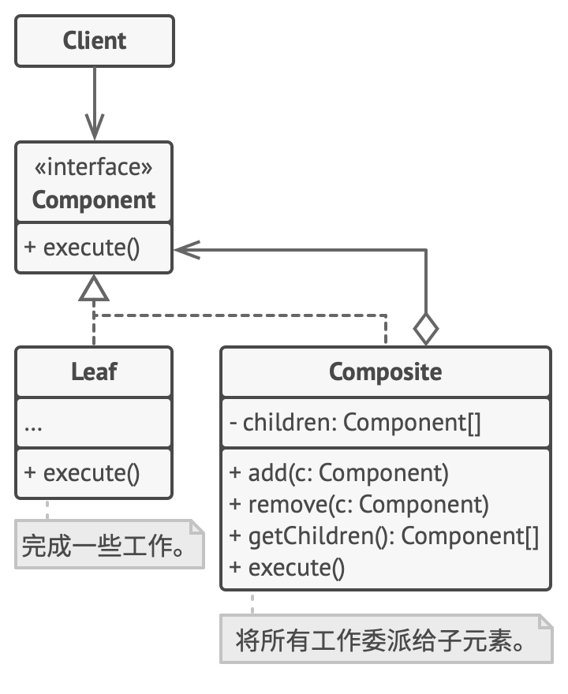

# 组合模式

组合模式是一种结构型设计模式， 你可以使用它将对象组合成树状结构， 并且能像使用独立对象一样使用它们。



应用场景

- 如果你需要实现树状对象结构， 可以使用组合模式。
- 如果你希望客户端代码以相同方式处理简单和复杂元素， 可以使用该模式。

优缺点

- 优点

    - 你可以利用多态和递归机制更方便地使用复杂树结构。
    - 开闭原则：无需更改现有代码， 你就可以在应用中添加新元素， 使其成为对象树的一部分。

- 缺点

    对于功能差异较大的类， 提供公共接口或许会有困难。 在特定情况下， 你需要过度一般化组件接口， 使其变得令人难以理解。

## 实现

```ts
/**
 * The base Component class declares common operations for both simple and
 * complex objects of a composition.
 */
abstract class Component {
  protected parent: Component;

  /**
   * Optionally, the base Component can declare an interface for setting and
   * accessing a parent of the component in a tree structure. It can also
   * provide some default implementation for these methods.
   */
  public setParent(parent: Component) {
    this.parent = parent;
  }

  public getParent(): Component {
    return this.parent;
  }

  /**
   * In some cases, it would be beneficial to define the child-management
   * operations right in the base Component class. This way, you won't need to
   * expose any concrete component classes to the client code, even during the
   * object tree assembly. The downside is that these methods will be empty
   * for the leaf-level components.
   */
  public add(component: Component): void {}

  public remove(component: Component): void {}

  /**
   * You can provide a method that lets the client code figure out whether a
   * component can bear children.
   */
  public isComposite(): boolean {
    return false;
  }

  /**
   * The base Component may implement some default behavior or leave it to
   * concrete classes (by declaring the method containing the behavior as
   * "abstract").
   */
  public abstract operation(): string;
}

/**
 * The Leaf class represents the end objects of a composition. A leaf can't have
 * any children.
 *
 * Usually, it's the Leaf objects that do the actual work, whereas Composite
 * objects only delegate to their sub-components.
 */
class Leaf extends Component {
  public operation(): string {
    return 'Leaf';
  }
}

/**
 * The Composite class represents the complex components that may have children.
 * Usually, the Composite objects delegate the actual work to their children and
 * then "sum-up" the result.
 */
class Composite extends Component {
  protected children: Component[] = [];

  /**
   * A composite object can add or remove other components (both simple or
   * complex) to or from its child list.
   */
  public add(component: Component): void {
    this.children.push(component);
    component.setParent(this);
  }

  public remove(component: Component): void {
    const componentIndex = this.children.indexOf(component);
    this.children.splice(componentIndex, 1);

    component.setParent(null);
  }

  public isComposite(): boolean {
    return true;
  }

  /**
   * The Composite executes its primary logic in a particular way. It
   * traverses recursively through all its children, collecting and summing
   * their results. Since the composite's children pass these calls to their
   * children and so forth, the whole object tree is traversed as a result.
   */
  public operation(): string {
    const results = [];
    for (const child of this.children) {
      results.push(child.operation());
    }

    return `Branch(${results.join('+')})`;
  }
}

/**
 * The client code works with all of the components via the base interface.
 */
function clientCode(component: Component) {
  // ...

  console.log(`RESULT: ${component.operation()}`);

  // ...
}

/**
 * This way the client code can support the simple leaf components...
 */
const simple = new Leaf();
console.log('Client: I\'ve got a simple component:');
clientCode(simple);
console.log('');

/**
 * ...as well as the complex composites.
 */
const tree = new Composite();
const branch1 = new Composite();
branch1.add(new Leaf());
branch1.add(new Leaf());
const branch2 = new Composite();
branch2.add(new Leaf());
tree.add(branch1);
tree.add(branch2);
console.log('Client: Now I\'ve got a composite tree:');
clientCode(tree);
console.log('');

/**
 * Thanks to the fact that the child-management operations are declared in the
 * base Component class, the client code can work with any component, simple or
 * complex, without depending on their concrete classes.
 */
function clientCode2(component1: Component, component2: Component) {
  // ...

  if (component1.isComposite()) {
    component1.add(component2);
  }
  console.log(`RESULT: ${component1.operation()}`);

  // ...
}

console.log('Client: I don\'t need to check the components classes even when managing the tree:');
clientCode2(tree, simple);
```

## 应用

- React 和 Vue 组件化的开发方式
- React Hook 和 Vue Composition API

