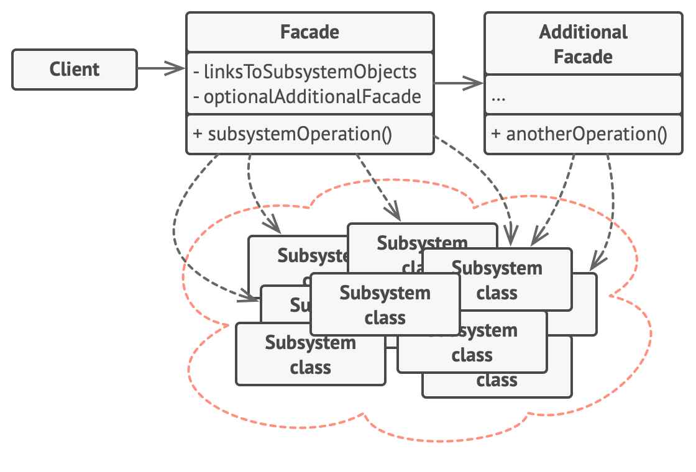

# 外观模式

外观模式是一种结构型设计模式， 能为程序库、 框架或其他复杂类提供一个简单的接口。



适用场景

- 如果你需要一个指向复杂子系统的直接接口， 且该接口的功能有限， 则可以使用外观模式。
- 如果需要将子系统组织为多层结构， 可以使用外观。

## 实现

```ts
/**
 * The Facade class provides a simple interface to the complex logic of one or
 * several subsystems. The Facade delegates the client requests to the
 * appropriate objects within the subsystem. The Facade is also responsible for
 * managing their lifecycle. All of this shields the client from the undesired
 * complexity of the subsystem.
 */
class Facade {
  protected subsystem1: Subsystem1;

  protected subsystem2: Subsystem2;

  /**
   * Depending on your application's needs, you can provide the Facade with
   * existing subsystem objects or force the Facade to create them on its own.
   */
  constructor(subsystem1: Subsystem1 = null, subsystem2: Subsystem2 = null) {
    this.subsystem1 = subsystem1 || new Subsystem1();
    this.subsystem2 = subsystem2 || new Subsystem2();
  }

  /**
   * The Facade's methods are convenient shortcuts to the sophisticated
   * functionality of the subsystems. However, clients get only to a fraction
   * of a subsystem's capabilities.
   */
  public operation(): string {
    let result = 'Facade initializes subsystems:\n';
    result += this.subsystem1.operation1();
    result += this.subsystem2.operation1();
    result += 'Facade orders subsystems to perform the action:\n';
    result += this.subsystem1.operationN();
    result += this.subsystem2.operationZ();

    return result;
  }
}

/**
 * The Subsystem can accept requests either from the facade or client directly.
 * In any case, to the Subsystem, the Facade is yet another client, and it's not
 * a part of the Subsystem.
 */
class Subsystem1 {
  public operation1(): string {
    return 'Subsystem1: Ready!\n';
  }

  // ...

  public operationN(): string {
    return 'Subsystem1: Go!\n';
  }
}

/**
 * Some facades can work with multiple subsystems at the same time.
 */
class Subsystem2 {
  public operation1(): string {
    return 'Subsystem2: Get ready!\n';
  }

  // ...

  public operationZ(): string {
    return 'Subsystem2: Fire!';
  }
}

/**
 * The client code works with complex subsystems through a simple interface
 * provided by the Facade. When a facade manages the lifecycle of the subsystem,
 * the client might not even know about the existence of the subsystem. This
 * approach lets you keep the complexity under control.
 */
function clientCode(facade: Facade) {
  // ...

  console.log(facade.operation());

  // ...
}

/**
 * The client code may have some of the subsystem's objects already created. In
 * this case, it might be worthwhile to initialize the Facade with these objects
 * instead of letting the Facade create new instances.
 */
const subsystem1 = new Subsystem1();
const subsystem2 = new Subsystem2();
const facade = new Facade(subsystem1, subsystem2);
clientCode(facade);
```

## 应用

- 前端业务组件，例如：一个复杂的后台布局组件，包含：logo、菜单和用户信息等，通过外观面试简化成一个参数的配置使用；
- JSON Schema 表单；
