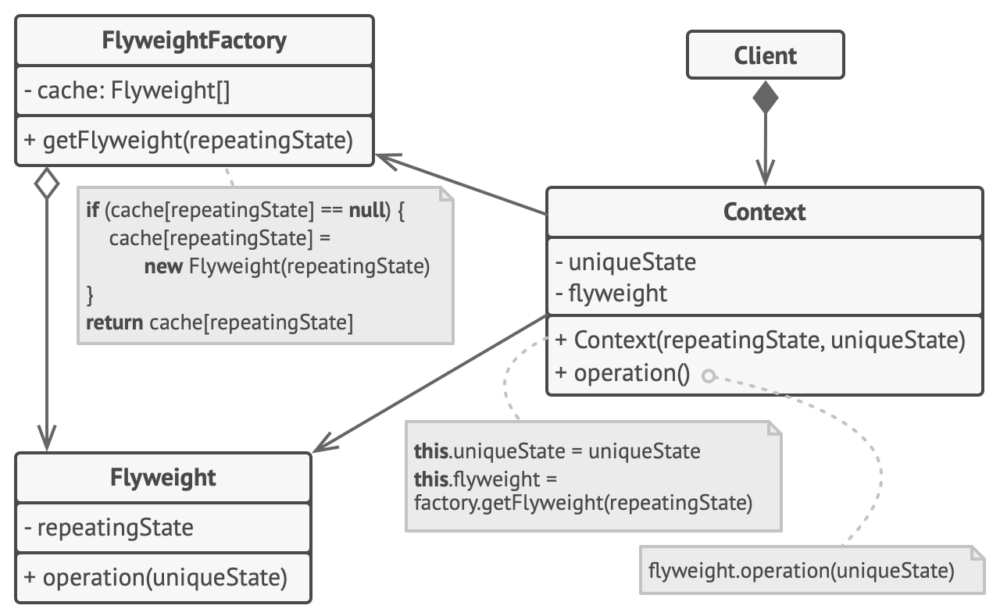

# 享元模式

享元模式（Flyweight），亦称： 缓存、Cache、Flyweight。

享元模式是一种结构型设计模式， 它摒弃了在每个对象中保存所有数据的方式， 通过共享多个对象所共有的相同状态， 让你能在有限的内存容量中载入更多对象。

适用场景：仅在程序必须支持大量对象且没有足够的内存容量时使用享元模式。

优缺点：

- 优点： 如果程序中有很多相似对象， 那么你将可以节省大量内存。
- 缺点：

    - 你可能需要牺牲执行速度来换取内存， 因为他人每次调用享元方法时都需要重新计算部分情景数据。
    - 代码会变得更加复杂。 团队中的新成员总是会问： ​ “为什么要像这样拆分一个实体的状态？”。
