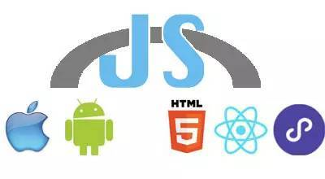

# JS Bridge



JS Bridge 是构建 Native 和非 Native 间双向通信的通道。

ps：现在很少有纯原生的 APP，在大多数 APP 开发过程中，都会通过 H5 来实现部分功能。但是由于 H5 API 能力缺失，或者是因为 W3C 标准推进较慢产生的兼容性问题，导致 JavaScript 无法支持实现一些特殊业务场景，例如：使用 GPS、修改系统配置、本地文件读写等。所以，如果 JavaScript 要用到这些受限的能力时，就需要委托原生去实现，原生完成后，再将结果通知 JavaScript，因此，JavaScript 和原生之间就需要一个通信的桥梁，而这个桥梁本质上就是 WebView（原生应用里嵌入的浏览器组件）与 Javascript 通信的通道，一般称为 WebView JavaScript Bridge, 为了简单，一般简称为 JS bridge。

## 工作原理

JS 调用 Native

- 注入 API

    - iOS

        - UIWebView提供了 JavaScriptScore 方法，支持 iOS 7.0 及以上系统
        - WKWebview提供了 window.webkit.messageHandlers 方法，支持 iOS 8.0 及以上系统。
    
    - Android

        - 4.2 之前，Android 注入 JavaScript 对象的接口是 addJavascriptInterface，但是这个接口有漏洞，可以被不法分子利用，危害用户的安全，
        - 4.2 之后，Android引入新的接口 @JavascriptInterface 以解决安全问题,所以 Android 注入对对象的方式是有兼容性问题的。

- 拦截 URL SCHEME

    - 连续续调用 location.href 会出现消息丢失，因为 WebView 限制了连续跳转，会过滤掉后续的请求。
    - URL 会有长度限制，一旦过长就会出现信息丢失 因此，类似 WebViewJavaScriptBridge 这类库，就结合了注入 API 的形式一起使用，这也是我们这边目前使用的方式，后面会介绍一下。

- 重写 prompt 等原生 JS 方法

Native 调用 JS

- iOS

    - UIWebView：stringByEvaluatingJavaScriptFromString
    - WKWebView：evaluateJavaScript

- Android

    - 在 4.4 以前，通过 loadUrl 方法，执行一段 JS 代码来实现。
loadUrl 方法使用起来方便简洁，但是效率低无法获得返回结果且调用的时候会刷新 WebView 
    - 在 4.4 以后，可以使用 evaluateJavascript 方法实现。该方法效率高获取返回值方便，调用时候不刷新 WebView，但是只支持 Android 4.4+。

JS Bridge 注入方式

- 由 Native 端进行注入

    它的优点在于：桥的版本很容易与 Native 保持一致，Native 端不用对不同版本的 JSBridge 进行兼容；

    它的缺点是：注入时机不确定，需要实现注入失败后重试的机制，保证注入的成功率，同时 JavaScript 端在调用接口时，需要优先判断 JSBridge 是否已经注入成功。

- 由 JavaScript 端引用

    与由 Native 端注入正好相反，它的优点在于：JavaScript 端可以确定 JSBridge 的存在，直接调用即可；

    缺点是：如果桥的实现方式有更改，JSBridge 需要兼容多版本的 Native Bridge 或者 Native Bridge 兼容多版本的 JSBridge。

ps：PhoneGap（Codova 的前身）作为 Hybrid 鼻祖框架，是一个开源的移动开发框架，允许你用标准的web技术-HTML5,CSS3和JavaScript做跨平台的Hybird WebUI开发，应该是最先被开发者广泛认知的 JSBridge 的应用场景。而对于 JSBridge 的应用在国内真正兴盛起来，则是因为杀手级应用微信的出现。

### 应用场景

1. Cordova
2. React Native / Weex
3. 小程序

### 实现方案

- [WebViewJavascriptBridge](https://github.com/marcuswestin/WebViewJavascriptBridge): An iOS/OSX bridge for sending messages between Obj-C and JavaScript in UIWebViews/WebViews.
- [DSBridge-Android](https://github.com/wendux/DSBridge-Android) / [DSBridge-IOS](https://github.com/wendux/DSBridge-IOS)

### DS Bridge

通信原理：我公司用的是 DSBridge，下面以 DSBridge 为例。

- 初始化 webview

    1. https://github.com/wendux/DSBridge-Android/blob/22b19ffaf1/dsbridge/src/main/java/wendu/dsbridge/DWebView.java#L268
    2. https://developer.android.com/reference/android/webkit/WebView#addJavascriptInterface(java.lang.Object,%20java.lang.String)

    在 Webview 构建的时候就注入了 _dsbridge API，这些 API 在 webview 访问 URL 之前就是注册了，会在访问 URL 时出现。

- JS => Native

    https://github.com/wendux/DSBridge-Android/blob/22b19ffaf1/dsbridge/npm/index.js#L19

    由于初始化时就已经注入了 _dsbridge，所以 JS 可以在任何时间点调用 _dsbridge 的通信方法，即使 HTML 还没渲染完，

- Native =》 JS

    https://developer.android.com/reference/android/webkit/WebView#evaluateJavascript(java.lang.String,%20android.webkit.ValueCallback%3Cjava.lang.String%3E)

    通过 evaluateJavascript 方法执行 JS 代码，传给这个方法的脚本会在 webview js 线程空闲时执行脚本，

    没找到底层实现的源码：https://android.googlesource.com/platform/frameworks/base/+/refs/heads/master/core/java/android/webkit/WebView.java#890，实际测试如下：

    ```html
    <script>
      _dsbridge.call('xxx', () => {
        console.log(1);
      });
    </script>
    <script src="一个外部脚本"><script>
    <script src="">
      console.log(2)
    <script>
    ```

    输出的日志顺序是先 1 后 2，从结果来看，js =》native =》js 的通信并不受页面资源和 DOM 加载完成事件的影响。

问题：JS 调用协议存在的延迟？

解答：

1. webview 加载 HTML
2. webview 解析到 img 标签，加载 img 资源 
3. webview 解析到 script 标签，加载 script 资源并挂起等待，加载完成后执行 script
4. script 里调用 js bridge 注入的 api，native 接收到调用，开始执行处理逻辑，完成后通过 evaluateJavascript 发送回调信息
5. 等待 webview 执行完当前的 script 标签，执行完后继续解析 HTML，遇到下一个 script 标签则开始加载 script 并挂起等待，这个时候 JS 线程处于空闲，可以执行 evaluateJavascript 注入的代码

存在的延迟指的是回调必须等到当前 script 脚本执行完，实际延迟在几毫秒左右，实际代码测试结果也是如此。

以上只考虑了 webview 提供的新的通信方式，没有考虑 js =》 native 通过 schema 或者 prompt 等方式的通信。

参考文献

- [跨平台Js bridge新秀-DSBridge Android篇](https://segmentfault.com/a/1190000012403985)

## JS-SDK

...

## TODO

- Chrome Devtool 模拟 JS-SDK
- 掌通客户端支持小程序开发（实现类微信小程序的能力，并且复用代码）
- 调研注入时机问题

    - [打开一个 HTML5 页面，往 Webview 注入一段 JsBridge 的时机？](https://www.v2ex.com/t/377333)
    - [WebView JsBridge注入时机探讨](https://www.jianshu.com/p/bdf78331fea1)

## 参考文献

- [JS Bridge 通信原理与实践](https://juejin.cn/post/6916316666208976904)
- [JSBridge 技术原理分析](https://toutiao.io/posts/tgnm0lc/preview)
- [JSBridge的原理](https://juejin.cn/post/6844903585268891662)
- [JS Bridge 通信原理](https://zhuanlan.zhihu.com/p/343317967)
- [OC 常见的几种 JS 交互方式](https://quxiaolei.github.io/OC%E5%B8%B8%E8%A7%81%E7%9A%84%E5%87%A0%E7%A7%8DJS%E4%BA%A4%E4%BA%92%E6%96%B9%E5%BC%8F.html)
- [iOS WKWebView详解及JS Bridge同步调用问题](https://easeapi.com/blog/blog/152-ios-wkwebview.html)
- [Android 安全系列之---WebView中接口隐患与手机挂马利用](https://blog.csdn.net/jackrex/article/details/11110675)
- [使用 JavaScriptCore 实现 JS 和 OC 间的通信](https://imciel.com/2016/06/18/oc-js-communication/)
- [一篇文章了解Js Bridge](https://segmentfault.com/a/1190000013415792)
- [前端 WebView 指南之 Android 交互篇](https://75.team/post/android-webview-and-js)
- [小白必看，JSBridge 初探](https://www.zoo.team/article/jsbridge)
- [Webview与JS交互和Webview性能优化笔记](https://jackeychens.github.io/2018/10/23/%E8%AE%B0Webview%E5%BE%97%E4%B8%80%E4%BA%9B%E7%9F%A5%E8%AF%86/)
