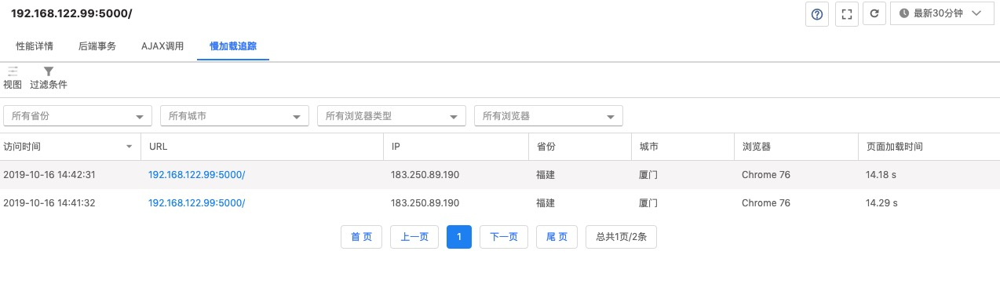
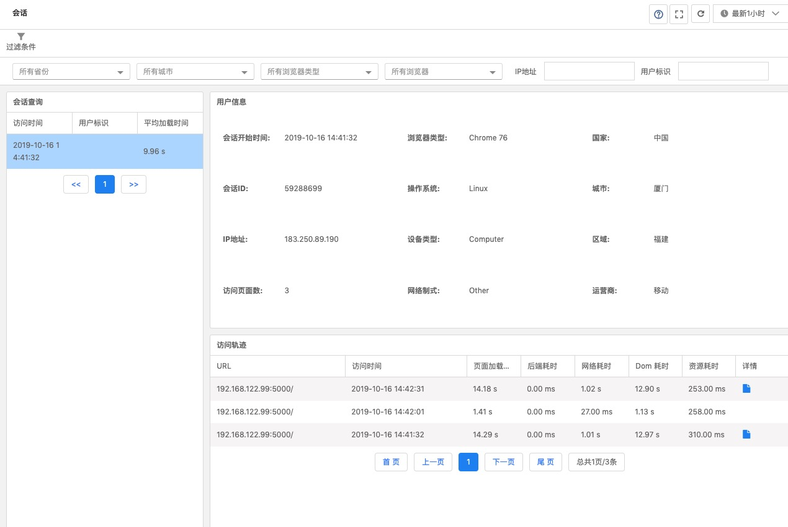

# [OneAPM](https://www.oneapm.com)

- [社区](http://club.oneapm.com/)
- [博客](http://blog.oneapm.com/)
- [文档](https://www.oneapm.com/others/onehelp.html)

    - [Browser Insight 帮助中心](http://docs-bi.oneapm.com/book/)

## 产品矩阵

- Application Insight：服务端性能监控
- Browser Insight：浏览器端性能监控
- Mobile Insight：移动端性能监控
- Network Insight：网络应用性能监控

## Browser Insight

- [报价](https://www.oneapm.com/bi/price.html)
- [文档](http://docs-bi.oneapm.com/index.html)

### [安装配置](http://docs-bi.oneapm.com/agent/)

- AI 自动注入 JS
- 手动复制/黏贴 JS

### 功能特性

#### 应用列表

- 数据过滤：时间范围
- 视图切换：表格、卡片
- 列表数据

    - 应用名称
    - Apdex：
    
        Apdex指数=（1.0*满意样本数+0.5*容忍样本数）/样本总数（值介于0-1之间）
        
        Apdex (Application Performance Index)是一个国际通用标准，是对用户对应用性能满意度的量化值，定义了 3 个用户满意度区间：
        
        - 满意：这样的响应时间让用户感到很愉快，响应时间少于 2 秒钟。
        - 容忍：慢了一点，但还可以接受，继续这一应用过程，响应时间 2～8 秒。
        - 失望：太慢了，受不了了，用户决定放弃这个应用，响应时间超过 8 秒。

    - 用户体验一览：按 Apdex 统计满意、容忍和失望数量，并可视化展示
    - 页面加载时间：`performance.timing.loadEventEnd - performance.timing.navigationStart`
    - 页面访问量
    - 页面访问量/分钟：吞吐率
    - Ajax 响应时间：？
    - Ajax 调用量/分钟：？
    - JS 错误

用法：

1. 按“Apdex“排序查看用户体验排行榜，并结合用户体验一览分析用户体验分布值

    分析”Apdex“指数分较低原因，例如：有些应用”页面加载时间“不会很长，但”Apdex“值很低，可能原因是应用性能波动较大。

2. 按“页面加载时间”排序查看应用性能排行榜

    针对”页面加载时间“最大的项目进行分析优化

3. 按“页面访问量”和“页面访问量/分钟”排序查看应用热度排行榜
4. 按“JS错误”排序查看错误率排行榜

#### 仪表盘 

- 总览：

    

    

    - 平均访问量 & 平均加载时长：页面访问量（PV） & 页面平均加载时间趋势图

        用于观察访问量和加载时长的时间变化曲线

    - 性能区间

        用于分析性能区间的时间变化曲线，辅助平均加载时长分析慢加载原因。例如：从平均加载时长的时间变化曲线观察到某一时间点的加载时间较长，可以在对应的性能区间的同一时间点分析加载慢的原因（网络慢、服务端性能不稳定或者其他原因）。
    
        - Web 应用：服务器生成网页消耗时间（需要部署 Ai ）
        - 网络：网络连接时间和网页在网络上传输消耗时间

            `performance.timing.responseEnd - performance.timing.navigationStart`

        - DOM构建：加载网页到 DOM 模型建立消耗时间

            `performance.timing.domContentLoadedEventEnd - performance.timing.responseEnd`

        - 资源渲染：网页 DOM 模型建立到网页渲染结束的消耗时间

            `performance.timing.loadEventEnd - performance.timing.domContentLoadedEventEnd`

            TODO: 如果是懒加载资源是否能检测到？

    - Ajax 调用量 & 平均响应时间：展示当前时间段的 ajax 的调用量以及平均响应时间变化趋势
    - Apdex：展示当前时间段的 Apdex 时间变化趋势

        Apdex 作为用户体验指数，可以分析用户体验的时间变化趋势，发现某段时间体验指数很低，可以去着手分析平均加载时长和性能区间。

    - JS 错误 Top5：展示选定时间内 JS 错误类型 TOP5 随时间变化趋势
    - 城市 Top 10：展示选定时间内页面访问量占比最高的城市 Top 10 分布
    - 地域分布：展示选定时间内页面访问和平均加载时间的地理分布状况

        分析不同地域的平均加载时间，是否存在很大差异，如果存在性能较差的区域，需要分析是什么原因，再进行优化。

    - 浏览器 Top 10：展示选定时间内页面访问量占比最高的浏览器 Top 10 分布

        可供开发人员参考做兼容性和性能优化配置。

    - 关键业务：选择一条或多条 url 定义为关键业务，展示关键业务的响应时间变化趋势
    - 访问页面：展示选定时间内页面访问量占比最高的页面

- 地理慢加载追踪

    

    

    - 在地图上按不同区域的平均加载时长作为指标标注地图颜色，颜色越深的表示加载越慢。

        点击地图的省份和城市可以查看该区域的慢加载记录，从而进一步分析原因

    - 显示加载时间最慢的 URL

        访问时间、URL、IP、地址、浏览器、加载时间、Web 应用程序耗时、网络耗时

- 地理用户会话视图

    

    

#### 特征统计

- 地理区域

    

    - 平均加载时间、DOM 构建时间，Apdex 时间变化曲线

        作为参考分析值

    - 不同地域位置的平均加载时间，以地图颜色标记的形式展现

        分析哪个区域的加载速度较慢，且可以点击某个区域进行细分查看，需要结合访问量，平均加载时间和时间变化曲线分析。

    - 平均加载时间-地域分析 Top 5：显示平均加载时间 Top 5 的城市

        数据受选择区域影响

    - 访问量-地域分布 Top 5：显示访问量 Top 5 的城市

        数据受选择区域影响

    - 访问量和平均加载时间：显示时间变化曲线

        数据受选择区域影响

    TODO: 缺少性能区间的时间变化曲线，便于分析导致性能差的原因（虽然大概率是网络因素）。

- 浏览器

    

    

    - 饼状图：直观显示浏览器访问量占比
    - 表格：显示不同浏览器的 Apdex、平均加载时间、访问量、网络耗时、DOM 构建时间、页面资源耗时

    TODO: 缺少浏览器版本信息

- 运营商

    

    

    - 饼状图：直观显示运营商访问量占比
    - 表格：显示不同运营商的 Apdex、平均加载时间、访问量、网络耗时、DOM 构建时间、页面资源耗时

- 设备

    

    

    - 饼状图：直观显示不同设备访问量占比
    - 表格：显示不同涉笔的 Apdex、平均加载时间、访问量、网络耗时、DOM 构建时间、页面资源耗时、白屏时间和首屏时间

- IP

    可以用来协助排查用户反馈加载性能慢的问题

    

    

    

- 用户标识

    

#### 慢加载追踪

每条记录显示时间、地点、IP、浏览器、平均加载时间、网络耗时，点击 URL 可以查看加载明细信息：源信息、加载耗时图表和资源列表时序图等。

- Unload: `performance.timing.navigationStart - performance.timing.navigationStart` / `performance.timing.unloadEventEnd - performance.timing.navigationStart`
- Redirect: `performance.timing.redirectStart - performance.timing.navigationStart` / `performance.timing.redirectEnd - performance.timing.navigationStart`
- Cache: `performance.timing.fetchStart - performance.timing.navigationStart` / `performance.timing.performance.timing.domainLookupStart - performance.timing.navigationStart`
- DNS: `performance.timing.domainLookupStart - performance.timing.navigationStart` / `performance.timing.domainLookupEnd - performance.timing.navigationStart`
- TCP: `performance.timing.connectStart - performance.timing.navigationStart` / `performance.timing.connectEnd - performance.timing.navigationStart`
- Response: `performance.timing.responseStart - performance.timing.navigationStart` / `performance.timing.responseEnd - performance.timing.navigationStart`
- DOM: `performance.timing.responseEnd - performance.timing.navigationStart` / `performance.timing.domContentLoadedEventEnd - performance.timing.navigationStart`
- Page: `performance.timing.domContentLoadedEventEnd - performance.timing.navigationStart` / `performance.timing.loadEventEnd - performance.timing.navigationStart`

ps：可以按照位置和浏览器过滤数据。

#### 访问页面

- 页面列表：显示所有页面的性能情况

    

    可以按页面类型、访问量和加载时间来过滤数据，查询结果包含：URL、Apdex、平均加载时间、访问量、访问量/每分钟、Web 应用耗时、DOM 构建耗时、资源渲染耗时、白屏时间、首屏时间，最终用户体验时间。点击 URL 可以查看该页面详细性能信息。

- 页面详情：类似应用仪表盘，这是页面仪表盘

    

- 后端事务：？

    

- Ajax 调用：

    
    
- 慢加载追踪

    

#### Ajax

每个 Ajax 请求的平均加载性能

- URL
- 请求方式
- 调用量
- 调用量/分钟
- 平均响应时间
- Web 应用耗时
- 回调函数执行时间
- 返回数据大小
- 正确率

- 关键业务：？
- 组合分析：地理+系统+浏览器+访问量+...
- 单页面：？
- 会话：按浏览器会话分析用户的访问统计信息和访问轨迹，以及加载性能
- 报表：？
- 告警：？
- 设置：？

#### 其他

- 脚本错误：错误信息统计和错误页面统计

    

- 关键元素：关键用户和关键业务

    

- 组合分析：结合地理位置、浏览器、运营商、访问量和加载性能来综合分析

    

- 单页面：？

    

- 会话

    

    - 过滤条件
    - 会话查询
    - 用户信息
    - 访问轨迹

- 报表：日报和周报

    

    - 日期
    - 趋势：日报显示 24 小时内的变化趋势
    - 平均加载时间
    - 访问量
    - 用户满意度
    - 导出

        [oneapm-report-daily-9992026-2019-10-15.pdf](./assets/oneapm-report-daily-9992026-2019-10-15.pdf)

- 告警

    
