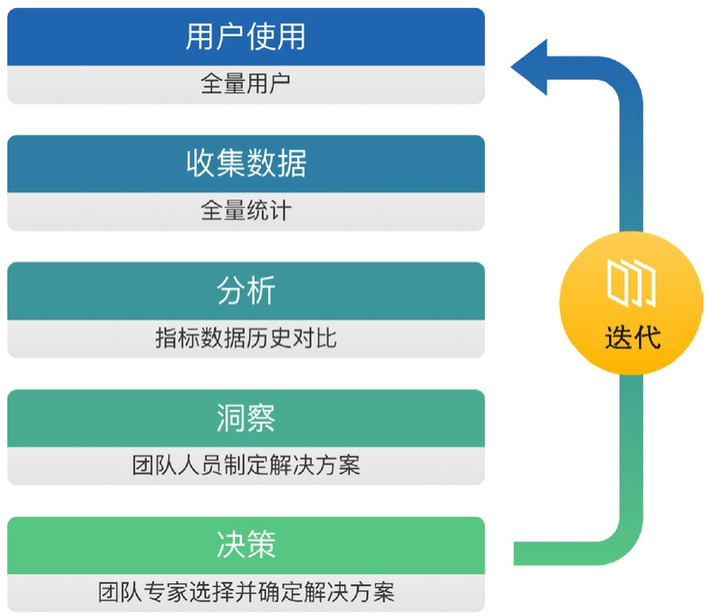
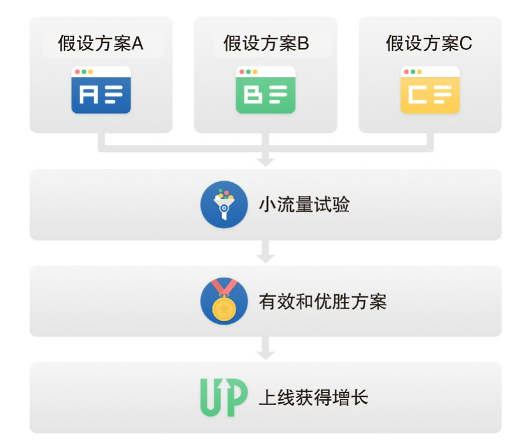
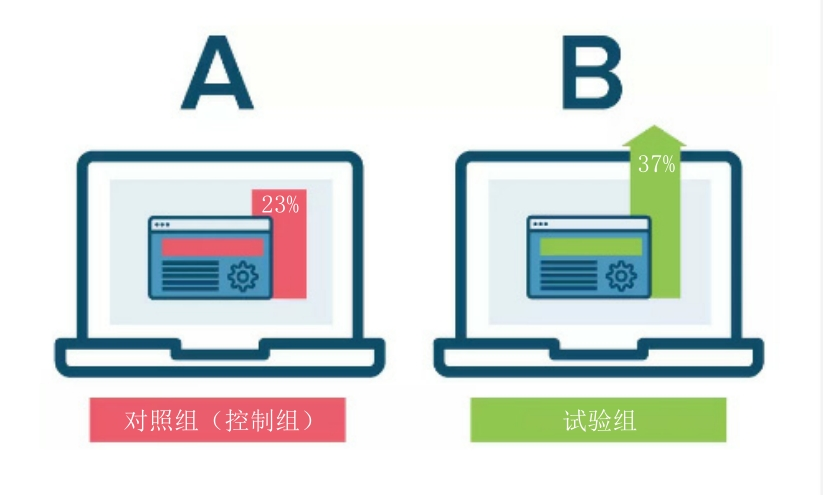
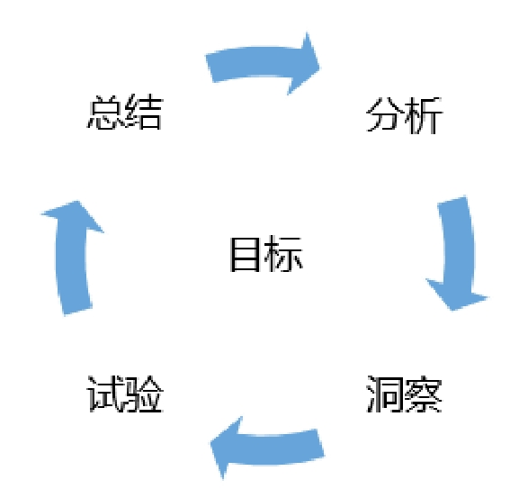
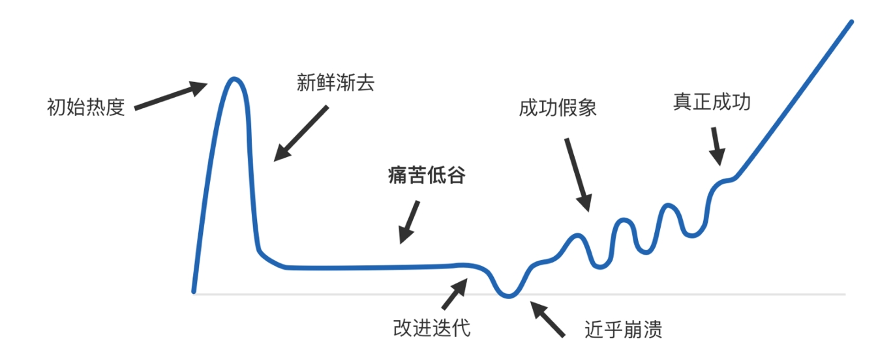
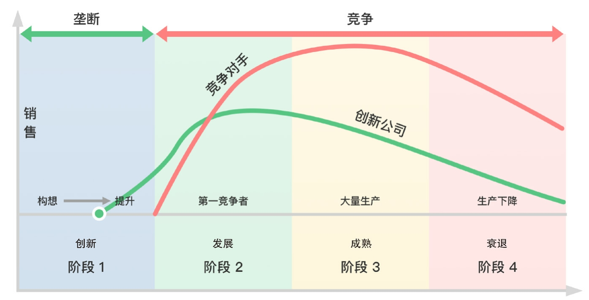
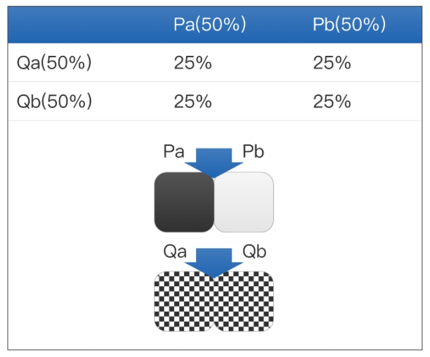
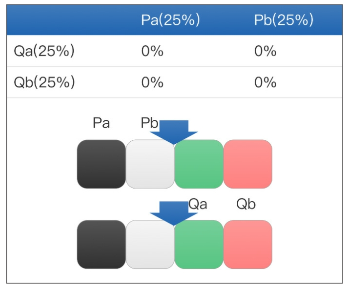
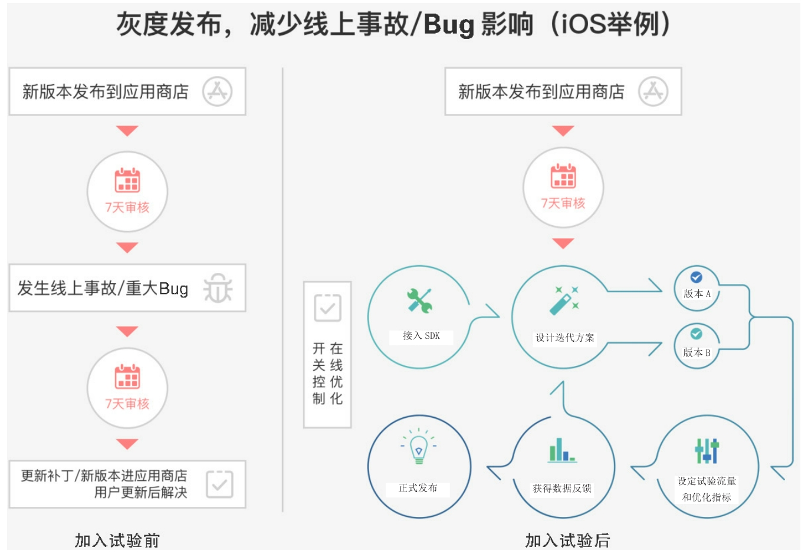

# AB 测试

## 背景

### 生活处处有试验

- 日常生活中，每个人每一天都会遇到各种需要选择的情形：

    > 1. 今天穿黑色还是白色的 T 恤出门？
    > 2. 晚上外出的时候要不要带伞？
    > 3. 西红柿炒鸡蛋到底要不要放糖？
    >
    > 当我们为了解决某一个问题而在不同的备选方案中做出选择时，就已经开启了一个个试验，试验的结果就是所谓的经验。

- 医学临床对照试验

    > 在医学的临床试验中，为了验证新药的效果，把病人随机分成若干组，分别施予不同剂量的新药、已知有疗效的药物、安慰剂等不同的治疗措施，并通过数据分析判定不同组的治疗效果，从而确定新药是否有疗效以及和已知药物的疗效的对比情况。
    >
    > 只有采用科学的临床试验设计方法，来客观观察和判断药物的临床疗效并反复优化，最终才有可能推向市场。A/B 测试也是医药行业对全社会最具影响力的理论之一。

### 数据分析与试验

  
  &nbsp;=>&nbsp;  
  

- 先验：归纳总结式数据分析

    > 经过长期调查后发现，国内仍有许多知名企业在文化思维层面和实践层面都偏向于“后验”的方法。这种模式的优势在于严谨、规范的流程。用户量越大，调研越充分，最终的决策风险就会越小；但是其劣势也非常显著：效率低，许多业务优化点被埋没在数据整理的漫长过程中，最终还是依赖个人经验来实现突破性的创新。

- 后验：A/B 测试

    通过科学的试验设计、采样样本代表性、流量分割与小流量测试等方式来获得具有代表性的试验结论，并确信该结论可推广到全部流量。

### 试验思维的价值

- 低成本探索：随着近年来互联网应用的普及，通过在互联网上运行大量试验，试验的经济效率得到了几何级数的提升。业务人员不必猜哪个方案表现得更好，试验（特别是A/B测试）成为驱动业务增长的有效工作方法，实现了低成本的探索和持续的优化。

    
    
    

- 快速试错：传统思维崇尚产品固定、用户多样、精细调研和谨慎决策，而互联网思维则瞄准流量，积极地进行产品迭代，大胆试错，小心求证。在互联网真正成为现代商业模式的核心之前，传统产品和早期的互联网产品（如微软Office），还没有快速试错的概念。而随着小米等新势力的崛起，互联网思维作为一种全新的思维方式在中国大地普及开来。

    传统软件产品一旦生产出厂后就固定不变了，至少一个正式发售的版本是保持稳定不变的。与此不同，互联网产品是持续迭代变化的，从最初的 MVP（最小可行性产品）版本开始，根据用户的线上反馈，快速改进，不断迭代。

- 驱动创新

    

    > 创新产品在诞生的初期往往备受关注，但是也同样被市场所怀疑。在真正面市之后，通常会发现产品和市场需求之间并不一定恰好匹配，甚至产品可能无人问津。如何才能让创业真正成功呢？坚持、迭代、改进、试验，直到触达市场契合，才会开始爆发式地成长。创业成功绝不是一夜暴富，而是尊重市场、高效试验、持之以恒的结果。

    

    > 一个企业在早期可以靠创新垄断市场，但是在之后的发展期和成熟期就会遇到越来越激烈的竞争，这会逼迫企业不停地尝试新策略、新产品，以维持市场领先，

## 定义

> 为了验证一个新的产品交互设计、产品功能或者策略、算法的效果，在同一时间段，给多组用户（一般叫作对照组和试验组，用户分组方法统计上随机，使多组用户在统计角度无差别）分别展示优化前（对照组）和优化后（试验组，可以有多组）的产品交互设计、产品功能或者策略、算法，并通过数据分析，判断优化前后的产品交互设计、产品功能或者策略、算法在一个或者多个评估指标上是否符合预期的一种试验方法。

### 特性

- 预测性：A/B测试是一种预测手段，而且是一种科学、精准、具有统计学意义的预测手段。

    > 在产品、策略迭代过程中，我们往往无法预测产品、策略全量上线的效果如何，或是担心因此带来预料之外的损失。A/B测试恰好提供了通过小流量试验预测全量上线效果的能力，这种预测并不是“裸奔”性质的臆测，而是有科学的统计数据作为支撑的科学预测，也只有这样的预测才能从真正意义上降低产品、策略迭代过程中的风险。同时，A/B测试的统计数据也为产品迭代过程提供了很好的量化指标，可以帮助决策者准确衡量产品技术团队的产出成绩，在团队、人员的激励上提供科学依据。

- 并行性：A/B测试的并行性是指两个或者多个版本同时在线，分别提供给多组用户群体使用。
- 科学性：A/B测试是一种科学试验。

    1. A/B测试的采样方法是科学采样方法，而非普通的随机采样方法。
    2. A/B测试评价结果的计算过程具有科学性。

### 类型

- 正交实验

    

- 互斥实验

    

### 误区

- 用户分流不科学
- 盲目分层
- 不考虑试验数据的统计有效性

## 实践

“明确战略目标（北极星指标）” => "北极星指标的拆解" => "搭建试验的基础设施" => "制定试验的实施计划" => "管理试验项目" 

ps：

- 北极星指标

    对于任何一家公司来说，无论是互联网公司还是传统公司，都有一个对于公司发展最为重要的业务指标，这个指标就是北极星指标。

    1. 电商（类）平台行业通常可以选取GMV（商品交易总额）作为指标。
    2. 网络视频行业可以选取用户总观看时长作为指标。
    3. 社区类产品可以选取用户总回答数作为指标。

- ...

## 应用

### 不同行业的应用

- 医疗临床对照实验
- ...

### 不同业务场景和人群的应用

- 在市场部门的人，一定会关注：如何策划营销活动最高效？花了钱，如何保障市场推广效果？•
- 在产品部门的人，一定会关注：我设计的流程是不是能带来最高的用户留存？我设计的详情页是否能让用户一眼就找到他想要的信息？•
- 在运营部门的人，一定会关注：我花了2天，改了5遍稿件的内容，用户会看一眼就点进来么？怎么选配图才好呢？
- 在后台服务开发的人，一定会关注：页面总是被讨厌的广告劫持怎么办？是不是该将通信协议从HTTP换成HTTPS？页面加载性能不会有问题吧？

#### 开发人员

- 灰度发布

    

## 参考文献

- [Firebase A/B Testing](https://firebase.google.com/products/ab-testing?hl=zh-cn)
- [火山引擎 A/B 测试](https://www.volcengine.com/docs/6287/65794)
- [如果老板问你，什么是A/B Testing，你该怎样回答？](https://martechcareer.com/advice/2018/6/12/yabie7cl1eqjtn565i1flruaae1tz9)
- [什么是 A/B 测试？](https://www.zhihu.com/question/20045543)
- [《A/B 测试：创新始于实验》](https://book.douban.com/subject/33398229/)
