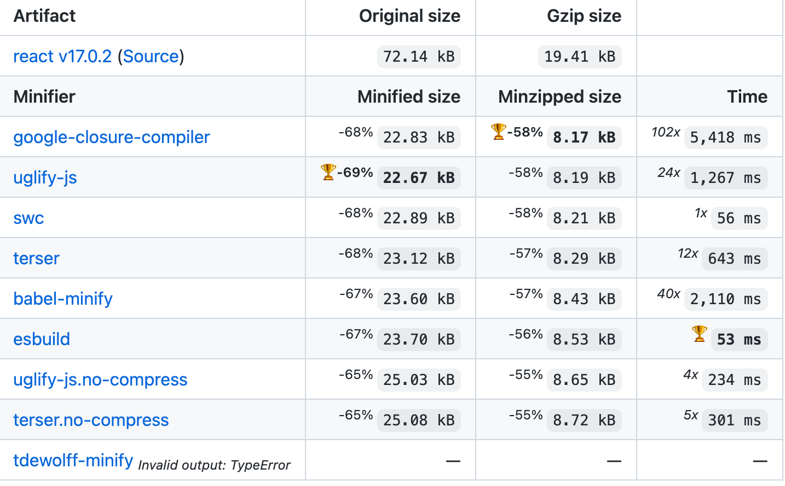

# JavaScript 代码压缩优化

> Minification，极简化（另称缩小化），指的是在不影响功能的情况下，移除所有非必要的源代码（如：空白、换行、注解等）。

- 删除不需要的字符
- 不改变源代码的功能

## Tools

- [closure-compiler](https://github.com/google/closure-compiler) - A JavaScript checker and optimizer.
- [UglifyJS](https://github.com/mishoo/UglifyJS2) - JavaScript parser / mangler / compressor / beautifier toolkit
- [babel-minify](https://github.com/babel/minify) - An ES6+ aware minifier based on the Babel toolchain (beta)
- [terser](https://github.com/terser/terser) - JavaScript parser, mangler and compressor toolkit for ES6+
- [esbuild/minify](https://esbuild.github.io/api/#minify) - ESBuild
- [tdewolff/minify](https://github.com/tdewolff/minify) - Go minifiers for web formats
- [swc/minification](https://swc.rs/docs/configuration/minification) - SWC

发展历史

1. 2001年： Douglas Crockford 介绍了 [JSMin](https://web.archive.org/web/20020405140416/https://www.crockford.com/javascript/jsmin.html)，可以删除 JavaScript 代码中的注释和空格；
2. 2007年：雅虎团队推出了 [YUI Compressor](https://yui.github.io/yuicompressor/)（基于 Java 实现）
3. 2009年：Goole 开源了 [Closure Compiler](https://github.com/google/closure-compiler)，实现了 source map 功能
4. 2010年：Mihai Bazon 介绍了 [UglifyJS](https://github.com/mishoo/UglifyJS)
5. 2012年：[UglifyJS](https://github.com/mishoo/UglifyJS) 被 [UglifyJS2+](https://github.com/mishoo/UglifyJS2) 取代，支持了 source map
6. 后面随着浏览器对 ES6/ES2015 的支持度越来越高，[UglifyJS](https://github.com/mishoo/UglifyJS) 并不支持 ES6+ 语法，而 Babel 本身就有解析器可以支持新的语法，所以 Babel 基于自身的工具链开发了 [babel-minify](https://github.com/babel/minify)。但截止到本文编写时间，babel-minify 还处于实验中，不建议在生产环境中使用。
6. [terser](https://github.com/terser/terser) Fork 了 [UglifyJS](https://github.com/mishoo/UglifyJS) 的代码，并支持了 ES6+ 语法，而 API、CLI 与 UglifyJS 是基本兼容的。Webpack 在 4.x 版本中采用 terser 作为默认的 Minifier（原先是 UglifyJS）。

[基准测试](https://github.com/privatenumber/minification-benchmarks)：



ps：下文主要以 Terser 为例介绍 Minification 的工作原理。

## Optimize

除了删除空格和注释外，Minifier Optimizer 会基于 JavaScript 的语法特性进行代码转换，将一些复杂的表达式转为等价的更精简的写法。例如：

- arrows: `()=>{return x}` to `()=>x`
- arguments: `function(a){console.log(arguments[0])}` to `function(a){console.log(a)}`
- booleans: `!!a ? b : c` to `a ? b : c`
- booleans_as_integers: `true` to `!0`
- comparisons: `a = !b && !c && !d && !e` to `a=!(b||c||d||e)`
- evaluate

    ```js
    (function () {
      var a = 1;
      a += 2
      console.log(a);
    }());
    ```

    to

    ```js
    console.log(3);
    ```
- unused

    ```js
    (function () {
      function cube(value) {
        return value * value * value;
      }
      console.log(cube(3));
    }());
    ```

    to

    ```js
    !function() {
      var value;
      console.log((value = 3) * value * value);
    }();
    ```

## Mangle

Mangler 将本地变量和函数名缩减为单个字符，例如：

源代码

```js
function funcName(firstLongName, anotherLongName) {
  return firstLongName +  anotherLongName;
}
```

Mandle 后：

```js
function funcName(a,n){return a+n};
```

这种优化必须满足以下要求：

- 你不会直接使用全局 `eval` 函数
- 你不会使用 `with` 语句
- 你不会访问 `Function.name` 属性

Terser 会自动检测前面两种情况，如果某块代码使用了 `eval` 或 `with`，那么会自动在该块代码禁用 mangler。但是 Terser 无法检测你是否使用了 `Function.name`，这种情况下可能会影响代码的正常运行。

## Obfuscator

Minifier 的目的是让代码最小化，而不是为了让代码难以阅读。虽然 Minifier 去掉了源码中多余的字符并重命名变量，让生成代码变得更难阅读，但是使用一些代码美化工具还是可以让他们变得容易阅读。如果需要混淆代码，需要借助特殊的工具，并且生成的代码也不是最小化的。

[JavaScript Obfuscator Tool](https://obfuscator.io) 是一个比较不错的 JavaScript 混淆器，它通过一系列的转换（如变量、函数和参数的重命名），引入一些额外的代码片段来防止调试和逆向工程化，还将字符串转换为 `\xAB` 十六进制代码，使事情更难理解。

源码：

```js
// Paste your JavaScript code here
function hi() {
  console.log("Hello World!");
}
hi();
```

混淆后：

```js
var _0x1d8e=['Hello\x20World!'];(function(_0x332611,_0x3e0895){var _0x46b6a1=function(_0x1af7a){while(--_0x1af7a){_0x332611['push'](_0x332611['shift']());}};_0x46b6a1(++_0x3e0895);}(_0x1d8e,0x185));var _0x59d9=function(_0x5dc5e7,_0x569e05){_0x5dc5e7=_0x5dc5e7-0x0;var _0x3e6d14=_0x1d8e[_0x5dc5e7];return _0x3e6d14;};function hi(){console['log'](_0x59d9('0x0'));}hi();
```

相关插件：

- [webpack-obfuscator](https://github.com/javascript-obfuscator/webpack-obfuscator) - javascript-obfuscator plugin for Webpack
- [rollup-plugin-javascript-obfuscator](https://github.com/javascript-obfuscator/rollup-plugin-javascript-obfuscator) - Rollup plugin for javascript-obfuscator

## DEC(Dead Code Elimination)

DCE（死码消除），是一种编译器原理中编译最优化技术，它的用途是移除对程序运行结果没有任何影响的代码。Dead Code 一般具有以下几个特征：

- 代码不会被执行，不可到达
- 代码执行的结果不会被用到
- 代码只会影响死变量（只写不读）

源码：

```js
function f() {
  a();
  b();
  x = 10;
  return;
  if (x) {
      y();
  }
}
```

DCE 后：

```js
function f() {
  a();
  b();
  x = 10;
  return;
}
```

还有个很常见场景是在开发环境引入调试工具：

```js
if (process.env.NODE_ENV === 'development') {
  const eruda = require('vconsole');
  const vConsole = new VConsole();
}
```

在代码压缩时 `process.env.NODE_ENV` 会替换为 `'development'`，Terser 计算出 `'development' === 'development'` 的值为 `true`，在进行 DCE 时会消除该部分代码。

## [Side Effects](https://en.wikipedia.org/wiki/Side_effect_(computer_science))

一个函数或者表达式修改了外部变量的状态，那么就认为这个操作是有副作用的。Minifer 在 DCE 时会移除对程序运行结果没有任何影响的代码，但对于带有副作用的代码是不会消除的。

- 修改外部变量或者对象属性（全局变量或者父函数作用域变量）
- 打日志到控制台
- 网络请求
- 调用其他副作用函数

举个例子，比如这个函数：

```js
function go (url) {
  window.location.href = url
}
```

这个函数修改了全局变量location，甚至还让浏览器发生了跳转，这就是一个有副作用的函数。

下面，我们再看一个例子：

```js
function rereturn(x) {
  return x;
}
rereturn(window);

function square ( x ) {
  return x.innerHeight * x.innerHeight;
}
square(window);
```

Minify 后：

```js
var i;window,(i=window).innerHeight,i.innerHeight;
```

结果中仍然保留了 square 函数和对 innerHeight 属性的访问，这是因为获取属性可能触发 getter 或者 setter 方法，而getter、setter是不透明的，有可能会产生副作用。那你可能会问 Terser 有设置属性访问为没有副作用的配置吗？答案是有的，将 compression 的配置项 `pure_getters` 设为 true 就可以了。

思考：为什么 Terser 就不能智能的识别出我是否有给对象设置 getter 方法，从而判断属性访问是否有副作用呢？答案是不行的，Terser 没有完善的程序流分析，它可以简单的判断变量后续是否被引用、修改，但是不能判断一个变量完整的修改过程，不知道它是否已经指向了外部变量，所以很多有可能会产生副作用的代码，都只能保守的不删除。那么我要怎样才能删除掉我确信没有副作用的代码呢？下面再看一个示例：

- 源代码：声明了一个类 Animal，但是实际上并没有使用到

    ```js
    class Animal {
     say() {
       console.log('xxx');
     }
    }
    ```

- Babel 编译后：

    ```js
    "use strict";
    
    function _classCallCheck(instance, Constructor) {
      if (!(instance instanceof Constructor)) {
        throw new TypeError("Cannot call a class as a function");
      }
    }
    
    function _defineProperties(target, props) {
      for (var i = 0; i < props.length; i++) {
        var descriptor = props[i];
        descriptor.enumerable = descriptor.enumerable || false;
        descriptor.configurable = true;
        if ("value" in descriptor) descriptor.writable = true;
        Object.defineProperty(target, descriptor.key, descriptor);
      }
    }
    
    function _createClass(Constructor, protoProps, staticProps) {
      if (protoProps) _defineProperties(Constructor.prototype, protoProps);
      if (staticProps) _defineProperties(Constructor, staticProps);
      return Constructor;
    }
    
    var Animal =
      /*#__PURE__*/
      (function() {
        function Animal() {
          _classCallCheck(this, Animal);
        }
    
        _createClass(Animal, [
          {
            key: "say",
            value: function say() {
              console.log("xxx");
            }
          }
        ]);
    
        return Animal;
      })();
    ```
    
    注意点：`Var Animal =` 下面有一行注释 `/*#__PURE__*/`，这个是用来标明这里的立即执行函数是没有副作用的。
    
- 不带 `/*#__PURE__*/` Minify：将编译后的代码里的 `/*#__PURE__*/` 去掉，执行 `terser -b -c 'module=true' -o ./source.min.js ./source.js`（这里 terser 置编译的源代码是一个模块化文件）

    ```js
    function _defineProperties(target, props) {
        for (var i = 0; i < props.length; i++) {
            var descriptor = props[i];
            descriptor.enumerable = descriptor.enumerable || !1, descriptor.configurable = !0, 
            "value" in descriptor && (descriptor.writable = !0), Object.defineProperty(target,     descriptor.key, descriptor);
        }
    }
    
    !function() {
        function Animal() {
            !function(instance, Constructor) {
                if (!(instance instanceof Constructor)) throw new TypeError("Cannot call a class as     a function");
            }(this, Animal);
        }
        var Constructor, protoProps, staticProps;
        Constructor = Animal, (protoProps = [ {
            key: "say",
            value: function() {
                console.log("xxx");
            }
        } ]) && _defineProperties(Constructor.prototype, protoProps), staticProps &&     _defineProperties(Constructor, staticProps);
    }();
    ```

- 带 `/*#__PURE__*/` Minify：将编译后的代码里的 `/*#__PURE__*/` 去掉，执行 `terser -b -c 'module=true' -o ./source.min.js ./source.js`（这里 terser 置编译的源代码是一个模块化文件）

    Minify 后的输出文件没有任何内容。

## [Tree Shaking](https://medium.com/@Rich_Harris/tree-shaking-versus-dead-code-elimination-d3765df85c80#.1ndfj9dqd)

在 webpack 项目中，有一个入口文件，相当于一棵树的主干，入口文件有很多依赖的模块，相当于树枝。实际情况中，虽然依赖了某个模块，但其实只使用其中的某些功能。通过 tree-shaking，将没有使用的模块摇掉，这样来达到删除无用代码的目的。


使用方法：

```js
// webpack.config.js
module.exports = {
  mode: 'production', // 生产模式自动开启
}
// or
module.exports = {
  optimization: {
    usedExports: true
  }
}
```

思考：为什么 tree-shaking 是最近几年流行起来了，而前端模块化概念已经有很多年历史了？

其实 tree-shaking 的消除原理是依赖于 ES6 的模块特性。

- 只能作为模块顶层的语句出现
- import 的模块名只能是字符串常量
- import binding 是 immutable的

所谓静态分析就是不执行代码，从字面量上对代码进行分析，ES6之前的模块化，比如我们可以动态 require 一个模块，只有执行后才知道引用的什么模块，这个就不能通过静态分析去做优化。

这是 ES6 modules 在设计时的一个重要考量，也是为什么没有直接采用 CommonJS，正是基于这个基础上，才使得 tree-shaking 成为可能，这也是为什么 rollup 和 webpack 2 都要用 ES6 module syntax 才能 tree-shaking。

应用示例:

源代码

```js
// index.js
import { cube } from './math.js';
document.body.innerHTML = cube(3);
// math.js
export function square(x) {
  return x * x;
}
export function cube(x) {
  return x * x * x;
}
```

打包后：

```js
/******/ (function (modules) {
  // webpackBootstrap
})(
  /************************************************************************/
  /******/ {
    /***/ "./index.js":
      /*!*********************************!*\
  !*** ./index.js ***!
  \*********************************/
      /*! no exports provided */
      /*! all exports used */
      /***/ function (module, __webpack_exports__, __webpack_require__) {
        "use strict";
        __webpack_require__.r(__webpack_exports__);
        /* harmony import */ var _math_js__WEBPACK_IMPORTED_MODULE_0__ =
          __webpack_require__(/*! ./math.js */ "./math.js");
        document.body.innerHTML = Object(
          _math_js__WEBPACK_IMPORTED_MODULE_0__[/* cube */ "a"]
        )(3);
        /***/
      },
    /***/ "./math.js":
      /*!********************************!*\
  !*** ./math.js ***!
  \********************************/
      /*! exports provided: square, cube */
      /*! exports used: cube */
      /***/ function (module, __webpack_exports__, __webpack_require__) {
        "use strict";
        /* unused harmony export square */
        /* harmony export (binding) */ __webpack_require__.d(
          __webpack_exports__,
          "a",
          function () {
            return cube;
          }
        );
        function square(x) {
          return x * x;
        }
        function cube(x) {
          return x * x * x;
        }
        /***/
      },
    /******/
  }
);

```

tree shaking 掉的模块只是没有输出而已，让其变为死码（没有用的代码），然后交给 Teser 等 Minifier 工具给最小化掉。

```js
! function (e) {
  // webpackBootstrap
}([function (e, t, n) {
  "use strict";

  function r(e) {
    return e * e * e
  }
  n.d(t, "a", (function () {
    return r
  }))
}, function (e, t, n) {
  "use strict";
  n.r(t);
  var r = n(0);
  document.body.innerHTML = Object(r.a)(3)
}]);
```

Tree-shaking 的本质是消除无用的 JS 代码，是 DCE 的一种新的实现。Webpack Tree Shaking 只是在模块输出的去掉了没有实际使用到的输出值，最终要消除相关的代码还是需要借助 Minifer。所以如果 Tree Shaking 模块调用了可能存在副作用操作，同样会遇到无法消除的情况。例如，上面的例子改成：

```js
import { cube } from './math.js';
document.body.innerHTML = cube(3);
// math.js
export function square(x) {
  return x * x;
}
quare.toString(); // 可能存在副作用，但开发者认为删掉是没有问题的
export function cube(x) {
  return x * x * x;
}
```

最终在生产模式下打包出的结果：

```js
! function (e) {
  // webpackBootstrap
}([function (e, t, n) {
  "use strict";

  function r(e) {
    return e * e * e
  }
  n.d(t, "a", (function () {
      return r
    })),
    function (e) {
      return e * e
    }.toString()
}, function (e, t, n) {
  "use strict";
  n.r(t);
  var r = n(0);
  document.body.innerHTML = Object(r.a)(3)
}]);
```

因为 Webpack 在生产模式使用的是 Terser 作为 Minifer，Terser 支持注释 `/*#__PURE__*/`，所以可以在没有副作用的表达式，但是 Terser 无法判断的地方加上注释。

在每个可能存在副作用代码的地方加上 `/*#__PURE__*/` 注释，实在低效了。我们看下下面这个例子：

```js
// ./index.js
import { icon } from './lib';
document.body.innerHTML = icon;
// ./lib/index.js
export { default as button }  from './button';
export const icon = 'icon';
// ./lib/button.js
class Button {
  constructor() {
    this.name = 'Button';
  }
}
Button.toString(); // 实际项目中可能是执行了执行副作用函数，例如 React 的高阶组件
export default Button;
```

打包输出：

```js
! function (e) {
  // webpackBootstrap
}([function (e, t, n) {
  "use strict";
  class r {
    constructor() {
      this.name = "Button"
    }
  }
  r.toString()
}, function (e, t, n) {
  "use strict";
  n.d(t, "a", (function () {
    return r
  }));
  n(0);
  const r = "icon"
}, function (e, t, n) {
  "use strict";
  n.r(t);
  var r = n(1);
  document.body.innerHTML = r.a
}]);
```

分析：lib 下是一个公共库，输出了两个模块 button 和 icon，最终项目入口 index.js 只使用了 icon。但由于 button 模块可能执行了副作用函数（toString），最终打包文件还是包含了 button 模块。所以，在项目中你不可能在每个可能存在副作用的地方都加上注释 `/*#__PURE__*/`，并且有些代码是在编译的过程中注入了编译器自带的帮助函数，例如 babel 的 class 编译后的立即执行函数。

Webpack 4.x 提供了一个新的配置项 `optimization.sideEffects`，在生产环境下自动启用。开启后，webpack 会检查代码文件所属的 package.json 配置的字段 `sideEffects`，用于标识所在的模块是否存在副作用。

- `false`：没有副作用；
- `true`：存在副作用，没有配置时默认为 `true`；
- `Array<string>`：模块路径数组，指定特定的模块存在副作用，不存在该配置范围的都是无副作用。

上面的例子中，在 package.json 里配置 `sideEffects` 为 false，就可以消除 button 模块的代码了。

目前来说，也有一些第三方库在 package.json 加上了 `sideEffects`，例如 [Antd](https://unpkg.com/browse/antd@3.23.4/package.json)。

```json
{
  "name": "antd",
  "version": "3.23.4",
  "description": "An enterprise-class UI design language and React components implementation",
  "homepage": "http://ant.design/",
  "sideEffects": [
    "dist/*",
    "es/**/style/*",
    "lib/**/style/*",
    "*.less"
  ],
  "main": "lib/index.js",
  "module": "es/index.js",
  "typings": "lib/index.d.ts"
}
```

在使用 Antd 的时候可以直接使用 `import { Button } from 'antd'`，这样即使 antd 入口文件导出了很多组件，最终打包也只会包含实际使用到的组件，因为这些组件都被标记为无副作用的模块了。 

## 最佳实践

### 开发公共库

- 提供 ES6 module 的版本，入口文件地址设置到 package.json 的 module 字段；
- 在 package.json 上配置 `sideEffects`，注明存在副作用的模块，如果没有，那么设置为 false；
- 工具模块尽量使用 export 命名导出，如下所示是一些反例：

    1. 导出一个包含多个属性和方法的对象；
    2. 导出一个包含多个属性和方法的类；
    3. 使用 export default 方法导出

### 业务项目

- 尽量使用 ES Module 版本的第三方库，例如 lodash 可以使用 [lodash-es](https://www.npmjs.com/package/lodash-es)；

    扩展：[lodash在webpack中的各项优化的尝试](https://zhuanlan.zhihu.com/p/36280323)

- 如果第三方库没有 ES Module 版本，可以在引入模块的时候直接指定模块的路径，如果觉得繁琐，可以使用一些 Babel
插件来自动转换路径，例如 [babel-plugin-module-resolver](https://github.com/tleunen/babel-plugin-module-resolver)。

## 参考文献

- [JavaScript Bundlers, a Comparison](https://medium.com/@ajmeyghani/javascript-bundlers-a-comparison-e63f01f2a364)
- [What are the best frontend JavaScript module bundlers?](https://www.slant.co/topics/3900/~best-frontend-javascript-module-bundlers)
- [How JavaScript bundlers work](https://medium.com/@gimenete/how-javascript-bundlers-work-1fc0d0caf2da)
- [TerserWebpackPlugin](https://webpack.js.org/plugins/terser-webpack-plugin/)
- [Terser vs. UglifyJS - Dramatic Improvements](https://github.com/webpack-contrib/terser-webpack-plugin/issues/15)
- [Switch from uglifyjs-webpack-plugin (uglify-es) to terser-webpack-plugin (terser)](https://github.com/webpack/webpack/issues/7923)
- [Using Closure Compiler With Webpack + Typescript via Tsickle](https://medium.com/appmonet/using-closure-compilers-advanced-optimizations-with-webpack-816214b2fd5c)
- [Support Terser – JS minifier! Do not let the history repeat again](https://www.reddit.com/r/javascript/comments/a2pq73/support_terser_js_minifier_do_not_let_the_history/)
- [Uglify vs. Babel-minify vs. Terser: A mini battle royale](https://blog.logrocket.com/uglify-vs-babel-minify-vs-terser-a-mini-battle-royale/)
- [babel-minify vs terser (instead uglify-js)](https://stackoverflow.com/questions/52661999/babel-minify-vs-terser-instead-uglify-js)
- [10 Javascript Compression Tools and Libraries for 2019](https://blog.bitsrc.io/10-javascript-compression-tools-and-libraries-for-2019-f141a0b15414)
- https://www.npmtrends.com/google-closure-compiler-vs-javascript-obfuscator-vs-terser-vs-uglify-es
- https://discourse.elm-lang.org/t/comparing-uglifyjs-and-google-closure-compiler/2883
- https://news.ycombinator.com/item?id=13909085
- [Terser vs. UglifyJS - Dramatic Improvements](https://github.com/webpack-contrib/terser-webpack-plugin/issues/15)
- https://twitter.com/wsokra/status/1064441984532848641?lang=en
- [在2019使用差异化服务](https://juejin.im/post/5c42c3696fb9a049c43df786)
- https://codeday.me/bug/20181211/450392.html
- [15个最好用的 JavaScript 代码压缩工具](http://www.yyyweb.com/4044.html)
- [web前端必知的8款JavaScript压缩工具](http://www.maiziedu.com/article/24576/)
- [esmangle](https://github.com/estools/esmangle)
- [The Difference Between Minification and Gzipping](https://css-tricks.com/the-difference-between-minification-and-gzipping/)
- [What is the real difference between a minified and uncompressed file? What are the benefits of each?](https://softwareengineering.stackexchange.com/questions/232586/what-is-the-real-difference-between-a-minified-and-uncompressed-file-what-are-t)
- [Gzipping vs Minification: What the heck?](https://medium.com/@manuelro/gzipping-vs-minification-what-the-heck-ba698fa6037c)
- [Gzipping vs Minification: What the heck?](https://medium.com/@manuelro/gzipping-vs-minification-what-the-heck-ba698fa6037c)
- [Does minification actually matter?](https://gomakethings.com/does-minification-actually-matter/)
- [How To Minify CSS, JS, and HTML?](https://codeburst.io/how-to-minify-css-js-and-html-ddd9dbea25c6)
- [How to Minify CSS and Optimize Safely to Boost Website Speed?](https://blog.templatetoaster.com/how-to-minify-css/)
- [JavaScript minification/compression and performance](https://humanwhocodes.com/blog/2009/07/07/javascript-minification-compression-and-performance/)
- [What is Minification?](https://blog.stackpath.com/glossary-minification/)
- [Obfuscation (software)](https://en.wikipedia.org/wiki/Obfuscation_(software))
- [Name mangling](https://en.wikipedia.org/wiki/Name_mangling)
- [Uglify vs. Babel-minify vs. Terser: A mini battle royale](https://blog.logrocket.com/uglify-vs-babel-minify-vs-terser-a-mini-battle-royale/)
- [Battle with Mangle Property Minify and Babel Compile](https://medium.com/@huozhi/battle-with-mangle-property-minify-and-babel-compile-e8fa3be99f17)
- [Better Compression with UglifyJS](https://davidwalsh.name/compress-uglify)
- [Text Compression for Web Developers](https://www.html5rocks.com/en/tutorials/speed/txt-compression/#toc-other)
- [20 Best Practices for Improving JavaScript Performance](https://www.keycdn.com/blog/javascript-performance)
- [The Difference Between Minification and Gzipping](https://css-tricks.com/the-difference-between-minification-and-gzipping/)
- [Webpack 3 的新功能：Scope Hoisting](https://zhuanlan.zhihu.com/p/27980441)
- [ModuleConcatenationPlugin](https://webpack.js.org/plugins/module-concatenation-plugin/)
- [optimization.concatenateModules](https://webpack.js.org/configuration/optimization/#optimizationconcatenatemodules)
- [Brief introduction to scope hoisting in Webpack](https://medium.com/webpack/brief-introduction-to-scope-hoisting-in-webpack-8435084c171f)
- [Optimizing JavaScript Through Scope Hoisting](https://medium.com/adobetech/optimizing-javascript-through-scope-hoisting-2259ef7f5994)
- [ModuleConcatenationPlugin](https://webpack.js.org/plugins/module-concatenation-plugin/)
- [深入浅出的webpack4构建工具---Scope Hoisting(十六)](https://www.cnblogs.com/tugenhua0707/p/9735894.html)
- [Tree-Shaking性能优化实践 - 原理篇](https://zhuanlan.zhihu.com/p/32554436)
- [Rollup 与 Webpack 的 Tree-shaking](https://mp.weixin.qq.com/s?__biz=Mzg3NTcwMTUzNA==&mid=2247487915&idx=1&sn=3942ac8a37b0333438067624e4eff4d5&chksm=cf3c25daf84baccc4b68f8b23d388c86cf723411a6579e46af0b76b004882fbabf1e4495b39a&token=425013839&lang=zh_CN#rd)

