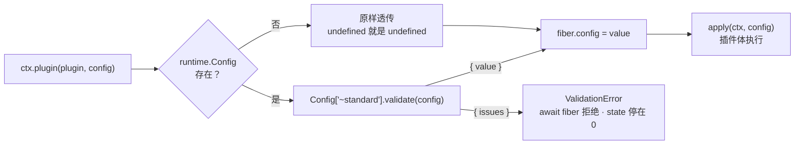

import { Canvas, Controls, Meta } from '@storybook/addon-docs/blocks';
import * as ConfigStories from './config.stories';

<Meta of={ConfigStories} name="Docs" />

# 配置

插件的可变部分通过配置进入：`ctx.plugin(plugin, config)` 的第二个参数一路走到 `apply(ctx, config)`。本课回答三个问题：配置在哪里定义（插件的静态 `Config` 属性）、怎么被校验（Standard Schema V1 与 `resolveConfig` 的同步校验路径）、校验后怎么到达插件（`fiber.config` 与 apply 的第二参）。先给出贯穿全课的心智模型：**cordis 自己不定义配置格式，只认 Standard Schema V1 这一个协议——插件把 schema 挂在静态 `Config` 上，注册与更新时同步校验一次，schema 返回的 `value` 原样成为插件看到的 config；没有 `Config` 就原样透传。**

本课所有 API 与行为均按安装版本 cordis 4.0.0-rc.8 的源码逐一核对并实测。官方指南「插件配置」一篇整体是 3.x 口径：它使用的 `Schema` 构建器（schemastery）、`ctx.command()` 与 `reusable` / `using` 等元属性都不在 rc.8 核心中，阅读时以本课与源码为准。相邻主题各有归属：注册与销毁的完整流程见 2.1，配置更新引发的重载时序见 2.5，配置文件与 loader 的调和见 5.1。



| 条目 | 签名 / 取值 | 回查要点 |
| --- | --- | --- |
| `Config`（静态属性） | `StandardSchemaV1<Input, Output>` | 可选；三种插件形态都可挂；首次注册时读入 Runtime，此后改静态属性不生效（2.1） |
| `~standard.validate(value)` | 同步返回 Result | 成功返回 `{ value }`，失败返回 `{ issues }`；返回 Promise 会抛 `TypeError` |
| 无 `Config` 时 | 原样透传 | `fiber.config` 就是第二参本身；未传时为 `undefined`，不填默认值 |
| 校验失败 | `ValidationError`（`TypeError` 子类） | 消息逐行列出 issue 的 `message` 与 `path`；注册期只记日志，`await fiber` 以它拒绝 |
| `fiber.config` | 校验通过的 `value` | 与 `apply(ctx, config)` 的第二参同源；失败时为 `undefined` |
| `fiber.update(config)` | 返回 `void` | 同一校验入口；非法值同步抛给调用方，原配置不动；重启时序见 2.5 |

## 快速上手

手写一个最小的 Standard Schema，挂到插件上，走完「注册 → 校验 → 到达」的闭环（Node.js ≥ 20 的 ESM 或浏览器控制台均可运行，输出按 4.0.0-rc.8 实测核对）：

```ts
import { Context, type Plugin } from 'cordis';
import type { StandardSchemaV1 } from '@standard-schema/spec';

interface BellConfig {
  greeting: string;
  volume: number;
}

// 插件体写成箭头函数（调用方式差异见 2.1）；config 就是校验后的 value
const bell: Plugin.Function<BellConfig> = (ctx, config) => {
  ctx.on('ring', () => {
    console.log(`${config.greeting} ×${config.volume}`);
  });
};

// 静态 Config：任何带 ~standard.validate 的对象都是合法 schema
bell.Config = {
  '~standard': {
    version: 1,
    vendor: 'handwritten',
    validate(value: unknown) {
      if (typeof value !== 'object' || value === null) {
        return { issues: [{ message: 'expected an object' }] };
      }
      const source = value as Record<string, unknown>;
      const issues: StandardSchemaV1.Issue[] = [];

      let greeting = 'hello'; // 默认值：缺省或空串都视为未提供
      if (source.greeting !== undefined) {
        if (typeof source.greeting !== 'string') {
          issues.push({ message: 'expected string', path: ['greeting'] });
        } else if (source.greeting) {
          greeting = source.greeting;
        }
      }

      let volume = 3; // 默认值 3
      if (source.volume !== undefined) {
        if (typeof source.volume !== 'number') {
          issues.push({ message: 'expected number', path: ['volume'] });
        } else {
          volume = source.volume;
        }
      }
      if (!Number.isInteger(volume) || volume < 1 || volume > 5) {
        issues.push({ message: 'expected integer 1-5', path: ['volume'] });
      }

      if (issues.length) return { issues };
      return { value: { greeting, volume } };
    },
  },
};

const root = new Context();

// 合法输入：volume 缺省，由 schema 填默认值 3。
// 类型上 ctx.plugin 要求完整的 output 形态，来自外部的未校验对象先断言（见「定义配置」）
await root.plugin(bell, { greeting: '叮咚' } as BellConfig);
root.emit('ring');
// 输出：叮咚 ×3 —— 插件拿到的是校验后的 value，不是原始输入

// 非法输入：volume 超出范围
const bad = root.plugin(bell, { greeting: '叮咚', volume: 99 });
try {
  await bad;
} catch (error) {
  console.error(error);
  // ValidationError: invalid config:
  //   - expected integer 1-5 (at volume)
}
console.log(bad.state); // 0 —— 实例停在 PENDING，插件体从未执行
```

两个立刻能观察到的结论：缺省字段在**到达插件之前**就被 schema 填好了默认值；校验失败不会崩应用，错误在 `await` 时交还给你。下面按「定义 → 校验 → 到达」展开。

## 定义配置

配置的声明位置是插件的静态 `Config` 属性，类型是 Standard Schema V1 对象（`Plugin.Base` 中声明为 `Config?: StandardSchemaV1<any, T>`）。三种插件形态都可以挂（`bellSchema` 即上一节手写的 schema 对象）：

```ts
import { Context, type Plugin } from 'cordis';

// 形态一：函数——Config 是函数对象上的属性
const asFunction: Plugin.Function<BellConfig> = (ctx, config) => {};
asFunction.Config = bellSchema;

// 形态二：类——Config 是静态属性
class AsClass {
  static Config = bellSchema;
  constructor(ctx: Context, config: BellConfig) {}
}

// 形态三：对象——Config 是普通属性
const asObject: Plugin.Object<BellConfig> = {
  Config: bellSchema,
  apply(ctx: Context, config: BellConfig) {},
};
```

与 `name` / `inject` 一样，`Config` 在**第一次**为该插件创建运行时时被读入 `runtime.Config`（2.1 的元数据机制）。实测：先注册一次插件，再把它的 `Config` 换成一个会改写 value 的新 schema，第二次注册收到的仍是旧 schema 的结果——运行时不会重新读取静态属性。

### Standard Schema 最小面

rc.8 的 cordis 包不导出任何 `Schema` 构建器——3.x 时代「集成 schemastery」的口径（官方指南仍这么写）已不适用。你需要的只是这个协议面：

| `~standard` 属性 | 类型 | 作用 |
| --- | --- | --- |
| `version` | `1` | 协议版本号，固定为 1 |
| `vendor` | `string` | 实现 schema 的来源标识（如 `'zod'`），cordis 不读取其内容 |
| `validate(value)` | 同步返回 Result | 校验入口；cordis 要求同步返回（见「校验失败」） |
| `types`（可选） | `{ input, output }` | 仅类型层的推导提示，运行时不读取 |

手写对象就能用；生产中更常用实现了该协议的库——Zod（v4 起内置）、Valibot、ArkType、TypeBox 等的 schema 对象都带 `~standard` 属性，可以直接作为 `Config` 传入，不需要适配层。类型上，`StandardSchemaV1` 与 `Issue` 等类型来自 `@standard-schema/spec` 包（cordis 自带的传递依赖，无需另装）。

一个类型层细节：`Plugin.Function<T>` 的 `T` 是 schema 的 **output**——即 apply 收到的形态。因此声明 `Plugin.Function<BellConfig>` 后，`ctx.plugin(bell)` 少传第二参会直接报类型错误；把来自文件 / 网络的未校验对象传给 `ctx.plugin` 时，也要先断言成这个形态（`as BellConfig`）——类型层放行，运行时由 schema 把关。输入侧要表达更宽的类型（配置本就是 `unknown`）时用 `Plugin.Transform`（类型工具，见 6.3 的 TypeScript 模式）。

## 校验与收敛

注册路径上的校验只有一个入口 `resolveConfig`，完整逻辑只有十行（cordis 4.0.0-rc.8 的 `fiber.ts` 节选）：

```ts
function resolveConfig(runtime: Plugin.Runtime, config: any) {
  if (!runtime.Config) return config; // ① 无 schema：原样透传
  const result = runtime.Config['~standard'].validate(config);
  if ('then' in result) { // ② 异步校验：不支持
    throw new TypeError('Async config validation is not supported');
  }
  if (result.issues) { // ③ 校验失败
    throw new ValidationError(result.issues);
  } else {
    return result.value; // ④ 校验通过：采纳 value
  }
}
```

`validate` 收到的就是 `ctx.plugin` 的第二参**原样**——cordis 不 clone、不预处理。它返回的 Result 只有两种形态：

| 结果 | 判定 | 字段 |
| --- | --- | --- |
| 成功 | `issues` 为 falsy | `value`：收敛后的配置，成为 `fiber.config` 与 apply 的第二参 |
| 失败 | `issues` 为数组 | 每项 `{ message, path? }`，cordis 据此构造 ValidationError |

「收敛」是这节课最值得建立的概念：**插件看到的 config 不是你的输入，而是 schema 的产物**。默认值填充、字段裁剪、类型转换全部发生在 `validate` 内部，cordis 只做一件事——把 `result.value` 赋给 `fiber.config` 并传给 apply。快速上手里缺省的 `volume` 变成 `3`、未声明的字段进不了 value，都是 schema 自己的行为；写手写 schema 时你决定这一切，用库时由库的语义决定。

调用时机决定了「到达」的顺序：`ctx.plugin()` 创建 Fiber 后，`fiber.config = resolveConfig(...)` 在实例的启用流程中先于插件体执行，成功才继续启用。所以到达 apply 的 config **一定是校验后的 value**——没有「先拿到原始输入、稍后再校验」的中间态。

没有 `Config` 时走 ① 的透传分支，`fiber.config` 就是第二参本身（实测）：

```ts
const plain = (ctx: Context, config?: { any: boolean }) => {
  ctx.effect(() => () => {});
};

const root = new Context();
(await root.plugin(plain, { any: true })).config; // { any: true }——原样
(await root.plugin(plain)).config;                // undefined——不做任何加工
```

下面的实例把完整链路放进浏览器：插件 `bell` 用手写 schema 声明 `Config`，每次调整 Controls 都重新注册一次，四个面板分别覆盖定义、输入、校验产物与到达情况，读数全部来自真实 cordis 运行。

<Canvas of={ConfigStories.Flow} />
<Controls of={ConfigStories.Flow} />

| 读者操作 | 可观察证据 |
| --- | --- |
| 清空「greeting（输入值）」 | 校验仍通过；差异行显示 `greeting："" → "hello"`，apply 收到的也是默认值——收敛发生在到达之前 |
| 把「volume（输入值）」拉到 6-10 | 校验面板变红，显示 ValidationError 原文（含 `(at volume)`）；fiber.state 停在 0 PENDING，apply 读数为「未到达」，点击画布 ring 计数不再增长 |
| 选「greeting 换成数字」 | 出现类型 issue：`expected string (at greeting)`；其余表现同上 |
| 选「附加 schema 外字段」 | 校验通过，但 value 与 apply 读数里都看不到 `debug` 字段——差异行标注被 schema 裁剪 |
| 点击画布 | 合法时「已响应 ring」+1，方块数量等于收敛后的 volume；失败时无监听器、计数不动 |
| 打开 Show code | 看到该 Canvas 实际执行的 `config-flow.ts` |

## 校验失败

失败时 cordis 把 issues 包装成 `ValidationError`——一个 `TypeError` 的子类，`name` 为 `'ValidationError'`，消息按固定模板拼出每个 issue 的 `message` 与 `path`（`fiber.ts` 节选）：

```ts
export class ValidationError extends TypeError {
  name = 'ValidationError';
  constructor(issues: readonly StandardSchemaV1.Issue[]) {
    super(`invalid config:\n` + issues.map((issue) => {
      if (issue.path) {
        return `  - ${issue.message} (at ${issue.path.join('.')})`;
      } else {
        return `  - ${issue.message}`;
      }
    }).join('\n'));
  }
}
```

`path` 来自 issue 本身，`join('.')` 后就是错误信息里的定位——嵌套配置的报错能直接指到字段（如 `(at server.port)`）。注册期校验失败的表现（均按 4.0.0-rc.8 实测）：

- 错误被捕获并交给 `fiber.ctx.logger.error`，**不会向上冒泡**——应用不崩，同上下文的其他插件照常；
- `await fiber`（即 `ctx.plugin()` 返回值的 thenable）以该 ValidationError 拒绝——这是拿回错误的正规途径；
- `fiber.config` 为 `undefined`（赋值没执行到）；
- `fiber.state` 停在 `0`（PENDING）——不是插件体抛错的 `3`（FAILED）；
- 实例仍占用注册表：`registry.has(plugin)` 为 true；确认失败后应 `dispose()` 释放（失败实例可以正常销毁）。

与插件体抛错（2.1）的对照：

| | 配置校验失败 | 插件体抛错 |
| --- | --- | --- |
| `await fiber` | 以 ValidationError 拒绝 | 以原错误拒绝 |
| `fiber.state` | `0` PENDING | `3` FAILED |
| `fiber.config` | `undefined` | 校验后的配置 |
| 插件体 | 从未执行 | 已开始执行 |
| 后续 | 可 dispose，换合法配置重新注册 | 可 dispose / restart |

**异步校验不支持**是硬限制：Standard Schema 协议允许 `validate` 返回 Promise，但 rc.8 的 `resolveConfig` 检测到 thenable 直接抛 `TypeError: Async config validation is not supported`，走与校验失败相同的捕获路径（`await` 拒绝、state 停 0）：

```ts
bell.Config = {
  '~standard': {
    version: 1,
    vendor: 'broken',
    validate: async (value: unknown) => ({ value }),
  },
};

const fiber = root.plugin(bell, {} as BellConfig);
try {
  await fiber;
} catch (error) {
  console.error(error);
  // TypeError: Async config validation is not supported
}
```

选 schema 库或写自定义校验时必须保证同步返回——引入异步校验（如 Zod 的 async refine、Valibot 的异步管道）会让插件在 rc.8 里无法注册。

## 运行中更新

已经启用的实例用 `fiber.update(config)` 换配置，校验入口与注册期完全相同（`fiber.ts` 节选；下面的示例沿用最初的 `bell` 与正常 schema）：

```ts
update(config: any, noSave?: boolean) {
  const fiber = this.ctx.fiber;
  fiber.assertActive();
  config = resolveConfig(fiber.runtime, config); // 同一个校验入口
  fiber.context.waterfall(fiber, 'internal/update', config, noSave, () => {
    fiber.config = config;
    fiber._error = void 0;
    return fiber.restart();
  });
}
```

关键差别在错误去向：`update` 的校验发生在 waterfall 之前、**在调用方的栈里同步执行**——非法值直接抛给调用者，不像注册期那样只进日志。实测两分支：

```ts
const fiber = await root.plugin(bell, { greeting: '叮咚', volume: 3 });

try {
  fiber.update({ greeting: '叮咚', volume: 99 });
} catch (error) {
  console.error(error);   // ValidationError: invalid config:
                          //   - expected integer 1-5 (at volume)
}
console.log(fiber.config); // { greeting: '叮咚', volume: 3 }——原配置未动
console.log(fiber.state);  // 2——实例没有重启

fiber.update({ greeting: '你好', volume: 5 }); // 合法：立即生效
// 插件体重新执行，apply 收到 { greeting: '你好', volume: 5 }
console.log(fiber.config); // { greeting: '你好', volume: 5 }
```

合法值写入 `fiber.config` 并重启作用域（插件体重新执行一遍）。重启的完整时序、`internal/update` 事件的介入方式见 2.5；loader 在配置文件变化时正是经这条路径驱动插件（配置文件与调和见 5.1）；配置值里引用其他插件用 include 插值（5.2）。

## 最佳实践

- **选 schema 来源：** 演示与零依赖场景手写 `~standard` 对象即可；需要类型推导与组合能力（嵌套对象、联合、交叉）时用实现了 Standard Schema 的库（Zod v4+、Valibot、ArkType、TypeBox），schema 对象直接作为 `Config`，无需适配。发布给他人的插件建议始终声明 `Config`：宿主工具能据此生成配置界面（5.1 / 5.3）。
- **把收敛放进 schema，而不是 apply 开头：** 默认值、字段裁剪、类型转换都写在 `validate` 里，让 `fiber.config` 与插件行为始终是同一份真相；在 apply 里打补丁会出现「注册表看到的配置」和「插件实际用的配置」两份数据。
- **注册处兜住失败：** 校验失败不会抛到 `ctx.plugin()` 的同步调用栈，只进日志并让 `await fiber` 拒绝。装载来自外部配置的插件时逐个 `await`（或聚合 catch），避免 ValidationError 只留在日志里被漏看。

## 常见问题

- 配置校验失败后，`registry.has(plugin)` 是 true，但插件的功能没有生效。
  这是注册期校验失败的正常表现：实例停在 PENDING、插件体从未执行，但仍占用运行时。判断依据是 `await fiber` 以 ValidationError 拒绝、`fiber.state` 为 0；确认后 `await fiber.dispose()` 释放，再换合法配置重新注册。
- 插件加载失败，`fiber.state` 是 0（PENDING）而不是 3（FAILED）。
  rc.8 里两种失败走不同路径：配置校验失败发生在启用流程之前，不进入 FAILED 状态；插件体抛错（校验已通过、开始执行后）才是 `3`。看到 0 且 await 拒绝的是 ValidationError，先检查配置。
- 注册时抛 `TypeError: Async config validation is not supported`。
  `validate` 返回了 Promise。检查 schema：手写的去掉 `async`；用库的确认没有引入异步校验（如 Zod 的 async refine），rc.8 的 `resolveConfig` 不支持异步结果。
- schema 里写了默认值，插件里读到的还是 `undefined`。
  依次确认三件事：`Config` 确实挂在插件上且在首次注册前设置（首注册后修改不生效）；读的是校验后的 `fiber.config` / apply 第二参，而不是自己保存的原始输入；没有 `Config` 时透传分支不做任何加工——默认值收敛只发生在 schema 里。

## 总结回顾

摘要：

cordis 的插件配置由静态 `Config` 属性声明，类型是任何实现 Standard Schema V1 的对象——`~standard.validate` 同步校验一次，返回 `{ value }` 或 `{ issues }`。注册与更新共用 `resolveConfig`：无 schema 原样透传，有 schema 则把 `result.value` 赋给 `fiber.config` 并传给 apply，因此插件看到的是 schema 收敛后的产物（默认值、裁剪、转换都在 validate 内决定）。失败抛 `ValidationError`（TypeError 子类），消息逐行列出 message 与 path；注册期失败只记日志、`await fiber` 拒绝、state 停在 0、实例仍占用注册表，而 `fiber.update` 的非法值同步抛给调用方。异步校验在 rc.8 中不受支持。

一句话：

> 插件看到的 config 永远是 schema 的 `value` 而不是你的输入：静态 `Config` 声明 schema，注册与更新时同步校验一次，收敛后的 `value` 原样到达 apply。

知识要点：

- 插件的配置 schema 挂在哪里？三种插件形态分别怎么写？
- 一个合法的 `Config` 对象最少需要哪些字段？`validate` 的两种返回形态分别长什么样？
- 没有 `Config` 时第二参会发生什么？默认值在哪里被填充？
- 注册期校验失败有哪些可观察表现？与插件体抛错有什么差别？
- 怎么拿到注册期校验失败的错误对象？失败的实例要怎么清理？
- `fiber.update()` 的校验失败与注册期有什么不同？
- 为什么异步 `validate` 在 rc.8 不可用？错误是什么？

## 参考资料

- [Standard Schema 规范](https://standardschema.dev/)——协议原文：`~standard` 属性、Result 与 Issue 形态、各库实现列表
- [官方 API 参考：Fiber](https://github.com/cordiverse/docs/blob/main/zh-CN/api/core/fiber.md)——`fiber.config` 与 `fiber.update(config)` 的条目
- [官方 API 参考：Registry](https://github.com/cordiverse/docs/blob/main/zh-CN/api/core/registry.md)——`ctx.plugin(plugin, config?)` 的签名
- [官方指南：插件配置（3.x 旧口径）](https://github.com/cordiverse/docs/blob/main/zh-CN/guide/essential/config.md)——`Schema` 构建器与 `ctx.command` 属 3.x，与 rc.8 核心不符，仅作历史对照
- [cordis 源码：packages/core/src/fiber.ts](https://github.com/cordiverse/cordis/blob/master/packages/core/src/fiber.ts)——`resolveConfig` 与 `ValidationError` 的实现（本课按本地安装的 4.0.0-rc.8 逐行核对）
