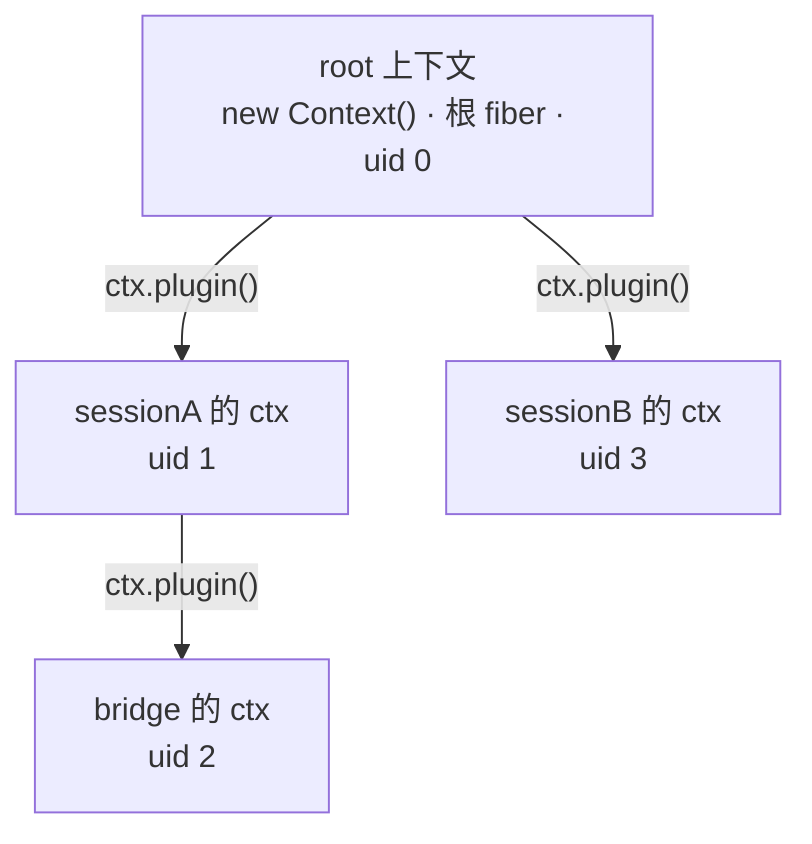
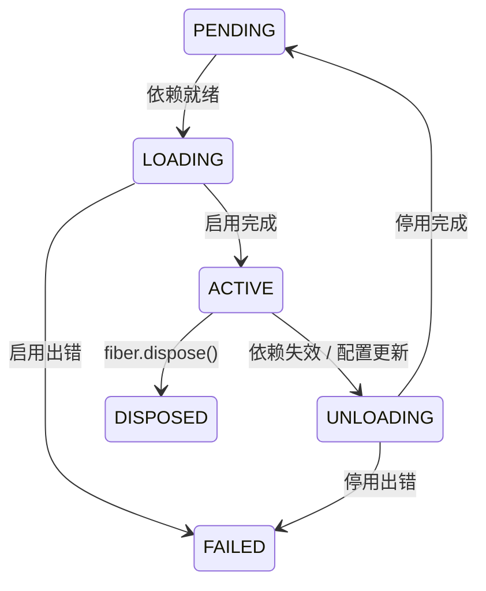

import { Canvas, Controls, Meta } from '@storybook/addon-docs/blocks';
import * as ContextStories from './context.stories';

<Meta of={ContextStories} name="Docs" />

# 上下文

Context（上下文，惯例简写 `ctx`）是 cordis 里一切活动的发生地。它有双重角色：**服务容器**——每个能力以服务的形式占据 `ctx` 上的一个属性位，插件之间通过属性位互相发现；**作用域句柄**——插件拿到的那个 `ctx` 决定了它的副作用、监听器和服务注册归属哪个作用域，销毁该作用域时这些注册随之撤销。本课建立三个直觉：`new Context()` 建立了什么、上下文树如何通过派生形成、以及「通过某个上下文注册的东西，如何随这个作用域销毁而清理」。副作用的撤销细节、事件分发模式和 Fiber 内部机制分别在路线 3.x 与 4.1 展开。

注册插件时，框架从当前上下文派生出一个新的上下文实例交给插件——一次次派生积累成一棵树，这就是本课的主角：



| 成员 | 归属 | 说明 |
| --- | --- | --- |
| `ctx.fiber` | 本体 | 当前上下文对应的作用域（Fiber）；根上下文的 fiber `uid` 为 0 |
| `ctx.root` | 本体（实验性） | 任意派生上下文都指向同一个根上下文 |
| `ctx.events` / `ctx.registry` / `ctx.reflect` / `ctx.logger` | 内置服务 | 挂在根上、全树共享：事件、插件注册表、服务解析、日志 |
| `ctx.plugin(plugin, config?)` | registry 混入 | 注册插件，返回新 Fiber，并自动派生子上下文 |
| `ctx.inject(deps, callback)` | registry 混入 | 声明依赖的临时插件，同样返回 Fiber |
| `ctx.extend(meta)` | 本体 | 以当前 ctx 为原型派生、携带 `meta` 属性；不创建 fiber |
| `ctx.isolate(name, label?)` | 本体 | 派生隔离域，让同名服务在不同域并存 |
| `ctx.intercept(name, config)` | 本体（实验性） | 派生并叠加一层服务配置拦截 |
| `Context.is(value)` | 静态方法 | 判断任意值是否为上下文，对派生 ctx 同样成立 |

## 服务容器

[cordis-primer](https://deepseek-harness.github.io/deepseek-harness/reference/cordis-primer) 给 Context 的定义只有一句：「上下文是服务的容器」。容器的形状是：**能力 = `ctx` 上的属性位**。核心内置四个服务（`events`、`registry`、`reflect`、`logger`），官方插件再往属性位上添加 `ctx.http`、`ctx.timer` 等标准服务；插件自己提供的服务也占一个属性位。消费者按名字查找服务，而不是 import 具体实现——这是空间可组合性的落点，服务机制本身在 2.3「服务」展开。

`new Context()` 创建根上下文。对照源码（`cordis` 包 `lib/index.js` 中的 `Context` 构造函数），它做了四件事：

1. 用 Proxy 包住实例——`ctx.greeter` 这类属性访问被劫持到服务解析逻辑（`reflect`）；
2. 创建根 fiber：`uid` 为 0、状态 ACTIVE、`runtime` 为 `null`——根上下文自带一个永久活着的作用域；
3. 依次创建 `reflect`、`registry`、`events`、`logger` 四个内置服务；
4. 通过 mixin 把常用方法混到 ctx 上：`ctx.on` 委托 `ctx.events.on`，`ctx.plugin` 委托 `ctx.registry.plugin`，`ctx.effect` 委托 `ctx.fiber.effect`。

最小验证（浏览器与 Node 皆可运行，输出按 cordis 4.0.0-rc.8 核对）：

```ts
import { Context } from 'cordis';

const root = new Context();
root.fiber.uid;      // 0——根 fiber
root.fiber.state;    // 2（ACTIVE）
root.root === root;  // true——根的 root 指向自身
root.registry.size;  // 0——还没有注册任何插件
Context.is(root);    // true
```

## 上下文树

### 树的形成

注册插件时发生了什么？插件的三种形态与注册细节是 2.1「插件」的主题，本课只看它对上下文的影响——源码里 `Fiber` 构造函数的第一行就是答案：

```ts
this.ctx = this.context = parent.extend({ fiber: this });
```

每个 Fiber 的上下文都由**注册时的上下文**派生而来，并携带自己的 `fiber` 属性。而 `extend` 的实现只有一句 `Object.create(parent)`——子上下文以父上下文为**原型**。由此得到本课最重要的运行时事实：

- 上下文树在运行时就是一棵原型链：`Object.getPrototypeOf(fiber.ctx) === parent`；
- 子上下文访问自己没有的属性时沿原型链上溯——内置服务因此全树共享；
- `ctx.root` 从任意节点一步回到根；`Context.is` 对派生上下文同样成立。

```ts
const root = new Context();

function demo(ctx: Context) {}
const fiber = root.plugin(demo);

fiber.parent === root;                      // true——fiber 记住注册时的上下文
Object.getPrototypeOf(fiber.ctx) === root;  // true——ctx 以父 ctx 为原型
fiber.ctx.root === root;                    // true
Context.is(fiber.ctx);                      // true
```

嵌套注册让树继续变深：插件在自己的 `ctx` 上继续 `ctx.plugin()`，孙插件的 ctx 派生自子插件的 ctx；销毁父插件时孙插件级联销毁（下一节可观察）。

同一个插件可以注册多次：`ctx.plugin()` 每次调用都创建**新的 Fiber**（`uid` 全局单调递增），但插件运行时（Runtime）按插件回调去重复用——同插件的多个 fiber 挂在同一个 Runtime 下，最后一个 fiber 销毁时 Runtime 才从 `root.registry` 移除。

### 手动派生：extend / isolate / intercept

除了 `ctx.plugin()` 的自动派生，Context 本体提供三个手动派生方法。它们的共同模型：以当前 ctx 为原型构造新实例、**都不创建新 fiber**（`sub.fiber === root.fiber`）。

| 方法 | 新实例携带什么 | 典型用途 |
| --- | --- | --- |
| `ctx.extend(meta)` | 任意元数据属性 | 向下游传递附加信息（如 `baseUrl`） |
| `ctx.isolate(name, label?)` | 新的服务隔离键 | 让同名服务在平行域中并存 |
| `ctx.intercept(name, config)` | 新的配置拦截层 | 为子树定制服务配置（实验性） |

`isolate` 是理解「隔离语义」的最短路径——同一个服务名在两个隔离域里各自解析、互不冲突（输出按 4.0.0-rc.8 核对）：

```ts
import { Context, Service } from 'cordis';

class Greeter extends Service {
  constructor(ctx: Context, tag: string) {
    super(ctx, 'greeter');
    this.tag = tag;
  }
}

const root = new Context();
const hostA = root.isolate('greeter');  // 隔离域 A
const hostB = root.isolate('greeter');  // 隔离域 B：与 A 互不可见

await hostA.plugin(Greeter, 'A');
await hostB.plugin(Greeter, 'B');

hostA.greeter.tag;  // 'A'
hostB.greeter.tag;  // 'B'
root.greeter;       // undefined——根域没有注册该服务
```

若在同一个域里注册两次，第二次会抛出 `service "greeter" has been registered at <Greeter>`。隔离的完整语义（`label` 如何让两个上下文落入同一域、与 `inject` 的配合）在 2.3「服务」与 2.4「依赖注入」展开；`intercept` 的配置合并语义在 2.6「配置」展开。

一个容易忽略的归属事实：手动派生的上下文**不是独立作用域**。在 `sub = root.extend({ tag: 'x' })` 上注册的监听器，归属仍是 `sub.fiber`（也就是原来的 fiber），随那个 fiber 销毁——「通过哪个上下文注册」决定归属，而不是「哪个上下文对象」。需要独立销毁的单元时，用 `ctx.plugin()` 而不是 `ctx.extend()`。

## 作用域归属

[官方设计文档](https://github.com/cordiverse/docs/blob/main/zh-CN/design/context-model.md)的表述：上下文对象上的大量 API，都是某个函数的 **effect 版本**——`ctx.on()` 是「注册事件监听器」的 effect 版本，`ctx.provide()` 是「注册服务」的 effect 版本。开发者只需调用上下文方法，副作用就自动被当前作用域托管。源码里这条归属链很短：

- `ctx.on(name, listener)` 内部调用 `this.ctx.fiber.effect(...)`，把监听器作为 effect 注册在**调用点上下文的 fiber** 上（服务方法内部的 `this.ctx` 会被重绑定为调用它的那个上下文）；
- 销毁 fiber 时，它的 effect 列表被逐个撤销——监听器移除、disposer 执行，机制细节在 3.1「可逆副作用」。

「调用点上下文」是关键词：插件收到的 `ctx` 挂在插件自己的 fiber 上，所以插件里 `ctx.on()` 的监听器归插件自己；`root.on()` 的监听器归根作用域。下面的实例把一棵三层上下文树放进浏览器——根上挂 `sessionA`（内部再注册子插件 `bridge`）和 `sessionB` 两个会话，每个会话注册自己的 ping 监听器和心跳定时器：

<Canvas of={ContextStories.ContextTree} />
<Controls of={ContextStories.ContextTree} />

| 读者操作 | 可观察证据 |
| --- | --- |
| 等待 | sessionA、sessionB 节点的 `beat` 每 2 秒 +1——心跳副作用在各自作用域运行 |
| 点击画布 | 「最近 ping 响应」列出 `root、sessionA、bridge、sessionB`——事件分发是树全局的 |
| 关闭「会话 A」 | sessionA 与 bridge 变「已销毁」、连线变虚线，两节点 `uid` 变 `null`，「ping 监听器」降为 2/4，A 的心跳停止 |
| 会话 A 已销毁时点击画布 | 「最近 ping 响应」只剩 `root、sessionB`——兄弟作用域与根作用域不受影响 |
| 重新打开「会话 A」 | 行为完整恢复，但节点 `uid` 变大（如 4、5）——重新注册创建的是全新 Fiber |

两个紧贴本课边界的结论：

- **事件分发是树全局的，监听器才有归属。** `root.emit('ping')` 到达树上任何作用域注册的同名监听器；销毁作用域撤销的是「监听器」，不是「事件」。按上下文过滤分发的机制（`Context.filter`）在 3.2「事件」展开。
- **销毁级联向下。** 关闭会话 A 时，其内部注册的 bridge 一并销毁——子插件的整个生命周期本身也是父作用域里的一个 effect（源码中 `Fiber` 的 `dispose` 正是挂在 `parent.fiber.effect()` 上的）。

两个正文之外、同样按源码核对过的回查点：

- 在已销毁的作用域上注册副作用会抛错：`fiber.uid` 置 `null` 后，`assertActive()` 拒绝一切注册（`CordisError: cannot create effect on inactive context`）。
- `root.fiber.dispose()` 是特殊的：回收全部副作用、清空注册表，等效回到 `new Context()` 状态，但根 fiber 的 `state` 保持 ACTIVE，可以继续注册。

## fiber 与状态

ctx 与 fiber 互相指向：`ctx.fiber` 是当前上下文的作用域，`fiber.ctx` 是该作用域的上下文。速查：

| 成员 | 说明 |
| --- | --- |
| `fiber.uid` | 注册顺序号，根为 0，销毁后置 `null` |
| `fiber.parent` | 注册时的父**上下文**（不是父 fiber）；`fiber.parent.fiber` 才是父 fiber |
| `fiber.state` | 六个状态之一，见下表 |
| `fiber.name` | 插件名：函数名或类名；匿名则沿父链上溯，根为 `'root'` |
| `fiber.dispose()` | 停用并移除插件，返回 Promise |
| `await fiber` | 等待进入非惰性状态；FAILED 时 Promise 被拒绝 |

| 状态 | 值 | 含义 |
| --- | --- | --- |
| PENDING | 0 | 等待依赖就绪 |
| LOADING | 1 | 正在启用（惰性状态） |
| ACTIVE | 2 | 启用完成，副作用在运行 |
| FAILED | 3 | 启用或停用出错，无法恢复 |
| DISPOSED | 4 | 已被移除 |
| UNLOADING | 5 | 正在停用（惰性状态） |



正常插件在 PENDING 与 ACTIVE 之间往返；被移除时先回收副作用再进入 DISPOSED（实测一次销毁的状态序列是 PENDING → LOADING → ACTIVE → UNLOADING → DISPOSED）。观察树变化的内部事件：`root.on('internal/plugin', fiber => ...)` 在注册与移除时触发（移除时 `fiber.uid` 已为 `null`），`root.on('internal/status', (fiber, old) => ...)` 在状态迁移时触发——上面的实例正是用它们实时重绘树。完整的加载、重载与更新时机在 2.5「生命周期」，Fiber 内部机制（epoch、惰性状态、异步 effect 载体）在 4.1「Fiber」。

## 最佳实践

- 要独立生命周期的单元用 `ctx.plugin()`，只传数据用 `ctx.extend()`。插件创建可销毁的 fiber；`extend` / `isolate` / `intercept` 只是视图——需要「拆下来」的能力一定是插件。
- 副作用注册在「拿到哪个 ctx 就用哪个 ctx」。不要把子插件的副作用集中注册到根上下文——销毁子插件时它们不会被撤销，作用域归属只看注册时的调用点。
- 根上下文只做组装。业务副作用全部放进插件作用域，`root.fiber.dispose()` 才能充当「一键回收全部副作用、回到初始状态」的兜底。

## 常见问题

- 异步流程里用插件销毁后残留的 `ctx` 注册副作用，抛出 `cannot create effect on inactive context`。
  这是 `fiber.assertActive()` 的保护：fiber 销毁后 `uid` 为 `null`，其上下文不再接受注册。异步回调继续使用 `ctx` 前先确认插件仍存活（如检查 `fiber.state`），或改用 2.5「生命周期」的时机钩子组织流程。
- 插件 A 发出的事件，为什么插件 B 也收到了？
  事件按名字在全树分发，不按作用域隔离；有归属的是监听器——销毁 B 后它的监听器消失，但 A 发出的事件仍会到达其他存活作用域。需要按上下文过滤分发时使用带 `thisArg` 的过滤机制，见 3.2「事件」。
- `ctx.extend()` / `ctx.isolate()` 派生出的上下文怎么单独销毁？
  不能。它们不创建 fiber，上面的注册归属派生时所在的 fiber，随那个 fiber 销毁。需要独立销毁单元时改用 `ctx.plugin()`。
- 调用了 `root.fiber.dispose()`，根上下文还能继续用吗？
  能。根 fiber 的 dispose 等效回到 `new Context()` 状态：全部副作用被回收、注册表清空，但 `state` 仍是 ACTIVE、`uid` 仍是 0，可以继续注册插件。

## 总结回顾

摘要：

Context 是服务容器与作用域句柄的统一体：能力占据 `ctx` 的属性位，`new Context()` 创建根上下文（Proxy 实例 + 根 fiber + 四个内置服务）。上下文树由派生形成——`ctx.plugin()` 为每个 Fiber 派生挂载自己 fiber 的子上下文，`extend` / `isolate` / `intercept` 手动派生只换元数据、隔离键或拦截层而不创建 fiber；树的运行时形态是原型链，`ctx.root` 与 `Object.getPrototypeOf` 是导航手段。通过某个上下文注册的监听器、副作用与服务归属该上下文的 fiber：销毁 fiber 即撤销整个作用域并级联到子作用域，兄弟作用域不受影响；事件分发本身是树全局的，有归属的是监听器。fiber 的六个状态刻画插件从等待依赖到销毁的全程，内部事件 `internal/plugin` 与 `internal/status` 让这棵树可被观察。

一句话：

> 上下文按原型链派生成树，通过某个上下文注册的一切都归属它的 fiber——销毁 fiber，整个作用域连同子作用域一并撤销。

知识要点：

- `new Context()` 创建了哪些东西？四个内置服务分别管什么？
- 上下文树的父子关系在运行时如何体现？怎样从一个派生上下文回到根？
- `ctx.plugin()` 每次调用创建什么？同一插件注册多次时 registry 如何去重？
- `extend` / `isolate` / `intercept` 的共同模型是什么？各自携带什么？为什么它们不能单独销毁？
- 在派生上下文上注册的监听器归属哪个作用域？销毁该作用域时会发生什么？
- 事件分发按作用域隔离吗？监听器呢？
- fiber 的六个状态是什么？在已销毁的作用域上注册副作用会怎样？

## 参考资料

- [官方设计文档：上下文模型](https://github.com/cordiverse/docs/blob/main/zh-CN/design/context-model.md)：作用上下文与余作用上下文的统一、派生模型与 effect 版本 API 的论述
- [官方 API 参考：Context](https://github.com/cordiverse/docs/blob/main/zh-CN/api/core/context.md)：服务与混入列表、`extend` / `isolate` / `intercept` 签名
- [官方 API 参考：Fiber](https://github.com/cordiverse/docs/blob/main/zh-CN/api/core/fiber.md)：状态机、`fiber.effect` / `dispose` / `then` 的语义
- [cordis-primer（DeepSeek Harness 文档站）](https://deepseek-harness.github.io/deepseek-harness/reference/cordis-primer)：「上下文是服务的容器」的定义与核心概念视角
- [cordiverse/cordis 源码 packages/core](https://github.com/cordiverse/cordis/tree/master/packages/core)：本文全部行为断言的最终依据（按安装版本 4.0.0-rc.8 核对）
