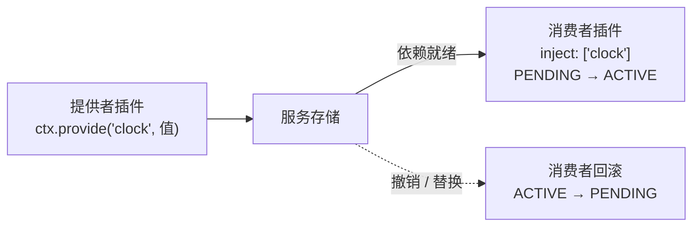

import { Canvas, Controls, Meta } from '@storybook/addon-docs/blocks';
import * as DependencyInjectionStories from './dependency-injection.stories';

<Meta of={DependencyInjectionStories} name="Docs" />

# 依赖注入

上一课讲了服务怎么提供；这一课讲插件怎么声明和消费依赖。cordis 的回答是 `inject` 声明加一条运行时规则，贯穿全课的心智模型是：**`inject` 声明的每个服务都是必需依赖——全部就绪，插件体才第一次运行；任一依赖消失或换成别的实现，插件体整体回滚，依赖回来后再整体重跑。加载顺序因此由依赖图表达，与注册顺序无关。**

本课所有 API 与行为均按安装版本 cordis 4.0.0-rc.8 的源码逐一核对并实测。注意：官方指南 `guide/essential/service.md` 的 inject 章节描述的是 3.x 语义（`required` / `optional` / `using`），与 rc.8 源码不符，本文以源码为准；官方 API 参考（`api/core/registry.md`、`api/core/reflect.md`）与源码一致。相邻主题各有独立课程：服务定义与 `ctx.provide` 见 2.3，插件注册与销毁机制见 2.1，完整状态机见 2.5，隔离域（isolate）见 2.2 / 2.3，loader 的配置级依赖见 5.1，coeffects 的形式化见 6.1。



| 条目 | 写法 / 取值 | 回查要点 |
| --- | --- | --- |
| `inject`（数组） | `inject: ['database']` | 必需依赖清单；全部就绪插件体才运行 |
| `inject`（对象） | `inject: { database: { ... } }` | 键仍是必需依赖；值是该服务的消费者侧配置（拦截配置），写 `null` 等价数组形式 |
| `ctx.inject(deps, callback)` | 返回 Fiber | `ctx.plugin({ inject: deps, apply: callback, name: callback.name })` 的语法糖 |
| `@Inject(name, config?)` | 类 / 方法装饰器 | 类形态写入静态 `inject`；方法形态限 `Service` 子类，依赖就绪 / 变化时重新调用 |
| 依赖未就绪 | `fiber.state === 0`（PENDING） | 不抛错、不运行插件体、注册表保留该实例 |
| 依赖消失 / 替换 | ACTIVE → UNLOADING → PENDING | 插件体回滚而非销毁；依赖回来自动重载 |
| `fiber.inject` | `Dict` | 注册时 `Inject.resolve` 规范化后的「服务名 → 配置」对象，可回查 |
| `ctx.get(name)` | 返回值或 `undefined` | 跳过访问检查的可选读取，不声明依赖 |

## 快速上手

一个提供者、一个消费者，最小闭环四步（Node.js ≥ 20 的 ESM 或浏览器控制台均可运行，输出按 4.0.0-rc.8 核对）：

```ts
import { Context } from 'cordis';

// 0. 声明服务的 TypeScript 类型，让 ctx.clock 获得类型检查（声明合并详见 2.3 / 6.3）
declare module 'cordis' {
  interface Context {
    clock: { version: string };
  }
}

// 1. 提供者：把一个值注册为服务（ctx.provide 的完整语义见 2.3）
const clock = (ctx: Context) => {
  ctx.provide('clock', { version: 'alpha' });
};

// 2. 消费者：声明必需依赖，插件体内可立即访问
const app = (ctx: Context) => {
  console.log(`app 运行，读到 clock = ${ctx.clock.version}`);
};
app.inject = ['clock'];

// 3. 先注册消费者、后注册提供者——顺序无关
const root = new Context();
const appFiber = root.plugin(app);
await root.plugin(clock);

// 4. 消费者已随依赖就绪自动激活
console.log(appFiber.state);   // 2（ACTIVE）
// 输出：app 运行，读到 clock = alpha
```

如果第 3 步只注册 `app` 而不注册 `clock`，程序不会报错——`app` 停在 PENDING 等待，插件体一次都不运行（见「依赖就绪与等待」）。

## inject 声明

`inject` 是插件静态元数据之一（2.1），函数、类、对象三种插件形态都可携带。注册时框架用 `Inject.resolve` 把声明规范化成一个「服务名 → 配置」对象——数组形式等价于每个服务名配 `null`——结果挂在 `fiber.inject` 上，可以随时回查：

```ts
consumer.inject = ['database'];
await root.plugin(consumer);
// fiber.inject => { database: null }
```

### 数组形式

数组列出全部**必需依赖**。三条规则（每条都经 4.0.0-rc.8 实测）：

- **就绪才运行：** 声明的每个服务都有 ACTIVE 的实现时，插件体才会运行；插件体内可以直接访问 `ctx.database`，无需判空。
- **失活即回滚：** 任一依赖消失或换成别的实现，插件体连同副作用整体回滚，插件回到等待状态（见「依赖变化与回滚」）。
- **访问是声明的结果：** 没有注入的服务，在兄弟插件上无法访问；注入插件的**子插件**则继承访问——消费者内部用 `ctx.plugin()` 注册的插件，可以直接读父插件注入的服务。

```ts
const root = new Context();
await root.plugin((ctx) => { ctx.provide('database', { id: 'D' }); });

// 没有注入：访问直接抛错
const naive = (ctx: Context) => { ctx.database.id; };   // Error: cannot get property "database" without inject
try {
  await root.plugin(naive);   // await 以原错误拒绝，实例进入 FAILED（见 2.1）
} catch {}

// 注入插件的子插件：继承访问
const child = (ctx: Context) => { console.log(ctx.database.id); };   // 输出：D
const parent = (ctx: Context) => { ctx.plugin(child); };
parent.inject = ['database'];
await root.plugin(parent);
```

### 对象形式

把 `inject` 写成对象时，**键仍然是必需依赖的服务名，值是该服务的消费者侧配置**（进入此插件上下文的拦截配置层）——不是默认值，也不是可选标记。服务在处理来自这个插件的调用时，可以通过 `Service.resolveConfig` 读到这层配置：

```ts
import { Context, Service } from 'cordis';

class Greeter extends Service {
  constructor(ctx: Context) {
    super(ctx, 'greeter');
  }

  greet(who: string) {
    // 读取「调用方」为 greeter 配置的拦截层
    const config = this[Service.resolveConfig]();
    return `${config.prefix ?? 'hi'}, ${who}`;
  }
}

const root = new Context();
await root.plugin((ctx) => new Greeter(ctx));    // 提供者：Service 构造即注册（见 2.3）

// 数组形式：没有为 greeter 提供配置
const plain = (ctx: Context) => console.log(ctx.greeter.greet('array'));
plain.inject = ['greeter'];
await root.plugin(plain);      // 输出：hi, array

// 对象形式：值为 greeter 服务的消费者侧配置
const tuned = (ctx: Context) => console.log(ctx.greeter.greet('object'));
tuned.inject = { greeter: { prefix: 'hello' } };
await root.plugin(tuned);      // 输出：hello, object
```

三个要点：

- 对象形式**同时声明依赖**：`inject: { greeter: { prefix: 'hello' } }` 的等待与回滚语义和数组形式完全相同。
- 值写 `null`（`inject: { database: null }`）与数组形式等价。
- 这层配置走的是与 `ctx.intercept()` 相同的拦截机制（2.3）；服务侧是否消费它、怎么消费，由服务实现决定。

### ctx.inject() 与 @Inject()

**`ctx.inject(deps, callback)`** 是把「部分功能」独立成带依赖子插件的语法糖，展开就是一次普通注册：

```ts
ctx.inject(['clock'], (ctx) => {
  console.log(`控制台扩展就绪，clock = ${ctx.clock.version}`);
});

// 等价于
ctx.plugin({
  inject: ['clock'],
  apply: (ctx) => { /* 同上 */ },
  name: 'callback 的函数名',
});
```

宿主插件本身不依赖 `clock`（它照常激活），只有子插件等待依赖。子插件的运行时名取自 callback 的函数名（匿名箭头函数是空串）；回调用**自己的参数 `ctx`**，不要用外层的 `ctx`——两者的 fiber 不同，副作用归属也不同。

**`@Inject(name, config?)`** 装饰器是声明的另一种写法（需要 TS 5+ 的 stage-3 装饰器支持；Storybook 的 Vite 管道默认未启用，此时退回静态 `inject` 字段即可）：

```ts
import { Context, Inject, Service } from 'cordis';

// 类形态：等价于 static inject = ['database']，且经原型链支持继承
@Inject('database')
class Repo {
  constructor(ctx: Context, config: any) { /* ... */ }
}

// 方法形态：依赖就绪或变化时重新调用（要求宿主是 Service 子类）
class Dashboard extends Service {
  constructor(ctx: Context) {
    super(ctx, 'dashboard');
  }

  @Inject('database')
  refresh() {
    // 这里的 this.ctx 绑定到依赖子插件的作用域，ctx.database 一定可用
    console.log('刷新，database = ' + this.ctx.database.id);
  }
}
```

两个实测过的坑：类形态下不要再手写 `static inject = {}` 字段，会与装饰器写入冲突（`Cannot redefine property: inject`）；方法形态对普通类不生效——方法运行时 `this.ctx` 仍是外层插件的作用域，访问注入服务会抛错，只有 `Service` 子类（tracker 会把 `this.ctx` 重绑到依赖作用域）才是它的设计目标。

## 依赖就绪与等待

依赖未就绪时，框架的行为是**等待而不是报错**。注册一个依赖缺失的插件：

```ts
const consumer = (ctx: Context) => { console.log('插件体运行'); };
consumer.inject = ['clock'];

const fiber = root.plugin(consumer);
await fiber;                              // 立即 resolve——不等依赖出现
console.log(fiber.state);                 // 0（PENDING），插件体尚未运行
console.log(root.registry.has(consumer)); // true——等待中的实例仍在注册表
```

三条语义（均按 4.0.0-rc.8 实测）：

- **`await fiber` 等的是装载周期，不是依赖。** 它等待插件「当前这一轮加载 / 卸载」结束：依赖就绪时它会等到插件体运行完；依赖缺失时没有装载在进行，立即 resolve。判断就绪看 `fiber.state`，或监听 `internal/status`。
- **状态只反映依赖。** 依赖就绪：`PENDING → LOADING → ACTIVE`（插件体在 LOADING 中运行）；依赖消失：`ACTIVE → UNLOADING → PENDING`。消费者停在 PENDING 不是异常，是「等待服务」的正常形态。
- **等待的插件仍是注册表中的活实例。** 它不占运行副作用，可以正常 `dispose()`；服务出现时框架会自动补跑插件体，不需要任何手工触发。

插件体抛错进入 FAILED 的行为与 2.1 一致：`await fiber` 以原错误拒绝，实例留在注册表，状态机细节见 2.5。

## 加载顺序由依赖表达

两个插件谁先初始化？cordis 的答案是不编排：**谁提供、谁消费写进声明，顺序由依赖图自动决定**。把上一节的依赖做成链（tail 依赖 middle、middle 依赖 upstream 并提供服务），再完全逆序注册：

```ts
const order: string[] = [];
const upstream = (ctx: Context) => { ctx.provide('upstream', { v: 1 }); };
const middle = (ctx: Context) => {
  ctx.provide('middle', { from: ctx.upstream.v });
};
middle.inject = ['upstream'];
const tail = (ctx: Context) => {
  order.push(`tail 运行，middle.from = ${ctx.middle.from}`);
};
tail.inject = ['middle'];

// 逆序注册：tail → middle → upstream
root.plugin(tail);
root.plugin(middle);
await root.plugin(upstream);

console.log(order);    // ['tail 运行，middle.from = 1']
// 三个插件全部 ACTIVE——激活沿依赖方向传播：upstream → middle → tail
```

机制直觉：服务注册或撤销时，框架遍历注册表，找到所有 `inject` 了该服务的实例，重新核对依赖并刷新状态（源码 `ReflectService.notify`）。因此激活顺序只由「谁的依赖先就绪」决定；注册顺序、文件加载顺序、`setTimeout` 排序都不需要，也是不可靠的。

下面的实例把这对「提供者 → 消费者」放进浏览器，时间线读数全部来自框架自身的内部事件。

<Canvas of={DependencyInjectionStories.Timeline} />
<Controls of={DependencyInjectionStories.Timeline} />

| 读者操作 | 可观察证据 |
| --- | --- |
| 切换「注册顺序」 | 两种顺序下时间线都以 `consumer: PENDING → LOADING → ACTIVE` 收尾，「提供者先」时 consumer 注册即激活，「消费者先」时 consumer 先停在 PENDING、提供者注册后补跑 |
| 关闭「提供者在场」 | 时间线出现 `service clock = alpha`（旧值）→ `undefined` 与 `consumer: ACTIVE → UNLOADING → PENDING`；「读到的 clock」变为 —，registry.has(consumer) 保持 true |
| 重新打开「提供者在场」 | consumer 从 PENDING 再次 `LOADING → ACTIVE`——是等待后重载，不是重新注册 |
| 切换「服务实现」alpha → beta | 时间线出现完整两组记录：回滚（off）→ `service clock = beta` → 重跑（on），「读到的 clock」切到 beta |
| 提供者不在场时点击画布 | 「probe 响应」不增长——监听器已随回滚撤销 |
| 提供者在场时点击画布 | 「probe 响应」+1，且数值随实现切换归零重计（新一次激活） |
| 打开 Show code | 看到该 Canvas 实际执行的 `dependency-timeline.ts` |

## 依赖变化与回滚

**提供者撤销。** 销毁提供者实例，消费者立刻回滚：副作用全部撤销、状态回到 PENDING、实例留在注册表。这是「回滚」而非「销毁」——插件没有消失，它在等服务回来：

```ts
// clock = alpha、app 处于 ACTIVE 时
await clockFiber.dispose();
console.log(appFiber.state);        // 0（PENDING）——回滚等待，不是 DISPOSED
console.log(root.registry.has(app)); // true
```

**实现替换。** 换一个不同的插件函数提供同名服务，消费者回滚后用新实现整体重跑。机制：框架把每个注入依赖解析到「提供该服务的 fiber」，把它们的 uid 拼成纪元值（epoch）；依赖换到不同 fiber（替换实现）或消失（纪元失效）都改变纪元，触发回滚，纪元恢复后重载：

```ts
const clockBeta = (ctx: Context) => { ctx.provide('clock', { version: 'beta' }); };
await root.plugin(clockBeta);
// app 的事件记录：on(alpha) → off → on(beta)——回滚后用新实现重跑
```

对应的推论：**改值不重载**。同一提供者通过 `ctx.set('clock', 值)` 换掉服务值时，纪元不变，消费者不回滚，下次读取直接看到新值（实测确认）。所以「换实现」要注册新的提供者插件，「改数据」留在服务内部。

**internal/service 事件。** 观察服务增减的入口是 `internal/service`，参数为 `(name, value)`，value 为 `undefined` 表示撤销：

```ts
root.on('internal/service', (name, value) => {
  console.log(name, value?.version ?? 'undefined');
});
// 撤销提供者时的实测输出（4.0.0-rc.8）：
// clock alpha     <- 状态切换时先以旧值触发一次
// clock undefined <- 服务移除
```

**reactive coeffects 的直觉。** 「消费者随依赖在场 / 离场而自动装载 / 回滚」就是 cordis 论文所说的响应式共同效果：依赖不是一次性取值，而是持续生效的耦合关系。同一实例多次回滚重跑的形式化表述见 6.1。

**可选依赖。** rc.8 没有声明式的可选依赖（3.x 的 `optional` 数组已不存在，见常见问题）。两个替代：

```ts
// 纯读取：不等待、不回滚，缺省得到 undefined，不抛错
const version = ctx.get('clock')?.version;

// 需要感知服务增减：监听 internal/service（或用 ctx.inject 子插件表达部分功能依赖）
ctx.on('internal/service', (name, value) => { /* ... */ });
```

`ctx.get(name)` 跳过访问检查直接取值（`api/core/reflect.md` 的 `ctx.get`），适合「有则用、无则降级」的场景；副作用必须随服务变化清理时，仍应使用 `inject` 或 `ctx.inject` 子插件。

## 循环依赖

两个插件互相注入对方提供的服务，结果是**双双停在 PENDING，没有报错，也没有检测**（4.0.0-rc.8 实测）：

```ts
const a = (ctx: Context) => { ctx.provide('svc-a', {}); };
a.inject = ['svc-b'];
const b = (ctx: Context) => { ctx.provide('svc-b', {}); };
b.inject = ['svc-a'];

const fa = root.plugin(a);
const fb = root.plugin(b);
await Promise.all([fa, fb]);   // 正常 resolve——await 不等依赖
console.log(fa.state, fb.state);  // 0 0
```

判断方法：插件长期 PENDING 且依赖关系成环。两个实例仍可正常 `dispose()`；解法是把环上某一段降级——改用 `ctx.get` 可选读取、`ctx.inject` 子插件，或把共同依赖下沉成两者都注入的第三个插件。等待语义保证不崩溃，但也不会自己解开。

## 最佳实践

- **按依赖强度选表达：** 整体必需 → 静态 `inject`（等就绪、随依赖回滚重载）；部分功能依赖 → `ctx.inject` 子插件（宿主不等待）；纯可选读取 → `ctx.get` / `internal/service`（不等待、不回滚）。不要在插件体里 `if (ctx.database)` 再挂副作用——它不等待就绪、服务重载时不回滚、服务回来时不重跑，三类时序问题都会出现。
- **插件体按「会重跑」编写：** 回滚 / 重载会让同一实例的插件体多次执行。副作用全部交给 `ctx.effect()` / `ctx.on()` 托管，不写裸全局状态；需要跨重载保留的数据放进服务（2.3）或外部存储。
- **启动顺序用依赖表达：** 「B 必须在 A 之后初始化」写成 A 注入 B 提供的服务，而不是依赖注册顺序、延时或就绪标志轮询——后三者在本课的机制下都是不可靠的。

## 常见问题

- 注入了内置服务（如 `inject: ['logger']`）后插件永不激活。
  rc.8 的内置 `logger` 不是可注入服务——`LoggerService` 未继承 `Service`、从未调用 `provide`（`events` / `registry` / `reflect` 同样不在服务存储里）。注入它们会永久 PENDING。判断依据：`root.reflect.get('logger')` 为 `undefined`。
- 沿用 3.x / Koishi 的 `inject: { required: [...], optional: [...] }` 写法，插件卡在 PENDING。
  rc.8 对象形式的键是服务名：`required` / `optional` 会被当成两个服务名（`fiber.inject` 解析为 `{ required: [...], optional: [...] }`），永远等不到实现。改用数组形式加 `ctx.get` 表达可选。
- 访问其他插件提供的服务时报 `cannot get property "x" without inject`。
  兄弟插件的服务必须 `inject` 才能访问；继承访问只对「注入插件的子插件」成立。确实只需要读一次时用 `ctx.get('x')`。
- 在插件体之外（如保存下来的 ctx、异步回调中）访问注入服务，报 `cannot get required service "x" in inactive context`。
  该上下文已随依赖消失回滚，注入服务处于失活状态。把访问留在插件体内（存活期一定可用），或改用 `ctx.get('x')` 并处理 `undefined`。

## 总结回顾

摘要：

插件用静态 `inject` 声明必需依赖：数组列服务名，对象的值是该服务的消费者侧配置（拦截配置），`ctx.inject()` 把部分功能独立成带依赖的子插件，`@Inject()` 装饰器是声明的另一种写法（方法形态限 Service 子类）。依赖就绪前插件停在 PENDING——不报错、不运行、注册表保留，`await fiber` 等的只是装载周期而非依赖；依赖全部 ACTIVE 插件体才运行，体内可直接访问服务。加载顺序由依赖图表达：注册顺序无关，激活沿「谁提供谁消费」自动传播。任一依赖消失或换成不同实现，插件体整体回滚（UNLOADING → PENDING），依赖回来后自动重跑；同一提供者改值不触发重载。可选依赖用 `ctx.get` 或 `internal/service` 表达；循环依赖双双 PENDING 挂起，无检测无报错。

一句话：

> `inject` 声明的每个服务都是必需依赖：全部就绪插件体才运行，任一依赖消失或被替换就整体回滚——加载顺序由依赖图表达，与注册顺序无关。

知识要点：

- `inject` 有哪几种写法？数组与对象形式的语义差别是什么？对象形式的值是什么？
- 依赖未就绪时插件处于什么状态？`await fiber` 等的是什么？怎样判断依赖已就绪？
- 为什么注册顺序不影响激活顺序？依赖链上的激活沿什么方向传播？
- 提供者销毁后消费者发生什么？和消费者自己销毁有什么区别？
- 替换服务实现与修改服务值，消费者的反应有什么不同？
- 没有注入的服务为什么访问不到？哪些途径可以合法访问？
- rc.8 怎么表达可选依赖？循环依赖的行为是什么？

## 参考资料

- [官方 API 参考：Registry](https://github.com/cordiverse/docs/blob/main/zh-CN/api/core/registry.md)——`ctx.inject()` 的签名与等价注册
- [官方 API 参考：Reflect](https://github.com/cordiverse/docs/blob/main/zh-CN/api/core/reflect.md)——`ctx` 属性访问规则、`ctx.get` 的语义
- [官方指南：服务与依赖](https://github.com/cordiverse/docs/blob/main/zh-CN/guide/essential/service.md)——inject 数组形式的三句核心语义（等待 / 回滚 / 重载）仍与 rc.8 一致；该页对象形式（required / optional）、`using` 等为 3.x 语义，与 rc.8 源码不符
- [cordis-primer（DeepSeek Harness 文档站）](https://deepseek-harness.github.io/deepseek-harness/reference/cordis-primer)——「插件声明所需的服务后，会等待这些服务就绪才启动；加载顺序通过服务依赖表达」的高层表述
- [cordis 源码：packages/core](https://github.com/cordiverse/cordis/tree/master/packages/core)——`registry.ts`（`Inject.resolve`、`ctx.inject`）、`fiber.ts`（`_checkImpl` / `_refresh` / 纪元机制）、`reflect.ts`（`provide` / `notify`、访问规则）（本课按本地安装的 4.0.0-rc.8 逐项核对并实测）
