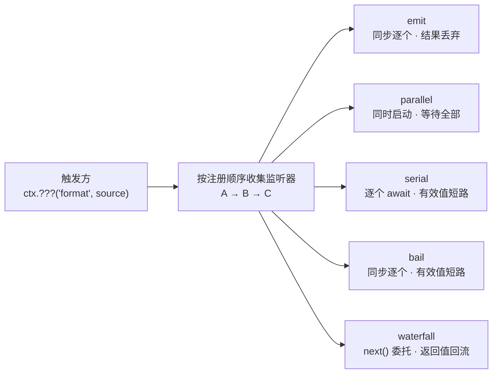
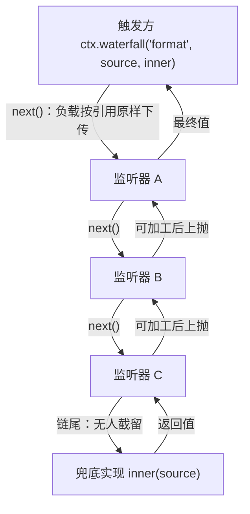
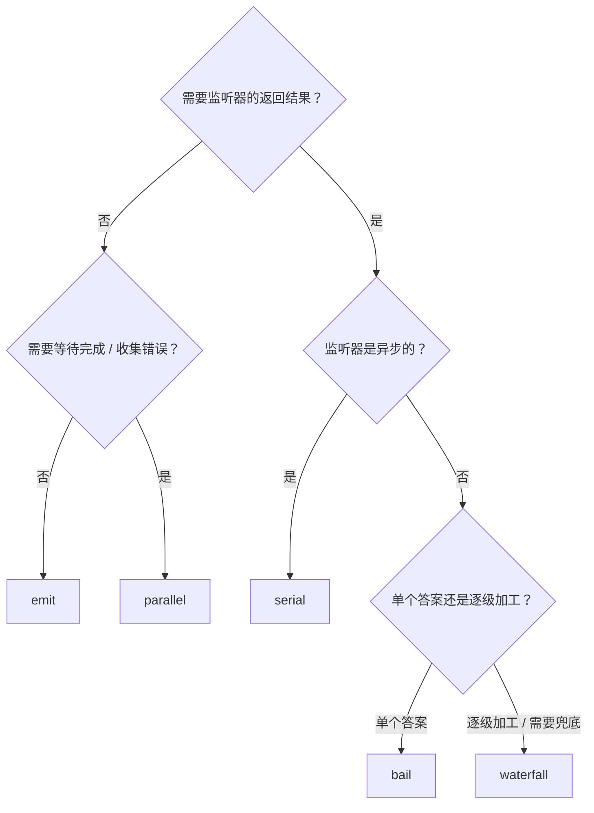

import { Canvas, Controls, Meta } from '@storybook/addon-docs/blocks';
import * as DispatchStories from './dispatch-modes.stories';

<Meta of={DispatchStories} name="Docs" />

# 分发模式

[事件](?path=/docs/events--docs)一课解决了「监听器怎么注册、事件名怎么声明」；本课解决另一半——**触发方怎么调用这组监听器**。cordis 4.0（rc.8）为此提供了五个平级的触发方法：`emit`、`parallel`、`serial`、`bail`、`waterfall`。同一组按注册顺序排好的监听器，用哪个方法触发，就决定了监听器被同步还是异步调用、按什么顺序执行、返回值被丢弃还是流动、抛出的错误由谁接住——分发模式是触发方与监听器之间的**调用合同**，也是设计插件间协作时最常做的选择。本课先用总表速查，再按「观察 → 短路 → 环绕」三类展开，最后的对比实例让同一组监听器在五种模式间切换。



| 方法 | 等待监听器 | 调用顺序 | 返回值 | 监听器抛错 | 典型用途 |
| --- | --- | --- | --- | --- | --- |
| `ctx.emit` | 否（同步） | 注册序逐个 | 无（`void`） | 同步抛给触发方，后续监听器不执行 | 广播通知 |
| `ctx.parallel` | 是（`Promise<void>`） | 同时启动、等待全部 | 无 | 全部执行完后抛 `AggregateError` | 并行副作用 |
| `ctx.serial` | 是 | 注册序逐个 `await` | 第一个有效返回值（`Promise` 包装） | 立即 reject，后续不执行 | 异步决策链 |
| `ctx.bail` | 否（同步） | 注册序逐个 | 第一个有效返回值 | 同步抛出，后续不执行 | 同步决策 |
| `ctx.waterfall` | 否（同步） | `next()` 委托链 | 链的最终返回值 | 同步沿链抛给触发方 | 环绕加工 / 拦截 |

「有效返回值」的判定见[短路分发](#短路分发)：返回值不是 `null`、`false`、`undefined` 即有效。

## 触发时发生了什么

五种方法共享同一条前置流程（源码 `EventsService` 的 `_resolve`）：

1. **参数归一。** 第一个参数是对象或函数时被摘出作为 `thisArg`（监听器里的 `this`），下一个才是事件名，之后是负载；不带 `thisArg` 时监听器的 `this` 为 `null`（需要 `this` 就用 `thisArg` 重载）。核心自己大量使用这个形态，如 `waterfall(fiber, 'internal/update', …)`。
2. **收集监听器。** 按注册顺序取出该事件名下的全部监听器。`thisArg` 带过滤键（典型是服务实例）时，只保留 `global: true` 或通过匹配的监听器——注册侧的 `prepend` / `global` 选项与传播语义见[事件](?path=/docs/events--docs)。
3. **先发一个观测钩子。** 非内置事件触发时会先 `emit('internal/dispatch', 模式, 事件名, 参数, thisArg)`，可用于调试与审计，见[事件](?path=/docs/events--docs)。

差异从「怎么调用收集到的监听器」开始。类型层的合同如下（`K` 为事件名，`Events[K]` 的参数与返回值类型同时约束注册与触发两端）：

```ts
ctx.emit<K>(name: K, ...args): void
ctx.parallel<K>(name: K, ...args): Promise<void>
ctx.serial<K>(name: K, ...args): Promisify<ReturnType<Events[K]>>
ctx.bail<K>(name: K, ...args): ReturnType<Events[K]>
ctx.waterfall<K>(name: K, ...args): ReturnType<Events[K]>
// 每个方法都有 (thisArg, name, ...args) 重载
```

两个直接结论：

- **模式由调用点决定，不是事件的固有属性。** 核心里五个方法平级，同一事件名可以被任一方法触发。在线文档 cordis-primer 把「每个事件固定一种分发模式」作为工程约定（配合其 `@mode` 标签目录做声明与调用点的交叉校验）——值得借鉴，但那是引用方的约定而非核心机制：混用模式在类型上拦不住，行为完全由调用的方法决定。
- **事件声明同时约束两头。** 参数列表决定触发时要传什么，返回值类型决定 `serial` / `bail` / `waterfall` 能拿到什么。声明合并的基础写法见[事件](?path=/docs/events--docs)，本课实例的声明长这样：

```ts
declare module 'cordis' {
  interface Events {
    // 本课实例要横向对比五种模式，所以把 waterfall 专属的 next 声明为可选；
    // 实际项目按约定模式的监听器形状声明
    format(source: string, next?: () => string): string
  }
}
```

## 观察分发

观察分发的合同：**监听器的返回值一律丢弃，触发方不因监听器拿到任何结果**。两个成员只差在「要不要等监听器跑完」。

### emit

同步广播：按注册顺序逐个调用、不等待、不收返回值，触发方法立即返回 `void`。

```ts
// 广播：只通知「发生了什么」，不关心监听器做什么
ctx.emit('guild-added', guild)
```

两条边界都源自「同步 + 不等待」：

- **同步监听器抛错会同步炸给触发方**，循环当场中断，后面的监听器不再执行——这是顺序中断，不是错误收集。
- **async 监听器返回的 Promise 被直接丢弃**：触发立刻返回，加工结果无人消费；如果这个 Promise 后来拒绝，就成了 `unhandledrejection`（要等待或要收集错误，用 `parallel`，见[常见问题](#常见问题)）。

### parallel

异步观察：所有监听器**同时启动**（互不等待），`Promise.allSettled` 语义等待全部完成后返回 `Promise<void>`。

```ts
// 并行扇出并等待：所有插件都处理完这条消息后再继续
await ctx.parallel('message-added', session)
```

错误处理是它与手写 `Promise.all` 的关键差别：**一个监听器抛错不影响其他监听器执行**；收尾时若有失败，抛出 `AggregateError`，`errors` 数组汇总所有原因（证据见下方实例）。

## 短路分发

短路分发的合同：**逐个调用，监听器返回「有效值」就立即停止，并把这个值作为触发结果**；全部让位（都返回 `undefined`）则触发得到 `undefined`。判定函数是源码导出的 `isBailed`，只有一行：

```ts
function isBailed(value: any): boolean {
  return value !== null && value !== false && value !== void 0
}
```

注意它**不是真值判断**：`0`、`''`、`NaN` 都是有效值，都会短路（见[常见问题](#常见问题)）。两个成员只差在同步性。

### serial

`serial` 是异步决策链：逐个 `await` 每个监听器——监听器可以异步，等它结算后再走下一个；遇到第一个有效返回值即短路，后面的监听器不再执行。监听器抛错则整体立即 reject，同样中断后续。返回类型是 `Promisify<ReturnType<Events[K]>>`（`Promisify` 来自 cosmokit，把声明返回类型包成 `Promise`）。

```ts
// 多实现竞争：第一个给出结论的插件说了算
const verdict = await ctx.serial('check-message', message)
if (verdict) return verdict // 有效值；全部让位时是 undefined
```

适合权限校验、内容审核这类「多个插件都能裁决，先到先得」的场景。

### bail

`bail` 是 `serial` 的同步版：不 `await`，监听器同步执行，拿到第一个有效返回值即返回。因为不等待，**async 监听器返回的 Promise 对象本身就是有效值**——`bail` 会把这个未等待的 `Promise` 当作结果直接返回（下方实例可复现）。

```ts
// 同步缓存查询：命中即返回，全部未命中得 undefined
const cached = ctx.bail('cache-lookup', key)
```

核心内部用它分发 `internal/listener`（`ctx.on` 注册监听器时的拦截点，见[事件](?path=/docs/events--docs)）。全同步的快速决策用 `bail`；只要链上可能出现异步监听器，就选 `serial`。

## 环绕分发

`waterfall` 的合同不是「取一个答案」，而是「每个监听器都环绕在下游外面」——洋葱模型。触发方把**兜底实现 `inner` 作为最后一个参数**传入；监听器的签名是 `(…payload, next)`：调用 `next()` 委托下游，`next()` 的返回值就是下游（最终是 `inner`）的结果，可以加工后上抛；**不调用 `next()` 直接返回就是短路**，后面的监听器和 `inner` 都不执行；全部委托到底时执行 `inner`，其返回值成为最终结果的起点。



```ts
// 每个监听器环绕在下游外：加工下游结果后上抛
ctx.on('format', (source, next) => {
  return `[${label}] ${next()}`
})

// 拦截：不委托，直接给出结果——后面的监听器和兜底都不执行
ctx.on('render-markup', (source, next) => {
  if (source.type === 'ad') return ''
  return next()
})

// 兜底实现是最后一个参数：类型即事件声明的 next（0 参函数，用闭包取值），
// 无人截留时收尾
const text = ctx.waterfall('format', raw, () => raw.trim())
```

四个必须记住的边界（均来自源码 `EventsService.waterfall` 的实现）：

1. **`next()` 不接受参数，负载不随加工下传。** 下游监听器收到的永远是触发时的原始参数（按引用共享）——想让下游看到变化，只能修改负载对象本身；核心 `internal/get` 正是通过共享的 `error` 对象改写报错文案。返回值只向上回流。这跟 3.x 及不少框架里「上游返回值变成下游入参」的瀑布流不同：名字叫 waterfall，模型是环绕中间件。
2. **`waterfall` 不等待。** 链里出现 async 监听器时，它的 `Promise` 会作为 `next()` 的返回值交还给外层：外层原样转发，触发方同步拿到的就是一个 `Promise`；外层想加工，必须用 `.then` 包装后再上抛（见[常见问题](#常见问题)）。
3. **`inner` 运行时也会收到负载与 `next`，但不能再调用 `next`。** 链到头后 `next()` 会再次调用 `inner`，形成自递归；兜底实现的声明形状是 0 参函数（即事件声明的最后一个参数），用闭包取值。
4. **官方 events.md 把 `internal/update` 标注为 bail 触发，rc.8 源码实际用 waterfall**（`Fiber.update` 把重启逻辑作为兜底实现传入）。以内置事件做练习时以源码为准；`internal/update` 的实战用法在[生命周期](?path=/docs/lifecycle--docs)展开。

核心内部有三个 waterfall 事件：`internal/update`（配置更新是否落地重启）、`internal/get` / `internal/set`（属性访问的默认行为）——它们共同回答「监听器怎么接管默认行为」，完整清单见[事件](?path=/docs/events--docs)。

下面的实例把同一组监听器（注册顺序 A、B、C，加一个兜底实现）接到五种模式上：切换模式与监听器行为，点击画布触发，日志流给出带相对毫秒的执行顺序，读数给出各模式的返回值。

<Canvas of={DispatchStories.Interactive} />
<Controls of={DispatchStories.Interactive} />

| 读者操作 | 可观察证据 |
| --- | --- |
| 保持默认（emit，无人抢答） | A、B、C 按注册顺序各执行一次，触发结果是 `undefined`——返回值被丢弃 |
| 切到 parallel，打开「B 异步」 | A、B、C 的开始时间几乎相同（都是 +0ms 上下），约 400ms 后状态变「已兑现」——同时启动、等待全部 |
| 切到 serial，打开「B 异步」 | 日志顺序是 A → B 开始 →（+400ms）B 让位 → C——逐个等待，总耗时约等于各监听器之和 |
| 切到 serial，抢答者选 B | A 让位、B 返回 `"[B]hello"` 后 C 不再执行——第一个有效值短路 |
| 切到 bail，抢答者选 B | 与 serial 相同的短路结果，但触发状态是「已同步返回」 |
| 打开「B 抛错」（emit） | A 执行后触发方同步收到异常，C 未执行——顺序中断 |
| 打开「B 抛错」（parallel） | A、C 照常执行完毕，收尾抛 `AggregateError（1 个错误：…）`——错误收集而非中断 |
| 打开「B 抛错」（serial） | B 处立即 reject，C 未执行 |
| 切到 waterfall（无人抢答） | A → B → C → inner 全链执行，触发结果是 `"[A][B][C]hello[inner]"`——返回值逐层回流，兜底收尾 |
| waterfall，抢答者选 B | B 不委托，C 与 inner 都不执行，结果停在 `"[A][B]hello"` |
| waterfall，打开「B 异步」 | 触发结果先是 `Promise（waterfall 不等待…）`，约 400ms 后兑现为完整链值——Promise 上浮 |
| emit，同时打开「B 异步」和「B 抛错」 | 触发同步返回后约 400ms，日志出现 `unhandledrejection`——emit 丢下的 Promise 无人接收 |
| 打开 Show code | 看到实例实际执行的 format-event.ts：事件声明、三个监听器与五种触发分支 |

## 选择依据

三个问题按序问：



- **先问要不要结果。** 纯通知、纯观察选 `emit` / `parallel`——返回值本来就被丢弃，监听器不必费心返回什么。要结果再看后两问。
- **再问监听器是否异步。** 链上可能有 `await` 就选 `parallel` / `serial`；全同步才考虑 `emit` / `bail` / `waterfall`。`bail` 遇上 async 监听器会拿到未等待的 `Promise`；`waterfall` 则把 `Promise` 上浮给触发方——两者都要求调用方自己接盘。
- **最后问结果的形态。** 「多实现竞争、第一个有效答案获胜」选 `serial` / `bail`；「每个监听器都要有机会参与，还要一个默认行为」选 `waterfall`。决策树里「异步 + 逐级加工」落在 `serial`，实际用 `waterfall` 也成立——代价是触发方拿到 `Promise`。

三条实践口径：

- **拦截和策略优先使用事件，直接能力调用优先使用服务方法。** 需要被替换、被多个实现消费的能力放服务（见[服务](?path=/docs/services--docs)）；「在这件事周围插一手」的策略放事件。
- **一个事件固定一种分发模式。** 类型签名按该模式的监听器形状声明（`waterfall` 事件带 `next`，其余不带），读者预期也稳定；这正是 cordis-primer `@mode` 目录做的事。
- **顺序敏感时用 `prepend` 提前注册。** 五种模式的调用顺序都是注册顺序，`prepend: true` 把监听器插到队首（注册侧细节见[事件](?path=/docs/events--docs)）。

## 常见问题

- 在 `emit` 里用了 async 监听器，抛出的错误控制台报 `unhandledrejection`，插件没崩也没人接到？
  `emit` 不等待也不捕获监听器返回的 Promise，拒绝只能落到进程层。要等待全部完成并拿到聚合错误，改用 `await ctx.parallel(...)`；单个监听器内部自行 `try/catch` 兜底也可以。
- `serial` / `bail` 里监听器返回 `0` 或空字符串 `''`，后面的监听器突然不执行了？
  短路判定 `isBailed` 只排除 `null` / `false` / `undefined`，`0`、`''`、`NaN` 都算有效值。想让「空结果」继续传递，显式返回 `undefined`（或 `null`）。
- `waterfall` 的监听器忘了调用 `next()`，后面的监听器和兜底实现都没执行，触发方拿到一个中间值？
  不调用 `next()` 直接返回就是短路——这是「拦截」的设计意图。仅观察、不改变结果的监听器应写成 `return next()`；调试时可先看「已执行」读数里少了谁。
- `await ctx.parallel(...)` 抛出的错误 `catch` 不到具体信息，或错误信息带 `AggregateError` 字样？
  `parallel` 收尾抛 `AggregateError`，具体原因在其 `errors` 数组里：`catch (e) { e.errors.forEach(handle) }`。所有监听器都已执行完，不存在「因抛错被跳过」的监听器。
- `ctx.waterfall(...)` 返回了 `Promise`，不是文档里说的最终值？
  链上有 async 监听器时，`Promise` 会沿 `next()` 原样上浮——`waterfall` 本身不等待。触发方要么 `await` 这个返回值（类型上把声明返回类型写成 `Promise`），要么保证链上全同步；中间层想加工结果，用 `.then` 包装后再上抛（实例里的 `wrapDownstream` 就是这个写法）。

## 总结回顾

摘要：

分发模式是触发方与监听器之间的调用合同，由触发方法决定：五者共享「thisArg 归一、按注册序收集、internal/dispatch 观测」的前置流程，差异全部在调用方式。emit 同步广播、丢弃返回值、错误同步中断；parallel 同时启动并等待全部、错误聚合为 `AggregateError`；serial 逐个 `await`、第一个有效值短路；bail 是 serial 的同步版、async 监听器会交出未等待的 `Promise`；waterfall 是洋葱模型——`next()` 委托下游、负载按引用原样下传、返回值逐层回流、兜底实现作末参、不委托即短路、全程同步。选择顺序：先问要不要结果，再问监听器是否异步，最后问结果是单答案还是逐级加工；拦截和策略优先使用事件，直接能力调用优先使用服务方法。

一句话：

> 同一组监听器，用哪个方法触发就是什么合同：`emit` / `parallel` 只观察，`serial` / `bail` 取第一个有效回答，`waterfall` 让每个监听器环绕加工——选模式先看要不要结果，再看监听器是否异步。

知识要点：

- 五种分发方法各自的同步性、调用顺序、返回值与抛错行为是什么？
- `isBailed` 判定排除哪些值？`0` 和 `''` 会不会触发 `serial` / `bail` 短路？
- `waterfall` 的 `next()` 接受参数吗？不调用会怎样？兜底实现何时执行？
- `waterfall` 触发方什么时候拿到的是 `Promise`？中间层怎么加工异步下游的结果？
- `emit` 里 async 监听器抛的错误去了哪？要等待应该改用哪个方法？
- `parallel` 的错误以什么形态抛出？它会不会跳过抛错的监听器之外的监听器？
- 分发模式的三个选择问题是什么？事件与服务的取舍口径是什么？

## 参考资料

- [官方 API 参考：事件 Events](https://github.com/cordiverse/docs/blob/main/zh-CN/api/core/events.md)：五个分发方法与 thisArg 重载（其 `internal/update` 的 bail 标注与 rc.8 源码不符，本文以源码为准）
- [cordis-primer：类型化事件与 Waterfall 语义](https://deepseek-harness.github.io/deepseek-harness/reference/cordis-primer)：四模式对照与环绕中间件描述（引用方视角，关键结论已与源码核对）
- [cordis 源码：packages/core/src/events.ts](https://github.com/cordiverse/cordis/blob/master/packages/core/src/events.ts)：五种分发与 `isBailed` 的实现（本文以安装的 4.0.0-rc.8 为准）
