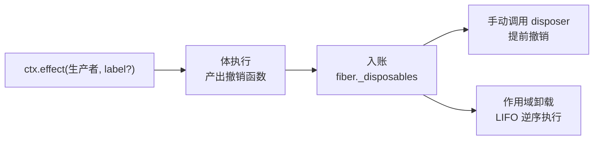

import { Canvas, Controls, Meta } from '@storybook/addon-docs/blocks';
import * as EffectsStories from './effects.stories';

<Meta of={EffectsStories} name="Docs" />

# 可逆副作用

插件不是装上就不动的：配置更新会整段重跑、依赖下线会停用、销毁会卸载（见[生命周期](?path=/docs/lifecycle--docs)）。所以 cordis 里的副作用不能「做完就完了」，而要连同它的撤销方式一起交给框架**记账**——作用域撤销时框架自动把已注册的副作用逐一回收。`ctx.effect()` 就是这个记账系统的入口：交出一个「副作用生产者」，拿回一个 disposer；作用域卸载或手动调用 disposer 时，已收集的撤销函数按后进先出执行。本课讲清 effect 的全部注册形态、返回值语义、撤销顺序与错误行为。

本课所有断言均按安装版本 cordis 4.0.0-rc.8 的源码（`fiber.ts` 的类型与 `Fiber.effect` / `_execute` 实现）逐一核对，并在 Node 与浏览器实测；官方 API 参考的 `fiber.effect` 条目与该版本一致。相邻主题的边界：销毁的全局时序与状态机见[生命周期](?path=/docs/lifecycle--docs)，事件监听（`ctx.on` 本身就是 effect 注册）见[事件](?path=/docs/events--docs)，fiber 运行时载体见[Fiber](?path=/docs/fiber--docs)，可逆性的论文形式化见[论文导读](?path=/docs/paper--docs)。



| 形态 | 最小写法 | 收集时机 | 注册返回时 |
| --- | --- | --- | --- |
| 函数 | `() => disposer` | 体同步执行后立即 | 已收集完毕 |
| 同步集合 | `() => [d1, d2]`、生成器 `yield` | 体同步执行后立即 | 已收集完毕 |
| Promise | `async () => disposer` | Promise 完成时 | 可能未完成 |
| 异步迭代器 | `async function*` + `yield` | 每个 `yield` 渐进入账 | 持续进行 |
| 空返回 | 体返回 `undefined` / `null` | 不收集 | 合法，无撤销 |

`ctx.effect(execute, label?)` 的第二参数 `label` 默认 `'anonymous'`，`fiber.getEffects()` 返回当前记账树（`{ label, children }[]`）。

## 快速上手

一个定时器副作用的最小闭环（Node.js ≥ 20 或浏览器，输出按 4.0.0-rc.8 实测）：

```ts
import { Context } from 'cordis';

const sleep = (ms: number) => new Promise((resolve) => setTimeout(resolve, ms));
const root = new Context();
const fiber = root.plugin((ctx) => {
  ctx.effect(() => {
    let beats = 0;
    const timer = setInterval(() => console.log('心跳', ++beats), 500);
    return () => {
      clearInterval(timer);
      console.log(`心跳已撤销（共跳动 ${beats} 次）`);
    };
  }, '心跳定时器');
});

await fiber;
await sleep(1600);
await fiber.dispose();
// 心跳 1 / 心跳 2 / 心跳 3 / 心跳已撤销（共跳动 3 次）
// dispose 之后不再有任何输出——副作用被完全撤销
```

两行就体现了模型：**注册即托管，撤销即回收**。撤销不需要写在插件外面，也不需要手写 try/finally——这正是「可逆」的工程面。

## 注册形态

`ctx.effect(execute, label?)` 会**立即执行** `execute` 并收集其产出的撤销函数（源码里 `ctx.effect` 委托 `ctx.fiber.effect`，是同一个函数）。类型定义（`fiber.d.ts` 原文）：

```ts
type Disposable<T = any> = () => T;
type SyncEffect<T> = Disposable<T> | Iterable<Disposable<T>, void, void>;
type AsyncEffect<T> = Promise<Disposable<T>> | AsyncIterable<Disposable<T>, void, void>;
type Effect<T> = SyncEffect<T> | AsyncEffect<T>;
```

官方 API 文档把 `Disposable` 写作 `() => void | Promise<void>`——语义相同：撤销函数可以返回 Promise，框架会等它完成再执行同组下一个。框架对返回值的**判别顺序**（源码 `_execute`）值得记住：

1. 是函数 → 同步形态，直接入账；
2. 是 `undefined` / `null` → 忽略（无副作用）；
3. 不是对象 → `TypeError: Invalid effect`（如返回数字、字符串）；
4. 有 `then` → Promise 形态，等它完成再收集解析值；
5. 有 `Symbol.iterator` → 同步集合，立即拉完迭代器；
6. 有 `Symbol.asyncIterator` → 异步迭代器，渐进收集；
7. 其余对象 → `TypeError: Invalid effect`。

cordis 自身的可逆注册全部走这个入口：`ctx.on()` 的监听注册（label 是 `ctx.on("…")`）、`ctx.provide()` 的服务注册、`ctx.plugin()` 的插件生命周期（label 是 `'ctx.plugin()'`——父插件销毁级联子插件的来源，见 2.5）。**effect 是 cordis 的通用记账原语**，不只是「注册定时器」的辅助函数。

### 函数

最小形态：体在 `ctx.effect()` 的调用栈里同步执行，返回的函数就是唯一的 disposer。

```ts
ctx.effect(() => {
  const ac = new AbortController();
  开始轮询(ac.signal);
  return () => ac.abort(); // 撤销函数
}, '轮询');
```

注册返回时体已执行完毕、撤销函数已入账。体返回 `undefined` / `null` 完全合法（表示这次没有要撤销的东西）；返回其他非函数值则按判别顺序抛 `TypeError: Invalid effect`。

### 同步集合

数组与生成器都是 `Iterable<Disposable>`，一次交出多个撤销函数：

```ts
// 数组：撤销时 [1] 先于 [0]（LIFO）
ctx.effect(() => [
  () => 断开A(),
  () => 关闭B(),
], 'A 与 B');

// 生成器：体在注册点被同步拉完，yield 的每个函数入账
ctx.effect(function* () {
  const a = 建立A();
  yield () => a.close();
  const b = 建立B(a);
  yield () => b.close();
}, '依赖链');
```

生成器形态的价值是**按依赖顺序创建、按逆序撤销**：先建 A 后建 B，撤销时先关 B 再关 A——正好是资源依赖的正确拆解方向。数组里混入非函数元素会在注册点抛 `TypeError`（判别顺序第 5 步逐项检查）。

### Promise

体是异步的（`async` 函数或返回 Promise）时，判别走 `then`：**注册返回时体可能还没完成**，撤销函数要等 Promise 完成后才入账。

```ts
ctx.effect(async () => {
  const conn = await 连接数据库();
  return () => conn.close(); // 完成时才入账
}, '数据库连接');
```

解析值必须是函数（或 `undefined` / `null`），否则视为非法 effect——错误去向见[错误处理](#错误处理)。需要等收集完成再继续时，`await` 注册的返回值（见[返回值](#返回值)）。

### 异步迭代器

`async function*` 产出的每个 `yield` 渐进入账，是长任务（轮询、订阅流、批量迁移）的天然形态——边运行边把「走到这一步要善后什么」登记下来：

```ts
ctx.effect(async function* () {
  while (true) {
    const task = await 启动下一批();
    yield () => task.cancel(); // 运行到哪一步，就把哪一步的善后登记下来
  }
}, '渐进收集');
```

中途撤销（手动或卸载）的行为：**等当前进行中的那次 `next()` 落定**——最后一次产出仍然入账并被回收——然后停止拉取。实测（第 3 个产出等待中调用 disposer）：

```text
产出1@33ms | 产出2@65ms | （此处手动撤销）产出3@97ms | 撤销3@97ms | 撤销2@97ms | 撤销1@97ms
```

边界：停止拉取后生成器停在挂起态，**体内 `finally` 不保证运行**（源码不调用迭代器的 `return()`）。善后逻辑必须放进 `yield` 的 disposer，不能只写在 `finally` 里。

下面的实例把五种形态装进同一个插件，读者注册 / 销毁、手动提前撤销两种形态、让 disposer 抛错，观察入账与撤销的完整过程：

<Canvas of={EffectsStories.Forms} />
<Controls of={EffectsStories.Forms} />

| 读者操作 | 可观察证据 |
| --- | --- |
| 等待初始加载 | 注册日志依次出现五种形态；「已收集待撤销」先跳到 6（函数 1 + 数组 2 + 生成器 2 + 插件体清理 1），20ms 后 Promise 形态 +1，此后每 900ms 异步迭代器再 +1；「心跳次数」每秒 +1；「effect 标签」显示五项 |
| 开「撤销心跳（函数形态）」 | 日志出现「手动调用 disposer()：函数形态立即撤销」与「函数形态撤销：心跳定时器已清除」；心跳停止增长；「effect 标签」少一项；之后销毁时不再出现该形态的撤销 |
| 开「撤销渐进收集（异步迭代器）」 | 日志出现「等待异步迭代器当前产出落定…」，随后第 N 个撤销函数入账并连同此前入账的逆序全部回收；「已收集待撤销」减去该项计数 |
| 开「disposer 抛错」再关「加载插件」 | 数组 [1]（LIFO 先于 [0]）抛错：`ctx.logger.error` 进日志、数组 [0] 被跳过（「已收集待撤销」停在 1 不归零）；其余形态照常回收；状态仍到 DISPOSED |
| 关「加载插件」（抛错开关关闭） | 日志按 LIFO 撤销全部：「插件体返回的清理」最先，生成器 d2 → d1、数组 [1] → [0]、函数形态相继同步执行，异步迭代器与 Promise 形态晚一个微任务出现；「已收集待撤销」随后归零 |
| 重新打开「加载插件」 | 新 uid、五形态重新入账；提前撤销开关需先关再开才再次触发 |
| 打开 Show code | 看到该 Canvas 实际执行的 `effect-forms.ts` |

## 返回值

`ctx.effect()` 的返回值类型是 `Disposable & PromiseLike<Disposable>`（官方 API 文档原话：回收副作用）——**一个既可调用、又可等待的 disposer**：

```ts
const dispose = ctx.effect(() => 建立连接(), '连接');

dispose();   // 调用：立即撤销（异步形态则等体完成后撤销）
dispose();   // 再次调用是 no-op——撤销是幂等的

const dispose2 = await ctx.effect(async () => {
  const conn = await 连接数据库();
  return () => conn.close();
}, '连接');
// await：等异步体收集完成，resolve 到 disposer 本身
// （官方文档原话：「它会返回一个新的 Disposable 函数」）
```

两个方向各有用途：

- **调用**：提前撤销。disposer 从 fiber 的记账列表中移除，之后作用域卸载时**不会重复执行**（实测：手动撤销后销毁插件，撤销函数只运行一次）。
- **等待**：对齐异步收集。异步形态的体失败时，错误只经 `await` 暴露（见[错误处理](#错误处理)）；不等它就继续，后续代码可能赶在副作用建立之前运行。

调用同步形态的 disposer 返回 `void` 或 Promise；调用异步形态的 disposer 返回 Promise（等当前进行中的体落定后再撤销）——需要确认撤销完成时 `await` 它。

## 撤销顺序

### 单个 effect 内部

一个 effect 收集到多个撤销函数时，执行顺序是**LIFO 串行**：列表逆序后逐个执行，第一个同步执行；若某个 disposer 返回 Promise，后续的排队等待它完成。实测（数组内两个异步 disposer，各耗时 30ms）：

```text
A2 启动@6ms | A2 完成@38ms | A1 启动@38ms | A1 完成@70ms
```

A2（数组末位）先执行，A1 等它完成才启动。资源依赖天然成立：后建立的先拆。

### 卸载的全局顺序

作用域卸载（`fiber.dispose()` 或重载的停用段）时，框架并发启动**各个 effect** 的撤销，单个 effect 内部保持上述串行——完整的三条顺序事实（LIFO 启动、同 effect 串行、跨 effect 并发）在[生命周期](?path=/docs/lifecycle--docs)已实测，本课补一条 effect 视角的细节：异步形态的撤销链要先等体的 Promise 落定（哪怕体早已完成），因此同批卸载日志里**同步形态的撤销先出现，异步形态晚一个微任务**。插件体直接 return 的清理函数入账最晚，所以总是最先执行。

### 嵌套与组合

外层 effect 的体里 `return` / `yield` 另一个 `ctx.effect()` 的返回值，会发生**所有权转移**：子 effect 从 fiber 的记账列表移除、标签成为外层 `getEffects()` 树的 child，外层撤销时级联撤销子 effect。框架内部就用这个模式组装能力（`ctx.mixin()` 逐个 yield accessor，`ctx.plugin()` 的生命周期挂在父 fiber 上）。手写组合：

```ts
ctx.effect(function* () {
  yield ctx.effect(() => 建立A(), 'A');
  yield ctx.effect(() => 建立B(), 'B');
}, 'A+B 组');
```

拿到「A+B 组」的 disposer 一调，A 与 B 连同各自的撤销一起回收（实测：外层提前撤销后子 effect 已撤销，无需等作用域卸载）；作用域卸载时同样级联。需要「把几个 effect 当一个整体提前拆掉」时用这个形态。

## 错误处理

三个失败点，三种去向（全部实测）：

| 失败点 | 行为 | 谁能看到错误 |
| --- | --- | --- |
| 同步体抛错 | 已收集项 LIFO 回滚，错误**原样重抛** | `ctx.effect` 的调用点，可 try/catch |
| 异步体失败（拒绝 / 解析为非函数） | 已收集项回滚，错误**被吞** | 只有 `await` 注册返回值才暴露 |
| disposer 抛错 | 中断**同 effect** 的后续 disposer | 手动调用→调用点；卸载路径→只进 `ctx.logger.error` |

同步体抛错最直观：注册点直接收到异常，此前已入账的撤销函数立即逆序回滚（实测输出：`撤销2（回滚） | 撤销1（回滚）` 后调用点捕获 `Error: 注册中途抛错`）。

异步体失败是**静默**的：`task.catch(dispose)` 消化了错误——不抛出、不进日志，只做回滚。`await ctx.effect(async体)` 会以原错误拒绝，这是唯一的暴露通道。

disposer 抛错的两种路径：手动调用时同步抛错直达调用点（异步 disposer 则是返回的 Promise 拒绝）；卸载路径被框架捕获后只写 `ctx.logger.error`（默认进内存缓冲，见 1.2），状态照常迁移、其他 effect 照常执行。但要注意**同 effect 内的后续 disposer 会被跳过**——这是「清理函数保持健壮」的硬理由。

## 注册门槛

注册的唯一门槛是**实例未被销毁**，不看状态枚举：源码 `assertActive()` 只检查 `fiber.uid !== null`。

| 注册时机 | 行为 |
| --- | --- |
| 插件体内（LOADING） | 正常——这是最常见的注册点 |
| ACTIVE 后的回调、定时器里 | 正常——晚注册的 effect 同样入账，卸载时一并撤销 |
| 重载的停用段（UNLOADING，uid 未变） | 正常——实测清理函数内注册成功，下次停用时回收 |
| 销毁路径中、已销毁实例的 ctx | 抛 `CordisError`（code `INACTIVE_EFFECT`，"cannot create effect on inactive context"） |
| FAILED 实例（uid 保留） | 正常——与「FAILED 可经 update 复活」（见 2.5）一致 |

另一个维度是**归属**：`ctx.effect` 委托 `ctx.fiber.effect`，副作用记在**调用点的 ctx** 所在的作用域上——在哪个上下文上注册，就随哪个作用域撤销（作用域模型见[上下文](?path=/docs/context--docs)）。把 `root` 存到模块作用域随处 `root.effect()`，副作用就会活到进程结束而不是插件结束。

## 最佳实践

- **串行保证与并发性能二选一。** 同一 effect 内的多个撤销保证 LIFO 串行；跨 effect 并发等待。顺序敏感的清理（依赖链、连接池关闭）合并进单个 effect（数组 / 生成器形态）；互相独立、耗时长的异步清理拆成多个 effect 并发结束。
- **需要「整组提前拆」用嵌套组合。** 把相关 effect 用生成器 yield 进一个外层 effect，外层 disposer 一调即级联；不需要提前拆时保持平铺，作用域卸载自会处理。
- **「注册完就要用」选同步形态或 await。** 异步形态注册返回时副作用可能还没建立——后续代码依赖它时，要么改写体为同步，要么 `const dispose = await ctx.effect(async体)` 对齐收集完成。
- **给 effect 起 label。** 长寿命应用的排查入口是 `fiber.getEffects()` 的记账树；默认 `'anonymous'` 的条目在树里没有辨识度。
- **disposer 保持健壮。** 抛错会中断同 effect 的后续清理；卸载路径上的错误只进内存日志，几乎无人看到。清理逻辑自身 try/catch，或保证幂等无害。

## 常见问题

- `ctx.effect(async () => { … })` 里的异步操作失败了，控制台什么都没有，副作用也不知道撤没撤。
  异步体失败是静默路径：已收集项会回滚，但错误不抛出也不进日志。`await` 注册的返回值（或 `await` 手动调用的 disposer）才能拿到原错误；对失败的体做诊断时以 `await` 为准。
- 用 async 函数注册 effect，插件销毁后副作用还在运行。
  async 形态的撤销函数必须**作为返回值交出**（或改用异步生成器 `yield`）；体内只启动副作用而不 return，收集到的是 `undefined`——空值被合法忽略，框架不会报警。
- 同一个 effect 里写了多个撤销函数，销毁时只执行了后注册的就停了。
  先执行的那个 disposer 抛错了：同一 effect 内串行链在抛错处中断，后续被跳过（跨 effect 不受影响）。让清理函数不抛错，或把不能互相拖累的清理拆进不同 effect。

## 总结回顾

摘要：

`ctx.effect(生产者, label?)` 是 cordis 的通用记账原语：立即执行生产者并收集其产出的撤销函数，`ctx.on`、`ctx.provide`、插件生命周期都走同一入口。生产者有五种形态——函数、同步集合（数组 / 生成器）、Promise、异步迭代器、空返回——按「函数 → 空值 → thenable → iterator → asyncIterator」判别，非法值抛 `TypeError`。返回值是可调用又可等待的 disposer：调用即提前撤销（幂等，且从记账移除、卸载不重复），`await` 即等异步收集完成并拿到 disposer。撤销顺序在同一 effect 内是 LIFO 串行，卸载时各 effect 并发启动、异步形态晚一个微任务；嵌套 yield 会转移所有权并级联撤销。同步体抛错重抛给调用点并回滚，异步体失败静默回滚、只有 await 能暴露，disposer 抛错中断同 effect 后续；注册门槛是 `uid` 而非状态，销毁后的 ctx 上注册抛 `CordisError`。

一句话：

> 副作用注册即托管：`ctx.effect()` 收走撤销函数记账，作用域卸载时按 LIFO 自动执行——不把撤销写成返回值，就没有撤销。

知识要点：

- `ctx.effect()` 接受哪五种形态？判别顺序是什么，什么返回值会抛 `TypeError: Invalid effect`？
- 注册返回时哪些形态已收集完毕、哪些可能没有？如何等异步形态收集完成？
- 返回的 disposer 有哪两种用法？提前撤销后再卸载会重复执行吗？
- 同一 effect 内多个撤销函数按什么顺序、什么方式执行？卸载时跨 effect 呢？
- 嵌套 yield 另一个 effect 的返回值会发生什么？框架自身哪里用了这个模式？
- 同步体抛错、异步体失败、disposer 抛错分别是什么表现？各自的错误暴露通道是什么？
- 什么时机注册 effect 会被拒绝？判断标准是状态枚举还是别的？

## 参考资料

- [官方 API 参考：Fiber.effect](https://github.com/cordiverse/docs/blob/main/zh-CN/api/core/fiber.md)——五种形态、返回值双重身份、异步迭代器中途撤销的文档语义（与 rc.8 源码一致）
- [官方理念：可逆的插件系统](https://github.com/cordiverse/docs/blob/main/zh-CN/guide/philosophy/disposable.md)——「副作用就是对资源的占用」与 effect/restore 的动机
- [官方设计文档：可逆作用 Revertible Effects](https://github.com/cordiverse/docs/blob/main/zh-CN/design/revertible-effects.md)——时间可组合性的形式化表述（论文导读的入口）
- [cordis 源码：packages/core](https://github.com/cordiverse/cordis/tree/master/packages/core)——`fiber.ts` 的 Effect 类型系统与 `Fiber.effect` / `_execute` 实现（本课按本地安装的 4.0.0-rc.8 逐项核对并实测）
