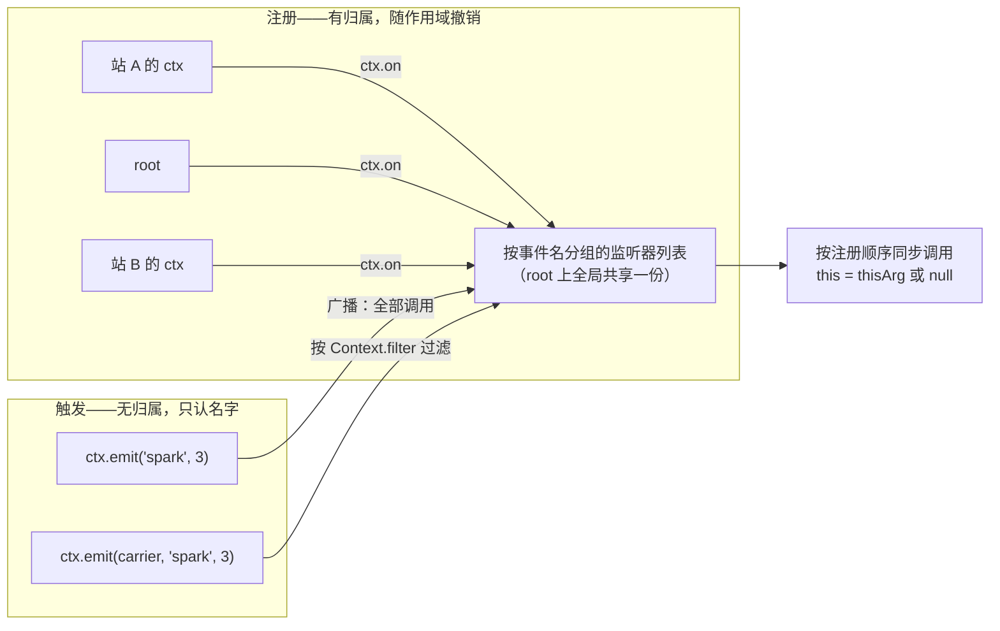

import { Canvas, Controls, Meta } from '@storybook/addon-docs/blocks';
import * as EventsStories from './events.stories';

<Meta of={EventsStories} name="Docs" />

# 事件

插件之间不 import 对方，怎么通信？答案是事件：任何作用域都可以按名字注册监听器（`ctx.on`），任何作用域都可以按名字触发（`ctx.emit`）。cordis 事件系统最重要的一个不对称是：**注册有归属，触发无归属**——监听器挂在注册它的作用域上，随插件销毁自动撤销；而分发只认事件名，不带额外参数时到达全树每一个同名监听器。[上下文](?path=/docs/context--docs)一课「插件 A 发出的事件，为什么插件 B 也收到」的疑问，机制层答案就在这里。本课讲清四件事：注册与撤销的完整形态（`on` / `once` / off / `prepend` / `global`）、`emit` 的触发语义、事件名的类型化（Events 声明合并），以及框架自身可观察的 `internal/*` 内置事件族。



| 成员 / 概念 | 形态 | 回查要点 |
| --- | --- | --- |
| `ctx.on(name, listener, options?)` | 返回 off 函数 | options 传 `true` 等价 `{ prepend: true }`；注册即作用域 effect |
| `ctx.once(name, listener, options?)` | 同 `on` | 首次触发前先自我撤销，再执行监听器 |
| `ctx.emit(name, ...args)` | `void` | 同步、按注册顺序、忽略返回值、抛错即中断 |
| `ctx.emit(thisArg, name, ...args)` | `void` | 先按 `thisArg[Context.filter]` 过滤监听器 |
| off 函数 | 幂等、可等待 | 撤销单次注册；实际返回 `undefined`（类型标注 `boolean`，见常见问题） |
| `EventOptions.prepend` | 默认 `false` | 插到监听列表最前，触发时最先 |
| `EventOptions.global` | 默认 `false` | 免除 thisArg 过滤，定向分发也能到达 |
| 分发方法全集 | `emit` / `waterfall` / `parallel` / `serial` / `bail` | 本课只讲 `emit`，模式对比见[分发模式](?path=/docs/dispatch-modes--docs) |
| 事件类型 | `declare module 'cordis'` | Events 接口声明合并，事件签名即监听器契约 |
| 内置事件 | `internal/*` 共 8 个 | 框架自身的观察窗，见「内置事件」 |

## 快速上手

最小闭环（浏览器与 Node 皆可运行，行为按 cordis 4.0.0-rc.8 核对）：

```ts
import { Context } from 'cordis';

// 1. 声明事件名：签名就是监听器契约（纯类型层，运行时不需要）
declare module 'cordis' {
  interface Events {
    spark(strength: number): void;
  }
}

const root = new Context();

// 2. 注册：返回的 off 用于手动撤销；通常不必调——作用域销毁时自动撤销
const off = root.on('spark', (strength) => {
  console.log(`收到 spark：强度 ${strength}`);
});

// 3. 触发：同步调用，参数原样传给每个监听器
root.emit('spark', 3); // 收到 spark：强度 3

// 4. 手动撤销后再触发，监听器不再到达
off();
root.emit('spark', 3); // （无输出）
```

这个闭环已经出现了本课全部主角：事件名、监听器、off 函数、`emit`。下面按「注册与撤销 → 触发与分发 → 类型化 → 内置事件」展开。

## 注册与撤销

### 注册：on 与 once

`on` / `once` 由 `ctx.events` 服务混入 ctx（混入列表还包括五个分发方法），签名：

```ts
ctx.on(name, listener, options?): () => boolean // 类型标注；实际返回值见下文与「常见问题」
ctx.once(name, listener, options?): () => boolean
```

- **name**：事件名。类型层是 `keyof Events`（见「类型化」）；运行时接受任意字符串，不做校验。
- **listener**：监听器，形态完全由事件签名决定——参数个数与类型来自签名，`this` 由触发方决定。
- **options**：传 `true` 是 `{ prepend: true }` 的简写；完整对象是 `EventOptions`。

| EventOptions | 默认 | 影响 |
| --- | --- | --- |
| `prepend` | `false` | `false` 压入列表尾部（默认，触发靠后）；`true` 插到最前（触发最先） |
| `global` | `false` | `true` 时免除 thisArg 过滤——定向分发（见「分发范围」）也能到达 |

注册的三个行为事实（源码 `events.ts` 的 `EventsService.on`）：

- **注册即 effect。** `ctx.on` 内部把监听器包进 `ctx.fiber.effect(...)`，effect 标签就是 `ctx.on("spark")`——监听器归属**调用点上下文**的 fiber，插件销毁或重载时随副作用列表一起撤销。可逆副作用的完整机制见[可逆副作用](?path=/docs/effects--docs)。
- **在已销毁的作用域上注册会抛错。** `fiber.assertActive()` 抛 `CordisError: cannot create effect on inactive context`（[上下文](?path=/docs/context--docs)已见过这条保护）。
- **同一个函数可以注册多次。** 每次调用都追加一个独立条目，触发几次就响应几次；一次 off 只撤销对应的那次注册。

`once` 是「触发一次后自动移除」的包装：内部先调用 off、再执行监听器，因此监听器第一次运行时它已经不在列表里。options 原样透传，`once` 同样可以 `prepend`。

### 撤销：off 函数

`ctx.on` 返回的函数就是手动撤销入口：

```ts
const off = ctx.on('spark', listener);
off(); // 移除这一次注册——监听器之外，插件与作用域的其他副作用都不受影响
off(); // 再调一次是安全空操作（幂等）
```

三个回查点：

- **幂等。** off 是 fiber effect 的撤销包装，第二次调用直接返回，不抛错；作用域已销毁后再调用残留的 off，同样是空操作。
- **可等待。** off 是 thenable，`await off()` 也会触发撤销并等待清理完成（异步清理场景有用；`on` 的撤销本身是同步的）。
- **返回值不要用。** 类型标注是 `() => boolean`，实际调用返回 `undefined`——类型与实现不一致，来龙去脉见「常见问题」。

手动撤销之外，绝大多数监听器交给作用域自动回收：插件销毁（`fiber.dispose()`）或重载（`fiber.update()`）时，该作用域注册的全部监听器随 effect 列表一并撤销——[上下文](?path=/docs/context--docs)与[生命周期](?path=/docs/lifecycle--docs)已多次观察过这个行为，本课实例再演示一次作为对照。

## 触发与分发

### emit：同步顺序调用

`ctx.emit(name, ...args)` 的完整语义，按源码 `EventsService.emit` 逐条核对：

| 语义 | 行为 |
| --- | --- |
| 返回值 | `void`——emit 不返回任何东西 |
| 同步性 | 同步调用，全部监听器执行完才返回（emit 自身不 await） |
| 顺序 | 按注册顺序；`prepend` 的监听器在列表头部 |
| 参数 | 触发参数原样传给每个监听器——同一组参数，不做变换 |
| `this` | 不带 thisArg 时为 `null`；带 thisArg 时为该对象（Context 会被包一层追踪代理） |
| 监听器返回值 | 完全忽略——返回 Promise 也不会被等待 |
| 监听器抛错 | 立即中断：后面的监听器不再执行，错误原样抛给 emit 的调用方 |

两条最容易踩的边界：

- **emit 里的异步监听器是脱管的。** 监听器返回的 Promise 没人等待，reject 时没有任何 catch——错误只会在控制台表现为未处理的 Promise 拒绝（见「常见问题」）。异步工作应该用 `ctx.parallel` 触发。
- **抛错会静默吞掉后续监听器。** 同步分发在抛错处中断，排在后面的监听器不知道事件发生过。需要「全部执行、错误汇总」同样用 `ctx.parallel`（抛 `AggregateError`）。

ctx 上可用的分发方法一共五个（`DispatchMode` 类型就是这五个字符串），本课只讲 `emit`；横向对比与选择依据是[分发模式](?path=/docs/dispatch-modes--docs)的主题：

| 方法 | 等待？ | 返回值 | 一句话 |
| --- | --- | --- | --- |
| `emit` | 否 | 无 | 同步顺序观察——本课 |
| `parallel` | 是 | 无 | 并行执行全部监听器，错误聚合成 `AggregateError` |
| `serial` | 是 | 首个有效返回值 | 按序执行，可短路 |
| `bail` | 否 | 首个有效返回值 | serial 的同步版 |
| `waterfall` | 否 | 包装结果 | 环绕式中间件，监听器拿到 `next` |

「有效返回值」指不为 `false` / `null` / `undefined`——`0` 与空字符串都算有效、同样触发短路（源码判定函数 `isBailed` 就是这么写的）。

### 分发范围：广播与过滤

先给机制。每棵上下文树只有一份监听器注册表：`EventsService` 挂在根上下文上（`ctx.events` 全树共享），内部是「事件名 → 监听器数组」的扁平表；`ctx.on` 时每个条目记下监听器、选项与**注册时的上下文**。分发前的过滤判断只有一行（源码 `_resolve`）：

```text
hook.global || 没有 thisArg || thisArg[Context.filter](hook.ctx) 为真 → 调用
```

由此得到两种分发范围。

**广播（默认）。** `ctx.emit('spark', 3)` 不带 thisArg——判断恒真，全树所有同名监听器都会被调用，无论注册自哪个插件、注册在树的哪一层。这就是「插件 A 发出的事件，插件 B 也收到」的机制层答案：**分发按名字全树到达，隔离的从来不是分发，而是监听器的归属**——销毁 B，撤销的是 B 的监听器；事件本身继续到达其他存活作用域。这是刻意设计：插件之间靠事件名这个契约通信，不需要互相 import，也不需要共同的父作用域。

**定向（带 thisArg）。** `ctx.emit(thisArg, 'spark', 3)` 的第一个参数是对象时被识别为 thisArg；若它携带 `Context.filter`（一个 symbol 键的过滤器），注册表先按过滤器筛选再调用——过滤器拿到每个监听器**注册时的 ctx** 做判断。框架内部就走这条路：`internal/service` 事件触发时带上按隔离域匹配的过滤器，只有同域上下文注册的监听器能收到（服务视角见[服务](?path=/docs/services--docs)）。业务代码要用时，最干净的载体是 `ctx.extend` 派生：

```ts
import { Context } from 'cordis';

const root = new Context();
let stationCtx: Context | null = null; // 站 A 插件运行时会被赋值

// 派生一个携带过滤器的载体：只放行「注册 ctx 是站 A」的监听器
const carrier = root.extend({
  [Context.filter]: (target: Context) => target === stationCtx,
});

root.on('spark', () => console.log('root 收到'));
// stationCtx = fiberA.ctx; stationCtx.on('spark', () => console.log('站 A 收到'));

root.emit(carrier, 'spark', 3); // 只有站 A 的监听器被调用
```

两条紧贴的边界：

- **`global: true` 是过滤的逃生舱。** 全局监听器不参与过滤，定向分发也照常到达——适合日志、调试这类「任何分发都不该漏掉」的观察者。
- **过滤器比较的是注册时的 ctx。** 插件销毁重建后拿到的是新 ctx 对象，过滤器闭包里要更新引用（下面实例的站 A 重建正是这种情况）。

下面的实例把注册形态与分发范围一起放进浏览器：root 与两个插件注册了八个 spark 监听器，覆盖普通、前置、全局、手动 off 四种注册形态；触发方式可在广播与定向之间切换，`internal/dispatch` 观察窗同步计数。

<Canvas of={EventsStories.Station} />
<Controls of={EventsStories.Station} />

| 读者操作 | 可观察证据 |
| --- | --- |
| 点击画布（广播） | 日志列出全部监听器的调用顺序，`a-prepend` 排最前——prepend 插到列表头部；「internal/dispatch 观察」与「spark 触发次数」同步 +1 |
| 调整「信号强度」再点击 | 每个监听器命中的参数随之变化——参数原样透传，每个监听器拿到同一组 |
| 切到「定向到站 A」点击 | 日志只剩站 A 的监听器与 `b-global`——过滤器按注册 ctx 筛选，global 免疫过滤 |
| 打开「b-error 抛错」后广播 | 日志停在 `b-error` 并标红「后续监听器未执行」；切到定向则不受影响——`b-error` 未被过滤器放行 |
| 打开「撤销 a-manual」 | 读数「a-manual 监听器」变「已撤销」；后续广播日志中 `a-manual` 消失，插件本身仍在线 |
| 关闭「站 A 在线」 | 站 A 四个监听器全部消失——随作用域自动撤销；广播日志只剩 root 与站 B |
| 重新打开「站 A 在线」 | 站 A 监听器恢复，`a-prepend` 仍插到最前、其余三个排在站 B 之后——prepend 与普通注册的顺序规则各自生效 |
| 打开 Show code | 看到该 Canvas 实际执行的 `event-station.ts` |

## 类型化

cordis 的事件类型集中在 `events.ts` 导出的 `Events` 接口里——它同时是**事件名字典**和**每个事件的监听器契约**。框架自己声明的 8 个 `internal/*` 事件就住在里面（见下节）；业务事件用声明合并追加，先例见[服务](?path=/docs/services--docs)对 Context 属性位的合并写法：

```ts
import { Context } from 'cordis';

declare module 'cordis' {
  interface Events {
    // 带命名空间的名字用引号包住；签名就是监听器类型
    'chat/message'(sessionId: string, content: string): void;
    'app/ready'(): void;
  }
}

const root = new Context();

root.on('chat/message', (sessionId, content) => {
  // 参数类型由事件签名自动推出：string、string
});
root.emit('chat/message', 's1', 'hello');
// root.emit('chat/message', 's1') // ✗ 类型错误：缺少 content
```

四个要点：

- **签名即契约。** 参数个数与类型、返回值、可选的 `this` 都写在事件签名里；`ctx.on` / `ctx.once` / 五个分发方法的泛型全部从 `Events[K]` 推导（实现里就是 `Parameters<Events[K]>`）。监听器返回值在 emit 下被忽略，但 `serial` / `bail` / `waterfall` 会消费它——签名里的返回值类型是在为[分发模式](?path=/docs/dispatch-modes--docs)做铺垫。
- **`this` 写在签名里时由 thisArg 提供。** 内置的 `internal/service` 就声明了 `this: Context`，触发方用带 thisArg 的分发喂它；普通 emit（不带 thisArg）下运行时 `this` 是 `null`——签名只约束类型层，不会让 emit 自动补一个 thisArg。
- **合并是纯类型层。** 不写声明也能跑——运行时对事件名不做任何校验（`ctx.events.on` 甚至接受 symbol），代价是没有补全与检查。多个模块对同一事件名给出不一致的签名时，TypeScript 按接口合并规则直接报错——契约冲突在编译期暴露。
- **命名建议带命名空间前缀。** 事件名是全树共享的契约，用 `'chat/message'`、`'app/ready'` 这类前缀避免撞名；`internal/` 前缀保留给框架。多包协作的类型安全模式在[TypeScript 模式](?path=/docs/ts-patterns--docs)展开。

## 内置事件

cordis 把框架自身的活动也做成了事件——`Events` 接口里 `internal/` 前缀的 8 个成员。前几课已多次拿它们当观察窗，这里给出全家族的回查表（签名按 4.0.0-rc.8 类型核对）：

| 事件 | 签名要点 | 分发 | 触发点 | 深入 |
| --- | --- | --- | --- | --- |
| `internal/plugin` | `(fiber)` | emit | 实例注册时（PENDING）与移除时（uid 已置 `null`） | 生命周期 |
| `internal/status` | `(fiber, oldValue)` | emit | 每次状态迁移，第二参是旧状态 | 上下文 / 生命周期 |
| `internal/service` | `this: Context`，`(name, value)` | emit（带隔离域过滤器） | 服务注册 / 移除 / 替换 | 服务 |
| `internal/update` | `this: Fiber`，`(config, noSave, next)` | waterfall | `fiber.update()` 配置更新 | 生命周期 |
| `internal/get` | `(ctx, name, error, next)` | waterfall | ctx 属性解析未命中时 | 源码导读 |
| `internal/set` | `(ctx, name, value, error, next)` | waterfall | ctx 属性赋值时 | 源码导读 |
| `internal/listener` | `this: Context`，`(name, listener, options)` | bail | 每次 `ctx.on` / `ctx.once` 注册前，返回真值可拦截注册 | 框架内部 |
| `internal/dispatch` | `(mode, name, args, thisArg)` | emit | 任意非 `internal/*` 事件分发前 | 本课实例的观察窗 |

三条使用边界：

- **`internal/*` 不触发 `internal/dispatch`。** 源码在分发前检查名字前缀，避免观察窗递归；`internal/dispatch` 因此是「业务事件流量」的准确计数——上面实例的读数正是用它。
- **官方 events.md 与 rc.8 有出入。** 文档列出的 `internal/error` / `internal/warn` / `internal/info` 日志事件在 rc.8 运行时不存在（4.0 的 logger 走服务不走事件）；文档的 `internal/update` 签名 `(fiber, config)` 也是 3.x 形态，实际是 `this` 为 fiber 的 waterfall（[生命周期](?path=/docs/lifecycle--docs)已实测）。以源码为准，升级时复核。
- **它们是内部契约。** 4.0 未稳定，`internal/*` 的签名与触发点可能随版本变化；用作调试观察窗很合适，长期依赖前先在目标版本上核对。

## 最佳实践

- **事件名当公共 API 设计。** 带命名空间前缀、避开 `internal/`；事件签名（参数、返回值）一旦有了消费方就不要随手改——它比函数签名更难迁移，因为触发方和监听方互相看不见。
- **监听器注册在自己的 ctx 上。** 分发本来就是全树的，「挂到别人作用域求隔离」没有意义还会泄漏；隔离靠监听器归属（销毁即撤销）与定向分发（thisArg 过滤）。
- **同步观察用 emit，异步工作用 parallel。** emit 下监听器返回的 Promise 是脱管的；异步监听器一律走 `ctx.parallel`，让框架等待并聚合错误。
- **off 不要跨重载缓存。** 插件重载后旧监听器已随作用域撤销，旧 off 只是空操作；重载语义下以「重新注册」为单位思考，而不是「复用监听器」。

## 常见问题

- `off()` 的返回值是 `undefined`，类型却写着 `() => boolean`？
  类型与实现不一致（4.0 未稳定）：类型沿用了内部 `unregister` 的 `true | undefined` 返回，但 `ctx.on` 实际返回的是 `fiber.effect` 的撤销包装——调用它执行的是清理链，同步场景下不做汇总返回、结果就是 `undefined`（官方文档则写 `() => void`，三处口径不一，以运行为准）。不要用返回值判断「是否移除成功」；需要观察时直接看 `ctx.events._hooks` 里对应事件名的列表长度。
- 用 emit 触发后，异步监听器里的报错「消失」了，控制台只有未处理的 Promise 拒绝？
  emit 完全忽略监听器返回值：返回的 Promise 没人等待，拒绝无人观察。异步监听器改用 `ctx.parallel` 触发——它用 `Promise.allSettled` 等全部监听器，把所有拒绝聚合成 `AggregateError` 抛给触发方。
- 某个监听器抛错后，后面的监听器都没执行，也没看到异常？
  看不到异常是因为错误抛给了 emit 的调用方——调用方没 catch 时只在控制台冒出。emit 是同步顺序调用，抛错即中断：排在该监听器后面的都不会运行。要「全部执行、错误汇总」用 `ctx.parallel`；要「按序执行、可短路」用 `ctx.serial`。
- 定向分发好像没生效，监听器还是全收到了？
  两个可能：`emit` 的首参不是对象（thisArg 识别只看首参类型，字符串事件名会被当作名字）；或载体没有携带 `Context.filter`——没有过滤器时判断恒真，等于广播。检查载体是否用 `ctx.extend({ [Context.filter]: ... })` 派生；另注意 `global: true` 的监听器本来就会穿透过滤器到达。

## 总结回顾

摘要：

事件是 cordis 插件间的广播通道：监听器用 `ctx.on` / `ctx.once` 注册（options 支持 `prepend` 与 `global`），注册即作用域 effect——随插件销毁与重载自动撤销，也可用返回的 off 函数手动、幂等地撤销。触发用 `ctx.emit`：同步、按注册顺序、参数透传、`this` 为 thisArg 或 `null`、完全忽略监听器返回值、抛错即中断并向触发方传播。分发只认事件名：不带 thisArg 时全树广播，带 `Context.filter` 载体的 thisArg 时按「监听器注册时的 ctx」过滤，`global: true` 免过滤。事件名与监听器契约由 `Events` 接口声明合并进类型层；框架自身活动以 8 个 `internal/*` 内置事件暴露，`internal/dispatch` 是业务事件流量的观察窗。

一句话：

> 注册有归属——监听器随注册它的作用域自动撤销；触发无归属——emit 按事件名全树到达，带 Context.filter 才收窄范围。

知识要点：

- `ctx.on` 的三个参数各自是什么形态？options 的两个布尔各控制什么？
- 「注册即 effect」意味着什么？监听器在什么时候会被自动撤销？
- off 函数有哪些性质？为什么不能用返回值判断移除成功？
- emit 的七条语义分别是什么？异步监听器在 emit 下的风险是什么？
- 广播为什么能跨插件到达？定向分发的过滤器拿到的是什么、怎么做一个载体？
- `global: true` 的监听器在两种分发范围下的行为差异是什么？
- Events 声明合并写给谁看？事件签名里能表达哪些东西？
- `internal/*` 家族有哪些成员？哪个是业务分发的观察窗？

## 参考资料

- [官方 API 参考：Events](https://github.com/cordiverse/docs/blob/main/zh-CN/api/core/events.md)：on / emit / 分发方法与内置事件的文档语义（`internal/error` 族与 `internal/update` 签名为 3.x 残留，正文已注明）
- [cordis 源码：packages/core/src/events.ts](https://github.com/cordiverse/cordis/blob/master/packages/core/src/events.ts)：`EventsService` 的注册、过滤与五种分发的实现，本课全部行为断言的最终依据（按安装的 4.0.0-rc.8 核对）
- [cordis 源码：packages/core/src](https://github.com/cordiverse/cordis/tree/master/packages/core/src)：`context.ts` 的 `Context.filter` 定义、`service.ts` 的 `internal/service` 定向触发与 `fiber.ts` 的 effect 撤销包装
- [cordis-primer（DeepSeek Harness 文档站）](https://deepseek-harness.github.io/deepseek-harness/reference/cordis-primer)：类型化事件与分发模式的引用方视角
