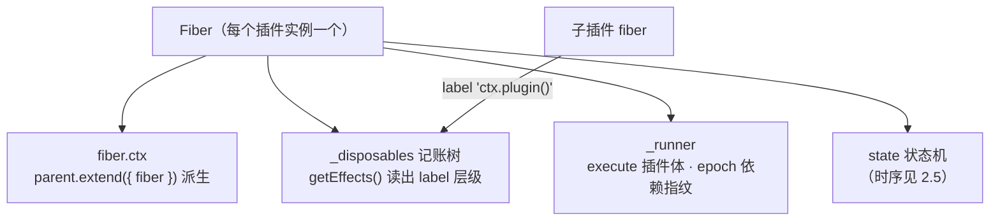

import { Canvas, Controls, Meta } from '@storybook/addon-docs/blocks';
import * as FiberStories from './fiber.stories';

<Meta of={FiberStories} name="Docs" />

# Fiber

前面各课从不同侧面用过同一个对象：注册插件拿到它（2.1）、上下文树由它派生（2.2）、生命周期状态机长在它身上（2.5）、`ctx.effect()` 的副作用记在它的账上（3.1）。本课把这个对象本身放到桌面上：**Fiber 是 cordis 4 的 effect 运行时载体——一个作用域的「上下文 + 副作用记账 + 状态」三合一的运行时单元。**三个直觉贯穿全课：

1. **注册插件就是在父 fiber 的账上记一笔**——源码里插件的生命周期本身就是一个 label 为 `'ctx.plugin()'` 的 effect；
2. **插件体与 `ctx.effect()` 走同一条执行管线**——收集、判别、入账的机制只有一套；
3. **卸载就是把账本逆序清空**——级联销毁、重载的「先整段撤销」，全部是同一套记账机制在跑。

所以 Fiber 是把注册表、上下文、生命周期、副作用四条线索收拢成一个机制全景的那一层。

本课所有断言均按安装版本 cordis 4.0.0-rc.8 的源码（`fiber.ts` 全文）逐一核对并在 Node 实测；官方 fiber.md 可交叉参考，其与该版本源码的三处不一致已在[生命周期](?path=/docs/lifecycle--docs)注明，本课以源码为准。相邻主题的边界：注册表与多实例见[插件](?path=/docs/plugins--docs)，上下文树见[上下文](?path=/docs/context--docs)，状态时序与重载链见[生命周期](?path=/docs/lifecycle--docs)，effect 的注册形态面见[可逆副作用](?path=/docs/effects--docs)，`inject` 与依赖响应见[依赖注入](?path=/docs/dependency-injection--docs)，设计理念与论文概念见[设计理念](?path=/docs/philosophy--docs)。



| 成员 | 取值 / 类型 | 回查要点 |
| --- | --- | --- |
| `fiber.uid` | 根 `0`、插件单调递增、销毁后 `null` | 注册门槛 `assertActive()` 的判定值（3.1） |
| `fiber.state` | `FiberState` 0–5 | 由 `_getState()` 推导，见[状态的推导](#状态的推导) |
| `fiber.ctx` | 专属子上下文 | `parent.extend({ fiber })` 派生；`ctx.fiber` 双向指回 |
| `fiber.name` | 就近向上取 `runtime.name`，根 `'root'` | logger 的默认名取 `hyphenate(fiber.name)` |
| `ctx.effect(body, label?)` | 委托 `fiber.effect` | `label` 默认 `'anonymous'`，进 `getEffects()` 树 |
| `fiber.getEffects()` | `{ label, children }[]` | 注册序；被外层 effect 收编的注册是 `children` |
| `fiber.dispose()` | 返回 `Promise` | 清空记账树（LIFO）；根 fiber 等效回到 `new Context()` |
| `await fiber` | fiber 本体 | 等加载 / 卸载收敛；FAILED 以原错误拒绝 |

## 快速上手

注册一个插件，读它 fiber 的账，再销毁（Node.js ≥ 20 或浏览器，输出按 4.0.0-rc.8 实测）：

```ts
import { Context } from 'cordis';

const root = new Context();
root.fiber.uid;   // 0 —— 根 fiber：new Context() 自带的作用域

const fiber = await root.plugin((ctx) => {
  ctx.effect(() => () => console.log('撤销：定时器'), '定时器');
});
fiber.uid;                 // 1 —— 每次 ctx.plugin() 创建一个新 fiber
fiber.getEffects();        // [{ label: '定时器', children: [] }]
fiber.ctx.fiber === fiber; // true —— 上下文与 fiber 双向指向
root.fiber.getEffects();   // [{ label: 'ctx.plugin()', children: [] }]
                          // —— 插件的生命周期是父 fiber 账上的一笔

await fiber.dispose();
// 撤销：定时器
fiber.getEffects();        // [] —— 记账树随卸载清空
root.fiber.getEffects();   // [] —— 父账同步摘除
```

十行代码里出现了本课的全部主角：新 fiber、专属上下文、记账树、`'ctx.plugin()'` 挂账、LIFO 清空。下面按「载体 → 记账 → 执行 → 状态」的顺序拆开。

## 运行时载体

源码里 `fiber.ts` 一个文件承载三块内容：**Fiber 类**（本课主体）、**effect 类型系统**（`Disposable` / `Effect` / `AsyncDisposable`，见[执行管线](#执行管线)）、**config 校验**（`ValidationError` 与 `resolveConfig`，注册与更新时调用，见[配置](?path=/docs/config--docs)）。Fiber 实例只有两个创建点：`new Context()` 创建根 fiber，`ctx.plugin()` 为每次调用创建一个插件 fiber——`extend` / `isolate` / `intercept` 派生的上下文复用原有 fiber，不创建新的（2.2）。

### 根 fiber 与插件 fiber

构造函数按是否传入 `runtime` 走两条路径，产物差异值得整表对照：

| | 根 fiber | 插件 fiber |
| --- | --- | --- |
| 创建点 | `new Context()` 内部 | `ctx.plugin()` 每次调用 |
| `uid` | `0`（永不置空） | `registry.counter` 单调递增，销毁后 `null` |
| 初始 `state` | 直接 `ACTIVE` | `PENDING` 起步，经状态机迁移（2.5） |
| `runtime` | `null` | 指向所属 `Plugin.Runtime`（2.1） |
| `_runner.execute` | 空函数 | 插件体（`new` 调用或直接调用，见 2.1） |
| `dispose` | `() => this.restart()`——回收全部副作用后复位，不进 DISPOSED | 父 fiber 上 label `'ctx.plugin()'` 的 effect 的 wrapper |
| `getEffects()` | 构造完成为空（见下文「label 体系」） | 插件体内注册的一切 effect |

插件 fiber 上最常回查的字段（载体视角）：

| 字段 | 说明 |
| --- | --- |
| `fiber.parent` | 注册时的父**上下文**（不是父 fiber）；`fiber.parent.fiber` 才是父 fiber |
| `fiber.inject` | 依赖声明的解析快照（`Inject.resolve` 的结果，2.4） |
| `fiber.config` | 经 `resolveConfig` 校验规范化后的配置 |
| `fiber.store` / `fiber._store` | 依赖快照：加载时把可用服务实现固化进 `store`，属性访问沿它解析（2.3 / 2.4） |
| `fiber.inertia` | 进行中的加载 / 卸载 Promise；`undefined` 表示空闲（见[状态的推导](#状态的推导)） |
| `fiber._hooks` | `internal/update` 等非全局钩子的记账（`Dict<DisposableList>`） |
| `fiber._disposables` | **effect 记账本**（`DisposableList`），本课主角 |
| `fiber._runner` / `fiber._error` | 内部：执行器（`execute` / `epoch` / `collect`）与启用失败的原因 |

`fiber.name` 的取值规则：从自己开始沿 `parent.fiber` 链**就近**取第一个非空的 `runtime.name`，到根返回 `'root'`——所以匿名插件的名字是父插件的名字，根下匿名插件叫 `'root'`。logger 的默认名就取 `hyphenate(fiber.name)`：插件不命名时，日志会以父插件（或 `root`）的名义出现。

### fiber 与上下文

fiber 与它的上下文**双向指向**：`ctx.fiber` 是当前上下文的作用域，`fiber.ctx` 是该作用域的上下文。连接点就是 2.2 已见的那行构造函数：

```ts
this.ctx = this.context = parent.extend({ fiber: this });
```

从本课的视角，这行代码说的是：**fiber 是子上下文的载体**——上下文树（原型链）上的每个「插件节点」，背后都挂着一个 fiber；「每个上下文一个 fiber」由此成立。调用点上下文决定记账归属（在哪个 `ctx` 上注册，就记进哪个 fiber 的账），机制来源也是它。

`ctx.effect` 与 `ctx.fiber.effect` 是同一个函数的两张皮，类型层与运行层各有一条证据（源码原文）：

```ts
// fiber.d.ts 的 declaration merging：Context 只投影 Fiber 的 effect 成员
interface Context extends Pick<Fiber, 'effect'> {
  fiber: Fiber
}

// ReflectService 构造函数：把 fiber 的成员混入 ctx（reflect 的初始化同理）
this.mixin('fiber', ['runtime', 'effect'])
```

最后一个容易踩的返回值细节：`ctx.plugin()` 返回的**不是 fiber 本身**，而是一个以 fiber 为原型的包装对象（`Object.create(fiber)` 加一个 `then`，指向 `fiber.await()`）。实测三件事：包装 `instanceof Fiber` 为 `true`（原型链继承）、`wrapped.ctx.fiber === fiber` 指向真身、`await ctx.plugin(...)` resolve 到 **fiber 本体**。日常代码无感，但在调试器里对比对象身份时会看到两个「fiber」。

## 记账树

`fiber._disposables` 是 fiber 的账本，类型是 `DisposableList`——一个以自增序号为键的有序容器（`cordis` 直接导出，框架自己的 `runtime.fibers` 也是它）：

| 成员 | 行为 |
| --- | --- |
| `push(value)` | 追加一笔，**返回摘除器**（调用即从账本删除这一笔） |
| `delete(value)` | 按值摘除（内部经 WeakMap 查序号） |
| `clear()` | 清空并**按逆序返回**全部条目——卸载 LIFO 的来源 |
| `[Symbol.iterator]` | 按注册序遍历 |

账本里记的是 `ctx.effect()` 的**返回值 wrapper**。每个 wrapper 携带一份记账元数据（用 `Symbol.for('cordis.effect')` 标记；静态属性 `Context.effect` 就是这个 symbol 本身——与方法 `ctx.effect` 同名不同物）。`fiber.getEffects()` 把整本账映射为元数据树：

```ts
interface EffectMeta {
  label: string
  children: EffectMeta[]
}
```

顶层条目按注册序排列；label 的来源体系（全部实测）：

| 注册来源 | label | 出现在谁的树上 |
| --- | --- | --- |
| `ctx.effect(fn)` 未传 label | `'anonymous'` | 注册点 fiber |
| `ctx.plugin(...)` | `'ctx.plugin()'` | **父** fiber——级联销毁的账面来源 |
| `ctx.on(name, ...)` | `'ctx.on("name")'` | 调用点 fiber |
| `new Service(ctx, name)` / `ctx.provide(name)` | `'ctx.provide("name")'` | 提供方 fiber |
| `ctx.logger.exporter(...)` | `'ctx.logger.exporter()'` | 调用点 fiber |
| `ctx.mixin(source, ...)`（内置服务初始化） | `'ctx.mixin("source")'` | 根 fiber，但随 `Context` 构造清账——所以根树构造后为空 |

三条读账规则（均实测）：

- **插件体 return 的清理函数不在树上。**它经 `_execute` 直接入账（无 label 元数据），LIFO 执行时照常参与、且因入账最晚而最先执行——但 `getEffects()` 看不见它（判据：箭头函数插件 return 了清理，树上只有 `ctx.effect` 的条目）。
- **嵌套注册会发生所有权转移。**外层 effect 的体里 `return` / `yield` 另一个 `ctx.effect()` 的返回值时，子 wrapper 从 fiber 账本**摘除**、挪进外层的局部列表、label 挂到外层 meta 的 `children`——所以树是层级结构，外层撤销时级联撤销子 effect（3.1「嵌套与组合」的机制面）。没有被外层收集的子注册保持为顶层条目。
- **账本只看注册，不看状态。**LOADING 中就能读到已入账的条目；FAILED 经 `update` 复活后，树随新一轮插件体重建。

下面的实例把一棵记账树放进浏览器：插件 `booked` 按开关注册三类 effect（自定义 label 的定时器、自动 label 的 `ctx.on`、带两个子 effect 的嵌套组合），左侧实时渲染 `fiber.getEffects()`，右侧记录入账与撤销。

<Canvas of={FiberStories.Ledger} />
<Controls of={FiberStories.Ledger} />

| 读者操作 | 可观察证据 |
| --- | --- |
| 等待初始加载 | 树自上而下长出「定时器」「ctx.on("pulse")」「资源组（children：资源A、资源B）」三个顶层节点；日志出现插件体运行、各条入账记录；「心跳次数」每秒 +1 |
| 点击画布 | 发出 `pulse` 事件，「pulse 响应」+1——监听器在账上才计数 |
| 关闭「定时器 effect」 | 日志出现「手动撤销：定时器（调用注册返回值）」与撤销执行，树少一个顶层节点，心跳停止；之后卸载不再执行它 |
| 关闭「资源组」 | 子 effect 级联撤销（日志「撤销：资源B」先于「撤销：资源A」——外层内部 LIFO），整个「资源组」节点连同 children 离树 |
| 关闭「加载插件」 | 日志按 LIFO 呈现整棵树的清空：「插件体 return 的清理（不在树上）」最先，随后资源B → 资源A → 定时器；树清空，`getEffects()` 为空 |
| 重新打开「加载插件」 | 新 uid、树重新生长；「资源组」等开关保持原状态照常生效 |
| 打开 Show code | 看到该 Canvas 实际执行的 `effect-ledger.ts` |

## 执行管线

`ctx.effect(execute, label?)`（即 `fiber.effect`）从调用到入账走六步（源码顺序）：

1. **门槛检查**：`assertActive()` 只看 `fiber.uid !== null`——不看状态枚举，销毁后的上下文抛 `CordisError`（code `INACTIVE_EFFECT`，3.1 已实测各时机）；
2. **备局部容器**：为这次注册建局部 `disposables` 数组与 `{ label, children }` 元数据节点（label 默认 `'anonymous'`）；
3. **执行与判别**：`_execute` 立即执行体，按「函数 → 空值忽略 → 非对象抛 `TypeError` → `then` → `Symbol.iterator` → `Symbol.asyncIterator` → 其余抛 `TypeError`」判别产物并收集（判别顺序的形态语义见 3.1）；
4. **同步失败**：体同步抛错时，已收集项 LIFO 回滚，错误**原样重抛**到调用点；
5. **异步兜底**：体是异步形态时得到 `task`，挂 `task.catch(dispose)` 保证失败时回滚已收集项；
6. **定义并入账**：构造 wrapper（闭包内含撤销逻辑与元数据标记），`push` 进 fiber 账本，摘除器存进局部列表——撤销执行后账本同步摘除这笔。

卸载（`fiber.dispose()`、重载停用段）执行的就是第 6 步入账的那些 wrapper：`_unload` 先 `clear()`（逆序拿到全部条目——LIFO 的账本来源），再对每个 wrapper **并发启动**撤销、单个 wrapper 内部串行（3.1 的三条顺序事实在账本侧的落点），每个错误单独进 `ctx.logger.error` 不上抛（2.5）。

### 同步路径

体是函数或同步集合（数组 / 生成器）时，`task` 为 `undefined`：体在 `ctx.effect` 的调用栈里执行完毕，disposer 即刻入账。调用返回的 wrapper 立即可用——撤销不经过任何等待。

### 异步路径

体返回 Promise 或异步迭代器时，管线持有一个 `task`：Promise 形态等它 resolve 后收集解析值；异步迭代器形态进入渐进收集循环，**每轮 `next()` 之前检查 runner 的 epoch 是否仍是注册时的值**——手动撤销或作用域重载会让 epoch 变化，循环随即停止、不再拉取，也**不调用迭代器的 `return()`**（体内 `finally` 不保证运行，3.1 已实测）。

异步体失败「静默」的机制在这里：第 5 步挂的 `task.catch(dispose)` 中，`dispose()` 做同步回滚时通常返回 `undefined`——**拒绝被这个 catch 的正常返回消化掉**；源码里再挂的第二层 `.catch((error) => ctx.logger.error(error))` 只承接回滚链自身的拒绝（某个异步 disposer 撤销失败时才会触发），不会看到体的原始错误。所以未 `await` 的异步体失败既不抛出也不进 logger，只有 `await` 注册返回值能拿到原错误——3.1 的结论在管线里能看到完整的因果。

### await 语义

返回值 wrapper 的类型是 `AsyncDisposable`：**既可调用、又可等待**。它的三个成员直接来自源码（简化后）：

```ts
const wrapper = () => {          // 调用：等体完成后撤销
  if (!runner.epoch) return;     //   epoch 门——幂等的来源
  runner.epoch = false;
  return task ? task.then(dispose) : dispose();
};
const disposeAsync = () => {     // await resolve 出的 disposer
  if (!runner.epoch) return;
  runner.epoch = false;
  return dispose();              //   不等 task——await 已等过
};
wrapper.then = (onFulfilled, onRejected) =>
  Promise.resolve(task).then(() => disposeAsync).then(onFulfilled, onRejected);
```

注意 `then` 的中间层是 `() => disposeAsync`——**返回函数本身而不是调用它**。这就是 await 语义的来源：

| 用法 | 得到什么 | 副作用状态 |
| --- | --- | --- |
| `const d = ctx.effect(体)` | wrapper（可调用） | 在账 |
| `await ctx.effect(体)` | `disposeAsync`（`function`） | **仍在账——await 是对齐收集，不是撤销** |
| `wrapper()` / `d()` | `Promise`（等撤销完成） | 已撤销，账本摘除这笔 |
| 再次调用任意一个 | `undefined`，无动作 | 幂等（epoch 门） |

同步形态 `await` 同样成立：`task` 为 `undefined`，`Promise.resolve(undefined)` 立即落到 `disposeAsync`——await 拿到 disposer，什么都不撤销。

一条必须知道的边界：**wrapper 只有 `then`，没有 `catch` / `finally`**——它是 PromiseLike 而不是 Promise（实测 `typeof wrapper.catch === 'undefined'`）。`ctx.effect(...).catch(...)` 直接抛 `TypeError`；异步形态的错误处理写 `try { await ctx.effect(...) } catch { ... }`，而 `await` 的拒绝值就是体的原错误。

下面的实例把双重身份放进浏览器：一个 900ms 后交出 disposer 的 async effect，三条泳道按时间呈现体的运行、记账变化与撤销执行。

<Canvas of={FiberStories.Awaitable} />
<Controls of={FiberStories.Awaitable} />

| 读者操作 | 可观察证据 |
| --- | --- |
| 等待初始注册 | 「effect 体」泳道出现「注册：async 体开始运行」；「记账」泳道随即出现「wrapper 已入账」——**树先有条目，disposer 后交出**；900ms 后体完成，「await 拿到」读数变为 `function`，副作用仍在账上 |
| 读状态行与读数 | 「wrapper.then / .catch」显示 `function / undefined`——可等待但不是 Promise |
| 关闭「注册 async effect」 | 「撤销」泳道出现「调用注册返回值：等体完成后撤销」，随后「撤销执行：慢建立」；记账树清空 |
| 开「体内抛错」后重新注册（await 开着） | 体失败 → 「await 拒绝：体内失败（唯一暴露通道）」出现在体泳道；记账树回空（失败回滚摘账） |
| 关掉「await 注册」，开「体内抛错」重新注册 | 体失败后**三条泳道都没有框架侧记录**，「logger 缓冲」读数保持 0——静默路径的直接证据 |
| 开「调用 disposer」（有 await 时） | 调用 await 拿到的 disposer：撤销执行一次；重复开关再调用无效果（幂等） |
| 打开 Show code | 看到该 Canvas 实际执行的 `awaitable-effect.ts` |

## 状态的推导

2.5 讲清了状态机的**时序**；本课补上它的**驱动**——`fiber.state` 不是独立维护的字段，而是每次迁移时按规则现算的（源码 `_getState`）：

```ts
if (this.uid === null) return DISPOSED;        // 销毁看 uid，不看成败
if (this._error) return FAILED;                 // 启用失败的原因
if (this._runner.epoch !== INACTIVE) return ACTIVE;  // 依赖指纹有效
return PENDING;                                 // 等待依赖
```

LOADING 与 UNLOADING 不在推导规则里——它们只在加载 / 卸载**进行中**由 `_updateState` 显式设置，进行段就是 `fiber.inertia` 指向的那个 Promise。`epoch` 是依赖指纹：无依赖为空串、有依赖为各依赖 fiber 的 uid 拼串（如 `':3:5'`）、依赖缺失为 `INACTIVE`。依赖上下线改变 epoch，`inertia` 链的尾部复查 epoch 决定下一步是收工、反向迁移还是丢弃——2.5 实测的「惰性状态合并 / 丢弃过渡期变更」就是这条链的行为（依赖语义见 2.4）。

每次状态变化发出 `internal/status` 事件（第二参数是旧状态）；**跨越 ACTIVE 边界**的迁移还会通知服务实现重算（2.4 依赖响应的入口）。`await fiber`（即 `fiber.await()`）的实现同样朴素：循环 `await this.inertia` 直到收敛，然后有 `_error` 抛 `_error`、否则返回自身。重载与销毁的完整时序、FAILED 经 `update` 复活等结论都在 2.5，本课不重复。

## 最佳实践

- **给 effect 起 label，排查时读账本。**长寿命应用里 `fiber.getEffects()` 是「这个作用域占着什么」的权威答案；`'anonymous'` 条目没有辨识度。框架内置注册的 label（`ctx.on` / `ctx.provide` 等）已可直接辨认。
- **要「整组提前拆」用嵌套组合。**生成器 yield 子注册会把它们收编为 `children`，外层一调即级联（形态见 3.1，机制见本课「记账树」）；不需要提前拆时保持平铺。
- **异步 effect 要对齐就 await，错误处理用 try/catch。**`await` 等收集完成并拿到 disposer（不会撤销）；wrapper 没有 `.catch`，链式调用会抛 `TypeError`。
- **诊断异步体失败以 await 为准。**未 await 的失败是设计内的静默回滚（logger 也没有记录），别在日志里找它。
- **要观察卸载顺序，在 disposer 里自己打点。**框架只保证顺序（账本逆序、同 effect 串行、跨 effect 并发），不产生逐条日志。

## 常见问题

- `fiber.getEffects()` 里找不到插件体 return 的清理函数。
  它经执行管线直接入账、不携带 label 元数据，所以不在树上；执行与撤销照常参与（且入账最晚、最先撤销）。要让它可见，改写成 `ctx.effect(() => () => 清理(), 'label')`。
- `await ctx.effect(...)` 之后副作用会不会被撤销？拿到的值是什么？
  不会。await 的语义是对齐收集：resolve 出的是一个**新的幂等 disposer**（`disposeAsync`）。但要注意它就是撤销函数——误调用会立即撤销。
- `ctx.effect(...).catch(...)` 抛 `TypeError: ctx.effect(...).catch is not a function`。
  返回值是 PromiseLike，只实现了 `then`。错误处理写 `try { await ctx.effect(...) } catch { ... }`。
- `root.fiber.getEffects()` 里出现 `'ctx.plugin()'` 是什么？
  每个插件的生命周期是父 fiber 账上的一笔：父作用域卸载时这笔被逆序执行，子插件随之级联销毁。看父账就能知道一个作用域挂了几个子插件。
- 记账树顶层少了一个注册过的 effect？
  它被某个外层 effect 的体 `return` / `yield` 收编了——从 fiber 账本转移到外层的局部列表，label 成为外层条目的 `children`。折叠读账时记得展开。
- 匿名插件的日志名是父插件名或 `root`，对不上号。
  `fiber.name` 就近上溯取 `runtime.name`。给插件命名（函数名 / `name` 属性），或直接用 `ctx.logger('自定义名')` 指定。

## 总结回顾

摘要：

Fiber 是 cordis 4 的 effect 运行时载体：每个插件实例一个 fiber，它同时是子上下文的载体（`parent.extend({ fiber })` 派生、`ctx.fiber` 双向指回、`ctx.effect` 是 `Pick` 投影）、副作用的账本（`DisposableList` 记账、`getEffects()` 读出 label 层级树）与重载 / 销毁的执行单元。注册插件就是在父 fiber 账上记一笔 label `'ctx.plugin()'` 的 effect，插件体与 `ctx.effect()` 走同一条六步管线（门槛 → 局部容器 → 判别收集 → 同步重抛 → 异步兜底 → 入账）；嵌套注册发生所有权转移成为 children，插件体 return 的清理入账但不上树；卸载把账本逆序清空、并发执行各 wrapper。返回值 AsyncDisposable 调用即（等体完成后）撤销、await 即对齐收集并 resolve 出新的幂等 disposer，只有 `then` 没有 `catch`；异步体失败的静默来自 `catch(dispose)` 对拒绝的消化。状态由 `_getState` 按 uid / `_error` / epoch 推导，惰性状态是 `inertia` 进行段，`await fiber` 等链收敛。

一句话：

> Fiber 把「一个作用域」收拢为可整体撤销的运行时单元：注册就是记账，卸载就是逆序清账——插件、effect、上下文在这一层合为一体。

知识要点：

- fiber 只在哪两个地方创建？根 fiber 与插件 fiber 的构造差异有哪些？
- `ctx.fiber` 与 `fiber.ctx` 如何互相指向？`ctx.effect` 与 `fiber.effect` 是什么关系？
- `fiber.getEffects()` 返回什么结构？框架内置注册的 label 各是什么、记在谁的账上？
- 哪些清理函数不会出现在记账树上？嵌套注册时子 effect 的归属发生什么变化？
- `ctx.effect()` 从调用到入账的六步是什么？卸载时账本按什么顺序、什么方式执行？
- await 一个 effect 注册得到什么？调用它和 await 它分别发生什么？为什么没有 `.catch`？
- 未 await 的异步体失败去了哪里？机制上为什么 logger 也看不到？
- `fiber.state` 的四个非惰性值按什么规则推导？惰性状态与 `inertia` 是什么关系？

## 参考资料

- [官方 API 参考：Fiber](https://github.com/cordiverse/docs/blob/main/zh-CN/api/core/fiber.md)——`fiber.effect` / `getEffects` / `then` / 状态机的文档语义（与 rc.8 源码的不一致处以源码为准，见 2.5 注记）
- [cordis 源码：packages/core](https://github.com/cordiverse/cordis/tree/master/packages/core)——`fiber.ts` 全文（Fiber 类、effect 类型系统、config 校验；本课按本地安装的 4.0.0-rc.8 逐项核对并实测）
