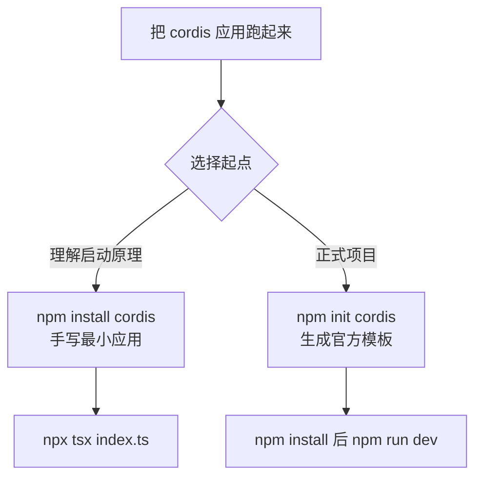
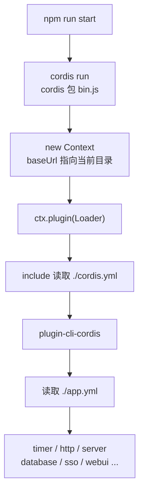

import { Canvas, Controls, Meta } from '@storybook/addon-docs/blocks';
import * as GettingStarted from './getting-started.stories';

<Meta of={GettingStarted} name="Docs" />

# 安装与运行

把一个 cordis 应用跑起来，需要的全部东西是 Node、一个入口文件和 npm 上的 `cordis` 包。本课给出两条路径：手写最小应用，用最少的代码看清「应用 = 根上下文 + 插件」的启动原理；用官方脚手架 create-cordis 生成模板工程，适合正式项目。读完本课，你应该能预测 `npm install cordis` 装进来什么、最小应用启动后发生什么、模板工程的 `npm run dev` 背后执行了什么。



| 关键对象 | 命令 / 默认值 | 回查要点 |
| --- | --- | --- |
| 核心包安装 | `npm install cordis` | npm dist-tag `latest` 当前即 4.0.0-rc.8；仅依赖 cosmokit 与 @standard-schema/spec |
| 手写应用运行 | `npx tsx index.ts` | 纯 JS 写成 index.mjs 时可 `node` 直跑 |
| 脚手架 | `npm init cordis [目录名]` | 模板取 @cordisjs/boilerplate 的 `latest`；engines 声明 Node ≥ 22 |
| 模板运行 | `npm run dev` / `npm run start` | 实为 `cordis run`；必须在含 cordis.yml 的应用目录执行 |
| 入口配置 | `cordis.yml` → `app.yml` | cordis 命令固定读取当前目录的 `./cordis.yml` |
| 版本线 | cordis 4.0（RC） | API 未稳定，升级前对照官方仓库核对 |

## 最小应用

先绕开一切工程设施，用裸的核心包把应用跑起来——这是理解启动原理的最短路径，也是把 cordis 嵌入已有工程时的接入方式。

### 安装核心包

```bash
mkdir cordis-hello && cd cordis-hello
npm init -y
npm install cordis
```

- 版本：npm dist-tag `latest` 当前就是 4.0.0-rc.8（本文核实于 2026-08），直接安装即得到 4.0 线，无需指定标签。
- 依赖面：核心包运行时仅依赖 cosmokit 与 @standard-schema/spec，构建产物没有任何 Node 专有 API，浏览器与边缘环境同样能跑——本课的交互实例就是在浏览器里直接运行 cordis。
- 可选 peer：`@cordisjs/plugin-loader` 与 `@cordisjs/plugin-include` 是可选 peerDependencies，只有配置驱动的组装方式才需要（见「官方模板」一节）。
- 版本约束：核心包未声明 engines，本手册按 Node ≥ 20 约定；脚手架另有 Node ≥ 22 的声明（见下文）。

### 运行最小应用

先建立模型：cordis 没有 app 对象，也没有 `start()` 或 `listen()`。一个应用就是一个根上下文，`new Context()` 创建；全部功能来自插件，`ctx.plugin(fn, config)` 加载；插件注册的副作用在卸载时由框架自动撤销。启动一个应用，就是「建上下文、加载插件」这两步。

```ts
// index.ts —— 手动组装的最小 cordis 应用
import { Context } from 'cordis'

// 1. 应用 = 一个根上下文；没有独立的 app 对象，也没有 start() / listen()
const ctx = new Context()

// 2. 功能全部来自插件：ctx.plugin(fn, config) 返回 fiber，await 即等到插件就绪
await ctx.plugin((ctx) => {
  console.log('应用已启动')

  // 3. 副作用交给 ctx.effect：返回清理函数，插件卸载时自动执行
  ctx.effect(() => {
    const timer = setInterval(() => console.log('tick'), 1000)
    return () => clearInterval(timer)
  })

  // 4. 插件函数本身的返回值也是一个 disposer
  return () => console.log('应用已停止')
})
```

运行与预期输出：

```bash
npx tsx index.ts
```

```text
应用已启动
tick
tick
^C
```

要点：

- 进程是否常驻由副作用决定：插件里没有定时器、服务器这类留住事件循环的东西时，入口执行完进程就退出——这不是启动失败（见常见问题）。
- 函数插件要用箭头函数写：cordis 依据 `prototype` 区分函数插件与类插件，`function` 声明会被当成类用 `new` 调用，其返回值不再作为 disposer 收集。插件的完整形态在[插件](?path=/docs/plugins--docs)课展开。
- 零工具链做法：写成纯 JavaScript 的 `index.mjs`，`node index.mjs` 直接运行；TypeScript 场景用 tsx 直跑，官方模板的开发脚本同样是 tsx。
- 换成 `ctx.logger.info()` 默认看不到输出，原因见常见问题。
- 可逆副作用的完整语义在[可逆副作用](?path=/docs/effects--docs)课展开，本课只需要「ctx.effect + 清理函数」这个形状。

下面的实例在本页浏览器环境中创建真实的根上下文并加载一个 heartbeat 插件，呈现「根上下文 → 插件 fiber」的运行时形状：插件状态徽章、fiber.uid、`ctx.registry.size`、心跳计数与日志流。

<Canvas of={GettingStarted.Interactive} />
<Controls of={GettingStarted.Interactive} />

| 读者操作 | 可观察证据 |
| --- | --- |
| 关闭「加载插件」 | 状态徽章变为 DISPOSED，registry.size 归 0，心跳计数冻结；日志先后出现「插件已停止（disposer 运行）」「心跳定时器已撤销」——插件返回值与 ctx.effect 的清理函数都被执行 |
| 修改「问候语」或「心跳间隔」 | 已加载的插件经 fiber.update 以新配置重启：节点下方 config 更新，日志出现新一轮启停记录，心跳按新间隔走动 |
| 打开 Show code | 看到该实例实际执行的核心源码 minimal-app.ts：new Context、ctx.plugin、ctx.effect 与 fiber.update / fiber.dispose |

config 变更会整体重启插件，这是 cordis 重载机制的入口，时机与完整流程在[生命周期](?path=/docs/lifecycle--docs)课展开。

## 脚手架 create-cordis

手写路径适合理解与嵌入；正式项目从官方脚手架起步。create-cordis 本体很薄：从 npm registry 拉取官方模板包 `@cordisjs/boilerplate` 的压缩包解到目标目录，把 package.json 的 `name` 改成项目名；交互只决定「是否清空目录、装不装依赖、跑不跑」。以下命令与行为整理自 create-cordis@0.3.0 源码，本手册未在课程环境实际执行脚手架。

### 交互流程

```bash
npm init cordis my-app
# 等价写法：yarn create cordis my-app / pnpm init cordis my-app
```

不带目录名时先询问 Project name（默认 `cordis-app`）；目标目录非空时询问是否清空；最后询问 Install and start it now?，确认则用你当前的包管理器执行 install 并紧接 `run start`。交互输出的示意（依据源码中的提示文案整理）：

```text
? Project name: cordis-app
  Registry server: https://registry.npmjs.org/
  Scaffolding project in my-app ...
  Done.

? Install and start it now? › No
  You can start it later by:

  cd my-app
  npm install
  npm run start
```

补充：

- 包管理器自动识别：install 与 start 命令跟随当前使用的 npm / yarn / pnpm。
- 用 yarn 1 创建时，脚手架会把本地 yarn 写入 `.yarn/releases` 并在 `.yarnrc.yml` 中固定版本。
- engines 声明 Node ≥ 22，npm 默认只警告不拦截。

### 命令行选项

| 选项 | 简写 | 作用 |
| --- | --- | --- |
| --template | -t | 模板包名，默认 `@cordisjs/boilerplate` |
| --ref | -r | 模板的 dist-tag 或版本号，默认 `latest` |
| --forced | -f | 目录非空时不询问，直接清空重建 |
| --git | -g | 生成后执行 `git init`；默认不初始化仓库 |
| --prod | -p | 生成单包生产形态：删除 package.json 中的 workspaces 与 devDependencies |
| --yes | -y | 跳过全部询问（含清空确认），且不安装、不启动 |

例如 `npm init cordis my-app -y` 直接生成后退出；`--prod` 适合不做本地插件开发的纯应用部署形态。

## 官方模板

脚手架生成的就是 `@cordisjs/boilerplate`（npm `latest` 为 0.6.1）。它是配置驱动的应用骨架：入口几乎不含代码，加载哪些插件全部写在两级 YAML 里；本地插件开发、构建与发布由工作区机制承担，在[工程组织](?path=/docs/project-structure--docs)课展开。

### 关键文件

| 文件 / 目录 | 职责 |
| --- | --- |
| package.json | 依赖与 scripts；workspaces 声明 `packages/*`、`external/*` 等本地插件目录 |
| cordis.yml | 启动入口：加载 plugin-cli 与 plugin-cli-cordis；prelude 先行加载 env 与 logger-console |
| app.yml | 应用插件清单：timer、http、server（端口 3140）、数据库 / SSO / WebUI 分组等 |
| docker/ | Dockerfile 与入口脚本，容器化部署 |
| tsconfig*.json、yakumo.yml | TypeScript 与构建工具 yakumo 的配置 |

两条核心 scripts（节选自模板 package.json）：

```json
{
  "scripts": {
    "dev": "cross-env NODE_ENV=development NODE_OPTIONS=\"--import tsx --import @cordisjs/unyaml\" cordis run",
    "start": "cordis run"
  }
}
```

### 启动与停止

在应用目录（含 cordis.yml 的目录）内执行：

```bash
npm install
npm run dev   # 开发模式：NODE_ENV=development，经 --import 注入 tsx 与 @cordisjs/unyaml
npm run start # 生产模式
```

`cordis run` 的启动链——`cordis` 命令来自 cordis 包的 bin.js，逻辑固定：



- 固定读取**当前目录**的 `./cordis.yml`，因此命令必须在应用目录执行。
- cordis.yml 里的 plugin-cli-cordis 通过配置项 `path: ./app.yml` 指向应用插件清单，由它完成第二级加载（这层归属依据模板配置推断）。
- 预期现象（按配置推断，未实际运行验证）：终端出现 logger-console 输出的插件日志，server 按 app.yml 的配置监听 3140 端口；Ctrl+C 停止。
- dev 脚本中的 `@cordisjs/unyaml` 以 `--import` 方式注入 Node，用于加载 YAML 形态的配置（依据其用法推断）。
- 配置文件的字段语义与热重载工作流属于 loader 体系，见[加载器](?path=/docs/loader--docs)课。

## 常见问题

- 手写应用打印完「应用已启动」就退出了，是不是没跑起来？
  不是失败。cordis 不提供让进程常驻的机制，进程是否继续运行取决于插件的副作用有没有留住事件循环——定时器、监听中的服务器都可以。保留上面的心跳定时器，或加载 server 类插件即可常驻。
- 调用 `ctx.logger.info(...)`，终端什么都没有打印？
  核心包的日志服务默认只写入内存缓冲（上限 1000 条），不接控制台。官方模板在 cordis.yml 的 prelude 中加载 `@cordisjs/plugin-logger-console` 后才有终端输出；手写应用先用 console.log，或按[官方插件](?path=/docs/official-plugins--docs)一课接入 logger-console。
- 官方文档写 `cordis start`，模板脚本却是 `cordis run`，该用哪个？
  4.0.0-rc.8 的 `cordis` 命令不解析子命令：bin.js 无视参数，固定执行「建根上下文 → 加载 Loader → 读 `./cordis.yml`」，两种写法等效。跟随模板用 `cordis run` 即可。

## 总结回顾

摘要：

本课从 `npm install cordis` 出发，用二十行内的代码搭出手写最小应用：`new Context()` 建根上下文，`ctx.plugin()` 加载函数插件，副作用经 `ctx.effect()` 注册并在卸载时撤销，进程是否常驻取决于副作用本身。正式项目一侧，create-cordis 从 registry 解开 @cordisjs/boilerplate 并改写 package.json；模板工程用 cordis.yml 与 app.yml 两级 YAML 描述插件，`npm run dev` 背后是 `cordis run` 的固定引导链。两条路径共享同一个「上下文 + 插件」模型。

一句话：

> 跑起一个 cordis 应用只有两步——`new Context()` 建根上下文、`ctx.plugin()` 加载插件；模板工程只是把第二步换成配置文件驱动。

知识要点：

- `npm install cordis` 装到的版本、依赖面与可选 peer 是什么？
- 最小应用里 new Context、ctx.plugin、ctx.effect 与 disposer 各扮演什么角色？
- 进程为什么常驻、又为什么会「跑完就退」？
- create-cordis 每个选项分别改变生成结果或流程的什么？
- `cordis run` 的启动链依次经过哪些文件，为什么必须在应用目录执行？

## 参考资料

- [官方文档：环境搭建（starter/setup）](https://github.com/cordiverse/docs/blob/main/zh-CN/guide/starter/setup.md)
- [官方文档：运行脚本（starter/scripts）](https://github.com/cordiverse/docs/blob/main/zh-CN/guide/starter/scripts.md)
- [官方模板 cordiverse/boilerplate](https://github.com/cordiverse/boilerplate)
- [npm：cordis](https://www.npmjs.com/package/cordis)
- [npm：create-cordis](https://www.npmjs.com/package/create-cordis)
- [cordiverse/cordis 仓库（bin.js 与核心源码）](https://github.com/cordiverse/cordis)
