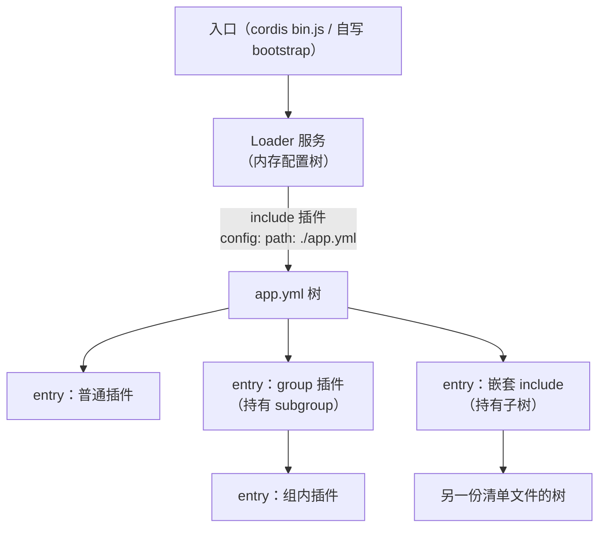
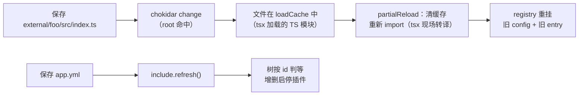

import { Meta } from '@storybook/addon-docs/blocks';

<Meta id="group-and-hmr" title="加载器与工程化/分组与热重载" name="Docs" />

# 分组与热重载

loader 把「跑哪些插件」变成一份配置清单（见[加载器](?path=/docs/loader--docs)）。本课讲三个长在这份清单之上的官方插件：**@cordisjs/plugin-group** 把一组插件收进一个可整体启停的单元；**@cordisjs/plugin-include** 把清单外置为 JSON/YAML 文件，负责读取、插值与写回；**@cordisjs/plugin-hmr** 监听文件变更，把「保存」翻译成插件级热重载。三者依赖文件系统与进程行为，本课证据全部来自 Node 实测——实验工程在本课 `lab/` 目录（`npm install` 后 `node bootstrap.mjs`、`node --expose-internals bootstrap-hmr.mjs` 等，见各脚本头部注释），实验会写回清单文件，脚本均先从模板恢复初始版。读完本课，`app.yml` 的每个字段、每次文件保存之后的运行时结果都应可预测。

| 插件 | npm 包（版本） | 职责 | 关键配置（默认值） |
| --- | --- | --- | --- |
| 分组 | `@cordisjs/plugin-group`（1.0.0） | 把多个插件变成一个可整体启停的单元 | `config` 即子清单数组；共享下方 EntryOptions 字段 |
| 清单 | `@cordisjs/plugin-include`（1.0.4） | 清单外置为文件，读取 / 插值 / 写回 | `path`（必需）；`initial`；`patches`；`enableLogs`（false） |
| 热重载 | `@cordisjs/plugin-hmr`（1.0.15） | 监听文件变更，驱动插件级重载 | `root`（`['.']`）；`ignored`（node_modules 等 4 项）；`debounce`（100ms）；`base`（`'.'`） |



每个清单文件是一棵**配置树**，树上的节点叫 **entry**；entry 的形状由 `EntryOptions` 定义：

| 字段 | 类型 / 缺省 | 作用 |
| --- | --- | --- |
| `id` | string（缺省自动生成 8 位随机 hex） | 身份键：清单 diff 判等与程序化寻址都靠它 |
| `name` | string（必需） | 插件名或路径（裸包名、`包名/src/index.ts`、`./相对路径`） |
| `config` | any | 插件配置；**group 项的 config 是子清单数组** |
| `disabled` | boolean | 停用；设在组上则整组级联停用 |
| `label` | 附加键（接口未声明，但读写均保留） | 显示名，供 WebUI 等消费 |
| `group` | boolean | 标记此项为分组；标记后此项自身恒视为启用 |
| `inject` / `isolate` / `intercept` | — | 依赖注入与服务隔离 / 拦截声明，见[加载器](?path=/docs/loader--docs) |

## 插件组装

三个插件共享同一个挂点：**loader 的配置树**。group 与 include 是树上的「操作者」——group 在树中加一层容器，include 把树落到文件；hmr 是外部「驱动者」——把文件系统变更翻译成树的更新与模块缓存的重置。它们的分工与依赖：

- **group** 的 npm 包只是转发：整个源码三行，`export default` 的是 `@cordisjs/plugin-loader` 内部的 `Group` 类——装它的意义是给清单一个可按名加载的包名（同 loader 的其余能力一样，见[加载器](?path=/docs/loader--docs)）。

  ```ts title=packages/group/src/index.ts（完整源码）
  import { Group } from '@cordisjs/plugin-loader'

  export default Group
  ```

- **include** 继承 loader 的 `EntryTree`，peer 依赖 `@cordisjs/plugin-loader` 与 `cordis`；它自己只额外依赖 `js-yaml`。
- **hmr** 是一个服务（服务名 `hmr`），`static inject = ['loader']`，依赖 chokidar（监听）、picomatch（忽略匹配）；peer 里还有 `@cordisjs/plugin-timer`（防抖用）。
- 三者都在清单里像普通插件一样声明——boilerplate 的 `app.yml` 里，Database / SSO / WebUI 三个分组就是三个 group 项，Development 分组装着 hmr 本身。

### 分组 group

「把多个插件当一个单元管理」在源码上就是一件事：group 项自己的 `config` 数组构成一个 **subgroup**，组内每个元素仍是同一棵树上的 entry。组带来的能力全部由此派生：

**写法与嵌套。** 官方模板 `app.yml` 的真实写法（节选）：

```yaml title=app.yml（boilerplate 节选）
- id: 8357f09b
  label: Database
  name: '@cordisjs/plugin-group'
  config:
    - id: 5b69b05e
      name: '@cordisjs/plugin-database'
    - id: 07c0d352
      name: '@cordisjs/plugin-database-sqlite'
      config:
        path: ./data/cordis.db
    - id: 0cb55d6c
      name: '@cordisjs/plugin-database-mysql'
      disabled: true
```

- 组内元素可以省略 `id`：加载时 loader 会原地生成 8 位随机 hex 并在下次写回时落盘（见下方实验）。
- 组可以嵌套：组的 `config` 里再放一个 group 项即可。嵌套不改变 entry 的寻址——id 路径中的 `:` 只跨**清单文件**边界（每棵 include 树一层前缀），组层级不进 id。

```text title=实测（lab/nested.yml：outer 组嵌 inner 组，inner 含 leaf 插件）
[plugin-c] apply
resolve app:leaf -> ./plugin-c.js          # 组层级不进 id 路径
resolve app:inner (group entry) -> Inner
--- disable outer group: cascade through nested groups ---
[plugin-c] dispose                        # 外层停用级联穿透嵌套
```

**启停级联。** 在组上设置 `disabled: true` 即整组停用，两条路径同效：已加载的组会作为插件实例被销毁（其子 entry 被逐一移除、副作用清理）；未加载或后续刷新的子项经 `Entry.disabled` getter 沿祖先链检查直接跳过（getter 沿 `entry.parent.ctx.fiber.entry` 逐层向上，任一祖先带 `disabled` 即命中）。反向不成立——组自身不受子项影响，标记了 `group: true` 的项更是恒视为启用。

```text title=实测（lab/bootstrap.mjs：运行时停用 app.yml 中的 Dev 组）
[plugin-a] apply, greet = hi zhanghuabin @ 2026   # 组外插件不受影响
[plugin-b] apply
--- disable group app:g1 via loader API ---
[plugin-b] dispose                               # LIFO 清理：插件体 disposer
[plugin-b] timer disposed                        # 之后是 ctx.effect 的清理
--- app.yml after write ---
- id: c31aee45
  name: ./plugin-a.js                             # 无 id 项被补上随机 id
  ...
- id: g1
  name: '@cordisjs/plugin-group'
  disabled: true                                  # 运行时改动写回清单
```

**程序化接口。** 实验中的 `ctx.loader.update('app:g1', { disabled: true })` 是 loader 树的通用 API（`update` / `create` / `remove`），以完整 id 寻址，修改后触发 `tree.write()` 把树写回清单文件——WebUI 管理插件走的正是这条路。在组（或任何 entry）上设置 `isolate` / `intercept` 可做分组级的服务隔离与事件拦截：entry 的隔离表以原型链挂在父上下文之后，组上的设置对子插件可见，语义见[加载器](?path=/docs/loader--docs)。

边界：文档《插件组与插件包》写的 `name: 'loader:group'` 是 CLI 内置形态的旧口径——当前源码里内置插件只认 `cordis:` 前缀且从未注册过 `loader:group`，照抄会报找不到模块；以 `@cordisjs/plugin-group` 为准（boilerplate 实证）。

### 清单 include

include 是「配置树 ↔ 文件」的桥。它的 `[Service.init]` 做三件事：读文件解析成 `EntryOptions[]`、应用补丁、`root.update(data)` 把数组灌进树。此后它同时承担**热更新入口**（`refresh()`）与**写回出口**（`write()`）。

**读取。** `path` 相对 include 插件所在上下文的 `baseUrl`（bin.js 启动时即当前目录）。文件扩展名只支持 `.json` / `.yaml` / `.yml`，其余直接抛 `extension not supported`。读取成功后，include 会把自己的 `ctx.baseUrl` 改写为**清单文件所在目录**——清单里的 `./相对路径` 插件名因此相对清单解析，嵌套 include 也由此形成分层基准。**热更新**走 `refresh()`：先比较文件内容字符串，未变则直接跳过；变了才重新解析并 `root.update()`，由树按 `id` 判等决定哪些插件需要启停（判等语义见[加载器](?path=/docs/loader--docs)）。

```text title=实测：内容判等的两极
# 无 id 清单 + 仅在文件头加一行注释 → refresh() 后全部插件重启
[plugin-a] dispose
[plugin-b] dispose / [plugin-b] apply / [plugin-a] apply ...   # 全量重启

# 带 id 清单 + 同样的注释 → refresh() 后无任何启停
(no dispose/apply above = entries diffed as unchanged)          # 深比较判等跳过
```

无 id 的项重新解析后以匿名符号为键，与内存中已生成 id 的旧项永不匹配——所以**手写清单请补全 id**，否则任何内容变更（哪怕一行注释）都会导致整清单重载。

**配置插值。** YAML 里 `!!js` 标记的标量会被解析成表达式节点，在**插件每次挂载或配置更新时**求值（`interpolate(entry.ctx, config)`，即以 entry 上下文为作用域 `eval`）。表达式里能用上下文上的服务，也能用 `process` 等全局——环境变量插值是它的常见用法：

```yaml title=app.yml（lab 实验清单节选）
- name: './plugin-a.js'
  config:
    greet: !!js "'hi ' + process.env.USER + ' @ ' + new Date().getFullYear()"
```

```text title=实测输出
[plugin-a] apply, greet = hi zhanghuabin @ 2026
```

两个边界：求值发生在插件侧而非解析侧，所以**嵌套在分组里的插件正常插值，但 group 项自身的 `config`（子清单数组）不插值**；写回时表达式以 `!!js '...'` 形式序列化保留，不会丢。

**补丁 patches。** `patches` 用来在不改动清单文件的前提下程序化调整本次加载的视图——WebUI、环境注入的典型手段。两种补丁：`insert`（向顶层或指定组内插入整段清单）与按 `id` 覆盖字段（可附 `name` 做一致性校验，不匹配则跳过并告警）：

```js title=实验：patches 同时插入插件与停用分组
await ctx.loader.create({
  id: 'app',
  name: '@cordisjs/plugin-include',
  config: {
    path: './app.yml',
    patches: [
      { insert: [{ id: 'd1', name: './plugin-c.js' }] }, // 顶层插入
      { id: 'g1', disabled: true },                      // 覆盖：整组停用
    ],
  },
})
```

```text title=实测输出（两条 apply 的先后经 Promise.all 并行，不保证顺序）
[plugin-c] apply                        # 来自 insert
[plugin-a] apply, greet = hi zhanghuabin @ 2026
                                        # g1 组被补丁停用，plugin-b 未加载
--- app.yml unchanged on disk: true ---  # 补丁不落盘

# 之后仅给清单文件加一行注释并触发 refresh()：
[plugin-c] dispose                      # 补丁未重放：insert 项从树上消失
[plugin-b] apply                        # g1 的 disabled 覆盖恢复启用
```

补丁只在初始加载（`[Service.init]`）时应用一次：清单热更新走 `refresh()`，重新解析出的干净数据直接灌树，**不重放补丁**——实测补丁效果在热更新后丢失，依赖 `patches` 的注入要意识到这一点。反向影响在写回：`write()` 写回的是**补丁后的视图**，补丁结果可能随之落盘。

**写回。** `write()` 先发出 `loader/config-update` 事件，再把当前树序列化写回——经「临时文件 + rename」原子落盘，且带防抖（`setTimeout(0)` 合并同帧多次写）。文件不可写（`access(W_OK)` 失败）时树退化为只读，写回抛 `cannot overwrite readonly config`。`initial` 配置项的本意是「文件不存在时用初始清单创建」，但 1.0.4 存在竞态：创建走的是异步防抖写，紧接着的读取必然扑空（见常见问题）。

### 热重载 hmr

HMR 回答一个问题：**保存一个文件之后，运行中的应用会怎么反应**。判定在 `watcher.on('change')` 里按固定顺序进行，共四类：

| 顺序 | 判定条件 | 动作 |
| --- | --- | --- |
| 1 | 变更文件属于 externals（主入口 `process.argv[1]` 的模块依赖树——入口自身与它引入的框架代码） | `loader.exit()`（见本节末尾的边界说明） |
| 2 | 变更文件在模块加载缓存 `loadCache` 里（被 import 过的模块） | 暂存 + 防抖后 `partialReload()`，即插件级热重载 |
| 3 | 变更文件是某个 include 子树的清单文件 | `include.refresh()` 重读清单 |
| 4 | 其余（语言包、静态资源等） | 触发 `hmr/change` 事件，交给关心的插件 |

监听由 chokidar 承担，`root` 相对 `base`（默认当前目录）解析；`ignored` 是 glob 数组，默认 `['**/node_modules', '**/.*', 'cache', 'data']`；`debounce` 默认 100ms，把一阵连续保存合并成一次重载。其余 chokidar 选项经 `ChokidarOptions` 透传。

**插件级重载。** 第二类是 HMR 的主路径，`partialReload()` 的步骤（源码归纳）：

1. **传播判定**：直接变更的文件记为 accepted，沿「谁 import 了它」的依赖者链向上传播——只要一条链上出现 accepted，链上模块全部 accepted；依赖者全为 declined 或属 externals / node_modules 的记为 declined。
2. **圈定插件**：按配置树收集全部插件名，解析成文件 URL——**插件入口是原子重载单元**；其模块依赖树中含有 accepted 文件的插件才进入重载名单。
3. **清缓存**：把 accepted 文件从 ESM `loadCache` 与 CJS `require.cache` 中删除（对 Node 24 的 LoadCache 用 `Map.prototype.delete` 兜底），原条目全部备份。
4. **重新 import**：重载名单里的插件入口逐一重新加载。失败则输出错误并**整体回滚**——恢复两套缓存，什么都不重载。
5. **重挂**：逐插件先 `registry.delete`（旧实例整段清理），再用**新模块 + 旧 fiber 的 config 与 entry 关联**重新 `registry.plugin`——热重载不丢配置、不动清单。任一插件重挂失败则回滚：清掉已挂的新插件，恢复缓存后重挂旧版本。
6. 发出 `hmr/reload` 事件，清空暂存集。

```text title=实测（lab/bootstrap-hmr.mjs，node --expose-internals 启动）
[plugin-a] apply, greet = hi zhanghuabin
[I] hmr watching [ '.' ]
[plugin-b] apply
[plugin-b] tick v1

# ① 改 plugin-b.js（tick v1 → v2）：
[I] hmr reload plugin at plugin-b.js
[plugin-b] dispose
[plugin-b] timer disposed      # 旧实例整段清理（LIFO）
[plugin-b] apply               # 新模块重挂，配置与 entry 保留
[plugin-b] tick v2

# ② 改 app-hmr.yml（给 a0 加 disabled: true）：
[plugin-a] dispose             # 走第三类：include.refresh() → 树判等 → 停用

# ③ 往 plugin-b.js 写入语法错误：
[W] hmr SyntaxError: Unexpected identifier 'is'
[plugin-b] tick v2             # 回滚生效：旧版本继续运行，进程不崩
                              # 修复保存后再次 reload，恢复热重载
```

实例重建意味着插件体闭包随之重建——跨重载要保留的状态放模块作用域或沉淀为服务，机制同[生命周期](?path=/docs/lifecycle--docs)课的 `fiber.update()` 结论。

**事件与边界。** 两个公开事件：`hmr/change(url)`（第四类变更，语言包 / 资源热更新的挂钩点）与 `hmr/reload(reloads)`（一次重载完成后的名单）。三个运行边界：

- **`--expose-internals`**：HMR 需要读 Node 内部的模块加载器（`ModuleLoader.fromInternal()`，Node 22/23 走 v1 接口、24+ 走 v2），不经该旗标启动时构造函数直接抛 `--expose-internals is required for HMR service`。错误堆栈里形如 `at file://...#h1` 的帧是 loader 伪造的定位——指向配置单元的 id 而非真实调用栈。经模板脚本启动时守护 worker 已自动附加该旗标（见[工程组织](?path=/docs/project-structure--docs)）。
- **externals 与进程重启**：主入口依赖树里的文件（框架自身、`cordis.yml` 引导链）变更走 `loader.exit()`。但基类 `Loader.exit()` 是**空方法**——裸 loader 应用实测改入口文件后既不重载也不退出；「框架文件变更 → 整进程退出重启」只在守护模式下成立：daemon 拉起 worker 的场景由宿主接管重启（链路见[工程组织](?path=/docs/project-structure--docs)）。
- **CJS 与错误美化**：CJS 模块同时留在 `require.cache`，第 3 步双清缓存正是为此；重 import 遇到 esbuild 构建失败（dev 场景的 TS 源码）时，错误会带 code-frame 源码定位输出。

## dev 工作流

把三件东西合起来就是官方模板的开发闭环——[工程组织](?path=/docs/project-structure--docs)课讲了脚本怎么写（`NODE_OPTIONS="--import tsx --import @cordisjs/unyaml"`），本课讲运行时发生了什么：

```yaml title=app.yml（boilerplate 的 Development 分组）
- id: 375b963c
  label: Development
  name: '@cordisjs/plugin-group'
  config:
    - id: e1e36558
      name: '@cordisjs/plugin-hmr'
      config:
        root:
          - external
          - packages
          - app.yml
```

`tsx` 让 Node 直接加载 `.ts` 源码，于是 `app.yml` 里以 `包名/src/index.ts` 引用的本地插件，其模块 URL 就是**源码文件本身**——这决定了 HMR 的行为链：



- `root` 指向 `external`、`packages` 与 `app.yml` 本身：前两者覆盖本地插件源码（第二类，插件级重载），`app.yml` 覆盖清单（第三类，配置重读）。
- `@cordisjs/unyaml` 解决的是从源码运行的插件 `import` 自己的 `.yml` 语言包，与 HMR 判定里的「非模块文件走 `hmr/change`」衔接。
- 生产运行（`npm start`）没有 `--import tsx`：`包名/src/index.ts` 形态的引用失效，本地插件走 `lib/` 构建产物。是否加载 hmr 由清单决定——boilerplate 的 Development 分组并无环境条件，不需要热重载的生产部署应显式停用该分组。

## 最佳实践

- **手写清单先补 id。** 无 id 项在每次文件热更新时都会被当成全新条目（匿名键永不匹配），一行注释的改动就能引发整清单重启；让 loader 写回一次（或手工补齐）把 id 落盘，之后只有实质字段变化才会触发重载。
- **`root` 只圈开发面。** 默认 `['.']` 监听整个工作目录，大仓库下既耗资源也易触发系统监听数上限；按 boilerplate 的做法圈定 `external`、`packages` 与清单文件本身。
- **分组按「同启同停」的域组织。** 分组的真正收益是级联启停与分组级 `isolate` / `intercept`（如 boilerplate 的 Database、SSO、WebUI 分组）；只在展示层分组而不利用启停语义时，平铺清单更简单。
- **`!!js` 只放纯表达式。** 插值在每次挂载时求值，副作用与外部请求会把配置加载变成不可控的执行点；环境变量、简单算术是它的合理边界，复杂逻辑写进插件本体。
- **补丁不落盘，但会随热更新丢失、随写回带出。** `patches` 只在初始加载时应用：清单热更新（`refresh()`）后补丁效果消失（实测），任何触发的 `write()` 又会把补丁后的视图写进文件——把它当作「本次启动的注入视图」而非持久配置。

## 常见问题

- 保存了文件，插件没有重载。
  依次核对：文件是否在 `root` 圈定范围内；是否命中默认 `ignored`（`node_modules`、点开头目录、`cache`、`data`）；连续保存是否被 100ms `debounce` 合并（稍等再看）；文件是否从未被 import——不在 `loadCache` 且不是清单、非模块文件只发 `hmr/change` 事件，默认无人处理。
- 改了清单文件，插件启停与预期不符。
  先确认 `id` 是否稳定：无 id 清单的任何内容变更都会全量重启（见最佳实践）。再确认变更是否是「实质字段」：include 先做文件内容判等，树再对 entry 做深比较——纯注释、键序调整都不会触发启停，这是判等语义的正确表现。
- include 配了 `initial`，文件不存在时应用直接启动失败。
  1.0.4 的已知竞态：初始清单经防抖异步写盘，紧接着的同步读取必然报 `ENOENT`，错误堆栈带 `#include项id` 伪造帧。先手工创建清单文件绕过；`initial` 语义待上游修复。
- HMR 重载后，插件里的计数器 / 缓存「丢了」。
  插件级重载是新模块 + 旧配置的整段重建，插件体闭包随之重建——与 `fiber.update()` 的表现一致。跨重载状态放模块作用域或沉淀为服务，见[生命周期](?path=/docs/lifecycle--docs)。
- 改了自己写的入口文件（或 `cordis.yml` 相关文件），进程既没重载也没退出重启。
  这类文件属于 externals（主入口依赖树），HMR 对它们调用 `loader.exit()`，而基类该方法是空实现——裸 loader 应用实测无任何反应。需要「框架文件变更即整进程重启」时走模板的守护模式（daemon 拉起 worker），见[工程组织](?path=/docs/project-structure--docs)。
- 启动即报 `--expose-internals is required for HMR service`。
  HMR 要读 Node 内部模块加载器，必须带该旗标运行。用模板的 `npm run dev`（守护 worker 自动附加）；绕过模板直接 `node` 启动时要手动加 `node --expose-internals`。

## 总结回顾

摘要：

三个官方插件共享「扩展 loader 的组装能力」这一挂点。group 的 npm 包是对 loader 内部 `Group` 类的转发：组项的 `config` 数组构成 subgroup，`disabled` 沿祖先链级联、程序化停用即销毁组实例并逐一清理子 entry；id 是清单 diff 与寻址的身份键，可嵌套但不进 id 路径。include 把树落到文件：按扩展名解析 JSON/YAML、把 `baseUrl` 改到清单目录、以内容判等决定是否重读、`!!js` 表达式在插件挂载时求值、`patches` 提供不落盘的程序化视图、`write()` 原子防抖写回。hmr 把文件变更分四类处理：externals 走 `loader.exit()`（基类为空、守护模式才有进程重启）、模块走插件级热重载（accepted 沿依赖者传播、插件为原子单元、双清 ESM/CJS 缓存、失败回滚、以旧 config 与 entry 重挂新模块）、清单文件走 `include.refresh()`、其余发 `hmr/change`。官方开发闭环 = tsx 直连源码（模块 URL 即 `.ts` 文件）+ HMR root 圈定源码与清单。

一句话：

> group 在配置树上加层、include 把树落到文件、hmr 把文件变更翻译成树上插件的重载——三者合起来，让「改一行、存一次」精确地变成「重启该重启的那个插件」。

知识要点：

- 三个插件各自的 npm 包名、职责与关键配置默认值是什么？
- group 的配置怎么写？组上 `disabled` 如何级联？id 在清单 diff 与寻址中扮演什么角色？
- include 支持哪些文件格式？`baseUrl` 何时被改写？`refresh()` 的内容判等与树的深比较各拦下什么？
- `!!js` 表达式何时求值、作用域是什么？group 自身的 config 为什么不插值？
- `patches` 的两种形态是什么？补丁会不会落盘？
- HMR 对一次文件变更按什么顺序分四类处理？各走什么动作？
- 插件级热重载的完整步骤是什么？失败时如何回滚？配置与 entry 关联如何保留？
- 为什么 HMR 需要 `--expose-internals`？externals 变更在裸应用与守护模式下表现为何不同？
- dev 闭环里 tsx、`root`、`包名/src/index.ts` 引用三者如何配合？

## 参考资料

- [cordiverse/cordis 仓库：packages/group、packages/include、packages/hmr 源码](https://github.com/cordiverse/cordis/tree/master/packages)（本课行为断言的一手依据，已对照 npm 最新发行版 1.0.0 / 1.0.4 / 1.0.15 核对）
- [cordiverse/cordis 仓库：packages/loader/src/config（Group、EntryTree、Entry、isolate）](https://github.com/cordiverse/cordis/tree/master/packages/loader/src)（分组与清单的运行时实现）
- [Cordis 文档：插件组与插件包（loader/group）](https://github.com/cordiverse/docs/blob/main/zh-CN/guide/loader/group.md)（`loader:group` 为旧口径，以源码为准）
- [Cordis 文档：模块热替换（loader/hmr）](https://github.com/cordiverse/docs/blob/main/zh-CN/guide/loader/hmr.md)（正文未完成，仅存目）
- [cordiverse/boilerplate 官方应用模板（app.yml 分组与 Development 组）](https://github.com/cordiverse/boilerplate)
- [npm：@cordisjs/plugin-hmr 发布元信息](https://www.npmjs.com/package/@cordisjs/plugin-hmr)（chokidar / picomatch 依赖与 peer 声明）
- [Node.js 文档：module customization hooks 与 --expose-internals](https://nodejs.org/api/cli.html#--expose-internals)（内部模块加载器的访问前提）
